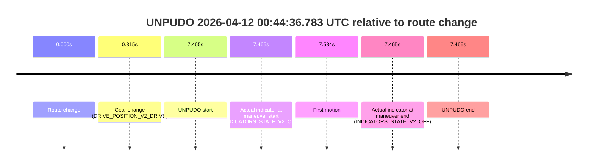
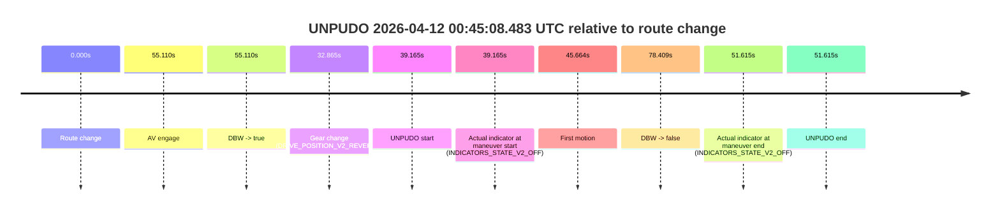
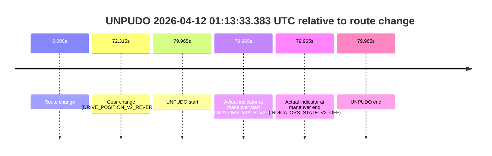

# Run Report: fme10010/2026-04-12--00-20-04--gen2-av-a36ec4af-d018-45ae-8338-4d87c07c7bb7

| Field | Value |
|---|---|
| Run ID | `fme10010/2026-04-12--00-20-04--gen2-av-a36ec4af-d018-45ae-8338-4d87c07c7bb7` |
| Date | `2026-04-12` |
| Model(s) | `lively-orange-horse` |
| Author | `guy.geva` |
| Event count | `11` |

## unpudo 2026-04-12 00:30:07.833 UTC

| Field | Value |
|---|---|
| Model | `lively-orange-horse` |
| Author | `guy.geva` |
| Run ID | `fme10010/2026-04-12--00-20-04--gen2-av-a36ec4af-d018-45ae-8338-4d87c07c7bb7` |
| Date | `2026-04-12` |
| Time (UTC) | `00:30:07.833` |
| Event type | `unpudo` |
| Disengagement type | `failed_to_unpudo` |
| Route change | `found` |
| Console | [run](https://console.sso.wayve.ai/run/fme10010/2026-04-12--00-20-04--gen2-av-a36ec4af-d018-45ae-8338-4d87c07c7bb7?id=&time-unixus=1775953807833306) |
| Foxglove | [segment](https://app.foxglove.dev/wayve-on-prem/p/prj_0dX18KZdVHg1fmmI/view?ds=foxglove-stream&ds.deviceName=fme10010&ds.start=2026-04-12T00%3A29%3A50.818244Z&ds.end=2026-04-12T00%3A32%3A50.427481Z&layoutId=lay_0e7VD4WIKDQGU73Y&time=2026-04-12T00%3A30%3A07.833306Z) |

### Event card: fail

- Fail: AV owns part of the segment, but the event still resolves as a model-performance failure under the AV-only scoring rule.

| Event | Time (UTC) | Delta from route change |
|---|---:|---:|
| Route change | 2026-04-12 00:30:00.818 | `0.000s` |
| AV engage | 2026-04-12 00:30:17.908 | `17.090s` |
| DBW -> true | 2026-04-12 00:30:17.908 | `17.090s` |
| Gear change (DRIVE_POSITION_V2_DRIVE) | 2026-04-12 00:30:01.133 | `0.315s` |
| UNPUDO start | 2026-04-12 00:30:07.833 | `7.015s` |
| Actual indicator at maneuver start (INDICATORS_STATE_V2_OFF) | 2026-04-12 00:30:07.833 | `7.015s` |
| First motion | 2026-04-12 00:30:07.862 | `7.044s` |
| DBW -> false | 2026-04-12 00:32:40.427 | `159.609s` |
| Actual indicator at maneuver end (INDICATORS_STATE_V2_OFF) | 2026-04-12 00:30:14.683 | `13.865s` |
| UNPUDO end | 2026-04-12 00:30:14.683 | `13.865s` |

| Metric | Value |
|---|---|
| Outcome | `fail` |
| Effective failure type | `failed_to_unpudo` |
| Route change status | `found` |
| DBW at event start | `false` |
| DBW at event end | `false` |
| Predicted gear at AV start | `DRIVE_POSITION_V2_DRIVE` |
| Actual gear at AV start | `DRIVE_POSITION_V2_DRIVE` |
| Predicted gear at event start | `DRIVE_POSITION_V2_DRIVE` |
| Actual gear at event start | `DRIVE_POSITION_V2_DRIVE` |
| Planned indicator direction | `INDICATORS_STATE_V2_LEFT_ON` |
| Controller indicator direction | `INDICATORS_STATE_V2_LEFT_ON` |
| Actual indicator direction | `INDICATORS_STATE_V2_OFF` |
| Actual indicator at maneuver end | `INDICATORS_STATE_V2_OFF` |
| Driver accel help in AV | `false` |
| Driver accel help timestamp | `n/a` |
| Max accel pedal pct in AV | `0.0%` |
| Max brake pedal pct in AV | `0.0%` |
| Max speed mps in AV | `0.000` |
| Route -> AV | `17.090s` |
| AV -> event start | `-10.075s` |
| AV -> first motion | `-10.046s` |
| AV duration before disengagement | `142.519s` |
| Trajectory waypoint count | `37` |
| Driving-plan step count | `11` |

The scored portion starts from the AV-owned window, not from the pre-AV setup. Route-change search in the stopped pre-event segment was `found`, with the baseline therefore set to route change. At the event anchor the model predicts `DRIVE_POSITION_V2_DRIVE` and the actual gear is `DRIVE_POSITION_V2_DRIVE`. The effective model outcome is `fail` because `failed_to_unpudo`.

### Resolution

| Field | Value |
|---|---|
| Final outcome | `fail` |
| Do we agree with this label? | `yes` |
| Source disengagement type | `failed_to_unpudo` |
| Resolved effective failure type | `failed_to_unpudo` |
| Confidence | `high` |

## unpudo 2026-04-12 00:36:15.683 UTC

| Field | Value |
|---|---|
| Model | `lively-orange-horse` |
| Author | `guy.geva` |
| Run ID | `fme10010/2026-04-12--00-20-04--gen2-av-a36ec4af-d018-45ae-8338-4d87c07c7bb7` |
| Date | `2026-04-12` |
| Time (UTC) | `00:36:15.683` |
| Event type | `unpudo` |
| Disengagement type | `failed_to_unpudo` |
| Route change | `found` |
| Console | [run](https://console.sso.wayve.ai/run/fme10010/2026-04-12--00-20-04--gen2-av-a36ec4af-d018-45ae-8338-4d87c07c7bb7?id=&time-unixus=1775954175683319) |
| Foxglove | [segment](https://app.foxglove.dev/wayve-on-prem/p/prj_0dX18KZdVHg1fmmI/view?ds=foxglove-stream&ds.deviceName=fme10010&ds.start=2026-04-12T00%3A35%3A42.768262Z&ds.end=2026-04-12T00%3A36%3A51.408728Z&layoutId=lay_0e7VD4WIKDQGU73Y&time=2026-04-12T00%3A36%3A15.683319Z) |

### Event card: fail

- Fail: AV owns part of the segment, but the event still resolves as a model-performance failure under the AV-only scoring rule.

| Event | Time (UTC) | Delta from route change |
|---|---:|---:|
| Route change | 2026-04-12 00:35:52.768 | `0.000s` |
| AV engage | 2026-04-12 00:36:21.708 | `28.940s` |
| DBW -> true | 2026-04-12 00:36:21.708 | `28.940s` |
| Gear change (DRIVE_POSITION_V2_DRIVE) | 2026-04-12 00:35:53.033 | `0.265s` |
| UNPUDO start | 2026-04-12 00:36:15.683 | `22.915s` |
| Actual indicator at maneuver start (INDICATORS_STATE_V2_LEFT_ON) | 2026-04-12 00:36:15.683 | `22.915s` |
| First motion | 2026-04-12 00:36:15.702 | `22.934s` |
| DBW -> false | 2026-04-12 00:36:41.408 | `48.640s` |
| Actual indicator at maneuver end (INDICATORS_STATE_V2_OFF) | 2026-04-12 00:36:19.633 | `26.865s` |
| UNPUDO end | 2026-04-12 00:36:19.633 | `26.865s` |

| Metric | Value |
|---|---|
| Outcome | `fail` |
| Effective failure type | `failed_to_unpudo` |
| Route change status | `found` |
| DBW at event start | `false` |
| DBW at event end | `false` |
| Predicted gear at AV start | `DRIVE_POSITION_V2_DRIVE` |
| Actual gear at AV start | `DRIVE_POSITION_V2_DRIVE` |
| Predicted gear at event start | `DRIVE_POSITION_V2_DRIVE` |
| Actual gear at event start | `DRIVE_POSITION_V2_DRIVE` |
| Planned indicator direction | `INDICATORS_STATE_V2_OFF` |
| Controller indicator direction | `INDICATORS_STATE_V2_OFF` |
| Actual indicator direction | `INDICATORS_STATE_V2_LEFT_ON` |
| Actual indicator at maneuver end | `INDICATORS_STATE_V2_OFF` |
| Driver accel help in AV | `false` |
| Driver accel help timestamp | `n/a` |
| Max accel pedal pct in AV | `0.0%` |
| Max brake pedal pct in AV | `0.0%` |
| Max speed mps in AV | `0.000` |
| Route -> AV | `28.940s` |
| AV -> event start | `-6.025s` |
| AV -> first motion | `-6.006s` |
| AV duration before disengagement | `19.700s` |
| Trajectory waypoint count | `36` |
| Driving-plan step count | `11` |

The scored portion starts from the AV-owned window, not from the pre-AV setup. Route-change search in the stopped pre-event segment was `found`, with the baseline therefore set to route change. At the event anchor the model predicts `DRIVE_POSITION_V2_DRIVE` and the actual gear is `DRIVE_POSITION_V2_DRIVE`. The effective model outcome is `fail` because `failed_to_unpudo`.

### Resolution

| Field | Value |
|---|---|
| Final outcome | `fail` |
| Do we agree with this label? | `yes` |
| Source disengagement type | `failed_to_unpudo` |
| Resolved effective failure type | `failed_to_unpudo` |
| Confidence | `high` |

## unpudo 2026-04-12 00:36:59.383 UTC

| Field | Value |
|---|---|
| Model | `lively-orange-horse` |
| Author | `guy.geva` |
| Run ID | `fme10010/2026-04-12--00-20-04--gen2-av-a36ec4af-d018-45ae-8338-4d87c07c7bb7` |
| Date | `2026-04-12` |
| Time (UTC) | `00:36:59.383` |
| Event type | `unpudo` |
| Disengagement type | `failed_to_unpudo` |
| Route change | `found` |
| Console | [run](https://console.sso.wayve.ai/run/fme10010/2026-04-12--00-20-04--gen2-av-a36ec4af-d018-45ae-8338-4d87c07c7bb7?id=&time-unixus=1775954219383308) |
| Foxglove | [segment](https://app.foxglove.dev/wayve-on-prem/p/prj_0dX18KZdVHg1fmmI/view?ds=foxglove-stream&ds.deviceName=fme10010&ds.start=2026-04-12T00%3A35%3A42.768262Z&ds.end=2026-04-12T00%3A39%3A57.747555Z&layoutId=lay_0e7VD4WIKDQGU73Y&time=2026-04-12T00%3A36%3A59.383308Z) |

### Event card: fail

- Fail: AV owns part of the segment, but the event still resolves as a model-performance failure under the AV-only scoring rule.

| Event | Time (UTC) | Delta from route change |
|---|---:|---:|
| Route change | 2026-04-12 00:35:52.768 | `0.000s` |
| AV engage | 2026-04-12 00:37:07.007 | `74.240s` |
| DBW -> true | 2026-04-12 00:37:07.007 | `74.240s` |
| Gear change (DRIVE_POSITION_V2_DRIVE) | 2026-04-12 00:36:53.333 | `60.565s` |
| UNPUDO start | 2026-04-12 00:36:59.383 | `66.615s` |
| Actual indicator at maneuver start (INDICATORS_STATE_V2_OFF) | 2026-04-12 00:36:59.383 | `66.615s` |
| First motion | 2026-04-12 00:36:59.422 | `66.655s` |
| DBW -> false | 2026-04-12 00:39:47.747 | `234.979s` |
| Actual indicator at maneuver end (INDICATORS_STATE_V2_OFF) | 2026-04-12 00:37:02.933 | `70.165s` |
| UNPUDO end | 2026-04-12 00:37:02.933 | `70.165s` |

| Metric | Value |
|---|---|
| Outcome | `fail` |
| Effective failure type | `failed_to_unpudo` |
| Route change status | `found` |
| DBW at event start | `false` |
| DBW at event end | `false` |
| Predicted gear at AV start | `DRIVE_POSITION_V2_DRIVE` |
| Actual gear at AV start | `DRIVE_POSITION_V2_DRIVE` |
| Predicted gear at event start | `DRIVE_POSITION_V2_DRIVE` |
| Actual gear at event start | `DRIVE_POSITION_V2_DRIVE` |
| Planned indicator direction | `INDICATORS_STATE_V2_LEFT_ON` |
| Controller indicator direction | `INDICATORS_STATE_V2_LEFT_ON` |
| Actual indicator direction | `INDICATORS_STATE_V2_OFF` |
| Actual indicator at maneuver end | `INDICATORS_STATE_V2_OFF` |
| Driver accel help in AV | `false` |
| Driver accel help timestamp | `n/a` |
| Max accel pedal pct in AV | `0.0%` |
| Max brake pedal pct in AV | `0.0%` |
| Max speed mps in AV | `0.000` |
| Route -> AV | `74.240s` |
| AV -> event start | `-7.625s` |
| AV -> first motion | `-7.585s` |
| AV duration before disengagement | `160.740s` |
| Trajectory waypoint count | `36` |
| Driving-plan step count | `11` |

The scored portion starts from the AV-owned window, not from the pre-AV setup. Route-change search in the stopped pre-event segment was `found`, with the baseline therefore set to route change. At the event anchor the model predicts `DRIVE_POSITION_V2_DRIVE` and the actual gear is `DRIVE_POSITION_V2_DRIVE`. The effective model outcome is `fail` because `failed_to_unpudo`.

### Resolution

| Field | Value |
|---|---|
| Final outcome | `fail` |
| Do we agree with this label? | `yes` |
| Source disengagement type | `failed_to_unpudo` |
| Resolved effective failure type | `failed_to_unpudo` |
| Confidence | `high` |

## unpudo 2026-04-12 00:44:36.783 UTC

| Field | Value |
|---|---|
| Model | `lively-orange-horse` |
| Author | `guy.geva` |
| Run ID | `fme10010/2026-04-12--00-20-04--gen2-av-a36ec4af-d018-45ae-8338-4d87c07c7bb7` |
| Date | `2026-04-12` |
| Time (UTC) | `00:44:36.783` |
| Event type | `unpudo` |
| Disengagement type | `failed_to_unpudo` |
| Route change | `found` |
| Console | [run](https://console.sso.wayve.ai/run/fme10010/2026-04-12--00-20-04--gen2-av-a36ec4af-d018-45ae-8338-4d87c07c7bb7?id=&time-unixus=1775954676783320) |
| Foxglove | [segment](https://app.foxglove.dev/wayve-on-prem/p/prj_0dX18KZdVHg1fmmI/view?ds=foxglove-stream&ds.deviceName=fme10010&ds.start=2026-04-12T00%3A44%3A19.318251Z&ds.end=2026-04-12T00%3A44%3A46.783320Z&layoutId=lay_0e7VD4WIKDQGU73Y&time=2026-04-12T00%3A44%3A36.783320Z) |

### Event card: fail

- Fail: AV owns part of the segment, but the event still resolves as a model-performance failure under the AV-only scoring rule.

| Event | Time (UTC) | Delta from route change |
|---|---:|---:|
| Route change | 2026-04-12 00:44:29.318 | `0.000s` |
| Gear change (DRIVE_POSITION_V2_DRIVE) | 2026-04-12 00:44:29.633 | `0.315s` |
| UNPUDO start | 2026-04-12 00:44:36.783 | `7.465s` |
| Actual indicator at maneuver start (INDICATORS_STATE_V2_OFF) | 2026-04-12 00:44:36.783 | `7.465s` |
| First motion | 2026-04-12 00:44:36.902 | `7.584s` |
| Actual indicator at maneuver end (INDICATORS_STATE_V2_OFF) | 2026-04-12 00:44:36.783 | `7.465s` |
| UNPUDO end | 2026-04-12 00:44:36.783 | `7.465s` |

| Metric | Value |
|---|---|
| Outcome | `fail` |
| Effective failure type | `failed_to_unpudo` |
| Route change status | `found` |
| DBW at event start | `false` |
| DBW at event end | `false` |
| Predicted gear at AV start | `n/a` |
| Actual gear at AV start | `n/a` |
| Predicted gear at event start | `DRIVE_POSITION_V2_DRIVE` |
| Actual gear at event start | `DRIVE_POSITION_V2_DRIVE` |
| Planned indicator direction | `INDICATORS_STATE_V2_OFF` |
| Controller indicator direction | `INDICATORS_STATE_V2_OFF` |
| Actual indicator direction | `INDICATORS_STATE_V2_OFF` |
| Actual indicator at maneuver end | `INDICATORS_STATE_V2_OFF` |
| Driver accel help in AV | `false` |
| Driver accel help timestamp | `n/a` |
| Max accel pedal pct in AV | `0.0%` |
| Max brake pedal pct in AV | `0.0%` |
| Max speed mps in AV | `0.000` |
| Route -> AV | `n/a` |
| AV -> event start | `n/a` |
| AV -> first motion | `n/a` |
| AV duration before disengagement | `n/a` |
| Trajectory waypoint count | `36` |
| Driving-plan step count | `11` |

The scored portion starts from the AV-owned window, not from the pre-AV setup. Route-change search in the stopped pre-event segment was `found`, with the baseline therefore set to route change. At the event anchor the model predicts `DRIVE_POSITION_V2_DRIVE` and the actual gear is `DRIVE_POSITION_V2_DRIVE`. The effective model outcome is `fail` because `failed_to_unpudo`.

### Resolution

| Field | Value |
|---|---|
| Final outcome | `fail` |
| Do we agree with this label? | `yes` |
| Source disengagement type | `failed_to_unpudo` |
| Resolved effective failure type | `failed_to_unpudo` |
| Confidence | `high` |

## unpudo 2026-04-12 00:45:08.483 UTC

| Field | Value |
|---|---|
| Model | `lively-orange-horse` |
| Author | `guy.geva` |
| Run ID | `fme10010/2026-04-12--00-20-04--gen2-av-a36ec4af-d018-45ae-8338-4d87c07c7bb7` |
| Date | `2026-04-12` |
| Time (UTC) | `00:45:08.483` |
| Event type | `unpudo` |
| Disengagement type | `none observed` |
| Route change | `found` |
| Console | [run](https://console.sso.wayve.ai/run/fme10010/2026-04-12--00-20-04--gen2-av-a36ec4af-d018-45ae-8338-4d87c07c7bb7?id=&time-unixus=1775954708483308) |
| Foxglove | [segment](https://app.foxglove.dev/wayve-on-prem/p/prj_0dX18KZdVHg1fmmI/view?ds=foxglove-stream&ds.deviceName=fme10010&ds.start=2026-04-12T00%3A44%3A19.318251Z&ds.end=2026-04-12T00%3A45%3A57.727474Z&layoutId=lay_0e7VD4WIKDQGU73Y&time=2026-04-12T00%3A45%3A08.483308Z) |

### Event card: fail

- Fail: the credited unpudo does not stay AV-owned. The event window starts with DBW false, and the maneuver outcome lands outside a clean AV-owned segment.

| Event | Time (UTC) | Delta from route change |
|---|---:|---:|
| Route change | 2026-04-12 00:44:29.318 | `0.000s` |
| AV engage | 2026-04-12 00:45:24.428 | `55.110s` |
| DBW -> true | 2026-04-12 00:45:24.428 | `55.110s` |
| Gear change (DRIVE_POSITION_V2_REVERSE) | 2026-04-12 00:45:02.183 | `32.865s` |
| UNPUDO start | 2026-04-12 00:45:08.483 | `39.165s` |
| Actual indicator at maneuver start (INDICATORS_STATE_V2_OFF) | 2026-04-12 00:45:08.483 | `39.165s` |
| First motion | 2026-04-12 00:45:14.982 | `45.664s` |
| DBW -> false | 2026-04-12 00:45:47.727 | `78.409s` |
| Actual indicator at maneuver end (INDICATORS_STATE_V2_OFF) | 2026-04-12 00:45:20.933 | `51.615s` |
| UNPUDO end | 2026-04-12 00:45:20.933 | `51.615s` |

| Metric | Value |
|---|---|
| Outcome | `fail` |
| Effective failure type | `completed_outside_av` |
| Route change status | `found` |
| DBW at event start | `false` |
| DBW at event end | `false` |
| Predicted gear at AV start | `DRIVE_POSITION_V2_DRIVE` |
| Actual gear at AV start | `DRIVE_POSITION_V2_DRIVE` |
| Predicted gear at event start | `DRIVE_POSITION_V2_DRIVE` |
| Actual gear at event start | `DRIVE_POSITION_V2_REVERSE` |
| Planned indicator direction | `INDICATORS_STATE_V2_OFF` |
| Controller indicator direction | `INDICATORS_STATE_V2_OFF` |
| Actual indicator direction | `INDICATORS_STATE_V2_OFF` |
| Actual indicator at maneuver end | `INDICATORS_STATE_V2_OFF` |
| Driver accel help in AV | `false` |
| Driver accel help timestamp | `n/a` |
| Max accel pedal pct in AV | `0.0%` |
| Max brake pedal pct in AV | `0.0%` |
| Max speed mps in AV | `0.000` |
| Route -> AV | `55.110s` |
| AV -> event start | `-15.945s` |
| AV -> first motion | `-9.446s` |
| AV duration before disengagement | `23.299s` |
| Trajectory waypoint count | `37` |
| Driving-plan step count | `11` |

The scored portion starts from the AV-owned window, not from the pre-AV setup. Route-change search in the stopped pre-event segment was `found`, with the baseline therefore set to route change. At the event anchor the model predicts `DRIVE_POSITION_V2_DRIVE` and the actual gear is `DRIVE_POSITION_V2_REVERSE`. The effective model outcome is `fail` because `completed_outside_av`.

### Resolution

| Field | Value |
|---|---|
| Final outcome | `fail` |
| Do we agree with this label? | `yes` |
| Source disengagement type | `none observed` |
| Resolved effective failure type | `completed_outside_av` |
| Confidence | `high` |

## unpudo 2026-04-12 00:48:30.133 UTC

| Field | Value |
|---|---|
| Model | `lively-orange-horse` |
| Author | `guy.geva` |
| Run ID | `fme10010/2026-04-12--00-20-04--gen2-av-a36ec4af-d018-45ae-8338-4d87c07c7bb7` |
| Date | `2026-04-12` |
| Time (UTC) | `00:48:30.133` |
| Event type | `unpudo` |
| Disengagement type | `failed_to_unpudo` |
| Route change | `found` |
| Console | [run](https://console.sso.wayve.ai/run/fme10010/2026-04-12--00-20-04--gen2-av-a36ec4af-d018-45ae-8338-4d87c07c7bb7?id=&time-unixus=1775954910133289) |
| Foxglove | [segment](https://app.foxglove.dev/wayve-on-prem/p/prj_0dX18KZdVHg1fmmI/view?ds=foxglove-stream&ds.deviceName=fme10010&ds.start=2026-04-12T00%3A48%3A07.018377Z&ds.end=2026-04-12T00%3A49%3A47.848069Z&layoutId=lay_0e7VD4WIKDQGU73Y&time=2026-04-12T00%3A48%3A30.133289Z) |

### Event card: fail

- Fail: AV owns part of the segment, but the event still resolves as a model-performance failure under the AV-only scoring rule.

| Event | Time (UTC) | Delta from route change |
|---|---:|---:|
| Route change | 2026-04-12 00:48:17.018 | `0.000s` |
| AV engage | 2026-04-12 00:48:33.927 | `16.909s` |
| DBW -> true | 2026-04-12 00:48:33.927 | `16.909s` |
| Gear change (DRIVE_POSITION_V2_DRIVE) | 2026-04-12 00:48:17.333 | `0.315s` |
| UNPUDO start | 2026-04-12 00:48:30.133 | `13.115s` |
| Actual indicator at maneuver start (INDICATORS_STATE_V2_OFF) | 2026-04-12 00:48:30.133 | `13.115s` |
| First motion | 2026-04-12 00:48:30.182 | `13.165s` |
| DBW -> false | 2026-04-12 00:49:37.848 | `80.830s` |
| Actual indicator at maneuver end (INDICATORS_STATE_V2_OFF) | 2026-04-12 00:48:34.033 | `17.015s` |
| UNPUDO end | 2026-04-12 00:48:34.033 | `17.015s` |

| Metric | Value |
|---|---|
| Outcome | `fail` |
| Effective failure type | `failed_to_unpudo` |
| Route change status | `found` |
| DBW at event start | `false` |
| DBW at event end | `true` |
| Predicted gear at AV start | `DRIVE_POSITION_V2_DRIVE` |
| Actual gear at AV start | `DRIVE_POSITION_V2_DRIVE` |
| Predicted gear at event start | `DRIVE_POSITION_V2_DRIVE` |
| Actual gear at event start | `DRIVE_POSITION_V2_DRIVE` |
| Planned indicator direction | `INDICATORS_STATE_V2_LEFT_ON` |
| Controller indicator direction | `INDICATORS_STATE_V2_LEFT_ON` |
| Actual indicator direction | `INDICATORS_STATE_V2_OFF` |
| Actual indicator at maneuver end | `INDICATORS_STATE_V2_OFF` |
| Driver accel help in AV | `false` |
| Driver accel help timestamp | `n/a` |
| Max accel pedal pct in AV | `0.0%` |
| Max brake pedal pct in AV | `0.0%` |
| Max speed mps in AV | `3.542` |
| Route -> AV | `16.909s` |
| AV -> event start | `-3.794s` |
| AV -> first motion | `-3.745s` |
| AV duration before disengagement | `63.921s` |
| Trajectory waypoint count | `37` |
| Driving-plan step count | `11` |

The scored portion starts from the AV-owned window, not from the pre-AV setup. Route-change search in the stopped pre-event segment was `found`, with the baseline therefore set to route change. At the event anchor the model predicts `DRIVE_POSITION_V2_DRIVE` and the actual gear is `DRIVE_POSITION_V2_DRIVE`. The effective model outcome is `fail` because `failed_to_unpudo`.

### Resolution

| Field | Value |
|---|---|
| Final outcome | `fail` |
| Do we agree with this label? | `yes` |
| Source disengagement type | `failed_to_unpudo` |
| Resolved effective failure type | `failed_to_unpudo` |
| Confidence | `high` |

## unpudo 2026-04-12 00:52:43.033 UTC

| Field | Value |
|---|---|
| Model | `lively-orange-horse` |
| Author | `guy.geva` |
| Run ID | `fme10010/2026-04-12--00-20-04--gen2-av-a36ec4af-d018-45ae-8338-4d87c07c7bb7` |
| Date | `2026-04-12` |
| Time (UTC) | `00:52:43.033` |
| Event type | `unpudo` |
| Disengagement type | `failed_to_unpudo` |
| Route change | `found` |
| Console | [run](https://console.sso.wayve.ai/run/fme10010/2026-04-12--00-20-04--gen2-av-a36ec4af-d018-45ae-8338-4d87c07c7bb7?id=&time-unixus=1775955163033303) |
| Foxglove | [segment](https://app.foxglove.dev/wayve-on-prem/p/prj_0dX18KZdVHg1fmmI/view?ds=foxglove-stream&ds.deviceName=fme10010&ds.start=2026-04-12T00%3A52%3A24.668512Z&ds.end=2026-04-12T00%3A53%3A51.629751Z&layoutId=lay_0e7VD4WIKDQGU73Y&time=2026-04-12T00%3A52%3A43.033303Z) |

### Event card: fail

- Fail: AV owns part of the segment, but the event still resolves as a model-performance failure under the AV-only scoring rule.

| Event | Time (UTC) | Delta from route change |
|---|---:|---:|
| Route change | 2026-04-12 00:52:34.668 | `0.000s` |
| AV engage | 2026-04-12 00:52:50.728 | `16.060s` |
| DBW -> true | 2026-04-12 00:52:50.728 | `16.060s` |
| Gear change (DRIVE_POSITION_V2_DRIVE) | 2026-04-12 00:52:35.533 | `0.865s` |
| UNPUDO start | 2026-04-12 00:52:43.033 | `8.365s` |
| Actual indicator at maneuver start (INDICATORS_STATE_V2_OFF) | 2026-04-12 00:52:43.033 | `8.365s` |
| First motion | 2026-04-12 00:52:43.082 | `8.414s` |
| DBW -> false | 2026-04-12 00:53:41.629 | `66.961s` |
| Actual indicator at maneuver end (INDICATORS_STATE_V2_OFF) | 2026-04-12 00:52:47.883 | `13.215s` |
| UNPUDO end | 2026-04-12 00:52:47.883 | `13.215s` |

| Metric | Value |
|---|---|
| Outcome | `fail` |
| Effective failure type | `failed_to_unpudo` |
| Route change status | `found` |
| DBW at event start | `false` |
| DBW at event end | `false` |
| Predicted gear at AV start | `DRIVE_POSITION_V2_DRIVE` |
| Actual gear at AV start | `DRIVE_POSITION_V2_DRIVE` |
| Predicted gear at event start | `DRIVE_POSITION_V2_DRIVE` |
| Actual gear at event start | `DRIVE_POSITION_V2_DRIVE` |
| Planned indicator direction | `INDICATORS_STATE_V2_OFF` |
| Controller indicator direction | `INDICATORS_STATE_V2_OFF` |
| Actual indicator direction | `INDICATORS_STATE_V2_OFF` |
| Actual indicator at maneuver end | `INDICATORS_STATE_V2_OFF` |
| Driver accel help in AV | `false` |
| Driver accel help timestamp | `n/a` |
| Max accel pedal pct in AV | `0.0%` |
| Max brake pedal pct in AV | `0.0%` |
| Max speed mps in AV | `0.000` |
| Route -> AV | `16.060s` |
| AV -> event start | `-7.695s` |
| AV -> first motion | `-7.646s` |
| AV duration before disengagement | `50.901s` |
| Trajectory waypoint count | `36` |
| Driving-plan step count | `11` |

The scored portion starts from the AV-owned window, not from the pre-AV setup. Route-change search in the stopped pre-event segment was `found`, with the baseline therefore set to route change. At the event anchor the model predicts `DRIVE_POSITION_V2_DRIVE` and the actual gear is `DRIVE_POSITION_V2_DRIVE`. The effective model outcome is `fail` because `failed_to_unpudo`.

### Resolution

| Field | Value |
|---|---|
| Final outcome | `fail` |
| Do we agree with this label? | `yes` |
| Source disengagement type | `failed_to_unpudo` |
| Resolved effective failure type | `failed_to_unpudo` |
| Confidence | `high` |

## unpudo 2026-04-12 00:56:58.783 UTC

| Field | Value |
|---|---|
| Model | `lively-orange-horse` |
| Author | `guy.geva` |
| Run ID | `fme10010/2026-04-12--00-20-04--gen2-av-a36ec4af-d018-45ae-8338-4d87c07c7bb7` |
| Date | `2026-04-12` |
| Time (UTC) | `00:56:58.783` |
| Event type | `unpudo` |
| Disengagement type | `failed_to_unpudo` |
| Route change | `found` |
| Console | [run](https://console.sso.wayve.ai/run/fme10010/2026-04-12--00-20-04--gen2-av-a36ec4af-d018-45ae-8338-4d87c07c7bb7?id=&time-unixus=1775955418783311) |
| Foxglove | [segment](https://app.foxglove.dev/wayve-on-prem/p/prj_0dX18KZdVHg1fmmI/view?ds=foxglove-stream&ds.deviceName=fme10010&ds.start=2026-04-12T00%3A56%3A09.668470Z&ds.end=2026-04-12T00%3A59%3A29.687463Z&layoutId=lay_0e7VD4WIKDQGU73Y&time=2026-04-12T00%3A56%3A58.783311Z) |

### Event card: fail

- Fail: AV owns part of the segment, but the event still resolves as a model-performance failure under the AV-only scoring rule.

| Event | Time (UTC) | Delta from route change |
|---|---:|---:|
| Route change | 2026-04-12 00:56:19.668 | `0.000s` |
| AV engage | 2026-04-12 00:57:10.827 | `51.159s` |
| DBW -> true | 2026-04-12 00:57:10.827 | `51.159s` |
| Gear change (DRIVE_POSITION_V2_DRIVE) | 2026-04-12 00:56:20.033 | `0.365s` |
| UNPUDO start | 2026-04-12 00:56:58.783 | `39.115s` |
| Actual indicator at maneuver start (INDICATORS_STATE_V2_OFF) | 2026-04-12 00:56:58.783 | `39.115s` |
| First motion | 2026-04-12 00:56:58.822 | `39.154s` |
| DBW -> false | 2026-04-12 00:59:19.687 | `180.019s` |
| Actual indicator at maneuver end (INDICATORS_STATE_V2_OFF) | 2026-04-12 00:57:02.833 | `43.165s` |
| UNPUDO end | 2026-04-12 00:57:02.833 | `43.165s` |

| Metric | Value |
|---|---|
| Outcome | `fail` |
| Effective failure type | `failed_to_unpudo` |
| Route change status | `found` |
| DBW at event start | `false` |
| DBW at event end | `false` |
| Predicted gear at AV start | `DRIVE_POSITION_V2_DRIVE` |
| Actual gear at AV start | `DRIVE_POSITION_V2_DRIVE` |
| Predicted gear at event start | `DRIVE_POSITION_V2_DRIVE` |
| Actual gear at event start | `DRIVE_POSITION_V2_DRIVE` |
| Planned indicator direction | `INDICATORS_STATE_V2_LEFT_ON` |
| Controller indicator direction | `INDICATORS_STATE_V2_LEFT_ON` |
| Actual indicator direction | `INDICATORS_STATE_V2_OFF` |
| Actual indicator at maneuver end | `INDICATORS_STATE_V2_OFF` |
| Driver accel help in AV | `false` |
| Driver accel help timestamp | `n/a` |
| Max accel pedal pct in AV | `0.0%` |
| Max brake pedal pct in AV | `0.0%` |
| Max speed mps in AV | `0.000` |
| Route -> AV | `51.159s` |
| AV -> event start | `-12.044s` |
| AV -> first motion | `-12.005s` |
| AV duration before disengagement | `128.860s` |
| Trajectory waypoint count | `36` |
| Driving-plan step count | `11` |

The scored portion starts from the AV-owned window, not from the pre-AV setup. Route-change search in the stopped pre-event segment was `found`, with the baseline therefore set to route change. At the event anchor the model predicts `DRIVE_POSITION_V2_DRIVE` and the actual gear is `DRIVE_POSITION_V2_DRIVE`. The effective model outcome is `fail` because `failed_to_unpudo`.

### Resolution

| Field | Value |
|---|---|
| Final outcome | `fail` |
| Do we agree with this label? | `yes` |
| Source disengagement type | `failed_to_unpudo` |
| Resolved effective failure type | `failed_to_unpudo` |
| Confidence | `high` |

## unpudo 2026-04-12 01:05:37.333 UTC

| Field | Value |
|---|---|
| Model | `lively-orange-horse` |
| Author | `guy.geva` |
| Run ID | `fme10010/2026-04-12--00-20-04--gen2-av-a36ec4af-d018-45ae-8338-4d87c07c7bb7` |
| Date | `2026-04-12` |
| Time (UTC) | `01:05:37.333` |
| Event type | `unpudo` |
| Disengagement type | `none observed` |
| Route change | `found` |
| Console | [run](https://console.sso.wayve.ai/run/fme10010/2026-04-12--00-20-04--gen2-av-a36ec4af-d018-45ae-8338-4d87c07c7bb7?id=&time-unixus=1775955937333305) |
| Foxglove | [segment](https://app.foxglove.dev/wayve-on-prem/p/prj_0dX18KZdVHg1fmmI/view?ds=foxglove-stream&ds.deviceName=fme10010&ds.start=2026-04-12T01%3A02%3A18.847551Z&ds.end=2026-04-12T01%3A09%3A38.587959Z&layoutId=lay_0e7VD4WIKDQGU73Y&time=2026-04-12T01%3A05%3A37.333305Z) |

### Event card: pass

- Pass: AV owns the credited unpudo through the official event window, the gear state is aligned at the anchor, and the vehicle moves without driver accelerator help in AV.

| Event | Time (UTC) | Delta from route change |
|---|---:|---:|
| Route change | 2026-04-12 01:05:31.668 | `0.000s` |
| AV engage | 2026-04-12 01:02:28.847 | `-182.821s` |
| DBW -> true | 2026-04-12 01:02:28.847 | `-182.821s` |
| Gear change (DRIVE_POSITION_V2_DRIVE) | 2026-04-12 01:05:31.983 | `0.315s` |
| UNPUDO start | 2026-04-12 01:05:37.333 | `5.665s` |
| Actual indicator at maneuver start (INDICATORS_STATE_V2_OFF) | 2026-04-12 01:05:37.333 | `5.665s` |
| First motion | 2026-04-12 01:05:37.382 | `5.714s` |
| DBW -> false | 2026-04-12 01:09:28.587 | `236.920s` |
| Actual indicator at maneuver end (INDICATORS_STATE_V2_OFF) | 2026-04-12 01:05:40.683 | `9.015s` |
| UNPUDO end | 2026-04-12 01:05:40.683 | `9.015s` |

| Metric | Value |
|---|---|
| Outcome | `pass` |
| Effective failure type | `none` |
| Route change status | `found` |
| DBW at event start | `true` |
| DBW at event end | `true` |
| Predicted gear at AV start | `DRIVE_POSITION_V2_DRIVE` |
| Actual gear at AV start | `DRIVE_POSITION_V2_DRIVE` |
| Predicted gear at event start | `DRIVE_POSITION_V2_DRIVE` |
| Actual gear at event start | `DRIVE_POSITION_V2_DRIVE` |
| Planned indicator direction | `INDICATORS_STATE_V2_LEFT_ON` |
| Controller indicator direction | `INDICATORS_STATE_V2_LEFT_ON` |
| Actual indicator direction | `INDICATORS_STATE_V2_OFF` |
| Actual indicator at maneuver end | `INDICATORS_STATE_V2_OFF` |
| Driver accel help in AV | `false` |
| Driver accel help timestamp | `n/a` |
| Max accel pedal pct in AV | `0.0%` |
| Max brake pedal pct in AV | `8.0%` |
| Max speed mps in AV | `10.239` |
| Route -> AV | `-182.821s` |
| AV -> event start | `188.486s` |
| AV -> first motion | `188.535s` |
| AV duration before disengagement | `419.740s` |
| Trajectory waypoint count | `37` |
| Driving-plan step count | `11` |

The scored portion starts from the AV-owned window, not from the pre-AV setup. Route-change search in the stopped pre-event segment was `found`, with the baseline therefore set to route change. At the event anchor the model predicts `DRIVE_POSITION_V2_DRIVE` and the actual gear is `DRIVE_POSITION_V2_DRIVE`. The effective model outcome is `pass` because `the credited maneuver stays AV-owned through the official event end`.

### Resolution

| Field | Value |
|---|---|
| Final outcome | `pass` |
| Do we agree with this label? | `yes` |
| Source disengagement type | `none observed` |
| Resolved effective failure type | `none` |
| Confidence | `high` |

## unpudo 2026-04-12 01:12:27.083 UTC

| Field | Value |
|---|---|
| Model | `lively-orange-horse` |
| Author | `guy.geva` |
| Run ID | `fme10010/2026-04-12--00-20-04--gen2-av-a36ec4af-d018-45ae-8338-4d87c07c7bb7` |
| Date | `2026-04-12` |
| Time (UTC) | `01:12:27.083` |
| Event type | `unpudo` |
| Disengagement type | `failed_to_unpudo` |
| Route change | `found` |
| Console | [run](https://console.sso.wayve.ai/run/fme10010/2026-04-12--00-20-04--gen2-av-a36ec4af-d018-45ae-8338-4d87c07c7bb7?id=&time-unixus=1775956347083293) |
| Foxglove | [segment](https://app.foxglove.dev/wayve-on-prem/p/prj_0dX18KZdVHg1fmmI/view?ds=foxglove-stream&ds.deviceName=fme10010&ds.start=2026-04-12T01%3A12%3A03.418238Z&ds.end=2026-04-12T01%3A12%3A59.566910Z&layoutId=lay_0e7VD4WIKDQGU73Y&time=2026-04-12T01%3A12%3A27.083293Z) |

### Event card: fail

- Fail: AV owns part of the segment, but the event still resolves as a model-performance failure under the AV-only scoring rule.

| Event | Time (UTC) | Delta from route change |
|---|---:|---:|
| Route change | 2026-04-12 01:12:13.418 | `0.000s` |
| AV engage | 2026-04-12 01:12:37.147 | `23.729s` |
| DBW -> true | 2026-04-12 01:12:37.147 | `23.729s` |
| Gear change (DRIVE_POSITION_V2_DRIVE) | 2026-04-12 01:12:13.783 | `0.365s` |
| UNPUDO start | 2026-04-12 01:12:27.083 | `13.665s` |
| Actual indicator at maneuver start (INDICATORS_STATE_V2_OFF) | 2026-04-12 01:12:27.083 | `13.665s` |
| First motion | 2026-04-12 01:12:27.102 | `13.684s` |
| DBW -> false | 2026-04-12 01:12:49.566 | `36.149s` |
| Actual indicator at maneuver end (INDICATORS_STATE_V2_OFF) | 2026-04-12 01:12:32.083 | `18.665s` |
| UNPUDO end | 2026-04-12 01:12:32.083 | `18.665s` |

| Metric | Value |
|---|---|
| Outcome | `fail` |
| Effective failure type | `failed_to_unpudo` |
| Route change status | `found` |
| DBW at event start | `false` |
| DBW at event end | `false` |
| Predicted gear at AV start | `DRIVE_POSITION_V2_DRIVE` |
| Actual gear at AV start | `DRIVE_POSITION_V2_DRIVE` |
| Predicted gear at event start | `DRIVE_POSITION_V2_DRIVE` |
| Actual gear at event start | `DRIVE_POSITION_V2_DRIVE` |
| Planned indicator direction | `INDICATORS_STATE_V2_OFF` |
| Controller indicator direction | `INDICATORS_STATE_V2_OFF` |
| Actual indicator direction | `INDICATORS_STATE_V2_OFF` |
| Actual indicator at maneuver end | `INDICATORS_STATE_V2_OFF` |
| Driver accel help in AV | `false` |
| Driver accel help timestamp | `n/a` |
| Max accel pedal pct in AV | `0.0%` |
| Max brake pedal pct in AV | `0.0%` |
| Max speed mps in AV | `0.000` |
| Route -> AV | `23.729s` |
| AV -> event start | `-10.064s` |
| AV -> first motion | `-10.045s` |
| AV duration before disengagement | `12.419s` |
| Trajectory waypoint count | `36` |
| Driving-plan step count | `11` |

The scored portion starts from the AV-owned window, not from the pre-AV setup. Route-change search in the stopped pre-event segment was `found`, with the baseline therefore set to route change. At the event anchor the model predicts `DRIVE_POSITION_V2_DRIVE` and the actual gear is `DRIVE_POSITION_V2_DRIVE`. The effective model outcome is `fail` because `failed_to_unpudo`.

### Resolution

| Field | Value |
|---|---|
| Final outcome | `fail` |
| Do we agree with this label? | `yes` |
| Source disengagement type | `failed_to_unpudo` |
| Resolved effective failure type | `failed_to_unpudo` |
| Confidence | `high` |

## unpudo 2026-04-12 01:13:33.383 UTC

| Field | Value |
|---|---|
| Model | `lively-orange-horse` |
| Author | `guy.geva` |
| Run ID | `fme10010/2026-04-12--00-20-04--gen2-av-a36ec4af-d018-45ae-8338-4d87c07c7bb7` |
| Date | `2026-04-12` |
| Time (UTC) | `01:13:33.383` |
| Event type | `unpudo` |
| Disengagement type | `failed_to_unpudo` |
| Route change | `found` |
| Console | [run](https://console.sso.wayve.ai/run/fme10010/2026-04-12--00-20-04--gen2-av-a36ec4af-d018-45ae-8338-4d87c07c7bb7?id=&time-unixus=1775956413383313) |
| Foxglove | [segment](https://app.foxglove.dev/wayve-on-prem/p/prj_0dX18KZdVHg1fmmI/view?ds=foxglove-stream&ds.deviceName=fme10010&ds.start=2026-04-12T01%3A12%3A03.418238Z&ds.end=2026-04-12T01%3A13%3A43.383313Z&layoutId=lay_0e7VD4WIKDQGU73Y&time=2026-04-12T01%3A13%3A33.383313Z) |

### Event card: fail

- Fail: AV owns part of the segment, but the event still resolves as a model-performance failure under the AV-only scoring rule.

| Event | Time (UTC) | Delta from route change |
|---|---:|---:|
| Route change | 2026-04-12 01:12:13.418 | `0.000s` |
| Gear change (DRIVE_POSITION_V2_REVERSE) | 2026-04-12 01:13:25.733 | `72.315s` |
| UNPUDO start | 2026-04-12 01:13:33.383 | `79.965s` |
| Actual indicator at maneuver start (INDICATORS_STATE_V2_OFF) | 2026-04-12 01:13:33.383 | `79.965s` |
| Actual indicator at maneuver end (INDICATORS_STATE_V2_OFF) | 2026-04-12 01:13:33.383 | `79.965s` |
| UNPUDO end | 2026-04-12 01:13:33.383 | `79.965s` |

| Metric | Value |
|---|---|
| Outcome | `fail` |
| Effective failure type | `failed_to_unpudo` |
| Route change status | `found` |
| DBW at event start | `false` |
| DBW at event end | `false` |
| Predicted gear at AV start | `n/a` |
| Actual gear at AV start | `n/a` |
| Predicted gear at event start | `DRIVE_POSITION_V2_DRIVE` |
| Actual gear at event start | `DRIVE_POSITION_V2_REVERSE` |
| Planned indicator direction | `INDICATORS_STATE_V2_OFF` |
| Controller indicator direction | `INDICATORS_STATE_V2_OFF` |
| Actual indicator direction | `INDICATORS_STATE_V2_OFF` |
| Actual indicator at maneuver end | `INDICATORS_STATE_V2_OFF` |
| Driver accel help in AV | `false` |
| Driver accel help timestamp | `n/a` |
| Max accel pedal pct in AV | `0.0%` |
| Max brake pedal pct in AV | `0.0%` |
| Max speed mps in AV | `0.000` |
| Route -> AV | `n/a` |
| AV -> event start | `n/a` |
| AV -> first motion | `n/a` |
| AV duration before disengagement | `n/a` |
| Trajectory waypoint count | `37` |
| Driving-plan step count | `11` |

The scored portion starts from the AV-owned window, not from the pre-AV setup. Route-change search in the stopped pre-event segment was `found`, with the baseline therefore set to route change. At the event anchor the model predicts `DRIVE_POSITION_V2_DRIVE` and the actual gear is `DRIVE_POSITION_V2_REVERSE`. The effective model outcome is `fail` because `failed_to_unpudo`.

### Resolution

| Field | Value |
|---|---|
| Final outcome | `fail` |
| Do we agree with this label? | `yes` |
| Source disengagement type | `failed_to_unpudo` |
| Resolved effective failure type | `failed_to_unpudo` |
| Confidence | `high` |
