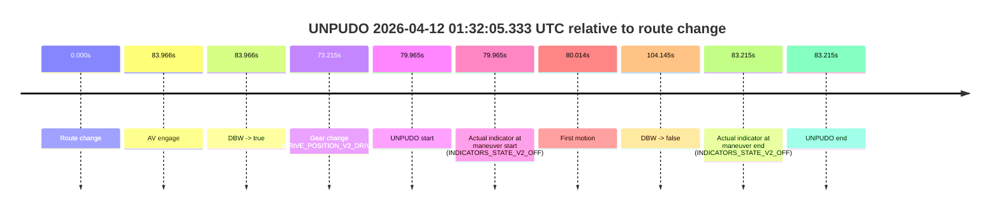
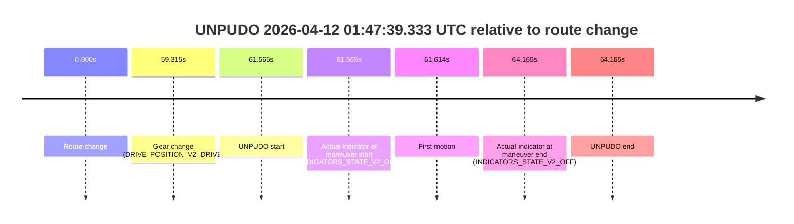
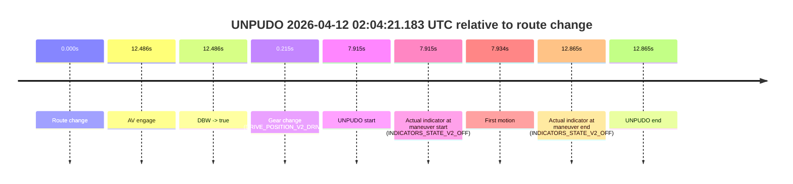

# Run Report: fme10010/2026-04-12--01-28-22--gen2-av-a80fa604-f286-4df0-b4c6-3baf9bf4fd12

| Field | Value |
|---|---|
| Run ID | `fme10010/2026-04-12--01-28-22--gen2-av-a80fa604-f286-4df0-b4c6-3baf9bf4fd12` |
| Date | `2026-04-12` |
| Model(s) | `lively-orange-horse` |
| Author | `guy.geva` |
| Event count | `3` |

## unpudo 2026-04-12 01:32:05.333 UTC

| Field | Value |
|---|---|
| Model | `lively-orange-horse` |
| Author | `guy.geva` |
| Run ID | `fme10010/2026-04-12--01-28-22--gen2-av-a80fa604-f286-4df0-b4c6-3baf9bf4fd12` |
| Date | `2026-04-12` |
| Time (UTC) | `01:32:05.333` |
| Event type | `unpudo` |
| Disengagement type | `failed_to_unpudo` |
| Route change | `found` |
| Console | [run](https://console.sso.wayve.ai/run/fme10010/2026-04-12--01-28-22--gen2-av-a80fa604-f286-4df0-b4c6-3baf9bf4fd12?id=&time-unixus=1775957525333305) |
| Foxglove | [segment](https://app.foxglove.dev/wayve-on-prem/p/prj_0dX18KZdVHg1fmmI/view?ds=foxglove-stream&ds.deviceName=fme10010&ds.start=2026-04-12T01%3A30%3A35.368248Z&ds.end=2026-04-12T01%3A32%3A39.513350Z&layoutId=lay_0e7VD4WIKDQGU73Y&time=2026-04-12T01%3A32%3A05.333305Z) |

### Event card: fail

- Fail: AV owns part of the segment, but the event still resolves as a model-performance failure under the AV-only scoring rule.

| Event | Time (UTC) | Delta from route change |
|---|---:|---:|
| Route change | 2026-04-12 01:30:45.368 | `0.000s` |
| AV engage | 2026-04-12 01:32:09.334 | `83.966s` |
| DBW -> true | 2026-04-12 01:32:09.334 | `83.966s` |
| Gear change (DRIVE_POSITION_V2_DRIVE) | 2026-04-12 01:31:58.583 | `73.215s` |
| UNPUDO start | 2026-04-12 01:32:05.333 | `79.965s` |
| Actual indicator at maneuver start (INDICATORS_STATE_V2_OFF) | 2026-04-12 01:32:05.333 | `79.965s` |
| First motion | 2026-04-12 01:32:05.382 | `80.014s` |
| DBW -> false | 2026-04-12 01:32:29.513 | `104.145s` |
| Actual indicator at maneuver end (INDICATORS_STATE_V2_OFF) | 2026-04-12 01:32:08.583 | `83.215s` |
| UNPUDO end | 2026-04-12 01:32:08.583 | `83.215s` |

| Metric | Value |
|---|---|
| Outcome | `fail` |
| Effective failure type | `failed_to_unpudo` |
| Route change status | `found` |
| DBW at event start | `false` |
| DBW at event end | `false` |
| Predicted gear at AV start | `DRIVE_POSITION_V2_DRIVE` |
| Actual gear at AV start | `DRIVE_POSITION_V2_DRIVE` |
| Predicted gear at event start | `DRIVE_POSITION_V2_DRIVE` |
| Actual gear at event start | `DRIVE_POSITION_V2_DRIVE` |
| Planned indicator direction | `INDICATORS_STATE_V2_OFF` |
| Controller indicator direction | `INDICATORS_STATE_V2_OFF` |
| Actual indicator direction | `INDICATORS_STATE_V2_OFF` |
| Actual indicator at maneuver end | `INDICATORS_STATE_V2_OFF` |
| Driver accel help in AV | `false` |
| Driver accel help timestamp | `n/a` |
| Max accel pedal pct in AV | `0.0%` |
| Max brake pedal pct in AV | `0.0%` |
| Max speed mps in AV | `0.000` |
| Route -> AV | `83.966s` |
| AV -> event start | `-4.001s` |
| AV -> first motion | `-3.952s` |
| AV duration before disengagement | `20.179s` |
| Trajectory waypoint count | `38` |
| Driving-plan step count | `11` |

The scored portion starts from the AV-owned window, not from the pre-AV setup. Route-change search in the stopped pre-event segment was `found`, with the baseline therefore set to route change. At the event anchor the model predicts `DRIVE_POSITION_V2_DRIVE` and the actual gear is `DRIVE_POSITION_V2_DRIVE`. The effective model outcome is `fail` because `failed_to_unpudo`.

### Resolution

| Field | Value |
|---|---|
| Final outcome | `fail` |
| Do we agree with this label? | `yes` |
| Source disengagement type | `failed_to_unpudo` |
| Resolved effective failure type | `failed_to_unpudo` |
| Confidence | `high` |

## unpudo 2026-04-12 01:47:39.333 UTC

| Field | Value |
|---|---|
| Model | `lively-orange-horse` |
| Author | `guy.geva` |
| Run ID | `fme10010/2026-04-12--01-28-22--gen2-av-a80fa604-f286-4df0-b4c6-3baf9bf4fd12` |
| Date | `2026-04-12` |
| Time (UTC) | `01:47:39.333` |
| Event type | `unpudo` |
| Disengagement type | `none observed` |
| Route change | `found` |
| Console | [run](https://console.sso.wayve.ai/run/fme10010/2026-04-12--01-28-22--gen2-av-a80fa604-f286-4df0-b4c6-3baf9bf4fd12?id=&time-unixus=1775958459333292) |
| Foxglove | [segment](https://app.foxglove.dev/wayve-on-prem/p/prj_0dX18KZdVHg1fmmI/view?ds=foxglove-stream&ds.deviceName=fme10010&ds.start=2026-04-12T01%3A46%3A27.768267Z&ds.end=2026-04-12T01%3A47%3A51.933316Z&layoutId=lay_0e7VD4WIKDQGU73Y&time=2026-04-12T01%3A47%3A39.333292Z) |

### Event card: fail

- Fail: the credited unpudo does not stay AV-owned. The event window starts with DBW false, and the maneuver outcome lands outside a clean AV-owned segment.

| Event | Time (UTC) | Delta from route change |
|---|---:|---:|
| Route change | 2026-04-12 01:46:37.768 | `0.000s` |
| Gear change (DRIVE_POSITION_V2_DRIVE) | 2026-04-12 01:47:37.083 | `59.315s` |
| UNPUDO start | 2026-04-12 01:47:39.333 | `61.565s` |
| Actual indicator at maneuver start (INDICATORS_STATE_V2_OFF) | 2026-04-12 01:47:39.333 | `61.565s` |
| First motion | 2026-04-12 01:47:39.382 | `61.614s` |
| Actual indicator at maneuver end (INDICATORS_STATE_V2_OFF) | 2026-04-12 01:47:41.933 | `64.165s` |
| UNPUDO end | 2026-04-12 01:47:41.933 | `64.165s` |

| Metric | Value |
|---|---|
| Outcome | `fail` |
| Effective failure type | `not_av_owned` |
| Route change status | `found` |
| DBW at event start | `false` |
| DBW at event end | `false` |
| Predicted gear at AV start | `n/a` |
| Actual gear at AV start | `n/a` |
| Predicted gear at event start | `DRIVE_POSITION_V2_DRIVE` |
| Actual gear at event start | `DRIVE_POSITION_V2_DRIVE` |
| Planned indicator direction | `INDICATORS_STATE_V2_OFF` |
| Controller indicator direction | `INDICATORS_STATE_V2_OFF` |
| Actual indicator direction | `INDICATORS_STATE_V2_OFF` |
| Actual indicator at maneuver end | `INDICATORS_STATE_V2_OFF` |
| Driver accel help in AV | `false` |
| Driver accel help timestamp | `n/a` |
| Max accel pedal pct in AV | `0.0%` |
| Max brake pedal pct in AV | `0.0%` |
| Max speed mps in AV | `0.000` |
| Route -> AV | `n/a` |
| AV -> event start | `n/a` |
| AV -> first motion | `n/a` |
| AV duration before disengagement | `n/a` |
| Trajectory waypoint count | `36` |
| Driving-plan step count | `11` |

The scored portion starts from the AV-owned window, not from the pre-AV setup. Route-change search in the stopped pre-event segment was `found`, with the baseline therefore set to route change. At the event anchor the model predicts `DRIVE_POSITION_V2_DRIVE` and the actual gear is `DRIVE_POSITION_V2_DRIVE`. The effective model outcome is `fail` because `not_av_owned`.

### Resolution

| Field | Value |
|---|---|
| Final outcome | `fail` |
| Do we agree with this label? | `yes` |
| Source disengagement type | `none observed` |
| Resolved effective failure type | `not_av_owned` |
| Confidence | `high` |

## unpudo 2026-04-12 02:04:21.183 UTC

| Field | Value |
|---|---|
| Model | `lively-orange-horse` |
| Author | `guy.geva` |
| Run ID | `fme10010/2026-04-12--01-28-22--gen2-av-a80fa604-f286-4df0-b4c6-3baf9bf4fd12` |
| Date | `2026-04-12` |
| Time (UTC) | `02:04:21.183` |
| Event type | `unpudo` |
| Disengagement type | `failed_to_unpudo` |
| Route change | `found` |
| Console | [run](https://console.sso.wayve.ai/run/fme10010/2026-04-12--01-28-22--gen2-av-a80fa604-f286-4df0-b4c6-3baf9bf4fd12?id=&time-unixus=1775959461183315) |
| Foxglove | [segment](https://app.foxglove.dev/wayve-on-prem/p/prj_0dX18KZdVHg1fmmI/view?ds=foxglove-stream&ds.deviceName=fme10010&ds.start=2026-04-12T02%3A04%3A03.268338Z&ds.end=2026-04-12T02%3A04%3A36.133310Z&layoutId=lay_0e7VD4WIKDQGU73Y&time=2026-04-12T02%3A04%3A21.183315Z) |

### Event card: fail

- Fail: AV owns part of the segment, but the event still resolves as a model-performance failure under the AV-only scoring rule.

| Event | Time (UTC) | Delta from route change |
|---|---:|---:|
| Route change | 2026-04-12 02:04:13.268 | `0.000s` |
| AV engage | 2026-04-12 02:04:25.754 | `12.486s` |
| DBW -> true | 2026-04-12 02:04:25.754 | `12.486s` |
| Gear change (DRIVE_POSITION_V2_DRIVE) | 2026-04-12 02:04:13.483 | `0.215s` |
| UNPUDO start | 2026-04-12 02:04:21.183 | `7.915s` |
| Actual indicator at maneuver start (INDICATORS_STATE_V2_OFF) | 2026-04-12 02:04:21.183 | `7.915s` |
| First motion | 2026-04-12 02:04:21.202 | `7.934s` |
| Actual indicator at maneuver end (INDICATORS_STATE_V2_OFF) | 2026-04-12 02:04:26.133 | `12.865s` |
| UNPUDO end | 2026-04-12 02:04:26.133 | `12.865s` |

| Metric | Value |
|---|---|
| Outcome | `fail` |
| Effective failure type | `failed_to_unpudo` |
| Route change status | `found` |
| DBW at event start | `false` |
| DBW at event end | `true` |
| Predicted gear at AV start | `DRIVE_POSITION_V2_DRIVE` |
| Actual gear at AV start | `DRIVE_POSITION_V2_DRIVE` |
| Predicted gear at event start | `DRIVE_POSITION_V2_DRIVE` |
| Actual gear at event start | `DRIVE_POSITION_V2_DRIVE` |
| Planned indicator direction | `INDICATORS_STATE_V2_OFF` |
| Controller indicator direction | `INDICATORS_STATE_V2_OFF` |
| Actual indicator direction | `INDICATORS_STATE_V2_OFF` |
| Actual indicator at maneuver end | `INDICATORS_STATE_V2_OFF` |
| Driver accel help in AV | `false` |
| Driver accel help timestamp | `n/a` |
| Max accel pedal pct in AV | `0.0%` |
| Max brake pedal pct in AV | `0.0%` |
| Max speed mps in AV | `2.411` |
| Route -> AV | `12.486s` |
| AV -> event start | `-4.571s` |
| AV -> first motion | `-4.552s` |
| AV duration before disengagement | `n/a` |
| Trajectory waypoint count | `37` |
| Driving-plan step count | `11` |

The scored portion starts from the AV-owned window, not from the pre-AV setup. Route-change search in the stopped pre-event segment was `found`, with the baseline therefore set to route change. At the event anchor the model predicts `DRIVE_POSITION_V2_DRIVE` and the actual gear is `DRIVE_POSITION_V2_DRIVE`. The effective model outcome is `fail` because `failed_to_unpudo`.

### Resolution

| Field | Value |
|---|---|
| Final outcome | `fail` |
| Do we agree with this label? | `yes` |
| Source disengagement type | `failed_to_unpudo` |
| Resolved effective failure type | `failed_to_unpudo` |
| Confidence | `high` |
