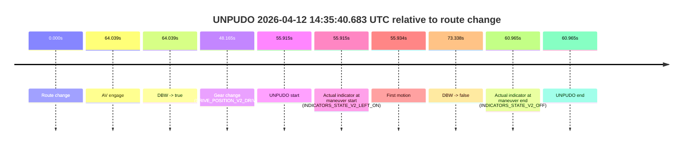
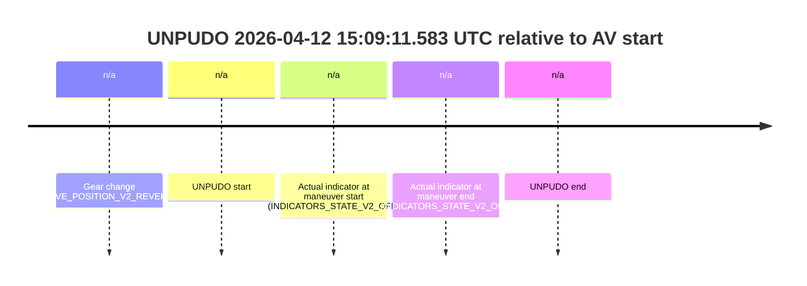
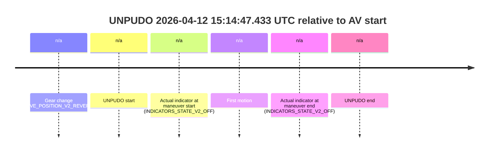
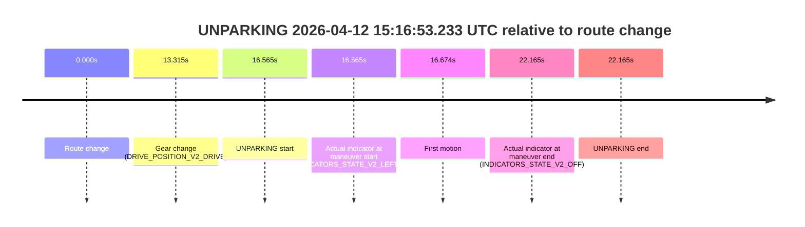

# Run Report: fme10010/2026-04-12--13-35-06--gen2-av-de96aa03-0b68-421e-b6f8-17ae80c681b2

| Field | Value |
|---|---|
| Run ID | `fme10010/2026-04-12--13-35-06--gen2-av-de96aa03-0b68-421e-b6f8-17ae80c681b2` |
| Date | `2026-04-12` |
| Model(s) | `lively-orange-horse` |
| Author | `guy.geva` |
| Event count | `6` |

## unpudo 2026-04-12 14:35:40.683 UTC

| Field | Value |
|---|---|
| Model | `lively-orange-horse` |
| Author | `guy.geva` |
| Run ID | `fme10010/2026-04-12--13-35-06--gen2-av-de96aa03-0b68-421e-b6f8-17ae80c681b2` |
| Date | `2026-04-12` |
| Time (UTC) | `14:35:40.683` |
| Event type | `unpudo` |
| Disengagement type | `failed_to_unpudo` |
| Route change | `found` |
| Console | [run](https://console.sso.wayve.ai/run/fme10010/2026-04-12--13-35-06--gen2-av-de96aa03-0b68-421e-b6f8-17ae80c681b2?id=&time-unixus=1776004540683304) |
| Foxglove | [segment](https://app.foxglove.dev/wayve-on-prem/p/prj_0dX18KZdVHg1fmmI/view?ds=foxglove-stream&ds.deviceName=fme10010&ds.start=2026-04-12T14%3A34%3A34.768169Z&ds.end=2026-04-12T14%3A36%3A08.106668Z&layoutId=lay_0e7VD4WIKDQGU73Y&time=2026-04-12T14%3A35%3A40.683304Z) |

### Event card: accidental

- Accidental: AV ownership is present for less than `2s`, so this is treated as an accidental brush with the maneuver rather than a meaningful model attempt.

| Event | Time (UTC) | Delta from route change |
|---|---:|---:|
| Route change | 2026-04-12 14:34:44.768 | `0.000s` |
| AV engage | 2026-04-12 14:35:48.806 | `64.039s` |
| DBW -> true | 2026-04-12 14:35:48.806 | `64.039s` |
| Gear change (DRIVE_POSITION_V2_DRIVE) | 2026-04-12 14:35:32.933 | `48.165s` |
| UNPUDO start | 2026-04-12 14:35:40.683 | `55.915s` |
| Actual indicator at maneuver start (INDICATORS_STATE_V2_LEFT_ON) | 2026-04-12 14:35:40.683 | `55.915s` |
| First motion | 2026-04-12 14:35:40.702 | `55.934s` |
| DBW -> false | 2026-04-12 14:35:58.106 | `73.338s` |
| Actual indicator at maneuver end (INDICATORS_STATE_V2_OFF) | 2026-04-12 14:35:45.733 | `60.965s` |
| UNPUDO end | 2026-04-12 14:35:45.733 | `60.965s` |

| Metric | Value |
|---|---|
| Outcome | `accidental` |
| Effective failure type | `none` |
| Route change status | `found` |
| DBW at event start | `false` |
| DBW at event end | `false` |
| Predicted gear at AV start | `DRIVE_POSITION_V2_DRIVE` |
| Actual gear at AV start | `DRIVE_POSITION_V2_DRIVE` |
| Predicted gear at event start | `DRIVE_POSITION_V2_DRIVE` |
| Actual gear at event start | `DRIVE_POSITION_V2_DRIVE` |
| Planned indicator direction | `INDICATORS_STATE_V2_LEFT_ON` |
| Controller indicator direction | `INDICATORS_STATE_V2_LEFT_ON` |
| Actual indicator direction | `INDICATORS_STATE_V2_LEFT_ON` |
| Actual indicator at maneuver end | `INDICATORS_STATE_V2_OFF` |
| Driver accel help in AV | `false` |
| Driver accel help timestamp | `n/a` |
| Max accel pedal pct in AV | `0.0%` |
| Max brake pedal pct in AV | `0.0%` |
| Max speed mps in AV | `0.000` |
| Route -> AV | `64.039s` |
| AV -> event start | `-8.123s` |
| AV -> first motion | `-8.104s` |
| AV duration before disengagement | `9.300s` |
| Trajectory waypoint count | `36` |
| Driving-plan step count | `11` |

The scored portion starts from the AV-owned window, not from the pre-AV setup. Route-change search in the stopped pre-event segment was `found`, with the baseline therefore set to route change. At the event anchor the model predicts `DRIVE_POSITION_V2_DRIVE` and the actual gear is `DRIVE_POSITION_V2_DRIVE`. The effective model outcome is `accidental` because `the AV-owned portion is shorter than 2s`.

### Resolution

| Field | Value |
|---|---|
| Final outcome | `accidental` |
| Do we agree with this label? | `yes` |
| Source disengagement type | `failed_to_unpudo` |
| Resolved effective failure type | `none` |
| Confidence | `high` |

## unpudo 2026-04-12 14:45:00.883 UTC

| Field | Value |
|---|---|
| Model | `lively-orange-horse` |
| Author | `guy.geva` |
| Run ID | `fme10010/2026-04-12--13-35-06--gen2-av-de96aa03-0b68-421e-b6f8-17ae80c681b2` |
| Date | `2026-04-12` |
| Time (UTC) | `14:45:00.883` |
| Event type | `unpudo` |
| Disengagement type | `failed_to_unpudo` |
| Route change | `found` |
| Console | [run](https://console.sso.wayve.ai/run/fme10010/2026-04-12--13-35-06--gen2-av-de96aa03-0b68-421e-b6f8-17ae80c681b2?id=&time-unixus=1776005100883319) |
| Foxglove | [segment](https://app.foxglove.dev/wayve-on-prem/p/prj_0dX18KZdVHg1fmmI/view?ds=foxglove-stream&ds.deviceName=fme10010&ds.start=2026-04-12T14%3A44%3A37.818271Z&ds.end=2026-04-12T14%3A49%3A41.467061Z&layoutId=lay_0e7VD4WIKDQGU73Y&time=2026-04-12T14%3A45%3A00.883319Z) |

### Event card: accidental

- Accidental: AV ownership is present for less than `2s`, so this is treated as an accidental brush with the maneuver rather than a meaningful model attempt.

| Event | Time (UTC) | Delta from route change |
|---|---:|---:|
| Route change | 2026-04-12 14:44:47.818 | `0.000s` |
| AV engage | 2026-04-12 14:45:09.667 | `21.850s` |
| DBW -> true | 2026-04-12 14:45:09.667 | `21.850s` |
| Gear change (DRIVE_POSITION_V2_DRIVE) | 2026-04-12 14:44:53.833 | `6.015s` |
| UNPUDO start | 2026-04-12 14:45:00.883 | `13.065s` |
| Actual indicator at maneuver start (INDICATORS_STATE_V2_OFF) | 2026-04-12 14:45:00.883 | `13.065s` |
| First motion | 2026-04-12 14:45:00.922 | `13.104s` |
| DBW -> false | 2026-04-12 14:49:31.467 | `283.649s` |
| Actual indicator at maneuver end (INDICATORS_STATE_V2_OFF) | 2026-04-12 14:45:06.283 | `18.465s` |
| UNPUDO end | 2026-04-12 14:45:06.283 | `18.465s` |

| Metric | Value |
|---|---|
| Outcome | `accidental` |
| Effective failure type | `none` |
| Route change status | `found` |
| DBW at event start | `false` |
| DBW at event end | `false` |
| Predicted gear at AV start | `DRIVE_POSITION_V2_DRIVE` |
| Actual gear at AV start | `DRIVE_POSITION_V2_DRIVE` |
| Predicted gear at event start | `DRIVE_POSITION_V2_DRIVE` |
| Actual gear at event start | `DRIVE_POSITION_V2_DRIVE` |
| Planned indicator direction | `INDICATORS_STATE_V2_LEFT_ON` |
| Controller indicator direction | `INDICATORS_STATE_V2_LEFT_ON` |
| Actual indicator direction | `INDICATORS_STATE_V2_OFF` |
| Actual indicator at maneuver end | `INDICATORS_STATE_V2_OFF` |
| Driver accel help in AV | `false` |
| Driver accel help timestamp | `n/a` |
| Max accel pedal pct in AV | `0.0%` |
| Max brake pedal pct in AV | `0.0%` |
| Max speed mps in AV | `0.000` |
| Route -> AV | `21.850s` |
| AV -> event start | `-8.785s` |
| AV -> first motion | `-8.745s` |
| AV duration before disengagement | `261.799s` |
| Trajectory waypoint count | `36` |
| Driving-plan step count | `11` |

The scored portion starts from the AV-owned window, not from the pre-AV setup. Route-change search in the stopped pre-event segment was `found`, with the baseline therefore set to route change. At the event anchor the model predicts `DRIVE_POSITION_V2_DRIVE` and the actual gear is `DRIVE_POSITION_V2_DRIVE`. The effective model outcome is `accidental` because `the AV-owned portion is shorter than 2s`.

### Resolution

| Field | Value |
|---|---|
| Final outcome | `accidental` |
| Do we agree with this label? | `yes` |
| Source disengagement type | `failed_to_unpudo` |
| Resolved effective failure type | `none` |
| Confidence | `high` |

## unpudo 2026-04-12 14:49:32.783 UTC

| Field | Value |
|---|---|
| Model | `lively-orange-horse` |
| Author | `guy.geva` |
| Run ID | `fme10010/2026-04-12--13-35-06--gen2-av-de96aa03-0b68-421e-b6f8-17ae80c681b2` |
| Date | `2026-04-12` |
| Time (UTC) | `14:49:32.783` |
| Event type | `unpudo` |
| Disengagement type | `failed_to_unpudo` |
| Route change | `found` |
| Console | [run](https://console.sso.wayve.ai/run/fme10010/2026-04-12--13-35-06--gen2-av-de96aa03-0b68-421e-b6f8-17ae80c681b2?id=&time-unixus=1776005372783303) |
| Foxglove | [segment](https://app.foxglove.dev/wayve-on-prem/p/prj_0dX18KZdVHg1fmmI/view?ds=foxglove-stream&ds.deviceName=fme10010&ds.start=2026-04-12T14%3A49%3A10.318285Z&ds.end=2026-04-12T14%3A50%3A03.127888Z&layoutId=lay_0e7VD4WIKDQGU73Y&time=2026-04-12T14%3A49%3A32.783303Z) |

### Event card: accidental

- Accidental: AV ownership is present for less than `2s`, so this is treated as an accidental brush with the maneuver rather than a meaningful model attempt.

| Event | Time (UTC) | Delta from route change |
|---|---:|---:|
| Route change | 2026-04-12 14:49:20.318 | `0.000s` |
| AV engage | 2026-04-12 14:49:43.826 | `23.508s` |
| DBW -> true | 2026-04-12 14:49:43.826 | `23.508s` |
| Gear change (DRIVE_POSITION_V2_DRIVE) | 2026-04-12 14:49:20.633 | `0.315s` |
| UNPUDO start | 2026-04-12 14:49:32.783 | `12.465s` |
| Actual indicator at maneuver start (INDICATORS_STATE_V2_OFF) | 2026-04-12 14:49:32.783 | `12.465s` |
| First motion | 2026-04-12 14:49:32.962 | `12.645s` |
| DBW -> false | 2026-04-12 14:49:53.127 | `32.810s` |
| Actual indicator at maneuver end (INDICATORS_STATE_V2_OFF) | 2026-04-12 14:49:39.683 | `19.365s` |
| UNPUDO end | 2026-04-12 14:49:39.683 | `19.365s` |

| Metric | Value |
|---|---|
| Outcome | `accidental` |
| Effective failure type | `none` |
| Route change status | `found` |
| DBW at event start | `false` |
| DBW at event end | `false` |
| Predicted gear at AV start | `DRIVE_POSITION_V2_DRIVE` |
| Actual gear at AV start | `DRIVE_POSITION_V2_DRIVE` |
| Predicted gear at event start | `DRIVE_POSITION_V2_DRIVE` |
| Actual gear at event start | `DRIVE_POSITION_V2_DRIVE` |
| Planned indicator direction | `INDICATORS_STATE_V2_LEFT_ON` |
| Controller indicator direction | `INDICATORS_STATE_V2_LEFT_ON` |
| Actual indicator direction | `INDICATORS_STATE_V2_OFF` |
| Actual indicator at maneuver end | `INDICATORS_STATE_V2_OFF` |
| Driver accel help in AV | `false` |
| Driver accel help timestamp | `n/a` |
| Max accel pedal pct in AV | `0.0%` |
| Max brake pedal pct in AV | `0.0%` |
| Max speed mps in AV | `0.000` |
| Route -> AV | `23.508s` |
| AV -> event start | `-11.043s` |
| AV -> first motion | `-10.864s` |
| AV duration before disengagement | `9.301s` |
| Trajectory waypoint count | `36` |
| Driving-plan step count | `11` |

The scored portion starts from the AV-owned window, not from the pre-AV setup. Route-change search in the stopped pre-event segment was `found`, with the baseline therefore set to route change. At the event anchor the model predicts `DRIVE_POSITION_V2_DRIVE` and the actual gear is `DRIVE_POSITION_V2_DRIVE`. The effective model outcome is `accidental` because `the AV-owned portion is shorter than 2s`.

### Resolution

| Field | Value |
|---|---|
| Final outcome | `accidental` |
| Do we agree with this label? | `yes` |
| Source disengagement type | `failed_to_unpudo` |
| Resolved effective failure type | `none` |
| Confidence | `high` |

## unpudo 2026-04-12 15:09:11.583 UTC

| Field | Value |
|---|---|
| Model | `lively-orange-horse` |
| Author | `guy.geva` |
| Run ID | `fme10010/2026-04-12--13-35-06--gen2-av-de96aa03-0b68-421e-b6f8-17ae80c681b2` |
| Date | `2026-04-12` |
| Time (UTC) | `15:09:11.583` |
| Event type | `unpudo` |
| Disengagement type | `none observed` |
| Route change | `unclear` |
| Console | [run](https://console.sso.wayve.ai/run/fme10010/2026-04-12--13-35-06--gen2-av-de96aa03-0b68-421e-b6f8-17ae80c681b2?id=&time-unixus=1776006551583317) |
| Foxglove | [segment](https://app.foxglove.dev/wayve-on-prem/p/prj_0dX18KZdVHg1fmmI/view?ds=foxglove-stream&ds.deviceName=fme10010&ds.start=2026-04-12T15%3A08%3A55.883295Z&ds.end=2026-04-12T15%3A09%3A21.583317Z&layoutId=lay_0e7VD4WIKDQGU73Y&time=2026-04-12T15%3A09%3A11.583317Z) |

### Event card: non-av

- Non-AV: the detected unpudo starts outside AV ownership, so it is kept for coverage but excluded from model success / failure scoring.

| Event | Time (UTC) | Delta from AV start |
|---|---:|---:|
| Gear change (DRIVE_POSITION_V2_REVERSE) | 2026-04-12 15:09:05.883 | `n/a` |
| UNPUDO start | 2026-04-12 15:09:11.583 | `n/a` |
| Actual indicator at maneuver start (INDICATORS_STATE_V2_OFF) | 2026-04-12 15:09:11.583 | `n/a` |
| Actual indicator at maneuver end (INDICATORS_STATE_V2_OFF) | 2026-04-12 15:09:11.583 | `n/a` |
| UNPUDO end | 2026-04-12 15:09:11.583 | `n/a` |

| Metric | Value |
|---|---|
| Outcome | `non-av` |
| Effective failure type | `none` |
| Route change status | `unclear` |
| DBW at event start | `false` |
| DBW at event end | `false` |
| Predicted gear at AV start | `n/a` |
| Actual gear at AV start | `n/a` |
| Predicted gear at event start | `DRIVE_POSITION_V2_DRIVE` |
| Actual gear at event start | `DRIVE_POSITION_V2_REVERSE` |
| Planned indicator direction | `INDICATORS_STATE_V2_OFF` |
| Controller indicator direction | `INDICATORS_STATE_V2_OFF` |
| Actual indicator direction | `INDICATORS_STATE_V2_OFF` |
| Actual indicator at maneuver end | `INDICATORS_STATE_V2_OFF` |
| Driver accel help in AV | `false` |
| Driver accel help timestamp | `n/a` |
| Max accel pedal pct in AV | `0.0%` |
| Max brake pedal pct in AV | `0.0%` |
| Max speed mps in AV | `0.000` |
| Route -> AV | `n/a` |
| AV -> event start | `n/a` |
| AV -> first motion | `n/a` |
| AV duration before disengagement | `n/a` |
| Trajectory waypoint count | `36` |
| Driving-plan step count | `11` |

The scored portion starts from the AV-owned window, not from the pre-AV setup. Route-change search in the stopped pre-event segment was `unclear`, with the baseline therefore set to AV start. At the event anchor the model predicts `DRIVE_POSITION_V2_DRIVE` and the actual gear is `DRIVE_POSITION_V2_REVERSE`. The effective model outcome is `non-av` because `the event does not begin in AV ownership`.

### Resolution

| Field | Value |
|---|---|
| Final outcome | `non-av` |
| Do we agree with this label? | `yes` |
| Source disengagement type | `none observed` |
| Resolved effective failure type | `none` |
| Confidence | `medium` |

## unpudo 2026-04-12 15:14:47.433 UTC

| Field | Value |
|---|---|
| Model | `lively-orange-horse` |
| Author | `guy.geva` |
| Run ID | `fme10010/2026-04-12--13-35-06--gen2-av-de96aa03-0b68-421e-b6f8-17ae80c681b2` |
| Date | `2026-04-12` |
| Time (UTC) | `15:14:47.433` |
| Event type | `unpudo` |
| Disengagement type | `diversion` |
| Route change | `unclear` |
| Console | [run](https://console.sso.wayve.ai/run/fme10010/2026-04-12--13-35-06--gen2-av-de96aa03-0b68-421e-b6f8-17ae80c681b2?id=&time-unixus=1776006887433306) |
| Foxglove | [segment](https://app.foxglove.dev/wayve-on-prem/p/prj_0dX18KZdVHg1fmmI/view?ds=foxglove-stream&ds.deviceName=fme10010&ds.start=2026-04-12T15%3A14%3A31.633310Z&ds.end=2026-04-12T15%3A15%3A09.933308Z&layoutId=lay_0e7VD4WIKDQGU73Y&time=2026-04-12T15%3A14%3A47.433306Z) |

### Event card: non-av

- Non-AV: the detected unpudo starts outside AV ownership, so it is kept for coverage but excluded from model success / failure scoring.

| Event | Time (UTC) | Delta from AV start |
|---|---:|---:|
| Gear change (DRIVE_POSITION_V2_REVERSE) | 2026-04-12 15:14:41.633 | `n/a` |
| UNPUDO start | 2026-04-12 15:14:47.433 | `n/a` |
| Actual indicator at maneuver start (INDICATORS_STATE_V2_OFF) | 2026-04-12 15:14:47.433 | `n/a` |
| First motion | 2026-04-12 15:14:56.082 | `n/a` |
| Actual indicator at maneuver end (INDICATORS_STATE_V2_OFF) | 2026-04-12 15:14:59.933 | `n/a` |
| UNPUDO end | 2026-04-12 15:14:59.933 | `n/a` |

| Metric | Value |
|---|---|
| Outcome | `non-av` |
| Effective failure type | `none` |
| Route change status | `unclear` |
| DBW at event start | `false` |
| DBW at event end | `false` |
| Predicted gear at AV start | `n/a` |
| Actual gear at AV start | `n/a` |
| Predicted gear at event start | `DRIVE_POSITION_V2_DRIVE` |
| Actual gear at event start | `DRIVE_POSITION_V2_REVERSE` |
| Planned indicator direction | `INDICATORS_STATE_V2_OFF` |
| Controller indicator direction | `INDICATORS_STATE_V2_OFF` |
| Actual indicator direction | `INDICATORS_STATE_V2_OFF` |
| Actual indicator at maneuver end | `INDICATORS_STATE_V2_OFF` |
| Driver accel help in AV | `false` |
| Driver accel help timestamp | `n/a` |
| Max accel pedal pct in AV | `0.0%` |
| Max brake pedal pct in AV | `0.0%` |
| Max speed mps in AV | `0.000` |
| Route -> AV | `n/a` |
| AV -> event start | `n/a` |
| AV -> first motion | `n/a` |
| AV duration before disengagement | `n/a` |
| Trajectory waypoint count | `37` |
| Driving-plan step count | `11` |

The scored portion starts from the AV-owned window, not from the pre-AV setup. Route-change search in the stopped pre-event segment was `unclear`, with the baseline therefore set to AV start. At the event anchor the model predicts `DRIVE_POSITION_V2_DRIVE` and the actual gear is `DRIVE_POSITION_V2_REVERSE`. The effective model outcome is `non-av` because `the event does not begin in AV ownership`.

### Resolution

| Field | Value |
|---|---|
| Final outcome | `non-av` |
| Do we agree with this label? | `yes` |
| Source disengagement type | `diversion` |
| Resolved effective failure type | `none` |
| Confidence | `medium` |

## unparking 2026-04-12 15:16:53.233 UTC

| Field | Value |
|---|---|
| Model | `lively-orange-horse` |
| Author | `guy.geva` |
| Run ID | `fme10010/2026-04-12--13-35-06--gen2-av-de96aa03-0b68-421e-b6f8-17ae80c681b2` |
| Date | `2026-04-12` |
| Time (UTC) | `15:16:53.233` |
| Event type | `unparking` |
| Disengagement type | `none observed` |
| Route change | `found` |
| Console | [run](https://console.sso.wayve.ai/run/fme10010/2026-04-12--13-35-06--gen2-av-de96aa03-0b68-421e-b6f8-17ae80c681b2?id=&time-unixus=1776007013233290) |
| Foxglove | [segment](https://app.foxglove.dev/wayve-on-prem/p/prj_0dX18KZdVHg1fmmI/view?ds=foxglove-stream&ds.deviceName=fme10010&ds.start=2026-04-12T15%3A16%3A26.668311Z&ds.end=2026-04-12T15%3A17%3A08.833310Z&layoutId=lay_0e7VD4WIKDQGU73Y&time=2026-04-12T15%3A16%3A53.233290Z) |

### Event card: non-av

- Non-AV: the detected unparking starts outside AV ownership, so it is kept for coverage but excluded from model success / failure scoring.

| Event | Time (UTC) | Delta from route change |
|---|---:|---:|
| Route change | 2026-04-12 15:16:36.668 | `0.000s` |
| Gear change (DRIVE_POSITION_V2_DRIVE) | 2026-04-12 15:16:49.983 | `13.315s` |
| UNPARKING start | 2026-04-12 15:16:53.233 | `16.565s` |
| Actual indicator at maneuver start (INDICATORS_STATE_V2_LEFT_ON) | 2026-04-12 15:16:53.233 | `16.565s` |
| First motion | 2026-04-12 15:16:53.342 | `16.674s` |
| Actual indicator at maneuver end (INDICATORS_STATE_V2_OFF) | 2026-04-12 15:16:58.833 | `22.165s` |
| UNPARKING end | 2026-04-12 15:16:58.833 | `22.165s` |

| Metric | Value |
|---|---|
| Outcome | `non-av` |
| Effective failure type | `none` |
| Route change status | `found` |
| DBW at event start | `false` |
| DBW at event end | `false` |
| Predicted gear at AV start | `n/a` |
| Actual gear at AV start | `n/a` |
| Predicted gear at event start | `DRIVE_POSITION_V2_DRIVE` |
| Actual gear at event start | `DRIVE_POSITION_V2_DRIVE` |
| Planned indicator direction | `INDICATORS_STATE_V2_LEFT_ON` |
| Controller indicator direction | `INDICATORS_STATE_V2_LEFT_ON` |
| Actual indicator direction | `INDICATORS_STATE_V2_LEFT_ON` |
| Actual indicator at maneuver end | `INDICATORS_STATE_V2_OFF` |
| Driver accel help in AV | `false` |
| Driver accel help timestamp | `n/a` |
| Max accel pedal pct in AV | `0.0%` |
| Max brake pedal pct in AV | `0.0%` |
| Max speed mps in AV | `0.000` |
| Route -> AV | `n/a` |
| AV -> event start | `n/a` |
| AV -> first motion | `n/a` |
| AV duration before disengagement | `n/a` |
| Trajectory waypoint count | `37` |
| Driving-plan step count | `11` |

The scored portion starts from the AV-owned window, not from the pre-AV setup. Route-change search in the stopped pre-event segment was `found`, with the baseline therefore set to route change. At the event anchor the model predicts `DRIVE_POSITION_V2_DRIVE` and the actual gear is `DRIVE_POSITION_V2_DRIVE`. The effective model outcome is `non-av` because `the event does not begin in AV ownership`.

### Resolution

| Field | Value |
|---|---|
| Final outcome | `non-av` |
| Do we agree with this label? | `yes` |
| Source disengagement type | `none observed` |
| Resolved effective failure type | `none` |
| Confidence | `high` |
