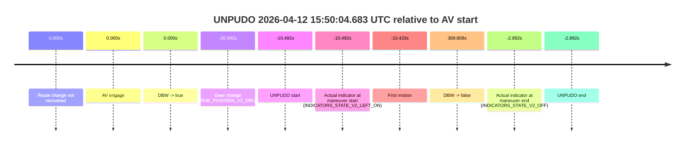
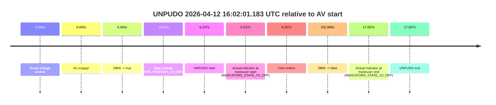
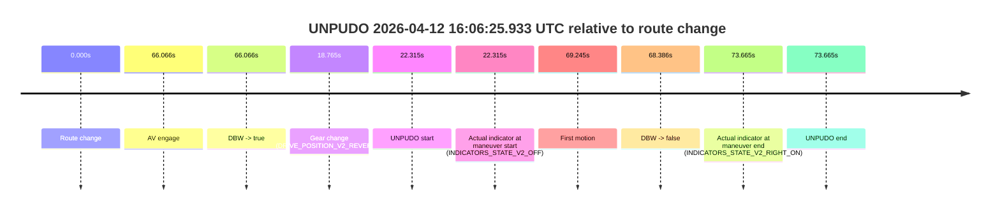
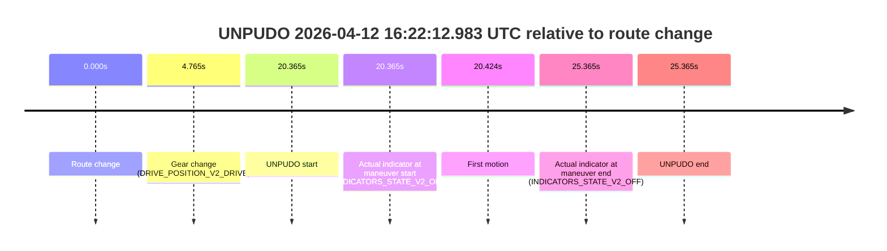

# Run Report: fme10010/2026-04-12--15-47-17--gen2-av-e422c9c2-4e04-424e-8894-63a642a90709

| Field | Value |
|---|---|
| Run ID | `fme10010/2026-04-12--15-47-17--gen2-av-e422c9c2-4e04-424e-8894-63a642a90709` |
| Date | `2026-04-12` |
| Model(s) | `lively-orange-horse` |
| Author | `guy.geva` |
| Event count | `4` |

## unpudo 2026-04-12 15:50:04.683 UTC

| Field | Value |
|---|---|
| Model | `lively-orange-horse` |
| Author | `guy.geva` |
| Run ID | `fme10010/2026-04-12--15-47-17--gen2-av-e422c9c2-4e04-424e-8894-63a642a90709` |
| Date | `2026-04-12` |
| Time (UTC) | `15:50:04.683` |
| Event type | `unpudo` |
| Disengagement type | `none observed` |
| Route change | `not found` |
| Console | [run](https://console.sso.wayve.ai/run/fme10010/2026-04-12--15-47-17--gen2-av-e422c9c2-4e04-424e-8894-63a642a90709?id=&time-unixus=1776009004683295) |
| Foxglove | [segment](https://app.foxglove.dev/wayve-on-prem/p/prj_0dX18KZdVHg1fmmI/view?ds=foxglove-stream&ds.deviceName=fme10010&ds.start=2026-04-12T15%3A49%3A38.583304Z&ds.end=2026-04-12T15%3A56%3A34.984583Z&layoutId=lay_0e7VD4WIKDQGU73Y&time=2026-04-12T15%3A50%3A04.683295Z) |

### Event card: fail

- Fail: the credited unpudo does not stay AV-owned. The event window starts with DBW false, and the maneuver outcome lands outside a clean AV-owned segment.

| Event | Time (UTC) | Delta from AV start |
|---|---:|---:|
| Route change not recovered | 2026-04-12 15:50:15.175 | `0.000s` |
| AV engage | 2026-04-12 15:50:15.175 | `0.000s` |
| DBW -> true | 2026-04-12 15:50:15.175 | `0.000s` |
| Gear change (DRIVE_POSITION_V2_DRIVE) | 2026-04-12 15:49:48.583 | `-26.592s` |
| UNPUDO start | 2026-04-12 15:50:04.683 | `-10.492s` |
| Actual indicator at maneuver start (INDICATORS_STATE_V2_LEFT_ON) | 2026-04-12 15:50:04.683 | `-10.492s` |
| First motion | 2026-04-12 15:50:04.742 | `-10.433s` |
| DBW -> false | 2026-04-12 15:56:24.984 | `369.809s` |
| Actual indicator at maneuver end (INDICATORS_STATE_V2_OFF) | 2026-04-12 15:50:12.283 | `-2.892s` |
| UNPUDO end | 2026-04-12 15:50:12.283 | `-2.892s` |

| Metric | Value |
|---|---|
| Outcome | `fail` |
| Effective failure type | `completed_outside_av` |
| Route change status | `not found` |
| DBW at event start | `false` |
| DBW at event end | `false` |
| Predicted gear at AV start | `DRIVE_POSITION_V2_DRIVE` |
| Actual gear at AV start | `DRIVE_POSITION_V2_DRIVE` |
| Predicted gear at event start | `DRIVE_POSITION_V2_DRIVE` |
| Actual gear at event start | `DRIVE_POSITION_V2_DRIVE` |
| Planned indicator direction | `INDICATORS_STATE_V2_LEFT_ON` |
| Controller indicator direction | `INDICATORS_STATE_V2_LEFT_ON` |
| Actual indicator direction | `INDICATORS_STATE_V2_LEFT_ON` |
| Actual indicator at maneuver end | `INDICATORS_STATE_V2_OFF` |
| Driver accel help in AV | `false` |
| Driver accel help timestamp | `n/a` |
| Max accel pedal pct in AV | `0.0%` |
| Max brake pedal pct in AV | `0.0%` |
| Max speed mps in AV | `0.000` |
| Route -> AV | `n/a` |
| AV -> event start | `-10.492s` |
| AV -> first motion | `-10.433s` |
| AV duration before disengagement | `369.809s` |
| Trajectory waypoint count | `37` |
| Driving-plan step count | `11` |

The scored portion starts from the AV-owned window, not from the pre-AV setup. Route-change search in the stopped pre-event segment was `not found`, with the baseline therefore set to AV start. At the event anchor the model predicts `DRIVE_POSITION_V2_DRIVE` and the actual gear is `DRIVE_POSITION_V2_DRIVE`. The effective model outcome is `fail` because `completed_outside_av`.

### Resolution

| Field | Value |
|---|---|
| Final outcome | `fail` |
| Do we agree with this label? | `yes` |
| Source disengagement type | `none observed` |
| Resolved effective failure type | `completed_outside_av` |
| Confidence | `high` |

## unpudo 2026-04-12 16:02:01.183 UTC

| Field | Value |
|---|---|
| Model | `lively-orange-horse` |
| Author | `guy.geva` |
| Run ID | `fme10010/2026-04-12--15-47-17--gen2-av-e422c9c2-4e04-424e-8894-63a642a90709` |
| Date | `2026-04-12` |
| Time (UTC) | `16:02:01.183` |
| Event type | `unpudo` |
| Disengagement type | `none observed` |
| Route change | `unclear` |
| Console | [run](https://console.sso.wayve.ai/run/fme10010/2026-04-12--15-47-17--gen2-av-e422c9c2-4e04-424e-8894-63a642a90709?id=&time-unixus=1776009721183295) |
| Foxglove | [segment](https://app.foxglove.dev/wayve-on-prem/p/prj_0dX18KZdVHg1fmmI/view?ds=foxglove-stream&ds.deviceName=fme10010&ds.start=2026-04-12T16%3A01%3A42.133292Z&ds.end=2026-04-12T16%3A05%3A27.834599Z&layoutId=lay_0e7VD4WIKDQGU73Y&time=2026-04-12T16%3A02%3A01.183295Z) |

### Event card: pass

- Pass: AV owns the credited unpudo through the official event window, the gear state is aligned at the anchor, and the vehicle moves without driver accelerator help in AV.

| Event | Time (UTC) | Delta from AV start |
|---|---:|---:|
| Route change unclear | 2026-04-12 16:01:54.946 | `0.000s` |
| AV engage | 2026-04-12 16:01:54.946 | `0.000s` |
| DBW -> true | 2026-04-12 16:01:54.946 | `0.000s` |
| Gear change (DRIVE_POSITION_V2_DRIVE) | 2026-04-12 16:01:52.133 | `-2.813s` |
| UNPUDO start | 2026-04-12 16:02:01.183 | `6.237s` |
| Actual indicator at maneuver start (INDICATORS_STATE_V2_OFF) | 2026-04-12 16:02:01.183 | `6.237s` |
| First motion | 2026-04-12 16:02:01.202 | `6.257s` |
| DBW -> false | 2026-04-12 16:05:17.834 | `202.889s` |
| Actual indicator at maneuver end (INDICATORS_STATE_V2_OFF) | 2026-04-12 16:02:12.783 | `17.837s` |
| UNPUDO end | 2026-04-12 16:02:12.783 | `17.837s` |

| Metric | Value |
|---|---|
| Outcome | `pass` |
| Effective failure type | `none` |
| Route change status | `unclear` |
| DBW at event start | `true` |
| DBW at event end | `true` |
| Predicted gear at AV start | `DRIVE_POSITION_V2_DRIVE` |
| Actual gear at AV start | `DRIVE_POSITION_V2_DRIVE` |
| Predicted gear at event start | `DRIVE_POSITION_V2_DRIVE` |
| Actual gear at event start | `DRIVE_POSITION_V2_DRIVE` |
| Planned indicator direction | `INDICATORS_STATE_V2_LEFT_ON` |
| Controller indicator direction | `INDICATORS_STATE_V2_LEFT_ON` |
| Actual indicator direction | `INDICATORS_STATE_V2_OFF` |
| Actual indicator at maneuver end | `INDICATORS_STATE_V2_OFF` |
| Driver accel help in AV | `false` |
| Driver accel help timestamp | `n/a` |
| Max accel pedal pct in AV | `0.0%` |
| Max brake pedal pct in AV | `8.9%` |
| Max speed mps in AV | `3.103` |
| Route -> AV | `n/a` |
| AV -> event start | `6.237s` |
| AV -> first motion | `6.257s` |
| AV duration before disengagement | `202.889s` |
| Trajectory waypoint count | `37` |
| Driving-plan step count | `11` |

The scored portion starts from the AV-owned window, not from the pre-AV setup. Route-change search in the stopped pre-event segment was `unclear`, with the baseline therefore set to AV start. At the event anchor the model predicts `DRIVE_POSITION_V2_DRIVE` and the actual gear is `DRIVE_POSITION_V2_DRIVE`. The effective model outcome is `pass` because `the credited maneuver stays AV-owned through the official event end`.

### Resolution

| Field | Value |
|---|---|
| Final outcome | `pass` |
| Do we agree with this label? | `yes` |
| Source disengagement type | `none observed` |
| Resolved effective failure type | `none` |
| Confidence | `medium` |

## unpudo 2026-04-12 16:06:25.933 UTC

| Field | Value |
|---|---|
| Model | `lively-orange-horse` |
| Author | `guy.geva` |
| Run ID | `fme10010/2026-04-12--15-47-17--gen2-av-e422c9c2-4e04-424e-8894-63a642a90709` |
| Date | `2026-04-12` |
| Time (UTC) | `16:06:25.933` |
| Event type | `unpudo` |
| Disengagement type | `failed_to_unpudo` |
| Route change | `found` |
| Console | [run](https://console.sso.wayve.ai/run/fme10010/2026-04-12--15-47-17--gen2-av-e422c9c2-4e04-424e-8894-63a642a90709?id=&time-unixus=1776009985933303) |
| Foxglove | [segment](https://app.foxglove.dev/wayve-on-prem/p/prj_0dX18KZdVHg1fmmI/view?ds=foxglove-stream&ds.deviceName=fme10010&ds.start=2026-04-12T16%3A05%3A53.618175Z&ds.end=2026-04-12T16%3A07%3A27.283316Z&layoutId=lay_0e7VD4WIKDQGU73Y&time=2026-04-12T16%3A06%3A25.933303Z) |

### Event card: fail

- Fail: AV owns part of the segment, but the event still resolves as a model-performance failure under the AV-only scoring rule.

| Event | Time (UTC) | Delta from route change |
|---|---:|---:|
| Route change | 2026-04-12 16:06:03.618 | `0.000s` |
| AV engage | 2026-04-12 16:07:09.683 | `66.066s` |
| DBW -> true | 2026-04-12 16:07:09.683 | `66.066s` |
| Gear change (DRIVE_POSITION_V2_REVERSE) | 2026-04-12 16:06:22.383 | `18.765s` |
| UNPUDO start | 2026-04-12 16:06:25.933 | `22.315s` |
| Actual indicator at maneuver start (INDICATORS_STATE_V2_OFF) | 2026-04-12 16:06:25.933 | `22.315s` |
| First motion | 2026-04-12 16:07:12.862 | `69.245s` |
| DBW -> false | 2026-04-12 16:07:12.003 | `68.386s` |
| Actual indicator at maneuver end (INDICATORS_STATE_V2_RIGHT_ON) | 2026-04-12 16:07:17.283 | `73.665s` |
| UNPUDO end | 2026-04-12 16:07:17.283 | `73.665s` |

| Metric | Value |
|---|---|
| Outcome | `fail` |
| Effective failure type | `failed_to_unpudo` |
| Route change status | `found` |
| DBW at event start | `false` |
| DBW at event end | `false` |
| Predicted gear at AV start | `DRIVE_POSITION_V2_DRIVE` |
| Actual gear at AV start | `DRIVE_POSITION_V2_DRIVE` |
| Predicted gear at event start | `DRIVE_POSITION_V2_DRIVE` |
| Actual gear at event start | `DRIVE_POSITION_V2_REVERSE` |
| Planned indicator direction | `INDICATORS_STATE_V2_RIGHT_ON` |
| Controller indicator direction | `INDICATORS_STATE_V2_RIGHT_ON` |
| Actual indicator direction | `INDICATORS_STATE_V2_OFF` |
| Actual indicator at maneuver end | `INDICATORS_STATE_V2_RIGHT_ON` |
| Driver accel help in AV | `false` |
| Driver accel help timestamp | `n/a` |
| Max accel pedal pct in AV | `0.0%` |
| Max brake pedal pct in AV | `8.0%` |
| Max speed mps in AV | `0.000` |
| Route -> AV | `66.066s` |
| AV -> event start | `-43.751s` |
| AV -> first motion | `3.179s` |
| AV duration before disengagement | `2.320s` |
| Trajectory waypoint count | `36` |
| Driving-plan step count | `11` |

The scored portion starts from the AV-owned window, not from the pre-AV setup. Route-change search in the stopped pre-event segment was `found`, with the baseline therefore set to route change. At the event anchor the model predicts `DRIVE_POSITION_V2_DRIVE` and the actual gear is `DRIVE_POSITION_V2_REVERSE`. The effective model outcome is `fail` because `failed_to_unpudo`.

### Resolution

| Field | Value |
|---|---|
| Final outcome | `fail` |
| Do we agree with this label? | `yes` |
| Source disengagement type | `failed_to_unpudo` |
| Resolved effective failure type | `failed_to_unpudo` |
| Confidence | `high` |

## unpudo 2026-04-12 16:22:12.983 UTC

| Field | Value |
|---|---|
| Model | `lively-orange-horse` |
| Author | `guy.geva` |
| Run ID | `fme10010/2026-04-12--15-47-17--gen2-av-e422c9c2-4e04-424e-8894-63a642a90709` |
| Date | `2026-04-12` |
| Time (UTC) | `16:22:12.983` |
| Event type | `unpudo` |
| Disengagement type | `failed_to_unpudo` |
| Route change | `found` |
| Console | [run](https://console.sso.wayve.ai/run/fme10010/2026-04-12--15-47-17--gen2-av-e422c9c2-4e04-424e-8894-63a642a90709?id=&time-unixus=1776010932983323) |
| Foxglove | [segment](https://app.foxglove.dev/wayve-on-prem/p/prj_0dX18KZdVHg1fmmI/view?ds=foxglove-stream&ds.deviceName=fme10010&ds.start=2026-04-12T16%3A21%3A42.618315Z&ds.end=2026-04-12T16%3A22%3A27.983322Z&layoutId=lay_0e7VD4WIKDQGU73Y&time=2026-04-12T16%3A22%3A12.983323Z) |

### Event card: fail

- Fail: AV owns part of the segment, but the event still resolves as a model-performance failure under the AV-only scoring rule.

| Event | Time (UTC) | Delta from route change |
|---|---:|---:|
| Route change | 2026-04-12 16:21:52.618 | `0.000s` |
| Gear change (DRIVE_POSITION_V2_DRIVE) | 2026-04-12 16:21:57.383 | `4.765s` |
| UNPUDO start | 2026-04-12 16:22:12.983 | `20.365s` |
| Actual indicator at maneuver start (INDICATORS_STATE_V2_OFF) | 2026-04-12 16:22:12.983 | `20.365s` |
| First motion | 2026-04-12 16:22:13.042 | `20.424s` |
| Actual indicator at maneuver end (INDICATORS_STATE_V2_OFF) | 2026-04-12 16:22:17.983 | `25.365s` |
| UNPUDO end | 2026-04-12 16:22:17.983 | `25.365s` |

| Metric | Value |
|---|---|
| Outcome | `fail` |
| Effective failure type | `failed_to_unpudo` |
| Route change status | `found` |
| DBW at event start | `false` |
| DBW at event end | `false` |
| Predicted gear at AV start | `n/a` |
| Actual gear at AV start | `n/a` |
| Predicted gear at event start | `DRIVE_POSITION_V2_DRIVE` |
| Actual gear at event start | `DRIVE_POSITION_V2_DRIVE` |
| Planned indicator direction | `INDICATORS_STATE_V2_RIGHT_ON` |
| Controller indicator direction | `INDICATORS_STATE_V2_RIGHT_ON` |
| Actual indicator direction | `INDICATORS_STATE_V2_OFF` |
| Actual indicator at maneuver end | `INDICATORS_STATE_V2_OFF` |
| Driver accel help in AV | `false` |
| Driver accel help timestamp | `n/a` |
| Max accel pedal pct in AV | `0.0%` |
| Max brake pedal pct in AV | `0.0%` |
| Max speed mps in AV | `0.000` |
| Route -> AV | `n/a` |
| AV -> event start | `n/a` |
| AV -> first motion | `n/a` |
| AV duration before disengagement | `n/a` |
| Trajectory waypoint count | `37` |
| Driving-plan step count | `11` |

The scored portion starts from the AV-owned window, not from the pre-AV setup. Route-change search in the stopped pre-event segment was `found`, with the baseline therefore set to route change. At the event anchor the model predicts `DRIVE_POSITION_V2_DRIVE` and the actual gear is `DRIVE_POSITION_V2_DRIVE`. The effective model outcome is `fail` because `failed_to_unpudo`.

### Resolution

| Field | Value |
|---|---|
| Final outcome | `fail` |
| Do we agree with this label? | `yes` |
| Source disengagement type | `failed_to_unpudo` |
| Resolved effective failure type | `failed_to_unpudo` |
| Confidence | `high` |
