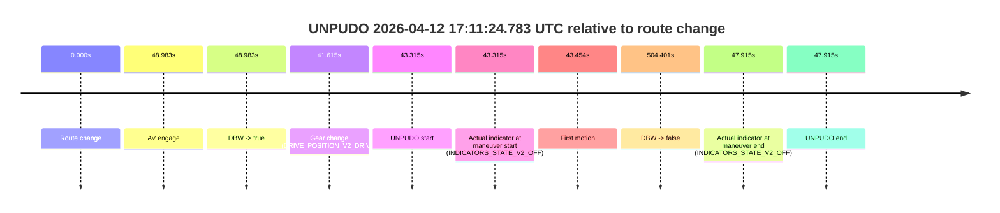
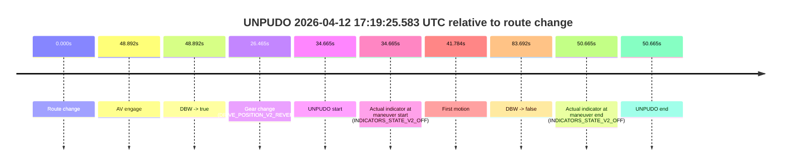
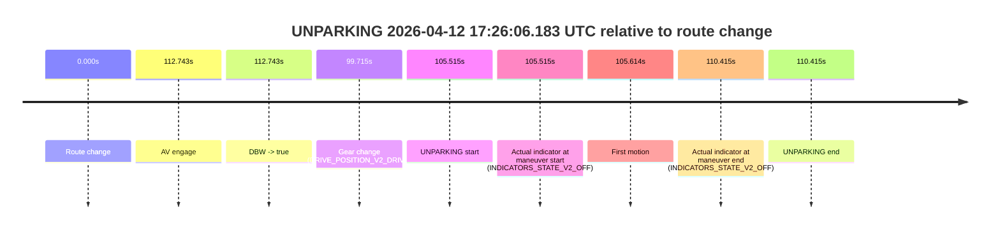

# Run Report: fme10010/2026-04-12--17-09-03--gen2-av-714f1a48-5d2d-4e30-84c9-abdd2db5559b

| Field | Value |
|---|---|
| Run ID | `fme10010/2026-04-12--17-09-03--gen2-av-714f1a48-5d2d-4e30-84c9-abdd2db5559b` |
| Date | `2026-04-12` |
| Model(s) | `lively-orange-horse` |
| Author | `guy.geva` |
| Event count | `3` |

## unpudo 2026-04-12 17:11:24.783 UTC

| Field | Value |
|---|---|
| Model | `lively-orange-horse` |
| Author | `guy.geva` |
| Run ID | `fme10010/2026-04-12--17-09-03--gen2-av-714f1a48-5d2d-4e30-84c9-abdd2db5559b` |
| Date | `2026-04-12` |
| Time (UTC) | `17:11:24.783` |
| Event type | `unpudo` |
| Disengagement type | `none observed` |
| Route change | `found` |
| Console | [run](https://console.sso.wayve.ai/run/fme10010/2026-04-12--17-09-03--gen2-av-714f1a48-5d2d-4e30-84c9-abdd2db5559b?id=&time-unixus=1776013884783300) |
| Foxglove | [segment](https://app.foxglove.dev/wayve-on-prem/p/prj_0dX18KZdVHg1fmmI/view?ds=foxglove-stream&ds.deviceName=fme10010&ds.start=2026-04-12T17%3A10%3A31.468748Z&ds.end=2026-04-12T17%3A19%3A15.870209Z&layoutId=lay_0e7VD4WIKDQGU73Y&time=2026-04-12T17%3A11%3A24.783300Z) |

### Event card: fail

- Fail: the credited unpudo does not stay AV-owned. The event window starts with DBW false, and the maneuver outcome lands outside a clean AV-owned segment.

| Event | Time (UTC) | Delta from route change |
|---|---:|---:|
| Route change | 2026-04-12 17:10:41.468 | `0.000s` |
| AV engage | 2026-04-12 17:11:30.451 | `48.983s` |
| DBW -> true | 2026-04-12 17:11:30.451 | `48.983s` |
| Gear change (DRIVE_POSITION_V2_DRIVE) | 2026-04-12 17:11:23.083 | `41.615s` |
| UNPUDO start | 2026-04-12 17:11:24.783 | `43.315s` |
| Actual indicator at maneuver start (INDICATORS_STATE_V2_OFF) | 2026-04-12 17:11:24.783 | `43.315s` |
| First motion | 2026-04-12 17:11:24.922 | `43.454s` |
| DBW -> false | 2026-04-12 17:19:05.870 | `504.401s` |
| Actual indicator at maneuver end (INDICATORS_STATE_V2_OFF) | 2026-04-12 17:11:29.383 | `47.915s` |
| UNPUDO end | 2026-04-12 17:11:29.383 | `47.915s` |

| Metric | Value |
|---|---|
| Outcome | `fail` |
| Effective failure type | `completed_outside_av` |
| Route change status | `found` |
| DBW at event start | `false` |
| DBW at event end | `false` |
| Predicted gear at AV start | `DRIVE_POSITION_V2_DRIVE` |
| Actual gear at AV start | `DRIVE_POSITION_V2_DRIVE` |
| Predicted gear at event start | `DRIVE_POSITION_V2_DRIVE` |
| Actual gear at event start | `DRIVE_POSITION_V2_DRIVE` |
| Planned indicator direction | `INDICATORS_STATE_V2_OFF` |
| Controller indicator direction | `INDICATORS_STATE_V2_OFF` |
| Actual indicator direction | `INDICATORS_STATE_V2_OFF` |
| Actual indicator at maneuver end | `INDICATORS_STATE_V2_OFF` |
| Driver accel help in AV | `false` |
| Driver accel help timestamp | `n/a` |
| Max accel pedal pct in AV | `0.0%` |
| Max brake pedal pct in AV | `0.0%` |
| Max speed mps in AV | `0.000` |
| Route -> AV | `48.983s` |
| AV -> event start | `-5.668s` |
| AV -> first motion | `-5.529s` |
| AV duration before disengagement | `455.419s` |
| Trajectory waypoint count | `37` |
| Driving-plan step count | `11` |

The scored portion starts from the AV-owned window, not from the pre-AV setup. Route-change search in the stopped pre-event segment was `found`, with the baseline therefore set to route change. At the event anchor the model predicts `DRIVE_POSITION_V2_DRIVE` and the actual gear is `DRIVE_POSITION_V2_DRIVE`. The effective model outcome is `fail` because `completed_outside_av`.

### Resolution

| Field | Value |
|---|---|
| Final outcome | `fail` |
| Do we agree with this label? | `yes` |
| Source disengagement type | `none observed` |
| Resolved effective failure type | `completed_outside_av` |
| Confidence | `high` |

## unpudo 2026-04-12 17:19:25.583 UTC

| Field | Value |
|---|---|
| Model | `lively-orange-horse` |
| Author | `guy.geva` |
| Run ID | `fme10010/2026-04-12--17-09-03--gen2-av-714f1a48-5d2d-4e30-84c9-abdd2db5559b` |
| Date | `2026-04-12` |
| Time (UTC) | `17:19:25.583` |
| Event type | `unpudo` |
| Disengagement type | `none observed` |
| Route change | `found` |
| Console | [run](https://console.sso.wayve.ai/run/fme10010/2026-04-12--17-09-03--gen2-av-714f1a48-5d2d-4e30-84c9-abdd2db5559b?id=&time-unixus=1776014365583311) |
| Foxglove | [segment](https://app.foxglove.dev/wayve-on-prem/p/prj_0dX18KZdVHg1fmmI/view?ds=foxglove-stream&ds.deviceName=fme10010&ds.start=2026-04-12T17%3A18%3A40.918254Z&ds.end=2026-04-12T17%3A20%3A24.610471Z&layoutId=lay_0e7VD4WIKDQGU73Y&time=2026-04-12T17%3A19%3A25.583311Z) |

### Event card: fail

- Fail: the credited unpudo does not stay AV-owned. The event window starts with DBW false, and the maneuver outcome lands outside a clean AV-owned segment.

| Event | Time (UTC) | Delta from route change |
|---|---:|---:|
| Route change | 2026-04-12 17:18:50.918 | `0.000s` |
| AV engage | 2026-04-12 17:19:39.810 | `48.892s` |
| DBW -> true | 2026-04-12 17:19:39.810 | `48.892s` |
| Gear change (DRIVE_POSITION_V2_REVERSE) | 2026-04-12 17:19:17.383 | `26.465s` |
| UNPUDO start | 2026-04-12 17:19:25.583 | `34.665s` |
| Actual indicator at maneuver start (INDICATORS_STATE_V2_OFF) | 2026-04-12 17:19:25.583 | `34.665s` |
| First motion | 2026-04-12 17:19:32.702 | `41.784s` |
| DBW -> false | 2026-04-12 17:20:14.610 | `83.692s` |
| Actual indicator at maneuver end (INDICATORS_STATE_V2_OFF) | 2026-04-12 17:19:41.583 | `50.665s` |
| UNPUDO end | 2026-04-12 17:19:41.583 | `50.665s` |

| Metric | Value |
|---|---|
| Outcome | `fail` |
| Effective failure type | `completed_outside_av` |
| Route change status | `found` |
| DBW at event start | `false` |
| DBW at event end | `true` |
| Predicted gear at AV start | `DRIVE_POSITION_V2_DRIVE` |
| Actual gear at AV start | `DRIVE_POSITION_V2_DRIVE` |
| Predicted gear at event start | `DRIVE_POSITION_V2_DRIVE` |
| Actual gear at event start | `DRIVE_POSITION_V2_REVERSE` |
| Planned indicator direction | `INDICATORS_STATE_V2_OFF` |
| Controller indicator direction | `INDICATORS_STATE_V2_OFF` |
| Actual indicator direction | `INDICATORS_STATE_V2_OFF` |
| Actual indicator at maneuver end | `INDICATORS_STATE_V2_OFF` |
| Driver accel help in AV | `false` |
| Driver accel help timestamp | `n/a` |
| Max accel pedal pct in AV | `0.0%` |
| Max brake pedal pct in AV | `0.0%` |
| Max speed mps in AV | `2.239` |
| Route -> AV | `48.892s` |
| AV -> event start | `-14.227s` |
| AV -> first motion | `-7.108s` |
| AV duration before disengagement | `34.800s` |
| Trajectory waypoint count | `37` |
| Driving-plan step count | `11` |

The scored portion starts from the AV-owned window, not from the pre-AV setup. Route-change search in the stopped pre-event segment was `found`, with the baseline therefore set to route change. At the event anchor the model predicts `DRIVE_POSITION_V2_DRIVE` and the actual gear is `DRIVE_POSITION_V2_REVERSE`. The effective model outcome is `fail` because `completed_outside_av`.

### Resolution

| Field | Value |
|---|---|
| Final outcome | `fail` |
| Do we agree with this label? | `yes` |
| Source disengagement type | `none observed` |
| Resolved effective failure type | `completed_outside_av` |
| Confidence | `high` |

## unparking 2026-04-12 17:26:06.183 UTC

| Field | Value |
|---|---|
| Model | `lively-orange-horse` |
| Author | `guy.geva` |
| Run ID | `fme10010/2026-04-12--17-09-03--gen2-av-714f1a48-5d2d-4e30-84c9-abdd2db5559b` |
| Date | `2026-04-12` |
| Time (UTC) | `17:26:06.183` |
| Event type | `unparking` |
| Disengagement type | `failed_to_unpudo` |
| Route change | `found` |
| Console | [run](https://console.sso.wayve.ai/run/fme10010/2026-04-12--17-09-03--gen2-av-714f1a48-5d2d-4e30-84c9-abdd2db5559b?id=&time-unixus=1776014766183302) |
| Foxglove | [segment](https://app.foxglove.dev/wayve-on-prem/p/prj_0dX18KZdVHg1fmmI/view?ds=foxglove-stream&ds.deviceName=fme10010&ds.start=2026-04-12T17%3A24%3A10.668254Z&ds.end=2026-04-12T17%3A26%3A21.083294Z&layoutId=lay_0e7VD4WIKDQGU73Y&time=2026-04-12T17%3A26%3A06.183302Z) |

### Event card: fail

- Fail: AV owns part of the segment, but the event still resolves as a model-performance failure under the AV-only scoring rule.

| Event | Time (UTC) | Delta from route change |
|---|---:|---:|
| Route change | 2026-04-12 17:24:20.668 | `0.000s` |
| AV engage | 2026-04-12 17:26:13.411 | `112.743s` |
| DBW -> true | 2026-04-12 17:26:13.411 | `112.743s` |
| Gear change (DRIVE_POSITION_V2_DRIVE) | 2026-04-12 17:26:00.383 | `99.715s` |
| UNPARKING start | 2026-04-12 17:26:06.183 | `105.515s` |
| Actual indicator at maneuver start (INDICATORS_STATE_V2_OFF) | 2026-04-12 17:26:06.183 | `105.515s` |
| First motion | 2026-04-12 17:26:06.282 | `105.614s` |
| Actual indicator at maneuver end (INDICATORS_STATE_V2_OFF) | 2026-04-12 17:26:11.083 | `110.415s` |
| UNPARKING end | 2026-04-12 17:26:11.083 | `110.415s` |

| Metric | Value |
|---|---|
| Outcome | `fail` |
| Effective failure type | `failed_to_unpudo` |
| Route change status | `found` |
| DBW at event start | `false` |
| DBW at event end | `false` |
| Predicted gear at AV start | `DRIVE_POSITION_V2_DRIVE` |
| Actual gear at AV start | `DRIVE_POSITION_V2_DRIVE` |
| Predicted gear at event start | `DRIVE_POSITION_V2_DRIVE` |
| Actual gear at event start | `DRIVE_POSITION_V2_DRIVE` |
| Planned indicator direction | `INDICATORS_STATE_V2_LEFT_ON` |
| Controller indicator direction | `INDICATORS_STATE_V2_LEFT_ON` |
| Actual indicator direction | `INDICATORS_STATE_V2_OFF` |
| Actual indicator at maneuver end | `INDICATORS_STATE_V2_OFF` |
| Driver accel help in AV | `false` |
| Driver accel help timestamp | `n/a` |
| Max accel pedal pct in AV | `0.0%` |
| Max brake pedal pct in AV | `0.0%` |
| Max speed mps in AV | `0.000` |
| Route -> AV | `112.743s` |
| AV -> event start | `-7.228s` |
| AV -> first motion | `-7.129s` |
| AV duration before disengagement | `n/a` |
| Trajectory waypoint count | `37` |
| Driving-plan step count | `11` |

The scored portion starts from the AV-owned window, not from the pre-AV setup. Route-change search in the stopped pre-event segment was `found`, with the baseline therefore set to route change. At the event anchor the model predicts `DRIVE_POSITION_V2_DRIVE` and the actual gear is `DRIVE_POSITION_V2_DRIVE`. The effective model outcome is `fail` because `failed_to_unpudo`.

### Resolution

| Field | Value |
|---|---|
| Final outcome | `fail` |
| Do we agree with this label? | `yes` |
| Source disengagement type | `failed_to_unpudo` |
| Resolved effective failure type | `failed_to_unpudo` |
| Confidence | `high` |
