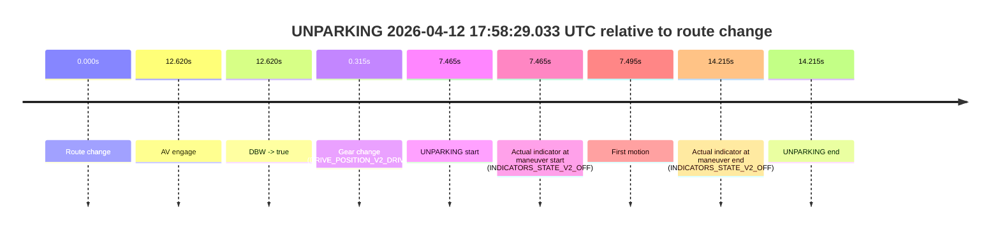

# Run Report: fme10010/2026-04-12--17-41-40--gen2-av-0fde314a-554e-4d86-9c9d-f6421690937c

| Field | Value |
|---|---|
| Run ID | `fme10010/2026-04-12--17-41-40--gen2-av-0fde314a-554e-4d86-9c9d-f6421690937c` |
| Date | `2026-04-12` |
| Model(s) | `lively-orange-horse` |
| Author | `guy.geva` |
| Event count | `1` |

## unparking 2026-04-12 17:58:29.033 UTC

| Field | Value |
|---|---|
| Model | `lively-orange-horse` |
| Author | `guy.geva` |
| Run ID | `fme10010/2026-04-12--17-41-40--gen2-av-0fde314a-554e-4d86-9c9d-f6421690937c` |
| Date | `2026-04-12` |
| Time (UTC) | `17:58:29.033` |
| Event type | `unparking` |
| Disengagement type | `failed_to_unpudo` |
| Route change | `found` |
| Console | [run](https://console.sso.wayve.ai/run/fme10010/2026-04-12--17-41-40--gen2-av-0fde314a-554e-4d86-9c9d-f6421690937c?id=&time-unixus=1776016709033300) |
| Foxglove | [segment](https://app.foxglove.dev/wayve-on-prem/p/prj_0dX18KZdVHg1fmmI/view?ds=foxglove-stream&ds.deviceName=fme10010&ds.start=2026-04-12T17%3A58%3A11.568291Z&ds.end=2026-04-12T17%3A58%3A45.783322Z&layoutId=lay_0e7VD4WIKDQGU73Y&time=2026-04-12T17%3A58%3A29.033300Z) |

### Event card: fail

- Fail: AV owns part of the segment, but the event still resolves as a model-performance failure under the AV-only scoring rule.

| Event | Time (UTC) | Delta from route change |
|---|---:|---:|
| Route change | 2026-04-12 17:58:21.568 | `0.000s` |
| AV engage | 2026-04-12 17:58:34.188 | `12.620s` |
| DBW -> true | 2026-04-12 17:58:34.188 | `12.620s` |
| Gear change (DRIVE_POSITION_V2_DRIVE) | 2026-04-12 17:58:21.883 | `0.315s` |
| UNPARKING start | 2026-04-12 17:58:29.033 | `7.465s` |
| Actual indicator at maneuver start (INDICATORS_STATE_V2_OFF) | 2026-04-12 17:58:29.033 | `7.465s` |
| First motion | 2026-04-12 17:58:29.062 | `7.495s` |
| Actual indicator at maneuver end (INDICATORS_STATE_V2_OFF) | 2026-04-12 17:58:35.783 | `14.215s` |
| UNPARKING end | 2026-04-12 17:58:35.783 | `14.215s` |

| Metric | Value |
|---|---|
| Outcome | `fail` |
| Effective failure type | `failed_to_unpudo` |
| Route change status | `found` |
| DBW at event start | `false` |
| DBW at event end | `true` |
| Predicted gear at AV start | `DRIVE_POSITION_V2_DRIVE` |
| Actual gear at AV start | `DRIVE_POSITION_V2_DRIVE` |
| Predicted gear at event start | `DRIVE_POSITION_V2_DRIVE` |
| Actual gear at event start | `DRIVE_POSITION_V2_DRIVE` |
| Planned indicator direction | `INDICATORS_STATE_V2_OFF` |
| Controller indicator direction | `INDICATORS_STATE_V2_OFF` |
| Actual indicator direction | `INDICATORS_STATE_V2_OFF` |
| Actual indicator at maneuver end | `INDICATORS_STATE_V2_OFF` |
| Driver accel help in AV | `false` |
| Driver accel help timestamp | `n/a` |
| Max accel pedal pct in AV | `0.0%` |
| Max brake pedal pct in AV | `0.0%` |
| Max speed mps in AV | `2.244` |
| Route -> AV | `12.620s` |
| AV -> event start | `-5.155s` |
| AV -> first motion | `-5.125s` |
| AV duration before disengagement | `n/a` |
| Trajectory waypoint count | `37` |
| Driving-plan step count | `11` |

The scored portion starts from the AV-owned window, not from the pre-AV setup. Route-change search in the stopped pre-event segment was `found`, with the baseline therefore set to route change. At the event anchor the model predicts `DRIVE_POSITION_V2_DRIVE` and the actual gear is `DRIVE_POSITION_V2_DRIVE`. The effective model outcome is `fail` because `failed_to_unpudo`.

### Resolution

| Field | Value |
|---|---|
| Final outcome | `fail` |
| Do we agree with this label? | `yes` |
| Source disengagement type | `failed_to_unpudo` |
| Resolved effective failure type | `failed_to_unpudo` |
| Confidence | `high` |
