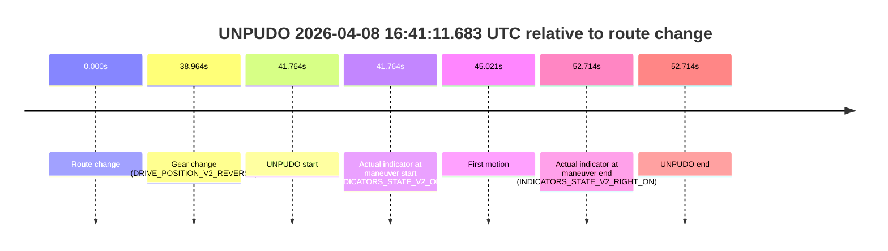
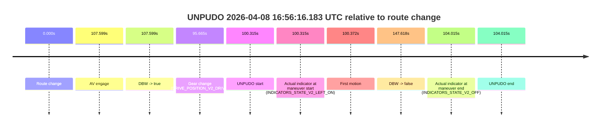
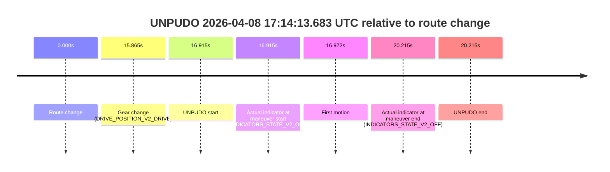
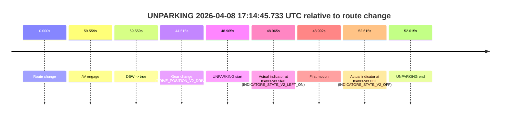

# Run Report: fme10011/2026-04-08--16-28-31--gen2-av-e5e2d816-77d2-4eae-a6cb-355020e04b57

| Field | Value |
|---|---|
| Run ID | `fme10011/2026-04-08--16-28-31--gen2-av-e5e2d816-77d2-4eae-a6cb-355020e04b57` |
| Date | `2026-04-08` |
| Model(s) | `lively-orange-horse` |
| Author | `guy.geva` |
| Event count | `4` |

## unpudo 2026-04-08 16:41:11.683 UTC

| Field | Value |
|---|---|
| Model | `lively-orange-horse` |
| Author | `guy.geva` |
| Run ID | `fme10011/2026-04-08--16-28-31--gen2-av-e5e2d816-77d2-4eae-a6cb-355020e04b57` |
| Date | `2026-04-08` |
| Time (UTC) | `16:41:11.683` |
| Event type | `unpudo` |
| Disengagement type | `failed_to_pudo` |
| Route change | `found` |
| Console | [run](https://console.sso.wayve.ai/run/fme10011/2026-04-08--16-28-31--gen2-av-e5e2d816-77d2-4eae-a6cb-355020e04b57?id=&time-unixus=1775666471683295) |
| Foxglove | [segment](https://app.foxglove.dev/wayve-on-prem/p/prj_0dX18KZdVHg1fmmI/view?ds=foxglove-stream&ds.deviceName=fme10011&ds.start=2026-04-08T16%3A40%3A19.919615Z&ds.end=2026-04-08T16%3A41%3A32.633295Z&layoutId=lay_0e7VD4WIKDQGU73Y&time=2026-04-08T16%3A41%3A11.683295Z) |

### Event card: fail

- Fail: AV owns part of the segment, but the event still resolves as a model-performance failure under the AV-only scoring rule.

| Event | Time (UTC) | Delta from route change |
|---|---:|---:|
| Route change | 2026-04-08 16:40:29.919 | `0.000s` |
| Gear change (DRIVE_POSITION_V2_REVERSE) | 2026-04-08 16:41:08.883 | `38.964s` |
| UNPUDO start | 2026-04-08 16:41:11.683 | `41.764s` |
| Actual indicator at maneuver start (INDICATORS_STATE_V2_OFF) | 2026-04-08 16:41:11.683 | `41.764s` |
| First motion | 2026-04-08 16:41:14.940 | `45.021s` |
| Actual indicator at maneuver end (INDICATORS_STATE_V2_RIGHT_ON) | 2026-04-08 16:41:22.633 | `52.714s` |
| UNPUDO end | 2026-04-08 16:41:22.633 | `52.714s` |

| Metric | Value |
|---|---|
| Outcome | `fail` |
| Effective failure type | `failed_to_pudo` |
| Route change status | `found` |
| DBW at event start | `false` |
| DBW at event end | `false` |
| Predicted gear at AV start | `n/a` |
| Actual gear at AV start | `n/a` |
| Predicted gear at event start | `DRIVE_POSITION_V2_REVERSE` |
| Actual gear at event start | `DRIVE_POSITION_V2_REVERSE` |
| Planned indicator direction | `INDICATORS_STATE_V2_OFF` |
| Controller indicator direction | `INDICATORS_STATE_V2_OFF` |
| Actual indicator direction | `INDICATORS_STATE_V2_OFF` |
| Actual indicator at maneuver end | `INDICATORS_STATE_V2_RIGHT_ON` |
| Driver accel help in AV | `false` |
| Driver accel help timestamp | `n/a` |
| Max accel pedal pct in AV | `0.0%` |
| Max brake pedal pct in AV | `0.0%` |
| Max speed mps in AV | `0.000` |
| Route -> AV | `n/a` |
| AV -> event start | `n/a` |
| AV -> first motion | `n/a` |
| AV duration before disengagement | `n/a` |
| Trajectory waypoint count | `36` |
| Driving-plan step count | `11` |

The scored portion starts from the AV-owned window, not from the pre-AV setup. Route-change search in the stopped pre-event segment was `found`, with the baseline therefore set to route change. At the event anchor the model predicts `DRIVE_POSITION_V2_REVERSE` and the actual gear is `DRIVE_POSITION_V2_REVERSE`. The effective model outcome is `fail` because `failed_to_pudo`.

### Resolution

| Field | Value |
|---|---|
| Final outcome | `fail` |
| Do we agree with this label? | `yes` |
| Source disengagement type | `failed_to_pudo` |
| Resolved effective failure type | `failed_to_pudo` |
| Confidence | `high` |

## unpudo 2026-04-08 16:56:16.183 UTC

| Field | Value |
|---|---|
| Model | `lively-orange-horse` |
| Author | `guy.geva` |
| Run ID | `fme10011/2026-04-08--16-28-31--gen2-av-e5e2d816-77d2-4eae-a6cb-355020e04b57` |
| Date | `2026-04-08` |
| Time (UTC) | `16:56:16.183` |
| Event type | `unpudo` |
| Disengagement type | `failed_to_unpudo` |
| Route change | `found` |
| Console | [run](https://console.sso.wayve.ai/run/fme10011/2026-04-08--16-28-31--gen2-av-e5e2d816-77d2-4eae-a6cb-355020e04b57?id=&time-unixus=1775667376183299) |
| Foxglove | [segment](https://app.foxglove.dev/wayve-on-prem/p/prj_0dX18KZdVHg1fmmI/view?ds=foxglove-stream&ds.deviceName=fme10011&ds.start=2026-04-08T16%3A54%3A25.868265Z&ds.end=2026-04-08T16%3A57%3A13.486655Z&layoutId=lay_0e7VD4WIKDQGU73Y&time=2026-04-08T16%3A56%3A16.183299Z) |

### Event card: fail

- Fail: AV owns part of the segment, but the event still resolves as a model-performance failure under the AV-only scoring rule.

| Event | Time (UTC) | Delta from route change |
|---|---:|---:|
| Route change | 2026-04-08 16:54:35.868 | `0.000s` |
| AV engage | 2026-04-08 16:56:23.467 | `107.599s` |
| DBW -> true | 2026-04-08 16:56:23.467 | `107.599s` |
| Gear change (DRIVE_POSITION_V2_DRIVE) | 2026-04-08 16:56:11.533 | `95.665s` |
| UNPUDO start | 2026-04-08 16:56:16.183 | `100.315s` |
| Actual indicator at maneuver start (INDICATORS_STATE_V2_LEFT_ON) | 2026-04-08 16:56:16.183 | `100.315s` |
| First motion | 2026-04-08 16:56:16.240 | `100.372s` |
| DBW -> false | 2026-04-08 16:57:03.486 | `147.618s` |
| Actual indicator at maneuver end (INDICATORS_STATE_V2_OFF) | 2026-04-08 16:56:19.883 | `104.015s` |
| UNPUDO end | 2026-04-08 16:56:19.883 | `104.015s` |

| Metric | Value |
|---|---|
| Outcome | `fail` |
| Effective failure type | `failed_to_unpudo` |
| Route change status | `found` |
| DBW at event start | `false` |
| DBW at event end | `false` |
| Predicted gear at AV start | `DRIVE_POSITION_V2_DRIVE` |
| Actual gear at AV start | `DRIVE_POSITION_V2_DRIVE` |
| Predicted gear at event start | `DRIVE_POSITION_V2_DRIVE` |
| Actual gear at event start | `DRIVE_POSITION_V2_DRIVE` |
| Planned indicator direction | `INDICATORS_STATE_V2_LEFT_ON` |
| Controller indicator direction | `INDICATORS_STATE_V2_LEFT_ON` |
| Actual indicator direction | `INDICATORS_STATE_V2_LEFT_ON` |
| Actual indicator at maneuver end | `INDICATORS_STATE_V2_OFF` |
| Driver accel help in AV | `false` |
| Driver accel help timestamp | `n/a` |
| Max accel pedal pct in AV | `0.0%` |
| Max brake pedal pct in AV | `0.0%` |
| Max speed mps in AV | `0.000` |
| Route -> AV | `107.599s` |
| AV -> event start | `-7.284s` |
| AV -> first motion | `-7.227s` |
| AV duration before disengagement | `40.019s` |
| Trajectory waypoint count | `36` |
| Driving-plan step count | `11` |

The scored portion starts from the AV-owned window, not from the pre-AV setup. Route-change search in the stopped pre-event segment was `found`, with the baseline therefore set to route change. At the event anchor the model predicts `DRIVE_POSITION_V2_DRIVE` and the actual gear is `DRIVE_POSITION_V2_DRIVE`. The effective model outcome is `fail` because `failed_to_unpudo`.

### Resolution

| Field | Value |
|---|---|
| Final outcome | `fail` |
| Do we agree with this label? | `yes` |
| Source disengagement type | `failed_to_unpudo` |
| Resolved effective failure type | `failed_to_unpudo` |
| Confidence | `high` |

## unpudo 2026-04-08 17:14:13.683 UTC

| Field | Value |
|---|---|
| Model | `lively-orange-horse` |
| Author | `guy.geva` |
| Run ID | `fme10011/2026-04-08--16-28-31--gen2-av-e5e2d816-77d2-4eae-a6cb-355020e04b57` |
| Date | `2026-04-08` |
| Time (UTC) | `17:14:13.683` |
| Event type | `unpudo` |
| Disengagement type | `none observed` |
| Route change | `found` |
| Console | [run](https://console.sso.wayve.ai/run/fme10011/2026-04-08--16-28-31--gen2-av-e5e2d816-77d2-4eae-a6cb-355020e04b57?id=&time-unixus=1775668453683294) |
| Foxglove | [segment](https://app.foxglove.dev/wayve-on-prem/p/prj_0dX18KZdVHg1fmmI/view?ds=foxglove-stream&ds.deviceName=fme10011&ds.start=2026-04-08T17%3A13%3A46.768241Z&ds.end=2026-04-08T17%3A14%3A26.983323Z&layoutId=lay_0e7VD4WIKDQGU73Y&time=2026-04-08T17%3A14%3A13.683294Z) |

### Event card: fail

- Fail: the credited unpudo does not stay AV-owned. The event window starts with DBW false, and the maneuver outcome lands outside a clean AV-owned segment.

| Event | Time (UTC) | Delta from route change |
|---|---:|---:|
| Route change | 2026-04-08 17:13:56.768 | `0.000s` |
| Gear change (DRIVE_POSITION_V2_DRIVE) | 2026-04-08 17:14:12.633 | `15.865s` |
| UNPUDO start | 2026-04-08 17:14:13.683 | `16.915s` |
| Actual indicator at maneuver start (INDICATORS_STATE_V2_OFF) | 2026-04-08 17:14:13.683 | `16.915s` |
| First motion | 2026-04-08 17:14:13.740 | `16.972s` |
| Actual indicator at maneuver end (INDICATORS_STATE_V2_OFF) | 2026-04-08 17:14:16.983 | `20.215s` |
| UNPUDO end | 2026-04-08 17:14:16.983 | `20.215s` |

| Metric | Value |
|---|---|
| Outcome | `fail` |
| Effective failure type | `not_av_owned` |
| Route change status | `found` |
| DBW at event start | `false` |
| DBW at event end | `false` |
| Predicted gear at AV start | `n/a` |
| Actual gear at AV start | `n/a` |
| Predicted gear at event start | `DRIVE_POSITION_V2_DRIVE` |
| Actual gear at event start | `DRIVE_POSITION_V2_DRIVE` |
| Planned indicator direction | `INDICATORS_STATE_V2_LEFT_ON` |
| Controller indicator direction | `INDICATORS_STATE_V2_LEFT_ON` |
| Actual indicator direction | `INDICATORS_STATE_V2_OFF` |
| Actual indicator at maneuver end | `INDICATORS_STATE_V2_OFF` |
| Driver accel help in AV | `false` |
| Driver accel help timestamp | `n/a` |
| Max accel pedal pct in AV | `0.0%` |
| Max brake pedal pct in AV | `0.0%` |
| Max speed mps in AV | `0.000` |
| Route -> AV | `n/a` |
| AV -> event start | `n/a` |
| AV -> first motion | `n/a` |
| AV duration before disengagement | `n/a` |
| Trajectory waypoint count | `36` |
| Driving-plan step count | `11` |

The scored portion starts from the AV-owned window, not from the pre-AV setup. Route-change search in the stopped pre-event segment was `found`, with the baseline therefore set to route change. At the event anchor the model predicts `DRIVE_POSITION_V2_DRIVE` and the actual gear is `DRIVE_POSITION_V2_DRIVE`. The effective model outcome is `fail` because `not_av_owned`.

### Resolution

| Field | Value |
|---|---|
| Final outcome | `fail` |
| Do we agree with this label? | `yes` |
| Source disengagement type | `none observed` |
| Resolved effective failure type | `not_av_owned` |
| Confidence | `high` |

## unparking 2026-04-08 17:14:45.733 UTC

| Field | Value |
|---|---|
| Model | `lively-orange-horse` |
| Author | `guy.geva` |
| Run ID | `fme10011/2026-04-08--16-28-31--gen2-av-e5e2d816-77d2-4eae-a6cb-355020e04b57` |
| Date | `2026-04-08` |
| Time (UTC) | `17:14:45.733` |
| Event type | `unparking` |
| Disengagement type | `failed_to_unpudo` |
| Route change | `found` |
| Console | [run](https://console.sso.wayve.ai/run/fme10011/2026-04-08--16-28-31--gen2-av-e5e2d816-77d2-4eae-a6cb-355020e04b57?id=&time-unixus=1775668485733316) |
| Foxglove | [segment](https://app.foxglove.dev/wayve-on-prem/p/prj_0dX18KZdVHg1fmmI/view?ds=foxglove-stream&ds.deviceName=fme10011&ds.start=2026-04-08T17%3A13%3A46.768241Z&ds.end=2026-04-08T17%3A14%3A59.383315Z&layoutId=lay_0e7VD4WIKDQGU73Y&time=2026-04-08T17%3A14%3A45.733316Z) |

### Event card: fail

- Fail: AV owns part of the segment, but the event still resolves as a model-performance failure under the AV-only scoring rule.

| Event | Time (UTC) | Delta from route change |
|---|---:|---:|
| Route change | 2026-04-08 17:13:56.768 | `0.000s` |
| AV engage | 2026-04-08 17:14:56.327 | `59.559s` |
| DBW -> true | 2026-04-08 17:14:56.327 | `59.559s` |
| Gear change (DRIVE_POSITION_V2_DRIVE) | 2026-04-08 17:14:41.283 | `44.515s` |
| UNPARKING start | 2026-04-08 17:14:45.733 | `48.965s` |
| Actual indicator at maneuver start (INDICATORS_STATE_V2_LEFT_ON) | 2026-04-08 17:14:45.733 | `48.965s` |
| First motion | 2026-04-08 17:14:45.760 | `48.992s` |
| Actual indicator at maneuver end (INDICATORS_STATE_V2_OFF) | 2026-04-08 17:14:49.383 | `52.615s` |
| UNPARKING end | 2026-04-08 17:14:49.383 | `52.615s` |

| Metric | Value |
|---|---|
| Outcome | `fail` |
| Effective failure type | `failed_to_unpudo` |
| Route change status | `found` |
| DBW at event start | `false` |
| DBW at event end | `false` |
| Predicted gear at AV start | `DRIVE_POSITION_V2_DRIVE` |
| Actual gear at AV start | `DRIVE_POSITION_V2_DRIVE` |
| Predicted gear at event start | `DRIVE_POSITION_V2_DRIVE` |
| Actual gear at event start | `DRIVE_POSITION_V2_DRIVE` |
| Planned indicator direction | `INDICATORS_STATE_V2_LEFT_ON` |
| Controller indicator direction | `INDICATORS_STATE_V2_LEFT_ON` |
| Actual indicator direction | `INDICATORS_STATE_V2_LEFT_ON` |
| Actual indicator at maneuver end | `INDICATORS_STATE_V2_OFF` |
| Driver accel help in AV | `false` |
| Driver accel help timestamp | `n/a` |
| Max accel pedal pct in AV | `0.0%` |
| Max brake pedal pct in AV | `0.0%` |
| Max speed mps in AV | `0.000` |
| Route -> AV | `59.559s` |
| AV -> event start | `-10.594s` |
| AV -> first motion | `-10.567s` |
| AV duration before disengagement | `n/a` |
| Trajectory waypoint count | `35` |
| Driving-plan step count | `11` |

The scored portion starts from the AV-owned window, not from the pre-AV setup. Route-change search in the stopped pre-event segment was `found`, with the baseline therefore set to route change. At the event anchor the model predicts `DRIVE_POSITION_V2_DRIVE` and the actual gear is `DRIVE_POSITION_V2_DRIVE`. The effective model outcome is `fail` because `failed_to_unpudo`.

### Resolution

| Field | Value |
|---|---|
| Final outcome | `fail` |
| Do we agree with this label? | `yes` |
| Source disengagement type | `failed_to_unpudo` |
| Resolved effective failure type | `failed_to_unpudo` |
| Confidence | `high` |
