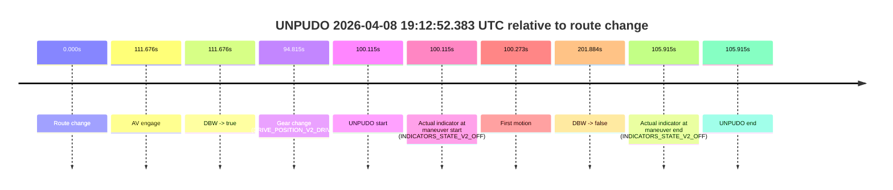
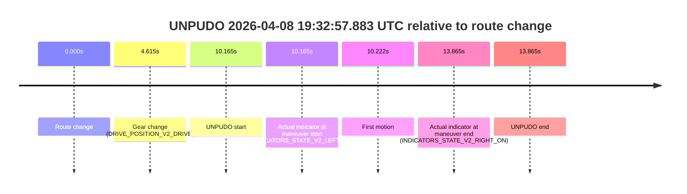
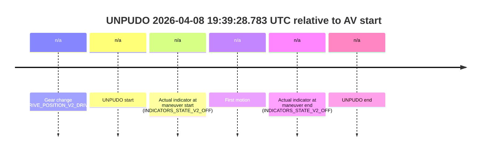
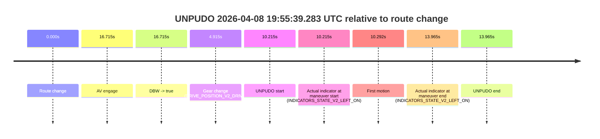

# Run Report: fme10011/2026-04-08--18-32-38--gen2-av-eab2f855-f775-4813-9bc6-1712e02f2d58

| Field | Value |
|---|---|
| Run ID | `fme10011/2026-04-08--18-32-38--gen2-av-eab2f855-f775-4813-9bc6-1712e02f2d58` |
| Date | `2026-04-08` |
| Model(s) | `lively-orange-horse` |
| Author | `guy.geva` |
| Event count | `7` |

## unpudo 2026-04-08 18:59:59.183 UTC

| Field | Value |
|---|---|
| Model | `lively-orange-horse` |
| Author | `guy.geva` |
| Run ID | `fme10011/2026-04-08--18-32-38--gen2-av-eab2f855-f775-4813-9bc6-1712e02f2d58` |
| Date | `2026-04-08` |
| Time (UTC) | `18:59:59.183` |
| Event type | `unpudo` |
| Disengagement type | `none observed` |
| Route change | `found` |
| Console | [run](https://console.sso.wayve.ai/run/fme10011/2026-04-08--18-32-38--gen2-av-eab2f855-f775-4813-9bc6-1712e02f2d58?id=&time-unixus=1775674799183317) |
| Foxglove | [segment](https://app.foxglove.dev/wayve-on-prem/p/prj_0dX18KZdVHg1fmmI/view?ds=foxglove-stream&ds.deviceName=fme10011&ds.start=2026-04-08T18%3A59%3A43.068276Z&ds.end=2026-04-08T19%3A02%3A55.262788Z&layoutId=lay_0e7VD4WIKDQGU73Y&time=2026-04-08T18%3A59%3A59.183317Z) |

### Event card: fail

- Fail: the credited unpudo does not stay AV-owned. The event window starts with DBW false, and the maneuver outcome lands outside a clean AV-owned segment.

| Event | Time (UTC) | Delta from route change |
|---|---:|---:|
| Route change | 2026-04-08 18:59:53.068 | `0.000s` |
| AV engage | 2026-04-08 19:00:06.293 | `13.225s` |
| DBW -> true | 2026-04-08 19:00:06.293 | `13.225s` |
| Gear change (DRIVE_POSITION_V2_DRIVE) | 2026-04-08 18:59:57.733 | `4.665s` |
| UNPUDO start | 2026-04-08 18:59:59.183 | `6.115s` |
| Actual indicator at maneuver start (INDICATORS_STATE_V2_OFF) | 2026-04-08 18:59:59.183 | `6.115s` |
| First motion | 2026-04-08 18:59:59.200 | `6.132s` |
| DBW -> false | 2026-04-08 19:02:45.262 | `172.195s` |
| Actual indicator at maneuver end (INDICATORS_STATE_V2_OFF) | 2026-04-08 19:00:02.583 | `9.515s` |
| UNPUDO end | 2026-04-08 19:00:02.583 | `9.515s` |

| Metric | Value |
|---|---|
| Outcome | `fail` |
| Effective failure type | `completed_outside_av` |
| Route change status | `found` |
| DBW at event start | `false` |
| DBW at event end | `false` |
| Predicted gear at AV start | `DRIVE_POSITION_V2_DRIVE` |
| Actual gear at AV start | `DRIVE_POSITION_V2_DRIVE` |
| Predicted gear at event start | `DRIVE_POSITION_V2_DRIVE` |
| Actual gear at event start | `DRIVE_POSITION_V2_DRIVE` |
| Planned indicator direction | `INDICATORS_STATE_V2_OFF` |
| Controller indicator direction | `INDICATORS_STATE_V2_OFF` |
| Actual indicator direction | `INDICATORS_STATE_V2_OFF` |
| Actual indicator at maneuver end | `INDICATORS_STATE_V2_OFF` |
| Driver accel help in AV | `false` |
| Driver accel help timestamp | `n/a` |
| Max accel pedal pct in AV | `0.0%` |
| Max brake pedal pct in AV | `0.0%` |
| Max speed mps in AV | `0.000` |
| Route -> AV | `13.225s` |
| AV -> event start | `-7.110s` |
| AV -> first motion | `-7.093s` |
| AV duration before disengagement | `158.969s` |
| Trajectory waypoint count | `37` |
| Driving-plan step count | `11` |

The scored portion starts from the AV-owned window, not from the pre-AV setup. Route-change search in the stopped pre-event segment was `found`, with the baseline therefore set to route change. At the event anchor the model predicts `DRIVE_POSITION_V2_DRIVE` and the actual gear is `DRIVE_POSITION_V2_DRIVE`. The effective model outcome is `fail` because `completed_outside_av`.

### Resolution

| Field | Value |
|---|---|
| Final outcome | `fail` |
| Do we agree with this label? | `yes` |
| Source disengagement type | `none observed` |
| Resolved effective failure type | `completed_outside_av` |
| Confidence | `high` |

## unpudo 2026-04-08 19:12:52.383 UTC

| Field | Value |
|---|---|
| Model | `lively-orange-horse` |
| Author | `guy.geva` |
| Run ID | `fme10011/2026-04-08--18-32-38--gen2-av-eab2f855-f775-4813-9bc6-1712e02f2d58` |
| Date | `2026-04-08` |
| Time (UTC) | `19:12:52.383` |
| Event type | `unpudo` |
| Disengagement type | `failed_to_unpudo` |
| Route change | `found` |
| Console | [run](https://console.sso.wayve.ai/run/fme10011/2026-04-08--18-32-38--gen2-av-eab2f855-f775-4813-9bc6-1712e02f2d58?id=&time-unixus=1775675572383300) |
| Foxglove | [segment](https://app.foxglove.dev/wayve-on-prem/p/prj_0dX18KZdVHg1fmmI/view?ds=foxglove-stream&ds.deviceName=fme10011&ds.start=2026-04-08T19%3A11%3A02.268262Z&ds.end=2026-04-08T19%3A14%3A44.152431Z&layoutId=lay_0e7VD4WIKDQGU73Y&time=2026-04-08T19%3A12%3A52.383300Z) |

### Event card: fail

- Fail: AV owns part of the segment, but the event still resolves as a model-performance failure under the AV-only scoring rule.

| Event | Time (UTC) | Delta from route change |
|---|---:|---:|
| Route change | 2026-04-08 19:11:12.268 | `0.000s` |
| AV engage | 2026-04-08 19:13:03.943 | `111.676s` |
| DBW -> true | 2026-04-08 19:13:03.943 | `111.676s` |
| Gear change (DRIVE_POSITION_V2_DRIVE) | 2026-04-08 19:12:47.083 | `94.815s` |
| UNPUDO start | 2026-04-08 19:12:52.383 | `100.115s` |
| Actual indicator at maneuver start (INDICATORS_STATE_V2_OFF) | 2026-04-08 19:12:52.383 | `100.115s` |
| First motion | 2026-04-08 19:12:52.541 | `100.273s` |
| DBW -> false | 2026-04-08 19:14:34.152 | `201.884s` |
| Actual indicator at maneuver end (INDICATORS_STATE_V2_OFF) | 2026-04-08 19:12:58.183 | `105.915s` |
| UNPUDO end | 2026-04-08 19:12:58.183 | `105.915s` |

| Metric | Value |
|---|---|
| Outcome | `fail` |
| Effective failure type | `failed_to_unpudo` |
| Route change status | `found` |
| DBW at event start | `false` |
| DBW at event end | `false` |
| Predicted gear at AV start | `DRIVE_POSITION_V2_DRIVE` |
| Actual gear at AV start | `DRIVE_POSITION_V2_DRIVE` |
| Predicted gear at event start | `DRIVE_POSITION_V2_DRIVE` |
| Actual gear at event start | `DRIVE_POSITION_V2_DRIVE` |
| Planned indicator direction | `INDICATORS_STATE_V2_LEFT_ON` |
| Controller indicator direction | `INDICATORS_STATE_V2_LEFT_ON` |
| Actual indicator direction | `INDICATORS_STATE_V2_OFF` |
| Actual indicator at maneuver end | `INDICATORS_STATE_V2_OFF` |
| Driver accel help in AV | `false` |
| Driver accel help timestamp | `n/a` |
| Max accel pedal pct in AV | `0.0%` |
| Max brake pedal pct in AV | `0.0%` |
| Max speed mps in AV | `0.000` |
| Route -> AV | `111.676s` |
| AV -> event start | `-11.560s` |
| AV -> first motion | `-11.402s` |
| AV duration before disengagement | `90.209s` |
| Trajectory waypoint count | `37` |
| Driving-plan step count | `11` |

The scored portion starts from the AV-owned window, not from the pre-AV setup. Route-change search in the stopped pre-event segment was `found`, with the baseline therefore set to route change. At the event anchor the model predicts `DRIVE_POSITION_V2_DRIVE` and the actual gear is `DRIVE_POSITION_V2_DRIVE`. The effective model outcome is `fail` because `failed_to_unpudo`.

### Resolution

| Field | Value |
|---|---|
| Final outcome | `fail` |
| Do we agree with this label? | `yes` |
| Source disengagement type | `failed_to_unpudo` |
| Resolved effective failure type | `failed_to_unpudo` |
| Confidence | `high` |

## unpudo 2026-04-08 19:32:57.883 UTC

| Field | Value |
|---|---|
| Model | `lively-orange-horse` |
| Author | `guy.geva` |
| Run ID | `fme10011/2026-04-08--18-32-38--gen2-av-eab2f855-f775-4813-9bc6-1712e02f2d58` |
| Date | `2026-04-08` |
| Time (UTC) | `19:32:57.883` |
| Event type | `unpudo` |
| Disengagement type | `failed_to_unpudo` |
| Route change | `found` |
| Console | [run](https://console.sso.wayve.ai/run/fme10011/2026-04-08--18-32-38--gen2-av-eab2f855-f775-4813-9bc6-1712e02f2d58?id=&time-unixus=1775676777883303) |
| Foxglove | [segment](https://app.foxglove.dev/wayve-on-prem/p/prj_0dX18KZdVHg1fmmI/view?ds=foxglove-stream&ds.deviceName=fme10011&ds.start=2026-04-08T19%3A32%3A37.718236Z&ds.end=2026-04-08T19%3A33%3A11.583305Z&layoutId=lay_0e7VD4WIKDQGU73Y&time=2026-04-08T19%3A32%3A57.883303Z) |

### Event card: fail

- Fail: AV owns part of the segment, but the event still resolves as a model-performance failure under the AV-only scoring rule.

| Event | Time (UTC) | Delta from route change |
|---|---:|---:|
| Route change | 2026-04-08 19:32:47.718 | `0.000s` |
| Gear change (DRIVE_POSITION_V2_DRIVE) | 2026-04-08 19:32:52.333 | `4.615s` |
| UNPUDO start | 2026-04-08 19:32:57.883 | `10.165s` |
| Actual indicator at maneuver start (INDICATORS_STATE_V2_LEFT_ON) | 2026-04-08 19:32:57.883 | `10.165s` |
| First motion | 2026-04-08 19:32:57.940 | `10.222s` |
| Actual indicator at maneuver end (INDICATORS_STATE_V2_RIGHT_ON) | 2026-04-08 19:33:01.583 | `13.865s` |
| UNPUDO end | 2026-04-08 19:33:01.583 | `13.865s` |

| Metric | Value |
|---|---|
| Outcome | `fail` |
| Effective failure type | `failed_to_unpudo` |
| Route change status | `found` |
| DBW at event start | `false` |
| DBW at event end | `false` |
| Predicted gear at AV start | `n/a` |
| Actual gear at AV start | `n/a` |
| Predicted gear at event start | `DRIVE_POSITION_V2_DRIVE` |
| Actual gear at event start | `DRIVE_POSITION_V2_DRIVE` |
| Planned indicator direction | `INDICATORS_STATE_V2_OFF` |
| Controller indicator direction | `INDICATORS_STATE_V2_OFF` |
| Actual indicator direction | `INDICATORS_STATE_V2_LEFT_ON` |
| Actual indicator at maneuver end | `INDICATORS_STATE_V2_RIGHT_ON` |
| Driver accel help in AV | `false` |
| Driver accel help timestamp | `n/a` |
| Max accel pedal pct in AV | `0.0%` |
| Max brake pedal pct in AV | `0.0%` |
| Max speed mps in AV | `0.000` |
| Route -> AV | `n/a` |
| AV -> event start | `n/a` |
| AV -> first motion | `n/a` |
| AV duration before disengagement | `n/a` |
| Trajectory waypoint count | `37` |
| Driving-plan step count | `11` |

The scored portion starts from the AV-owned window, not from the pre-AV setup. Route-change search in the stopped pre-event segment was `found`, with the baseline therefore set to route change. At the event anchor the model predicts `DRIVE_POSITION_V2_DRIVE` and the actual gear is `DRIVE_POSITION_V2_DRIVE`. The effective model outcome is `fail` because `failed_to_unpudo`.

### Resolution

| Field | Value |
|---|---|
| Final outcome | `fail` |
| Do we agree with this label? | `yes` |
| Source disengagement type | `failed_to_unpudo` |
| Resolved effective failure type | `failed_to_unpudo` |
| Confidence | `high` |

## unpudo 2026-04-08 19:33:16.183 UTC

| Field | Value |
|---|---|
| Model | `lively-orange-horse` |
| Author | `guy.geva` |
| Run ID | `fme10011/2026-04-08--18-32-38--gen2-av-eab2f855-f775-4813-9bc6-1712e02f2d58` |
| Date | `2026-04-08` |
| Time (UTC) | `19:33:16.183` |
| Event type | `unpudo` |
| Disengagement type | `none observed` |
| Route change | `found` |
| Console | [run](https://console.sso.wayve.ai/run/fme10011/2026-04-08--18-32-38--gen2-av-eab2f855-f775-4813-9bc6-1712e02f2d58?id=&time-unixus=1775676796183300) |
| Foxglove | [segment](https://app.foxglove.dev/wayve-on-prem/p/prj_0dX18KZdVHg1fmmI/view?ds=foxglove-stream&ds.deviceName=fme10011&ds.start=2026-04-08T19%3A32%3A37.718236Z&ds.end=2026-04-08T19%3A33%3A50.433544Z&layoutId=lay_0e7VD4WIKDQGU73Y&time=2026-04-08T19%3A33%3A16.183300Z) |

### Event card: fail

- Fail: the credited unpudo does not stay AV-owned. The event window starts with DBW false, and the maneuver outcome lands outside a clean AV-owned segment.

| Event | Time (UTC) | Delta from route change |
|---|---:|---:|
| Route change | 2026-04-08 19:32:47.718 | `0.000s` |
| AV engage | 2026-04-08 19:33:22.963 | `35.245s` |
| DBW -> true | 2026-04-08 19:33:22.963 | `35.245s` |
| Gear change (DRIVE_POSITION_V2_DRIVE) | 2026-04-08 19:33:13.783 | `26.065s` |
| UNPUDO start | 2026-04-08 19:33:16.183 | `28.465s` |
| Actual indicator at maneuver start (INDICATORS_STATE_V2_LEFT_ON) | 2026-04-08 19:33:16.183 | `28.465s` |
| First motion | 2026-04-08 19:33:16.201 | `28.483s` |
| DBW -> false | 2026-04-08 19:33:40.433 | `52.715s` |
| Actual indicator at maneuver end (INDICATORS_STATE_V2_OFF) | 2026-04-08 19:33:19.433 | `31.715s` |
| UNPUDO end | 2026-04-08 19:33:19.433 | `31.715s` |

| Metric | Value |
|---|---|
| Outcome | `fail` |
| Effective failure type | `completed_outside_av` |
| Route change status | `found` |
| DBW at event start | `false` |
| DBW at event end | `false` |
| Predicted gear at AV start | `DRIVE_POSITION_V2_DRIVE` |
| Actual gear at AV start | `DRIVE_POSITION_V2_DRIVE` |
| Predicted gear at event start | `DRIVE_POSITION_V2_DRIVE` |
| Actual gear at event start | `DRIVE_POSITION_V2_DRIVE` |
| Planned indicator direction | `INDICATORS_STATE_V2_LEFT_ON` |
| Controller indicator direction | `INDICATORS_STATE_V2_LEFT_ON` |
| Actual indicator direction | `INDICATORS_STATE_V2_LEFT_ON` |
| Actual indicator at maneuver end | `INDICATORS_STATE_V2_OFF` |
| Driver accel help in AV | `false` |
| Driver accel help timestamp | `n/a` |
| Max accel pedal pct in AV | `0.0%` |
| Max brake pedal pct in AV | `0.0%` |
| Max speed mps in AV | `0.000` |
| Route -> AV | `35.245s` |
| AV -> event start | `-6.780s` |
| AV -> first motion | `-6.762s` |
| AV duration before disengagement | `17.470s` |
| Trajectory waypoint count | `37` |
| Driving-plan step count | `11` |

The scored portion starts from the AV-owned window, not from the pre-AV setup. Route-change search in the stopped pre-event segment was `found`, with the baseline therefore set to route change. At the event anchor the model predicts `DRIVE_POSITION_V2_DRIVE` and the actual gear is `DRIVE_POSITION_V2_DRIVE`. The effective model outcome is `fail` because `completed_outside_av`.

### Resolution

| Field | Value |
|---|---|
| Final outcome | `fail` |
| Do we agree with this label? | `yes` |
| Source disengagement type | `none observed` |
| Resolved effective failure type | `completed_outside_av` |
| Confidence | `high` |

## unpudo 2026-04-08 19:39:28.783 UTC

| Field | Value |
|---|---|
| Model | `lively-orange-horse` |
| Author | `guy.geva` |
| Run ID | `fme10011/2026-04-08--18-32-38--gen2-av-eab2f855-f775-4813-9bc6-1712e02f2d58` |
| Date | `2026-04-08` |
| Time (UTC) | `19:39:28.783` |
| Event type | `unpudo` |
| Disengagement type | `failed_to_unpudo` |
| Route change | `not found` |
| Console | [run](https://console.sso.wayve.ai/run/fme10011/2026-04-08--18-32-38--gen2-av-eab2f855-f775-4813-9bc6-1712e02f2d58?id=&time-unixus=1775677168783304) |
| Foxglove | [segment](https://app.foxglove.dev/wayve-on-prem/p/prj_0dX18KZdVHg1fmmI/view?ds=foxglove-stream&ds.deviceName=fme10011&ds.start=2026-04-08T19%3A39%3A13.033300Z&ds.end=2026-04-08T19%3A39%3A41.833295Z&layoutId=lay_0e7VD4WIKDQGU73Y&time=2026-04-08T19%3A39%3A28.783304Z) |

### Event card: fail

- Fail: AV owns part of the segment, but the event still resolves as a model-performance failure under the AV-only scoring rule.

| Event | Time (UTC) | Delta from AV start |
|---|---:|---:|
| Gear change (DRIVE_POSITION_V2_DRIVE) | 2026-04-08 19:39:23.033 | `n/a` |
| UNPUDO start | 2026-04-08 19:39:28.783 | `n/a` |
| Actual indicator at maneuver start (INDICATORS_STATE_V2_OFF) | 2026-04-08 19:39:28.783 | `n/a` |
| First motion | 2026-04-08 19:39:28.840 | `n/a` |
| Actual indicator at maneuver end (INDICATORS_STATE_V2_OFF) | 2026-04-08 19:39:31.833 | `n/a` |
| UNPUDO end | 2026-04-08 19:39:31.833 | `n/a` |

| Metric | Value |
|---|---|
| Outcome | `fail` |
| Effective failure type | `failed_to_unpudo` |
| Route change status | `not found` |
| DBW at event start | `false` |
| DBW at event end | `false` |
| Predicted gear at AV start | `n/a` |
| Actual gear at AV start | `n/a` |
| Predicted gear at event start | `DRIVE_POSITION_V2_DRIVE` |
| Actual gear at event start | `DRIVE_POSITION_V2_DRIVE` |
| Planned indicator direction | `INDICATORS_STATE_V2_LEFT_ON` |
| Controller indicator direction | `INDICATORS_STATE_V2_LEFT_ON` |
| Actual indicator direction | `INDICATORS_STATE_V2_OFF` |
| Actual indicator at maneuver end | `INDICATORS_STATE_V2_OFF` |
| Driver accel help in AV | `false` |
| Driver accel help timestamp | `n/a` |
| Max accel pedal pct in AV | `0.0%` |
| Max brake pedal pct in AV | `0.0%` |
| Max speed mps in AV | `0.000` |
| Route -> AV | `n/a` |
| AV -> event start | `n/a` |
| AV -> first motion | `n/a` |
| AV duration before disengagement | `n/a` |
| Trajectory waypoint count | `37` |
| Driving-plan step count | `11` |

The scored portion starts from the AV-owned window, not from the pre-AV setup. Route-change search in the stopped pre-event segment was `not found`, with the baseline therefore set to AV start. At the event anchor the model predicts `DRIVE_POSITION_V2_DRIVE` and the actual gear is `DRIVE_POSITION_V2_DRIVE`. The effective model outcome is `fail` because `failed_to_unpudo`.

### Resolution

| Field | Value |
|---|---|
| Final outcome | `fail` |
| Do we agree with this label? | `yes` |
| Source disengagement type | `failed_to_unpudo` |
| Resolved effective failure type | `failed_to_unpudo` |
| Confidence | `high` |

## unpudo 2026-04-08 19:48:38.733 UTC

| Field | Value |
|---|---|
| Model | `lively-orange-horse` |
| Author | `guy.geva` |
| Run ID | `fme10011/2026-04-08--18-32-38--gen2-av-eab2f855-f775-4813-9bc6-1712e02f2d58` |
| Date | `2026-04-08` |
| Time (UTC) | `19:48:38.733` |
| Event type | `unpudo` |
| Disengagement type | `failed_to_unpudo` |
| Route change | `found` |
| Console | [run](https://console.sso.wayve.ai/run/fme10011/2026-04-08--18-32-38--gen2-av-eab2f855-f775-4813-9bc6-1712e02f2d58?id=&time-unixus=1775677718733321) |
| Foxglove | [segment](https://app.foxglove.dev/wayve-on-prem/p/prj_0dX18KZdVHg1fmmI/view?ds=foxglove-stream&ds.deviceName=fme10011&ds.start=2026-04-08T19%3A48%3A10.818288Z&ds.end=2026-04-08T19%3A49%3A47.083279Z&layoutId=lay_0e7VD4WIKDQGU73Y&time=2026-04-08T19%3A48%3A38.733321Z) |

### Event card: fail

- Fail: AV owns part of the segment, but the event still resolves as a model-performance failure under the AV-only scoring rule.

| Event | Time (UTC) | Delta from route change |
|---|---:|---:|
| Route change | 2026-04-08 19:48:20.818 | `0.000s` |
| AV engage | 2026-04-08 19:48:42.422 | `21.604s` |
| DBW -> true | 2026-04-08 19:48:42.422 | `21.604s` |
| Gear change (DRIVE_POSITION_V2_DRIVE) | 2026-04-08 19:48:26.583 | `5.765s` |
| UNPUDO start | 2026-04-08 19:48:38.733 | `17.915s` |
| Actual indicator at maneuver start (INDICATORS_STATE_V2_LEFT_ON) | 2026-04-08 19:48:38.733 | `17.915s` |
| First motion | 2026-04-08 19:48:38.820 | `18.002s` |
| DBW -> false | 2026-04-08 19:49:37.083 | `76.265s` |
| Actual indicator at maneuver end (INDICATORS_STATE_V2_OFF) | 2026-04-08 19:48:41.533 | `20.715s` |
| UNPUDO end | 2026-04-08 19:48:41.533 | `20.715s` |

| Metric | Value |
|---|---|
| Outcome | `fail` |
| Effective failure type | `failed_to_unpudo` |
| Route change status | `found` |
| DBW at event start | `false` |
| DBW at event end | `false` |
| Predicted gear at AV start | `DRIVE_POSITION_V2_DRIVE` |
| Actual gear at AV start | `DRIVE_POSITION_V2_DRIVE` |
| Predicted gear at event start | `DRIVE_POSITION_V2_DRIVE` |
| Actual gear at event start | `DRIVE_POSITION_V2_DRIVE` |
| Planned indicator direction | `INDICATORS_STATE_V2_RIGHT_ON` |
| Controller indicator direction | `INDICATORS_STATE_V2_RIGHT_ON` |
| Actual indicator direction | `INDICATORS_STATE_V2_LEFT_ON` |
| Actual indicator at maneuver end | `INDICATORS_STATE_V2_OFF` |
| Driver accel help in AV | `false` |
| Driver accel help timestamp | `n/a` |
| Max accel pedal pct in AV | `0.0%` |
| Max brake pedal pct in AV | `0.0%` |
| Max speed mps in AV | `0.000` |
| Route -> AV | `21.604s` |
| AV -> event start | `-3.689s` |
| AV -> first motion | `-3.602s` |
| AV duration before disengagement | `54.661s` |
| Trajectory waypoint count | `36` |
| Driving-plan step count | `11` |

The scored portion starts from the AV-owned window, not from the pre-AV setup. Route-change search in the stopped pre-event segment was `found`, with the baseline therefore set to route change. At the event anchor the model predicts `DRIVE_POSITION_V2_DRIVE` and the actual gear is `DRIVE_POSITION_V2_DRIVE`. The effective model outcome is `fail` because `failed_to_unpudo`.

### Resolution

| Field | Value |
|---|---|
| Final outcome | `fail` |
| Do we agree with this label? | `yes` |
| Source disengagement type | `failed_to_unpudo` |
| Resolved effective failure type | `failed_to_unpudo` |
| Confidence | `high` |

## unpudo 2026-04-08 19:55:39.283 UTC

| Field | Value |
|---|---|
| Model | `lively-orange-horse` |
| Author | `guy.geva` |
| Run ID | `fme10011/2026-04-08--18-32-38--gen2-av-eab2f855-f775-4813-9bc6-1712e02f2d58` |
| Date | `2026-04-08` |
| Time (UTC) | `19:55:39.283` |
| Event type | `unpudo` |
| Disengagement type | `failed_to_unpudo` |
| Route change | `found` |
| Console | [run](https://console.sso.wayve.ai/run/fme10011/2026-04-08--18-32-38--gen2-av-eab2f855-f775-4813-9bc6-1712e02f2d58?id=&time-unixus=1775678139283308) |
| Foxglove | [segment](https://app.foxglove.dev/wayve-on-prem/p/prj_0dX18KZdVHg1fmmI/view?ds=foxglove-stream&ds.deviceName=fme10011&ds.start=2026-04-08T19%3A55%3A19.068236Z&ds.end=2026-04-08T19%3A55%3A53.033312Z&layoutId=lay_0e7VD4WIKDQGU73Y&time=2026-04-08T19%3A55%3A39.283308Z) |

### Event card: fail

- Fail: AV owns part of the segment, but the event still resolves as a model-performance failure under the AV-only scoring rule.

| Event | Time (UTC) | Delta from route change |
|---|---:|---:|
| Route change | 2026-04-08 19:55:29.068 | `0.000s` |
| AV engage | 2026-04-08 19:55:45.783 | `16.715s` |
| DBW -> true | 2026-04-08 19:55:45.783 | `16.715s` |
| Gear change (DRIVE_POSITION_V2_DRIVE) | 2026-04-08 19:55:33.983 | `4.915s` |
| UNPUDO start | 2026-04-08 19:55:39.283 | `10.215s` |
| Actual indicator at maneuver start (INDICATORS_STATE_V2_LEFT_ON) | 2026-04-08 19:55:39.283 | `10.215s` |
| First motion | 2026-04-08 19:55:39.360 | `10.292s` |
| Actual indicator at maneuver end (INDICATORS_STATE_V2_LEFT_ON) | 2026-04-08 19:55:43.033 | `13.965s` |
| UNPUDO end | 2026-04-08 19:55:43.033 | `13.965s` |

| Metric | Value |
|---|---|
| Outcome | `fail` |
| Effective failure type | `failed_to_unpudo` |
| Route change status | `found` |
| DBW at event start | `false` |
| DBW at event end | `false` |
| Predicted gear at AV start | `DRIVE_POSITION_V2_DRIVE` |
| Actual gear at AV start | `DRIVE_POSITION_V2_DRIVE` |
| Predicted gear at event start | `DRIVE_POSITION_V2_DRIVE` |
| Actual gear at event start | `DRIVE_POSITION_V2_DRIVE` |
| Planned indicator direction | `INDICATORS_STATE_V2_LEFT_ON` |
| Controller indicator direction | `INDICATORS_STATE_V2_LEFT_ON` |
| Actual indicator direction | `INDICATORS_STATE_V2_LEFT_ON` |
| Actual indicator at maneuver end | `INDICATORS_STATE_V2_LEFT_ON` |
| Driver accel help in AV | `false` |
| Driver accel help timestamp | `n/a` |
| Max accel pedal pct in AV | `0.0%` |
| Max brake pedal pct in AV | `0.0%` |
| Max speed mps in AV | `0.000` |
| Route -> AV | `16.715s` |
| AV -> event start | `-6.500s` |
| AV -> first motion | `-6.423s` |
| AV duration before disengagement | `n/a` |
| Trajectory waypoint count | `37` |
| Driving-plan step count | `11` |

The scored portion starts from the AV-owned window, not from the pre-AV setup. Route-change search in the stopped pre-event segment was `found`, with the baseline therefore set to route change. At the event anchor the model predicts `DRIVE_POSITION_V2_DRIVE` and the actual gear is `DRIVE_POSITION_V2_DRIVE`. The effective model outcome is `fail` because `failed_to_unpudo`.

### Resolution

| Field | Value |
|---|---|
| Final outcome | `fail` |
| Do we agree with this label? | `yes` |
| Source disengagement type | `failed_to_unpudo` |
| Resolved effective failure type | `failed_to_unpudo` |
| Confidence | `high` |
