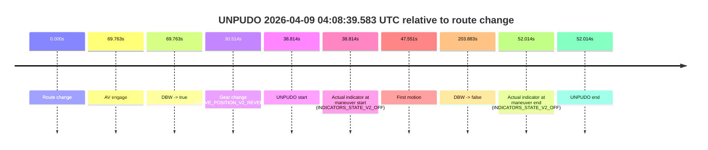
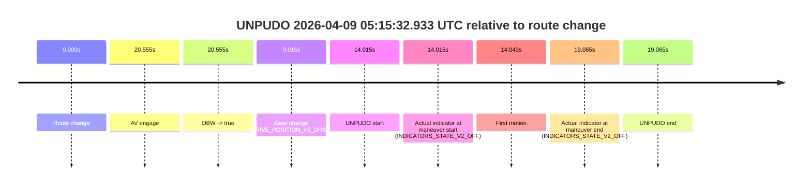

# Run Report: fme10011/2026-04-09--04-00-10--gen2-av-28c4e28d-38a6-4950-a152-81f70f9663af

| Field | Value |
|---|---|
| Run ID | `fme10011/2026-04-09--04-00-10--gen2-av-28c4e28d-38a6-4950-a152-81f70f9663af` |
| Date | `2026-04-09` |
| Model(s) | `lively-orange-horse` |
| Author | `guy.geva` |
| Event count | `5` |

## unpudo 2026-04-09 04:08:39.583 UTC

| Field | Value |
|---|---|
| Model | `lively-orange-horse` |
| Author | `guy.geva` |
| Run ID | `fme10011/2026-04-09--04-00-10--gen2-av-28c4e28d-38a6-4950-a152-81f70f9663af` |
| Date | `2026-04-09` |
| Time (UTC) | `04:08:39.583` |
| Event type | `unpudo` |
| Disengagement type | `none observed` |
| Route change | `found` |
| Console | [run](https://console.sso.wayve.ai/run/fme10011/2026-04-09--04-00-10--gen2-av-28c4e28d-38a6-4950-a152-81f70f9663af?id=&time-unixus=1775707719583304) |
| Foxglove | [segment](https://app.foxglove.dev/wayve-on-prem/p/prj_0dX18KZdVHg1fmmI/view?ds=foxglove-stream&ds.deviceName=fme10011&ds.start=2026-04-09T04%3A07%3A50.769248Z&ds.end=2026-04-09T04%3A11%3A34.651929Z&layoutId=lay_0e7VD4WIKDQGU73Y&time=2026-04-09T04%3A08%3A39.583304Z) |

### Event card: fail

- Fail: the credited unpudo does not stay AV-owned. The event window starts with DBW false, and the maneuver outcome lands outside a clean AV-owned segment.

| Event | Time (UTC) | Delta from route change |
|---|---:|---:|
| Route change | 2026-04-09 04:08:00.769 | `0.000s` |
| AV engage | 2026-04-09 04:09:10.531 | `69.763s` |
| DBW -> true | 2026-04-09 04:09:10.531 | `69.763s` |
| Gear change (DRIVE_POSITION_V2_REVERSE) | 2026-04-09 04:08:31.283 | `30.514s` |
| UNPUDO start | 2026-04-09 04:08:39.583 | `38.814s` |
| Actual indicator at maneuver start (INDICATORS_STATE_V2_OFF) | 2026-04-09 04:08:39.583 | `38.814s` |
| First motion | 2026-04-09 04:08:48.320 | `47.551s` |
| DBW -> false | 2026-04-09 04:11:24.651 | `203.883s` |
| Actual indicator at maneuver end (INDICATORS_STATE_V2_OFF) | 2026-04-09 04:08:52.783 | `52.014s` |
| UNPUDO end | 2026-04-09 04:08:52.783 | `52.014s` |

| Metric | Value |
|---|---|
| Outcome | `fail` |
| Effective failure type | `completed_outside_av` |
| Route change status | `found` |
| DBW at event start | `false` |
| DBW at event end | `false` |
| Predicted gear at AV start | `DRIVE_POSITION_V2_DRIVE` |
| Actual gear at AV start | `DRIVE_POSITION_V2_DRIVE` |
| Predicted gear at event start | `DRIVE_POSITION_V2_REVERSE` |
| Actual gear at event start | `DRIVE_POSITION_V2_REVERSE` |
| Planned indicator direction | `INDICATORS_STATE_V2_OFF` |
| Controller indicator direction | `INDICATORS_STATE_V2_OFF` |
| Actual indicator direction | `INDICATORS_STATE_V2_OFF` |
| Actual indicator at maneuver end | `INDICATORS_STATE_V2_OFF` |
| Driver accel help in AV | `false` |
| Driver accel help timestamp | `n/a` |
| Max accel pedal pct in AV | `0.0%` |
| Max brake pedal pct in AV | `0.0%` |
| Max speed mps in AV | `0.000` |
| Route -> AV | `69.763s` |
| AV -> event start | `-30.949s` |
| AV -> first motion | `-22.212s` |
| AV duration before disengagement | `134.120s` |
| Trajectory waypoint count | `37` |
| Driving-plan step count | `11` |

The scored portion starts from the AV-owned window, not from the pre-AV setup. Route-change search in the stopped pre-event segment was `found`, with the baseline therefore set to route change. At the event anchor the model predicts `DRIVE_POSITION_V2_REVERSE` and the actual gear is `DRIVE_POSITION_V2_REVERSE`. The effective model outcome is `fail` because `completed_outside_av`.

### Resolution

| Field | Value |
|---|---|
| Final outcome | `fail` |
| Do we agree with this label? | `yes` |
| Source disengagement type | `none observed` |
| Resolved effective failure type | `completed_outside_av` |
| Confidence | `high` |

## unpudo 2026-04-09 04:12:31.033 UTC

| Field | Value |
|---|---|
| Model | `lively-orange-horse` |
| Author | `guy.geva` |
| Run ID | `fme10011/2026-04-09--04-00-10--gen2-av-28c4e28d-38a6-4950-a152-81f70f9663af` |
| Date | `2026-04-09` |
| Time (UTC) | `04:12:31.033` |
| Event type | `unpudo` |
| Disengagement type | `failed_to_unpudo` |
| Route change | `found` |
| Console | [run](https://console.sso.wayve.ai/run/fme10011/2026-04-09--04-00-10--gen2-av-28c4e28d-38a6-4950-a152-81f70f9663af?id=&time-unixus=1775707951033318) |
| Foxglove | [segment](https://app.foxglove.dev/wayve-on-prem/p/prj_0dX18KZdVHg1fmmI/view?ds=foxglove-stream&ds.deviceName=fme10011&ds.start=2026-04-09T04%3A11%3A27.468368Z&ds.end=2026-04-09T04%3A13%3A15.052243Z&layoutId=lay_0e7VD4WIKDQGU73Y&time=2026-04-09T04%3A12%3A31.033318Z) |

### Event card: fail

- Fail: AV owns part of the segment, but the event still resolves as a model-performance failure under the AV-only scoring rule.

| Event | Time (UTC) | Delta from route change |
|---|---:|---:|
| Route change | 2026-04-09 04:11:37.468 | `0.000s` |
| AV engage | 2026-04-09 04:12:38.671 | `61.203s` |
| DBW -> true | 2026-04-09 04:12:38.671 | `61.203s` |
| Gear change (DRIVE_POSITION_V2_DRIVE) | 2026-04-09 04:12:25.533 | `48.065s` |
| UNPUDO start | 2026-04-09 04:12:31.033 | `53.565s` |
| Actual indicator at maneuver start (INDICATORS_STATE_V2_OFF) | 2026-04-09 04:12:31.033 | `53.565s` |
| First motion | 2026-04-09 04:12:31.060 | `53.592s` |
| DBW -> false | 2026-04-09 04:13:05.052 | `87.584s` |
| Actual indicator at maneuver end (INDICATORS_STATE_V2_OFF) | 2026-04-09 04:12:35.583 | `58.115s` |
| UNPUDO end | 2026-04-09 04:12:35.583 | `58.115s` |

| Metric | Value |
|---|---|
| Outcome | `fail` |
| Effective failure type | `failed_to_unpudo` |
| Route change status | `found` |
| DBW at event start | `false` |
| DBW at event end | `false` |
| Predicted gear at AV start | `DRIVE_POSITION_V2_DRIVE` |
| Actual gear at AV start | `DRIVE_POSITION_V2_DRIVE` |
| Predicted gear at event start | `DRIVE_POSITION_V2_DRIVE` |
| Actual gear at event start | `DRIVE_POSITION_V2_DRIVE` |
| Planned indicator direction | `INDICATORS_STATE_V2_LEFT_ON` |
| Controller indicator direction | `INDICATORS_STATE_V2_LEFT_ON` |
| Actual indicator direction | `INDICATORS_STATE_V2_OFF` |
| Actual indicator at maneuver end | `INDICATORS_STATE_V2_OFF` |
| Driver accel help in AV | `false` |
| Driver accel help timestamp | `n/a` |
| Max accel pedal pct in AV | `0.0%` |
| Max brake pedal pct in AV | `0.0%` |
| Max speed mps in AV | `0.000` |
| Route -> AV | `61.203s` |
| AV -> event start | `-7.638s` |
| AV -> first motion | `-7.611s` |
| AV duration before disengagement | `26.380s` |
| Trajectory waypoint count | `36` |
| Driving-plan step count | `11` |

The scored portion starts from the AV-owned window, not from the pre-AV setup. Route-change search in the stopped pre-event segment was `found`, with the baseline therefore set to route change. At the event anchor the model predicts `DRIVE_POSITION_V2_DRIVE` and the actual gear is `DRIVE_POSITION_V2_DRIVE`. The effective model outcome is `fail` because `failed_to_unpudo`.

### Resolution

| Field | Value |
|---|---|
| Final outcome | `fail` |
| Do we agree with this label? | `yes` |
| Source disengagement type | `failed_to_unpudo` |
| Resolved effective failure type | `failed_to_unpudo` |
| Confidence | `high` |

## unpudo 2026-04-09 04:25:19.833 UTC

| Field | Value |
|---|---|
| Model | `lively-orange-horse` |
| Author | `guy.geva` |
| Run ID | `fme10011/2026-04-09--04-00-10--gen2-av-28c4e28d-38a6-4950-a152-81f70f9663af` |
| Date | `2026-04-09` |
| Time (UTC) | `04:25:19.833` |
| Event type | `unpudo` |
| Disengagement type | `failed_to_unpudo` |
| Route change | `found` |
| Console | [run](https://console.sso.wayve.ai/run/fme10011/2026-04-09--04-00-10--gen2-av-28c4e28d-38a6-4950-a152-81f70f9663af?id=&time-unixus=1775708719833300) |
| Foxglove | [segment](https://app.foxglove.dev/wayve-on-prem/p/prj_0dX18KZdVHg1fmmI/view?ds=foxglove-stream&ds.deviceName=fme10011&ds.start=2026-04-09T04%3A23%3A53.168251Z&ds.end=2026-04-09T04%3A25%3A51.033120Z&layoutId=lay_0e7VD4WIKDQGU73Y&time=2026-04-09T04%3A25%3A19.833300Z) |

### Event card: fail

- Fail: AV owns part of the segment, but the event still resolves as a model-performance failure under the AV-only scoring rule.

| Event | Time (UTC) | Delta from route change |
|---|---:|---:|
| Route change | 2026-04-09 04:24:03.168 | `0.000s` |
| AV engage | 2026-04-09 04:25:25.491 | `82.324s` |
| DBW -> true | 2026-04-09 04:25:25.491 | `82.324s` |
| Gear change (DRIVE_POSITION_V2_DRIVE) | 2026-04-09 04:25:14.583 | `71.415s` |
| UNPUDO start | 2026-04-09 04:25:19.833 | `76.665s` |
| Actual indicator at maneuver start (INDICATORS_STATE_V2_OFF) | 2026-04-09 04:25:19.833 | `76.665s` |
| First motion | 2026-04-09 04:25:19.880 | `76.712s` |
| DBW -> false | 2026-04-09 04:25:41.033 | `97.865s` |
| Actual indicator at maneuver end (INDICATORS_STATE_V2_OFF) | 2026-04-09 04:25:23.633 | `80.465s` |
| UNPUDO end | 2026-04-09 04:25:23.633 | `80.465s` |

| Metric | Value |
|---|---|
| Outcome | `fail` |
| Effective failure type | `failed_to_unpudo` |
| Route change status | `found` |
| DBW at event start | `false` |
| DBW at event end | `false` |
| Predicted gear at AV start | `DRIVE_POSITION_V2_DRIVE` |
| Actual gear at AV start | `DRIVE_POSITION_V2_DRIVE` |
| Predicted gear at event start | `DRIVE_POSITION_V2_DRIVE` |
| Actual gear at event start | `DRIVE_POSITION_V2_DRIVE` |
| Planned indicator direction | `INDICATORS_STATE_V2_LEFT_ON` |
| Controller indicator direction | `INDICATORS_STATE_V2_LEFT_ON` |
| Actual indicator direction | `INDICATORS_STATE_V2_OFF` |
| Actual indicator at maneuver end | `INDICATORS_STATE_V2_OFF` |
| Driver accel help in AV | `false` |
| Driver accel help timestamp | `n/a` |
| Max accel pedal pct in AV | `0.0%` |
| Max brake pedal pct in AV | `0.0%` |
| Max speed mps in AV | `0.000` |
| Route -> AV | `82.324s` |
| AV -> event start | `-5.659s` |
| AV -> first motion | `-5.611s` |
| AV duration before disengagement | `15.541s` |
| Trajectory waypoint count | `36` |
| Driving-plan step count | `11` |

The scored portion starts from the AV-owned window, not from the pre-AV setup. Route-change search in the stopped pre-event segment was `found`, with the baseline therefore set to route change. At the event anchor the model predicts `DRIVE_POSITION_V2_DRIVE` and the actual gear is `DRIVE_POSITION_V2_DRIVE`. The effective model outcome is `fail` because `failed_to_unpudo`.

### Resolution

| Field | Value |
|---|---|
| Final outcome | `fail` |
| Do we agree with this label? | `yes` |
| Source disengagement type | `failed_to_unpudo` |
| Resolved effective failure type | `failed_to_unpudo` |
| Confidence | `high` |

## unpudo 2026-04-09 04:52:48.133 UTC

| Field | Value |
|---|---|
| Model | `lively-orange-horse` |
| Author | `guy.geva` |
| Run ID | `fme10011/2026-04-09--04-00-10--gen2-av-28c4e28d-38a6-4950-a152-81f70f9663af` |
| Date | `2026-04-09` |
| Time (UTC) | `04:52:48.133` |
| Event type | `unpudo` |
| Disengagement type | `none observed` |
| Route change | `found` |
| Console | [run](https://console.sso.wayve.ai/run/fme10011/2026-04-09--04-00-10--gen2-av-28c4e28d-38a6-4950-a152-81f70f9663af?id=&time-unixus=1775710368133293) |
| Foxglove | [segment](https://app.foxglove.dev/wayve-on-prem/p/prj_0dX18KZdVHg1fmmI/view?ds=foxglove-stream&ds.deviceName=fme10011&ds.start=2026-04-09T04%3A51%3A10.818259Z&ds.end=2026-04-09T04%3A53%3A43.832720Z&layoutId=lay_0e7VD4WIKDQGU73Y&time=2026-04-09T04%3A52%3A48.133293Z) |

### Event card: fail

- Fail: the credited unpudo does not stay AV-owned. The event window starts with DBW false, and the maneuver outcome lands outside a clean AV-owned segment.

| Event | Time (UTC) | Delta from route change |
|---|---:|---:|
| Route change | 2026-04-09 04:51:20.818 | `0.000s` |
| AV engage | 2026-04-09 04:52:56.811 | `95.994s` |
| DBW -> true | 2026-04-09 04:52:56.811 | `95.994s` |
| Gear change (DRIVE_POSITION_V2_REVERSE) | 2026-04-09 04:52:35.183 | `74.365s` |
| UNPUDO start | 2026-04-09 04:52:48.133 | `87.315s` |
| Actual indicator at maneuver start (INDICATORS_STATE_V2_OFF) | 2026-04-09 04:52:48.133 | `87.315s` |
| First motion | 2026-04-09 04:52:52.720 | `91.902s` |
| DBW -> false | 2026-04-09 04:53:33.832 | `133.014s` |
| Actual indicator at maneuver end (INDICATORS_STATE_V2_OFF) | 2026-04-09 04:52:57.783 | `96.965s` |
| UNPUDO end | 2026-04-09 04:52:57.783 | `96.965s` |

| Metric | Value |
|---|---|
| Outcome | `fail` |
| Effective failure type | `completed_outside_av` |
| Route change status | `found` |
| DBW at event start | `false` |
| DBW at event end | `true` |
| Predicted gear at AV start | `DRIVE_POSITION_V2_DRIVE` |
| Actual gear at AV start | `DRIVE_POSITION_V2_DRIVE` |
| Predicted gear at event start | `DRIVE_POSITION_V2_REVERSE` |
| Actual gear at event start | `DRIVE_POSITION_V2_REVERSE` |
| Planned indicator direction | `INDICATORS_STATE_V2_OFF` |
| Controller indicator direction | `INDICATORS_STATE_V2_OFF` |
| Actual indicator direction | `INDICATORS_STATE_V2_OFF` |
| Actual indicator at maneuver end | `INDICATORS_STATE_V2_OFF` |
| Driver accel help in AV | `false` |
| Driver accel help timestamp | `n/a` |
| Max accel pedal pct in AV | `0.0%` |
| Max brake pedal pct in AV | `0.0%` |
| Max speed mps in AV | `2.419` |
| Route -> AV | `95.994s` |
| AV -> event start | `-8.679s` |
| AV -> first motion | `-4.091s` |
| AV duration before disengagement | `37.021s` |
| Trajectory waypoint count | `38` |
| Driving-plan step count | `11` |

The scored portion starts from the AV-owned window, not from the pre-AV setup. Route-change search in the stopped pre-event segment was `found`, with the baseline therefore set to route change. At the event anchor the model predicts `DRIVE_POSITION_V2_REVERSE` and the actual gear is `DRIVE_POSITION_V2_REVERSE`. The effective model outcome is `fail` because `completed_outside_av`.

### Resolution

| Field | Value |
|---|---|
| Final outcome | `fail` |
| Do we agree with this label? | `yes` |
| Source disengagement type | `none observed` |
| Resolved effective failure type | `completed_outside_av` |
| Confidence | `high` |

## unpudo 2026-04-09 05:15:32.933 UTC

| Field | Value |
|---|---|
| Model | `lively-orange-horse` |
| Author | `guy.geva` |
| Run ID | `fme10011/2026-04-09--04-00-10--gen2-av-28c4e28d-38a6-4950-a152-81f70f9663af` |
| Date | `2026-04-09` |
| Time (UTC) | `05:15:32.933` |
| Event type | `unpudo` |
| Disengagement type | `failed_to_unpudo` |
| Route change | `found` |
| Console | [run](https://console.sso.wayve.ai/run/fme10011/2026-04-09--04-00-10--gen2-av-28c4e28d-38a6-4950-a152-81f70f9663af?id=&time-unixus=1775711732933323) |
| Foxglove | [segment](https://app.foxglove.dev/wayve-on-prem/p/prj_0dX18KZdVHg1fmmI/view?ds=foxglove-stream&ds.deviceName=fme10011&ds.start=2026-04-09T05%3A15%3A08.918306Z&ds.end=2026-04-09T05%3A15%3A47.983317Z&layoutId=lay_0e7VD4WIKDQGU73Y&time=2026-04-09T05%3A15%3A32.933323Z) |

### Event card: fail

- Fail: AV owns part of the segment, but the event still resolves as a model-performance failure under the AV-only scoring rule.

| Event | Time (UTC) | Delta from route change |
|---|---:|---:|
| Route change | 2026-04-09 05:15:18.918 | `0.000s` |
| AV engage | 2026-04-09 05:15:39.473 | `20.555s` |
| DBW -> true | 2026-04-09 05:15:39.473 | `20.555s` |
| Gear change (DRIVE_POSITION_V2_DRIVE) | 2026-04-09 05:15:27.933 | `9.015s` |
| UNPUDO start | 2026-04-09 05:15:32.933 | `14.015s` |
| Actual indicator at maneuver start (INDICATORS_STATE_V2_OFF) | 2026-04-09 05:15:32.933 | `14.015s` |
| First motion | 2026-04-09 05:15:32.961 | `14.043s` |
| Actual indicator at maneuver end (INDICATORS_STATE_V2_OFF) | 2026-04-09 05:15:37.983 | `19.065s` |
| UNPUDO end | 2026-04-09 05:15:37.983 | `19.065s` |

| Metric | Value |
|---|---|
| Outcome | `fail` |
| Effective failure type | `failed_to_unpudo` |
| Route change status | `found` |
| DBW at event start | `false` |
| DBW at event end | `false` |
| Predicted gear at AV start | `DRIVE_POSITION_V2_DRIVE` |
| Actual gear at AV start | `DRIVE_POSITION_V2_DRIVE` |
| Predicted gear at event start | `DRIVE_POSITION_V2_DRIVE` |
| Actual gear at event start | `DRIVE_POSITION_V2_DRIVE` |
| Planned indicator direction | `INDICATORS_STATE_V2_LEFT_ON` |
| Controller indicator direction | `INDICATORS_STATE_V2_LEFT_ON` |
| Actual indicator direction | `INDICATORS_STATE_V2_OFF` |
| Actual indicator at maneuver end | `INDICATORS_STATE_V2_OFF` |
| Driver accel help in AV | `false` |
| Driver accel help timestamp | `n/a` |
| Max accel pedal pct in AV | `0.0%` |
| Max brake pedal pct in AV | `0.0%` |
| Max speed mps in AV | `0.000` |
| Route -> AV | `20.555s` |
| AV -> event start | `-6.540s` |
| AV -> first motion | `-6.512s` |
| AV duration before disengagement | `n/a` |
| Trajectory waypoint count | `36` |
| Driving-plan step count | `11` |

The scored portion starts from the AV-owned window, not from the pre-AV setup. Route-change search in the stopped pre-event segment was `found`, with the baseline therefore set to route change. At the event anchor the model predicts `DRIVE_POSITION_V2_DRIVE` and the actual gear is `DRIVE_POSITION_V2_DRIVE`. The effective model outcome is `fail` because `failed_to_unpudo`.

### Resolution

| Field | Value |
|---|---|
| Final outcome | `fail` |
| Do we agree with this label? | `yes` |
| Source disengagement type | `failed_to_unpudo` |
| Resolved effective failure type | `failed_to_unpudo` |
| Confidence | `high` |
