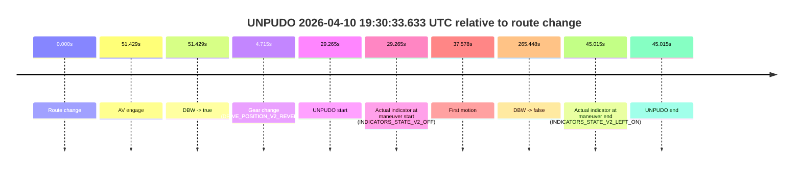
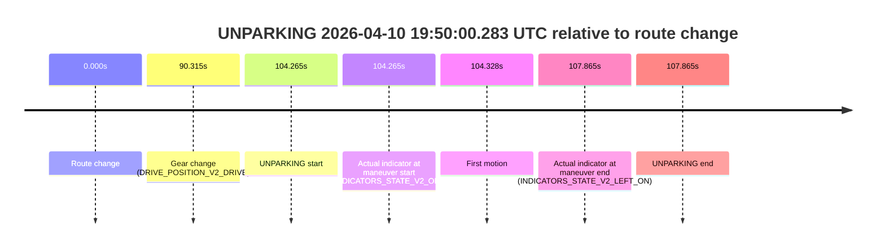

# Run Report: fme10011/2026-04-10--19-14-36--gen2-av-c222598c-803a-4716-bce4-28bb4a55ed74

| Field | Value |
|---|---|
| Run ID | `fme10011/2026-04-10--19-14-36--gen2-av-c222598c-803a-4716-bce4-28bb4a55ed74` |
| Date | `2026-04-10` |
| Model(s) | `lively-orange-horse` |
| Author | `guy.geva` |
| Event count | `2` |

## unpudo 2026-04-10 19:30:33.633 UTC

| Field | Value |
|---|---|
| Model | `lively-orange-horse` |
| Author | `guy.geva` |
| Run ID | `fme10011/2026-04-10--19-14-36--gen2-av-c222598c-803a-4716-bce4-28bb4a55ed74` |
| Date | `2026-04-10` |
| Time (UTC) | `19:30:33.633` |
| Event type | `unpudo` |
| Disengagement type | `none observed` |
| Route change | `found` |
| Console | [run](https://console.sso.wayve.ai/run/fme10011/2026-04-10--19-14-36--gen2-av-c222598c-803a-4716-bce4-28bb4a55ed74?id=&time-unixus=1775849433633312) |
| Foxglove | [segment](https://app.foxglove.dev/wayve-on-prem/p/prj_0dX18KZdVHg1fmmI/view?ds=foxglove-stream&ds.deviceName=fme10011&ds.start=2026-04-10T19%3A29%3A54.368361Z&ds.end=2026-04-10T19%3A34%3A39.816229Z&layoutId=lay_0e7VD4WIKDQGU73Y&time=2026-04-10T19%3A30%3A33.633312Z) |

### Event card: fail

- Fail: the credited unpudo does not stay AV-owned. The event window starts with DBW false, and the maneuver outcome lands outside a clean AV-owned segment.

| Event | Time (UTC) | Delta from route change |
|---|---:|---:|
| Route change | 2026-04-10 19:30:04.368 | `0.000s` |
| AV engage | 2026-04-10 19:30:55.797 | `51.429s` |
| DBW -> true | 2026-04-10 19:30:55.797 | `51.429s` |
| Gear change (DRIVE_POSITION_V2_REVERSE) | 2026-04-10 19:30:09.083 | `4.715s` |
| UNPUDO start | 2026-04-10 19:30:33.633 | `29.265s` |
| Actual indicator at maneuver start (INDICATORS_STATE_V2_OFF) | 2026-04-10 19:30:33.633 | `29.265s` |
| First motion | 2026-04-10 19:30:41.946 | `37.578s` |
| DBW -> false | 2026-04-10 19:34:29.816 | `265.448s` |
| Actual indicator at maneuver end (INDICATORS_STATE_V2_LEFT_ON) | 2026-04-10 19:30:49.383 | `45.015s` |
| UNPUDO end | 2026-04-10 19:30:49.383 | `45.015s` |

| Metric | Value |
|---|---|
| Outcome | `fail` |
| Effective failure type | `completed_outside_av` |
| Route change status | `found` |
| DBW at event start | `false` |
| DBW at event end | `false` |
| Predicted gear at AV start | `DRIVE_POSITION_V2_DRIVE` |
| Actual gear at AV start | `DRIVE_POSITION_V2_DRIVE` |
| Predicted gear at event start | `DRIVE_POSITION_V2_REVERSE` |
| Actual gear at event start | `DRIVE_POSITION_V2_REVERSE` |
| Planned indicator direction | `INDICATORS_STATE_V2_OFF` |
| Controller indicator direction | `INDICATORS_STATE_V2_OFF` |
| Actual indicator direction | `INDICATORS_STATE_V2_OFF` |
| Actual indicator at maneuver end | `INDICATORS_STATE_V2_LEFT_ON` |
| Driver accel help in AV | `false` |
| Driver accel help timestamp | `n/a` |
| Max accel pedal pct in AV | `0.0%` |
| Max brake pedal pct in AV | `0.0%` |
| Max speed mps in AV | `0.000` |
| Route -> AV | `51.429s` |
| AV -> event start | `-22.164s` |
| AV -> first motion | `-13.851s` |
| AV duration before disengagement | `214.019s` |
| Trajectory waypoint count | `37` |
| Driving-plan step count | `11` |

The scored portion starts from the AV-owned window, not from the pre-AV setup. Route-change search in the stopped pre-event segment was `found`, with the baseline therefore set to route change. At the event anchor the model predicts `DRIVE_POSITION_V2_REVERSE` and the actual gear is `DRIVE_POSITION_V2_REVERSE`. The effective model outcome is `fail` because `completed_outside_av`.

### Resolution

| Field | Value |
|---|---|
| Final outcome | `fail` |
| Do we agree with this label? | `yes` |
| Source disengagement type | `none observed` |
| Resolved effective failure type | `completed_outside_av` |
| Confidence | `high` |

## unparking 2026-04-10 19:50:00.283 UTC

| Field | Value |
|---|---|
| Model | `lively-orange-horse` |
| Author | `guy.geva` |
| Run ID | `fme10011/2026-04-10--19-14-36--gen2-av-c222598c-803a-4716-bce4-28bb4a55ed74` |
| Date | `2026-04-10` |
| Time (UTC) | `19:50:00.283` |
| Event type | `unparking` |
| Disengagement type | `failed_to_unpudo` |
| Route change | `found` |
| Console | [run](https://console.sso.wayve.ai/run/fme10011/2026-04-10--19-14-36--gen2-av-c222598c-803a-4716-bce4-28bb4a55ed74?id=&time-unixus=1775850600283315) |
| Foxglove | [segment](https://app.foxglove.dev/wayve-on-prem/p/prj_0dX18KZdVHg1fmmI/view?ds=foxglove-stream&ds.deviceName=fme10011&ds.start=2026-04-10T19%3A48%3A06.018305Z&ds.end=2026-04-10T19%3A50%3A13.883293Z&layoutId=lay_0e7VD4WIKDQGU73Y&time=2026-04-10T19%3A50%3A00.283315Z) |

### Event card: fail

- Fail: AV owns part of the segment, but the event still resolves as a model-performance failure under the AV-only scoring rule.

| Event | Time (UTC) | Delta from route change |
|---|---:|---:|
| Route change | 2026-04-10 19:48:16.018 | `0.000s` |
| Gear change (DRIVE_POSITION_V2_DRIVE) | 2026-04-10 19:49:46.333 | `90.315s` |
| UNPARKING start | 2026-04-10 19:50:00.283 | `104.265s` |
| Actual indicator at maneuver start (INDICATORS_STATE_V2_OFF) | 2026-04-10 19:50:00.283 | `104.265s` |
| First motion | 2026-04-10 19:50:00.345 | `104.328s` |
| Actual indicator at maneuver end (INDICATORS_STATE_V2_LEFT_ON) | 2026-04-10 19:50:03.883 | `107.865s` |
| UNPARKING end | 2026-04-10 19:50:03.883 | `107.865s` |

| Metric | Value |
|---|---|
| Outcome | `fail` |
| Effective failure type | `failed_to_unpudo` |
| Route change status | `found` |
| DBW at event start | `false` |
| DBW at event end | `false` |
| Predicted gear at AV start | `n/a` |
| Actual gear at AV start | `n/a` |
| Predicted gear at event start | `DRIVE_POSITION_V2_DRIVE` |
| Actual gear at event start | `DRIVE_POSITION_V2_DRIVE` |
| Planned indicator direction | `INDICATORS_STATE_V2_LEFT_ON` |
| Controller indicator direction | `INDICATORS_STATE_V2_LEFT_ON` |
| Actual indicator direction | `INDICATORS_STATE_V2_OFF` |
| Actual indicator at maneuver end | `INDICATORS_STATE_V2_LEFT_ON` |
| Driver accel help in AV | `false` |
| Driver accel help timestamp | `n/a` |
| Max accel pedal pct in AV | `0.0%` |
| Max brake pedal pct in AV | `0.0%` |
| Max speed mps in AV | `0.000` |
| Route -> AV | `n/a` |
| AV -> event start | `n/a` |
| AV -> first motion | `n/a` |
| AV duration before disengagement | `n/a` |
| Trajectory waypoint count | `36` |
| Driving-plan step count | `11` |

The scored portion starts from the AV-owned window, not from the pre-AV setup. Route-change search in the stopped pre-event segment was `found`, with the baseline therefore set to route change. At the event anchor the model predicts `DRIVE_POSITION_V2_DRIVE` and the actual gear is `DRIVE_POSITION_V2_DRIVE`. The effective model outcome is `fail` because `failed_to_unpudo`.

### Resolution

| Field | Value |
|---|---|
| Final outcome | `fail` |
| Do we agree with this label? | `yes` |
| Source disengagement type | `failed_to_unpudo` |
| Resolved effective failure type | `failed_to_unpudo` |
| Confidence | `high` |
