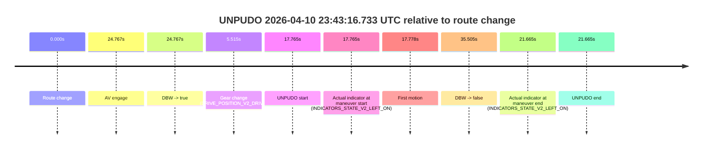
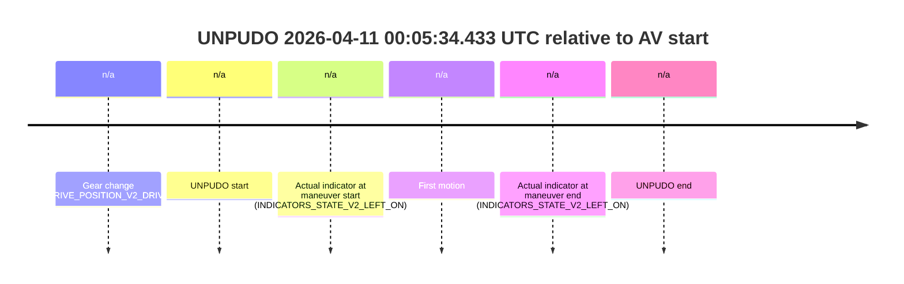
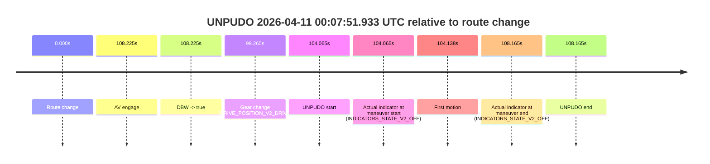

# Run Report: fme10011/2026-04-10--22-14-53--gen2-av-6bb77069-58bc-475a-9ae7-0b85f6d0d218

| Field | Value |
|---|---|
| Run ID | `fme10011/2026-04-10--22-14-53--gen2-av-6bb77069-58bc-475a-9ae7-0b85f6d0d218` |
| Date | `2026-04-10` |
| Model(s) | `lively-orange-horse` |
| Author | `guy.geva` |
| Event count | `6` |

## unpudo 2026-04-10 23:07:54.183 UTC

| Field | Value |
|---|---|
| Model | `lively-orange-horse` |
| Author | `guy.geva` |
| Run ID | `fme10011/2026-04-10--22-14-53--gen2-av-6bb77069-58bc-475a-9ae7-0b85f6d0d218` |
| Date | `2026-04-10` |
| Time (UTC) | `23:07:54.183` |
| Event type | `unpudo` |
| Disengagement type | `failed_to_unpudo` |
| Route change | `found` |
| Console | [run](https://console.sso.wayve.ai/run/fme10011/2026-04-10--22-14-53--gen2-av-6bb77069-58bc-475a-9ae7-0b85f6d0d218?id=&time-unixus=1775862474183302) |
| Foxglove | [segment](https://app.foxglove.dev/wayve-on-prem/p/prj_0dX18KZdVHg1fmmI/view?ds=foxglove-stream&ds.deviceName=fme10011&ds.start=2026-04-10T23%3A07%3A39.018260Z&ds.end=2026-04-10T23%3A13%3A21.274386Z&layoutId=lay_0e7VD4WIKDQGU73Y&time=2026-04-10T23%3A07%3A54.183302Z) |

### Event card: accidental

- Accidental: AV ownership is present for less than `2s`, so this is treated as an accidental brush with the maneuver rather than a meaningful model attempt.

| Event | Time (UTC) | Delta from route change |
|---|---:|---:|
| Route change | 2026-04-10 23:07:49.018 | `0.000s` |
| AV engage | 2026-04-10 23:08:01.333 | `12.315s` |
| DBW -> true | 2026-04-10 23:08:01.333 | `12.315s` |
| Gear change (DRIVE_POSITION_V2_DRIVE) | 2026-04-10 23:07:49.383 | `0.365s` |
| UNPUDO start | 2026-04-10 23:07:54.183 | `5.165s` |
| Actual indicator at maneuver start (INDICATORS_STATE_V2_OFF) | 2026-04-10 23:07:54.183 | `5.165s` |
| First motion | 2026-04-10 23:07:54.205 | `5.188s` |
| DBW -> false | 2026-04-10 23:13:11.274 | `322.256s` |
| Actual indicator at maneuver end (INDICATORS_STATE_V2_OFF) | 2026-04-10 23:07:58.333 | `9.315s` |
| UNPUDO end | 2026-04-10 23:07:58.333 | `9.315s` |

| Metric | Value |
|---|---|
| Outcome | `accidental` |
| Effective failure type | `none` |
| Route change status | `found` |
| DBW at event start | `false` |
| DBW at event end | `false` |
| Predicted gear at AV start | `DRIVE_POSITION_V2_DRIVE` |
| Actual gear at AV start | `DRIVE_POSITION_V2_DRIVE` |
| Predicted gear at event start | `DRIVE_POSITION_V2_DRIVE` |
| Actual gear at event start | `DRIVE_POSITION_V2_DRIVE` |
| Planned indicator direction | `INDICATORS_STATE_V2_OFF` |
| Controller indicator direction | `INDICATORS_STATE_V2_OFF` |
| Actual indicator direction | `INDICATORS_STATE_V2_OFF` |
| Actual indicator at maneuver end | `INDICATORS_STATE_V2_OFF` |
| Driver accel help in AV | `false` |
| Driver accel help timestamp | `n/a` |
| Max accel pedal pct in AV | `0.0%` |
| Max brake pedal pct in AV | `0.0%` |
| Max speed mps in AV | `0.000` |
| Route -> AV | `12.315s` |
| AV -> event start | `-7.150s` |
| AV -> first motion | `-7.128s` |
| AV duration before disengagement | `309.941s` |
| Trajectory waypoint count | `37` |
| Driving-plan step count | `11` |

The scored portion starts from the AV-owned window, not from the pre-AV setup. Route-change search in the stopped pre-event segment was `found`, with the baseline therefore set to route change. At the event anchor the model predicts `DRIVE_POSITION_V2_DRIVE` and the actual gear is `DRIVE_POSITION_V2_DRIVE`. The effective model outcome is `accidental` because `the AV-owned portion is shorter than 2s`.

### Resolution

| Field | Value |
|---|---|
| Final outcome | `accidental` |
| Do we agree with this label? | `yes` |
| Source disengagement type | `failed_to_unpudo` |
| Resolved effective failure type | `none` |
| Confidence | `high` |

## unpudo 2026-04-10 23:43:16.733 UTC

| Field | Value |
|---|---|
| Model | `lively-orange-horse` |
| Author | `guy.geva` |
| Run ID | `fme10011/2026-04-10--22-14-53--gen2-av-6bb77069-58bc-475a-9ae7-0b85f6d0d218` |
| Date | `2026-04-10` |
| Time (UTC) | `23:43:16.733` |
| Event type | `unpudo` |
| Disengagement type | `failed_to_unpudo` |
| Route change | `found` |
| Console | [run](https://console.sso.wayve.ai/run/fme10011/2026-04-10--22-14-53--gen2-av-6bb77069-58bc-475a-9ae7-0b85f6d0d218?id=&time-unixus=1775864596733314) |
| Foxglove | [segment](https://app.foxglove.dev/wayve-on-prem/p/prj_0dX18KZdVHg1fmmI/view?ds=foxglove-stream&ds.deviceName=fme10011&ds.start=2026-04-10T23%3A42%3A48.968276Z&ds.end=2026-04-10T23%3A43%3A44.473694Z&layoutId=lay_0e7VD4WIKDQGU73Y&time=2026-04-10T23%3A43%3A16.733314Z) |

### Event card: accidental

- Accidental: AV ownership is present for less than `2s`, so this is treated as an accidental brush with the maneuver rather than a meaningful model attempt.

| Event | Time (UTC) | Delta from route change |
|---|---:|---:|
| Route change | 2026-04-10 23:42:58.968 | `0.000s` |
| AV engage | 2026-04-10 23:43:23.735 | `24.767s` |
| DBW -> true | 2026-04-10 23:43:23.735 | `24.767s` |
| Gear change (DRIVE_POSITION_V2_DRIVE) | 2026-04-10 23:43:04.483 | `5.515s` |
| UNPUDO start | 2026-04-10 23:43:16.733 | `17.765s` |
| Actual indicator at maneuver start (INDICATORS_STATE_V2_LEFT_ON) | 2026-04-10 23:43:16.733 | `17.765s` |
| First motion | 2026-04-10 23:43:16.745 | `17.778s` |
| DBW -> false | 2026-04-10 23:43:34.473 | `35.505s` |
| Actual indicator at maneuver end (INDICATORS_STATE_V2_LEFT_ON) | 2026-04-10 23:43:20.633 | `21.665s` |
| UNPUDO end | 2026-04-10 23:43:20.633 | `21.665s` |

| Metric | Value |
|---|---|
| Outcome | `accidental` |
| Effective failure type | `none` |
| Route change status | `found` |
| DBW at event start | `false` |
| DBW at event end | `false` |
| Predicted gear at AV start | `DRIVE_POSITION_V2_DRIVE` |
| Actual gear at AV start | `DRIVE_POSITION_V2_DRIVE` |
| Predicted gear at event start | `DRIVE_POSITION_V2_DRIVE` |
| Actual gear at event start | `DRIVE_POSITION_V2_DRIVE` |
| Planned indicator direction | `INDICATORS_STATE_V2_LEFT_ON` |
| Controller indicator direction | `INDICATORS_STATE_V2_LEFT_ON` |
| Actual indicator direction | `INDICATORS_STATE_V2_LEFT_ON` |
| Actual indicator at maneuver end | `INDICATORS_STATE_V2_LEFT_ON` |
| Driver accel help in AV | `false` |
| Driver accel help timestamp | `n/a` |
| Max accel pedal pct in AV | `0.0%` |
| Max brake pedal pct in AV | `0.0%` |
| Max speed mps in AV | `0.000` |
| Route -> AV | `24.767s` |
| AV -> event start | `-7.002s` |
| AV -> first motion | `-6.989s` |
| AV duration before disengagement | `10.739s` |
| Trajectory waypoint count | `38` |
| Driving-plan step count | `11` |

The scored portion starts from the AV-owned window, not from the pre-AV setup. Route-change search in the stopped pre-event segment was `found`, with the baseline therefore set to route change. At the event anchor the model predicts `DRIVE_POSITION_V2_DRIVE` and the actual gear is `DRIVE_POSITION_V2_DRIVE`. The effective model outcome is `accidental` because `the AV-owned portion is shorter than 2s`.

### Resolution

| Field | Value |
|---|---|
| Final outcome | `accidental` |
| Do we agree with this label? | `yes` |
| Source disengagement type | `failed_to_unpudo` |
| Resolved effective failure type | `none` |
| Confidence | `high` |

## unpudo 2026-04-10 23:53:17.583 UTC

| Field | Value |
|---|---|
| Model | `lively-orange-horse` |
| Author | `guy.geva` |
| Run ID | `fme10011/2026-04-10--22-14-53--gen2-av-6bb77069-58bc-475a-9ae7-0b85f6d0d218` |
| Date | `2026-04-10` |
| Time (UTC) | `23:53:17.583` |
| Event type | `unpudo` |
| Disengagement type | `failed_to_unpudo` |
| Route change | `found` |
| Console | [run](https://console.sso.wayve.ai/run/fme10011/2026-04-10--22-14-53--gen2-av-6bb77069-58bc-475a-9ae7-0b85f6d0d218?id=&time-unixus=1775865197583300) |
| Foxglove | [segment](https://app.foxglove.dev/wayve-on-prem/p/prj_0dX18KZdVHg1fmmI/view?ds=foxglove-stream&ds.deviceName=fme10011&ds.start=2026-04-10T23%3A52%3A56.268245Z&ds.end=2026-04-10T23%3A54%3A44.154994Z&layoutId=lay_0e7VD4WIKDQGU73Y&time=2026-04-10T23%3A53%3A17.583300Z) |

### Event card: accidental

- Accidental: AV ownership is present for less than `2s`, so this is treated as an accidental brush with the maneuver rather than a meaningful model attempt.

| Event | Time (UTC) | Delta from route change |
|---|---:|---:|
| Route change | 2026-04-10 23:53:06.268 | `0.000s` |
| AV engage | 2026-04-10 23:53:22.293 | `16.026s` |
| DBW -> true | 2026-04-10 23:53:22.293 | `16.026s` |
| Gear change (DRIVE_POSITION_V2_DRIVE) | 2026-04-10 23:53:13.333 | `7.065s` |
| UNPUDO start | 2026-04-10 23:53:17.583 | `11.315s` |
| Actual indicator at maneuver start (INDICATORS_STATE_V2_OFF) | 2026-04-10 23:53:17.583 | `11.315s` |
| First motion | 2026-04-10 23:53:17.626 | `11.358s` |
| DBW -> false | 2026-04-10 23:54:34.154 | `87.887s` |
| Actual indicator at maneuver end (INDICATORS_STATE_V2_OFF) | 2026-04-10 23:53:21.533 | `15.265s` |
| UNPUDO end | 2026-04-10 23:53:21.533 | `15.265s` |

| Metric | Value |
|---|---|
| Outcome | `accidental` |
| Effective failure type | `none` |
| Route change status | `found` |
| DBW at event start | `false` |
| DBW at event end | `false` |
| Predicted gear at AV start | `DRIVE_POSITION_V2_DRIVE` |
| Actual gear at AV start | `DRIVE_POSITION_V2_DRIVE` |
| Predicted gear at event start | `DRIVE_POSITION_V2_DRIVE` |
| Actual gear at event start | `DRIVE_POSITION_V2_DRIVE` |
| Planned indicator direction | `INDICATORS_STATE_V2_LEFT_ON` |
| Controller indicator direction | `INDICATORS_STATE_V2_LEFT_ON` |
| Actual indicator direction | `INDICATORS_STATE_V2_OFF` |
| Actual indicator at maneuver end | `INDICATORS_STATE_V2_OFF` |
| Driver accel help in AV | `false` |
| Driver accel help timestamp | `n/a` |
| Max accel pedal pct in AV | `0.0%` |
| Max brake pedal pct in AV | `0.0%` |
| Max speed mps in AV | `0.000` |
| Route -> AV | `16.026s` |
| AV -> event start | `-4.710s` |
| AV -> first motion | `-4.668s` |
| AV duration before disengagement | `71.861s` |
| Trajectory waypoint count | `37` |
| Driving-plan step count | `11` |

The scored portion starts from the AV-owned window, not from the pre-AV setup. Route-change search in the stopped pre-event segment was `found`, with the baseline therefore set to route change. At the event anchor the model predicts `DRIVE_POSITION_V2_DRIVE` and the actual gear is `DRIVE_POSITION_V2_DRIVE`. The effective model outcome is `accidental` because `the AV-owned portion is shorter than 2s`.

### Resolution

| Field | Value |
|---|---|
| Final outcome | `accidental` |
| Do we agree with this label? | `yes` |
| Source disengagement type | `failed_to_unpudo` |
| Resolved effective failure type | `none` |
| Confidence | `high` |

## unpudo 2026-04-11 00:03:20.933 UTC

| Field | Value |
|---|---|
| Model | `lively-orange-horse` |
| Author | `guy.geva` |
| Run ID | `fme10011/2026-04-10--22-14-53--gen2-av-6bb77069-58bc-475a-9ae7-0b85f6d0d218` |
| Date | `2026-04-10` |
| Time (UTC) | `00:03:20.933` |
| Event type | `unpudo` |
| Disengagement type | `failed_to_pudo` |
| Route change | `found` |
| Console | [run](https://console.sso.wayve.ai/run/fme10011/2026-04-10--22-14-53--gen2-av-6bb77069-58bc-475a-9ae7-0b85f6d0d218?id=&time-unixus=1775865800933315) |
| Foxglove | [segment](https://app.foxglove.dev/wayve-on-prem/p/prj_0dX18KZdVHg1fmmI/view?ds=foxglove-stream&ds.deviceName=fme10011&ds.start=2026-04-11T00%3A03%3A06.120289Z&ds.end=2026-04-11T00%3A05%3A40.933888Z&layoutId=lay_0e7VD4WIKDQGU73Y&time=2026-04-11T00%3A03%3A20.933315Z) |

### Event card: accidental

- Accidental: AV ownership is present for less than `2s`, so this is treated as an accidental brush with the maneuver rather than a meaningful model attempt.

| Event | Time (UTC) | Delta from route change |
|---|---:|---:|
| Route change | 2026-04-11 00:03:16.120 | `0.000s` |
| AV engage | 2026-04-11 00:03:31.793 | `15.673s` |
| DBW -> true | 2026-04-11 00:03:31.793 | `15.673s` |
| Gear change (DRIVE_POSITION_V2_DRIVE) | 2026-04-11 00:03:16.433 | `0.313s` |
| UNPUDO start | 2026-04-11 00:03:20.933 | `4.813s` |
| Actual indicator at maneuver start (INDICATORS_STATE_V2_LEFT_ON) | 2026-04-11 00:03:20.933 | `4.813s` |
| First motion | 2026-04-11 00:03:20.985 | `4.866s` |
| DBW -> false | 2026-04-11 00:05:30.933 | `134.814s` |
| Actual indicator at maneuver end (INDICATORS_STATE_V2_LEFT_ON) | 2026-04-11 00:03:25.483 | `9.363s` |
| UNPUDO end | 2026-04-11 00:03:25.483 | `9.363s` |

| Metric | Value |
|---|---|
| Outcome | `accidental` |
| Effective failure type | `none` |
| Route change status | `found` |
| DBW at event start | `false` |
| DBW at event end | `false` |
| Predicted gear at AV start | `DRIVE_POSITION_V2_DRIVE` |
| Actual gear at AV start | `DRIVE_POSITION_V2_DRIVE` |
| Predicted gear at event start | `DRIVE_POSITION_V2_DRIVE` |
| Actual gear at event start | `DRIVE_POSITION_V2_DRIVE` |
| Planned indicator direction | `INDICATORS_STATE_V2_LEFT_ON` |
| Controller indicator direction | `INDICATORS_STATE_V2_LEFT_ON` |
| Actual indicator direction | `INDICATORS_STATE_V2_LEFT_ON` |
| Actual indicator at maneuver end | `INDICATORS_STATE_V2_LEFT_ON` |
| Driver accel help in AV | `false` |
| Driver accel help timestamp | `n/a` |
| Max accel pedal pct in AV | `0.0%` |
| Max brake pedal pct in AV | `0.0%` |
| Max speed mps in AV | `0.000` |
| Route -> AV | `15.673s` |
| AV -> event start | `-10.860s` |
| AV -> first motion | `-10.808s` |
| AV duration before disengagement | `119.140s` |
| Trajectory waypoint count | `36` |
| Driving-plan step count | `11` |

The scored portion starts from the AV-owned window, not from the pre-AV setup. Route-change search in the stopped pre-event segment was `found`, with the baseline therefore set to route change. At the event anchor the model predicts `DRIVE_POSITION_V2_DRIVE` and the actual gear is `DRIVE_POSITION_V2_DRIVE`. The effective model outcome is `accidental` because `the AV-owned portion is shorter than 2s`.

### Resolution

| Field | Value |
|---|---|
| Final outcome | `accidental` |
| Do we agree with this label? | `yes` |
| Source disengagement type | `failed_to_pudo` |
| Resolved effective failure type | `none` |
| Confidence | `high` |

## unpudo 2026-04-11 00:05:34.433 UTC

| Field | Value |
|---|---|
| Model | `lively-orange-horse` |
| Author | `guy.geva` |
| Run ID | `fme10011/2026-04-10--22-14-53--gen2-av-6bb77069-58bc-475a-9ae7-0b85f6d0d218` |
| Date | `2026-04-10` |
| Time (UTC) | `00:05:34.433` |
| Event type | `unpudo` |
| Disengagement type | `failed_to_pudo` |
| Route change | `unclear` |
| Console | [run](https://console.sso.wayve.ai/run/fme10011/2026-04-10--22-14-53--gen2-av-6bb77069-58bc-475a-9ae7-0b85f6d0d218?id=&time-unixus=1775865934433320) |
| Foxglove | [segment](https://app.foxglove.dev/wayve-on-prem/p/prj_0dX18KZdVHg1fmmI/view?ds=foxglove-stream&ds.deviceName=fme10011&ds.start=2026-04-11T00%3A05%3A23.283307Z&ds.end=2026-04-11T00%3A05%3A49.183292Z&layoutId=lay_0e7VD4WIKDQGU73Y&time=2026-04-11T00%3A05%3A34.433320Z) |

### Event card: non-av

- Non-AV: the detected unpudo starts outside AV ownership, so it is kept for coverage but excluded from model success / failure scoring.

| Event | Time (UTC) | Delta from AV start |
|---|---:|---:|
| Gear change (DRIVE_POSITION_V2_DRIVE) | 2026-04-11 00:05:33.283 | `n/a` |
| UNPUDO start | 2026-04-11 00:05:34.433 | `n/a` |
| Actual indicator at maneuver start (INDICATORS_STATE_V2_LEFT_ON) | 2026-04-11 00:05:34.433 | `n/a` |
| First motion | 2026-04-11 00:05:34.485 | `n/a` |
| Actual indicator at maneuver end (INDICATORS_STATE_V2_LEFT_ON) | 2026-04-11 00:05:39.183 | `n/a` |
| UNPUDO end | 2026-04-11 00:05:39.183 | `n/a` |

| Metric | Value |
|---|---|
| Outcome | `non-av` |
| Effective failure type | `none` |
| Route change status | `unclear` |
| DBW at event start | `false` |
| DBW at event end | `false` |
| Predicted gear at AV start | `n/a` |
| Actual gear at AV start | `n/a` |
| Predicted gear at event start | `DRIVE_POSITION_V2_DRIVE` |
| Actual gear at event start | `DRIVE_POSITION_V2_DRIVE` |
| Planned indicator direction | `INDICATORS_STATE_V2_OFF` |
| Controller indicator direction | `INDICATORS_STATE_V2_OFF` |
| Actual indicator direction | `INDICATORS_STATE_V2_LEFT_ON` |
| Actual indicator at maneuver end | `INDICATORS_STATE_V2_LEFT_ON` |
| Driver accel help in AV | `false` |
| Driver accel help timestamp | `n/a` |
| Max accel pedal pct in AV | `0.0%` |
| Max brake pedal pct in AV | `0.0%` |
| Max speed mps in AV | `0.000` |
| Route -> AV | `n/a` |
| AV -> event start | `n/a` |
| AV -> first motion | `n/a` |
| AV duration before disengagement | `n/a` |
| Trajectory waypoint count | `38` |
| Driving-plan step count | `11` |

The scored portion starts from the AV-owned window, not from the pre-AV setup. Route-change search in the stopped pre-event segment was `unclear`, with the baseline therefore set to AV start. At the event anchor the model predicts `DRIVE_POSITION_V2_DRIVE` and the actual gear is `DRIVE_POSITION_V2_DRIVE`. The effective model outcome is `non-av` because `the event does not begin in AV ownership`.

### Resolution

| Field | Value |
|---|---|
| Final outcome | `non-av` |
| Do we agree with this label? | `yes` |
| Source disengagement type | `failed_to_pudo` |
| Resolved effective failure type | `none` |
| Confidence | `medium` |

## unpudo 2026-04-11 00:07:51.933 UTC

| Field | Value |
|---|---|
| Model | `lively-orange-horse` |
| Author | `guy.geva` |
| Run ID | `fme10011/2026-04-10--22-14-53--gen2-av-6bb77069-58bc-475a-9ae7-0b85f6d0d218` |
| Date | `2026-04-10` |
| Time (UTC) | `00:07:51.933` |
| Event type | `unpudo` |
| Disengagement type | `failed_to_unpudo` |
| Route change | `found` |
| Console | [run](https://console.sso.wayve.ai/run/fme10011/2026-04-10--22-14-53--gen2-av-6bb77069-58bc-475a-9ae7-0b85f6d0d218?id=&time-unixus=1775866071933304) |
| Foxglove | [segment](https://app.foxglove.dev/wayve-on-prem/p/prj_0dX18KZdVHg1fmmI/view?ds=foxglove-stream&ds.deviceName=fme10011&ds.start=2026-04-11T00%3A05%3A57.868178Z&ds.end=2026-04-11T00%3A08%3A06.033298Z&layoutId=lay_0e7VD4WIKDQGU73Y&time=2026-04-11T00%3A07%3A51.933304Z) |

### Event card: accidental

- Accidental: AV ownership is present for less than `2s`, so this is treated as an accidental brush with the maneuver rather than a meaningful model attempt.

| Event | Time (UTC) | Delta from route change |
|---|---:|---:|
| Route change | 2026-04-11 00:06:07.868 | `0.000s` |
| AV engage | 2026-04-11 00:07:56.093 | `108.225s` |
| DBW -> true | 2026-04-11 00:07:56.093 | `108.225s` |
| Gear change (DRIVE_POSITION_V2_DRIVE) | 2026-04-11 00:07:47.133 | `99.265s` |
| UNPUDO start | 2026-04-11 00:07:51.933 | `104.065s` |
| Actual indicator at maneuver start (INDICATORS_STATE_V2_OFF) | 2026-04-11 00:07:51.933 | `104.065s` |
| First motion | 2026-04-11 00:07:52.005 | `104.138s` |
| Actual indicator at maneuver end (INDICATORS_STATE_V2_OFF) | 2026-04-11 00:07:56.033 | `108.165s` |
| UNPUDO end | 2026-04-11 00:07:56.033 | `108.165s` |

| Metric | Value |
|---|---|
| Outcome | `accidental` |
| Effective failure type | `none` |
| Route change status | `found` |
| DBW at event start | `false` |
| DBW at event end | `false` |
| Predicted gear at AV start | `DRIVE_POSITION_V2_DRIVE` |
| Actual gear at AV start | `DRIVE_POSITION_V2_DRIVE` |
| Predicted gear at event start | `DRIVE_POSITION_V2_DRIVE` |
| Actual gear at event start | `DRIVE_POSITION_V2_DRIVE` |
| Planned indicator direction | `INDICATORS_STATE_V2_LEFT_ON` |
| Controller indicator direction | `INDICATORS_STATE_V2_LEFT_ON` |
| Actual indicator direction | `INDICATORS_STATE_V2_OFF` |
| Actual indicator at maneuver end | `INDICATORS_STATE_V2_OFF` |
| Driver accel help in AV | `false` |
| Driver accel help timestamp | `n/a` |
| Max accel pedal pct in AV | `0.0%` |
| Max brake pedal pct in AV | `0.0%` |
| Max speed mps in AV | `0.000` |
| Route -> AV | `108.225s` |
| AV -> event start | `-4.160s` |
| AV -> first motion | `-4.088s` |
| AV duration before disengagement | `n/a` |
| Trajectory waypoint count | `38` |
| Driving-plan step count | `11` |

The scored portion starts from the AV-owned window, not from the pre-AV setup. Route-change search in the stopped pre-event segment was `found`, with the baseline therefore set to route change. At the event anchor the model predicts `DRIVE_POSITION_V2_DRIVE` and the actual gear is `DRIVE_POSITION_V2_DRIVE`. The effective model outcome is `accidental` because `the AV-owned portion is shorter than 2s`.

### Resolution

| Field | Value |
|---|---|
| Final outcome | `accidental` |
| Do we agree with this label? | `yes` |
| Source disengagement type | `failed_to_unpudo` |
| Resolved effective failure type | `none` |
| Confidence | `high` |
