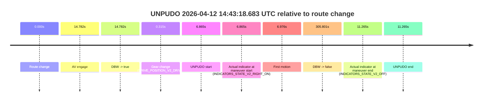
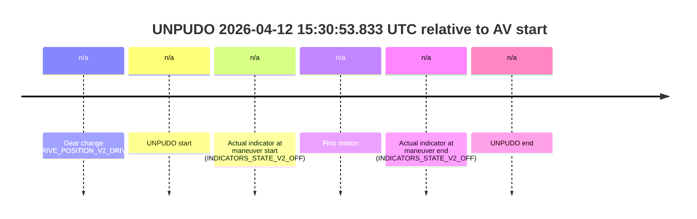

# Run Report: fme20007/2026-04-12--14-36-26--gen2-av-12b0f301-b933-40ed-ae0a-c83d8163bbb1

| Field | Value |
|---|---|
| Run ID | `fme20007/2026-04-12--14-36-26--gen2-av-12b0f301-b933-40ed-ae0a-c83d8163bbb1` |
| Date | `2026-04-12` |
| Model(s) | `lively-orange-horse` |
| Author | `guy.geva` |
| Event count | `3` |

## unpudo 2026-04-12 14:43:18.683 UTC

| Field | Value |
|---|---|
| Model | `lively-orange-horse` |
| Author | `guy.geva` |
| Run ID | `fme20007/2026-04-12--14-36-26--gen2-av-12b0f301-b933-40ed-ae0a-c83d8163bbb1` |
| Date | `2026-04-12` |
| Time (UTC) | `14:43:18.683` |
| Event type | `unpudo` |
| Disengagement type | `failed_to_unpudo` |
| Route change | `found` |
| Console | [run](https://console.sso.wayve.ai/run/fme20007/2026-04-12--14-36-26--gen2-av-12b0f301-b933-40ed-ae0a-c83d8163bbb1?id=&time-unixus=1776004998683302) |
| Foxglove | [segment](https://app.foxglove.dev/wayve-on-prem/p/prj_0dX18KZdVHg1fmmI/view?ds=foxglove-stream&ds.deviceName=fme20007&ds.start=2026-04-12T14%3A43%3A01.818358Z&ds.end=2026-04-12T14%3A48%3A27.618947Z&layoutId=lay_0e7VD4WIKDQGU73Y&time=2026-04-12T14%3A43%3A18.683302Z) |

### Event card: fail

- Fail: AV owns part of the segment, but the event still resolves as a model-performance failure under the AV-only scoring rule.

| Event | Time (UTC) | Delta from route change |
|---|---:|---:|
| Route change | 2026-04-12 14:43:11.818 | `0.000s` |
| AV engage | 2026-04-12 14:43:26.600 | `14.782s` |
| DBW -> true | 2026-04-12 14:43:26.600 | `14.782s` |
| Gear change (DRIVE_POSITION_V2_DRIVE) | 2026-04-12 14:43:12.133 | `0.315s` |
| UNPUDO start | 2026-04-12 14:43:18.683 | `6.865s` |
| Actual indicator at maneuver start (INDICATORS_STATE_V2_RIGHT_ON) | 2026-04-12 14:43:18.683 | `6.865s` |
| First motion | 2026-04-12 14:43:18.794 | `6.976s` |
| DBW -> false | 2026-04-12 14:48:17.618 | `305.801s` |
| Actual indicator at maneuver end (INDICATORS_STATE_V2_OFF) | 2026-04-12 14:43:23.083 | `11.265s` |
| UNPUDO end | 2026-04-12 14:43:23.083 | `11.265s` |

| Metric | Value |
|---|---|
| Outcome | `fail` |
| Effective failure type | `failed_to_unpudo` |
| Route change status | `found` |
| DBW at event start | `false` |
| DBW at event end | `false` |
| Predicted gear at AV start | `DRIVE_POSITION_V2_DRIVE` |
| Actual gear at AV start | `DRIVE_POSITION_V2_DRIVE` |
| Predicted gear at event start | `DRIVE_POSITION_V2_DRIVE` |
| Actual gear at event start | `DRIVE_POSITION_V2_DRIVE` |
| Planned indicator direction | `INDICATORS_STATE_V2_RIGHT_ON` |
| Controller indicator direction | `INDICATORS_STATE_V2_RIGHT_ON` |
| Actual indicator direction | `INDICATORS_STATE_V2_RIGHT_ON` |
| Actual indicator at maneuver end | `INDICATORS_STATE_V2_OFF` |
| Driver accel help in AV | `false` |
| Driver accel help timestamp | `n/a` |
| Max accel pedal pct in AV | `0.0%` |
| Max brake pedal pct in AV | `0.0%` |
| Max speed mps in AV | `0.000` |
| Route -> AV | `14.782s` |
| AV -> event start | `-7.917s` |
| AV -> first motion | `-7.806s` |
| AV duration before disengagement | `291.019s` |
| Trajectory waypoint count | `37` |
| Driving-plan step count | `11` |

The scored portion starts from the AV-owned window, not from the pre-AV setup. Route-change search in the stopped pre-event segment was `found`, with the baseline therefore set to route change. At the event anchor the model predicts `DRIVE_POSITION_V2_DRIVE` and the actual gear is `DRIVE_POSITION_V2_DRIVE`. The effective model outcome is `fail` because `failed_to_unpudo`.

### Resolution

| Field | Value |
|---|---|
| Final outcome | `fail` |
| Do we agree with this label? | `yes` |
| Source disengagement type | `failed_to_unpudo` |
| Resolved effective failure type | `failed_to_unpudo` |
| Confidence | `high` |

## unpudo 2026-04-12 15:10:03.983 UTC

| Field | Value |
|---|---|
| Model | `lively-orange-horse` |
| Author | `guy.geva` |
| Run ID | `fme20007/2026-04-12--14-36-26--gen2-av-12b0f301-b933-40ed-ae0a-c83d8163bbb1` |
| Date | `2026-04-12` |
| Time (UTC) | `15:10:03.983` |
| Event type | `unpudo` |
| Disengagement type | `failed_to_slow` |
| Route change | `found` |
| Console | [run](https://console.sso.wayve.ai/run/fme20007/2026-04-12--14-36-26--gen2-av-12b0f301-b933-40ed-ae0a-c83d8163bbb1?id=&time-unixus=1776006603983319) |
| Foxglove | [segment](https://app.foxglove.dev/wayve-on-prem/p/prj_0dX18KZdVHg1fmmI/view?ds=foxglove-stream&ds.deviceName=fme20007&ds.start=2026-04-12T15%3A07%3A57.568232Z&ds.end=2026-04-12T15%3A17%3A53.201945Z&layoutId=lay_0e7VD4WIKDQGU73Y&time=2026-04-12T15%3A10%3A03.983319Z) |

### Event card: fail

- Fail: AV owns part of the segment, but the event still resolves as a model-performance failure under the AV-only scoring rule.

| Event | Time (UTC) | Delta from route change |
|---|---:|---:|
| Route change | 2026-04-12 15:08:07.568 | `0.000s` |
| AV engage | 2026-04-12 15:10:30.318 | `142.751s` |
| DBW -> true | 2026-04-12 15:10:30.318 | `142.751s` |
| Gear change (DRIVE_POSITION_V2_REVERSE) | 2026-04-12 15:09:55.933 | `108.365s` |
| UNPUDO start | 2026-04-12 15:10:03.983 | `116.415s` |
| Actual indicator at maneuver start (INDICATORS_STATE_V2_OFF) | 2026-04-12 15:10:03.983 | `116.415s` |
| First motion | 2026-04-12 15:10:20.494 | `132.926s` |
| DBW -> false | 2026-04-12 15:17:43.201 | `575.634s` |
| Actual indicator at maneuver end (INDICATORS_STATE_V2_OFF) | 2026-04-12 15:10:24.733 | `137.165s` |
| UNPUDO end | 2026-04-12 15:10:24.733 | `137.165s` |

| Metric | Value |
|---|---|
| Outcome | `fail` |
| Effective failure type | `failed_to_slow` |
| Route change status | `found` |
| DBW at event start | `false` |
| DBW at event end | `false` |
| Predicted gear at AV start | `DRIVE_POSITION_V2_DRIVE` |
| Actual gear at AV start | `DRIVE_POSITION_V2_DRIVE` |
| Predicted gear at event start | `DRIVE_POSITION_V2_DRIVE` |
| Actual gear at event start | `DRIVE_POSITION_V2_REVERSE` |
| Planned indicator direction | `INDICATORS_STATE_V2_OFF` |
| Controller indicator direction | `INDICATORS_STATE_V2_OFF` |
| Actual indicator direction | `INDICATORS_STATE_V2_OFF` |
| Actual indicator at maneuver end | `INDICATORS_STATE_V2_OFF` |
| Driver accel help in AV | `false` |
| Driver accel help timestamp | `n/a` |
| Max accel pedal pct in AV | `0.0%` |
| Max brake pedal pct in AV | `0.0%` |
| Max speed mps in AV | `0.000` |
| Route -> AV | `142.751s` |
| AV -> event start | `-26.336s` |
| AV -> first motion | `-9.824s` |
| AV duration before disengagement | `432.883s` |
| Trajectory waypoint count | `37` |
| Driving-plan step count | `11` |

The scored portion starts from the AV-owned window, not from the pre-AV setup. Route-change search in the stopped pre-event segment was `found`, with the baseline therefore set to route change. At the event anchor the model predicts `DRIVE_POSITION_V2_DRIVE` and the actual gear is `DRIVE_POSITION_V2_REVERSE`. The effective model outcome is `fail` because `failed_to_slow`.

### Resolution

| Field | Value |
|---|---|
| Final outcome | `fail` |
| Do we agree with this label? | `yes` |
| Source disengagement type | `failed_to_slow` |
| Resolved effective failure type | `failed_to_slow` |
| Confidence | `high` |

## unpudo 2026-04-12 15:30:53.833 UTC

| Field | Value |
|---|---|
| Model | `lively-orange-horse` |
| Author | `guy.geva` |
| Run ID | `fme20007/2026-04-12--14-36-26--gen2-av-12b0f301-b933-40ed-ae0a-c83d8163bbb1` |
| Date | `2026-04-12` |
| Time (UTC) | `15:30:53.833` |
| Event type | `unpudo` |
| Disengagement type | `failed_to_pudo` |
| Route change | `unclear` |
| Console | [run](https://console.sso.wayve.ai/run/fme20007/2026-04-12--14-36-26--gen2-av-12b0f301-b933-40ed-ae0a-c83d8163bbb1?id=&time-unixus=1776007853833311) |
| Foxglove | [segment](https://app.foxglove.dev/wayve-on-prem/p/prj_0dX18KZdVHg1fmmI/view?ds=foxglove-stream&ds.deviceName=fme20007&ds.start=2026-04-12T15%3A30%3A38.133293Z&ds.end=2026-04-12T15%3A31%3A03.833311Z&layoutId=lay_0e7VD4WIKDQGU73Y&time=2026-04-12T15%3A30%3A53.833311Z) |

### Event card: fail

- Fail: AV owns part of the segment, but the event still resolves as a model-performance failure under the AV-only scoring rule.

| Event | Time (UTC) | Delta from AV start |
|---|---:|---:|
| Gear change (DRIVE_POSITION_V2_DRIVE) | 2026-04-12 15:30:48.133 | `n/a` |
| UNPUDO start | 2026-04-12 15:30:53.833 | `n/a` |
| Actual indicator at maneuver start (INDICATORS_STATE_V2_OFF) | 2026-04-12 15:30:53.833 | `n/a` |
| First motion | 2026-04-12 15:30:53.894 | `n/a` |
| Actual indicator at maneuver end (INDICATORS_STATE_V2_OFF) | 2026-04-12 15:30:53.833 | `n/a` |
| UNPUDO end | 2026-04-12 15:30:53.833 | `n/a` |

| Metric | Value |
|---|---|
| Outcome | `fail` |
| Effective failure type | `failed_to_pudo` |
| Route change status | `unclear` |
| DBW at event start | `false` |
| DBW at event end | `false` |
| Predicted gear at AV start | `n/a` |
| Actual gear at AV start | `n/a` |
| Predicted gear at event start | `DRIVE_POSITION_V2_DRIVE` |
| Actual gear at event start | `DRIVE_POSITION_V2_DRIVE` |
| Planned indicator direction | `INDICATORS_STATE_V2_OFF` |
| Controller indicator direction | `INDICATORS_STATE_V2_OFF` |
| Actual indicator direction | `INDICATORS_STATE_V2_OFF` |
| Actual indicator at maneuver end | `INDICATORS_STATE_V2_OFF` |
| Driver accel help in AV | `false` |
| Driver accel help timestamp | `n/a` |
| Max accel pedal pct in AV | `0.0%` |
| Max brake pedal pct in AV | `0.0%` |
| Max speed mps in AV | `0.000` |
| Route -> AV | `n/a` |
| AV -> event start | `n/a` |
| AV -> first motion | `n/a` |
| AV duration before disengagement | `n/a` |
| Trajectory waypoint count | `36` |
| Driving-plan step count | `11` |

The scored portion starts from the AV-owned window, not from the pre-AV setup. Route-change search in the stopped pre-event segment was `unclear`, with the baseline therefore set to AV start. At the event anchor the model predicts `DRIVE_POSITION_V2_DRIVE` and the actual gear is `DRIVE_POSITION_V2_DRIVE`. The effective model outcome is `fail` because `failed_to_pudo`.

### Resolution

| Field | Value |
|---|---|
| Final outcome | `fail` |
| Do we agree with this label? | `yes` |
| Source disengagement type | `failed_to_pudo` |
| Resolved effective failure type | `failed_to_pudo` |
| Confidence | `medium` |
