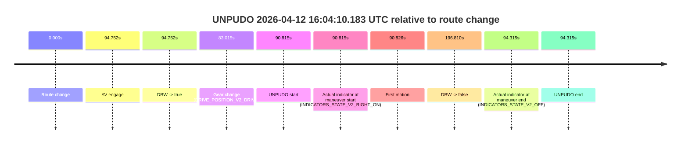
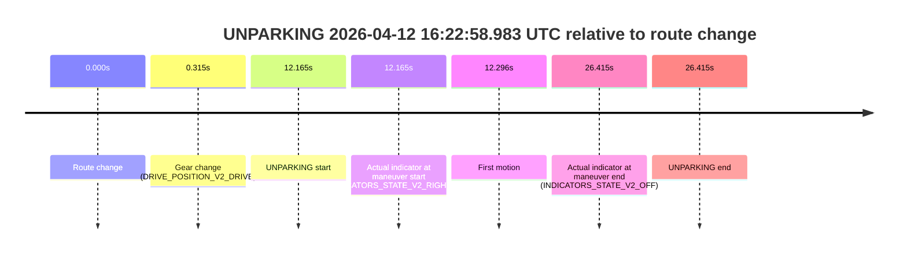

# Run Report: fme20007/2026-04-12--15-54-17--gen2-av-1dad0b0c-0227-435f-a99a-c63fc5a9e218

| Field | Value |
|---|---|
| Run ID | `fme20007/2026-04-12--15-54-17--gen2-av-1dad0b0c-0227-435f-a99a-c63fc5a9e218` |
| Date | `2026-04-12` |
| Model(s) | `lively-orange-horse` |
| Author | `guy.geva` |
| Event count | `3` |

## unpudo 2026-04-12 16:04:10.183 UTC

| Field | Value |
|---|---|
| Model | `lively-orange-horse` |
| Author | `guy.geva` |
| Run ID | `fme20007/2026-04-12--15-54-17--gen2-av-1dad0b0c-0227-435f-a99a-c63fc5a9e218` |
| Date | `2026-04-12` |
| Time (UTC) | `16:04:10.183` |
| Event type | `unpudo` |
| Disengagement type | `failed_to_unpudo` |
| Route change | `found` |
| Console | [run](https://console.sso.wayve.ai/run/fme20007/2026-04-12--15-54-17--gen2-av-1dad0b0c-0227-435f-a99a-c63fc5a9e218?id=&time-unixus=1776009850183307) |
| Foxglove | [segment](https://app.foxglove.dev/wayve-on-prem/p/prj_0dX18KZdVHg1fmmI/view?ds=foxglove-stream&ds.deviceName=fme20007&ds.start=2026-04-12T16%3A02%3A29.368265Z&ds.end=2026-04-12T16%3A06%3A06.178371Z&layoutId=lay_0e7VD4WIKDQGU73Y&time=2026-04-12T16%3A04%3A10.183307Z) |

### Event card: accidental

- Accidental: AV ownership is present for less than `2s`, so this is treated as an accidental brush with the maneuver rather than a meaningful model attempt.

| Event | Time (UTC) | Delta from route change |
|---|---:|---:|
| Route change | 2026-04-12 16:02:39.368 | `0.000s` |
| AV engage | 2026-04-12 16:04:14.120 | `94.752s` |
| DBW -> true | 2026-04-12 16:04:14.120 | `94.752s` |
| Gear change (DRIVE_POSITION_V2_DRIVE) | 2026-04-12 16:04:02.383 | `83.015s` |
| UNPUDO start | 2026-04-12 16:04:10.183 | `90.815s` |
| Actual indicator at maneuver start (INDICATORS_STATE_V2_RIGHT_ON) | 2026-04-12 16:04:10.183 | `90.815s` |
| First motion | 2026-04-12 16:04:10.194 | `90.826s` |
| DBW -> false | 2026-04-12 16:05:56.178 | `196.810s` |
| Actual indicator at maneuver end (INDICATORS_STATE_V2_OFF) | 2026-04-12 16:04:13.683 | `94.315s` |
| UNPUDO end | 2026-04-12 16:04:13.683 | `94.315s` |

| Metric | Value |
|---|---|
| Outcome | `accidental` |
| Effective failure type | `none` |
| Route change status | `found` |
| DBW at event start | `false` |
| DBW at event end | `false` |
| Predicted gear at AV start | `DRIVE_POSITION_V2_DRIVE` |
| Actual gear at AV start | `DRIVE_POSITION_V2_DRIVE` |
| Predicted gear at event start | `DRIVE_POSITION_V2_DRIVE` |
| Actual gear at event start | `DRIVE_POSITION_V2_DRIVE` |
| Planned indicator direction | `INDICATORS_STATE_V2_RIGHT_ON` |
| Controller indicator direction | `INDICATORS_STATE_V2_RIGHT_ON` |
| Actual indicator direction | `INDICATORS_STATE_V2_RIGHT_ON` |
| Actual indicator at maneuver end | `INDICATORS_STATE_V2_OFF` |
| Driver accel help in AV | `false` |
| Driver accel help timestamp | `n/a` |
| Max accel pedal pct in AV | `0.0%` |
| Max brake pedal pct in AV | `0.0%` |
| Max speed mps in AV | `0.000` |
| Route -> AV | `94.752s` |
| AV -> event start | `-3.937s` |
| AV -> first motion | `-3.925s` |
| AV duration before disengagement | `102.058s` |
| Trajectory waypoint count | `37` |
| Driving-plan step count | `11` |

The scored portion starts from the AV-owned window, not from the pre-AV setup. Route-change search in the stopped pre-event segment was `found`, with the baseline therefore set to route change. At the event anchor the model predicts `DRIVE_POSITION_V2_DRIVE` and the actual gear is `DRIVE_POSITION_V2_DRIVE`. The effective model outcome is `accidental` because `the AV-owned portion is shorter than 2s`.

### Resolution

| Field | Value |
|---|---|
| Final outcome | `accidental` |
| Do we agree with this label? | `yes` |
| Source disengagement type | `failed_to_unpudo` |
| Resolved effective failure type | `none` |
| Confidence | `high` |

## unpudo 2026-04-12 16:07:28.083 UTC

| Field | Value |
|---|---|
| Model | `lively-orange-horse` |
| Author | `guy.geva` |
| Run ID | `fme20007/2026-04-12--15-54-17--gen2-av-1dad0b0c-0227-435f-a99a-c63fc5a9e218` |
| Date | `2026-04-12` |
| Time (UTC) | `16:07:28.083` |
| Event type | `unpudo` |
| Disengagement type | `failed_to_unpudo` |
| Route change | `found` |
| Console | [run](https://console.sso.wayve.ai/run/fme20007/2026-04-12--15-54-17--gen2-av-1dad0b0c-0227-435f-a99a-c63fc5a9e218?id=&time-unixus=1776010048083294) |
| Foxglove | [segment](https://app.foxglove.dev/wayve-on-prem/p/prj_0dX18KZdVHg1fmmI/view?ds=foxglove-stream&ds.deviceName=fme20007&ds.start=2026-04-12T16%3A06%3A35.668522Z&ds.end=2026-04-12T16%3A08%3A27.278407Z&layoutId=lay_0e7VD4WIKDQGU73Y&time=2026-04-12T16%3A07%3A28.083294Z) |

### Event card: accidental

- Accidental: AV ownership is present for less than `2s`, so this is treated as an accidental brush with the maneuver rather than a meaningful model attempt.

| Event | Time (UTC) | Delta from route change |
|---|---:|---:|
| Route change | 2026-04-12 16:06:45.668 | `0.000s` |
| AV engage | 2026-04-12 16:07:33.679 | `48.010s` |
| DBW -> true | 2026-04-12 16:07:33.679 | `48.010s` |
| Gear change (DRIVE_POSITION_V2_DRIVE) | 2026-04-12 16:07:11.083 | `25.415s` |
| UNPUDO start | 2026-04-12 16:07:28.083 | `42.415s` |
| Actual indicator at maneuver start (INDICATORS_STATE_V2_OFF) | 2026-04-12 16:07:28.083 | `42.415s` |
| First motion | 2026-04-12 16:07:28.095 | `42.427s` |
| DBW -> false | 2026-04-12 16:08:17.278 | `91.610s` |
| Actual indicator at maneuver end (INDICATORS_STATE_V2_OFF) | 2026-04-12 16:07:32.633 | `46.965s` |
| UNPUDO end | 2026-04-12 16:07:32.633 | `46.965s` |

| Metric | Value |
|---|---|
| Outcome | `accidental` |
| Effective failure type | `none` |
| Route change status | `found` |
| DBW at event start | `false` |
| DBW at event end | `false` |
| Predicted gear at AV start | `DRIVE_POSITION_V2_DRIVE` |
| Actual gear at AV start | `DRIVE_POSITION_V2_DRIVE` |
| Predicted gear at event start | `DRIVE_POSITION_V2_DRIVE` |
| Actual gear at event start | `DRIVE_POSITION_V2_DRIVE` |
| Planned indicator direction | `INDICATORS_STATE_V2_RIGHT_ON` |
| Controller indicator direction | `INDICATORS_STATE_V2_RIGHT_ON` |
| Actual indicator direction | `INDICATORS_STATE_V2_OFF` |
| Actual indicator at maneuver end | `INDICATORS_STATE_V2_OFF` |
| Driver accel help in AV | `false` |
| Driver accel help timestamp | `n/a` |
| Max accel pedal pct in AV | `0.0%` |
| Max brake pedal pct in AV | `0.0%` |
| Max speed mps in AV | `0.000` |
| Route -> AV | `48.010s` |
| AV -> event start | `-5.596s` |
| AV -> first motion | `-5.584s` |
| AV duration before disengagement | `43.599s` |
| Trajectory waypoint count | `37` |
| Driving-plan step count | `11` |

The scored portion starts from the AV-owned window, not from the pre-AV setup. Route-change search in the stopped pre-event segment was `found`, with the baseline therefore set to route change. At the event anchor the model predicts `DRIVE_POSITION_V2_DRIVE` and the actual gear is `DRIVE_POSITION_V2_DRIVE`. The effective model outcome is `accidental` because `the AV-owned portion is shorter than 2s`.

### Resolution

| Field | Value |
|---|---|
| Final outcome | `accidental` |
| Do we agree with this label? | `yes` |
| Source disengagement type | `failed_to_unpudo` |
| Resolved effective failure type | `none` |
| Confidence | `high` |

## unparking 2026-04-12 16:22:58.983 UTC

| Field | Value |
|---|---|
| Model | `lively-orange-horse` |
| Author | `guy.geva` |
| Run ID | `fme20007/2026-04-12--15-54-17--gen2-av-1dad0b0c-0227-435f-a99a-c63fc5a9e218` |
| Date | `2026-04-12` |
| Time (UTC) | `16:22:58.983` |
| Event type | `unparking` |
| Disengagement type | `failed_to_unpudo` |
| Route change | `found` |
| Console | [run](https://console.sso.wayve.ai/run/fme20007/2026-04-12--15-54-17--gen2-av-1dad0b0c-0227-435f-a99a-c63fc5a9e218?id=&time-unixus=1776010978983305) |
| Foxglove | [segment](https://app.foxglove.dev/wayve-on-prem/p/prj_0dX18KZdVHg1fmmI/view?ds=foxglove-stream&ds.deviceName=fme20007&ds.start=2026-04-12T16%3A22%3A36.818256Z&ds.end=2026-04-12T16%3A23%3A23.233292Z&layoutId=lay_0e7VD4WIKDQGU73Y&time=2026-04-12T16%3A22%3A58.983305Z) |

### Event card: non-av

- Non-AV: the detected unparking starts outside AV ownership, so it is kept for coverage but excluded from model success / failure scoring.

| Event | Time (UTC) | Delta from route change |
|---|---:|---:|
| Route change | 2026-04-12 16:22:46.818 | `0.000s` |
| Gear change (DRIVE_POSITION_V2_DRIVE) | 2026-04-12 16:22:47.133 | `0.315s` |
| UNPARKING start | 2026-04-12 16:22:58.983 | `12.165s` |
| Actual indicator at maneuver start (INDICATORS_STATE_V2_RIGHT_ON) | 2026-04-12 16:22:58.983 | `12.165s` |
| First motion | 2026-04-12 16:22:59.114 | `12.296s` |
| Actual indicator at maneuver end (INDICATORS_STATE_V2_OFF) | 2026-04-12 16:23:13.233 | `26.415s` |
| UNPARKING end | 2026-04-12 16:23:13.233 | `26.415s` |

| Metric | Value |
|---|---|
| Outcome | `non-av` |
| Effective failure type | `none` |
| Route change status | `found` |
| DBW at event start | `false` |
| DBW at event end | `false` |
| Predicted gear at AV start | `n/a` |
| Actual gear at AV start | `n/a` |
| Predicted gear at event start | `DRIVE_POSITION_V2_DRIVE` |
| Actual gear at event start | `DRIVE_POSITION_V2_DRIVE` |
| Planned indicator direction | `INDICATORS_STATE_V2_RIGHT_ON` |
| Controller indicator direction | `INDICATORS_STATE_V2_RIGHT_ON` |
| Actual indicator direction | `INDICATORS_STATE_V2_RIGHT_ON` |
| Actual indicator at maneuver end | `INDICATORS_STATE_V2_OFF` |
| Driver accel help in AV | `false` |
| Driver accel help timestamp | `n/a` |
| Max accel pedal pct in AV | `0.0%` |
| Max brake pedal pct in AV | `0.0%` |
| Max speed mps in AV | `0.000` |
| Route -> AV | `n/a` |
| AV -> event start | `n/a` |
| AV -> first motion | `n/a` |
| AV duration before disengagement | `n/a` |
| Trajectory waypoint count | `37` |
| Driving-plan step count | `11` |

The scored portion starts from the AV-owned window, not from the pre-AV setup. Route-change search in the stopped pre-event segment was `found`, with the baseline therefore set to route change. At the event anchor the model predicts `DRIVE_POSITION_V2_DRIVE` and the actual gear is `DRIVE_POSITION_V2_DRIVE`. The effective model outcome is `non-av` because `the event does not begin in AV ownership`.

### Resolution

| Field | Value |
|---|---|
| Final outcome | `non-av` |
| Do we agree with this label? | `yes` |
| Source disengagement type | `failed_to_unpudo` |
| Resolved effective failure type | `none` |
| Confidence | `high` |
