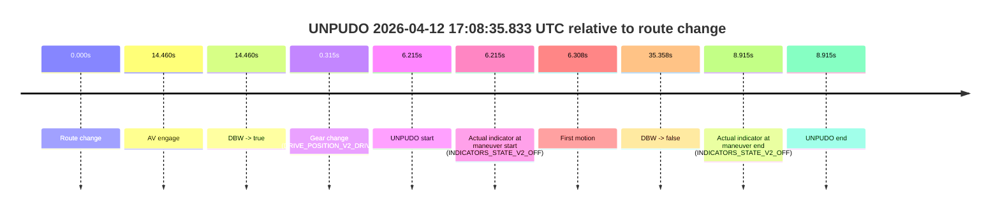
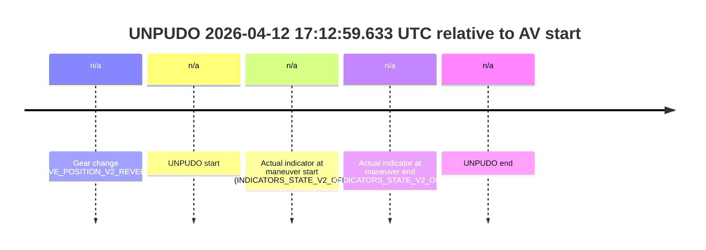
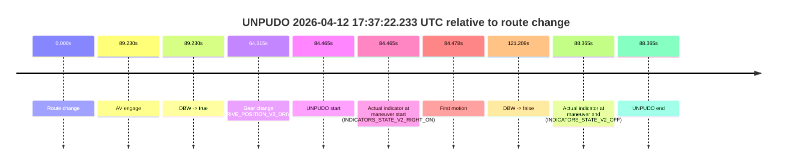
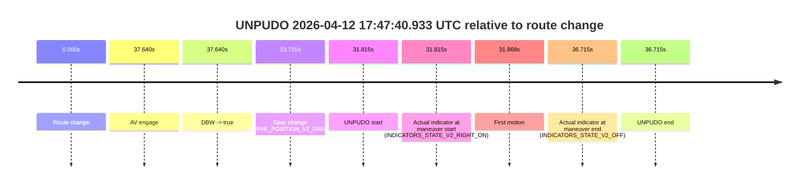

# Run Report: fme20007/2026-04-12--16-45-52--gen2-av-f86dc8d1-ee5a-418d-b5ca-afdac21a5503

| Field | Value |
|---|---|
| Run ID | `fme20007/2026-04-12--16-45-52--gen2-av-f86dc8d1-ee5a-418d-b5ca-afdac21a5503` |
| Date | `2026-04-12` |
| Model(s) | `lively-orange-horse` |
| Author | `guy.geva` |
| Event count | `4` |

## unpudo 2026-04-12 17:08:35.833 UTC

| Field | Value |
|---|---|
| Model | `lively-orange-horse` |
| Author | `guy.geva` |
| Run ID | `fme20007/2026-04-12--16-45-52--gen2-av-f86dc8d1-ee5a-418d-b5ca-afdac21a5503` |
| Date | `2026-04-12` |
| Time (UTC) | `17:08:35.833` |
| Event type | `unpudo` |
| Disengagement type | `failed_to_unpudo` |
| Route change | `found` |
| Console | [run](https://console.sso.wayve.ai/run/fme20007/2026-04-12--16-45-52--gen2-av-f86dc8d1-ee5a-418d-b5ca-afdac21a5503?id=&time-unixus=1776013715833296) |
| Foxglove | [segment](https://app.foxglove.dev/wayve-on-prem/p/prj_0dX18KZdVHg1fmmI/view?ds=foxglove-stream&ds.deviceName=fme20007&ds.start=2026-04-12T17%3A08%3A19.618313Z&ds.end=2026-04-12T17%3A09%3A14.976726Z&layoutId=lay_0e7VD4WIKDQGU73Y&time=2026-04-12T17%3A08%3A35.833296Z) |

### Event card: accidental

- Accidental: AV ownership is present for less than `2s`, so this is treated as an accidental brush with the maneuver rather than a meaningful model attempt.

| Event | Time (UTC) | Delta from route change |
|---|---:|---:|
| Route change | 2026-04-12 17:08:29.618 | `0.000s` |
| AV engage | 2026-04-12 17:08:44.077 | `14.460s` |
| DBW -> true | 2026-04-12 17:08:44.077 | `14.460s` |
| Gear change (DRIVE_POSITION_V2_DRIVE) | 2026-04-12 17:08:29.933 | `0.315s` |
| UNPUDO start | 2026-04-12 17:08:35.833 | `6.215s` |
| Actual indicator at maneuver start (INDICATORS_STATE_V2_OFF) | 2026-04-12 17:08:35.833 | `6.215s` |
| First motion | 2026-04-12 17:08:35.926 | `6.308s` |
| DBW -> false | 2026-04-12 17:09:04.976 | `35.358s` |
| Actual indicator at maneuver end (INDICATORS_STATE_V2_OFF) | 2026-04-12 17:08:38.533 | `8.915s` |
| UNPUDO end | 2026-04-12 17:08:38.533 | `8.915s` |

| Metric | Value |
|---|---|
| Outcome | `accidental` |
| Effective failure type | `none` |
| Route change status | `found` |
| DBW at event start | `false` |
| DBW at event end | `false` |
| Predicted gear at AV start | `DRIVE_POSITION_V2_DRIVE` |
| Actual gear at AV start | `DRIVE_POSITION_V2_DRIVE` |
| Predicted gear at event start | `DRIVE_POSITION_V2_DRIVE` |
| Actual gear at event start | `DRIVE_POSITION_V2_DRIVE` |
| Planned indicator direction | `INDICATORS_STATE_V2_RIGHT_ON` |
| Controller indicator direction | `INDICATORS_STATE_V2_RIGHT_ON` |
| Actual indicator direction | `INDICATORS_STATE_V2_OFF` |
| Actual indicator at maneuver end | `INDICATORS_STATE_V2_OFF` |
| Driver accel help in AV | `false` |
| Driver accel help timestamp | `n/a` |
| Max accel pedal pct in AV | `0.0%` |
| Max brake pedal pct in AV | `0.0%` |
| Max speed mps in AV | `0.000` |
| Route -> AV | `14.460s` |
| AV -> event start | `-8.245s` |
| AV -> first motion | `-8.151s` |
| AV duration before disengagement | `20.899s` |
| Trajectory waypoint count | `37` |
| Driving-plan step count | `11` |

The scored portion starts from the AV-owned window, not from the pre-AV setup. Route-change search in the stopped pre-event segment was `found`, with the baseline therefore set to route change. At the event anchor the model predicts `DRIVE_POSITION_V2_DRIVE` and the actual gear is `DRIVE_POSITION_V2_DRIVE`. The effective model outcome is `accidental` because `the AV-owned portion is shorter than 2s`.

### Resolution

| Field | Value |
|---|---|
| Final outcome | `accidental` |
| Do we agree with this label? | `yes` |
| Source disengagement type | `failed_to_unpudo` |
| Resolved effective failure type | `none` |
| Confidence | `high` |

## unpudo 2026-04-12 17:12:59.633 UTC

| Field | Value |
|---|---|
| Model | `lively-orange-horse` |
| Author | `guy.geva` |
| Run ID | `fme20007/2026-04-12--16-45-52--gen2-av-f86dc8d1-ee5a-418d-b5ca-afdac21a5503` |
| Date | `2026-04-12` |
| Time (UTC) | `17:12:59.633` |
| Event type | `unpudo` |
| Disengagement type | `failed_to_pudo` |
| Route change | `unclear` |
| Console | [run](https://console.sso.wayve.ai/run/fme20007/2026-04-12--16-45-52--gen2-av-f86dc8d1-ee5a-418d-b5ca-afdac21a5503?id=&time-unixus=1776013979633296) |
| Foxglove | [segment](https://app.foxglove.dev/wayve-on-prem/p/prj_0dX18KZdVHg1fmmI/view?ds=foxglove-stream&ds.deviceName=fme20007&ds.start=2026-04-12T17%3A12%3A45.433299Z&ds.end=2026-04-12T17%3A13%3A09.633296Z&layoutId=lay_0e7VD4WIKDQGU73Y&time=2026-04-12T17%3A12%3A59.633296Z) |

### Event card: non-av

- Non-AV: the detected unpudo starts outside AV ownership, so it is kept for coverage but excluded from model success / failure scoring.

| Event | Time (UTC) | Delta from AV start |
|---|---:|---:|
| Gear change (DRIVE_POSITION_V2_REVERSE) | 2026-04-12 17:12:55.433 | `n/a` |
| UNPUDO start | 2026-04-12 17:12:59.633 | `n/a` |
| Actual indicator at maneuver start (INDICATORS_STATE_V2_OFF) | 2026-04-12 17:12:59.633 | `n/a` |
| Actual indicator at maneuver end (INDICATORS_STATE_V2_OFF) | 2026-04-12 17:12:59.633 | `n/a` |
| UNPUDO end | 2026-04-12 17:12:59.633 | `n/a` |

| Metric | Value |
|---|---|
| Outcome | `non-av` |
| Effective failure type | `none` |
| Route change status | `unclear` |
| DBW at event start | `false` |
| DBW at event end | `false` |
| Predicted gear at AV start | `n/a` |
| Actual gear at AV start | `n/a` |
| Predicted gear at event start | `DRIVE_POSITION_V2_DRIVE` |
| Actual gear at event start | `DRIVE_POSITION_V2_REVERSE` |
| Planned indicator direction | `INDICATORS_STATE_V2_OFF` |
| Controller indicator direction | `INDICATORS_STATE_V2_OFF` |
| Actual indicator direction | `INDICATORS_STATE_V2_OFF` |
| Actual indicator at maneuver end | `INDICATORS_STATE_V2_OFF` |
| Driver accel help in AV | `false` |
| Driver accel help timestamp | `n/a` |
| Max accel pedal pct in AV | `0.0%` |
| Max brake pedal pct in AV | `0.0%` |
| Max speed mps in AV | `0.000` |
| Route -> AV | `n/a` |
| AV -> event start | `n/a` |
| AV -> first motion | `n/a` |
| AV duration before disengagement | `n/a` |
| Trajectory waypoint count | `37` |
| Driving-plan step count | `11` |

The scored portion starts from the AV-owned window, not from the pre-AV setup. Route-change search in the stopped pre-event segment was `unclear`, with the baseline therefore set to AV start. At the event anchor the model predicts `DRIVE_POSITION_V2_DRIVE` and the actual gear is `DRIVE_POSITION_V2_REVERSE`. The effective model outcome is `non-av` because `the event does not begin in AV ownership`.

### Resolution

| Field | Value |
|---|---|
| Final outcome | `non-av` |
| Do we agree with this label? | `yes` |
| Source disengagement type | `failed_to_pudo` |
| Resolved effective failure type | `none` |
| Confidence | `medium` |

## unpudo 2026-04-12 17:37:22.233 UTC

| Field | Value |
|---|---|
| Model | `lively-orange-horse` |
| Author | `guy.geva` |
| Run ID | `fme20007/2026-04-12--16-45-52--gen2-av-f86dc8d1-ee5a-418d-b5ca-afdac21a5503` |
| Date | `2026-04-12` |
| Time (UTC) | `17:37:22.233` |
| Event type | `unpudo` |
| Disengagement type | `failed_to_unpudo` |
| Route change | `found` |
| Console | [run](https://console.sso.wayve.ai/run/fme20007/2026-04-12--16-45-52--gen2-av-f86dc8d1-ee5a-418d-b5ca-afdac21a5503?id=&time-unixus=1776015442233314) |
| Foxglove | [segment](https://app.foxglove.dev/wayve-on-prem/p/prj_0dX18KZdVHg1fmmI/view?ds=foxglove-stream&ds.deviceName=fme20007&ds.start=2026-04-12T17%3A35%3A47.768258Z&ds.end=2026-04-12T17%3A38%3A08.977068Z&layoutId=lay_0e7VD4WIKDQGU73Y&time=2026-04-12T17%3A37%3A22.233314Z) |

### Event card: accidental

- Accidental: AV ownership is present for less than `2s`, so this is treated as an accidental brush with the maneuver rather than a meaningful model attempt.

| Event | Time (UTC) | Delta from route change |
|---|---:|---:|
| Route change | 2026-04-12 17:35:57.768 | `0.000s` |
| AV engage | 2026-04-12 17:37:26.997 | `89.230s` |
| DBW -> true | 2026-04-12 17:37:26.997 | `89.230s` |
| Gear change (DRIVE_POSITION_V2_DRIVE) | 2026-04-12 17:37:02.283 | `64.515s` |
| UNPUDO start | 2026-04-12 17:37:22.233 | `84.465s` |
| Actual indicator at maneuver start (INDICATORS_STATE_V2_RIGHT_ON) | 2026-04-12 17:37:22.233 | `84.465s` |
| First motion | 2026-04-12 17:37:22.246 | `84.478s` |
| DBW -> false | 2026-04-12 17:37:58.977 | `121.209s` |
| Actual indicator at maneuver end (INDICATORS_STATE_V2_OFF) | 2026-04-12 17:37:26.133 | `88.365s` |
| UNPUDO end | 2026-04-12 17:37:26.133 | `88.365s` |

| Metric | Value |
|---|---|
| Outcome | `accidental` |
| Effective failure type | `none` |
| Route change status | `found` |
| DBW at event start | `false` |
| DBW at event end | `false` |
| Predicted gear at AV start | `DRIVE_POSITION_V2_DRIVE` |
| Actual gear at AV start | `DRIVE_POSITION_V2_DRIVE` |
| Predicted gear at event start | `DRIVE_POSITION_V2_DRIVE` |
| Actual gear at event start | `DRIVE_POSITION_V2_DRIVE` |
| Planned indicator direction | `INDICATORS_STATE_V2_RIGHT_ON` |
| Controller indicator direction | `INDICATORS_STATE_V2_RIGHT_ON` |
| Actual indicator direction | `INDICATORS_STATE_V2_RIGHT_ON` |
| Actual indicator at maneuver end | `INDICATORS_STATE_V2_OFF` |
| Driver accel help in AV | `false` |
| Driver accel help timestamp | `n/a` |
| Max accel pedal pct in AV | `0.0%` |
| Max brake pedal pct in AV | `0.0%` |
| Max speed mps in AV | `0.000` |
| Route -> AV | `89.230s` |
| AV -> event start | `-4.765s` |
| AV -> first motion | `-4.752s` |
| AV duration before disengagement | `31.979s` |
| Trajectory waypoint count | `37` |
| Driving-plan step count | `11` |

The scored portion starts from the AV-owned window, not from the pre-AV setup. Route-change search in the stopped pre-event segment was `found`, with the baseline therefore set to route change. At the event anchor the model predicts `DRIVE_POSITION_V2_DRIVE` and the actual gear is `DRIVE_POSITION_V2_DRIVE`. The effective model outcome is `accidental` because `the AV-owned portion is shorter than 2s`.

### Resolution

| Field | Value |
|---|---|
| Final outcome | `accidental` |
| Do we agree with this label? | `yes` |
| Source disengagement type | `failed_to_unpudo` |
| Resolved effective failure type | `none` |
| Confidence | `high` |

## unpudo 2026-04-12 17:47:40.933 UTC

| Field | Value |
|---|---|
| Model | `lively-orange-horse` |
| Author | `guy.geva` |
| Run ID | `fme20007/2026-04-12--16-45-52--gen2-av-f86dc8d1-ee5a-418d-b5ca-afdac21a5503` |
| Date | `2026-04-12` |
| Time (UTC) | `17:47:40.933` |
| Event type | `unpudo` |
| Disengagement type | `failed_to_unpudo` |
| Route change | `found` |
| Console | [run](https://console.sso.wayve.ai/run/fme20007/2026-04-12--16-45-52--gen2-av-f86dc8d1-ee5a-418d-b5ca-afdac21a5503?id=&time-unixus=1776016060933321) |
| Foxglove | [segment](https://app.foxglove.dev/wayve-on-prem/p/prj_0dX18KZdVHg1fmmI/view?ds=foxglove-stream&ds.deviceName=fme20007&ds.start=2026-04-12T17%3A46%3A59.118257Z&ds.end=2026-04-12T17%3A47%3A55.833300Z&layoutId=lay_0e7VD4WIKDQGU73Y&time=2026-04-12T17%3A47%3A40.933321Z) |

### Event card: accidental

- Accidental: AV ownership is present for less than `2s`, so this is treated as an accidental brush with the maneuver rather than a meaningful model attempt.

| Event | Time (UTC) | Delta from route change |
|---|---:|---:|
| Route change | 2026-04-12 17:47:09.118 | `0.000s` |
| AV engage | 2026-04-12 17:47:46.758 | `37.640s` |
| DBW -> true | 2026-04-12 17:47:46.758 | `37.640s` |
| Gear change (DRIVE_POSITION_V2_DRIVE) | 2026-04-12 17:47:32.833 | `23.715s` |
| UNPUDO start | 2026-04-12 17:47:40.933 | `31.815s` |
| Actual indicator at maneuver start (INDICATORS_STATE_V2_RIGHT_ON) | 2026-04-12 17:47:40.933 | `31.815s` |
| First motion | 2026-04-12 17:47:40.986 | `31.868s` |
| Actual indicator at maneuver end (INDICATORS_STATE_V2_OFF) | 2026-04-12 17:47:45.833 | `36.715s` |
| UNPUDO end | 2026-04-12 17:47:45.833 | `36.715s` |

| Metric | Value |
|---|---|
| Outcome | `accidental` |
| Effective failure type | `none` |
| Route change status | `found` |
| DBW at event start | `false` |
| DBW at event end | `false` |
| Predicted gear at AV start | `DRIVE_POSITION_V2_DRIVE` |
| Actual gear at AV start | `DRIVE_POSITION_V2_DRIVE` |
| Predicted gear at event start | `DRIVE_POSITION_V2_DRIVE` |
| Actual gear at event start | `DRIVE_POSITION_V2_DRIVE` |
| Planned indicator direction | `INDICATORS_STATE_V2_RIGHT_ON` |
| Controller indicator direction | `INDICATORS_STATE_V2_RIGHT_ON` |
| Actual indicator direction | `INDICATORS_STATE_V2_RIGHT_ON` |
| Actual indicator at maneuver end | `INDICATORS_STATE_V2_OFF` |
| Driver accel help in AV | `false` |
| Driver accel help timestamp | `n/a` |
| Max accel pedal pct in AV | `0.0%` |
| Max brake pedal pct in AV | `0.0%` |
| Max speed mps in AV | `0.000` |
| Route -> AV | `37.640s` |
| AV -> event start | `-5.825s` |
| AV -> first motion | `-5.772s` |
| AV duration before disengagement | `n/a` |
| Trajectory waypoint count | `37` |
| Driving-plan step count | `11` |

The scored portion starts from the AV-owned window, not from the pre-AV setup. Route-change search in the stopped pre-event segment was `found`, with the baseline therefore set to route change. At the event anchor the model predicts `DRIVE_POSITION_V2_DRIVE` and the actual gear is `DRIVE_POSITION_V2_DRIVE`. The effective model outcome is `accidental` because `the AV-owned portion is shorter than 2s`.

### Resolution

| Field | Value |
|---|---|
| Final outcome | `accidental` |
| Do we agree with this label? | `yes` |
| Source disengagement type | `failed_to_unpudo` |
| Resolved effective failure type | `none` |
| Confidence | `high` |
