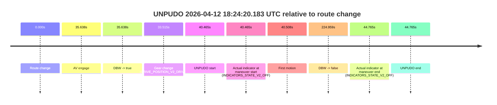
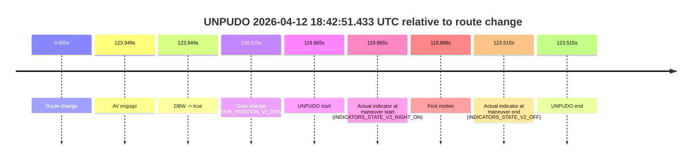

# Run Report: fme20007/2026-04-12--18-19-01--gen2-av-6a73ed2b-3fc1-42dc-8a6b-221ec3929ed3

| Field | Value |
|---|---|
| Run ID | `fme20007/2026-04-12--18-19-01--gen2-av-6a73ed2b-3fc1-42dc-8a6b-221ec3929ed3` |
| Date | `2026-04-12` |
| Model(s) | `lively-orange-horse` |
| Author | `guy.geva` |
| Event count | `3` |

## unpudo 2026-04-12 18:24:20.183 UTC

| Field | Value |
|---|---|
| Model | `lively-orange-horse` |
| Author | `guy.geva` |
| Run ID | `fme20007/2026-04-12--18-19-01--gen2-av-6a73ed2b-3fc1-42dc-8a6b-221ec3929ed3` |
| Date | `2026-04-12` |
| Time (UTC) | `18:24:20.183` |
| Event type | `unpudo` |
| Disengagement type | `none observed` |
| Route change | `found` |
| Console | [run](https://console.sso.wayve.ai/run/fme20007/2026-04-12--18-19-01--gen2-av-6a73ed2b-3fc1-42dc-8a6b-221ec3929ed3?id=&time-unixus=1776018260183292) |
| Foxglove | [segment](https://app.foxglove.dev/wayve-on-prem/p/prj_0dX18KZdVHg1fmmI/view?ds=foxglove-stream&ds.deviceName=fme20007&ds.start=2026-04-12T18%3A23%3A29.718307Z&ds.end=2026-04-12T18%3A27%3A34.677000Z&layoutId=lay_0e7VD4WIKDQGU73Y&time=2026-04-12T18%3A24%3A20.183292Z) |

### Event card: pass

- Pass: AV owns the credited unpudo through the official event window, the gear state is aligned at the anchor, and the vehicle moves without driver accelerator help in AV.

| Event | Time (UTC) | Delta from route change |
|---|---:|---:|
| Route change | 2026-04-12 18:23:39.718 | `0.000s` |
| AV engage | 2026-04-12 18:24:15.355 | `35.638s` |
| DBW -> true | 2026-04-12 18:24:15.355 | `35.638s` |
| Gear change (DRIVE_POSITION_V2_DRIVE) | 2026-04-12 18:24:13.233 | `33.515s` |
| UNPUDO start | 2026-04-12 18:24:20.183 | `40.465s` |
| Actual indicator at maneuver start (INDICATORS_STATE_V2_OFF) | 2026-04-12 18:24:20.183 | `40.465s` |
| First motion | 2026-04-12 18:24:20.226 | `40.508s` |
| DBW -> false | 2026-04-12 18:27:24.677 | `224.959s` |
| Actual indicator at maneuver end (INDICATORS_STATE_V2_OFF) | 2026-04-12 18:24:24.483 | `44.765s` |
| UNPUDO end | 2026-04-12 18:24:24.483 | `44.765s` |

| Metric | Value |
|---|---|
| Outcome | `pass` |
| Effective failure type | `none` |
| Route change status | `found` |
| DBW at event start | `true` |
| DBW at event end | `true` |
| Predicted gear at AV start | `DRIVE_POSITION_V2_DRIVE` |
| Actual gear at AV start | `DRIVE_POSITION_V2_DRIVE` |
| Predicted gear at event start | `DRIVE_POSITION_V2_DRIVE` |
| Actual gear at event start | `DRIVE_POSITION_V2_DRIVE` |
| Planned indicator direction | `INDICATORS_STATE_V2_RIGHT_ON` |
| Controller indicator direction | `INDICATORS_STATE_V2_RIGHT_ON` |
| Actual indicator direction | `INDICATORS_STATE_V2_OFF` |
| Actual indicator at maneuver end | `INDICATORS_STATE_V2_OFF` |
| Driver accel help in AV | `false` |
| Driver accel help timestamp | `n/a` |
| Max accel pedal pct in AV | `0.0%` |
| Max brake pedal pct in AV | `8.0%` |
| Max speed mps in AV | `3.153` |
| Route -> AV | `35.638s` |
| AV -> event start | `4.827s` |
| AV -> first motion | `4.871s` |
| AV duration before disengagement | `189.321s` |
| Trajectory waypoint count | `36` |
| Driving-plan step count | `11` |

The scored portion starts from the AV-owned window, not from the pre-AV setup. Route-change search in the stopped pre-event segment was `found`, with the baseline therefore set to route change. At the event anchor the model predicts `DRIVE_POSITION_V2_DRIVE` and the actual gear is `DRIVE_POSITION_V2_DRIVE`. The effective model outcome is `pass` because `the credited maneuver stays AV-owned through the official event end`.

### Resolution

| Field | Value |
|---|---|
| Final outcome | `pass` |
| Do we agree with this label? | `yes` |
| Source disengagement type | `none observed` |
| Resolved effective failure type | `none` |
| Confidence | `high` |

## unpudo 2026-04-12 18:31:05.233 UTC

| Field | Value |
|---|---|
| Model | `lively-orange-horse` |
| Author | `guy.geva` |
| Run ID | `fme20007/2026-04-12--18-19-01--gen2-av-6a73ed2b-3fc1-42dc-8a6b-221ec3929ed3` |
| Date | `2026-04-12` |
| Time (UTC) | `18:31:05.233` |
| Event type | `unpudo` |
| Disengagement type | `none observed` |
| Route change | `found` |
| Console | [run](https://console.sso.wayve.ai/run/fme20007/2026-04-12--18-19-01--gen2-av-6a73ed2b-3fc1-42dc-8a6b-221ec3929ed3?id=&time-unixus=1776018665233313) |
| Foxglove | [segment](https://app.foxglove.dev/wayve-on-prem/p/prj_0dX18KZdVHg1fmmI/view?ds=foxglove-stream&ds.deviceName=fme20007&ds.start=2026-04-12T18%3A30%3A32.918560Z&ds.end=2026-04-12T18%3A33%3A12.915811Z&layoutId=lay_0e7VD4WIKDQGU73Y&time=2026-04-12T18%3A31%3A05.233313Z) |

### Event card: accidental

- Accidental: AV ownership is present for less than `2s`, so this is treated as an accidental brush with the maneuver rather than a meaningful model attempt.

| Event | Time (UTC) | Delta from route change |
|---|---:|---:|
| Route change | 2026-04-12 18:30:42.918 | `0.000s` |
| AV engage | 2026-04-12 18:31:19.555 | `36.637s` |
| DBW -> true | 2026-04-12 18:31:19.555 | `36.637s` |
| Gear change (DRIVE_POSITION_V2_REVERSE) | 2026-04-12 18:31:03.933 | `21.015s` |
| UNPUDO start | 2026-04-12 18:31:05.233 | `22.315s` |
| Actual indicator at maneuver start (INDICATORS_STATE_V2_OFF) | 2026-04-12 18:31:05.233 | `22.315s` |
| First motion | 2026-04-12 18:31:14.886 | `31.968s` |
| DBW -> false | 2026-04-12 18:33:02.915 | `139.997s` |
| Actual indicator at maneuver end (INDICATORS_STATE_V2_OFF) | 2026-04-12 18:31:20.733 | `37.815s` |
| UNPUDO end | 2026-04-12 18:31:20.733 | `37.815s` |

| Metric | Value |
|---|---|
| Outcome | `accidental` |
| Effective failure type | `none` |
| Route change status | `found` |
| DBW at event start | `false` |
| DBW at event end | `true` |
| Predicted gear at AV start | `DRIVE_POSITION_V2_DRIVE` |
| Actual gear at AV start | `DRIVE_POSITION_V2_DRIVE` |
| Predicted gear at event start | `DRIVE_POSITION_V2_DRIVE` |
| Actual gear at event start | `DRIVE_POSITION_V2_REVERSE` |
| Planned indicator direction | `INDICATORS_STATE_V2_OFF` |
| Controller indicator direction | `INDICATORS_STATE_V2_OFF` |
| Actual indicator direction | `INDICATORS_STATE_V2_OFF` |
| Actual indicator at maneuver end | `INDICATORS_STATE_V2_OFF` |
| Driver accel help in AV | `false` |
| Driver accel help timestamp | `n/a` |
| Max accel pedal pct in AV | `0.0%` |
| Max brake pedal pct in AV | `0.0%` |
| Max speed mps in AV | `2.286` |
| Route -> AV | `36.637s` |
| AV -> event start | `-14.323s` |
| AV -> first motion | `-4.669s` |
| AV duration before disengagement | `103.360s` |
| Trajectory waypoint count | `37` |
| Driving-plan step count | `11` |

The scored portion starts from the AV-owned window, not from the pre-AV setup. Route-change search in the stopped pre-event segment was `found`, with the baseline therefore set to route change. At the event anchor the model predicts `DRIVE_POSITION_V2_DRIVE` and the actual gear is `DRIVE_POSITION_V2_REVERSE`. The effective model outcome is `accidental` because `the AV-owned portion is shorter than 2s`.

### Resolution

| Field | Value |
|---|---|
| Final outcome | `accidental` |
| Do we agree with this label? | `yes` |
| Source disengagement type | `none observed` |
| Resolved effective failure type | `none` |
| Confidence | `high` |

## unpudo 2026-04-12 18:42:51.433 UTC

| Field | Value |
|---|---|
| Model | `lively-orange-horse` |
| Author | `guy.geva` |
| Run ID | `fme20007/2026-04-12--18-19-01--gen2-av-6a73ed2b-3fc1-42dc-8a6b-221ec3929ed3` |
| Date | `2026-04-12` |
| Time (UTC) | `18:42:51.433` |
| Event type | `unpudo` |
| Disengagement type | `failed_to_unpudo` |
| Route change | `found` |
| Console | [run](https://console.sso.wayve.ai/run/fme20007/2026-04-12--18-19-01--gen2-av-6a73ed2b-3fc1-42dc-8a6b-221ec3929ed3?id=&time-unixus=1776019371433306) |
| Foxglove | [segment](https://app.foxglove.dev/wayve-on-prem/p/prj_0dX18KZdVHg1fmmI/view?ds=foxglove-stream&ds.deviceName=fme20007&ds.start=2026-04-12T18%3A40%3A41.568263Z&ds.end=2026-04-12T18%3A43%3A05.083307Z&layoutId=lay_0e7VD4WIKDQGU73Y&time=2026-04-12T18%3A42%3A51.433306Z) |

### Event card: accidental

- Accidental: AV ownership is present for less than `2s`, so this is treated as an accidental brush with the maneuver rather than a meaningful model attempt.

| Event | Time (UTC) | Delta from route change |
|---|---:|---:|
| Route change | 2026-04-12 18:40:51.568 | `0.000s` |
| AV engage | 2026-04-12 18:42:55.517 | `123.949s` |
| DBW -> true | 2026-04-12 18:42:55.517 | `123.949s` |
| Gear change (DRIVE_POSITION_V2_DRIVE) | 2026-04-12 18:42:40.083 | `108.515s` |
| UNPUDO start | 2026-04-12 18:42:51.433 | `119.865s` |
| Actual indicator at maneuver start (INDICATORS_STATE_V2_RIGHT_ON) | 2026-04-12 18:42:51.433 | `119.865s` |
| First motion | 2026-04-12 18:42:51.466 | `119.898s` |
| Actual indicator at maneuver end (INDICATORS_STATE_V2_OFF) | 2026-04-12 18:42:55.083 | `123.515s` |
| UNPUDO end | 2026-04-12 18:42:55.083 | `123.515s` |

| Metric | Value |
|---|---|
| Outcome | `accidental` |
| Effective failure type | `none` |
| Route change status | `found` |
| DBW at event start | `false` |
| DBW at event end | `false` |
| Predicted gear at AV start | `DRIVE_POSITION_V2_DRIVE` |
| Actual gear at AV start | `DRIVE_POSITION_V2_DRIVE` |
| Predicted gear at event start | `DRIVE_POSITION_V2_DRIVE` |
| Actual gear at event start | `DRIVE_POSITION_V2_DRIVE` |
| Planned indicator direction | `INDICATORS_STATE_V2_RIGHT_ON` |
| Controller indicator direction | `INDICATORS_STATE_V2_RIGHT_ON` |
| Actual indicator direction | `INDICATORS_STATE_V2_RIGHT_ON` |
| Actual indicator at maneuver end | `INDICATORS_STATE_V2_OFF` |
| Driver accel help in AV | `false` |
| Driver accel help timestamp | `n/a` |
| Max accel pedal pct in AV | `0.0%` |
| Max brake pedal pct in AV | `0.0%` |
| Max speed mps in AV | `0.000` |
| Route -> AV | `123.949s` |
| AV -> event start | `-4.084s` |
| AV -> first motion | `-4.051s` |
| AV duration before disengagement | `n/a` |
| Trajectory waypoint count | `37` |
| Driving-plan step count | `11` |

The scored portion starts from the AV-owned window, not from the pre-AV setup. Route-change search in the stopped pre-event segment was `found`, with the baseline therefore set to route change. At the event anchor the model predicts `DRIVE_POSITION_V2_DRIVE` and the actual gear is `DRIVE_POSITION_V2_DRIVE`. The effective model outcome is `accidental` because `the AV-owned portion is shorter than 2s`.

### Resolution

| Field | Value |
|---|---|
| Final outcome | `accidental` |
| Do we agree with this label? | `yes` |
| Source disengagement type | `failed_to_unpudo` |
| Resolved effective failure type | `none` |
| Confidence | `high` |
