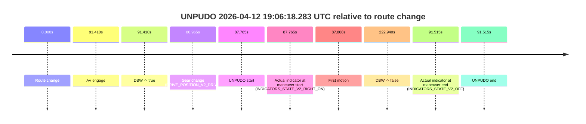
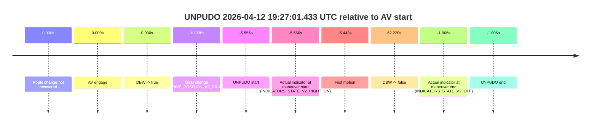
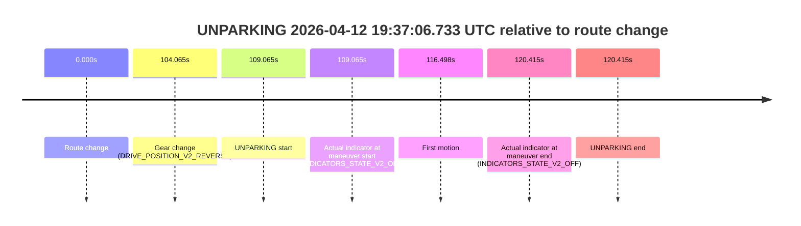

# Run Report: fme20007/2026-04-12--18-52-41--gen2-av-b08479e0-4282-434b-9fbb-356477c6d438

| Field | Value |
|---|---|
| Run ID | `fme20007/2026-04-12--18-52-41--gen2-av-b08479e0-4282-434b-9fbb-356477c6d438` |
| Date | `2026-04-12` |
| Model(s) | `lively-orange-horse` |
| Author | `guy.geva` |
| Event count | `5` |

## unpudo 2026-04-12 19:04:57.583 UTC

| Field | Value |
|---|---|
| Model | `lively-orange-horse` |
| Author | `guy.geva` |
| Run ID | `fme20007/2026-04-12--18-52-41--gen2-av-b08479e0-4282-434b-9fbb-356477c6d438` |
| Date | `2026-04-12` |
| Time (UTC) | `19:04:57.583` |
| Event type | `unpudo` |
| Disengagement type | `failed_to_unpudo` |
| Route change | `found` |
| Console | [run](https://console.sso.wayve.ai/run/fme20007/2026-04-12--18-52-41--gen2-av-b08479e0-4282-434b-9fbb-356477c6d438?id=&time-unixus=1776020697583315) |
| Foxglove | [segment](https://app.foxglove.dev/wayve-on-prem/p/prj_0dX18KZdVHg1fmmI/view?ds=foxglove-stream&ds.deviceName=fme20007&ds.start=2026-04-12T19%3A04%3A40.518297Z&ds.end=2026-04-12T19%3A06%3A27.247690Z&layoutId=lay_0e7VD4WIKDQGU73Y&time=2026-04-12T19%3A04%3A57.583315Z) |

### Event card: accidental

- Accidental: AV ownership is present for less than `2s`, so this is treated as an accidental brush with the maneuver rather than a meaningful model attempt.

| Event | Time (UTC) | Delta from route change |
|---|---:|---:|
| Route change | 2026-04-12 19:04:50.518 | `0.000s` |
| AV engage | 2026-04-12 19:05:03.508 | `12.990s` |
| DBW -> true | 2026-04-12 19:05:03.508 | `12.990s` |
| Gear change (DRIVE_POSITION_V2_DRIVE) | 2026-04-12 19:04:50.783 | `0.265s` |
| UNPUDO start | 2026-04-12 19:04:57.583 | `7.065s` |
| Actual indicator at maneuver start (INDICATORS_STATE_V2_RIGHT_ON) | 2026-04-12 19:04:57.583 | `7.065s` |
| First motion | 2026-04-12 19:04:57.606 | `7.088s` |
| DBW -> false | 2026-04-12 19:06:17.247 | `86.729s` |
| Actual indicator at maneuver end (INDICATORS_STATE_V2_OFF) | 2026-04-12 19:05:01.433 | `10.915s` |
| UNPUDO end | 2026-04-12 19:05:01.433 | `10.915s` |

| Metric | Value |
|---|---|
| Outcome | `accidental` |
| Effective failure type | `none` |
| Route change status | `found` |
| DBW at event start | `false` |
| DBW at event end | `false` |
| Predicted gear at AV start | `DRIVE_POSITION_V2_DRIVE` |
| Actual gear at AV start | `DRIVE_POSITION_V2_DRIVE` |
| Predicted gear at event start | `DRIVE_POSITION_V2_DRIVE` |
| Actual gear at event start | `DRIVE_POSITION_V2_DRIVE` |
| Planned indicator direction | `INDICATORS_STATE_V2_RIGHT_ON` |
| Controller indicator direction | `INDICATORS_STATE_V2_RIGHT_ON` |
| Actual indicator direction | `INDICATORS_STATE_V2_RIGHT_ON` |
| Actual indicator at maneuver end | `INDICATORS_STATE_V2_OFF` |
| Driver accel help in AV | `false` |
| Driver accel help timestamp | `n/a` |
| Max accel pedal pct in AV | `0.0%` |
| Max brake pedal pct in AV | `0.0%` |
| Max speed mps in AV | `0.000` |
| Route -> AV | `12.990s` |
| AV -> event start | `-5.925s` |
| AV -> first motion | `-5.902s` |
| AV duration before disengagement | `73.739s` |
| Trajectory waypoint count | `36` |
| Driving-plan step count | `11` |

The scored portion starts from the AV-owned window, not from the pre-AV setup. Route-change search in the stopped pre-event segment was `found`, with the baseline therefore set to route change. At the event anchor the model predicts `DRIVE_POSITION_V2_DRIVE` and the actual gear is `DRIVE_POSITION_V2_DRIVE`. The effective model outcome is `accidental` because `the AV-owned portion is shorter than 2s`.

### Resolution

| Field | Value |
|---|---|
| Final outcome | `accidental` |
| Do we agree with this label? | `yes` |
| Source disengagement type | `failed_to_unpudo` |
| Resolved effective failure type | `none` |
| Confidence | `high` |

## unpudo 2026-04-12 19:06:18.283 UTC

| Field | Value |
|---|---|
| Model | `lively-orange-horse` |
| Author | `guy.geva` |
| Run ID | `fme20007/2026-04-12--18-52-41--gen2-av-b08479e0-4282-434b-9fbb-356477c6d438` |
| Date | `2026-04-12` |
| Time (UTC) | `19:06:18.283` |
| Event type | `unpudo` |
| Disengagement type | `failed_to_unpudo` |
| Route change | `found` |
| Console | [run](https://console.sso.wayve.ai/run/fme20007/2026-04-12--18-52-41--gen2-av-b08479e0-4282-434b-9fbb-356477c6d438?id=&time-unixus=1776020778283304) |
| Foxglove | [segment](https://app.foxglove.dev/wayve-on-prem/p/prj_0dX18KZdVHg1fmmI/view?ds=foxglove-stream&ds.deviceName=fme20007&ds.start=2026-04-12T19%3A04%3A40.518297Z&ds.end=2026-04-12T19%3A08%3A43.458478Z&layoutId=lay_0e7VD4WIKDQGU73Y&time=2026-04-12T19%3A06%3A18.283304Z) |

### Event card: accidental

- Accidental: AV ownership is present for less than `2s`, so this is treated as an accidental brush with the maneuver rather than a meaningful model attempt.

| Event | Time (UTC) | Delta from route change |
|---|---:|---:|
| Route change | 2026-04-12 19:04:50.518 | `0.000s` |
| AV engage | 2026-04-12 19:06:21.928 | `91.410s` |
| DBW -> true | 2026-04-12 19:06:21.928 | `91.410s` |
| Gear change (DRIVE_POSITION_V2_DRIVE) | 2026-04-12 19:06:11.483 | `80.965s` |
| UNPUDO start | 2026-04-12 19:06:18.283 | `87.765s` |
| Actual indicator at maneuver start (INDICATORS_STATE_V2_RIGHT_ON) | 2026-04-12 19:06:18.283 | `87.765s` |
| First motion | 2026-04-12 19:06:18.325 | `87.808s` |
| DBW -> false | 2026-04-12 19:08:33.458 | `222.940s` |
| Actual indicator at maneuver end (INDICATORS_STATE_V2_OFF) | 2026-04-12 19:06:22.033 | `91.515s` |
| UNPUDO end | 2026-04-12 19:06:22.033 | `91.515s` |

| Metric | Value |
|---|---|
| Outcome | `accidental` |
| Effective failure type | `none` |
| Route change status | `found` |
| DBW at event start | `false` |
| DBW at event end | `true` |
| Predicted gear at AV start | `DRIVE_POSITION_V2_DRIVE` |
| Actual gear at AV start | `DRIVE_POSITION_V2_DRIVE` |
| Predicted gear at event start | `DRIVE_POSITION_V2_DRIVE` |
| Actual gear at event start | `DRIVE_POSITION_V2_DRIVE` |
| Planned indicator direction | `INDICATORS_STATE_V2_RIGHT_ON` |
| Controller indicator direction | `INDICATORS_STATE_V2_RIGHT_ON` |
| Actual indicator direction | `INDICATORS_STATE_V2_RIGHT_ON` |
| Actual indicator at maneuver end | `INDICATORS_STATE_V2_OFF` |
| Driver accel help in AV | `false` |
| Driver accel help timestamp | `n/a` |
| Max accel pedal pct in AV | `0.0%` |
| Max brake pedal pct in AV | `0.0%` |
| Max speed mps in AV | `4.508` |
| Route -> AV | `91.410s` |
| AV -> event start | `-3.645s` |
| AV -> first motion | `-3.602s` |
| AV duration before disengagement | `131.530s` |
| Trajectory waypoint count | `37` |
| Driving-plan step count | `11` |

The scored portion starts from the AV-owned window, not from the pre-AV setup. Route-change search in the stopped pre-event segment was `found`, with the baseline therefore set to route change. At the event anchor the model predicts `DRIVE_POSITION_V2_DRIVE` and the actual gear is `DRIVE_POSITION_V2_DRIVE`. The effective model outcome is `accidental` because `the AV-owned portion is shorter than 2s`.

### Resolution

| Field | Value |
|---|---|
| Final outcome | `accidental` |
| Do we agree with this label? | `yes` |
| Source disengagement type | `failed_to_unpudo` |
| Resolved effective failure type | `none` |
| Confidence | `high` |

## unpudo 2026-04-12 19:12:51.983 UTC

| Field | Value |
|---|---|
| Model | `lively-orange-horse` |
| Author | `guy.geva` |
| Run ID | `fme20007/2026-04-12--18-52-41--gen2-av-b08479e0-4282-434b-9fbb-356477c6d438` |
| Date | `2026-04-12` |
| Time (UTC) | `19:12:51.983` |
| Event type | `unpudo` |
| Disengagement type | `failed_to_unpudo` |
| Route change | `found` |
| Console | [run](https://console.sso.wayve.ai/run/fme20007/2026-04-12--18-52-41--gen2-av-b08479e0-4282-434b-9fbb-356477c6d438?id=&time-unixus=1776021171983315) |
| Foxglove | [segment](https://app.foxglove.dev/wayve-on-prem/p/prj_0dX18KZdVHg1fmmI/view?ds=foxglove-stream&ds.deviceName=fme20007&ds.start=2026-04-12T19%3A11%3A17.218547Z&ds.end=2026-04-12T19%3A16%3A10.128331Z&layoutId=lay_0e7VD4WIKDQGU73Y&time=2026-04-12T19%3A12%3A51.983315Z) |

### Event card: accidental

- Accidental: AV ownership is present for less than `2s`, so this is treated as an accidental brush with the maneuver rather than a meaningful model attempt.

| Event | Time (UTC) | Delta from route change |
|---|---:|---:|
| Route change | 2026-04-12 19:11:27.218 | `0.000s` |
| AV engage | 2026-04-12 19:12:58.929 | `91.711s` |
| DBW -> true | 2026-04-12 19:12:58.929 | `91.711s` |
| Gear change (DRIVE_POSITION_V2_DRIVE) | 2026-04-12 19:12:45.283 | `78.065s` |
| UNPUDO start | 2026-04-12 19:12:51.983 | `84.765s` |
| Actual indicator at maneuver start (INDICATORS_STATE_V2_RIGHT_ON) | 2026-04-12 19:12:51.983 | `84.765s` |
| First motion | 2026-04-12 19:12:52.145 | `84.927s` |
| DBW -> false | 2026-04-12 19:16:00.128 | `272.910s` |
| Actual indicator at maneuver end (INDICATORS_STATE_V2_OFF) | 2026-04-12 19:12:58.333 | `91.115s` |
| UNPUDO end | 2026-04-12 19:12:58.333 | `91.115s` |

| Metric | Value |
|---|---|
| Outcome | `accidental` |
| Effective failure type | `none` |
| Route change status | `found` |
| DBW at event start | `false` |
| DBW at event end | `false` |
| Predicted gear at AV start | `DRIVE_POSITION_V2_DRIVE` |
| Actual gear at AV start | `DRIVE_POSITION_V2_DRIVE` |
| Predicted gear at event start | `DRIVE_POSITION_V2_DRIVE` |
| Actual gear at event start | `DRIVE_POSITION_V2_DRIVE` |
| Planned indicator direction | `INDICATORS_STATE_V2_RIGHT_ON` |
| Controller indicator direction | `INDICATORS_STATE_V2_RIGHT_ON` |
| Actual indicator direction | `INDICATORS_STATE_V2_RIGHT_ON` |
| Actual indicator at maneuver end | `INDICATORS_STATE_V2_OFF` |
| Driver accel help in AV | `false` |
| Driver accel help timestamp | `n/a` |
| Max accel pedal pct in AV | `0.0%` |
| Max brake pedal pct in AV | `0.0%` |
| Max speed mps in AV | `0.000` |
| Route -> AV | `91.711s` |
| AV -> event start | `-6.946s` |
| AV -> first motion | `-6.783s` |
| AV duration before disengagement | `181.199s` |
| Trajectory waypoint count | `37` |
| Driving-plan step count | `11` |

The scored portion starts from the AV-owned window, not from the pre-AV setup. Route-change search in the stopped pre-event segment was `found`, with the baseline therefore set to route change. At the event anchor the model predicts `DRIVE_POSITION_V2_DRIVE` and the actual gear is `DRIVE_POSITION_V2_DRIVE`. The effective model outcome is `accidental` because `the AV-owned portion is shorter than 2s`.

### Resolution

| Field | Value |
|---|---|
| Final outcome | `accidental` |
| Do we agree with this label? | `yes` |
| Source disengagement type | `failed_to_unpudo` |
| Resolved effective failure type | `none` |
| Confidence | `high` |

## unpudo 2026-04-12 19:27:01.433 UTC

| Field | Value |
|---|---|
| Model | `lively-orange-horse` |
| Author | `guy.geva` |
| Run ID | `fme20007/2026-04-12--18-52-41--gen2-av-b08479e0-4282-434b-9fbb-356477c6d438` |
| Date | `2026-04-12` |
| Time (UTC) | `19:27:01.433` |
| Event type | `unpudo` |
| Disengagement type | `failed_to_unpudo` |
| Route change | `not found` |
| Console | [run](https://console.sso.wayve.ai/run/fme20007/2026-04-12--18-52-41--gen2-av-b08479e0-4282-434b-9fbb-356477c6d438?id=&time-unixus=1776022021433313) |
| Foxglove | [segment](https://app.foxglove.dev/wayve-on-prem/p/prj_0dX18KZdVHg1fmmI/view?ds=foxglove-stream&ds.deviceName=fme20007&ds.start=2026-04-12T19%3A26%3A46.783315Z&ds.end=2026-04-12T19%3A28%3A19.209499Z&layoutId=lay_0e7VD4WIKDQGU73Y&time=2026-04-12T19%3A27%3A01.433313Z) |

### Event card: accidental

- Accidental: AV ownership is present for less than `2s`, so this is treated as an accidental brush with the maneuver rather than a meaningful model attempt.

| Event | Time (UTC) | Delta from AV start |
|---|---:|---:|
| Route change not recovered | 2026-04-12 19:27:06.989 | `0.000s` |
| AV engage | 2026-04-12 19:27:06.989 | `0.000s` |
| DBW -> true | 2026-04-12 19:27:06.989 | `0.000s` |
| Gear change (DRIVE_POSITION_V2_DRIVE) | 2026-04-12 19:26:56.783 | `-10.206s` |
| UNPUDO start | 2026-04-12 19:27:01.433 | `-5.556s` |
| Actual indicator at maneuver start (INDICATORS_STATE_V2_RIGHT_ON) | 2026-04-12 19:27:01.433 | `-5.556s` |
| First motion | 2026-04-12 19:27:01.546 | `-5.443s` |
| DBW -> false | 2026-04-12 19:28:09.209 | `62.220s` |
| Actual indicator at maneuver end (INDICATORS_STATE_V2_OFF) | 2026-04-12 19:27:05.983 | `-1.006s` |
| UNPUDO end | 2026-04-12 19:27:05.983 | `-1.006s` |

| Metric | Value |
|---|---|
| Outcome | `accidental` |
| Effective failure type | `none` |
| Route change status | `not found` |
| DBW at event start | `false` |
| DBW at event end | `false` |
| Predicted gear at AV start | `DRIVE_POSITION_V2_DRIVE` |
| Actual gear at AV start | `DRIVE_POSITION_V2_DRIVE` |
| Predicted gear at event start | `DRIVE_POSITION_V2_DRIVE` |
| Actual gear at event start | `DRIVE_POSITION_V2_DRIVE` |
| Planned indicator direction | `INDICATORS_STATE_V2_RIGHT_ON` |
| Controller indicator direction | `INDICATORS_STATE_V2_RIGHT_ON` |
| Actual indicator direction | `INDICATORS_STATE_V2_RIGHT_ON` |
| Actual indicator at maneuver end | `INDICATORS_STATE_V2_OFF` |
| Driver accel help in AV | `false` |
| Driver accel help timestamp | `n/a` |
| Max accel pedal pct in AV | `0.0%` |
| Max brake pedal pct in AV | `0.0%` |
| Max speed mps in AV | `0.000` |
| Route -> AV | `n/a` |
| AV -> event start | `-5.556s` |
| AV -> first motion | `-5.443s` |
| AV duration before disengagement | `62.220s` |
| Trajectory waypoint count | `36` |
| Driving-plan step count | `11` |

The scored portion starts from the AV-owned window, not from the pre-AV setup. Route-change search in the stopped pre-event segment was `not found`, with the baseline therefore set to AV start. At the event anchor the model predicts `DRIVE_POSITION_V2_DRIVE` and the actual gear is `DRIVE_POSITION_V2_DRIVE`. The effective model outcome is `accidental` because `the AV-owned portion is shorter than 2s`.

### Resolution

| Field | Value |
|---|---|
| Final outcome | `accidental` |
| Do we agree with this label? | `yes` |
| Source disengagement type | `failed_to_unpudo` |
| Resolved effective failure type | `none` |
| Confidence | `high` |

## unparking 2026-04-12 19:37:06.733 UTC

| Field | Value |
|---|---|
| Model | `lively-orange-horse` |
| Author | `guy.geva` |
| Run ID | `fme20007/2026-04-12--18-52-41--gen2-av-b08479e0-4282-434b-9fbb-356477c6d438` |
| Date | `2026-04-12` |
| Time (UTC) | `19:37:06.733` |
| Event type | `unparking` |
| Disengagement type | `none observed` |
| Route change | `found` |
| Console | [run](https://console.sso.wayve.ai/run/fme20007/2026-04-12--18-52-41--gen2-av-b08479e0-4282-434b-9fbb-356477c6d438?id=&time-unixus=1776022626733310) |
| Foxglove | [segment](https://app.foxglove.dev/wayve-on-prem/p/prj_0dX18KZdVHg1fmmI/view?ds=foxglove-stream&ds.deviceName=fme20007&ds.start=2026-04-12T19%3A35%3A07.668349Z&ds.end=2026-04-12T19%3A37%3A28.083304Z&layoutId=lay_0e7VD4WIKDQGU73Y&time=2026-04-12T19%3A37%3A06.733310Z) |

### Event card: non-av

- Non-AV: the detected unparking starts outside AV ownership, so it is kept for coverage but excluded from model success / failure scoring.

| Event | Time (UTC) | Delta from route change |
|---|---:|---:|
| Route change | 2026-04-12 19:35:17.668 | `0.000s` |
| Gear change (DRIVE_POSITION_V2_REVERSE) | 2026-04-12 19:37:01.733 | `104.065s` |
| UNPARKING start | 2026-04-12 19:37:06.733 | `109.065s` |
| Actual indicator at maneuver start (INDICATORS_STATE_V2_OFF) | 2026-04-12 19:37:06.733 | `109.065s` |
| First motion | 2026-04-12 19:37:14.166 | `116.498s` |
| Actual indicator at maneuver end (INDICATORS_STATE_V2_OFF) | 2026-04-12 19:37:18.083 | `120.415s` |
| UNPARKING end | 2026-04-12 19:37:18.083 | `120.415s` |

| Metric | Value |
|---|---|
| Outcome | `non-av` |
| Effective failure type | `none` |
| Route change status | `found` |
| DBW at event start | `false` |
| DBW at event end | `false` |
| Predicted gear at AV start | `n/a` |
| Actual gear at AV start | `n/a` |
| Predicted gear at event start | `DRIVE_POSITION_V2_DRIVE` |
| Actual gear at event start | `DRIVE_POSITION_V2_REVERSE` |
| Planned indicator direction | `INDICATORS_STATE_V2_LEFT_ON` |
| Controller indicator direction | `INDICATORS_STATE_V2_LEFT_ON` |
| Actual indicator direction | `INDICATORS_STATE_V2_OFF` |
| Actual indicator at maneuver end | `INDICATORS_STATE_V2_OFF` |
| Driver accel help in AV | `false` |
| Driver accel help timestamp | `n/a` |
| Max accel pedal pct in AV | `0.0%` |
| Max brake pedal pct in AV | `0.0%` |
| Max speed mps in AV | `0.000` |
| Route -> AV | `n/a` |
| AV -> event start | `n/a` |
| AV -> first motion | `n/a` |
| AV duration before disengagement | `n/a` |
| Trajectory waypoint count | `36` |
| Driving-plan step count | `11` |

The scored portion starts from the AV-owned window, not from the pre-AV setup. Route-change search in the stopped pre-event segment was `found`, with the baseline therefore set to route change. At the event anchor the model predicts `DRIVE_POSITION_V2_DRIVE` and the actual gear is `DRIVE_POSITION_V2_REVERSE`. The effective model outcome is `non-av` because `the event does not begin in AV ownership`.

### Resolution

| Field | Value |
|---|---|
| Final outcome | `non-av` |
| Do we agree with this label? | `yes` |
| Source disengagement type | `none observed` |
| Resolved effective failure type | `none` |
| Confidence | `high` |
