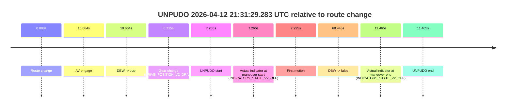
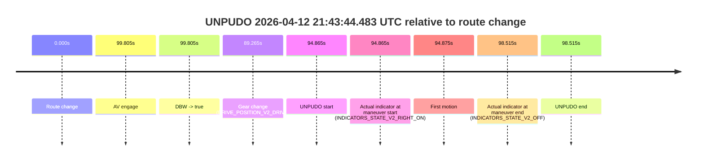

# Run Report: fme20007/2026-04-12--20-59-39--gen2-av-5c854a9a-eeff-486e-8ec7-71a981a5afd1

| Field | Value |
|---|---|
| Run ID | `fme20007/2026-04-12--20-59-39--gen2-av-5c854a9a-eeff-486e-8ec7-71a981a5afd1` |
| Date | `2026-04-12` |
| Model(s) | `lively-orange-horse` |
| Author | `guy.geva` |
| Event count | `2` |

## unpudo 2026-04-12 21:31:29.283 UTC

| Field | Value |
|---|---|
| Model | `lively-orange-horse` |
| Author | `guy.geva` |
| Run ID | `fme20007/2026-04-12--20-59-39--gen2-av-5c854a9a-eeff-486e-8ec7-71a981a5afd1` |
| Date | `2026-04-12` |
| Time (UTC) | `21:31:29.283` |
| Event type | `unpudo` |
| Disengagement type | `failed_to_unpudo` |
| Route change | `found` |
| Console | [run](https://console.sso.wayve.ai/run/fme20007/2026-04-12--20-59-39--gen2-av-5c854a9a-eeff-486e-8ec7-71a981a5afd1?id=&time-unixus=1776029489283309) |
| Foxglove | [segment](https://app.foxglove.dev/wayve-on-prem/p/prj_0dX18KZdVHg1fmmI/view?ds=foxglove-stream&ds.deviceName=fme20007&ds.start=2026-04-12T21%3A31%3A12.018276Z&ds.end=2026-04-12T21%3A32%3A40.463270Z&layoutId=lay_0e7VD4WIKDQGU73Y&time=2026-04-12T21%3A31%3A29.283309Z) |

### Event card: fail

- Fail: AV owns part of the segment, but the event still resolves as a model-performance failure under the AV-only scoring rule.

| Event | Time (UTC) | Delta from route change |
|---|---:|---:|
| Route change | 2026-04-12 21:31:22.018 | `0.000s` |
| AV engage | 2026-04-12 21:31:32.682 | `10.664s` |
| DBW -> true | 2026-04-12 21:31:32.682 | `10.664s` |
| Gear change (DRIVE_POSITION_V2_DRIVE) | 2026-04-12 21:31:22.733 | `0.715s` |
| UNPUDO start | 2026-04-12 21:31:29.283 | `7.265s` |
| Actual indicator at maneuver start (INDICATORS_STATE_V2_OFF) | 2026-04-12 21:31:29.283 | `7.265s` |
| First motion | 2026-04-12 21:31:29.313 | `7.295s` |
| DBW -> false | 2026-04-12 21:32:30.463 | `68.445s` |
| Actual indicator at maneuver end (INDICATORS_STATE_V2_OFF) | 2026-04-12 21:31:33.483 | `11.465s` |
| UNPUDO end | 2026-04-12 21:31:33.483 | `11.465s` |

| Metric | Value |
|---|---|
| Outcome | `fail` |
| Effective failure type | `failed_to_unpudo` |
| Route change status | `found` |
| DBW at event start | `false` |
| DBW at event end | `true` |
| Predicted gear at AV start | `DRIVE_POSITION_V2_DRIVE` |
| Actual gear at AV start | `DRIVE_POSITION_V2_DRIVE` |
| Predicted gear at event start | `DRIVE_POSITION_V2_DRIVE` |
| Actual gear at event start | `DRIVE_POSITION_V2_DRIVE` |
| Planned indicator direction | `INDICATORS_STATE_V2_OFF` |
| Controller indicator direction | `INDICATORS_STATE_V2_OFF` |
| Actual indicator direction | `INDICATORS_STATE_V2_OFF` |
| Actual indicator at maneuver end | `INDICATORS_STATE_V2_OFF` |
| Driver accel help in AV | `false` |
| Driver accel help timestamp | `n/a` |
| Max accel pedal pct in AV | `0.0%` |
| Max brake pedal pct in AV | `0.0%` |
| Max speed mps in AV | `4.083` |
| Route -> AV | `10.664s` |
| AV -> event start | `-3.399s` |
| AV -> first motion | `-3.369s` |
| AV duration before disengagement | `57.781s` |
| Trajectory waypoint count | `37` |
| Driving-plan step count | `11` |

The scored portion starts from the AV-owned window, not from the pre-AV setup. Route-change search in the stopped pre-event segment was `found`, with the baseline therefore set to route change. At the event anchor the model predicts `DRIVE_POSITION_V2_DRIVE` and the actual gear is `DRIVE_POSITION_V2_DRIVE`. The effective model outcome is `fail` because `failed_to_unpudo`.

### Resolution

| Field | Value |
|---|---|
| Final outcome | `fail` |
| Do we agree with this label? | `yes` |
| Source disengagement type | `failed_to_unpudo` |
| Resolved effective failure type | `failed_to_unpudo` |
| Confidence | `high` |

## unpudo 2026-04-12 21:43:44.483 UTC

| Field | Value |
|---|---|
| Model | `lively-orange-horse` |
| Author | `guy.geva` |
| Run ID | `fme20007/2026-04-12--20-59-39--gen2-av-5c854a9a-eeff-486e-8ec7-71a981a5afd1` |
| Date | `2026-04-12` |
| Time (UTC) | `21:43:44.483` |
| Event type | `unpudo` |
| Disengagement type | `failed_to_unpudo` |
| Route change | `found` |
| Console | [run](https://console.sso.wayve.ai/run/fme20007/2026-04-12--20-59-39--gen2-av-5c854a9a-eeff-486e-8ec7-71a981a5afd1?id=&time-unixus=1776030224483309) |
| Foxglove | [segment](https://app.foxglove.dev/wayve-on-prem/p/prj_0dX18KZdVHg1fmmI/view?ds=foxglove-stream&ds.deviceName=fme20007&ds.start=2026-04-12T21%3A41%3A59.618498Z&ds.end=2026-04-12T21%3A43%3A58.133313Z&layoutId=lay_0e7VD4WIKDQGU73Y&time=2026-04-12T21%3A43%3A44.483309Z) |

### Event card: fail

- Fail: AV owns part of the segment, but the event still resolves as a model-performance failure under the AV-only scoring rule.

| Event | Time (UTC) | Delta from route change |
|---|---:|---:|
| Route change | 2026-04-12 21:42:09.618 | `0.000s` |
| AV engage | 2026-04-12 21:43:49.423 | `99.805s` |
| DBW -> true | 2026-04-12 21:43:49.423 | `99.805s` |
| Gear change (DRIVE_POSITION_V2_DRIVE) | 2026-04-12 21:43:38.883 | `89.265s` |
| UNPUDO start | 2026-04-12 21:43:44.483 | `94.865s` |
| Actual indicator at maneuver start (INDICATORS_STATE_V2_RIGHT_ON) | 2026-04-12 21:43:44.483 | `94.865s` |
| First motion | 2026-04-12 21:43:44.493 | `94.875s` |
| Actual indicator at maneuver end (INDICATORS_STATE_V2_OFF) | 2026-04-12 21:43:48.133 | `98.515s` |
| UNPUDO end | 2026-04-12 21:43:48.133 | `98.515s` |

| Metric | Value |
|---|---|
| Outcome | `fail` |
| Effective failure type | `failed_to_unpudo` |
| Route change status | `found` |
| DBW at event start | `false` |
| DBW at event end | `false` |
| Predicted gear at AV start | `DRIVE_POSITION_V2_DRIVE` |
| Actual gear at AV start | `DRIVE_POSITION_V2_DRIVE` |
| Predicted gear at event start | `DRIVE_POSITION_V2_DRIVE` |
| Actual gear at event start | `DRIVE_POSITION_V2_DRIVE` |
| Planned indicator direction | `INDICATORS_STATE_V2_RIGHT_ON` |
| Controller indicator direction | `INDICATORS_STATE_V2_RIGHT_ON` |
| Actual indicator direction | `INDICATORS_STATE_V2_RIGHT_ON` |
| Actual indicator at maneuver end | `INDICATORS_STATE_V2_OFF` |
| Driver accel help in AV | `false` |
| Driver accel help timestamp | `n/a` |
| Max accel pedal pct in AV | `0.0%` |
| Max brake pedal pct in AV | `0.0%` |
| Max speed mps in AV | `0.000` |
| Route -> AV | `99.805s` |
| AV -> event start | `-4.940s` |
| AV -> first motion | `-4.930s` |
| AV duration before disengagement | `n/a` |
| Trajectory waypoint count | `37` |
| Driving-plan step count | `11` |

The scored portion starts from the AV-owned window, not from the pre-AV setup. Route-change search in the stopped pre-event segment was `found`, with the baseline therefore set to route change. At the event anchor the model predicts `DRIVE_POSITION_V2_DRIVE` and the actual gear is `DRIVE_POSITION_V2_DRIVE`. The effective model outcome is `fail` because `failed_to_unpudo`.

### Resolution

| Field | Value |
|---|---|
| Final outcome | `fail` |
| Do we agree with this label? | `yes` |
| Source disengagement type | `failed_to_unpudo` |
| Resolved effective failure type | `failed_to_unpudo` |
| Confidence | `high` |
