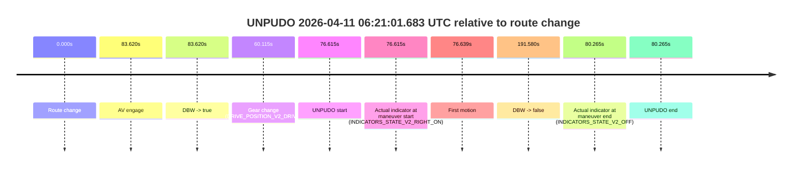
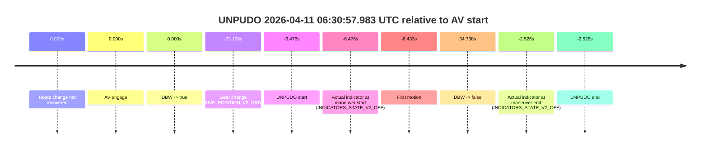
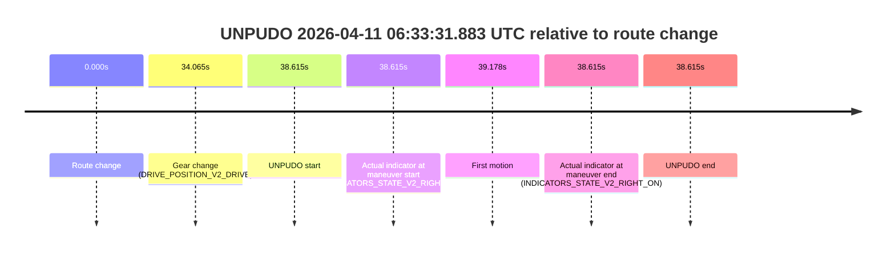
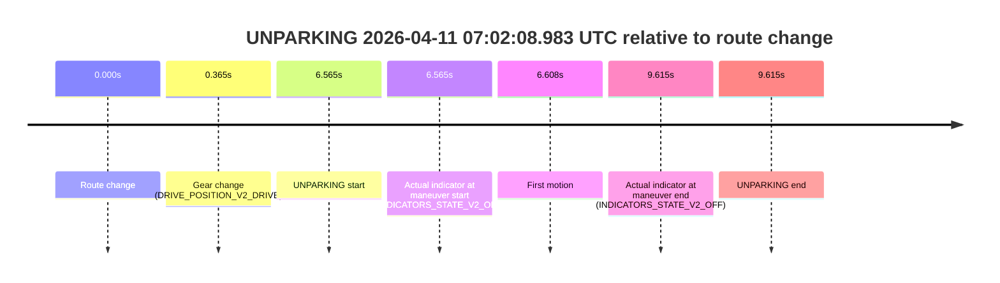

# Run Report: fme20018/2026-04-11--05-58-49--gen2-av-190f8db8-f5f7-4ada-9148-5f193535130a

| Field | Value |
|---|---|
| Run ID | `fme20018/2026-04-11--05-58-49--gen2-av-190f8db8-f5f7-4ada-9148-5f193535130a` |
| Date | `2026-04-11` |
| Model(s) | `lively-orange-horse` |
| Author | `guy.geva` |
| Event count | `11` |

## unpudo 2026-04-11 06:07:30.083 UTC

| Field | Value |
|---|---|
| Model | `lively-orange-horse` |
| Author | `guy.geva` |
| Run ID | `fme20018/2026-04-11--05-58-49--gen2-av-190f8db8-f5f7-4ada-9148-5f193535130a` |
| Date | `2026-04-11` |
| Time (UTC) | `06:07:30.083` |
| Event type | `unpudo` |
| Disengagement type | `failed_to_unpudo` |
| Route change | `found` |
| Console | [run](https://console.sso.wayve.ai/run/fme20018/2026-04-11--05-58-49--gen2-av-190f8db8-f5f7-4ada-9148-5f193535130a?id=&time-unixus=1775887650083300) |
| Foxglove | [segment](https://app.foxglove.dev/wayve-on-prem/p/prj_0dX18KZdVHg1fmmI/view?ds=foxglove-stream&ds.deviceName=fme20018&ds.start=2026-04-11T06%3A06%3A53.118643Z&ds.end=2026-04-11T06%3A08%3A23.148181Z&layoutId=lay_0e7VD4WIKDQGU73Y&time=2026-04-11T06%3A07%3A30.083300Z) |

### Event card: accidental

- Accidental: AV ownership is present for less than `2s`, so this is treated as an accidental brush with the maneuver rather than a meaningful model attempt.

| Event | Time (UTC) | Delta from route change |
|---|---:|---:|
| Route change | 2026-04-11 06:07:03.118 | `0.000s` |
| AV engage | 2026-04-11 06:07:41.729 | `38.611s` |
| DBW -> true | 2026-04-11 06:07:41.729 | `38.611s` |
| Gear change (DRIVE_POSITION_V2_DRIVE) | 2026-04-11 06:07:12.483 | `9.365s` |
| UNPUDO start | 2026-04-11 06:07:30.083 | `26.965s` |
| Actual indicator at maneuver start (INDICATORS_STATE_V2_RIGHT_ON) | 2026-04-11 06:07:30.083 | `26.965s` |
| First motion | 2026-04-11 06:07:30.106 | `26.988s` |
| DBW -> false | 2026-04-11 06:08:13.148 | `70.030s` |
| Actual indicator at maneuver end (INDICATORS_STATE_V2_OFF) | 2026-04-11 06:07:36.033 | `32.915s` |
| UNPUDO end | 2026-04-11 06:07:36.033 | `32.915s` |

| Metric | Value |
|---|---|
| Outcome | `accidental` |
| Effective failure type | `none` |
| Route change status | `found` |
| DBW at event start | `false` |
| DBW at event end | `false` |
| Predicted gear at AV start | `DRIVE_POSITION_V2_DRIVE` |
| Actual gear at AV start | `DRIVE_POSITION_V2_DRIVE` |
| Predicted gear at event start | `DRIVE_POSITION_V2_DRIVE` |
| Actual gear at event start | `DRIVE_POSITION_V2_DRIVE` |
| Planned indicator direction | `INDICATORS_STATE_V2_RIGHT_ON` |
| Controller indicator direction | `INDICATORS_STATE_V2_RIGHT_ON` |
| Actual indicator direction | `INDICATORS_STATE_V2_RIGHT_ON` |
| Actual indicator at maneuver end | `INDICATORS_STATE_V2_OFF` |
| Driver accel help in AV | `false` |
| Driver accel help timestamp | `n/a` |
| Max accel pedal pct in AV | `0.0%` |
| Max brake pedal pct in AV | `0.0%` |
| Max speed mps in AV | `0.000` |
| Route -> AV | `38.611s` |
| AV -> event start | `-11.646s` |
| AV -> first motion | `-11.623s` |
| AV duration before disengagement | `31.419s` |
| Trajectory waypoint count | `37` |
| Driving-plan step count | `11` |

The scored portion starts from the AV-owned window, not from the pre-AV setup. Route-change search in the stopped pre-event segment was `found`, with the baseline therefore set to route change. At the event anchor the model predicts `DRIVE_POSITION_V2_DRIVE` and the actual gear is `DRIVE_POSITION_V2_DRIVE`. The effective model outcome is `accidental` because `the AV-owned portion is shorter than 2s`.

### Resolution

| Field | Value |
|---|---|
| Final outcome | `accidental` |
| Do we agree with this label? | `yes` |
| Source disengagement type | `failed_to_unpudo` |
| Resolved effective failure type | `none` |
| Confidence | `high` |

## unpudo 2026-04-11 06:14:01.533 UTC

| Field | Value |
|---|---|
| Model | `lively-orange-horse` |
| Author | `guy.geva` |
| Run ID | `fme20018/2026-04-11--05-58-49--gen2-av-190f8db8-f5f7-4ada-9148-5f193535130a` |
| Date | `2026-04-11` |
| Time (UTC) | `06:14:01.533` |
| Event type | `unpudo` |
| Disengagement type | `failed_to_unpudo` |
| Route change | `found` |
| Console | [run](https://console.sso.wayve.ai/run/fme20018/2026-04-11--05-58-49--gen2-av-190f8db8-f5f7-4ada-9148-5f193535130a?id=&time-unixus=1775888041533313) |
| Foxglove | [segment](https://app.foxglove.dev/wayve-on-prem/p/prj_0dX18KZdVHg1fmmI/view?ds=foxglove-stream&ds.deviceName=fme20018&ds.start=2026-04-11T06%3A13%3A13.868305Z&ds.end=2026-04-11T06%3A14%3A47.388226Z&layoutId=lay_0e7VD4WIKDQGU73Y&time=2026-04-11T06%3A14%3A01.533313Z) |

### Event card: accidental

- Accidental: AV ownership is present for less than `2s`, so this is treated as an accidental brush with the maneuver rather than a meaningful model attempt.

| Event | Time (UTC) | Delta from route change |
|---|---:|---:|
| Route change | 2026-04-11 06:13:23.868 | `0.000s` |
| AV engage | 2026-04-11 06:14:08.529 | `44.661s` |
| DBW -> true | 2026-04-11 06:14:08.529 | `44.661s` |
| Gear change (DRIVE_POSITION_V2_DRIVE) | 2026-04-11 06:13:47.183 | `23.315s` |
| UNPUDO start | 2026-04-11 06:14:01.533 | `37.665s` |
| Actual indicator at maneuver start (INDICATORS_STATE_V2_OFF) | 2026-04-11 06:14:01.533 | `37.665s` |
| First motion | 2026-04-11 06:14:01.586 | `37.718s` |
| DBW -> false | 2026-04-11 06:14:37.388 | `73.520s` |
| Actual indicator at maneuver end (INDICATORS_STATE_V2_OFF) | 2026-04-11 06:14:06.683 | `42.815s` |
| UNPUDO end | 2026-04-11 06:14:06.683 | `42.815s` |

| Metric | Value |
|---|---|
| Outcome | `accidental` |
| Effective failure type | `none` |
| Route change status | `found` |
| DBW at event start | `false` |
| DBW at event end | `false` |
| Predicted gear at AV start | `DRIVE_POSITION_V2_DRIVE` |
| Actual gear at AV start | `DRIVE_POSITION_V2_DRIVE` |
| Predicted gear at event start | `DRIVE_POSITION_V2_DRIVE` |
| Actual gear at event start | `DRIVE_POSITION_V2_DRIVE` |
| Planned indicator direction | `INDICATORS_STATE_V2_LEFT_ON` |
| Controller indicator direction | `INDICATORS_STATE_V2_LEFT_ON` |
| Actual indicator direction | `INDICATORS_STATE_V2_OFF` |
| Actual indicator at maneuver end | `INDICATORS_STATE_V2_OFF` |
| Driver accel help in AV | `false` |
| Driver accel help timestamp | `n/a` |
| Max accel pedal pct in AV | `0.0%` |
| Max brake pedal pct in AV | `0.0%` |
| Max speed mps in AV | `0.000` |
| Route -> AV | `44.661s` |
| AV -> event start | `-6.996s` |
| AV -> first motion | `-6.943s` |
| AV duration before disengagement | `28.859s` |
| Trajectory waypoint count | `37` |
| Driving-plan step count | `11` |

The scored portion starts from the AV-owned window, not from the pre-AV setup. Route-change search in the stopped pre-event segment was `found`, with the baseline therefore set to route change. At the event anchor the model predicts `DRIVE_POSITION_V2_DRIVE` and the actual gear is `DRIVE_POSITION_V2_DRIVE`. The effective model outcome is `accidental` because `the AV-owned portion is shorter than 2s`.

### Resolution

| Field | Value |
|---|---|
| Final outcome | `accidental` |
| Do we agree with this label? | `yes` |
| Source disengagement type | `failed_to_unpudo` |
| Resolved effective failure type | `none` |
| Confidence | `high` |

## unpudo 2026-04-11 06:20:06.483 UTC

| Field | Value |
|---|---|
| Model | `lively-orange-horse` |
| Author | `guy.geva` |
| Run ID | `fme20018/2026-04-11--05-58-49--gen2-av-190f8db8-f5f7-4ada-9148-5f193535130a` |
| Date | `2026-04-11` |
| Time (UTC) | `06:20:06.483` |
| Event type | `unpudo` |
| Disengagement type | `failed_to_unpudo` |
| Route change | `found` |
| Console | [run](https://console.sso.wayve.ai/run/fme20018/2026-04-11--05-58-49--gen2-av-190f8db8-f5f7-4ada-9148-5f193535130a?id=&time-unixus=1775888406483297) |
| Foxglove | [segment](https://app.foxglove.dev/wayve-on-prem/p/prj_0dX18KZdVHg1fmmI/view?ds=foxglove-stream&ds.deviceName=fme20018&ds.start=2026-04-11T06%3A19%3A35.068244Z&ds.end=2026-04-11T06%3A21%3A11.208273Z&layoutId=lay_0e7VD4WIKDQGU73Y&time=2026-04-11T06%3A20%3A06.483297Z) |

### Event card: accidental

- Accidental: AV ownership is present for less than `2s`, so this is treated as an accidental brush with the maneuver rather than a meaningful model attempt.

| Event | Time (UTC) | Delta from route change |
|---|---:|---:|
| Route change | 2026-04-11 06:19:45.068 | `0.000s` |
| AV engage | 2026-04-11 06:20:16.198 | `31.130s` |
| DBW -> true | 2026-04-11 06:20:16.198 | `31.130s` |
| Gear change (DRIVE_POSITION_V2_DRIVE) | 2026-04-11 06:20:01.783 | `16.715s` |
| UNPUDO start | 2026-04-11 06:20:06.483 | `21.415s` |
| Actual indicator at maneuver start (INDICATORS_STATE_V2_RIGHT_ON) | 2026-04-11 06:20:06.483 | `21.415s` |
| First motion | 2026-04-11 06:20:06.506 | `21.439s` |
| DBW -> false | 2026-04-11 06:21:01.208 | `76.140s` |
| Actual indicator at maneuver end (INDICATORS_STATE_V2_OFF) | 2026-04-11 06:20:10.233 | `25.165s` |
| UNPUDO end | 2026-04-11 06:20:10.233 | `25.165s` |

| Metric | Value |
|---|---|
| Outcome | `accidental` |
| Effective failure type | `none` |
| Route change status | `found` |
| DBW at event start | `false` |
| DBW at event end | `false` |
| Predicted gear at AV start | `DRIVE_POSITION_V2_DRIVE` |
| Actual gear at AV start | `DRIVE_POSITION_V2_DRIVE` |
| Predicted gear at event start | `DRIVE_POSITION_V2_DRIVE` |
| Actual gear at event start | `DRIVE_POSITION_V2_DRIVE` |
| Planned indicator direction | `INDICATORS_STATE_V2_RIGHT_ON` |
| Controller indicator direction | `INDICATORS_STATE_V2_RIGHT_ON` |
| Actual indicator direction | `INDICATORS_STATE_V2_RIGHT_ON` |
| Actual indicator at maneuver end | `INDICATORS_STATE_V2_OFF` |
| Driver accel help in AV | `false` |
| Driver accel help timestamp | `n/a` |
| Max accel pedal pct in AV | `0.0%` |
| Max brake pedal pct in AV | `0.0%` |
| Max speed mps in AV | `0.000` |
| Route -> AV | `31.130s` |
| AV -> event start | `-9.715s` |
| AV -> first motion | `-9.691s` |
| AV duration before disengagement | `45.010s` |
| Trajectory waypoint count | `36` |
| Driving-plan step count | `11` |

The scored portion starts from the AV-owned window, not from the pre-AV setup. Route-change search in the stopped pre-event segment was `found`, with the baseline therefore set to route change. At the event anchor the model predicts `DRIVE_POSITION_V2_DRIVE` and the actual gear is `DRIVE_POSITION_V2_DRIVE`. The effective model outcome is `accidental` because `the AV-owned portion is shorter than 2s`.

### Resolution

| Field | Value |
|---|---|
| Final outcome | `accidental` |
| Do we agree with this label? | `yes` |
| Source disengagement type | `failed_to_unpudo` |
| Resolved effective failure type | `none` |
| Confidence | `high` |

## unpudo 2026-04-11 06:21:01.683 UTC

| Field | Value |
|---|---|
| Model | `lively-orange-horse` |
| Author | `guy.geva` |
| Run ID | `fme20018/2026-04-11--05-58-49--gen2-av-190f8db8-f5f7-4ada-9148-5f193535130a` |
| Date | `2026-04-11` |
| Time (UTC) | `06:21:01.683` |
| Event type | `unpudo` |
| Disengagement type | `failed_to_unpudo` |
| Route change | `found` |
| Console | [run](https://console.sso.wayve.ai/run/fme20018/2026-04-11--05-58-49--gen2-av-190f8db8-f5f7-4ada-9148-5f193535130a?id=&time-unixus=1775888461683309) |
| Foxglove | [segment](https://app.foxglove.dev/wayve-on-prem/p/prj_0dX18KZdVHg1fmmI/view?ds=foxglove-stream&ds.deviceName=fme20018&ds.start=2026-04-11T06%3A19%3A35.068244Z&ds.end=2026-04-11T06%3A23%3A06.648320Z&layoutId=lay_0e7VD4WIKDQGU73Y&time=2026-04-11T06%3A21%3A01.683309Z) |

### Event card: accidental

- Accidental: AV ownership is present for less than `2s`, so this is treated as an accidental brush with the maneuver rather than a meaningful model attempt.

| Event | Time (UTC) | Delta from route change |
|---|---:|---:|
| Route change | 2026-04-11 06:19:45.068 | `0.000s` |
| AV engage | 2026-04-11 06:21:08.688 | `83.620s` |
| DBW -> true | 2026-04-11 06:21:08.688 | `83.620s` |
| Gear change (DRIVE_POSITION_V2_DRIVE) | 2026-04-11 06:20:45.183 | `60.115s` |
| UNPUDO start | 2026-04-11 06:21:01.683 | `76.615s` |
| Actual indicator at maneuver start (INDICATORS_STATE_V2_RIGHT_ON) | 2026-04-11 06:21:01.683 | `76.615s` |
| First motion | 2026-04-11 06:21:01.707 | `76.639s` |
| DBW -> false | 2026-04-11 06:22:56.648 | `191.580s` |
| Actual indicator at maneuver end (INDICATORS_STATE_V2_OFF) | 2026-04-11 06:21:05.333 | `80.265s` |
| UNPUDO end | 2026-04-11 06:21:05.333 | `80.265s` |

| Metric | Value |
|---|---|
| Outcome | `accidental` |
| Effective failure type | `none` |
| Route change status | `found` |
| DBW at event start | `false` |
| DBW at event end | `false` |
| Predicted gear at AV start | `DRIVE_POSITION_V2_DRIVE` |
| Actual gear at AV start | `DRIVE_POSITION_V2_DRIVE` |
| Predicted gear at event start | `DRIVE_POSITION_V2_DRIVE` |
| Actual gear at event start | `DRIVE_POSITION_V2_DRIVE` |
| Planned indicator direction | `INDICATORS_STATE_V2_RIGHT_ON` |
| Controller indicator direction | `INDICATORS_STATE_V2_RIGHT_ON` |
| Actual indicator direction | `INDICATORS_STATE_V2_RIGHT_ON` |
| Actual indicator at maneuver end | `INDICATORS_STATE_V2_OFF` |
| Driver accel help in AV | `false` |
| Driver accel help timestamp | `n/a` |
| Max accel pedal pct in AV | `0.0%` |
| Max brake pedal pct in AV | `0.0%` |
| Max speed mps in AV | `0.000` |
| Route -> AV | `83.620s` |
| AV -> event start | `-7.005s` |
| AV -> first motion | `-6.981s` |
| AV duration before disengagement | `107.960s` |
| Trajectory waypoint count | `36` |
| Driving-plan step count | `11` |

The scored portion starts from the AV-owned window, not from the pre-AV setup. Route-change search in the stopped pre-event segment was `found`, with the baseline therefore set to route change. At the event anchor the model predicts `DRIVE_POSITION_V2_DRIVE` and the actual gear is `DRIVE_POSITION_V2_DRIVE`. The effective model outcome is `accidental` because `the AV-owned portion is shorter than 2s`.

### Resolution

| Field | Value |
|---|---|
| Final outcome | `accidental` |
| Do we agree with this label? | `yes` |
| Source disengagement type | `failed_to_unpudo` |
| Resolved effective failure type | `none` |
| Confidence | `high` |

## unpudo 2026-04-11 06:30:57.983 UTC

| Field | Value |
|---|---|
| Model | `lively-orange-horse` |
| Author | `guy.geva` |
| Run ID | `fme20018/2026-04-11--05-58-49--gen2-av-190f8db8-f5f7-4ada-9148-5f193535130a` |
| Date | `2026-04-11` |
| Time (UTC) | `06:30:57.983` |
| Event type | `unpudo` |
| Disengagement type | `failed_to_unpudo` |
| Route change | `not found` |
| Console | [run](https://console.sso.wayve.ai/run/fme20018/2026-04-11--05-58-49--gen2-av-190f8db8-f5f7-4ada-9148-5f193535130a?id=&time-unixus=1775889057983304) |
| Foxglove | [segment](https://app.foxglove.dev/wayve-on-prem/p/prj_0dX18KZdVHg1fmmI/view?ds=foxglove-stream&ds.deviceName=fme20018&ds.start=2026-04-11T06%3A30%3A31.333299Z&ds.end=2026-04-11T06%3A31%3A49.197687Z&layoutId=lay_0e7VD4WIKDQGU73Y&time=2026-04-11T06%3A30%3A57.983304Z) |

### Event card: accidental

- Accidental: AV ownership is present for less than `2s`, so this is treated as an accidental brush with the maneuver rather than a meaningful model attempt.

| Event | Time (UTC) | Delta from AV start |
|---|---:|---:|
| Route change not recovered | 2026-04-11 06:31:04.459 | `0.000s` |
| AV engage | 2026-04-11 06:31:04.459 | `0.000s` |
| DBW -> true | 2026-04-11 06:31:04.459 | `0.000s` |
| Gear change (DRIVE_POSITION_V2_DRIVE) | 2026-04-11 06:30:41.333 | `-23.126s` |
| UNPUDO start | 2026-04-11 06:30:57.983 | `-6.476s` |
| Actual indicator at maneuver start (INDICATORS_STATE_V2_OFF) | 2026-04-11 06:30:57.983 | `-6.476s` |
| First motion | 2026-04-11 06:30:58.026 | `-6.433s` |
| DBW -> false | 2026-04-11 06:31:39.197 | `34.738s` |
| Actual indicator at maneuver end (INDICATORS_STATE_V2_OFF) | 2026-04-11 06:31:01.933 | `-2.526s` |
| UNPUDO end | 2026-04-11 06:31:01.933 | `-2.526s` |

| Metric | Value |
|---|---|
| Outcome | `accidental` |
| Effective failure type | `none` |
| Route change status | `not found` |
| DBW at event start | `false` |
| DBW at event end | `false` |
| Predicted gear at AV start | `DRIVE_POSITION_V2_DRIVE` |
| Actual gear at AV start | `DRIVE_POSITION_V2_DRIVE` |
| Predicted gear at event start | `DRIVE_POSITION_V2_DRIVE` |
| Actual gear at event start | `DRIVE_POSITION_V2_DRIVE` |
| Planned indicator direction | `INDICATORS_STATE_V2_RIGHT_ON` |
| Controller indicator direction | `INDICATORS_STATE_V2_RIGHT_ON` |
| Actual indicator direction | `INDICATORS_STATE_V2_OFF` |
| Actual indicator at maneuver end | `INDICATORS_STATE_V2_OFF` |
| Driver accel help in AV | `false` |
| Driver accel help timestamp | `n/a` |
| Max accel pedal pct in AV | `0.0%` |
| Max brake pedal pct in AV | `0.0%` |
| Max speed mps in AV | `0.000` |
| Route -> AV | `n/a` |
| AV -> event start | `-6.476s` |
| AV -> first motion | `-6.433s` |
| AV duration before disengagement | `34.738s` |
| Trajectory waypoint count | `36` |
| Driving-plan step count | `11` |

The scored portion starts from the AV-owned window, not from the pre-AV setup. Route-change search in the stopped pre-event segment was `not found`, with the baseline therefore set to AV start. At the event anchor the model predicts `DRIVE_POSITION_V2_DRIVE` and the actual gear is `DRIVE_POSITION_V2_DRIVE`. The effective model outcome is `accidental` because `the AV-owned portion is shorter than 2s`.

### Resolution

| Field | Value |
|---|---|
| Final outcome | `accidental` |
| Do we agree with this label? | `yes` |
| Source disengagement type | `failed_to_unpudo` |
| Resolved effective failure type | `none` |
| Confidence | `high` |

## unpudo 2026-04-11 06:33:31.883 UTC

| Field | Value |
|---|---|
| Model | `lively-orange-horse` |
| Author | `guy.geva` |
| Run ID | `fme20018/2026-04-11--05-58-49--gen2-av-190f8db8-f5f7-4ada-9148-5f193535130a` |
| Date | `2026-04-11` |
| Time (UTC) | `06:33:31.883` |
| Event type | `unpudo` |
| Disengagement type | `none observed` |
| Route change | `found` |
| Console | [run](https://console.sso.wayve.ai/run/fme20018/2026-04-11--05-58-49--gen2-av-190f8db8-f5f7-4ada-9148-5f193535130a?id=&time-unixus=1775889211883319) |
| Foxglove | [segment](https://app.foxglove.dev/wayve-on-prem/p/prj_0dX18KZdVHg1fmmI/view?ds=foxglove-stream&ds.deviceName=fme20018&ds.start=2026-04-11T06%3A32%3A43.268523Z&ds.end=2026-04-11T06%3A33%3A41.883319Z&layoutId=lay_0e7VD4WIKDQGU73Y&time=2026-04-11T06%3A33%3A31.883319Z) |

### Event card: non-av

- Non-AV: the detected unpudo starts outside AV ownership, so it is kept for coverage but excluded from model success / failure scoring.

| Event | Time (UTC) | Delta from route change |
|---|---:|---:|
| Route change | 2026-04-11 06:32:53.268 | `0.000s` |
| Gear change (DRIVE_POSITION_V2_DRIVE) | 2026-04-11 06:33:27.333 | `34.065s` |
| UNPUDO start | 2026-04-11 06:33:31.883 | `38.615s` |
| Actual indicator at maneuver start (INDICATORS_STATE_V2_RIGHT_ON) | 2026-04-11 06:33:31.883 | `38.615s` |
| First motion | 2026-04-11 06:33:32.446 | `39.178s` |
| Actual indicator at maneuver end (INDICATORS_STATE_V2_RIGHT_ON) | 2026-04-11 06:33:31.883 | `38.615s` |
| UNPUDO end | 2026-04-11 06:33:31.883 | `38.615s` |

| Metric | Value |
|---|---|
| Outcome | `non-av` |
| Effective failure type | `none` |
| Route change status | `found` |
| DBW at event start | `false` |
| DBW at event end | `false` |
| Predicted gear at AV start | `n/a` |
| Actual gear at AV start | `n/a` |
| Predicted gear at event start | `DRIVE_POSITION_V2_DRIVE` |
| Actual gear at event start | `DRIVE_POSITION_V2_DRIVE` |
| Planned indicator direction | `INDICATORS_STATE_V2_RIGHT_ON` |
| Controller indicator direction | `INDICATORS_STATE_V2_RIGHT_ON` |
| Actual indicator direction | `INDICATORS_STATE_V2_RIGHT_ON` |
| Actual indicator at maneuver end | `INDICATORS_STATE_V2_RIGHT_ON` |
| Driver accel help in AV | `false` |
| Driver accel help timestamp | `n/a` |
| Max accel pedal pct in AV | `0.0%` |
| Max brake pedal pct in AV | `0.0%` |
| Max speed mps in AV | `0.000` |
| Route -> AV | `n/a` |
| AV -> event start | `n/a` |
| AV -> first motion | `n/a` |
| AV duration before disengagement | `n/a` |
| Trajectory waypoint count | `37` |
| Driving-plan step count | `11` |

The scored portion starts from the AV-owned window, not from the pre-AV setup. Route-change search in the stopped pre-event segment was `found`, with the baseline therefore set to route change. At the event anchor the model predicts `DRIVE_POSITION_V2_DRIVE` and the actual gear is `DRIVE_POSITION_V2_DRIVE`. The effective model outcome is `non-av` because `the event does not begin in AV ownership`.

### Resolution

| Field | Value |
|---|---|
| Final outcome | `non-av` |
| Do we agree with this label? | `yes` |
| Source disengagement type | `none observed` |
| Resolved effective failure type | `none` |
| Confidence | `high` |

## unpudo 2026-04-11 06:37:26.033 UTC

| Field | Value |
|---|---|
| Model | `lively-orange-horse` |
| Author | `guy.geva` |
| Run ID | `fme20018/2026-04-11--05-58-49--gen2-av-190f8db8-f5f7-4ada-9148-5f193535130a` |
| Date | `2026-04-11` |
| Time (UTC) | `06:37:26.033` |
| Event type | `unpudo` |
| Disengagement type | `failed_to_unpudo` |
| Route change | `found` |
| Console | [run](https://console.sso.wayve.ai/run/fme20018/2026-04-11--05-58-49--gen2-av-190f8db8-f5f7-4ada-9148-5f193535130a?id=&time-unixus=1775889446033319) |
| Foxglove | [segment](https://app.foxglove.dev/wayve-on-prem/p/prj_0dX18KZdVHg1fmmI/view?ds=foxglove-stream&ds.deviceName=fme20018&ds.start=2026-04-11T06%3A35%3A36.018273Z&ds.end=2026-04-11T06%3A41%3A10.318936Z&layoutId=lay_0e7VD4WIKDQGU73Y&time=2026-04-11T06%3A37%3A26.033319Z) |

### Event card: accidental

- Accidental: AV ownership is present for less than `2s`, so this is treated as an accidental brush with the maneuver rather than a meaningful model attempt.

| Event | Time (UTC) | Delta from route change |
|---|---:|---:|
| Route change | 2026-04-11 06:35:46.018 | `0.000s` |
| AV engage | 2026-04-11 06:37:32.409 | `106.391s` |
| DBW -> true | 2026-04-11 06:37:32.409 | `106.391s` |
| Gear change (DRIVE_POSITION_V2_DRIVE) | 2026-04-11 06:37:07.933 | `81.915s` |
| UNPUDO start | 2026-04-11 06:37:26.033 | `100.015s` |
| Actual indicator at maneuver start (INDICATORS_STATE_V2_RIGHT_ON) | 2026-04-11 06:37:26.033 | `100.015s` |
| First motion | 2026-04-11 06:37:26.147 | `100.129s` |
| DBW -> false | 2026-04-11 06:41:00.318 | `314.301s` |
| Actual indicator at maneuver end (INDICATORS_STATE_V2_OFF) | 2026-04-11 06:37:29.583 | `103.565s` |
| UNPUDO end | 2026-04-11 06:37:29.583 | `103.565s` |

| Metric | Value |
|---|---|
| Outcome | `accidental` |
| Effective failure type | `none` |
| Route change status | `found` |
| DBW at event start | `false` |
| DBW at event end | `false` |
| Predicted gear at AV start | `DRIVE_POSITION_V2_DRIVE` |
| Actual gear at AV start | `DRIVE_POSITION_V2_DRIVE` |
| Predicted gear at event start | `DRIVE_POSITION_V2_DRIVE` |
| Actual gear at event start | `DRIVE_POSITION_V2_DRIVE` |
| Planned indicator direction | `INDICATORS_STATE_V2_RIGHT_ON` |
| Controller indicator direction | `INDICATORS_STATE_V2_RIGHT_ON` |
| Actual indicator direction | `INDICATORS_STATE_V2_RIGHT_ON` |
| Actual indicator at maneuver end | `INDICATORS_STATE_V2_OFF` |
| Driver accel help in AV | `false` |
| Driver accel help timestamp | `n/a` |
| Max accel pedal pct in AV | `0.0%` |
| Max brake pedal pct in AV | `0.0%` |
| Max speed mps in AV | `0.000` |
| Route -> AV | `106.391s` |
| AV -> event start | `-6.376s` |
| AV -> first motion | `-6.262s` |
| AV duration before disengagement | `207.910s` |
| Trajectory waypoint count | `36` |
| Driving-plan step count | `11` |

The scored portion starts from the AV-owned window, not from the pre-AV setup. Route-change search in the stopped pre-event segment was `found`, with the baseline therefore set to route change. At the event anchor the model predicts `DRIVE_POSITION_V2_DRIVE` and the actual gear is `DRIVE_POSITION_V2_DRIVE`. The effective model outcome is `accidental` because `the AV-owned portion is shorter than 2s`.

### Resolution

| Field | Value |
|---|---|
| Final outcome | `accidental` |
| Do we agree with this label? | `yes` |
| Source disengagement type | `failed_to_unpudo` |
| Resolved effective failure type | `none` |
| Confidence | `high` |

## unpudo 2026-04-11 06:41:01.383 UTC

| Field | Value |
|---|---|
| Model | `lively-orange-horse` |
| Author | `guy.geva` |
| Run ID | `fme20018/2026-04-11--05-58-49--gen2-av-190f8db8-f5f7-4ada-9148-5f193535130a` |
| Date | `2026-04-11` |
| Time (UTC) | `06:41:01.383` |
| Event type | `unpudo` |
| Disengagement type | `failed_to_unpudo` |
| Route change | `found` |
| Console | [run](https://console.sso.wayve.ai/run/fme20018/2026-04-11--05-58-49--gen2-av-190f8db8-f5f7-4ada-9148-5f193535130a?id=&time-unixus=1775889661383311) |
| Foxglove | [segment](https://app.foxglove.dev/wayve-on-prem/p/prj_0dX18KZdVHg1fmmI/view?ds=foxglove-stream&ds.deviceName=fme20018&ds.start=2026-04-11T06%3A40%3A27.668295Z&ds.end=2026-04-11T06%3A42%3A41.809398Z&layoutId=lay_0e7VD4WIKDQGU73Y&time=2026-04-11T06%3A41%3A01.383311Z) |

### Event card: accidental

- Accidental: AV ownership is present for less than `2s`, so this is treated as an accidental brush with the maneuver rather than a meaningful model attempt.

| Event | Time (UTC) | Delta from route change |
|---|---:|---:|
| Route change | 2026-04-11 06:40:37.668 | `0.000s` |
| AV engage | 2026-04-11 06:41:11.848 | `34.180s` |
| DBW -> true | 2026-04-11 06:41:11.848 | `34.180s` |
| Gear change (DRIVE_POSITION_V2_DRIVE) | 2026-04-11 06:40:37.933 | `0.265s` |
| UNPUDO start | 2026-04-11 06:41:01.383 | `23.715s` |
| Actual indicator at maneuver start (INDICATORS_STATE_V2_RIGHT_ON) | 2026-04-11 06:41:01.383 | `23.715s` |
| First motion | 2026-04-11 06:41:01.426 | `23.758s` |
| DBW -> false | 2026-04-11 06:42:31.809 | `114.141s` |
| Actual indicator at maneuver end (INDICATORS_STATE_V2_OFF) | 2026-04-11 06:41:07.833 | `30.165s` |
| UNPUDO end | 2026-04-11 06:41:07.833 | `30.165s` |

| Metric | Value |
|---|---|
| Outcome | `accidental` |
| Effective failure type | `none` |
| Route change status | `found` |
| DBW at event start | `false` |
| DBW at event end | `false` |
| Predicted gear at AV start | `DRIVE_POSITION_V2_DRIVE` |
| Actual gear at AV start | `DRIVE_POSITION_V2_DRIVE` |
| Predicted gear at event start | `DRIVE_POSITION_V2_DRIVE` |
| Actual gear at event start | `DRIVE_POSITION_V2_DRIVE` |
| Planned indicator direction | `INDICATORS_STATE_V2_RIGHT_ON` |
| Controller indicator direction | `INDICATORS_STATE_V2_RIGHT_ON` |
| Actual indicator direction | `INDICATORS_STATE_V2_RIGHT_ON` |
| Actual indicator at maneuver end | `INDICATORS_STATE_V2_OFF` |
| Driver accel help in AV | `false` |
| Driver accel help timestamp | `n/a` |
| Max accel pedal pct in AV | `0.0%` |
| Max brake pedal pct in AV | `0.0%` |
| Max speed mps in AV | `0.000` |
| Route -> AV | `34.180s` |
| AV -> event start | `-10.465s` |
| AV -> first motion | `-10.422s` |
| AV duration before disengagement | `79.961s` |
| Trajectory waypoint count | `37` |
| Driving-plan step count | `11` |

The scored portion starts from the AV-owned window, not from the pre-AV setup. Route-change search in the stopped pre-event segment was `found`, with the baseline therefore set to route change. At the event anchor the model predicts `DRIVE_POSITION_V2_DRIVE` and the actual gear is `DRIVE_POSITION_V2_DRIVE`. The effective model outcome is `accidental` because `the AV-owned portion is shorter than 2s`.

### Resolution

| Field | Value |
|---|---|
| Final outcome | `accidental` |
| Do we agree with this label? | `yes` |
| Source disengagement type | `failed_to_unpudo` |
| Resolved effective failure type | `none` |
| Confidence | `high` |

## unpudo 2026-04-11 06:49:47.133 UTC

| Field | Value |
|---|---|
| Model | `lively-orange-horse` |
| Author | `guy.geva` |
| Run ID | `fme20018/2026-04-11--05-58-49--gen2-av-190f8db8-f5f7-4ada-9148-5f193535130a` |
| Date | `2026-04-11` |
| Time (UTC) | `06:49:47.133` |
| Event type | `unpudo` |
| Disengagement type | `failed_to_unpudo` |
| Route change | `found` |
| Console | [run](https://console.sso.wayve.ai/run/fme20018/2026-04-11--05-58-49--gen2-av-190f8db8-f5f7-4ada-9148-5f193535130a?id=&time-unixus=1775890187133306) |
| Foxglove | [segment](https://app.foxglove.dev/wayve-on-prem/p/prj_0dX18KZdVHg1fmmI/view?ds=foxglove-stream&ds.deviceName=fme20018&ds.start=2026-04-11T06%3A48%3A10.718516Z&ds.end=2026-04-11T06%3A57%3A55.789362Z&layoutId=lay_0e7VD4WIKDQGU73Y&time=2026-04-11T06%3A49%3A47.133306Z) |

### Event card: accidental

- Accidental: AV ownership is present for less than `2s`, so this is treated as an accidental brush with the maneuver rather than a meaningful model attempt.

| Event | Time (UTC) | Delta from route change |
|---|---:|---:|
| Route change | 2026-04-11 06:48:20.718 | `0.000s` |
| AV engage | 2026-04-11 06:50:06.067 | `105.349s` |
| DBW -> true | 2026-04-11 06:50:06.067 | `105.349s` |
| Gear change (DRIVE_POSITION_V2_DRIVE) | 2026-04-11 06:49:31.133 | `70.415s` |
| UNPUDO start | 2026-04-11 06:49:47.133 | `86.415s` |
| Actual indicator at maneuver start (INDICATORS_STATE_V2_OFF) | 2026-04-11 06:49:47.133 | `86.415s` |
| First motion | 2026-04-11 06:49:47.186 | `86.468s` |
| DBW -> false | 2026-04-11 06:57:45.789 | `565.071s` |
| Actual indicator at maneuver end (INDICATORS_STATE_V2_OFF) | 2026-04-11 06:49:52.483 | `91.765s` |
| UNPUDO end | 2026-04-11 06:49:52.483 | `91.765s` |

| Metric | Value |
|---|---|
| Outcome | `accidental` |
| Effective failure type | `none` |
| Route change status | `found` |
| DBW at event start | `false` |
| DBW at event end | `false` |
| Predicted gear at AV start | `DRIVE_POSITION_V2_DRIVE` |
| Actual gear at AV start | `DRIVE_POSITION_V2_DRIVE` |
| Predicted gear at event start | `DRIVE_POSITION_V2_DRIVE` |
| Actual gear at event start | `DRIVE_POSITION_V2_DRIVE` |
| Planned indicator direction | `INDICATORS_STATE_V2_LEFT_ON` |
| Controller indicator direction | `INDICATORS_STATE_V2_LEFT_ON` |
| Actual indicator direction | `INDICATORS_STATE_V2_OFF` |
| Actual indicator at maneuver end | `INDICATORS_STATE_V2_OFF` |
| Driver accel help in AV | `false` |
| Driver accel help timestamp | `n/a` |
| Max accel pedal pct in AV | `0.0%` |
| Max brake pedal pct in AV | `0.0%` |
| Max speed mps in AV | `0.000` |
| Route -> AV | `105.349s` |
| AV -> event start | `-18.934s` |
| AV -> first motion | `-18.881s` |
| AV duration before disengagement | `459.722s` |
| Trajectory waypoint count | `36` |
| Driving-plan step count | `11` |

The scored portion starts from the AV-owned window, not from the pre-AV setup. Route-change search in the stopped pre-event segment was `found`, with the baseline therefore set to route change. At the event anchor the model predicts `DRIVE_POSITION_V2_DRIVE` and the actual gear is `DRIVE_POSITION_V2_DRIVE`. The effective model outcome is `accidental` because `the AV-owned portion is shorter than 2s`.

### Resolution

| Field | Value |
|---|---|
| Final outcome | `accidental` |
| Do we agree with this label? | `yes` |
| Source disengagement type | `failed_to_unpudo` |
| Resolved effective failure type | `none` |
| Confidence | `high` |

## unpudo 2026-04-11 06:52:28.433 UTC

| Field | Value |
|---|---|
| Model | `lively-orange-horse` |
| Author | `guy.geva` |
| Run ID | `fme20018/2026-04-11--05-58-49--gen2-av-190f8db8-f5f7-4ada-9148-5f193535130a` |
| Date | `2026-04-11` |
| Time (UTC) | `06:52:28.433` |
| Event type | `unpudo` |
| Disengagement type | `none observed` |
| Route change | `found` |
| Console | [run](https://console.sso.wayve.ai/run/fme20018/2026-04-11--05-58-49--gen2-av-190f8db8-f5f7-4ada-9148-5f193535130a?id=&time-unixus=1775890348433303) |
| Foxglove | [segment](https://app.foxglove.dev/wayve-on-prem/p/prj_0dX18KZdVHg1fmmI/view?ds=foxglove-stream&ds.deviceName=fme20018&ds.start=2026-04-11T06%3A49%3A56.067608Z&ds.end=2026-04-11T06%3A57%3A55.789362Z&layoutId=lay_0e7VD4WIKDQGU73Y&time=2026-04-11T06%3A52%3A28.433303Z) |

### Event card: pass

- Pass: AV owns the credited unpudo through the official event window, the gear state is aligned at the anchor, and the vehicle moves without driver accelerator help in AV.

| Event | Time (UTC) | Delta from route change |
|---|---:|---:|
| Route change | 2026-04-11 06:52:19.268 | `0.000s` |
| AV engage | 2026-04-11 06:50:06.067 | `-133.201s` |
| DBW -> true | 2026-04-11 06:50:06.067 | `-133.201s` |
| Gear change (DRIVE_POSITION_V2_DRIVE) | 2026-04-11 06:52:19.533 | `0.265s` |
| UNPUDO start | 2026-04-11 06:52:28.433 | `9.165s` |
| Actual indicator at maneuver start (INDICATORS_STATE_V2_OFF) | 2026-04-11 06:52:28.433 | `9.165s` |
| First motion | 2026-04-11 06:52:28.486 | `9.218s` |
| DBW -> false | 2026-04-11 06:57:45.789 | `326.521s` |
| Actual indicator at maneuver end (INDICATORS_STATE_V2_OFF) | 2026-04-11 06:52:32.033 | `12.765s` |
| UNPUDO end | 2026-04-11 06:52:32.033 | `12.765s` |

| Metric | Value |
|---|---|
| Outcome | `pass` |
| Effective failure type | `none` |
| Route change status | `found` |
| DBW at event start | `true` |
| DBW at event end | `true` |
| Predicted gear at AV start | `DRIVE_POSITION_V2_DRIVE` |
| Actual gear at AV start | `DRIVE_POSITION_V2_DRIVE` |
| Predicted gear at event start | `DRIVE_POSITION_V2_DRIVE` |
| Actual gear at event start | `DRIVE_POSITION_V2_DRIVE` |
| Planned indicator direction | `INDICATORS_STATE_V2_RIGHT_ON` |
| Controller indicator direction | `INDICATORS_STATE_V2_RIGHT_ON` |
| Actual indicator direction | `INDICATORS_STATE_V2_OFF` |
| Actual indicator at maneuver end | `INDICATORS_STATE_V2_OFF` |
| Driver accel help in AV | `false` |
| Driver accel help timestamp | `n/a` |
| Max accel pedal pct in AV | `0.0%` |
| Max brake pedal pct in AV | `8.0%` |
| Max speed mps in AV | `7.700` |
| Route -> AV | `-133.201s` |
| AV -> event start | `142.366s` |
| AV -> first motion | `142.419s` |
| AV duration before disengagement | `459.722s` |
| Trajectory waypoint count | `36` |
| Driving-plan step count | `11` |

The scored portion starts from the AV-owned window, not from the pre-AV setup. Route-change search in the stopped pre-event segment was `found`, with the baseline therefore set to route change. At the event anchor the model predicts `DRIVE_POSITION_V2_DRIVE` and the actual gear is `DRIVE_POSITION_V2_DRIVE`. The effective model outcome is `pass` because `the credited maneuver stays AV-owned through the official event end`.

### Resolution

| Field | Value |
|---|---|
| Final outcome | `pass` |
| Do we agree with this label? | `yes` |
| Source disengagement type | `none observed` |
| Resolved effective failure type | `none` |
| Confidence | `high` |

## unparking 2026-04-11 07:02:08.983 UTC

| Field | Value |
|---|---|
| Model | `lively-orange-horse` |
| Author | `guy.geva` |
| Run ID | `fme20018/2026-04-11--05-58-49--gen2-av-190f8db8-f5f7-4ada-9148-5f193535130a` |
| Date | `2026-04-11` |
| Time (UTC) | `07:02:08.983` |
| Event type | `unparking` |
| Disengagement type | `none observed` |
| Route change | `found` |
| Console | [run](https://console.sso.wayve.ai/run/fme20018/2026-04-11--05-58-49--gen2-av-190f8db8-f5f7-4ada-9148-5f193535130a?id=&time-unixus=1775890928983306) |
| Foxglove | [segment](https://app.foxglove.dev/wayve-on-prem/p/prj_0dX18KZdVHg1fmmI/view?ds=foxglove-stream&ds.deviceName=fme20018&ds.start=2026-04-11T07%3A01%3A52.418270Z&ds.end=2026-04-11T07%3A02%3A22.033321Z&layoutId=lay_0e7VD4WIKDQGU73Y&time=2026-04-11T07%3A02%3A08.983306Z) |

### Event card: non-av

- Non-AV: the detected unparking starts outside AV ownership, so it is kept for coverage but excluded from model success / failure scoring.

| Event | Time (UTC) | Delta from route change |
|---|---:|---:|
| Route change | 2026-04-11 07:02:02.418 | `0.000s` |
| Gear change (DRIVE_POSITION_V2_DRIVE) | 2026-04-11 07:02:02.783 | `0.365s` |
| UNPARKING start | 2026-04-11 07:02:08.983 | `6.565s` |
| Actual indicator at maneuver start (INDICATORS_STATE_V2_OFF) | 2026-04-11 07:02:08.983 | `6.565s` |
| First motion | 2026-04-11 07:02:09.026 | `6.608s` |
| Actual indicator at maneuver end (INDICATORS_STATE_V2_OFF) | 2026-04-11 07:02:12.033 | `9.615s` |
| UNPARKING end | 2026-04-11 07:02:12.033 | `9.615s` |

| Metric | Value |
|---|---|
| Outcome | `non-av` |
| Effective failure type | `none` |
| Route change status | `found` |
| DBW at event start | `false` |
| DBW at event end | `false` |
| Predicted gear at AV start | `n/a` |
| Actual gear at AV start | `n/a` |
| Predicted gear at event start | `DRIVE_POSITION_V2_DRIVE` |
| Actual gear at event start | `DRIVE_POSITION_V2_DRIVE` |
| Planned indicator direction | `INDICATORS_STATE_V2_OFF` |
| Controller indicator direction | `INDICATORS_STATE_V2_OFF` |
| Actual indicator direction | `INDICATORS_STATE_V2_OFF` |
| Actual indicator at maneuver end | `INDICATORS_STATE_V2_OFF` |
| Driver accel help in AV | `false` |
| Driver accel help timestamp | `n/a` |
| Max accel pedal pct in AV | `0.0%` |
| Max brake pedal pct in AV | `0.0%` |
| Max speed mps in AV | `0.000` |
| Route -> AV | `n/a` |
| AV -> event start | `n/a` |
| AV -> first motion | `n/a` |
| AV duration before disengagement | `n/a` |
| Trajectory waypoint count | `37` |
| Driving-plan step count | `11` |

The scored portion starts from the AV-owned window, not from the pre-AV setup. Route-change search in the stopped pre-event segment was `found`, with the baseline therefore set to route change. At the event anchor the model predicts `DRIVE_POSITION_V2_DRIVE` and the actual gear is `DRIVE_POSITION_V2_DRIVE`. The effective model outcome is `non-av` because `the event does not begin in AV ownership`.

### Resolution

| Field | Value |
|---|---|
| Final outcome | `non-av` |
| Do we agree with this label? | `yes` |
| Source disengagement type | `none observed` |
| Resolved effective failure type | `none` |
| Confidence | `high` |
