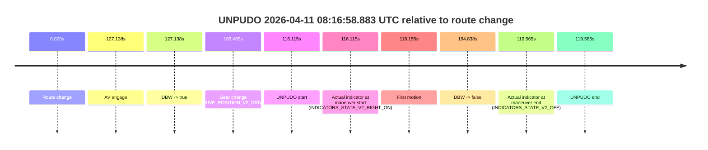
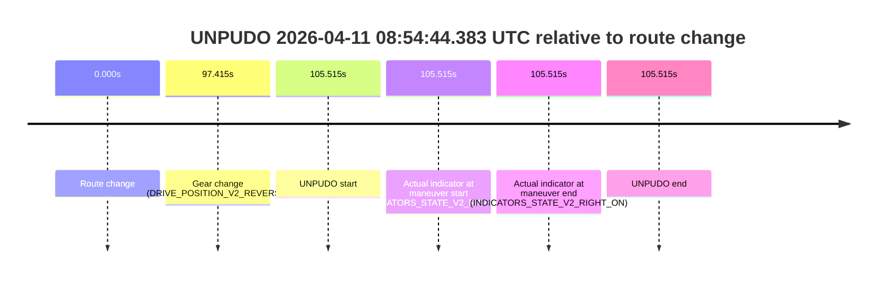
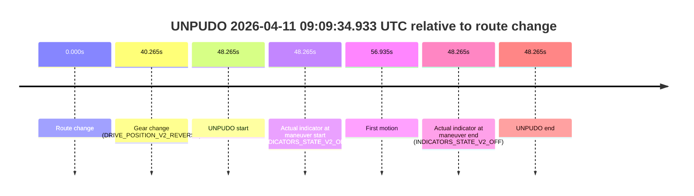
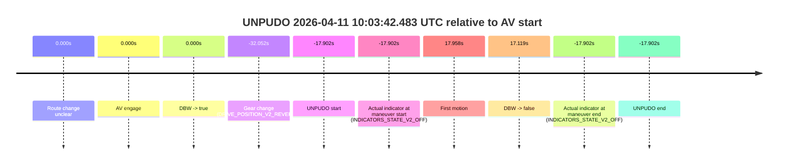
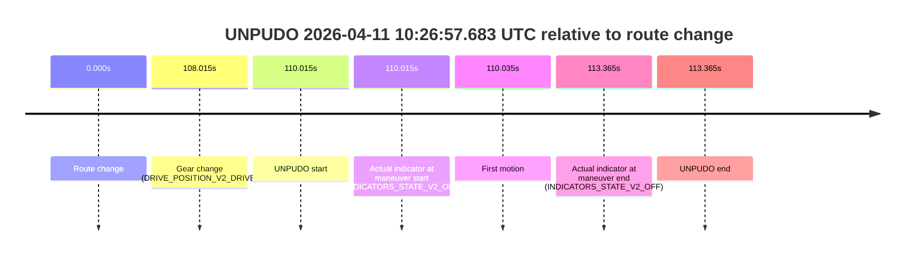
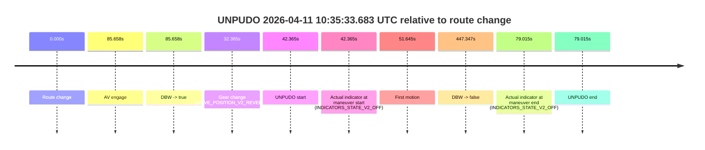

# Run Report: fme20018/2026-04-11--07-55-12--gen2-av-1aaff05e-eeb9-4911-a0d0-a76929afe969

| Field | Value |
|---|---|
| Run ID | `fme20018/2026-04-11--07-55-12--gen2-av-1aaff05e-eeb9-4911-a0d0-a76929afe969` |
| Date | `2026-04-11` |
| Model(s) | `lively-orange-horse` |
| Author | `guy.geva` |
| Event count | `21` |

## unpudo 2026-04-11 08:03:55.983 UTC

| Field | Value |
|---|---|
| Model | `lively-orange-horse` |
| Author | `guy.geva` |
| Run ID | `fme20018/2026-04-11--07-55-12--gen2-av-1aaff05e-eeb9-4911-a0d0-a76929afe969` |
| Date | `2026-04-11` |
| Time (UTC) | `08:03:55.983` |
| Event type | `unpudo` |
| Disengagement type | `none observed` |
| Route change | `found` |
| Console | [run](https://console.sso.wayve.ai/run/fme20018/2026-04-11--07-55-12--gen2-av-1aaff05e-eeb9-4911-a0d0-a76929afe969?id=&time-unixus=1775894635983293) |
| Foxglove | [segment](https://app.foxglove.dev/wayve-on-prem/p/prj_0dX18KZdVHg1fmmI/view?ds=foxglove-stream&ds.deviceName=fme20018&ds.start=2026-04-11T08%3A02%3A39.968349Z&ds.end=2026-04-11T08%3A05%3A17.165248Z&layoutId=lay_0e7VD4WIKDQGU73Y&time=2026-04-11T08%3A03%3A55.983293Z) |

### Event card: pass

- Pass: AV owns the credited unpudo through the official event window, the gear state is aligned at the anchor, and the vehicle moves without driver accelerator help in AV.

| Event | Time (UTC) | Delta from route change |
|---|---:|---:|
| Route change | 2026-04-11 08:02:49.968 | `0.000s` |
| AV engage | 2026-04-11 08:03:36.515 | `46.547s` |
| DBW -> true | 2026-04-11 08:03:36.515 | `46.547s` |
| Gear change (DRIVE_POSITION_V2_DRIVE) | 2026-04-11 08:03:36.933 | `46.965s` |
| UNPUDO start | 2026-04-11 08:03:55.983 | `66.015s` |
| Actual indicator at maneuver start (INDICATORS_STATE_V2_OFF) | 2026-04-11 08:03:55.983 | `66.015s` |
| First motion | 2026-04-11 08:03:56.003 | `66.035s` |
| DBW -> false | 2026-04-11 08:05:07.165 | `137.197s` |
| Actual indicator at maneuver end (INDICATORS_STATE_V2_OFF) | 2026-04-11 08:03:59.833 | `69.865s` |
| UNPUDO end | 2026-04-11 08:03:59.833 | `69.865s` |


| Metric | Value |
|---|---|
| Outcome | `pass` |
| Effective failure type | `none` |
| Route change status | `found` |
| DBW at event start | `true` |
| DBW at event end | `true` |
| Predicted gear at AV start | `DRIVE_POSITION_V2_DRIVE` |
| Actual gear at AV start | `DRIVE_POSITION_V2_PARK` |
| Predicted gear at event start | `DRIVE_POSITION_V2_DRIVE` |
| Actual gear at event start | `DRIVE_POSITION_V2_DRIVE` |
| Planned indicator direction | `INDICATORS_STATE_V2_LEFT_ON` |
| Controller indicator direction | `INDICATORS_STATE_V2_LEFT_ON` |
| Actual indicator direction | `INDICATORS_STATE_V2_OFF` |
| Actual indicator at maneuver end | `INDICATORS_STATE_V2_OFF` |
| Driver accel help in AV | `false` |
| Driver accel help timestamp | `n/a` |
| Max accel pedal pct in AV | `0.0%` |
| Max brake pedal pct in AV | `9.9%` |
| Max speed mps in AV | `3.964` |
| Route -> AV | `46.547s` |
| AV -> event start | `19.468s` |
| AV -> first motion | `19.488s` |
| AV duration before disengagement | `90.650s` |
| Trajectory waypoint count | `36` |
| Driving-plan step count | `11` |

The scored portion starts from the AV-owned window, not from the pre-AV setup. Route-change search in the stopped pre-event segment was `found`, with the baseline therefore set to route change. At the event anchor the model predicts `DRIVE_POSITION_V2_DRIVE` and the actual gear is `DRIVE_POSITION_V2_DRIVE`. The effective model outcome is `pass` because `the credited maneuver stays AV-owned through the official event end`.

### Resolution

| Field | Value |
|---|---|
| Final outcome | `pass` |
| Do we agree with this label? | `yes` |
| Source disengagement type | `none observed` |
| Resolved effective failure type | `none` |
| Confidence | `high` |

## unpudo 2026-04-11 08:05:56.033 UTC

| Field | Value |
|---|---|
| Model | `lively-orange-horse` |
| Author | `guy.geva` |
| Run ID | `fme20018/2026-04-11--07-55-12--gen2-av-1aaff05e-eeb9-4911-a0d0-a76929afe969` |
| Date | `2026-04-11` |
| Time (UTC) | `08:05:56.033` |
| Event type | `unpudo` |
| Disengagement type | `failed_to_pudo` |
| Route change | `found` |
| Console | [run](https://console.sso.wayve.ai/run/fme20018/2026-04-11--07-55-12--gen2-av-1aaff05e-eeb9-4911-a0d0-a76929afe969?id=&time-unixus=1775894756033307) |
| Foxglove | [segment](https://app.foxglove.dev/wayve-on-prem/p/prj_0dX18KZdVHg1fmmI/view?ds=foxglove-stream&ds.deviceName=fme20018&ds.start=2026-04-11T08%3A05%3A09.218262Z&ds.end=2026-04-11T08%3A06%3A12.383308Z&layoutId=lay_0e7VD4WIKDQGU73Y&time=2026-04-11T08%3A05%3A56.033307Z) |

### Event card: fail

- Fail: AV owns part of the segment, but the event still resolves as a model-performance failure under the AV-only scoring rule.

| Event | Time (UTC) | Delta from route change |
|---|---:|---:|
| Route change | 2026-04-11 08:05:19.218 | `0.000s` |
| Gear change (DRIVE_POSITION_V2_DRIVE) | 2026-04-11 08:05:38.233 | `19.015s` |
| UNPUDO start | 2026-04-11 08:05:56.033 | `36.815s` |
| Actual indicator at maneuver start (INDICATORS_STATE_V2_RIGHT_ON) | 2026-04-11 08:05:56.033 | `36.815s` |
| First motion | 2026-04-11 08:05:56.103 | `36.885s` |
| Actual indicator at maneuver end (INDICATORS_STATE_V2_OFF) | 2026-04-11 08:06:02.383 | `43.165s` |
| UNPUDO end | 2026-04-11 08:06:02.383 | `43.165s` |


| Metric | Value |
|---|---|
| Outcome | `fail` |
| Effective failure type | `failed_to_pudo` |
| Route change status | `found` |
| DBW at event start | `false` |
| DBW at event end | `false` |
| Predicted gear at AV start | `n/a` |
| Actual gear at AV start | `n/a` |
| Predicted gear at event start | `DRIVE_POSITION_V2_DRIVE` |
| Actual gear at event start | `DRIVE_POSITION_V2_DRIVE` |
| Planned indicator direction | `INDICATORS_STATE_V2_RIGHT_ON` |
| Controller indicator direction | `INDICATORS_STATE_V2_RIGHT_ON` |
| Actual indicator direction | `INDICATORS_STATE_V2_RIGHT_ON` |
| Actual indicator at maneuver end | `INDICATORS_STATE_V2_OFF` |
| Driver accel help in AV | `false` |
| Driver accel help timestamp | `n/a` |
| Max accel pedal pct in AV | `0.0%` |
| Max brake pedal pct in AV | `0.0%` |
| Max speed mps in AV | `0.000` |
| Route -> AV | `n/a` |
| AV -> event start | `n/a` |
| AV -> first motion | `n/a` |
| AV duration before disengagement | `n/a` |
| Trajectory waypoint count | `35` |
| Driving-plan step count | `11` |

The scored portion starts from the AV-owned window, not from the pre-AV setup. Route-change search in the stopped pre-event segment was `found`, with the baseline therefore set to route change. At the event anchor the model predicts `DRIVE_POSITION_V2_DRIVE` and the actual gear is `DRIVE_POSITION_V2_DRIVE`. The effective model outcome is `fail` because `failed_to_pudo`.

### Resolution

| Field | Value |
|---|---|
| Final outcome | `fail` |
| Do we agree with this label? | `yes` |
| Source disengagement type | `failed_to_pudo` |
| Resolved effective failure type | `failed_to_pudo` |
| Confidence | `high` |

## unpudo 2026-04-11 08:08:16.983 UTC

| Field | Value |
|---|---|
| Model | `lively-orange-horse` |
| Author | `guy.geva` |
| Run ID | `fme20018/2026-04-11--07-55-12--gen2-av-1aaff05e-eeb9-4911-a0d0-a76929afe969` |
| Date | `2026-04-11` |
| Time (UTC) | `08:08:16.983` |
| Event type | `unpudo` |
| Disengagement type | `none observed` |
| Route change | `found` |
| Console | [run](https://console.sso.wayve.ai/run/fme20018/2026-04-11--07-55-12--gen2-av-1aaff05e-eeb9-4911-a0d0-a76929afe969?id=&time-unixus=1775894896983316) |
| Foxglove | [segment](https://app.foxglove.dev/wayve-on-prem/p/prj_0dX18KZdVHg1fmmI/view?ds=foxglove-stream&ds.deviceName=fme20018&ds.start=2026-04-11T08%3A07%3A42.918278Z&ds.end=2026-04-11T08%3A08%3A30.883292Z&layoutId=lay_0e7VD4WIKDQGU73Y&time=2026-04-11T08%3A08%3A16.983316Z) |

### Event card: fail

- Fail: the credited unpudo does not stay AV-owned. The event window starts with DBW false, and the maneuver outcome lands outside a clean AV-owned segment.

| Event | Time (UTC) | Delta from route change |
|---|---:|---:|
| Route change | 2026-04-11 08:07:52.918 | `0.000s` |
| Gear change (DRIVE_POSITION_V2_DRIVE) | 2026-04-11 08:08:10.983 | `18.065s` |
| UNPUDO start | 2026-04-11 08:08:16.983 | `24.065s` |
| Actual indicator at maneuver start (INDICATORS_STATE_V2_RIGHT_ON) | 2026-04-11 08:08:16.983 | `24.065s` |
| First motion | 2026-04-11 08:08:17.023 | `24.105s` |
| Actual indicator at maneuver end (INDICATORS_STATE_V2_OFF) | 2026-04-11 08:08:20.883 | `27.965s` |
| UNPUDO end | 2026-04-11 08:08:20.883 | `27.965s` |


| Metric | Value |
|---|---|
| Outcome | `fail` |
| Effective failure type | `not_av_owned` |
| Route change status | `found` |
| DBW at event start | `false` |
| DBW at event end | `false` |
| Predicted gear at AV start | `n/a` |
| Actual gear at AV start | `n/a` |
| Predicted gear at event start | `DRIVE_POSITION_V2_DRIVE` |
| Actual gear at event start | `DRIVE_POSITION_V2_DRIVE` |
| Planned indicator direction | `INDICATORS_STATE_V2_LEFT_ON` |
| Controller indicator direction | `INDICATORS_STATE_V2_LEFT_ON` |
| Actual indicator direction | `INDICATORS_STATE_V2_RIGHT_ON` |
| Actual indicator at maneuver end | `INDICATORS_STATE_V2_OFF` |
| Driver accel help in AV | `false` |
| Driver accel help timestamp | `n/a` |
| Max accel pedal pct in AV | `0.0%` |
| Max brake pedal pct in AV | `0.0%` |
| Max speed mps in AV | `0.000` |
| Route -> AV | `n/a` |
| AV -> event start | `n/a` |
| AV -> first motion | `n/a` |
| AV duration before disengagement | `n/a` |
| Trajectory waypoint count | `36` |
| Driving-plan step count | `11` |

The scored portion starts from the AV-owned window, not from the pre-AV setup. Route-change search in the stopped pre-event segment was `found`, with the baseline therefore set to route change. At the event anchor the model predicts `DRIVE_POSITION_V2_DRIVE` and the actual gear is `DRIVE_POSITION_V2_DRIVE`. The effective model outcome is `fail` because `not_av_owned`.

### Resolution

| Field | Value |
|---|---|
| Final outcome | `fail` |
| Do we agree with this label? | `yes` |
| Source disengagement type | `none observed` |
| Resolved effective failure type | `not_av_owned` |
| Confidence | `high` |

## unpudo 2026-04-11 08:16:58.883 UTC

| Field | Value |
|---|---|
| Model | `lively-orange-horse` |
| Author | `guy.geva` |
| Run ID | `fme20018/2026-04-11--07-55-12--gen2-av-1aaff05e-eeb9-4911-a0d0-a76929afe969` |
| Date | `2026-04-11` |
| Time (UTC) | `08:16:58.883` |
| Event type | `unpudo` |
| Disengagement type | `failed_to_unpudo` |
| Route change | `found` |
| Console | [run](https://console.sso.wayve.ai/run/fme20018/2026-04-11--07-55-12--gen2-av-1aaff05e-eeb9-4911-a0d0-a76929afe969?id=&time-unixus=1775895418883316) |
| Foxglove | [segment](https://app.foxglove.dev/wayve-on-prem/p/prj_0dX18KZdVHg1fmmI/view?ds=foxglove-stream&ds.deviceName=fme20018&ds.start=2026-04-11T08%3A14%3A52.768384Z&ds.end=2026-04-11T08%3A18%3A27.606058Z&layoutId=lay_0e7VD4WIKDQGU73Y&time=2026-04-11T08%3A16%3A58.883316Z) |

### Event card: fail

- Fail: AV owns part of the segment, but the event still resolves as a model-performance failure under the AV-only scoring rule.

| Event | Time (UTC) | Delta from route change |
|---|---:|---:|
| Route change | 2026-04-11 08:15:02.768 | `0.000s` |
| AV engage | 2026-04-11 08:17:09.906 | `127.138s` |
| DBW -> true | 2026-04-11 08:17:09.906 | `127.138s` |
| Gear change (DRIVE_POSITION_V2_DRIVE) | 2026-04-11 08:16:49.233 | `106.465s` |
| UNPUDO start | 2026-04-11 08:16:58.883 | `116.115s` |
| Actual indicator at maneuver start (INDICATORS_STATE_V2_RIGHT_ON) | 2026-04-11 08:16:58.883 | `116.115s` |
| First motion | 2026-04-11 08:16:58.923 | `116.155s` |
| DBW -> false | 2026-04-11 08:18:17.606 | `194.838s` |
| Actual indicator at maneuver end (INDICATORS_STATE_V2_OFF) | 2026-04-11 08:17:02.333 | `119.565s` |
| UNPUDO end | 2026-04-11 08:17:02.333 | `119.565s` |



| Metric | Value |
|---|---|
| Outcome | `fail` |
| Effective failure type | `failed_to_unpudo` |
| Route change status | `found` |
| DBW at event start | `false` |
| DBW at event end | `false` |
| Predicted gear at AV start | `DRIVE_POSITION_V2_DRIVE` |
| Actual gear at AV start | `DRIVE_POSITION_V2_DRIVE` |
| Predicted gear at event start | `DRIVE_POSITION_V2_DRIVE` |
| Actual gear at event start | `DRIVE_POSITION_V2_DRIVE` |
| Planned indicator direction | `INDICATORS_STATE_V2_LEFT_ON` |
| Controller indicator direction | `INDICATORS_STATE_V2_LEFT_ON` |
| Actual indicator direction | `INDICATORS_STATE_V2_RIGHT_ON` |
| Actual indicator at maneuver end | `INDICATORS_STATE_V2_OFF` |
| Driver accel help in AV | `false` |
| Driver accel help timestamp | `n/a` |
| Max accel pedal pct in AV | `0.0%` |
| Max brake pedal pct in AV | `0.0%` |
| Max speed mps in AV | `0.000` |
| Route -> AV | `127.138s` |
| AV -> event start | `-11.023s` |
| AV -> first motion | `-10.983s` |
| AV duration before disengagement | `67.700s` |
| Trajectory waypoint count | `34` |
| Driving-plan step count | `11` |

The scored portion starts from the AV-owned window, not from the pre-AV setup. Route-change search in the stopped pre-event segment was `found`, with the baseline therefore set to route change. At the event anchor the model predicts `DRIVE_POSITION_V2_DRIVE` and the actual gear is `DRIVE_POSITION_V2_DRIVE`. The effective model outcome is `fail` because `failed_to_unpudo`.

### Resolution

| Field | Value |
|---|---|
| Final outcome | `fail` |
| Do we agree with this label? | `yes` |
| Source disengagement type | `failed_to_unpudo` |
| Resolved effective failure type | `failed_to_unpudo` |
| Confidence | `high` |

## unpudo 2026-04-11 08:18:18.183 UTC

| Field | Value |
|---|---|
| Model | `lively-orange-horse` |
| Author | `guy.geva` |
| Run ID | `fme20018/2026-04-11--07-55-12--gen2-av-1aaff05e-eeb9-4911-a0d0-a76929afe969` |
| Date | `2026-04-11` |
| Time (UTC) | `08:18:18.183` |
| Event type | `unpudo` |
| Disengagement type | `failed_to_unpudo` |
| Route change | `found` |
| Console | [run](https://console.sso.wayve.ai/run/fme20018/2026-04-11--07-55-12--gen2-av-1aaff05e-eeb9-4911-a0d0-a76929afe969?id=&time-unixus=1775895498183297) |
| Foxglove | [segment](https://app.foxglove.dev/wayve-on-prem/p/prj_0dX18KZdVHg1fmmI/view?ds=foxglove-stream&ds.deviceName=fme20018&ds.start=2026-04-11T08%3A16%3A38.868311Z&ds.end=2026-04-11T08%3A20%3A48.115214Z&layoutId=lay_0e7VD4WIKDQGU73Y&time=2026-04-11T08%3A18%3A18.183297Z) |

### Event card: fail

- Fail: AV owns part of the segment, but the event still resolves as a model-performance failure under the AV-only scoring rule.

| Event | Time (UTC) | Delta from route change |
|---|---:|---:|
| Route change | 2026-04-11 08:16:48.868 | `0.000s` |
| AV engage | 2026-04-11 08:18:26.165 | `97.297s` |
| DBW -> true | 2026-04-11 08:18:26.165 | `97.297s` |
| Gear change (DRIVE_POSITION_V2_DRIVE) | 2026-04-11 08:18:09.433 | `80.565s` |
| UNPUDO start | 2026-04-11 08:18:18.183 | `89.315s` |
| Actual indicator at maneuver start (INDICATORS_STATE_V2_RIGHT_ON) | 2026-04-11 08:18:18.183 | `89.315s` |
| First motion | 2026-04-11 08:18:18.203 | `89.335s` |
| DBW -> false | 2026-04-11 08:20:38.115 | `229.247s` |
| Actual indicator at maneuver end (INDICATORS_STATE_V2_OFF) | 2026-04-11 08:18:21.533 | `92.665s` |
| UNPUDO end | 2026-04-11 08:18:21.533 | `92.665s` |


| Metric | Value |
|---|---|
| Outcome | `fail` |
| Effective failure type | `failed_to_unpudo` |
| Route change status | `found` |
| DBW at event start | `false` |
| DBW at event end | `false` |
| Predicted gear at AV start | `DRIVE_POSITION_V2_DRIVE` |
| Actual gear at AV start | `DRIVE_POSITION_V2_DRIVE` |
| Predicted gear at event start | `DRIVE_POSITION_V2_DRIVE` |
| Actual gear at event start | `DRIVE_POSITION_V2_DRIVE` |
| Planned indicator direction | `INDICATORS_STATE_V2_RIGHT_ON` |
| Controller indicator direction | `INDICATORS_STATE_V2_RIGHT_ON` |
| Actual indicator direction | `INDICATORS_STATE_V2_RIGHT_ON` |
| Actual indicator at maneuver end | `INDICATORS_STATE_V2_OFF` |
| Driver accel help in AV | `false` |
| Driver accel help timestamp | `n/a` |
| Max accel pedal pct in AV | `0.0%` |
| Max brake pedal pct in AV | `0.0%` |
| Max speed mps in AV | `0.000` |
| Route -> AV | `97.297s` |
| AV -> event start | `-7.982s` |
| AV -> first motion | `-7.962s` |
| AV duration before disengagement | `131.950s` |
| Trajectory waypoint count | `36` |
| Driving-plan step count | `11` |

The scored portion starts from the AV-owned window, not from the pre-AV setup. Route-change search in the stopped pre-event segment was `found`, with the baseline therefore set to route change. At the event anchor the model predicts `DRIVE_POSITION_V2_DRIVE` and the actual gear is `DRIVE_POSITION_V2_DRIVE`. The effective model outcome is `fail` because `failed_to_unpudo`.

### Resolution

| Field | Value |
|---|---|
| Final outcome | `fail` |
| Do we agree with this label? | `yes` |
| Source disengagement type | `failed_to_unpudo` |
| Resolved effective failure type | `failed_to_unpudo` |
| Confidence | `high` |

## unpudo 2026-04-11 08:27:39.083 UTC

| Field | Value |
|---|---|
| Model | `lively-orange-horse` |
| Author | `guy.geva` |
| Run ID | `fme20018/2026-04-11--07-55-12--gen2-av-1aaff05e-eeb9-4911-a0d0-a76929afe969` |
| Date | `2026-04-11` |
| Time (UTC) | `08:27:39.083` |
| Event type | `unpudo` |
| Disengagement type | `failed_to_unpudo` |
| Route change | `found` |
| Console | [run](https://console.sso.wayve.ai/run/fme20018/2026-04-11--07-55-12--gen2-av-1aaff05e-eeb9-4911-a0d0-a76929afe969?id=&time-unixus=1775896059083302) |
| Foxglove | [segment](https://app.foxglove.dev/wayve-on-prem/p/prj_0dX18KZdVHg1fmmI/view?ds=foxglove-stream&ds.deviceName=fme20018&ds.start=2026-04-11T08%3A27%3A17.618277Z&ds.end=2026-04-11T08%3A32%3A56.214577Z&layoutId=lay_0e7VD4WIKDQGU73Y&time=2026-04-11T08%3A27%3A39.083302Z) |

### Event card: fail

- Fail: AV owns part of the segment, but the event still resolves as a model-performance failure under the AV-only scoring rule.

| Event | Time (UTC) | Delta from route change |
|---|---:|---:|
| Route change | 2026-04-11 08:27:27.618 | `0.000s` |
| AV engage | 2026-04-11 08:27:53.326 | `25.708s` |
| DBW -> true | 2026-04-11 08:27:53.326 | `25.708s` |
| Gear change (DRIVE_POSITION_V2_DRIVE) | 2026-04-11 08:27:27.933 | `0.315s` |
| UNPUDO start | 2026-04-11 08:27:39.083 | `11.465s` |
| Actual indicator at maneuver start (INDICATORS_STATE_V2_OFF) | 2026-04-11 08:27:39.083 | `11.465s` |
| First motion | 2026-04-11 08:27:39.123 | `11.505s` |
| DBW -> false | 2026-04-11 08:32:46.214 | `318.596s` |
| Actual indicator at maneuver end (INDICATORS_STATE_V2_OFF) | 2026-04-11 08:27:42.883 | `15.265s` |
| UNPUDO end | 2026-04-11 08:27:42.883 | `15.265s` |


| Metric | Value |
|---|---|
| Outcome | `fail` |
| Effective failure type | `failed_to_unpudo` |
| Route change status | `found` |
| DBW at event start | `false` |
| DBW at event end | `false` |
| Predicted gear at AV start | `DRIVE_POSITION_V2_DRIVE` |
| Actual gear at AV start | `DRIVE_POSITION_V2_DRIVE` |
| Predicted gear at event start | `DRIVE_POSITION_V2_DRIVE` |
| Actual gear at event start | `DRIVE_POSITION_V2_DRIVE` |
| Planned indicator direction | `INDICATORS_STATE_V2_RIGHT_ON` |
| Controller indicator direction | `INDICATORS_STATE_V2_RIGHT_ON` |
| Actual indicator direction | `INDICATORS_STATE_V2_OFF` |
| Actual indicator at maneuver end | `INDICATORS_STATE_V2_OFF` |
| Driver accel help in AV | `false` |
| Driver accel help timestamp | `n/a` |
| Max accel pedal pct in AV | `0.0%` |
| Max brake pedal pct in AV | `0.0%` |
| Max speed mps in AV | `0.000` |
| Route -> AV | `25.708s` |
| AV -> event start | `-14.243s` |
| AV -> first motion | `-14.203s` |
| AV duration before disengagement | `292.888s` |
| Trajectory waypoint count | `36` |
| Driving-plan step count | `11` |

The scored portion starts from the AV-owned window, not from the pre-AV setup. Route-change search in the stopped pre-event segment was `found`, with the baseline therefore set to route change. At the event anchor the model predicts `DRIVE_POSITION_V2_DRIVE` and the actual gear is `DRIVE_POSITION_V2_DRIVE`. The effective model outcome is `fail` because `failed_to_unpudo`.

### Resolution

| Field | Value |
|---|---|
| Final outcome | `fail` |
| Do we agree with this label? | `yes` |
| Source disengagement type | `failed_to_unpudo` |
| Resolved effective failure type | `failed_to_unpudo` |
| Confidence | `high` |

## unpudo 2026-04-11 08:38:30.033 UTC

| Field | Value |
|---|---|
| Model | `lively-orange-horse` |
| Author | `guy.geva` |
| Run ID | `fme20018/2026-04-11--07-55-12--gen2-av-1aaff05e-eeb9-4911-a0d0-a76929afe969` |
| Date | `2026-04-11` |
| Time (UTC) | `08:38:30.033` |
| Event type | `unpudo` |
| Disengagement type | `failed_to_unpudo` |
| Route change | `found` |
| Console | [run](https://console.sso.wayve.ai/run/fme20018/2026-04-11--07-55-12--gen2-av-1aaff05e-eeb9-4911-a0d0-a76929afe969?id=&time-unixus=1775896710033303) |
| Foxglove | [segment](https://app.foxglove.dev/wayve-on-prem/p/prj_0dX18KZdVHg1fmmI/view?ds=foxglove-stream&ds.deviceName=fme20018&ds.start=2026-04-11T08%3A37%3A49.768288Z&ds.end=2026-04-11T08%3A40%3A11.555235Z&layoutId=lay_0e7VD4WIKDQGU73Y&time=2026-04-11T08%3A38%3A30.033303Z) |

### Event card: fail

- Fail: AV owns part of the segment, but the event still resolves as a model-performance failure under the AV-only scoring rule.

| Event | Time (UTC) | Delta from route change |
|---|---:|---:|
| Route change | 2026-04-11 08:37:59.768 | `0.000s` |
| AV engage | 2026-04-11 08:38:39.326 | `39.558s` |
| DBW -> true | 2026-04-11 08:38:39.326 | `39.558s` |
| Gear change (DRIVE_POSITION_V2_DRIVE) | 2026-04-11 08:38:14.633 | `14.865s` |
| UNPUDO start | 2026-04-11 08:38:30.033 | `30.265s` |
| Actual indicator at maneuver start (INDICATORS_STATE_V2_RIGHT_ON) | 2026-04-11 08:38:30.033 | `30.265s` |
| First motion | 2026-04-11 08:38:30.084 | `30.316s` |
| DBW -> false | 2026-04-11 08:40:01.555 | `121.787s` |
| Actual indicator at maneuver end (INDICATORS_STATE_V2_OFF) | 2026-04-11 08:38:36.933 | `37.165s` |
| UNPUDO end | 2026-04-11 08:38:36.933 | `37.165s` |


| Metric | Value |
|---|---|
| Outcome | `fail` |
| Effective failure type | `failed_to_unpudo` |
| Route change status | `found` |
| DBW at event start | `false` |
| DBW at event end | `false` |
| Predicted gear at AV start | `DRIVE_POSITION_V2_DRIVE` |
| Actual gear at AV start | `DRIVE_POSITION_V2_DRIVE` |
| Predicted gear at event start | `DRIVE_POSITION_V2_DRIVE` |
| Actual gear at event start | `DRIVE_POSITION_V2_DRIVE` |
| Planned indicator direction | `INDICATORS_STATE_V2_RIGHT_ON` |
| Controller indicator direction | `INDICATORS_STATE_V2_RIGHT_ON` |
| Actual indicator direction | `INDICATORS_STATE_V2_RIGHT_ON` |
| Actual indicator at maneuver end | `INDICATORS_STATE_V2_OFF` |
| Driver accel help in AV | `false` |
| Driver accel help timestamp | `n/a` |
| Max accel pedal pct in AV | `0.0%` |
| Max brake pedal pct in AV | `0.0%` |
| Max speed mps in AV | `0.000` |
| Route -> AV | `39.558s` |
| AV -> event start | `-9.293s` |
| AV -> first motion | `-9.242s` |
| AV duration before disengagement | `82.229s` |
| Trajectory waypoint count | `37` |
| Driving-plan step count | `11` |

The scored portion starts from the AV-owned window, not from the pre-AV setup. Route-change search in the stopped pre-event segment was `found`, with the baseline therefore set to route change. At the event anchor the model predicts `DRIVE_POSITION_V2_DRIVE` and the actual gear is `DRIVE_POSITION_V2_DRIVE`. The effective model outcome is `fail` because `failed_to_unpudo`.

### Resolution

| Field | Value |
|---|---|
| Final outcome | `fail` |
| Do we agree with this label? | `yes` |
| Source disengagement type | `failed_to_unpudo` |
| Resolved effective failure type | `failed_to_unpudo` |
| Confidence | `high` |

## unpudo 2026-04-11 08:49:31.483 UTC

| Field | Value |
|---|---|
| Model | `lively-orange-horse` |
| Author | `guy.geva` |
| Run ID | `fme20018/2026-04-11--07-55-12--gen2-av-1aaff05e-eeb9-4911-a0d0-a76929afe969` |
| Date | `2026-04-11` |
| Time (UTC) | `08:49:31.483` |
| Event type | `unpudo` |
| Disengagement type | `failed_to_unpudo` |
| Route change | `found` |
| Console | [run](https://console.sso.wayve.ai/run/fme20018/2026-04-11--07-55-12--gen2-av-1aaff05e-eeb9-4911-a0d0-a76929afe969?id=&time-unixus=1775897371483313) |
| Foxglove | [segment](https://app.foxglove.dev/wayve-on-prem/p/prj_0dX18KZdVHg1fmmI/view?ds=foxglove-stream&ds.deviceName=fme20018&ds.start=2026-04-11T08%3A49%3A05.318292Z&ds.end=2026-04-11T08%3A50%3A54.314599Z&layoutId=lay_0e7VD4WIKDQGU73Y&time=2026-04-11T08%3A49%3A31.483313Z) |

### Event card: fail

- Fail: AV owns part of the segment, but the event still resolves as a model-performance failure under the AV-only scoring rule.

| Event | Time (UTC) | Delta from route change |
|---|---:|---:|
| Route change | 2026-04-11 08:49:15.318 | `0.000s` |
| AV engage | 2026-04-11 08:49:34.996 | `19.678s` |
| DBW -> true | 2026-04-11 08:49:34.996 | `19.678s` |
| Gear change (DRIVE_POSITION_V2_DRIVE) | 2026-04-11 08:49:17.283 | `1.965s` |
| UNPUDO start | 2026-04-11 08:49:31.483 | `16.165s` |
| Actual indicator at maneuver start (INDICATORS_STATE_V2_RIGHT_ON) | 2026-04-11 08:49:31.483 | `16.165s` |
| First motion | 2026-04-11 08:49:31.563 | `16.245s` |
| DBW -> false | 2026-04-11 08:50:44.314 | `88.996s` |
| Actual indicator at maneuver end (INDICATORS_STATE_V2_OFF) | 2026-04-11 08:49:34.733 | `19.415s` |
| UNPUDO end | 2026-04-11 08:49:34.733 | `19.415s` |


| Metric | Value |
|---|---|
| Outcome | `fail` |
| Effective failure type | `failed_to_unpudo` |
| Route change status | `found` |
| DBW at event start | `false` |
| DBW at event end | `false` |
| Predicted gear at AV start | `DRIVE_POSITION_V2_DRIVE` |
| Actual gear at AV start | `DRIVE_POSITION_V2_DRIVE` |
| Predicted gear at event start | `DRIVE_POSITION_V2_DRIVE` |
| Actual gear at event start | `DRIVE_POSITION_V2_DRIVE` |
| Planned indicator direction | `INDICATORS_STATE_V2_RIGHT_ON` |
| Controller indicator direction | `INDICATORS_STATE_V2_RIGHT_ON` |
| Actual indicator direction | `INDICATORS_STATE_V2_RIGHT_ON` |
| Actual indicator at maneuver end | `INDICATORS_STATE_V2_OFF` |
| Driver accel help in AV | `false` |
| Driver accel help timestamp | `n/a` |
| Max accel pedal pct in AV | `0.0%` |
| Max brake pedal pct in AV | `0.0%` |
| Max speed mps in AV | `0.000` |
| Route -> AV | `19.678s` |
| AV -> event start | `-3.513s` |
| AV -> first motion | `-3.433s` |
| AV duration before disengagement | `69.318s` |
| Trajectory waypoint count | `36` |
| Driving-plan step count | `11` |

The scored portion starts from the AV-owned window, not from the pre-AV setup. Route-change search in the stopped pre-event segment was `found`, with the baseline therefore set to route change. At the event anchor the model predicts `DRIVE_POSITION_V2_DRIVE` and the actual gear is `DRIVE_POSITION_V2_DRIVE`. The effective model outcome is `fail` because `failed_to_unpudo`.

### Resolution

| Field | Value |
|---|---|
| Final outcome | `fail` |
| Do we agree with this label? | `yes` |
| Source disengagement type | `failed_to_unpudo` |
| Resolved effective failure type | `failed_to_unpudo` |
| Confidence | `high` |

## unpudo 2026-04-11 08:54:44.383 UTC

| Field | Value |
|---|---|
| Model | `lively-orange-horse` |
| Author | `guy.geva` |
| Run ID | `fme20018/2026-04-11--07-55-12--gen2-av-1aaff05e-eeb9-4911-a0d0-a76929afe969` |
| Date | `2026-04-11` |
| Time (UTC) | `08:54:44.383` |
| Event type | `unpudo` |
| Disengagement type | `none observed` |
| Route change | `found` |
| Console | [run](https://console.sso.wayve.ai/run/fme20018/2026-04-11--07-55-12--gen2-av-1aaff05e-eeb9-4911-a0d0-a76929afe969?id=&time-unixus=1775897684383299) |
| Foxglove | [segment](https://app.foxglove.dev/wayve-on-prem/p/prj_0dX18KZdVHg1fmmI/view?ds=foxglove-stream&ds.deviceName=fme20018&ds.start=2026-04-11T08%3A52%3A48.868271Z&ds.end=2026-04-11T08%3A54%3A54.383299Z&layoutId=lay_0e7VD4WIKDQGU73Y&time=2026-04-11T08%3A54%3A44.383299Z) |

### Event card: fail

- Fail: the credited unpudo does not stay AV-owned. The event window starts with DBW false, and the maneuver outcome lands outside a clean AV-owned segment.

| Event | Time (UTC) | Delta from route change |
|---|---:|---:|
| Route change | 2026-04-11 08:52:58.868 | `0.000s` |
| Gear change (DRIVE_POSITION_V2_REVERSE) | 2026-04-11 08:54:36.283 | `97.415s` |
| UNPUDO start | 2026-04-11 08:54:44.383 | `105.515s` |
| Actual indicator at maneuver start (INDICATORS_STATE_V2_RIGHT_ON) | 2026-04-11 08:54:44.383 | `105.515s` |
| Actual indicator at maneuver end (INDICATORS_STATE_V2_RIGHT_ON) | 2026-04-11 08:54:44.383 | `105.515s` |
| UNPUDO end | 2026-04-11 08:54:44.383 | `105.515s` |



| Metric | Value |
|---|---|
| Outcome | `fail` |
| Effective failure type | `not_av_owned` |
| Route change status | `found` |
| DBW at event start | `false` |
| DBW at event end | `false` |
| Predicted gear at AV start | `n/a` |
| Actual gear at AV start | `n/a` |
| Predicted gear at event start | `DRIVE_POSITION_V2_DRIVE` |
| Actual gear at event start | `DRIVE_POSITION_V2_REVERSE` |
| Planned indicator direction | `INDICATORS_STATE_V2_LEFT_ON` |
| Controller indicator direction | `INDICATORS_STATE_V2_LEFT_ON` |
| Actual indicator direction | `INDICATORS_STATE_V2_RIGHT_ON` |
| Actual indicator at maneuver end | `INDICATORS_STATE_V2_RIGHT_ON` |
| Driver accel help in AV | `false` |
| Driver accel help timestamp | `n/a` |
| Max accel pedal pct in AV | `0.0%` |
| Max brake pedal pct in AV | `0.0%` |
| Max speed mps in AV | `0.000` |
| Route -> AV | `n/a` |
| AV -> event start | `n/a` |
| AV -> first motion | `n/a` |
| AV duration before disengagement | `n/a` |
| Trajectory waypoint count | `36` |
| Driving-plan step count | `11` |

The scored portion starts from the AV-owned window, not from the pre-AV setup. Route-change search in the stopped pre-event segment was `found`, with the baseline therefore set to route change. At the event anchor the model predicts `DRIVE_POSITION_V2_DRIVE` and the actual gear is `DRIVE_POSITION_V2_REVERSE`. The effective model outcome is `fail` because `not_av_owned`.

### Resolution

| Field | Value |
|---|---|
| Final outcome | `fail` |
| Do we agree with this label? | `yes` |
| Source disengagement type | `none observed` |
| Resolved effective failure type | `not_av_owned` |
| Confidence | `high` |

## unpudo 2026-04-11 09:04:53.333 UTC

| Field | Value |
|---|---|
| Model | `lively-orange-horse` |
| Author | `guy.geva` |
| Run ID | `fme20018/2026-04-11--07-55-12--gen2-av-1aaff05e-eeb9-4911-a0d0-a76929afe969` |
| Date | `2026-04-11` |
| Time (UTC) | `09:04:53.333` |
| Event type | `unpudo` |
| Disengagement type | `failed_to_unpudo` |
| Route change | `found` |
| Console | [run](https://console.sso.wayve.ai/run/fme20018/2026-04-11--07-55-12--gen2-av-1aaff05e-eeb9-4911-a0d0-a76929afe969?id=&time-unixus=1775898293333290) |
| Foxglove | [segment](https://app.foxglove.dev/wayve-on-prem/p/prj_0dX18KZdVHg1fmmI/view?ds=foxglove-stream&ds.deviceName=fme20018&ds.start=2026-04-11T09%3A03%3A43.968325Z&ds.end=2026-04-11T09%3A08%3A35.236606Z&layoutId=lay_0e7VD4WIKDQGU73Y&time=2026-04-11T09%3A04%3A53.333290Z) |

### Event card: fail

- Fail: AV owns part of the segment, but the event still resolves as a model-performance failure under the AV-only scoring rule.

| Event | Time (UTC) | Delta from route change |
|---|---:|---:|
| Route change | 2026-04-11 09:03:53.968 | `0.000s` |
| AV engage | 2026-04-11 09:05:01.985 | `68.017s` |
| DBW -> true | 2026-04-11 09:05:01.985 | `68.017s` |
| Gear change (DRIVE_POSITION_V2_DRIVE) | 2026-04-11 09:04:17.583 | `23.615s` |
| UNPUDO start | 2026-04-11 09:04:53.333 | `59.365s` |
| Actual indicator at maneuver start (INDICATORS_STATE_V2_RIGHT_ON) | 2026-04-11 09:04:53.333 | `59.365s` |
| First motion | 2026-04-11 09:04:53.363 | `59.395s` |
| DBW -> false | 2026-04-11 09:08:25.236 | `271.268s` |
| Actual indicator at maneuver end (INDICATORS_STATE_V2_OFF) | 2026-04-11 09:04:57.633 | `63.665s` |
| UNPUDO end | 2026-04-11 09:04:57.633 | `63.665s` |


| Metric | Value |
|---|---|
| Outcome | `fail` |
| Effective failure type | `failed_to_unpudo` |
| Route change status | `found` |
| DBW at event start | `false` |
| DBW at event end | `false` |
| Predicted gear at AV start | `DRIVE_POSITION_V2_DRIVE` |
| Actual gear at AV start | `DRIVE_POSITION_V2_DRIVE` |
| Predicted gear at event start | `DRIVE_POSITION_V2_DRIVE` |
| Actual gear at event start | `DRIVE_POSITION_V2_DRIVE` |
| Planned indicator direction | `INDICATORS_STATE_V2_RIGHT_ON` |
| Controller indicator direction | `INDICATORS_STATE_V2_RIGHT_ON` |
| Actual indicator direction | `INDICATORS_STATE_V2_RIGHT_ON` |
| Actual indicator at maneuver end | `INDICATORS_STATE_V2_OFF` |
| Driver accel help in AV | `false` |
| Driver accel help timestamp | `n/a` |
| Max accel pedal pct in AV | `0.0%` |
| Max brake pedal pct in AV | `0.0%` |
| Max speed mps in AV | `0.000` |
| Route -> AV | `68.017s` |
| AV -> event start | `-8.652s` |
| AV -> first motion | `-8.622s` |
| AV duration before disengagement | `203.251s` |
| Trajectory waypoint count | `35` |
| Driving-plan step count | `11` |

The scored portion starts from the AV-owned window, not from the pre-AV setup. Route-change search in the stopped pre-event segment was `found`, with the baseline therefore set to route change. At the event anchor the model predicts `DRIVE_POSITION_V2_DRIVE` and the actual gear is `DRIVE_POSITION_V2_DRIVE`. The effective model outcome is `fail` because `failed_to_unpudo`.

### Resolution

| Field | Value |
|---|---|
| Final outcome | `fail` |
| Do we agree with this label? | `yes` |
| Source disengagement type | `failed_to_unpudo` |
| Resolved effective failure type | `failed_to_unpudo` |
| Confidence | `high` |

## unpudo 2026-04-11 09:09:34.933 UTC

| Field | Value |
|---|---|
| Model | `lively-orange-horse` |
| Author | `guy.geva` |
| Run ID | `fme20018/2026-04-11--07-55-12--gen2-av-1aaff05e-eeb9-4911-a0d0-a76929afe969` |
| Date | `2026-04-11` |
| Time (UTC) | `09:09:34.933` |
| Event type | `unpudo` |
| Disengagement type | `none observed` |
| Route change | `found` |
| Console | [run](https://console.sso.wayve.ai/run/fme20018/2026-04-11--07-55-12--gen2-av-1aaff05e-eeb9-4911-a0d0-a76929afe969?id=&time-unixus=1775898574933314) |
| Foxglove | [segment](https://app.foxglove.dev/wayve-on-prem/p/prj_0dX18KZdVHg1fmmI/view?ds=foxglove-stream&ds.deviceName=fme20018&ds.start=2026-04-11T09%3A08%3A36.668276Z&ds.end=2026-04-11T09%3A09%3A44.933314Z&layoutId=lay_0e7VD4WIKDQGU73Y&time=2026-04-11T09%3A09%3A34.933314Z) |

### Event card: fail

- Fail: the credited unpudo does not stay AV-owned. The event window starts with DBW false, and the maneuver outcome lands outside a clean AV-owned segment.

| Event | Time (UTC) | Delta from route change |
|---|---:|---:|
| Route change | 2026-04-11 09:08:46.668 | `0.000s` |
| Gear change (DRIVE_POSITION_V2_REVERSE) | 2026-04-11 09:09:26.933 | `40.265s` |
| UNPUDO start | 2026-04-11 09:09:34.933 | `48.265s` |
| Actual indicator at maneuver start (INDICATORS_STATE_V2_OFF) | 2026-04-11 09:09:34.933 | `48.265s` |
| First motion | 2026-04-11 09:09:43.603 | `56.935s` |
| Actual indicator at maneuver end (INDICATORS_STATE_V2_OFF) | 2026-04-11 09:09:34.933 | `48.265s` |
| UNPUDO end | 2026-04-11 09:09:34.933 | `48.265s` |



| Metric | Value |
|---|---|
| Outcome | `fail` |
| Effective failure type | `not_av_owned` |
| Route change status | `found` |
| DBW at event start | `false` |
| DBW at event end | `false` |
| Predicted gear at AV start | `n/a` |
| Actual gear at AV start | `n/a` |
| Predicted gear at event start | `DRIVE_POSITION_V2_DRIVE` |
| Actual gear at event start | `DRIVE_POSITION_V2_REVERSE` |
| Planned indicator direction | `INDICATORS_STATE_V2_RIGHT_ON` |
| Controller indicator direction | `INDICATORS_STATE_V2_RIGHT_ON` |
| Actual indicator direction | `INDICATORS_STATE_V2_OFF` |
| Actual indicator at maneuver end | `INDICATORS_STATE_V2_OFF` |
| Driver accel help in AV | `false` |
| Driver accel help timestamp | `n/a` |
| Max accel pedal pct in AV | `0.0%` |
| Max brake pedal pct in AV | `0.0%` |
| Max speed mps in AV | `0.000` |
| Route -> AV | `n/a` |
| AV -> event start | `n/a` |
| AV -> first motion | `n/a` |
| AV duration before disengagement | `n/a` |
| Trajectory waypoint count | `35` |
| Driving-plan step count | `11` |

The scored portion starts from the AV-owned window, not from the pre-AV setup. Route-change search in the stopped pre-event segment was `found`, with the baseline therefore set to route change. At the event anchor the model predicts `DRIVE_POSITION_V2_DRIVE` and the actual gear is `DRIVE_POSITION_V2_REVERSE`. The effective model outcome is `fail` because `not_av_owned`.

### Resolution

| Field | Value |
|---|---|
| Final outcome | `fail` |
| Do we agree with this label? | `yes` |
| Source disengagement type | `none observed` |
| Resolved effective failure type | `not_av_owned` |
| Confidence | `high` |

## unpudo 2026-04-11 09:22:24.633 UTC

| Field | Value |
|---|---|
| Model | `lively-orange-horse` |
| Author | `guy.geva` |
| Run ID | `fme20018/2026-04-11--07-55-12--gen2-av-1aaff05e-eeb9-4911-a0d0-a76929afe969` |
| Date | `2026-04-11` |
| Time (UTC) | `09:22:24.633` |
| Event type | `unpudo` |
| Disengagement type | `failed_to_unpudo` |
| Route change | `found` |
| Console | [run](https://console.sso.wayve.ai/run/fme20018/2026-04-11--07-55-12--gen2-av-1aaff05e-eeb9-4911-a0d0-a76929afe969?id=&time-unixus=1775899344633307) |
| Foxglove | [segment](https://app.foxglove.dev/wayve-on-prem/p/prj_0dX18KZdVHg1fmmI/view?ds=foxglove-stream&ds.deviceName=fme20018&ds.start=2026-04-11T09%3A21%3A57.218248Z&ds.end=2026-04-11T09%3A26%3A42.856513Z&layoutId=lay_0e7VD4WIKDQGU73Y&time=2026-04-11T09%3A22%3A24.633307Z) |

### Event card: fail

- Fail: AV owns part of the segment, but the event still resolves as a model-performance failure under the AV-only scoring rule.

| Event | Time (UTC) | Delta from route change |
|---|---:|---:|
| Route change | 2026-04-11 09:22:07.218 | `0.000s` |
| AV engage | 2026-04-11 09:22:34.835 | `27.617s` |
| DBW -> true | 2026-04-11 09:22:34.835 | `27.617s` |
| Gear change (DRIVE_POSITION_V2_DRIVE) | 2026-04-11 09:22:13.983 | `6.765s` |
| UNPUDO start | 2026-04-11 09:22:24.633 | `17.415s` |
| Actual indicator at maneuver start (INDICATORS_STATE_V2_RIGHT_ON) | 2026-04-11 09:22:24.633 | `17.415s` |
| First motion | 2026-04-11 09:22:24.863 | `17.646s` |
| DBW -> false | 2026-04-11 09:26:32.856 | `265.638s` |
| Actual indicator at maneuver end (INDICATORS_STATE_V2_OFF) | 2026-04-11 09:22:32.683 | `25.465s` |
| UNPUDO end | 2026-04-11 09:22:32.683 | `25.465s` |


| Metric | Value |
|---|---|
| Outcome | `fail` |
| Effective failure type | `failed_to_unpudo` |
| Route change status | `found` |
| DBW at event start | `false` |
| DBW at event end | `false` |
| Predicted gear at AV start | `DRIVE_POSITION_V2_DRIVE` |
| Actual gear at AV start | `DRIVE_POSITION_V2_DRIVE` |
| Predicted gear at event start | `DRIVE_POSITION_V2_DRIVE` |
| Actual gear at event start | `DRIVE_POSITION_V2_DRIVE` |
| Planned indicator direction | `INDICATORS_STATE_V2_RIGHT_ON` |
| Controller indicator direction | `INDICATORS_STATE_V2_RIGHT_ON` |
| Actual indicator direction | `INDICATORS_STATE_V2_RIGHT_ON` |
| Actual indicator at maneuver end | `INDICATORS_STATE_V2_OFF` |
| Driver accel help in AV | `false` |
| Driver accel help timestamp | `n/a` |
| Max accel pedal pct in AV | `0.0%` |
| Max brake pedal pct in AV | `0.0%` |
| Max speed mps in AV | `0.000` |
| Route -> AV | `27.617s` |
| AV -> event start | `-10.202s` |
| AV -> first motion | `-9.971s` |
| AV duration before disengagement | `238.021s` |
| Trajectory waypoint count | `37` |
| Driving-plan step count | `11` |

The scored portion starts from the AV-owned window, not from the pre-AV setup. Route-change search in the stopped pre-event segment was `found`, with the baseline therefore set to route change. At the event anchor the model predicts `DRIVE_POSITION_V2_DRIVE` and the actual gear is `DRIVE_POSITION_V2_DRIVE`. The effective model outcome is `fail` because `failed_to_unpudo`.

### Resolution

| Field | Value |
|---|---|
| Final outcome | `fail` |
| Do we agree with this label? | `yes` |
| Source disengagement type | `failed_to_unpudo` |
| Resolved effective failure type | `failed_to_unpudo` |
| Confidence | `high` |

## unpudo 2026-04-11 09:23:48.883 UTC

| Field | Value |
|---|---|
| Model | `lively-orange-horse` |
| Author | `guy.geva` |
| Run ID | `fme20018/2026-04-11--07-55-12--gen2-av-1aaff05e-eeb9-4911-a0d0-a76929afe969` |
| Date | `2026-04-11` |
| Time (UTC) | `09:23:48.883` |
| Event type | `unpudo` |
| Disengagement type | `none observed` |
| Route change | `found` |
| Console | [run](https://console.sso.wayve.ai/run/fme20018/2026-04-11--07-55-12--gen2-av-1aaff05e-eeb9-4911-a0d0-a76929afe969?id=&time-unixus=1775899428883296) |
| Foxglove | [segment](https://app.foxglove.dev/wayve-on-prem/p/prj_0dX18KZdVHg1fmmI/view?ds=foxglove-stream&ds.deviceName=fme20018&ds.start=2026-04-11T09%3A21%3A57.218248Z&ds.end=2026-04-11T09%3A26%3A42.856513Z&layoutId=lay_0e7VD4WIKDQGU73Y&time=2026-04-11T09%3A23%3A48.883296Z) |

### Event card: pass

- Pass: AV owns the credited unpudo through the official event window, the gear state is aligned at the anchor, and the vehicle moves without driver accelerator help in AV.

| Event | Time (UTC) | Delta from route change |
|---|---:|---:|
| Route change | 2026-04-11 09:22:07.218 | `0.000s` |
| AV engage | 2026-04-11 09:22:34.835 | `27.617s` |
| DBW -> true | 2026-04-11 09:22:34.835 | `27.617s` |
| Gear change (DRIVE_POSITION_V2_DRIVE) | 2026-04-11 09:23:21.683 | `74.465s` |
| UNPUDO start | 2026-04-11 09:23:48.883 | `101.665s` |
| Actual indicator at maneuver start (INDICATORS_STATE_V2_OFF) | 2026-04-11 09:23:48.883 | `101.665s` |
| First motion | 2026-04-11 09:23:48.924 | `101.706s` |
| DBW -> false | 2026-04-11 09:26:32.856 | `265.638s` |
| Actual indicator at maneuver end (INDICATORS_STATE_V2_OFF) | 2026-04-11 09:23:52.233 | `105.015s` |
| UNPUDO end | 2026-04-11 09:23:52.233 | `105.015s` |


| Metric | Value |
|---|---|
| Outcome | `pass` |
| Effective failure type | `none` |
| Route change status | `found` |
| DBW at event start | `true` |
| DBW at event end | `true` |
| Predicted gear at AV start | `DRIVE_POSITION_V2_DRIVE` |
| Actual gear at AV start | `DRIVE_POSITION_V2_DRIVE` |
| Predicted gear at event start | `DRIVE_POSITION_V2_DRIVE` |
| Actual gear at event start | `DRIVE_POSITION_V2_DRIVE` |
| Planned indicator direction | `INDICATORS_STATE_V2_RIGHT_ON` |
| Controller indicator direction | `INDICATORS_STATE_V2_RIGHT_ON` |
| Actual indicator direction | `INDICATORS_STATE_V2_OFF` |
| Actual indicator at maneuver end | `INDICATORS_STATE_V2_OFF` |
| Driver accel help in AV | `false` |
| Driver accel help timestamp | `n/a` |
| Max accel pedal pct in AV | `0.0%` |
| Max brake pedal pct in AV | `8.0%` |
| Max speed mps in AV | `8.339` |
| Route -> AV | `27.617s` |
| AV -> event start | `74.048s` |
| AV -> first motion | `74.089s` |
| AV duration before disengagement | `238.021s` |
| Trajectory waypoint count | `36` |
| Driving-plan step count | `11` |

The scored portion starts from the AV-owned window, not from the pre-AV setup. Route-change search in the stopped pre-event segment was `found`, with the baseline therefore set to route change. At the event anchor the model predicts `DRIVE_POSITION_V2_DRIVE` and the actual gear is `DRIVE_POSITION_V2_DRIVE`. The effective model outcome is `pass` because `the credited maneuver stays AV-owned through the official event end`.

### Resolution

| Field | Value |
|---|---|
| Final outcome | `pass` |
| Do we agree with this label? | `yes` |
| Source disengagement type | `none observed` |
| Resolved effective failure type | `none` |
| Confidence | `high` |

## unpudo 2026-04-11 09:30:45.633 UTC

| Field | Value |
|---|---|
| Model | `lively-orange-horse` |
| Author | `guy.geva` |
| Run ID | `fme20018/2026-04-11--07-55-12--gen2-av-1aaff05e-eeb9-4911-a0d0-a76929afe969` |
| Date | `2026-04-11` |
| Time (UTC) | `09:30:45.633` |
| Event type | `unpudo` |
| Disengagement type | `failed_to_unpudo` |
| Route change | `found` |
| Console | [run](https://console.sso.wayve.ai/run/fme20018/2026-04-11--07-55-12--gen2-av-1aaff05e-eeb9-4911-a0d0-a76929afe969?id=&time-unixus=1775899845633311) |
| Foxglove | [segment](https://app.foxglove.dev/wayve-on-prem/p/prj_0dX18KZdVHg1fmmI/view?ds=foxglove-stream&ds.deviceName=fme20018&ds.start=2026-04-11T09%3A30%3A23.818263Z&ds.end=2026-04-11T09%3A34%3A05.655210Z&layoutId=lay_0e7VD4WIKDQGU73Y&time=2026-04-11T09%3A30%3A45.633311Z) |

### Event card: fail

- Fail: AV owns part of the segment, but the event still resolves as a model-performance failure under the AV-only scoring rule.

| Event | Time (UTC) | Delta from route change |
|---|---:|---:|
| Route change | 2026-04-11 09:30:33.818 | `0.000s` |
| AV engage | 2026-04-11 09:30:50.925 | `17.107s` |
| DBW -> true | 2026-04-11 09:30:50.925 | `17.107s` |
| Gear change (DRIVE_POSITION_V2_DRIVE) | 2026-04-11 09:30:34.183 | `0.365s` |
| UNPUDO start | 2026-04-11 09:30:45.633 | `11.815s` |
| Actual indicator at maneuver start (INDICATORS_STATE_V2_RIGHT_ON) | 2026-04-11 09:30:45.633 | `11.815s` |
| First motion | 2026-04-11 09:30:45.643 | `11.825s` |
| DBW -> false | 2026-04-11 09:33:55.655 | `201.837s` |
| Actual indicator at maneuver end (INDICATORS_STATE_V2_OFF) | 2026-04-11 09:30:49.333 | `15.515s` |
| UNPUDO end | 2026-04-11 09:30:49.333 | `15.515s` |


| Metric | Value |
|---|---|
| Outcome | `fail` |
| Effective failure type | `failed_to_unpudo` |
| Route change status | `found` |
| DBW at event start | `false` |
| DBW at event end | `false` |
| Predicted gear at AV start | `DRIVE_POSITION_V2_DRIVE` |
| Actual gear at AV start | `DRIVE_POSITION_V2_DRIVE` |
| Predicted gear at event start | `DRIVE_POSITION_V2_DRIVE` |
| Actual gear at event start | `DRIVE_POSITION_V2_DRIVE` |
| Planned indicator direction | `INDICATORS_STATE_V2_RIGHT_ON` |
| Controller indicator direction | `INDICATORS_STATE_V2_RIGHT_ON` |
| Actual indicator direction | `INDICATORS_STATE_V2_RIGHT_ON` |
| Actual indicator at maneuver end | `INDICATORS_STATE_V2_OFF` |
| Driver accel help in AV | `false` |
| Driver accel help timestamp | `n/a` |
| Max accel pedal pct in AV | `0.0%` |
| Max brake pedal pct in AV | `0.0%` |
| Max speed mps in AV | `0.000` |
| Route -> AV | `17.107s` |
| AV -> event start | `-5.292s` |
| AV -> first motion | `-5.281s` |
| AV duration before disengagement | `184.730s` |
| Trajectory waypoint count | `37` |
| Driving-plan step count | `11` |

The scored portion starts from the AV-owned window, not from the pre-AV setup. Route-change search in the stopped pre-event segment was `found`, with the baseline therefore set to route change. At the event anchor the model predicts `DRIVE_POSITION_V2_DRIVE` and the actual gear is `DRIVE_POSITION_V2_DRIVE`. The effective model outcome is `fail` because `failed_to_unpudo`.

### Resolution

| Field | Value |
|---|---|
| Final outcome | `fail` |
| Do we agree with this label? | `yes` |
| Source disengagement type | `failed_to_unpudo` |
| Resolved effective failure type | `failed_to_unpudo` |
| Confidence | `high` |

## unpudo 2026-04-11 09:37:04.383 UTC

| Field | Value |
|---|---|
| Model | `lively-orange-horse` |
| Author | `guy.geva` |
| Run ID | `fme20018/2026-04-11--07-55-12--gen2-av-1aaff05e-eeb9-4911-a0d0-a76929afe969` |
| Date | `2026-04-11` |
| Time (UTC) | `09:37:04.383` |
| Event type | `unpudo` |
| Disengagement type | `failed_to_unpudo` |
| Route change | `found` |
| Console | [run](https://console.sso.wayve.ai/run/fme20018/2026-04-11--07-55-12--gen2-av-1aaff05e-eeb9-4911-a0d0-a76929afe969?id=&time-unixus=1775900224383315) |
| Foxglove | [segment](https://app.foxglove.dev/wayve-on-prem/p/prj_0dX18KZdVHg1fmmI/view?ds=foxglove-stream&ds.deviceName=fme20018&ds.start=2026-04-11T09%3A36%3A17.318240Z&ds.end=2026-04-11T09%3A37%3A35.715186Z&layoutId=lay_0e7VD4WIKDQGU73Y&time=2026-04-11T09%3A37%3A04.383315Z) |

### Event card: fail

- Fail: AV owns part of the segment, but the event still resolves as a model-performance failure under the AV-only scoring rule.

| Event | Time (UTC) | Delta from route change |
|---|---:|---:|
| Route change | 2026-04-11 09:36:27.318 | `0.000s` |
| AV engage | 2026-04-11 09:37:09.606 | `42.288s` |
| DBW -> true | 2026-04-11 09:37:09.606 | `42.288s` |
| Gear change (DRIVE_POSITION_V2_DRIVE) | 2026-04-11 09:36:49.983 | `22.665s` |
| UNPUDO start | 2026-04-11 09:37:04.383 | `37.065s` |
| Actual indicator at maneuver start (INDICATORS_STATE_V2_RIGHT_ON) | 2026-04-11 09:37:04.383 | `37.065s` |
| First motion | 2026-04-11 09:37:04.483 | `37.165s` |
| DBW -> false | 2026-04-11 09:37:25.715 | `58.397s` |
| Actual indicator at maneuver end (INDICATORS_STATE_V2_OFF) | 2026-04-11 09:37:09.183 | `41.865s` |
| UNPUDO end | 2026-04-11 09:37:09.183 | `41.865s` |


| Metric | Value |
|---|---|
| Outcome | `fail` |
| Effective failure type | `failed_to_unpudo` |
| Route change status | `found` |
| DBW at event start | `false` |
| DBW at event end | `false` |
| Predicted gear at AV start | `DRIVE_POSITION_V2_DRIVE` |
| Actual gear at AV start | `DRIVE_POSITION_V2_DRIVE` |
| Predicted gear at event start | `DRIVE_POSITION_V2_DRIVE` |
| Actual gear at event start | `DRIVE_POSITION_V2_DRIVE` |
| Planned indicator direction | `INDICATORS_STATE_V2_RIGHT_ON` |
| Controller indicator direction | `INDICATORS_STATE_V2_RIGHT_ON` |
| Actual indicator direction | `INDICATORS_STATE_V2_RIGHT_ON` |
| Actual indicator at maneuver end | `INDICATORS_STATE_V2_OFF` |
| Driver accel help in AV | `false` |
| Driver accel help timestamp | `n/a` |
| Max accel pedal pct in AV | `0.0%` |
| Max brake pedal pct in AV | `0.0%` |
| Max speed mps in AV | `0.000` |
| Route -> AV | `42.288s` |
| AV -> event start | `-5.223s` |
| AV -> first motion | `-5.123s` |
| AV duration before disengagement | `16.109s` |
| Trajectory waypoint count | `36` |
| Driving-plan step count | `11` |

The scored portion starts from the AV-owned window, not from the pre-AV setup. Route-change search in the stopped pre-event segment was `found`, with the baseline therefore set to route change. At the event anchor the model predicts `DRIVE_POSITION_V2_DRIVE` and the actual gear is `DRIVE_POSITION_V2_DRIVE`. The effective model outcome is `fail` because `failed_to_unpudo`.

### Resolution

| Field | Value |
|---|---|
| Final outcome | `fail` |
| Do we agree with this label? | `yes` |
| Source disengagement type | `failed_to_unpudo` |
| Resolved effective failure type | `failed_to_unpudo` |
| Confidence | `high` |

## unpudo 2026-04-11 10:03:42.483 UTC

| Field | Value |
|---|---|
| Model | `lively-orange-horse` |
| Author | `guy.geva` |
| Run ID | `fme20018/2026-04-11--07-55-12--gen2-av-1aaff05e-eeb9-4911-a0d0-a76929afe969` |
| Date | `2026-04-11` |
| Time (UTC) | `10:03:42.483` |
| Event type | `unpudo` |
| Disengagement type | `none observed` |
| Route change | `unclear` |
| Console | [run](https://console.sso.wayve.ai/run/fme20018/2026-04-11--07-55-12--gen2-av-1aaff05e-eeb9-4911-a0d0-a76929afe969?id=&time-unixus=1775901822483312) |
| Foxglove | [segment](https://app.foxglove.dev/wayve-on-prem/p/prj_0dX18KZdVHg1fmmI/view?ds=foxglove-stream&ds.deviceName=fme20018&ds.start=2026-04-11T10%3A03%3A18.333309Z&ds.end=2026-04-11T10%3A04%3A27.504632Z&layoutId=lay_0e7VD4WIKDQGU73Y&time=2026-04-11T10%3A03%3A42.483312Z) |

### Event card: fail

- Fail: the credited unpudo does not stay AV-owned. The event window starts with DBW false, and the maneuver outcome lands outside a clean AV-owned segment.

| Event | Time (UTC) | Delta from AV start |
|---|---:|---:|
| Route change unclear | 2026-04-11 10:04:00.385 | `0.000s` |
| AV engage | 2026-04-11 10:04:00.385 | `0.000s` |
| DBW -> true | 2026-04-11 10:04:00.385 | `0.000s` |
| Gear change (DRIVE_POSITION_V2_REVERSE) | 2026-04-11 10:03:28.333 | `-32.052s` |
| UNPUDO start | 2026-04-11 10:03:42.483 | `-17.902s` |
| Actual indicator at maneuver start (INDICATORS_STATE_V2_OFF) | 2026-04-11 10:03:42.483 | `-17.902s` |
| First motion | 2026-04-11 10:04:18.343 | `17.958s` |
| DBW -> false | 2026-04-11 10:04:17.504 | `17.119s` |
| Actual indicator at maneuver end (INDICATORS_STATE_V2_OFF) | 2026-04-11 10:03:42.483 | `-17.902s` |
| UNPUDO end | 2026-04-11 10:03:42.483 | `-17.902s` |



| Metric | Value |
|---|---|
| Outcome | `fail` |
| Effective failure type | `not_av_owned` |
| Route change status | `unclear` |
| DBW at event start | `false` |
| DBW at event end | `false` |
| Predicted gear at AV start | `DRIVE_POSITION_V2_DRIVE` |
| Actual gear at AV start | `DRIVE_POSITION_V2_PARK` |
| Predicted gear at event start | `DRIVE_POSITION_V2_DRIVE` |
| Actual gear at event start | `DRIVE_POSITION_V2_REVERSE` |
| Planned indicator direction | `INDICATORS_STATE_V2_OFF` |
| Controller indicator direction | `INDICATORS_STATE_V2_OFF` |
| Actual indicator direction | `INDICATORS_STATE_V2_OFF` |
| Actual indicator at maneuver end | `INDICATORS_STATE_V2_OFF` |
| Driver accel help in AV | `false` |
| Driver accel help timestamp | `n/a` |
| Max accel pedal pct in AV | `0.0%` |
| Max brake pedal pct in AV | `0.0%` |
| Max speed mps in AV | `0.000` |
| Route -> AV | `n/a` |
| AV -> event start | `-17.902s` |
| AV -> first motion | `17.958s` |
| AV duration before disengagement | `17.119s` |
| Trajectory waypoint count | `36` |
| Driving-plan step count | `11` |

The scored portion starts from the AV-owned window, not from the pre-AV setup. Route-change search in the stopped pre-event segment was `unclear`, with the baseline therefore set to AV start. At the event anchor the model predicts `DRIVE_POSITION_V2_DRIVE` and the actual gear is `DRIVE_POSITION_V2_REVERSE`. The effective model outcome is `fail` because `not_av_owned`.

### Resolution

| Field | Value |
|---|---|
| Final outcome | `fail` |
| Do we agree with this label? | `yes` |
| Source disengagement type | `none observed` |
| Resolved effective failure type | `not_av_owned` |
| Confidence | `medium` |

## unpudo 2026-04-11 10:22:01.433 UTC

| Field | Value |
|---|---|
| Model | `lively-orange-horse` |
| Author | `guy.geva` |
| Run ID | `fme20018/2026-04-11--07-55-12--gen2-av-1aaff05e-eeb9-4911-a0d0-a76929afe969` |
| Date | `2026-04-11` |
| Time (UTC) | `10:22:01.433` |
| Event type | `unpudo` |
| Disengagement type | `failed_to_unpudo` |
| Route change | `found` |
| Console | [run](https://console.sso.wayve.ai/run/fme20018/2026-04-11--07-55-12--gen2-av-1aaff05e-eeb9-4911-a0d0-a76929afe969?id=&time-unixus=1775902921433307) |
| Foxglove | [segment](https://app.foxglove.dev/wayve-on-prem/p/prj_0dX18KZdVHg1fmmI/view?ds=foxglove-stream&ds.deviceName=fme20018&ds.start=2026-04-11T10%3A21%3A19.218273Z&ds.end=2026-04-11T10%3A22%3A44.295524Z&layoutId=lay_0e7VD4WIKDQGU73Y&time=2026-04-11T10%3A22%3A01.433307Z) |

### Event card: fail

- Fail: AV owns part of the segment, but the event still resolves as a model-performance failure under the AV-only scoring rule.

| Event | Time (UTC) | Delta from route change |
|---|---:|---:|
| Route change | 2026-04-11 10:21:29.218 | `0.000s` |
| AV engage | 2026-04-11 10:22:16.465 | `47.247s` |
| DBW -> true | 2026-04-11 10:22:16.465 | `47.247s` |
| Gear change (DRIVE_POSITION_V2_DRIVE) | 2026-04-11 10:21:47.933 | `18.715s` |
| UNPUDO start | 2026-04-11 10:22:01.433 | `32.215s` |
| Actual indicator at maneuver start (INDICATORS_STATE_V2_OFF) | 2026-04-11 10:22:01.433 | `32.215s` |
| First motion | 2026-04-11 10:22:01.443 | `32.225s` |
| DBW -> false | 2026-04-11 10:22:34.295 | `65.077s` |
| Actual indicator at maneuver end (INDICATORS_STATE_V2_OFF) | 2026-04-11 10:22:04.733 | `35.515s` |
| UNPUDO end | 2026-04-11 10:22:04.733 | `35.515s` |


| Metric | Value |
|---|---|
| Outcome | `fail` |
| Effective failure type | `failed_to_unpudo` |
| Route change status | `found` |
| DBW at event start | `false` |
| DBW at event end | `false` |
| Predicted gear at AV start | `DRIVE_POSITION_V2_DRIVE` |
| Actual gear at AV start | `DRIVE_POSITION_V2_DRIVE` |
| Predicted gear at event start | `DRIVE_POSITION_V2_DRIVE` |
| Actual gear at event start | `DRIVE_POSITION_V2_DRIVE` |
| Planned indicator direction | `INDICATORS_STATE_V2_RIGHT_ON` |
| Controller indicator direction | `INDICATORS_STATE_V2_RIGHT_ON` |
| Actual indicator direction | `INDICATORS_STATE_V2_OFF` |
| Actual indicator at maneuver end | `INDICATORS_STATE_V2_OFF` |
| Driver accel help in AV | `false` |
| Driver accel help timestamp | `n/a` |
| Max accel pedal pct in AV | `0.0%` |
| Max brake pedal pct in AV | `0.0%` |
| Max speed mps in AV | `0.000` |
| Route -> AV | `47.247s` |
| AV -> event start | `-15.032s` |
| AV -> first motion | `-15.022s` |
| AV duration before disengagement | `17.830s` |
| Trajectory waypoint count | `35` |
| Driving-plan step count | `11` |

The scored portion starts from the AV-owned window, not from the pre-AV setup. Route-change search in the stopped pre-event segment was `found`, with the baseline therefore set to route change. At the event anchor the model predicts `DRIVE_POSITION_V2_DRIVE` and the actual gear is `DRIVE_POSITION_V2_DRIVE`. The effective model outcome is `fail` because `failed_to_unpudo`.

### Resolution

| Field | Value |
|---|---|
| Final outcome | `fail` |
| Do we agree with this label? | `yes` |
| Source disengagement type | `failed_to_unpudo` |
| Resolved effective failure type | `failed_to_unpudo` |
| Confidence | `high` |

## unpudo 2026-04-11 10:26:57.683 UTC

| Field | Value |
|---|---|
| Model | `lively-orange-horse` |
| Author | `guy.geva` |
| Run ID | `fme20018/2026-04-11--07-55-12--gen2-av-1aaff05e-eeb9-4911-a0d0-a76929afe969` |
| Date | `2026-04-11` |
| Time (UTC) | `10:26:57.683` |
| Event type | `unpudo` |
| Disengagement type | `none observed` |
| Route change | `found` |
| Console | [run](https://console.sso.wayve.ai/run/fme20018/2026-04-11--07-55-12--gen2-av-1aaff05e-eeb9-4911-a0d0-a76929afe969?id=&time-unixus=1775903217683316) |
| Foxglove | [segment](https://app.foxglove.dev/wayve-on-prem/p/prj_0dX18KZdVHg1fmmI/view?ds=foxglove-stream&ds.deviceName=fme20018&ds.start=2026-04-11T10%3A24%3A57.668283Z&ds.end=2026-04-11T10%3A27%3A11.033303Z&layoutId=lay_0e7VD4WIKDQGU73Y&time=2026-04-11T10%3A26%3A57.683316Z) |

### Event card: fail

- Fail: the credited unpudo does not stay AV-owned. The event window starts with DBW false, and the maneuver outcome lands outside a clean AV-owned segment.

| Event | Time (UTC) | Delta from route change |
|---|---:|---:|
| Route change | 2026-04-11 10:25:07.668 | `0.000s` |
| Gear change (DRIVE_POSITION_V2_DRIVE) | 2026-04-11 10:26:55.683 | `108.015s` |
| UNPUDO start | 2026-04-11 10:26:57.683 | `110.015s` |
| Actual indicator at maneuver start (INDICATORS_STATE_V2_OFF) | 2026-04-11 10:26:57.683 | `110.015s` |
| First motion | 2026-04-11 10:26:57.703 | `110.035s` |
| Actual indicator at maneuver end (INDICATORS_STATE_V2_OFF) | 2026-04-11 10:27:01.033 | `113.365s` |
| UNPUDO end | 2026-04-11 10:27:01.033 | `113.365s` |



| Metric | Value |
|---|---|
| Outcome | `fail` |
| Effective failure type | `not_av_owned` |
| Route change status | `found` |
| DBW at event start | `false` |
| DBW at event end | `false` |
| Predicted gear at AV start | `n/a` |
| Actual gear at AV start | `n/a` |
| Predicted gear at event start | `DRIVE_POSITION_V2_DRIVE` |
| Actual gear at event start | `DRIVE_POSITION_V2_DRIVE` |
| Planned indicator direction | `INDICATORS_STATE_V2_LEFT_ON` |
| Controller indicator direction | `INDICATORS_STATE_V2_LEFT_ON` |
| Actual indicator direction | `INDICATORS_STATE_V2_OFF` |
| Actual indicator at maneuver end | `INDICATORS_STATE_V2_OFF` |
| Driver accel help in AV | `false` |
| Driver accel help timestamp | `n/a` |
| Max accel pedal pct in AV | `0.0%` |
| Max brake pedal pct in AV | `0.0%` |
| Max speed mps in AV | `0.000` |
| Route -> AV | `n/a` |
| AV -> event start | `n/a` |
| AV -> first motion | `n/a` |
| AV duration before disengagement | `n/a` |
| Trajectory waypoint count | `36` |
| Driving-plan step count | `11` |

The scored portion starts from the AV-owned window, not from the pre-AV setup. Route-change search in the stopped pre-event segment was `found`, with the baseline therefore set to route change. At the event anchor the model predicts `DRIVE_POSITION_V2_DRIVE` and the actual gear is `DRIVE_POSITION_V2_DRIVE`. The effective model outcome is `fail` because `not_av_owned`.

### Resolution

| Field | Value |
|---|---|
| Final outcome | `fail` |
| Do we agree with this label? | `yes` |
| Source disengagement type | `none observed` |
| Resolved effective failure type | `not_av_owned` |
| Confidence | `high` |

## unpudo 2026-04-11 10:35:06.133 UTC

| Field | Value |
|---|---|
| Model | `lively-orange-horse` |
| Author | `guy.geva` |
| Run ID | `fme20018/2026-04-11--07-55-12--gen2-av-1aaff05e-eeb9-4911-a0d0-a76929afe969` |
| Date | `2026-04-11` |
| Time (UTC) | `10:35:06.133` |
| Event type | `unpudo` |
| Disengagement type | `none observed` |
| Route change | `found` |
| Console | [run](https://console.sso.wayve.ai/run/fme20018/2026-04-11--07-55-12--gen2-av-1aaff05e-eeb9-4911-a0d0-a76929afe969?id=&time-unixus=1775903706133313) |
| Foxglove | [segment](https://app.foxglove.dev/wayve-on-prem/p/prj_0dX18KZdVHg1fmmI/view?ds=foxglove-stream&ds.deviceName=fme20018&ds.start=2026-04-11T10%3A34%3A41.318291Z&ds.end=2026-04-11T10%3A35%3A29.283315Z&layoutId=lay_0e7VD4WIKDQGU73Y&time=2026-04-11T10%3A35%3A06.133313Z) |

### Event card: fail

- Fail: the credited unpudo does not stay AV-owned. The event window starts with DBW false, and the maneuver outcome lands outside a clean AV-owned segment.

| Event | Time (UTC) | Delta from route change |
|---|---:|---:|
| Route change | 2026-04-11 10:34:51.318 | `0.000s` |
| Gear change (DRIVE_POSITION_V2_REVERSE) | 2026-04-11 10:35:01.083 | `9.765s` |
| UNPUDO start | 2026-04-11 10:35:06.133 | `14.815s` |
| Actual indicator at maneuver start (INDICATORS_STATE_V2_OFF) | 2026-04-11 10:35:06.133 | `14.815s` |
| First motion | 2026-04-11 10:35:10.703 | `19.385s` |
| Actual indicator at maneuver end (INDICATORS_STATE_V2_OFF) | 2026-04-11 10:35:19.283 | `27.965s` |
| UNPUDO end | 2026-04-11 10:35:19.283 | `27.965s` |


| Metric | Value |
|---|---|
| Outcome | `fail` |
| Effective failure type | `not_av_owned` |
| Route change status | `found` |
| DBW at event start | `false` |
| DBW at event end | `false` |
| Predicted gear at AV start | `n/a` |
| Actual gear at AV start | `n/a` |
| Predicted gear at event start | `DRIVE_POSITION_V2_DRIVE` |
| Actual gear at event start | `DRIVE_POSITION_V2_REVERSE` |
| Planned indicator direction | `INDICATORS_STATE_V2_OFF` |
| Controller indicator direction | `INDICATORS_STATE_V2_OFF` |
| Actual indicator direction | `INDICATORS_STATE_V2_OFF` |
| Actual indicator at maneuver end | `INDICATORS_STATE_V2_OFF` |
| Driver accel help in AV | `false` |
| Driver accel help timestamp | `n/a` |
| Max accel pedal pct in AV | `0.0%` |
| Max brake pedal pct in AV | `0.0%` |
| Max speed mps in AV | `0.000` |
| Route -> AV | `n/a` |
| AV -> event start | `n/a` |
| AV -> first motion | `n/a` |
| AV duration before disengagement | `n/a` |
| Trajectory waypoint count | `35` |
| Driving-plan step count | `11` |

The scored portion starts from the AV-owned window, not from the pre-AV setup. Route-change search in the stopped pre-event segment was `found`, with the baseline therefore set to route change. At the event anchor the model predicts `DRIVE_POSITION_V2_DRIVE` and the actual gear is `DRIVE_POSITION_V2_REVERSE`. The effective model outcome is `fail` because `not_av_owned`.

### Resolution

| Field | Value |
|---|---|
| Final outcome | `fail` |
| Do we agree with this label? | `yes` |
| Source disengagement type | `none observed` |
| Resolved effective failure type | `not_av_owned` |
| Confidence | `high` |

## unpudo 2026-04-11 10:35:33.683 UTC

| Field | Value |
|---|---|
| Model | `lively-orange-horse` |
| Author | `guy.geva` |
| Run ID | `fme20018/2026-04-11--07-55-12--gen2-av-1aaff05e-eeb9-4911-a0d0-a76929afe969` |
| Date | `2026-04-11` |
| Time (UTC) | `10:35:33.683` |
| Event type | `unpudo` |
| Disengagement type | `none observed` |
| Route change | `found` |
| Console | [run](https://console.sso.wayve.ai/run/fme20018/2026-04-11--07-55-12--gen2-av-1aaff05e-eeb9-4911-a0d0-a76929afe969?id=&time-unixus=1775903733683307) |
| Foxglove | [segment](https://app.foxglove.dev/wayve-on-prem/p/prj_0dX18KZdVHg1fmmI/view?ds=foxglove-stream&ds.deviceName=fme20018&ds.start=2026-04-11T10%3A34%3A41.318291Z&ds.end=2026-04-11T10%3A42%3A28.665270Z&layoutId=lay_0e7VD4WIKDQGU73Y&time=2026-04-11T10%3A35%3A33.683307Z) |

### Event card: fail

- Fail: the credited unpudo does not stay AV-owned. The event window starts with DBW false, and the maneuver outcome lands outside a clean AV-owned segment.

| Event | Time (UTC) | Delta from route change |
|---|---:|---:|
| Route change | 2026-04-11 10:34:51.318 | `0.000s` |
| AV engage | 2026-04-11 10:36:16.976 | `85.658s` |
| DBW -> true | 2026-04-11 10:36:16.976 | `85.658s` |
| Gear change (DRIVE_POSITION_V2_REVERSE) | 2026-04-11 10:35:23.683 | `32.365s` |
| UNPUDO start | 2026-04-11 10:35:33.683 | `42.365s` |
| Actual indicator at maneuver start (INDICATORS_STATE_V2_OFF) | 2026-04-11 10:35:33.683 | `42.365s` |
| First motion | 2026-04-11 10:35:42.963 | `51.645s` |
| DBW -> false | 2026-04-11 10:42:18.665 | `447.347s` |
| Actual indicator at maneuver end (INDICATORS_STATE_V2_OFF) | 2026-04-11 10:36:10.333 | `79.015s` |
| UNPUDO end | 2026-04-11 10:36:10.333 | `79.015s` |



| Metric | Value |
|---|---|
| Outcome | `fail` |
| Effective failure type | `completed_outside_av` |
| Route change status | `found` |
| DBW at event start | `false` |
| DBW at event end | `false` |
| Predicted gear at AV start | `DRIVE_POSITION_V2_DRIVE` |
| Actual gear at AV start | `DRIVE_POSITION_V2_DRIVE` |
| Predicted gear at event start | `DRIVE_POSITION_V2_DRIVE` |
| Actual gear at event start | `DRIVE_POSITION_V2_REVERSE` |
| Planned indicator direction | `INDICATORS_STATE_V2_OFF` |
| Controller indicator direction | `INDICATORS_STATE_V2_OFF` |
| Actual indicator direction | `INDICATORS_STATE_V2_OFF` |
| Actual indicator at maneuver end | `INDICATORS_STATE_V2_OFF` |
| Driver accel help in AV | `false` |
| Driver accel help timestamp | `n/a` |
| Max accel pedal pct in AV | `0.0%` |
| Max brake pedal pct in AV | `0.0%` |
| Max speed mps in AV | `0.000` |
| Route -> AV | `85.658s` |
| AV -> event start | `-43.293s` |
| AV -> first motion | `-34.013s` |
| AV duration before disengagement | `361.689s` |
| Trajectory waypoint count | `36` |
| Driving-plan step count | `11` |

The scored portion starts from the AV-owned window, not from the pre-AV setup. Route-change search in the stopped pre-event segment was `found`, with the baseline therefore set to route change. At the event anchor the model predicts `DRIVE_POSITION_V2_DRIVE` and the actual gear is `DRIVE_POSITION_V2_REVERSE`. The effective model outcome is `fail` because `completed_outside_av`.

### Resolution

| Field | Value |
|---|---|
| Final outcome | `fail` |
| Do we agree with this label? | `yes` |
| Source disengagement type | `none observed` |
| Resolved effective failure type | `completed_outside_av` |
| Confidence | `high` |

## unparking 2026-04-11 10:44:32.683 UTC

| Field | Value |
|---|---|
| Model | `lively-orange-horse` |
| Author | `guy.geva` |
| Run ID | `fme20018/2026-04-11--07-55-12--gen2-av-1aaff05e-eeb9-4911-a0d0-a76929afe969` |
| Date | `2026-04-11` |
| Time (UTC) | `10:44:32.683` |
| Event type | `unparking` |
| Disengagement type | `none observed` |
| Route change | `found` |
| Console | [run](https://console.sso.wayve.ai/run/fme20018/2026-04-11--07-55-12--gen2-av-1aaff05e-eeb9-4911-a0d0-a76929afe969?id=&time-unixus=1775904272683311) |
| Foxglove | [segment](https://app.foxglove.dev/wayve-on-prem/p/prj_0dX18KZdVHg1fmmI/view?ds=foxglove-stream&ds.deviceName=fme20018&ds.start=2026-04-11T10%3A42%3A24.768421Z&ds.end=2026-04-11T10%3A44%3A42.683311Z&layoutId=lay_0e7VD4WIKDQGU73Y&time=2026-04-11T10%3A44%3A32.683311Z) |

### Event card: fail

- Fail: the credited unparking does not stay AV-owned. The event window starts with DBW false, and the maneuver outcome lands outside a clean AV-owned segment.

| Event | Time (UTC) | Delta from route change |
|---|---:|---:|
| Route change | 2026-04-11 10:42:34.768 | `0.000s` |
| Gear change (DRIVE_POSITION_V2_REVERSE) | 2026-04-11 10:44:27.833 | `113.065s` |
| UNPARKING start | 2026-04-11 10:44:32.683 | `117.915s` |
| Actual indicator at maneuver start (INDICATORS_STATE_V2_RIGHT_ON) | 2026-04-11 10:44:32.683 | `117.915s` |
| Actual indicator at maneuver end (INDICATORS_STATE_V2_RIGHT_ON) | 2026-04-11 10:44:32.683 | `117.915s` |
| UNPARKING end | 2026-04-11 10:44:32.683 | `117.915s` |

```mermaid
timeline
    title UNPARKING 2026-04-11 10:44:32.683 UTC relative to route change
    0.000s : Route change
    113.065s : Gear change (DRIVE_POSITION_V2_REVERSE)
    117.915s : UNPARKING start
    117.915s : Actual indicator at maneuver start (INDICATORS_STATE_V2_RIGHT_ON)
    117.915s : Actual indicator at maneuver end (INDICATORS_STATE_V2_RIGHT_ON)
    117.915s : UNPARKING end
```

| Metric | Value |
|---|---|
| Outcome | `fail` |
| Effective failure type | `not_av_owned` |
| Route change status | `found` |
| DBW at event start | `false` |
| DBW at event end | `false` |
| Predicted gear at AV start | `n/a` |
| Actual gear at AV start | `n/a` |
| Predicted gear at event start | `DRIVE_POSITION_V2_DRIVE` |
| Actual gear at event start | `DRIVE_POSITION_V2_REVERSE` |
| Planned indicator direction | `INDICATORS_STATE_V2_LEFT_ON` |
| Controller indicator direction | `INDICATORS_STATE_V2_LEFT_ON` |
| Actual indicator direction | `INDICATORS_STATE_V2_RIGHT_ON` |
| Actual indicator at maneuver end | `INDICATORS_STATE_V2_RIGHT_ON` |
| Driver accel help in AV | `false` |
| Driver accel help timestamp | `n/a` |
| Max accel pedal pct in AV | `0.0%` |
| Max brake pedal pct in AV | `0.0%` |
| Max speed mps in AV | `0.000` |
| Route -> AV | `n/a` |
| AV -> event start | `n/a` |
| AV -> first motion | `n/a` |
| AV duration before disengagement | `n/a` |
| Trajectory waypoint count | `36` |
| Driving-plan step count | `11` |

The scored portion starts from the AV-owned window, not from the pre-AV setup. Route-change search in the stopped pre-event segment was `found`, with the baseline therefore set to route change. At the event anchor the model predicts `DRIVE_POSITION_V2_DRIVE` and the actual gear is `DRIVE_POSITION_V2_REVERSE`. The effective model outcome is `fail` because `not_av_owned`.

### Resolution

| Field | Value |
|---|---|
| Final outcome | `fail` |
| Do we agree with this label? | `yes` |
| Source disengagement type | `none observed` |
| Resolved effective failure type | `not_av_owned` |
| Confidence | `high` |
