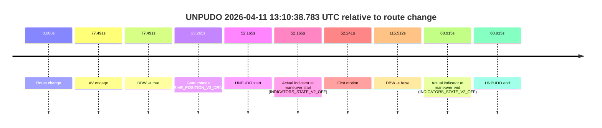
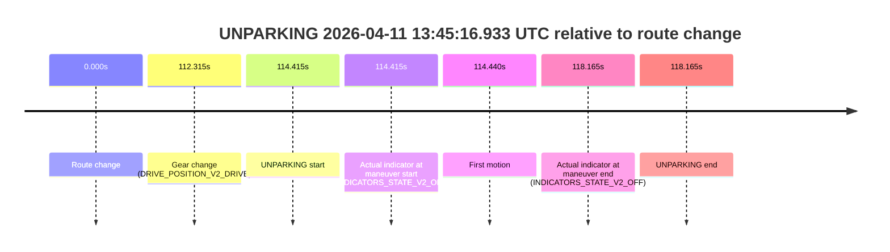

# Run Report: fme20018/2026-04-11--12-53-46--gen2-av-b1d27442-9fb3-448c-91b7-790e1623473f

| Field | Value |
|---|---|
| Run ID | `fme20018/2026-04-11--12-53-46--gen2-av-b1d27442-9fb3-448c-91b7-790e1623473f` |
| Date | `2026-04-11` |
| Model(s) | `lively-orange-horse` |
| Author | `guy.geva` |
| Event count | `2` |

## unpudo 2026-04-11 13:10:38.783 UTC

| Field | Value |
|---|---|
| Model | `lively-orange-horse` |
| Author | `guy.geva` |
| Run ID | `fme20018/2026-04-11--12-53-46--gen2-av-b1d27442-9fb3-448c-91b7-790e1623473f` |
| Date | `2026-04-11` |
| Time (UTC) | `13:10:38.783` |
| Event type | `unpudo` |
| Disengagement type | `failed_to_unpudo` |
| Route change | `found` |
| Console | [run](https://console.sso.wayve.ai/run/fme20018/2026-04-11--12-53-46--gen2-av-b1d27442-9fb3-448c-91b7-790e1623473f?id=&time-unixus=1775913038783292) |
| Foxglove | [segment](https://app.foxglove.dev/wayve-on-prem/p/prj_0dX18KZdVHg1fmmI/view?ds=foxglove-stream&ds.deviceName=fme20018&ds.start=2026-04-11T13%3A09%3A36.618359Z&ds.end=2026-04-11T13%3A11%3A52.130072Z&layoutId=lay_0e7VD4WIKDQGU73Y&time=2026-04-11T13%3A10%3A38.783292Z) |

### Event card: accidental

- Accidental: AV ownership is present for less than `2s`, so this is treated as an accidental brush with the maneuver rather than a meaningful model attempt.

| Event | Time (UTC) | Delta from route change |
|---|---:|---:|
| Route change | 2026-04-11 13:09:46.618 | `0.000s` |
| AV engage | 2026-04-11 13:11:04.109 | `77.491s` |
| DBW -> true | 2026-04-11 13:11:04.109 | `77.491s` |
| Gear change (DRIVE_POSITION_V2_DRIVE) | 2026-04-11 13:10:09.883 | `23.265s` |
| UNPUDO start | 2026-04-11 13:10:38.783 | `52.165s` |
| Actual indicator at maneuver start (INDICATORS_STATE_V2_OFF) | 2026-04-11 13:10:38.783 | `52.165s` |
| First motion | 2026-04-11 13:10:38.859 | `52.241s` |
| DBW -> false | 2026-04-11 13:11:42.130 | `115.512s` |
| Actual indicator at maneuver end (INDICATORS_STATE_V2_OFF) | 2026-04-11 13:10:47.533 | `60.915s` |
| UNPUDO end | 2026-04-11 13:10:47.533 | `60.915s` |

| Metric | Value |
|---|---|
| Outcome | `accidental` |
| Effective failure type | `none` |
| Route change status | `found` |
| DBW at event start | `false` |
| DBW at event end | `false` |
| Predicted gear at AV start | `DRIVE_POSITION_V2_DRIVE` |
| Actual gear at AV start | `DRIVE_POSITION_V2_DRIVE` |
| Predicted gear at event start | `DRIVE_POSITION_V2_DRIVE` |
| Actual gear at event start | `DRIVE_POSITION_V2_DRIVE` |
| Planned indicator direction | `INDICATORS_STATE_V2_LEFT_ON` |
| Controller indicator direction | `INDICATORS_STATE_V2_LEFT_ON` |
| Actual indicator direction | `INDICATORS_STATE_V2_OFF` |
| Actual indicator at maneuver end | `INDICATORS_STATE_V2_OFF` |
| Driver accel help in AV | `false` |
| Driver accel help timestamp | `n/a` |
| Max accel pedal pct in AV | `0.0%` |
| Max brake pedal pct in AV | `0.0%` |
| Max speed mps in AV | `0.000` |
| Route -> AV | `77.491s` |
| AV -> event start | `-25.326s` |
| AV -> first motion | `-25.250s` |
| AV duration before disengagement | `38.021s` |
| Trajectory waypoint count | `37` |
| Driving-plan step count | `11` |

The scored portion starts from the AV-owned window, not from the pre-AV setup. Route-change search in the stopped pre-event segment was `found`, with the baseline therefore set to route change. At the event anchor the model predicts `DRIVE_POSITION_V2_DRIVE` and the actual gear is `DRIVE_POSITION_V2_DRIVE`. The effective model outcome is `accidental` because `the AV-owned portion is shorter than 2s`.

### Resolution

| Field | Value |
|---|---|
| Final outcome | `accidental` |
| Do we agree with this label? | `yes` |
| Source disengagement type | `failed_to_unpudo` |
| Resolved effective failure type | `none` |
| Confidence | `high` |

## unparking 2026-04-11 13:45:16.933 UTC

| Field | Value |
|---|---|
| Model | `lively-orange-horse` |
| Author | `guy.geva` |
| Run ID | `fme20018/2026-04-11--12-53-46--gen2-av-b1d27442-9fb3-448c-91b7-790e1623473f` |
| Date | `2026-04-11` |
| Time (UTC) | `13:45:16.933` |
| Event type | `unparking` |
| Disengagement type | `none observed` |
| Route change | `found` |
| Console | [run](https://console.sso.wayve.ai/run/fme20018/2026-04-11--12-53-46--gen2-av-b1d27442-9fb3-448c-91b7-790e1623473f?id=&time-unixus=1775915116933307) |
| Foxglove | [segment](https://app.foxglove.dev/wayve-on-prem/p/prj_0dX18KZdVHg1fmmI/view?ds=foxglove-stream&ds.deviceName=fme20018&ds.start=2026-04-11T13%3A43%3A12.518340Z&ds.end=2026-04-11T13%3A45%3A30.683320Z&layoutId=lay_0e7VD4WIKDQGU73Y&time=2026-04-11T13%3A45%3A16.933307Z) |

### Event card: non-av

- Non-AV: the detected unparking starts outside AV ownership, so it is kept for coverage but excluded from model success / failure scoring.

| Event | Time (UTC) | Delta from route change |
|---|---:|---:|
| Route change | 2026-04-11 13:43:22.518 | `0.000s` |
| Gear change (DRIVE_POSITION_V2_DRIVE) | 2026-04-11 13:45:14.833 | `112.315s` |
| UNPARKING start | 2026-04-11 13:45:16.933 | `114.415s` |
| Actual indicator at maneuver start (INDICATORS_STATE_V2_OFF) | 2026-04-11 13:45:16.933 | `114.415s` |
| First motion | 2026-04-11 13:45:16.958 | `114.440s` |
| Actual indicator at maneuver end (INDICATORS_STATE_V2_OFF) | 2026-04-11 13:45:20.683 | `118.165s` |
| UNPARKING end | 2026-04-11 13:45:20.683 | `118.165s` |

| Metric | Value |
|---|---|
| Outcome | `non-av` |
| Effective failure type | `none` |
| Route change status | `found` |
| DBW at event start | `false` |
| DBW at event end | `false` |
| Predicted gear at AV start | `n/a` |
| Actual gear at AV start | `n/a` |
| Predicted gear at event start | `DRIVE_POSITION_V2_DRIVE` |
| Actual gear at event start | `DRIVE_POSITION_V2_DRIVE` |
| Planned indicator direction | `INDICATORS_STATE_V2_OFF` |
| Controller indicator direction | `INDICATORS_STATE_V2_OFF` |
| Actual indicator direction | `INDICATORS_STATE_V2_OFF` |
| Actual indicator at maneuver end | `INDICATORS_STATE_V2_OFF` |
| Driver accel help in AV | `false` |
| Driver accel help timestamp | `n/a` |
| Max accel pedal pct in AV | `0.0%` |
| Max brake pedal pct in AV | `0.0%` |
| Max speed mps in AV | `0.000` |
| Route -> AV | `n/a` |
| AV -> event start | `n/a` |
| AV -> first motion | `n/a` |
| AV duration before disengagement | `n/a` |
| Trajectory waypoint count | `36` |
| Driving-plan step count | `11` |

The scored portion starts from the AV-owned window, not from the pre-AV setup. Route-change search in the stopped pre-event segment was `found`, with the baseline therefore set to route change. At the event anchor the model predicts `DRIVE_POSITION_V2_DRIVE` and the actual gear is `DRIVE_POSITION_V2_DRIVE`. The effective model outcome is `non-av` because `the event does not begin in AV ownership`.

### Resolution

| Field | Value |
|---|---|
| Final outcome | `non-av` |
| Do we agree with this label? | `yes` |
| Source disengagement type | `none observed` |
| Resolved effective failure type | `none` |
| Confidence | `high` |
