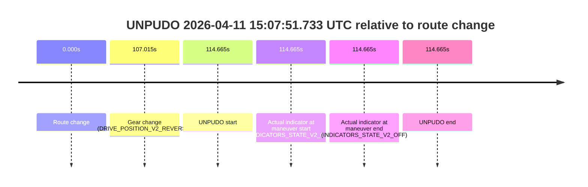
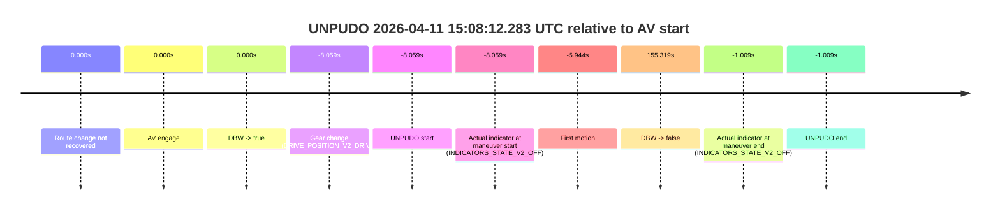
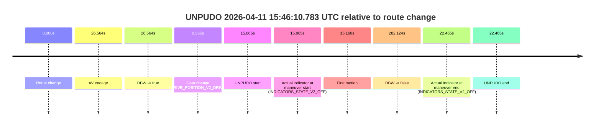
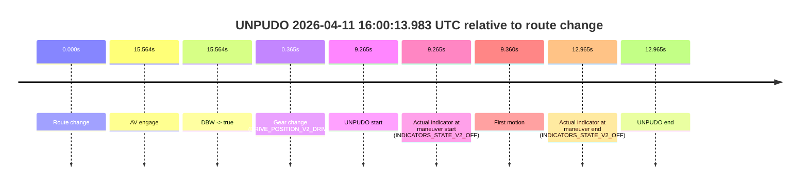

# Run Report: fme20018/2026-04-11--14-26-30--gen2-av-0caee748-55b1-4f2b-9b9e-53c0355ee0fd

| Field | Value |
|---|---|
| Run ID | `fme20018/2026-04-11--14-26-30--gen2-av-0caee748-55b1-4f2b-9b9e-53c0355ee0fd` |
| Date | `2026-04-11` |
| Model(s) | `lively-orange-horse` |
| Author | `guy.geva` |
| Event count | `5` |

## unpudo 2026-04-11 14:53:11.833 UTC

| Field | Value |
|---|---|
| Model | `lively-orange-horse` |
| Author | `guy.geva` |
| Run ID | `fme20018/2026-04-11--14-26-30--gen2-av-0caee748-55b1-4f2b-9b9e-53c0355ee0fd` |
| Date | `2026-04-11` |
| Time (UTC) | `14:53:11.833` |
| Event type | `unpudo` |
| Disengagement type | `none observed` |
| Route change | `found` |
| Console | [run](https://console.sso.wayve.ai/run/fme20018/2026-04-11--14-26-30--gen2-av-0caee748-55b1-4f2b-9b9e-53c0355ee0fd?id=&time-unixus=1775919191833301) |
| Foxglove | [segment](https://app.foxglove.dev/wayve-on-prem/p/prj_0dX18KZdVHg1fmmI/view?ds=foxglove-stream&ds.deviceName=fme20018&ds.start=2026-04-11T14%3A52%3A58.083305Z&ds.end=2026-04-11T14%3A57%3A15.201394Z&layoutId=lay_0e7VD4WIKDQGU73Y&time=2026-04-11T14%3A53%3A11.833301Z) |

### Event card: pass

- Pass: AV owns the credited unpudo through the official event window, the gear state is aligned at the anchor, and the vehicle moves without driver accelerator help in AV.

| Event | Time (UTC) | Delta from route change |
|---|---:|---:|
| Route change | 2026-04-11 14:53:08.868 | `0.000s` |
| AV engage | 2026-04-11 14:53:10.942 | `2.074s` |
| DBW -> true | 2026-04-11 14:53:10.942 | `2.074s` |
| Gear change (DRIVE_POSITION_V2_DRIVE) | 2026-04-11 14:53:08.083 | `-0.785s` |
| UNPUDO start | 2026-04-11 14:53:11.833 | `2.965s` |
| Actual indicator at maneuver start (INDICATORS_STATE_V2_OFF) | 2026-04-11 14:53:11.833 | `2.965s` |
| First motion | 2026-04-11 14:53:11.879 | `3.011s` |
| DBW -> false | 2026-04-11 14:57:05.201 | `236.333s` |
| Actual indicator at maneuver end (INDICATORS_STATE_V2_OFF) | 2026-04-11 14:53:15.233 | `6.365s` |
| UNPUDO end | 2026-04-11 14:53:15.233 | `6.365s` |

| Metric | Value |
|---|---|
| Outcome | `pass` |
| Effective failure type | `none` |
| Route change status | `found` |
| DBW at event start | `true` |
| DBW at event end | `true` |
| Predicted gear at AV start | `DRIVE_POSITION_V2_DRIVE` |
| Actual gear at AV start | `DRIVE_POSITION_V2_DRIVE` |
| Predicted gear at event start | `DRIVE_POSITION_V2_DRIVE` |
| Actual gear at event start | `DRIVE_POSITION_V2_DRIVE` |
| Planned indicator direction | `INDICATORS_STATE_V2_RIGHT_ON` |
| Controller indicator direction | `INDICATORS_STATE_V2_RIGHT_ON` |
| Actual indicator direction | `INDICATORS_STATE_V2_OFF` |
| Actual indicator at maneuver end | `INDICATORS_STATE_V2_OFF` |
| Driver accel help in AV | `false` |
| Driver accel help timestamp | `n/a` |
| Max accel pedal pct in AV | `0.0%` |
| Max brake pedal pct in AV | `0.0%` |
| Max speed mps in AV | `5.122` |
| Route -> AV | `2.074s` |
| AV -> event start | `0.891s` |
| AV -> first motion | `0.937s` |
| AV duration before disengagement | `234.259s` |
| Trajectory waypoint count | `36` |
| Driving-plan step count | `11` |

The scored portion starts from the AV-owned window, not from the pre-AV setup. Route-change search in the stopped pre-event segment was `found`, with the baseline therefore set to route change. At the event anchor the model predicts `DRIVE_POSITION_V2_DRIVE` and the actual gear is `DRIVE_POSITION_V2_DRIVE`. The effective model outcome is `pass` because `the credited maneuver stays AV-owned through the official event end`.

### Resolution

| Field | Value |
|---|---|
| Final outcome | `pass` |
| Do we agree with this label? | `yes` |
| Source disengagement type | `none observed` |
| Resolved effective failure type | `none` |
| Confidence | `high` |

## unpudo 2026-04-11 15:07:51.733 UTC

| Field | Value |
|---|---|
| Model | `lively-orange-horse` |
| Author | `guy.geva` |
| Run ID | `fme20018/2026-04-11--14-26-30--gen2-av-0caee748-55b1-4f2b-9b9e-53c0355ee0fd` |
| Date | `2026-04-11` |
| Time (UTC) | `15:07:51.733` |
| Event type | `unpudo` |
| Disengagement type | `none observed` |
| Route change | `found` |
| Console | [run](https://console.sso.wayve.ai/run/fme20018/2026-04-11--14-26-30--gen2-av-0caee748-55b1-4f2b-9b9e-53c0355ee0fd?id=&time-unixus=1775920071733297) |
| Foxglove | [segment](https://app.foxglove.dev/wayve-on-prem/p/prj_0dX18KZdVHg1fmmI/view?ds=foxglove-stream&ds.deviceName=fme20018&ds.start=2026-04-11T15%3A05%3A47.068322Z&ds.end=2026-04-11T15%3A08%3A01.733297Z&layoutId=lay_0e7VD4WIKDQGU73Y&time=2026-04-11T15%3A07%3A51.733297Z) |

### Event card: non-av

- Non-AV: the detected unpudo starts outside AV ownership, so it is kept for coverage but excluded from model success / failure scoring.

| Event | Time (UTC) | Delta from route change |
|---|---:|---:|
| Route change | 2026-04-11 15:05:57.068 | `0.000s` |
| Gear change (DRIVE_POSITION_V2_REVERSE) | 2026-04-11 15:07:44.083 | `107.015s` |
| UNPUDO start | 2026-04-11 15:07:51.733 | `114.665s` |
| Actual indicator at maneuver start (INDICATORS_STATE_V2_OFF) | 2026-04-11 15:07:51.733 | `114.665s` |
| Actual indicator at maneuver end (INDICATORS_STATE_V2_OFF) | 2026-04-11 15:07:51.733 | `114.665s` |
| UNPUDO end | 2026-04-11 15:07:51.733 | `114.665s` |

| Metric | Value |
|---|---|
| Outcome | `non-av` |
| Effective failure type | `none` |
| Route change status | `found` |
| DBW at event start | `false` |
| DBW at event end | `false` |
| Predicted gear at AV start | `n/a` |
| Actual gear at AV start | `n/a` |
| Predicted gear at event start | `DRIVE_POSITION_V2_DRIVE` |
| Actual gear at event start | `DRIVE_POSITION_V2_REVERSE` |
| Planned indicator direction | `INDICATORS_STATE_V2_OFF` |
| Controller indicator direction | `INDICATORS_STATE_V2_OFF` |
| Actual indicator direction | `INDICATORS_STATE_V2_OFF` |
| Actual indicator at maneuver end | `INDICATORS_STATE_V2_OFF` |
| Driver accel help in AV | `false` |
| Driver accel help timestamp | `n/a` |
| Max accel pedal pct in AV | `0.0%` |
| Max brake pedal pct in AV | `0.0%` |
| Max speed mps in AV | `0.000` |
| Route -> AV | `n/a` |
| AV -> event start | `n/a` |
| AV -> first motion | `n/a` |
| AV duration before disengagement | `n/a` |
| Trajectory waypoint count | `36` |
| Driving-plan step count | `11` |

The scored portion starts from the AV-owned window, not from the pre-AV setup. Route-change search in the stopped pre-event segment was `found`, with the baseline therefore set to route change. At the event anchor the model predicts `DRIVE_POSITION_V2_DRIVE` and the actual gear is `DRIVE_POSITION_V2_REVERSE`. The effective model outcome is `non-av` because `the event does not begin in AV ownership`.

### Resolution

| Field | Value |
|---|---|
| Final outcome | `non-av` |
| Do we agree with this label? | `yes` |
| Source disengagement type | `none observed` |
| Resolved effective failure type | `none` |
| Confidence | `high` |

## unpudo 2026-04-11 15:08:12.283 UTC

| Field | Value |
|---|---|
| Model | `lively-orange-horse` |
| Author | `guy.geva` |
| Run ID | `fme20018/2026-04-11--14-26-30--gen2-av-0caee748-55b1-4f2b-9b9e-53c0355ee0fd` |
| Date | `2026-04-11` |
| Time (UTC) | `15:08:12.283` |
| Event type | `unpudo` |
| Disengagement type | `none observed` |
| Route change | `not found` |
| Console | [run](https://console.sso.wayve.ai/run/fme20018/2026-04-11--14-26-30--gen2-av-0caee748-55b1-4f2b-9b9e-53c0355ee0fd?id=&time-unixus=1775920092283313) |
| Foxglove | [segment](https://app.foxglove.dev/wayve-on-prem/p/prj_0dX18KZdVHg1fmmI/view?ds=foxglove-stream&ds.deviceName=fme20018&ds.start=2026-04-11T15%3A08%3A02.283313Z&ds.end=2026-04-11T15%3A11%3A05.661075Z&layoutId=lay_0e7VD4WIKDQGU73Y&time=2026-04-11T15%3A08%3A12.283313Z) |

### Event card: accidental

- Accidental: AV ownership is present for less than `2s`, so this is treated as an accidental brush with the maneuver rather than a meaningful model attempt.

| Event | Time (UTC) | Delta from AV start |
|---|---:|---:|
| Route change not recovered | 2026-04-11 15:08:20.342 | `0.000s` |
| AV engage | 2026-04-11 15:08:20.342 | `0.000s` |
| DBW -> true | 2026-04-11 15:08:20.342 | `0.000s` |
| Gear change (DRIVE_POSITION_V2_DRIVE) | 2026-04-11 15:08:12.283 | `-8.059s` |
| UNPUDO start | 2026-04-11 15:08:12.283 | `-8.059s` |
| Actual indicator at maneuver start (INDICATORS_STATE_V2_OFF) | 2026-04-11 15:08:12.283 | `-8.059s` |
| First motion | 2026-04-11 15:08:14.398 | `-5.944s` |
| DBW -> false | 2026-04-11 15:10:55.661 | `155.319s` |
| Actual indicator at maneuver end (INDICATORS_STATE_V2_OFF) | 2026-04-11 15:08:19.333 | `-1.009s` |
| UNPUDO end | 2026-04-11 15:08:19.333 | `-1.009s` |

| Metric | Value |
|---|---|
| Outcome | `accidental` |
| Effective failure type | `none` |
| Route change status | `not found` |
| DBW at event start | `false` |
| DBW at event end | `false` |
| Predicted gear at AV start | `DRIVE_POSITION_V2_DRIVE` |
| Actual gear at AV start | `DRIVE_POSITION_V2_DRIVE` |
| Predicted gear at event start | `DRIVE_POSITION_V2_DRIVE` |
| Actual gear at event start | `DRIVE_POSITION_V2_DRIVE` |
| Planned indicator direction | `INDICATORS_STATE_V2_OFF` |
| Controller indicator direction | `INDICATORS_STATE_V2_OFF` |
| Actual indicator direction | `INDICATORS_STATE_V2_OFF` |
| Actual indicator at maneuver end | `INDICATORS_STATE_V2_OFF` |
| Driver accel help in AV | `false` |
| Driver accel help timestamp | `n/a` |
| Max accel pedal pct in AV | `0.0%` |
| Max brake pedal pct in AV | `0.0%` |
| Max speed mps in AV | `0.000` |
| Route -> AV | `n/a` |
| AV -> event start | `-8.059s` |
| AV -> first motion | `-5.944s` |
| AV duration before disengagement | `155.319s` |
| Trajectory waypoint count | `37` |
| Driving-plan step count | `11` |

The scored portion starts from the AV-owned window, not from the pre-AV setup. Route-change search in the stopped pre-event segment was `not found`, with the baseline therefore set to AV start. At the event anchor the model predicts `DRIVE_POSITION_V2_DRIVE` and the actual gear is `DRIVE_POSITION_V2_DRIVE`. The effective model outcome is `accidental` because `the AV-owned portion is shorter than 2s`.

### Resolution

| Field | Value |
|---|---|
| Final outcome | `accidental` |
| Do we agree with this label? | `yes` |
| Source disengagement type | `none observed` |
| Resolved effective failure type | `none` |
| Confidence | `high` |

## unpudo 2026-04-11 15:46:10.783 UTC

| Field | Value |
|---|---|
| Model | `lively-orange-horse` |
| Author | `guy.geva` |
| Run ID | `fme20018/2026-04-11--14-26-30--gen2-av-0caee748-55b1-4f2b-9b9e-53c0355ee0fd` |
| Date | `2026-04-11` |
| Time (UTC) | `15:46:10.783` |
| Event type | `unpudo` |
| Disengagement type | `failed_to_unpudo` |
| Route change | `found` |
| Console | [run](https://console.sso.wayve.ai/run/fme20018/2026-04-11--14-26-30--gen2-av-0caee748-55b1-4f2b-9b9e-53c0355ee0fd?id=&time-unixus=1775922370783318) |
| Foxglove | [segment](https://app.foxglove.dev/wayve-on-prem/p/prj_0dX18KZdVHg1fmmI/view?ds=foxglove-stream&ds.deviceName=fme20018&ds.start=2026-04-11T15%3A45%3A45.718258Z&ds.end=2026-04-11T15%3A50%3A47.842389Z&layoutId=lay_0e7VD4WIKDQGU73Y&time=2026-04-11T15%3A46%3A10.783318Z) |

### Event card: accidental

- Accidental: AV ownership is present for less than `2s`, so this is treated as an accidental brush with the maneuver rather than a meaningful model attempt.

| Event | Time (UTC) | Delta from route change |
|---|---:|---:|
| Route change | 2026-04-11 15:45:55.718 | `0.000s` |
| AV engage | 2026-04-11 15:46:22.282 | `26.564s` |
| DBW -> true | 2026-04-11 15:46:22.282 | `26.564s` |
| Gear change (DRIVE_POSITION_V2_DRIVE) | 2026-04-11 15:45:56.083 | `0.365s` |
| UNPUDO start | 2026-04-11 15:46:10.783 | `15.065s` |
| Actual indicator at maneuver start (INDICATORS_STATE_V2_OFF) | 2026-04-11 15:46:10.783 | `15.065s` |
| First motion | 2026-04-11 15:46:10.878 | `15.160s` |
| DBW -> false | 2026-04-11 15:50:37.842 | `282.124s` |
| Actual indicator at maneuver end (INDICATORS_STATE_V2_OFF) | 2026-04-11 15:46:18.183 | `22.465s` |
| UNPUDO end | 2026-04-11 15:46:18.183 | `22.465s` |

| Metric | Value |
|---|---|
| Outcome | `accidental` |
| Effective failure type | `none` |
| Route change status | `found` |
| DBW at event start | `false` |
| DBW at event end | `false` |
| Predicted gear at AV start | `DRIVE_POSITION_V2_DRIVE` |
| Actual gear at AV start | `DRIVE_POSITION_V2_DRIVE` |
| Predicted gear at event start | `DRIVE_POSITION_V2_DRIVE` |
| Actual gear at event start | `DRIVE_POSITION_V2_DRIVE` |
| Planned indicator direction | `INDICATORS_STATE_V2_OFF` |
| Controller indicator direction | `INDICATORS_STATE_V2_OFF` |
| Actual indicator direction | `INDICATORS_STATE_V2_OFF` |
| Actual indicator at maneuver end | `INDICATORS_STATE_V2_OFF` |
| Driver accel help in AV | `false` |
| Driver accel help timestamp | `n/a` |
| Max accel pedal pct in AV | `0.0%` |
| Max brake pedal pct in AV | `0.0%` |
| Max speed mps in AV | `0.000` |
| Route -> AV | `26.564s` |
| AV -> event start | `-11.499s` |
| AV -> first motion | `-11.404s` |
| AV duration before disengagement | `255.560s` |
| Trajectory waypoint count | `37` |
| Driving-plan step count | `11` |

The scored portion starts from the AV-owned window, not from the pre-AV setup. Route-change search in the stopped pre-event segment was `found`, with the baseline therefore set to route change. At the event anchor the model predicts `DRIVE_POSITION_V2_DRIVE` and the actual gear is `DRIVE_POSITION_V2_DRIVE`. The effective model outcome is `accidental` because `the AV-owned portion is shorter than 2s`.

### Resolution

| Field | Value |
|---|---|
| Final outcome | `accidental` |
| Do we agree with this label? | `yes` |
| Source disengagement type | `failed_to_unpudo` |
| Resolved effective failure type | `none` |
| Confidence | `high` |

## unpudo 2026-04-11 16:00:13.983 UTC

| Field | Value |
|---|---|
| Model | `lively-orange-horse` |
| Author | `guy.geva` |
| Run ID | `fme20018/2026-04-11--14-26-30--gen2-av-0caee748-55b1-4f2b-9b9e-53c0355ee0fd` |
| Date | `2026-04-11` |
| Time (UTC) | `16:00:13.983` |
| Event type | `unpudo` |
| Disengagement type | `none observed` |
| Route change | `found` |
| Console | [run](https://console.sso.wayve.ai/run/fme20018/2026-04-11--14-26-30--gen2-av-0caee748-55b1-4f2b-9b9e-53c0355ee0fd?id=&time-unixus=1775923213983309) |
| Foxglove | [segment](https://app.foxglove.dev/wayve-on-prem/p/prj_0dX18KZdVHg1fmmI/view?ds=foxglove-stream&ds.deviceName=fme20018&ds.start=2026-04-11T15%3A59%3A54.718662Z&ds.end=2026-04-11T16%3A00%3A27.683318Z&layoutId=lay_0e7VD4WIKDQGU73Y&time=2026-04-11T16%3A00%3A13.983309Z) |

### Event card: accidental

- Accidental: AV ownership is present for less than `2s`, so this is treated as an accidental brush with the maneuver rather than a meaningful model attempt.

| Event | Time (UTC) | Delta from route change |
|---|---:|---:|
| Route change | 2026-04-11 16:00:04.718 | `0.000s` |
| AV engage | 2026-04-11 16:00:20.282 | `15.564s` |
| DBW -> true | 2026-04-11 16:00:20.282 | `15.564s` |
| Gear change (DRIVE_POSITION_V2_DRIVE) | 2026-04-11 16:00:05.083 | `0.365s` |
| UNPUDO start | 2026-04-11 16:00:13.983 | `9.265s` |
| Actual indicator at maneuver start (INDICATORS_STATE_V2_OFF) | 2026-04-11 16:00:13.983 | `9.265s` |
| First motion | 2026-04-11 16:00:14.078 | `9.360s` |
| Actual indicator at maneuver end (INDICATORS_STATE_V2_OFF) | 2026-04-11 16:00:17.683 | `12.965s` |
| UNPUDO end | 2026-04-11 16:00:17.683 | `12.965s` |

| Metric | Value |
|---|---|
| Outcome | `accidental` |
| Effective failure type | `none` |
| Route change status | `found` |
| DBW at event start | `false` |
| DBW at event end | `false` |
| Predicted gear at AV start | `DRIVE_POSITION_V2_DRIVE` |
| Actual gear at AV start | `DRIVE_POSITION_V2_DRIVE` |
| Predicted gear at event start | `DRIVE_POSITION_V2_DRIVE` |
| Actual gear at event start | `DRIVE_POSITION_V2_DRIVE` |
| Planned indicator direction | `INDICATORS_STATE_V2_RIGHT_ON` |
| Controller indicator direction | `INDICATORS_STATE_V2_RIGHT_ON` |
| Actual indicator direction | `INDICATORS_STATE_V2_OFF` |
| Actual indicator at maneuver end | `INDICATORS_STATE_V2_OFF` |
| Driver accel help in AV | `false` |
| Driver accel help timestamp | `n/a` |
| Max accel pedal pct in AV | `0.0%` |
| Max brake pedal pct in AV | `0.0%` |
| Max speed mps in AV | `0.000` |
| Route -> AV | `15.564s` |
| AV -> event start | `-6.299s` |
| AV -> first motion | `-6.204s` |
| AV duration before disengagement | `n/a` |
| Trajectory waypoint count | `37` |
| Driving-plan step count | `11` |

The scored portion starts from the AV-owned window, not from the pre-AV setup. Route-change search in the stopped pre-event segment was `found`, with the baseline therefore set to route change. At the event anchor the model predicts `DRIVE_POSITION_V2_DRIVE` and the actual gear is `DRIVE_POSITION_V2_DRIVE`. The effective model outcome is `accidental` because `the AV-owned portion is shorter than 2s`.

### Resolution

| Field | Value |
|---|---|
| Final outcome | `accidental` |
| Do we agree with this label? | `yes` |
| Source disengagement type | `none observed` |
| Resolved effective failure type | `none` |
| Confidence | `high` |
