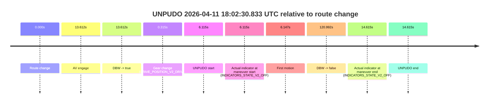
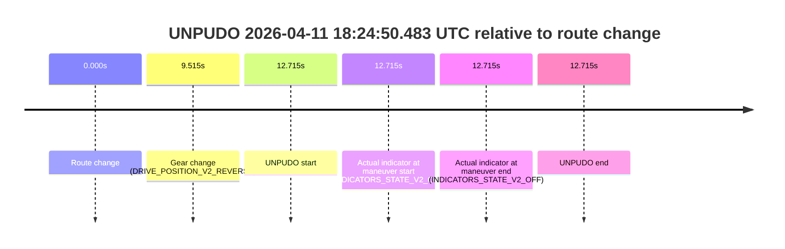
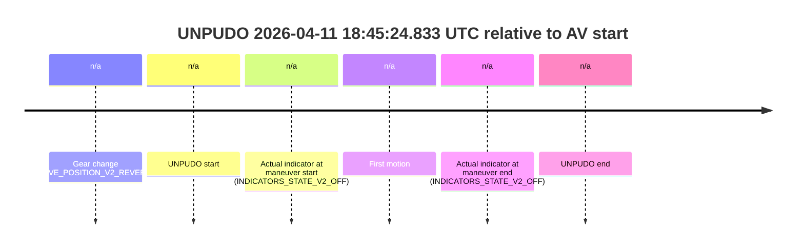
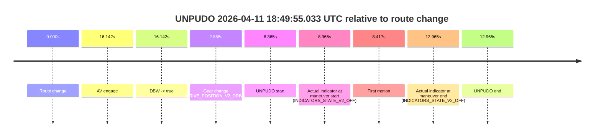

# Run Report: fme20018/2026-04-11--16-58-25--gen2-av-bcf442c9-d636-4f24-b02b-4feafae13967

| Field | Value |
|---|---|
| Run ID | `fme20018/2026-04-11--16-58-25--gen2-av-bcf442c9-d636-4f24-b02b-4feafae13967` |
| Date | `2026-04-11` |
| Model(s) | `lively-orange-horse` |
| Author | `guy.geva` |
| Event count | `7` |

## unpudo 2026-04-11 17:08:17.083 UTC

| Field | Value |
|---|---|
| Model | `lively-orange-horse` |
| Author | `guy.geva` |
| Run ID | `fme20018/2026-04-11--16-58-25--gen2-av-bcf442c9-d636-4f24-b02b-4feafae13967` |
| Date | `2026-04-11` |
| Time (UTC) | `17:08:17.083` |
| Event type | `unpudo` |
| Disengagement type | `failed_to_unpudo` |
| Route change | `found` |
| Console | [run](https://console.sso.wayve.ai/run/fme20018/2026-04-11--16-58-25--gen2-av-bcf442c9-d636-4f24-b02b-4feafae13967?id=&time-unixus=1775927297083312) |
| Foxglove | [segment](https://app.foxglove.dev/wayve-on-prem/p/prj_0dX18KZdVHg1fmmI/view?ds=foxglove-stream&ds.deviceName=fme20018&ds.start=2026-04-11T17%3A06%3A48.368673Z&ds.end=2026-04-11T17%3A11%3A27.669636Z&layoutId=lay_0e7VD4WIKDQGU73Y&time=2026-04-11T17%3A08%3A17.083312Z) |

### Event card: accidental

- Accidental: AV ownership is present for less than `2s`, so this is treated as an accidental brush with the maneuver rather than a meaningful model attempt.

| Event | Time (UTC) | Delta from route change |
|---|---:|---:|
| Route change | 2026-04-11 17:06:58.368 | `0.000s` |
| AV engage | 2026-04-11 17:08:29.350 | `90.982s` |
| DBW -> true | 2026-04-11 17:08:29.350 | `90.982s` |
| Gear change (DRIVE_POSITION_V2_DRIVE) | 2026-04-11 17:07:56.533 | `58.165s` |
| UNPUDO start | 2026-04-11 17:08:17.083 | `78.715s` |
| Actual indicator at maneuver start (INDICATORS_STATE_V2_OFF) | 2026-04-11 17:08:17.083 | `78.715s` |
| First motion | 2026-04-11 17:08:17.125 | `78.757s` |
| DBW -> false | 2026-04-11 17:11:17.669 | `259.301s` |
| Actual indicator at maneuver end (INDICATORS_STATE_V2_OFF) | 2026-04-11 17:08:21.533 | `83.165s` |
| UNPUDO end | 2026-04-11 17:08:21.533 | `83.165s` |

| Metric | Value |
|---|---|
| Outcome | `accidental` |
| Effective failure type | `none` |
| Route change status | `found` |
| DBW at event start | `false` |
| DBW at event end | `false` |
| Predicted gear at AV start | `DRIVE_POSITION_V2_DRIVE` |
| Actual gear at AV start | `DRIVE_POSITION_V2_DRIVE` |
| Predicted gear at event start | `DRIVE_POSITION_V2_DRIVE` |
| Actual gear at event start | `DRIVE_POSITION_V2_DRIVE` |
| Planned indicator direction | `INDICATORS_STATE_V2_LEFT_ON` |
| Controller indicator direction | `INDICATORS_STATE_V2_LEFT_ON` |
| Actual indicator direction | `INDICATORS_STATE_V2_OFF` |
| Actual indicator at maneuver end | `INDICATORS_STATE_V2_OFF` |
| Driver accel help in AV | `false` |
| Driver accel help timestamp | `n/a` |
| Max accel pedal pct in AV | `0.0%` |
| Max brake pedal pct in AV | `0.0%` |
| Max speed mps in AV | `0.000` |
| Route -> AV | `90.982s` |
| AV -> event start | `-12.268s` |
| AV -> first motion | `-12.225s` |
| AV duration before disengagement | `168.319s` |
| Trajectory waypoint count | `37` |
| Driving-plan step count | `11` |

The scored portion starts from the AV-owned window, not from the pre-AV setup. Route-change search in the stopped pre-event segment was `found`, with the baseline therefore set to route change. At the event anchor the model predicts `DRIVE_POSITION_V2_DRIVE` and the actual gear is `DRIVE_POSITION_V2_DRIVE`. The effective model outcome is `accidental` because `the AV-owned portion is shorter than 2s`.

### Resolution

| Field | Value |
|---|---|
| Final outcome | `accidental` |
| Do we agree with this label? | `yes` |
| Source disengagement type | `failed_to_unpudo` |
| Resolved effective failure type | `none` |
| Confidence | `high` |

## unpudo 2026-04-11 17:28:06.433 UTC

| Field | Value |
|---|---|
| Model | `lively-orange-horse` |
| Author | `guy.geva` |
| Run ID | `fme20018/2026-04-11--16-58-25--gen2-av-bcf442c9-d636-4f24-b02b-4feafae13967` |
| Date | `2026-04-11` |
| Time (UTC) | `17:28:06.433` |
| Event type | `unpudo` |
| Disengagement type | `failed_to_unpudo` |
| Route change | `found` |
| Console | [run](https://console.sso.wayve.ai/run/fme20018/2026-04-11--16-58-25--gen2-av-bcf442c9-d636-4f24-b02b-4feafae13967?id=&time-unixus=1775928486433304) |
| Foxglove | [segment](https://app.foxglove.dev/wayve-on-prem/p/prj_0dX18KZdVHg1fmmI/view?ds=foxglove-stream&ds.deviceName=fme20018&ds.start=2026-04-11T17%3A27%3A45.519480Z&ds.end=2026-04-11T17%3A28%3A37.910815Z&layoutId=lay_0e7VD4WIKDQGU73Y&time=2026-04-11T17%3A28%3A06.433304Z) |

### Event card: accidental

- Accidental: AV ownership is present for less than `2s`, so this is treated as an accidental brush with the maneuver rather than a meaningful model attempt.

| Event | Time (UTC) | Delta from route change |
|---|---:|---:|
| Route change | 2026-04-11 17:27:55.519 | `0.000s` |
| AV engage | 2026-04-11 17:28:15.450 | `19.931s` |
| DBW -> true | 2026-04-11 17:28:15.450 | `19.931s` |
| Gear change (DRIVE_POSITION_V2_DRIVE) | 2026-04-11 17:28:01.483 | `5.964s` |
| UNPUDO start | 2026-04-11 17:28:06.433 | `10.914s` |
| Actual indicator at maneuver start (INDICATORS_STATE_V2_OFF) | 2026-04-11 17:28:06.433 | `10.914s` |
| First motion | 2026-04-11 17:28:06.585 | `11.066s` |
| DBW -> false | 2026-04-11 17:28:27.910 | `32.391s` |
| Actual indicator at maneuver end (INDICATORS_STATE_V2_OFF) | 2026-04-11 17:28:11.133 | `15.614s` |
| UNPUDO end | 2026-04-11 17:28:11.133 | `15.614s` |

| Metric | Value |
|---|---|
| Outcome | `accidental` |
| Effective failure type | `none` |
| Route change status | `found` |
| DBW at event start | `false` |
| DBW at event end | `false` |
| Predicted gear at AV start | `DRIVE_POSITION_V2_DRIVE` |
| Actual gear at AV start | `DRIVE_POSITION_V2_DRIVE` |
| Predicted gear at event start | `DRIVE_POSITION_V2_DRIVE` |
| Actual gear at event start | `DRIVE_POSITION_V2_DRIVE` |
| Planned indicator direction | `INDICATORS_STATE_V2_RIGHT_ON` |
| Controller indicator direction | `INDICATORS_STATE_V2_RIGHT_ON` |
| Actual indicator direction | `INDICATORS_STATE_V2_OFF` |
| Actual indicator at maneuver end | `INDICATORS_STATE_V2_OFF` |
| Driver accel help in AV | `false` |
| Driver accel help timestamp | `n/a` |
| Max accel pedal pct in AV | `0.0%` |
| Max brake pedal pct in AV | `0.0%` |
| Max speed mps in AV | `0.000` |
| Route -> AV | `19.931s` |
| AV -> event start | `-9.017s` |
| AV -> first motion | `-8.865s` |
| AV duration before disengagement | `12.460s` |
| Trajectory waypoint count | `36` |
| Driving-plan step count | `11` |

The scored portion starts from the AV-owned window, not from the pre-AV setup. Route-change search in the stopped pre-event segment was `found`, with the baseline therefore set to route change. At the event anchor the model predicts `DRIVE_POSITION_V2_DRIVE` and the actual gear is `DRIVE_POSITION_V2_DRIVE`. The effective model outcome is `accidental` because `the AV-owned portion is shorter than 2s`.

### Resolution

| Field | Value |
|---|---|
| Final outcome | `accidental` |
| Do we agree with this label? | `yes` |
| Source disengagement type | `failed_to_unpudo` |
| Resolved effective failure type | `none` |
| Confidence | `high` |

## unpudo 2026-04-11 18:02:30.833 UTC

| Field | Value |
|---|---|
| Model | `lively-orange-horse` |
| Author | `guy.geva` |
| Run ID | `fme20018/2026-04-11--16-58-25--gen2-av-bcf442c9-d636-4f24-b02b-4feafae13967` |
| Date | `2026-04-11` |
| Time (UTC) | `18:02:30.833` |
| Event type | `unpudo` |
| Disengagement type | `failed_to_unpudo` |
| Route change | `found` |
| Console | [run](https://console.sso.wayve.ai/run/fme20018/2026-04-11--16-58-25--gen2-av-bcf442c9-d636-4f24-b02b-4feafae13967?id=&time-unixus=1775930550833296) |
| Foxglove | [segment](https://app.foxglove.dev/wayve-on-prem/p/prj_0dX18KZdVHg1fmmI/view?ds=foxglove-stream&ds.deviceName=fme20018&ds.start=2026-04-11T18%3A02%3A14.718351Z&ds.end=2026-04-11T18%3A04%3A35.710461Z&layoutId=lay_0e7VD4WIKDQGU73Y&time=2026-04-11T18%3A02%3A30.833296Z) |

### Event card: accidental

- Accidental: AV ownership is present for less than `2s`, so this is treated as an accidental brush with the maneuver rather than a meaningful model attempt.

| Event | Time (UTC) | Delta from route change |
|---|---:|---:|
| Route change | 2026-04-11 18:02:24.718 | `0.000s` |
| AV engage | 2026-04-11 18:02:38.330 | `13.612s` |
| DBW -> true | 2026-04-11 18:02:38.330 | `13.612s` |
| Gear change (DRIVE_POSITION_V2_DRIVE) | 2026-04-11 18:02:25.033 | `0.315s` |
| UNPUDO start | 2026-04-11 18:02:30.833 | `6.115s` |
| Actual indicator at maneuver start (INDICATORS_STATE_V2_OFF) | 2026-04-11 18:02:30.833 | `6.115s` |
| First motion | 2026-04-11 18:02:30.865 | `6.147s` |
| DBW -> false | 2026-04-11 18:04:25.710 | `120.992s` |
| Actual indicator at maneuver end (INDICATORS_STATE_V2_OFF) | 2026-04-11 18:02:39.333 | `14.615s` |
| UNPUDO end | 2026-04-11 18:02:39.333 | `14.615s` |

| Metric | Value |
|---|---|
| Outcome | `accidental` |
| Effective failure type | `none` |
| Route change status | `found` |
| DBW at event start | `false` |
| DBW at event end | `true` |
| Predicted gear at AV start | `DRIVE_POSITION_V2_DRIVE` |
| Actual gear at AV start | `DRIVE_POSITION_V2_DRIVE` |
| Predicted gear at event start | `DRIVE_POSITION_V2_DRIVE` |
| Actual gear at event start | `DRIVE_POSITION_V2_DRIVE` |
| Planned indicator direction | `INDICATORS_STATE_V2_LEFT_ON` |
| Controller indicator direction | `INDICATORS_STATE_V2_LEFT_ON` |
| Actual indicator direction | `INDICATORS_STATE_V2_OFF` |
| Actual indicator at maneuver end | `INDICATORS_STATE_V2_OFF` |
| Driver accel help in AV | `false` |
| Driver accel help timestamp | `n/a` |
| Max accel pedal pct in AV | `0.0%` |
| Max brake pedal pct in AV | `0.0%` |
| Max speed mps in AV | `2.269` |
| Route -> AV | `13.612s` |
| AV -> event start | `-7.497s` |
| AV -> first motion | `-7.465s` |
| AV duration before disengagement | `107.380s` |
| Trajectory waypoint count | `36` |
| Driving-plan step count | `11` |

The scored portion starts from the AV-owned window, not from the pre-AV setup. Route-change search in the stopped pre-event segment was `found`, with the baseline therefore set to route change. At the event anchor the model predicts `DRIVE_POSITION_V2_DRIVE` and the actual gear is `DRIVE_POSITION_V2_DRIVE`. The effective model outcome is `accidental` because `the AV-owned portion is shorter than 2s`.

### Resolution

| Field | Value |
|---|---|
| Final outcome | `accidental` |
| Do we agree with this label? | `yes` |
| Source disengagement type | `failed_to_unpudo` |
| Resolved effective failure type | `none` |
| Confidence | `high` |

## unpudo 2026-04-11 18:24:50.483 UTC

| Field | Value |
|---|---|
| Model | `lively-orange-horse` |
| Author | `guy.geva` |
| Run ID | `fme20018/2026-04-11--16-58-25--gen2-av-bcf442c9-d636-4f24-b02b-4feafae13967` |
| Date | `2026-04-11` |
| Time (UTC) | `18:24:50.483` |
| Event type | `unpudo` |
| Disengagement type | `failed_to_unpudo` |
| Route change | `found` |
| Console | [run](https://console.sso.wayve.ai/run/fme20018/2026-04-11--16-58-25--gen2-av-bcf442c9-d636-4f24-b02b-4feafae13967?id=&time-unixus=1775931890483301) |
| Foxglove | [segment](https://app.foxglove.dev/wayve-on-prem/p/prj_0dX18KZdVHg1fmmI/view?ds=foxglove-stream&ds.deviceName=fme20018&ds.start=2026-04-11T18%3A24%3A27.768270Z&ds.end=2026-04-11T18%3A25%3A00.483301Z&layoutId=lay_0e7VD4WIKDQGU73Y&time=2026-04-11T18%3A24%3A50.483301Z) |

### Event card: non-av

- Non-AV: the detected unpudo starts outside AV ownership, so it is kept for coverage but excluded from model success / failure scoring.

| Event | Time (UTC) | Delta from route change |
|---|---:|---:|
| Route change | 2026-04-11 18:24:37.768 | `0.000s` |
| Gear change (DRIVE_POSITION_V2_REVERSE) | 2026-04-11 18:24:47.283 | `9.515s` |
| UNPUDO start | 2026-04-11 18:24:50.483 | `12.715s` |
| Actual indicator at maneuver start (INDICATORS_STATE_V2_OFF) | 2026-04-11 18:24:50.483 | `12.715s` |
| Actual indicator at maneuver end (INDICATORS_STATE_V2_OFF) | 2026-04-11 18:24:50.483 | `12.715s` |
| UNPUDO end | 2026-04-11 18:24:50.483 | `12.715s` |

| Metric | Value |
|---|---|
| Outcome | `non-av` |
| Effective failure type | `none` |
| Route change status | `found` |
| DBW at event start | `false` |
| DBW at event end | `false` |
| Predicted gear at AV start | `n/a` |
| Actual gear at AV start | `n/a` |
| Predicted gear at event start | `DRIVE_POSITION_V2_DRIVE` |
| Actual gear at event start | `DRIVE_POSITION_V2_REVERSE` |
| Planned indicator direction | `INDICATORS_STATE_V2_OFF` |
| Controller indicator direction | `INDICATORS_STATE_V2_OFF` |
| Actual indicator direction | `INDICATORS_STATE_V2_OFF` |
| Actual indicator at maneuver end | `INDICATORS_STATE_V2_OFF` |
| Driver accel help in AV | `false` |
| Driver accel help timestamp | `n/a` |
| Max accel pedal pct in AV | `0.0%` |
| Max brake pedal pct in AV | `0.0%` |
| Max speed mps in AV | `0.000` |
| Route -> AV | `n/a` |
| AV -> event start | `n/a` |
| AV -> first motion | `n/a` |
| AV duration before disengagement | `n/a` |
| Trajectory waypoint count | `37` |
| Driving-plan step count | `11` |

The scored portion starts from the AV-owned window, not from the pre-AV setup. Route-change search in the stopped pre-event segment was `found`, with the baseline therefore set to route change. At the event anchor the model predicts `DRIVE_POSITION_V2_DRIVE` and the actual gear is `DRIVE_POSITION_V2_REVERSE`. The effective model outcome is `non-av` because `the event does not begin in AV ownership`.

### Resolution

| Field | Value |
|---|---|
| Final outcome | `non-av` |
| Do we agree with this label? | `yes` |
| Source disengagement type | `failed_to_unpudo` |
| Resolved effective failure type | `none` |
| Confidence | `high` |

## unpudo 2026-04-11 18:24:59.683 UTC

| Field | Value |
|---|---|
| Model | `lively-orange-horse` |
| Author | `guy.geva` |
| Run ID | `fme20018/2026-04-11--16-58-25--gen2-av-bcf442c9-d636-4f24-b02b-4feafae13967` |
| Date | `2026-04-11` |
| Time (UTC) | `18:24:59.683` |
| Event type | `unpudo` |
| Disengagement type | `none observed` |
| Route change | `found` |
| Console | [run](https://console.sso.wayve.ai/run/fme20018/2026-04-11--16-58-25--gen2-av-bcf442c9-d636-4f24-b02b-4feafae13967?id=&time-unixus=1775931899683301) |
| Foxglove | [segment](https://app.foxglove.dev/wayve-on-prem/p/prj_0dX18KZdVHg1fmmI/view?ds=foxglove-stream&ds.deviceName=fme20018&ds.start=2026-04-11T18%3A24%3A27.768270Z&ds.end=2026-04-11T18%3A27%3A06.749498Z&layoutId=lay_0e7VD4WIKDQGU73Y&time=2026-04-11T18%3A24%3A59.683301Z) |

### Event card: accidental

- Accidental: AV ownership is present for less than `2s`, so this is treated as an accidental brush with the maneuver rather than a meaningful model attempt.

| Event | Time (UTC) | Delta from route change |
|---|---:|---:|
| Route change | 2026-04-11 18:24:37.768 | `0.000s` |
| AV engage | 2026-04-11 18:25:15.190 | `37.422s` |
| DBW -> true | 2026-04-11 18:25:15.190 | `37.422s` |
| Gear change (DRIVE_POSITION_V2_DRIVE) | 2026-04-11 18:24:59.683 | `21.915s` |
| UNPUDO start | 2026-04-11 18:24:59.683 | `21.915s` |
| Actual indicator at maneuver start (INDICATORS_STATE_V2_OFF) | 2026-04-11 18:24:59.683 | `21.915s` |
| First motion | 2026-04-11 18:25:01.325 | `23.557s` |
| DBW -> false | 2026-04-11 18:26:56.749 | `138.981s` |
| Actual indicator at maneuver end (INDICATORS_STATE_V2_LEFT_ON) | 2026-04-11 18:25:09.383 | `31.615s` |
| UNPUDO end | 2026-04-11 18:25:09.383 | `31.615s` |

| Metric | Value |
|---|---|
| Outcome | `accidental` |
| Effective failure type | `none` |
| Route change status | `found` |
| DBW at event start | `false` |
| DBW at event end | `false` |
| Predicted gear at AV start | `DRIVE_POSITION_V2_DRIVE` |
| Actual gear at AV start | `DRIVE_POSITION_V2_DRIVE` |
| Predicted gear at event start | `DRIVE_POSITION_V2_DRIVE` |
| Actual gear at event start | `DRIVE_POSITION_V2_DRIVE` |
| Planned indicator direction | `INDICATORS_STATE_V2_OFF` |
| Controller indicator direction | `INDICATORS_STATE_V2_OFF` |
| Actual indicator direction | `INDICATORS_STATE_V2_OFF` |
| Actual indicator at maneuver end | `INDICATORS_STATE_V2_LEFT_ON` |
| Driver accel help in AV | `false` |
| Driver accel help timestamp | `n/a` |
| Max accel pedal pct in AV | `0.0%` |
| Max brake pedal pct in AV | `0.0%` |
| Max speed mps in AV | `0.000` |
| Route -> AV | `37.422s` |
| AV -> event start | `-15.507s` |
| AV -> first motion | `-13.865s` |
| AV duration before disengagement | `101.559s` |
| Trajectory waypoint count | `37` |
| Driving-plan step count | `11` |

The scored portion starts from the AV-owned window, not from the pre-AV setup. Route-change search in the stopped pre-event segment was `found`, with the baseline therefore set to route change. At the event anchor the model predicts `DRIVE_POSITION_V2_DRIVE` and the actual gear is `DRIVE_POSITION_V2_DRIVE`. The effective model outcome is `accidental` because `the AV-owned portion is shorter than 2s`.

### Resolution

| Field | Value |
|---|---|
| Final outcome | `accidental` |
| Do we agree with this label? | `yes` |
| Source disengagement type | `none observed` |
| Resolved effective failure type | `none` |
| Confidence | `high` |

## unpudo 2026-04-11 18:45:24.833 UTC

| Field | Value |
|---|---|
| Model | `lively-orange-horse` |
| Author | `guy.geva` |
| Run ID | `fme20018/2026-04-11--16-58-25--gen2-av-bcf442c9-d636-4f24-b02b-4feafae13967` |
| Date | `2026-04-11` |
| Time (UTC) | `18:45:24.833` |
| Event type | `unpudo` |
| Disengagement type | `failed_to_unpudo` |
| Route change | `unclear` |
| Console | [run](https://console.sso.wayve.ai/run/fme20018/2026-04-11--16-58-25--gen2-av-bcf442c9-d636-4f24-b02b-4feafae13967?id=&time-unixus=1775933124833307) |
| Foxglove | [segment](https://app.foxglove.dev/wayve-on-prem/p/prj_0dX18KZdVHg1fmmI/view?ds=foxglove-stream&ds.deviceName=fme20018&ds.start=2026-04-11T18%3A45%3A10.783294Z&ds.end=2026-04-11T18%3A46%3A04.433314Z&layoutId=lay_0e7VD4WIKDQGU73Y&time=2026-04-11T18%3A45%3A24.833307Z) |

### Event card: non-av

- Non-AV: the detected unpudo starts outside AV ownership, so it is kept for coverage but excluded from model success / failure scoring.

| Event | Time (UTC) | Delta from AV start |
|---|---:|---:|
| Gear change (DRIVE_POSITION_V2_REVERSE) | 2026-04-11 18:45:20.783 | `n/a` |
| UNPUDO start | 2026-04-11 18:45:24.833 | `n/a` |
| Actual indicator at maneuver start (INDICATORS_STATE_V2_OFF) | 2026-04-11 18:45:24.833 | `n/a` |
| First motion | 2026-04-11 18:45:30.686 | `n/a` |
| Actual indicator at maneuver end (INDICATORS_STATE_V2_OFF) | 2026-04-11 18:45:54.433 | `n/a` |
| UNPUDO end | 2026-04-11 18:45:54.433 | `n/a` |

| Metric | Value |
|---|---|
| Outcome | `non-av` |
| Effective failure type | `none` |
| Route change status | `unclear` |
| DBW at event start | `false` |
| DBW at event end | `false` |
| Predicted gear at AV start | `n/a` |
| Actual gear at AV start | `n/a` |
| Predicted gear at event start | `DRIVE_POSITION_V2_DRIVE` |
| Actual gear at event start | `DRIVE_POSITION_V2_REVERSE` |
| Planned indicator direction | `INDICATORS_STATE_V2_OFF` |
| Controller indicator direction | `INDICATORS_STATE_V2_OFF` |
| Actual indicator direction | `INDICATORS_STATE_V2_OFF` |
| Actual indicator at maneuver end | `INDICATORS_STATE_V2_OFF` |
| Driver accel help in AV | `false` |
| Driver accel help timestamp | `n/a` |
| Max accel pedal pct in AV | `0.0%` |
| Max brake pedal pct in AV | `0.0%` |
| Max speed mps in AV | `0.000` |
| Route -> AV | `n/a` |
| AV -> event start | `n/a` |
| AV -> first motion | `n/a` |
| AV duration before disengagement | `n/a` |
| Trajectory waypoint count | `36` |
| Driving-plan step count | `11` |

The scored portion starts from the AV-owned window, not from the pre-AV setup. Route-change search in the stopped pre-event segment was `unclear`, with the baseline therefore set to AV start. At the event anchor the model predicts `DRIVE_POSITION_V2_DRIVE` and the actual gear is `DRIVE_POSITION_V2_REVERSE`. The effective model outcome is `non-av` because `the event does not begin in AV ownership`.

### Resolution

| Field | Value |
|---|---|
| Final outcome | `non-av` |
| Do we agree with this label? | `yes` |
| Source disengagement type | `failed_to_unpudo` |
| Resolved effective failure type | `none` |
| Confidence | `medium` |

## unpudo 2026-04-11 18:49:55.033 UTC

| Field | Value |
|---|---|
| Model | `lively-orange-horse` |
| Author | `guy.geva` |
| Run ID | `fme20018/2026-04-11--16-58-25--gen2-av-bcf442c9-d636-4f24-b02b-4feafae13967` |
| Date | `2026-04-11` |
| Time (UTC) | `18:49:55.033` |
| Event type | `unpudo` |
| Disengagement type | `failed_to_unpudo` |
| Route change | `found` |
| Console | [run](https://console.sso.wayve.ai/run/fme20018/2026-04-11--16-58-25--gen2-av-bcf442c9-d636-4f24-b02b-4feafae13967?id=&time-unixus=1775933395033311) |
| Foxglove | [segment](https://app.foxglove.dev/wayve-on-prem/p/prj_0dX18KZdVHg1fmmI/view?ds=foxglove-stream&ds.deviceName=fme20018&ds.start=2026-04-11T18%3A49%3A36.668365Z&ds.end=2026-04-11T18%3A50%3A09.633293Z&layoutId=lay_0e7VD4WIKDQGU73Y&time=2026-04-11T18%3A49%3A55.033311Z) |

### Event card: accidental

- Accidental: AV ownership is present for less than `2s`, so this is treated as an accidental brush with the maneuver rather than a meaningful model attempt.

| Event | Time (UTC) | Delta from route change |
|---|---:|---:|
| Route change | 2026-04-11 18:49:46.668 | `0.000s` |
| AV engage | 2026-04-11 18:50:02.809 | `16.142s` |
| DBW -> true | 2026-04-11 18:50:02.809 | `16.142s` |
| Gear change (DRIVE_POSITION_V2_DRIVE) | 2026-04-11 18:49:49.533 | `2.865s` |
| UNPUDO start | 2026-04-11 18:49:55.033 | `8.365s` |
| Actual indicator at maneuver start (INDICATORS_STATE_V2_OFF) | 2026-04-11 18:49:55.033 | `8.365s` |
| First motion | 2026-04-11 18:49:55.085 | `8.417s` |
| Actual indicator at maneuver end (INDICATORS_STATE_V2_OFF) | 2026-04-11 18:49:59.633 | `12.965s` |
| UNPUDO end | 2026-04-11 18:49:59.633 | `12.965s` |

| Metric | Value |
|---|---|
| Outcome | `accidental` |
| Effective failure type | `none` |
| Route change status | `found` |
| DBW at event start | `false` |
| DBW at event end | `false` |
| Predicted gear at AV start | `DRIVE_POSITION_V2_DRIVE` |
| Actual gear at AV start | `DRIVE_POSITION_V2_DRIVE` |
| Predicted gear at event start | `DRIVE_POSITION_V2_DRIVE` |
| Actual gear at event start | `DRIVE_POSITION_V2_DRIVE` |
| Planned indicator direction | `INDICATORS_STATE_V2_RIGHT_ON` |
| Controller indicator direction | `INDICATORS_STATE_V2_RIGHT_ON` |
| Actual indicator direction | `INDICATORS_STATE_V2_OFF` |
| Actual indicator at maneuver end | `INDICATORS_STATE_V2_OFF` |
| Driver accel help in AV | `false` |
| Driver accel help timestamp | `n/a` |
| Max accel pedal pct in AV | `0.0%` |
| Max brake pedal pct in AV | `0.0%` |
| Max speed mps in AV | `0.000` |
| Route -> AV | `16.142s` |
| AV -> event start | `-7.777s` |
| AV -> first motion | `-7.725s` |
| AV duration before disengagement | `n/a` |
| Trajectory waypoint count | `36` |
| Driving-plan step count | `11` |

The scored portion starts from the AV-owned window, not from the pre-AV setup. Route-change search in the stopped pre-event segment was `found`, with the baseline therefore set to route change. At the event anchor the model predicts `DRIVE_POSITION_V2_DRIVE` and the actual gear is `DRIVE_POSITION_V2_DRIVE`. The effective model outcome is `accidental` because `the AV-owned portion is shorter than 2s`.

### Resolution

| Field | Value |
|---|---|
| Final outcome | `accidental` |
| Do we agree with this label? | `yes` |
| Source disengagement type | `failed_to_unpudo` |
| Resolved effective failure type | `none` |
| Confidence | `high` |
