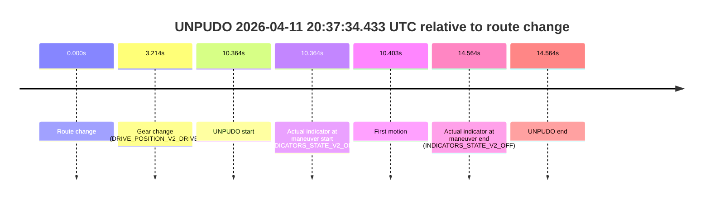
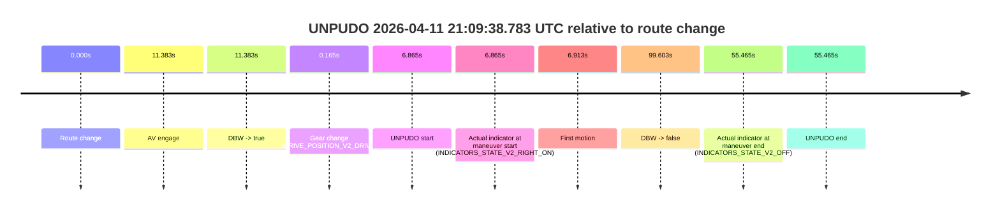
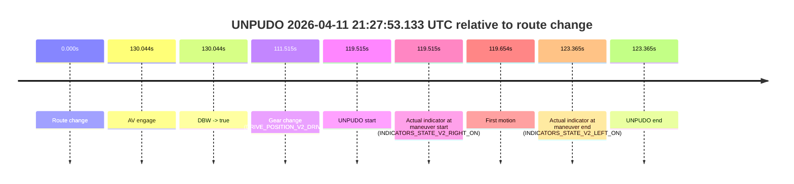

# Run Report: fme20018/2026-04-11--20-28-03--gen2-av-716e575f-b0ee-4e7d-af7e-c096c70b9bd7

| Field | Value |
|---|---|
| Run ID | `fme20018/2026-04-11--20-28-03--gen2-av-716e575f-b0ee-4e7d-af7e-c096c70b9bd7` |
| Date | `2026-04-11` |
| Model(s) | `lively-orange-horse` |
| Author | `guy.geva` |
| Event count | `12` |

## unpudo 2026-04-11 20:37:34.433 UTC

| Field | Value |
|---|---|
| Model | `lively-orange-horse` |
| Author | `guy.geva` |
| Run ID | `fme20018/2026-04-11--20-28-03--gen2-av-716e575f-b0ee-4e7d-af7e-c096c70b9bd7` |
| Date | `2026-04-11` |
| Time (UTC) | `20:37:34.433` |
| Event type | `unpudo` |
| Disengagement type | `failed_to_unpudo` |
| Route change | `found` |
| Console | [run](https://console.sso.wayve.ai/run/fme20018/2026-04-11--20-28-03--gen2-av-716e575f-b0ee-4e7d-af7e-c096c70b9bd7?id=&time-unixus=1775939854433301) |
| Foxglove | [segment](https://app.foxglove.dev/wayve-on-prem/p/prj_0dX18KZdVHg1fmmI/view?ds=foxglove-stream&ds.deviceName=fme20018&ds.start=2026-04-11T20%3A37%3A14.069137Z&ds.end=2026-04-11T20%3A37%3A48.633287Z&layoutId=lay_0e7VD4WIKDQGU73Y&time=2026-04-11T20%3A37%3A34.433301Z) |

### Event card: non-av

- Non-AV: the detected unpudo starts outside AV ownership, so it is kept for coverage but excluded from model success / failure scoring.

| Event | Time (UTC) | Delta from route change |
|---|---:|---:|
| Route change | 2026-04-11 20:37:24.069 | `0.000s` |
| Gear change (DRIVE_POSITION_V2_DRIVE) | 2026-04-11 20:37:27.283 | `3.214s` |
| UNPUDO start | 2026-04-11 20:37:34.433 | `10.364s` |
| Actual indicator at maneuver start (INDICATORS_STATE_V2_OFF) | 2026-04-11 20:37:34.433 | `10.364s` |
| First motion | 2026-04-11 20:37:34.472 | `10.403s` |
| Actual indicator at maneuver end (INDICATORS_STATE_V2_OFF) | 2026-04-11 20:37:38.633 | `14.564s` |
| UNPUDO end | 2026-04-11 20:37:38.633 | `14.564s` |

| Metric | Value |
|---|---|
| Outcome | `non-av` |
| Effective failure type | `none` |
| Route change status | `found` |
| DBW at event start | `false` |
| DBW at event end | `false` |
| Predicted gear at AV start | `n/a` |
| Actual gear at AV start | `n/a` |
| Predicted gear at event start | `DRIVE_POSITION_V2_DRIVE` |
| Actual gear at event start | `DRIVE_POSITION_V2_DRIVE` |
| Planned indicator direction | `INDICATORS_STATE_V2_LEFT_ON` |
| Controller indicator direction | `INDICATORS_STATE_V2_LEFT_ON` |
| Actual indicator direction | `INDICATORS_STATE_V2_OFF` |
| Actual indicator at maneuver end | `INDICATORS_STATE_V2_OFF` |
| Driver accel help in AV | `false` |
| Driver accel help timestamp | `n/a` |
| Max accel pedal pct in AV | `0.0%` |
| Max brake pedal pct in AV | `0.0%` |
| Max speed mps in AV | `0.000` |
| Route -> AV | `n/a` |
| AV -> event start | `n/a` |
| AV -> first motion | `n/a` |
| AV duration before disengagement | `n/a` |
| Trajectory waypoint count | `38` |
| Driving-plan step count | `11` |

The scored portion starts from the AV-owned window, not from the pre-AV setup. Route-change search in the stopped pre-event segment was `found`, with the baseline therefore set to route change. At the event anchor the model predicts `DRIVE_POSITION_V2_DRIVE` and the actual gear is `DRIVE_POSITION_V2_DRIVE`. The effective model outcome is `non-av` because `the event does not begin in AV ownership`.

### Resolution

| Field | Value |
|---|---|
| Final outcome | `non-av` |
| Do we agree with this label? | `yes` |
| Source disengagement type | `failed_to_unpudo` |
| Resolved effective failure type | `none` |
| Confidence | `high` |

## unpudo 2026-04-11 20:45:17.633 UTC

| Field | Value |
|---|---|
| Model | `lively-orange-horse` |
| Author | `guy.geva` |
| Run ID | `fme20018/2026-04-11--20-28-03--gen2-av-716e575f-b0ee-4e7d-af7e-c096c70b9bd7` |
| Date | `2026-04-11` |
| Time (UTC) | `20:45:17.633` |
| Event type | `unpudo` |
| Disengagement type | `failed_to_unpudo` |
| Route change | `found` |
| Console | [run](https://console.sso.wayve.ai/run/fme20018/2026-04-11--20-28-03--gen2-av-716e575f-b0ee-4e7d-af7e-c096c70b9bd7?id=&time-unixus=1775940317633293) |
| Foxglove | [segment](https://app.foxglove.dev/wayve-on-prem/p/prj_0dX18KZdVHg1fmmI/view?ds=foxglove-stream&ds.deviceName=fme20018&ds.start=2026-04-11T20%3A45%3A02.468343Z&ds.end=2026-04-11T20%3A46%3A52.381523Z&layoutId=lay_0e7VD4WIKDQGU73Y&time=2026-04-11T20%3A45%3A17.633293Z) |

### Event card: accidental

- Accidental: AV ownership is present for less than `2s`, so this is treated as an accidental brush with the maneuver rather than a meaningful model attempt.

| Event | Time (UTC) | Delta from route change |
|---|---:|---:|
| Route change | 2026-04-11 20:45:12.468 | `0.000s` |
| AV engage | 2026-04-11 20:45:24.242 | `11.774s` |
| DBW -> true | 2026-04-11 20:45:24.242 | `11.774s` |
| Gear change (DRIVE_POSITION_V2_DRIVE) | 2026-04-11 20:45:13.533 | `1.065s` |
| UNPUDO start | 2026-04-11 20:45:17.633 | `5.165s` |
| Actual indicator at maneuver start (INDICATORS_STATE_V2_OFF) | 2026-04-11 20:45:17.633 | `5.165s` |
| First motion | 2026-04-11 20:45:17.671 | `5.204s` |
| DBW -> false | 2026-04-11 20:46:42.381 | `89.913s` |
| Actual indicator at maneuver end (INDICATORS_STATE_V2_OFF) | 2026-04-11 20:45:21.833 | `9.365s` |
| UNPUDO end | 2026-04-11 20:45:21.833 | `9.365s` |

| Metric | Value |
|---|---|
| Outcome | `accidental` |
| Effective failure type | `none` |
| Route change status | `found` |
| DBW at event start | `false` |
| DBW at event end | `false` |
| Predicted gear at AV start | `DRIVE_POSITION_V2_DRIVE` |
| Actual gear at AV start | `DRIVE_POSITION_V2_DRIVE` |
| Predicted gear at event start | `DRIVE_POSITION_V2_DRIVE` |
| Actual gear at event start | `DRIVE_POSITION_V2_DRIVE` |
| Planned indicator direction | `INDICATORS_STATE_V2_RIGHT_ON` |
| Controller indicator direction | `INDICATORS_STATE_V2_RIGHT_ON` |
| Actual indicator direction | `INDICATORS_STATE_V2_OFF` |
| Actual indicator at maneuver end | `INDICATORS_STATE_V2_OFF` |
| Driver accel help in AV | `false` |
| Driver accel help timestamp | `n/a` |
| Max accel pedal pct in AV | `0.0%` |
| Max brake pedal pct in AV | `0.0%` |
| Max speed mps in AV | `0.000` |
| Route -> AV | `11.774s` |
| AV -> event start | `-6.609s` |
| AV -> first motion | `-6.571s` |
| AV duration before disengagement | `78.139s` |
| Trajectory waypoint count | `36` |
| Driving-plan step count | `11` |

The scored portion starts from the AV-owned window, not from the pre-AV setup. Route-change search in the stopped pre-event segment was `found`, with the baseline therefore set to route change. At the event anchor the model predicts `DRIVE_POSITION_V2_DRIVE` and the actual gear is `DRIVE_POSITION_V2_DRIVE`. The effective model outcome is `accidental` because `the AV-owned portion is shorter than 2s`.

### Resolution

| Field | Value |
|---|---|
| Final outcome | `accidental` |
| Do we agree with this label? | `yes` |
| Source disengagement type | `failed_to_unpudo` |
| Resolved effective failure type | `none` |
| Confidence | `high` |

## unpudo 2026-04-11 20:49:22.433 UTC

| Field | Value |
|---|---|
| Model | `lively-orange-horse` |
| Author | `guy.geva` |
| Run ID | `fme20018/2026-04-11--20-28-03--gen2-av-716e575f-b0ee-4e7d-af7e-c096c70b9bd7` |
| Date | `2026-04-11` |
| Time (UTC) | `20:49:22.433` |
| Event type | `unpudo` |
| Disengagement type | `failed_to_unpudo` |
| Route change | `found` |
| Console | [run](https://console.sso.wayve.ai/run/fme20018/2026-04-11--20-28-03--gen2-av-716e575f-b0ee-4e7d-af7e-c096c70b9bd7?id=&time-unixus=1775940562433295) |
| Foxglove | [segment](https://app.foxglove.dev/wayve-on-prem/p/prj_0dX18KZdVHg1fmmI/view?ds=foxglove-stream&ds.deviceName=fme20018&ds.start=2026-04-11T20%3A48%3A52.918242Z&ds.end=2026-04-11T20%3A51%3A02.281662Z&layoutId=lay_0e7VD4WIKDQGU73Y&time=2026-04-11T20%3A49%3A22.433295Z) |

### Event card: accidental

- Accidental: AV ownership is present for less than `2s`, so this is treated as an accidental brush with the maneuver rather than a meaningful model attempt.

| Event | Time (UTC) | Delta from route change |
|---|---:|---:|
| Route change | 2026-04-11 20:49:02.918 | `0.000s` |
| AV engage | 2026-04-11 20:49:41.481 | `38.563s` |
| DBW -> true | 2026-04-11 20:49:41.481 | `38.563s` |
| Gear change (DRIVE_POSITION_V2_DRIVE) | 2026-04-11 20:49:10.733 | `7.815s` |
| UNPUDO start | 2026-04-11 20:49:22.433 | `19.515s` |
| Actual indicator at maneuver start (INDICATORS_STATE_V2_OFF) | 2026-04-11 20:49:22.433 | `19.515s` |
| First motion | 2026-04-11 20:49:22.471 | `19.554s` |
| DBW -> false | 2026-04-11 20:50:52.281 | `109.363s` |
| Actual indicator at maneuver end (INDICATORS_STATE_V2_OFF) | 2026-04-11 20:49:37.733 | `34.815s` |
| UNPUDO end | 2026-04-11 20:49:37.733 | `34.815s` |

| Metric | Value |
|---|---|
| Outcome | `accidental` |
| Effective failure type | `none` |
| Route change status | `found` |
| DBW at event start | `false` |
| DBW at event end | `false` |
| Predicted gear at AV start | `DRIVE_POSITION_V2_DRIVE` |
| Actual gear at AV start | `DRIVE_POSITION_V2_DRIVE` |
| Predicted gear at event start | `DRIVE_POSITION_V2_DRIVE` |
| Actual gear at event start | `DRIVE_POSITION_V2_DRIVE` |
| Planned indicator direction | `INDICATORS_STATE_V2_RIGHT_ON` |
| Controller indicator direction | `INDICATORS_STATE_V2_RIGHT_ON` |
| Actual indicator direction | `INDICATORS_STATE_V2_OFF` |
| Actual indicator at maneuver end | `INDICATORS_STATE_V2_OFF` |
| Driver accel help in AV | `false` |
| Driver accel help timestamp | `n/a` |
| Max accel pedal pct in AV | `0.0%` |
| Max brake pedal pct in AV | `0.0%` |
| Max speed mps in AV | `0.000` |
| Route -> AV | `38.563s` |
| AV -> event start | `-19.048s` |
| AV -> first motion | `-19.010s` |
| AV duration before disengagement | `70.800s` |
| Trajectory waypoint count | `36` |
| Driving-plan step count | `11` |

The scored portion starts from the AV-owned window, not from the pre-AV setup. Route-change search in the stopped pre-event segment was `found`, with the baseline therefore set to route change. At the event anchor the model predicts `DRIVE_POSITION_V2_DRIVE` and the actual gear is `DRIVE_POSITION_V2_DRIVE`. The effective model outcome is `accidental` because `the AV-owned portion is shorter than 2s`.

### Resolution

| Field | Value |
|---|---|
| Final outcome | `accidental` |
| Do we agree with this label? | `yes` |
| Source disengagement type | `failed_to_unpudo` |
| Resolved effective failure type | `none` |
| Confidence | `high` |

## unpudo 2026-04-11 20:53:01.233 UTC

| Field | Value |
|---|---|
| Model | `lively-orange-horse` |
| Author | `guy.geva` |
| Run ID | `fme20018/2026-04-11--20-28-03--gen2-av-716e575f-b0ee-4e7d-af7e-c096c70b9bd7` |
| Date | `2026-04-11` |
| Time (UTC) | `20:53:01.233` |
| Event type | `unpudo` |
| Disengagement type | `failed_to_unpudo` |
| Route change | `found` |
| Console | [run](https://console.sso.wayve.ai/run/fme20018/2026-04-11--20-28-03--gen2-av-716e575f-b0ee-4e7d-af7e-c096c70b9bd7?id=&time-unixus=1775940781233303) |
| Foxglove | [segment](https://app.foxglove.dev/wayve-on-prem/p/prj_0dX18KZdVHg1fmmI/view?ds=foxglove-stream&ds.deviceName=fme20018&ds.start=2026-04-11T20%3A50%3A52.618260Z&ds.end=2026-04-11T20%3A55%3A43.563124Z&layoutId=lay_0e7VD4WIKDQGU73Y&time=2026-04-11T20%3A53%3A01.233303Z) |

### Event card: accidental

- Accidental: AV ownership is present for less than `2s`, so this is treated as an accidental brush with the maneuver rather than a meaningful model attempt.

| Event | Time (UTC) | Delta from route change |
|---|---:|---:|
| Route change | 2026-04-11 20:51:02.618 | `0.000s` |
| AV engage | 2026-04-11 20:53:20.002 | `137.384s` |
| DBW -> true | 2026-04-11 20:53:20.002 | `137.384s` |
| Gear change (DRIVE_POSITION_V2_DRIVE) | 2026-04-11 20:52:41.033 | `98.415s` |
| UNPUDO start | 2026-04-11 20:53:01.233 | `118.615s` |
| Actual indicator at maneuver start (INDICATORS_STATE_V2_RIGHT_ON) | 2026-04-11 20:53:01.233 | `118.615s` |
| First motion | 2026-04-11 20:53:01.251 | `118.633s` |
| DBW -> false | 2026-04-11 20:55:33.563 | `270.945s` |
| Actual indicator at maneuver end (INDICATORS_STATE_V2_OFF) | 2026-04-11 20:53:05.283 | `122.665s` |
| UNPUDO end | 2026-04-11 20:53:05.283 | `122.665s` |

| Metric | Value |
|---|---|
| Outcome | `accidental` |
| Effective failure type | `none` |
| Route change status | `found` |
| DBW at event start | `false` |
| DBW at event end | `false` |
| Predicted gear at AV start | `DRIVE_POSITION_V2_DRIVE` |
| Actual gear at AV start | `DRIVE_POSITION_V2_DRIVE` |
| Predicted gear at event start | `DRIVE_POSITION_V2_DRIVE` |
| Actual gear at event start | `DRIVE_POSITION_V2_DRIVE` |
| Planned indicator direction | `INDICATORS_STATE_V2_OFF` |
| Controller indicator direction | `INDICATORS_STATE_V2_OFF` |
| Actual indicator direction | `INDICATORS_STATE_V2_RIGHT_ON` |
| Actual indicator at maneuver end | `INDICATORS_STATE_V2_OFF` |
| Driver accel help in AV | `false` |
| Driver accel help timestamp | `n/a` |
| Max accel pedal pct in AV | `0.0%` |
| Max brake pedal pct in AV | `0.0%` |
| Max speed mps in AV | `0.000` |
| Route -> AV | `137.384s` |
| AV -> event start | `-18.769s` |
| AV -> first motion | `-18.751s` |
| AV duration before disengagement | `133.561s` |
| Trajectory waypoint count | `36` |
| Driving-plan step count | `11` |

The scored portion starts from the AV-owned window, not from the pre-AV setup. Route-change search in the stopped pre-event segment was `found`, with the baseline therefore set to route change. At the event anchor the model predicts `DRIVE_POSITION_V2_DRIVE` and the actual gear is `DRIVE_POSITION_V2_DRIVE`. The effective model outcome is `accidental` because `the AV-owned portion is shorter than 2s`.

### Resolution

| Field | Value |
|---|---|
| Final outcome | `accidental` |
| Do we agree with this label? | `yes` |
| Source disengagement type | `failed_to_unpudo` |
| Resolved effective failure type | `none` |
| Confidence | `high` |

## unpudo 2026-04-11 21:00:22.383 UTC

| Field | Value |
|---|---|
| Model | `lively-orange-horse` |
| Author | `guy.geva` |
| Run ID | `fme20018/2026-04-11--20-28-03--gen2-av-716e575f-b0ee-4e7d-af7e-c096c70b9bd7` |
| Date | `2026-04-11` |
| Time (UTC) | `21:00:22.383` |
| Event type | `unpudo` |
| Disengagement type | `failed_to_unpudo` |
| Route change | `found` |
| Console | [run](https://console.sso.wayve.ai/run/fme20018/2026-04-11--20-28-03--gen2-av-716e575f-b0ee-4e7d-af7e-c096c70b9bd7?id=&time-unixus=1775941222383299) |
| Foxglove | [segment](https://app.foxglove.dev/wayve-on-prem/p/prj_0dX18KZdVHg1fmmI/view?ds=foxglove-stream&ds.deviceName=fme20018&ds.start=2026-04-11T21%3A00%3A04.323101Z&ds.end=2026-04-11T21%3A04%3A50.201524Z&layoutId=lay_0e7VD4WIKDQGU73Y&time=2026-04-11T21%3A00%3A22.383299Z) |

### Event card: accidental

- Accidental: AV ownership is present for less than `2s`, so this is treated as an accidental brush with the maneuver rather than a meaningful model attempt.

| Event | Time (UTC) | Delta from route change |
|---|---:|---:|
| Route change | 2026-04-11 21:00:14.323 | `0.000s` |
| AV engage | 2026-04-11 21:00:35.202 | `20.880s` |
| DBW -> true | 2026-04-11 21:00:35.202 | `20.880s` |
| Gear change (DRIVE_POSITION_V2_DRIVE) | 2026-04-11 21:00:15.333 | `1.010s` |
| UNPUDO start | 2026-04-11 21:00:22.383 | `8.060s` |
| Actual indicator at maneuver start (INDICATORS_STATE_V2_OFF) | 2026-04-11 21:00:22.383 | `8.060s` |
| First motion | 2026-04-11 21:00:22.411 | `8.089s` |
| DBW -> false | 2026-04-11 21:04:40.201 | `265.878s` |
| Actual indicator at maneuver end (INDICATORS_STATE_V2_OFF) | 2026-04-11 21:00:26.733 | `12.410s` |
| UNPUDO end | 2026-04-11 21:00:26.733 | `12.410s` |

| Metric | Value |
|---|---|
| Outcome | `accidental` |
| Effective failure type | `none` |
| Route change status | `found` |
| DBW at event start | `false` |
| DBW at event end | `false` |
| Predicted gear at AV start | `DRIVE_POSITION_V2_DRIVE` |
| Actual gear at AV start | `DRIVE_POSITION_V2_DRIVE` |
| Predicted gear at event start | `DRIVE_POSITION_V2_DRIVE` |
| Actual gear at event start | `DRIVE_POSITION_V2_DRIVE` |
| Planned indicator direction | `INDICATORS_STATE_V2_RIGHT_ON` |
| Controller indicator direction | `INDICATORS_STATE_V2_RIGHT_ON` |
| Actual indicator direction | `INDICATORS_STATE_V2_OFF` |
| Actual indicator at maneuver end | `INDICATORS_STATE_V2_OFF` |
| Driver accel help in AV | `false` |
| Driver accel help timestamp | `n/a` |
| Max accel pedal pct in AV | `0.0%` |
| Max brake pedal pct in AV | `0.0%` |
| Max speed mps in AV | `0.000` |
| Route -> AV | `20.880s` |
| AV -> event start | `-12.819s` |
| AV -> first motion | `-12.791s` |
| AV duration before disengagement | `244.999s` |
| Trajectory waypoint count | `37` |
| Driving-plan step count | `11` |

The scored portion starts from the AV-owned window, not from the pre-AV setup. Route-change search in the stopped pre-event segment was `found`, with the baseline therefore set to route change. At the event anchor the model predicts `DRIVE_POSITION_V2_DRIVE` and the actual gear is `DRIVE_POSITION_V2_DRIVE`. The effective model outcome is `accidental` because `the AV-owned portion is shorter than 2s`.

### Resolution

| Field | Value |
|---|---|
| Final outcome | `accidental` |
| Do we agree with this label? | `yes` |
| Source disengagement type | `failed_to_unpudo` |
| Resolved effective failure type | `none` |
| Confidence | `high` |

## unpudo 2026-04-11 21:07:48.133 UTC

| Field | Value |
|---|---|
| Model | `lively-orange-horse` |
| Author | `guy.geva` |
| Run ID | `fme20018/2026-04-11--20-28-03--gen2-av-716e575f-b0ee-4e7d-af7e-c096c70b9bd7` |
| Date | `2026-04-11` |
| Time (UTC) | `21:07:48.133` |
| Event type | `unpudo` |
| Disengagement type | `failed_to_unpudo` |
| Route change | `found` |
| Console | [run](https://console.sso.wayve.ai/run/fme20018/2026-04-11--20-28-03--gen2-av-716e575f-b0ee-4e7d-af7e-c096c70b9bd7?id=&time-unixus=1775941668133308) |
| Foxglove | [segment](https://app.foxglove.dev/wayve-on-prem/p/prj_0dX18KZdVHg1fmmI/view?ds=foxglove-stream&ds.deviceName=fme20018&ds.start=2026-04-11T21%3A07%3A02.618269Z&ds.end=2026-04-11T21%3A08%3A34.321526Z&layoutId=lay_0e7VD4WIKDQGU73Y&time=2026-04-11T21%3A07%3A48.133308Z) |

### Event card: accidental

- Accidental: AV ownership is present for less than `2s`, so this is treated as an accidental brush with the maneuver rather than a meaningful model attempt.

| Event | Time (UTC) | Delta from route change |
|---|---:|---:|
| Route change | 2026-04-11 21:07:12.618 | `0.000s` |
| AV engage | 2026-04-11 21:07:55.502 | `42.885s` |
| DBW -> true | 2026-04-11 21:07:55.502 | `42.885s` |
| Gear change (DRIVE_POSITION_V2_DRIVE) | 2026-04-11 21:07:12.933 | `0.315s` |
| UNPUDO start | 2026-04-11 21:07:48.133 | `35.515s` |
| Actual indicator at maneuver start (INDICATORS_STATE_V2_OFF) | 2026-04-11 21:07:48.133 | `35.515s` |
| First motion | 2026-04-11 21:07:48.171 | `35.554s` |
| DBW -> false | 2026-04-11 21:08:24.321 | `71.703s` |
| Actual indicator at maneuver end (INDICATORS_STATE_V2_OFF) | 2026-04-11 21:07:50.833 | `38.215s` |
| UNPUDO end | 2026-04-11 21:07:50.833 | `38.215s` |

| Metric | Value |
|---|---|
| Outcome | `accidental` |
| Effective failure type | `none` |
| Route change status | `found` |
| DBW at event start | `false` |
| DBW at event end | `false` |
| Predicted gear at AV start | `DRIVE_POSITION_V2_DRIVE` |
| Actual gear at AV start | `DRIVE_POSITION_V2_DRIVE` |
| Predicted gear at event start | `DRIVE_POSITION_V2_DRIVE` |
| Actual gear at event start | `DRIVE_POSITION_V2_DRIVE` |
| Planned indicator direction | `INDICATORS_STATE_V2_RIGHT_ON` |
| Controller indicator direction | `INDICATORS_STATE_V2_RIGHT_ON` |
| Actual indicator direction | `INDICATORS_STATE_V2_OFF` |
| Actual indicator at maneuver end | `INDICATORS_STATE_V2_OFF` |
| Driver accel help in AV | `false` |
| Driver accel help timestamp | `n/a` |
| Max accel pedal pct in AV | `0.0%` |
| Max brake pedal pct in AV | `0.0%` |
| Max speed mps in AV | `0.000` |
| Route -> AV | `42.885s` |
| AV -> event start | `-7.370s` |
| AV -> first motion | `-7.331s` |
| AV duration before disengagement | `28.819s` |
| Trajectory waypoint count | `36` |
| Driving-plan step count | `11` |

The scored portion starts from the AV-owned window, not from the pre-AV setup. Route-change search in the stopped pre-event segment was `found`, with the baseline therefore set to route change. At the event anchor the model predicts `DRIVE_POSITION_V2_DRIVE` and the actual gear is `DRIVE_POSITION_V2_DRIVE`. The effective model outcome is `accidental` because `the AV-owned portion is shorter than 2s`.

### Resolution

| Field | Value |
|---|---|
| Final outcome | `accidental` |
| Do we agree with this label? | `yes` |
| Source disengagement type | `failed_to_unpudo` |
| Resolved effective failure type | `none` |
| Confidence | `high` |

## unpudo 2026-04-11 21:09:38.783 UTC

| Field | Value |
|---|---|
| Model | `lively-orange-horse` |
| Author | `guy.geva` |
| Run ID | `fme20018/2026-04-11--20-28-03--gen2-av-716e575f-b0ee-4e7d-af7e-c096c70b9bd7` |
| Date | `2026-04-11` |
| Time (UTC) | `21:09:38.783` |
| Event type | `unpudo` |
| Disengagement type | `failed_to_unpudo` |
| Route change | `found` |
| Console | [run](https://console.sso.wayve.ai/run/fme20018/2026-04-11--20-28-03--gen2-av-716e575f-b0ee-4e7d-af7e-c096c70b9bd7?id=&time-unixus=1775941778783307) |
| Foxglove | [segment](https://app.foxglove.dev/wayve-on-prem/p/prj_0dX18KZdVHg1fmmI/view?ds=foxglove-stream&ds.deviceName=fme20018&ds.start=2026-04-11T21%3A09%3A21.918263Z&ds.end=2026-04-11T21%3A11%3A21.521650Z&layoutId=lay_0e7VD4WIKDQGU73Y&time=2026-04-11T21%3A09%3A38.783307Z) |

### Event card: non-av

- Non-AV: the detected unpudo starts outside AV ownership, so it is kept for coverage but excluded from model success / failure scoring.

| Event | Time (UTC) | Delta from route change |
|---|---:|---:|
| Route change | 2026-04-11 21:09:31.918 | `0.000s` |
| AV engage | 2026-04-11 21:09:43.301 | `11.383s` |
| DBW -> true | 2026-04-11 21:09:43.301 | `11.383s` |
| Gear change (DRIVE_POSITION_V2_DRIVE) | 2026-04-11 21:09:32.083 | `0.165s` |
| UNPUDO start | 2026-04-11 21:09:38.783 | `6.865s` |
| Actual indicator at maneuver start (INDICATORS_STATE_V2_RIGHT_ON) | 2026-04-11 21:09:38.783 | `6.865s` |
| First motion | 2026-04-11 21:09:38.831 | `6.913s` |
| DBW -> false | 2026-04-11 21:11:11.521 | `99.603s` |
| Actual indicator at maneuver end (INDICATORS_STATE_V2_OFF) | 2026-04-11 21:10:27.383 | `55.465s` |
| UNPUDO end | 2026-04-11 21:10:27.383 | `55.465s` |

| Metric | Value |
|---|---|
| Outcome | `non-av` |
| Effective failure type | `none` |
| Route change status | `found` |
| DBW at event start | `false` |
| DBW at event end | `true` |
| Predicted gear at AV start | `DRIVE_POSITION_V2_DRIVE` |
| Actual gear at AV start | `DRIVE_POSITION_V2_DRIVE` |
| Predicted gear at event start | `DRIVE_POSITION_V2_DRIVE` |
| Actual gear at event start | `DRIVE_POSITION_V2_DRIVE` |
| Planned indicator direction | `INDICATORS_STATE_V2_RIGHT_ON` |
| Controller indicator direction | `INDICATORS_STATE_V2_RIGHT_ON` |
| Actual indicator direction | `INDICATORS_STATE_V2_RIGHT_ON` |
| Actual indicator at maneuver end | `INDICATORS_STATE_V2_OFF` |
| Driver accel help in AV | `false` |
| Driver accel help timestamp | `n/a` |
| Max accel pedal pct in AV | `0.0%` |
| Max brake pedal pct in AV | `10.2%` |
| Max speed mps in AV | `2.281` |
| Route -> AV | `11.383s` |
| AV -> event start | `-4.518s` |
| AV -> first motion | `-4.470s` |
| AV duration before disengagement | `88.220s` |
| Trajectory waypoint count | `37` |
| Driving-plan step count | `11` |

The scored portion starts from the AV-owned window, not from the pre-AV setup. Route-change search in the stopped pre-event segment was `found`, with the baseline therefore set to route change. At the event anchor the model predicts `DRIVE_POSITION_V2_DRIVE` and the actual gear is `DRIVE_POSITION_V2_DRIVE`. The effective model outcome is `non-av` because `the event does not begin in AV ownership`.

### Resolution

| Field | Value |
|---|---|
| Final outcome | `non-av` |
| Do we agree with this label? | `yes` |
| Source disengagement type | `failed_to_unpudo` |
| Resolved effective failure type | `none` |
| Confidence | `high` |

## unpudo 2026-04-11 21:11:38.983 UTC

| Field | Value |
|---|---|
| Model | `lively-orange-horse` |
| Author | `guy.geva` |
| Run ID | `fme20018/2026-04-11--20-28-03--gen2-av-716e575f-b0ee-4e7d-af7e-c096c70b9bd7` |
| Date | `2026-04-11` |
| Time (UTC) | `21:11:38.983` |
| Event type | `unpudo` |
| Disengagement type | `failed_to_unpudo` |
| Route change | `found` |
| Console | [run](https://console.sso.wayve.ai/run/fme20018/2026-04-11--20-28-03--gen2-av-716e575f-b0ee-4e7d-af7e-c096c70b9bd7?id=&time-unixus=1775941898983319) |
| Foxglove | [segment](https://app.foxglove.dev/wayve-on-prem/p/prj_0dX18KZdVHg1fmmI/view?ds=foxglove-stream&ds.deviceName=fme20018&ds.start=2026-04-11T21%3A11%3A19.318318Z&ds.end=2026-04-11T21%3A18%3A20.702782Z&layoutId=lay_0e7VD4WIKDQGU73Y&time=2026-04-11T21%3A11%3A38.983319Z) |

### Event card: accidental

- Accidental: AV ownership is present for less than `2s`, so this is treated as an accidental brush with the maneuver rather than a meaningful model attempt.

| Event | Time (UTC) | Delta from route change |
|---|---:|---:|
| Route change | 2026-04-11 21:11:29.318 | `0.000s` |
| AV engage | 2026-04-11 21:11:45.602 | `16.284s` |
| DBW -> true | 2026-04-11 21:11:45.602 | `16.284s` |
| Gear change (DRIVE_POSITION_V2_DRIVE) | 2026-04-11 21:11:30.583 | `1.265s` |
| UNPUDO start | 2026-04-11 21:11:38.983 | `9.665s` |
| Actual indicator at maneuver start (INDICATORS_STATE_V2_RIGHT_ON) | 2026-04-11 21:11:38.983 | `9.665s` |
| First motion | 2026-04-11 21:11:39.031 | `9.713s` |
| DBW -> false | 2026-04-11 21:18:10.702 | `401.384s` |
| Actual indicator at maneuver end (INDICATORS_STATE_V2_OFF) | 2026-04-11 21:11:42.233 | `12.915s` |
| UNPUDO end | 2026-04-11 21:11:42.233 | `12.915s` |

| Metric | Value |
|---|---|
| Outcome | `accidental` |
| Effective failure type | `none` |
| Route change status | `found` |
| DBW at event start | `false` |
| DBW at event end | `false` |
| Predicted gear at AV start | `DRIVE_POSITION_V2_DRIVE` |
| Actual gear at AV start | `DRIVE_POSITION_V2_DRIVE` |
| Predicted gear at event start | `DRIVE_POSITION_V2_DRIVE` |
| Actual gear at event start | `DRIVE_POSITION_V2_DRIVE` |
| Planned indicator direction | `INDICATORS_STATE_V2_RIGHT_ON` |
| Controller indicator direction | `INDICATORS_STATE_V2_RIGHT_ON` |
| Actual indicator direction | `INDICATORS_STATE_V2_RIGHT_ON` |
| Actual indicator at maneuver end | `INDICATORS_STATE_V2_OFF` |
| Driver accel help in AV | `false` |
| Driver accel help timestamp | `n/a` |
| Max accel pedal pct in AV | `0.0%` |
| Max brake pedal pct in AV | `0.0%` |
| Max speed mps in AV | `0.000` |
| Route -> AV | `16.284s` |
| AV -> event start | `-6.619s` |
| AV -> first motion | `-6.571s` |
| AV duration before disengagement | `385.100s` |
| Trajectory waypoint count | `37` |
| Driving-plan step count | `11` |

The scored portion starts from the AV-owned window, not from the pre-AV setup. Route-change search in the stopped pre-event segment was `found`, with the baseline therefore set to route change. At the event anchor the model predicts `DRIVE_POSITION_V2_DRIVE` and the actual gear is `DRIVE_POSITION_V2_DRIVE`. The effective model outcome is `accidental` because `the AV-owned portion is shorter than 2s`.

### Resolution

| Field | Value |
|---|---|
| Final outcome | `accidental` |
| Do we agree with this label? | `yes` |
| Source disengagement type | `failed_to_unpudo` |
| Resolved effective failure type | `none` |
| Confidence | `high` |

## unpudo 2026-04-11 21:18:42.983 UTC

| Field | Value |
|---|---|
| Model | `lively-orange-horse` |
| Author | `guy.geva` |
| Run ID | `fme20018/2026-04-11--20-28-03--gen2-av-716e575f-b0ee-4e7d-af7e-c096c70b9bd7` |
| Date | `2026-04-11` |
| Time (UTC) | `21:18:42.983` |
| Event type | `unpudo` |
| Disengagement type | `failed_to_unpudo` |
| Route change | `found` |
| Console | [run](https://console.sso.wayve.ai/run/fme20018/2026-04-11--20-28-03--gen2-av-716e575f-b0ee-4e7d-af7e-c096c70b9bd7?id=&time-unixus=1775942322983300) |
| Foxglove | [segment](https://app.foxglove.dev/wayve-on-prem/p/prj_0dX18KZdVHg1fmmI/view?ds=foxglove-stream&ds.deviceName=fme20018&ds.start=2026-04-11T21%3A18%3A11.918274Z&ds.end=2026-04-11T21%3A24%3A30.482510Z&layoutId=lay_0e7VD4WIKDQGU73Y&time=2026-04-11T21%3A18%3A42.983300Z) |

### Event card: accidental

- Accidental: AV ownership is present for less than `2s`, so this is treated as an accidental brush with the maneuver rather than a meaningful model attempt.

| Event | Time (UTC) | Delta from route change |
|---|---:|---:|
| Route change | 2026-04-11 21:18:21.918 | `0.000s` |
| AV engage | 2026-04-11 21:19:07.802 | `45.884s` |
| DBW -> true | 2026-04-11 21:19:07.802 | `45.884s` |
| Gear change (DRIVE_POSITION_V2_DRIVE) | 2026-04-11 21:18:30.533 | `8.615s` |
| UNPUDO start | 2026-04-11 21:18:42.983 | `21.065s` |
| Actual indicator at maneuver start (INDICATORS_STATE_V2_OFF) | 2026-04-11 21:18:42.983 | `21.065s` |
| First motion | 2026-04-11 21:18:43.051 | `21.133s` |
| DBW -> false | 2026-04-11 21:24:20.482 | `358.564s` |
| Actual indicator at maneuver end (INDICATORS_STATE_V2_OFF) | 2026-04-11 21:19:00.983 | `39.065s` |
| UNPUDO end | 2026-04-11 21:19:00.983 | `39.065s` |

| Metric | Value |
|---|---|
| Outcome | `accidental` |
| Effective failure type | `none` |
| Route change status | `found` |
| DBW at event start | `false` |
| DBW at event end | `false` |
| Predicted gear at AV start | `DRIVE_POSITION_V2_DRIVE` |
| Actual gear at AV start | `DRIVE_POSITION_V2_DRIVE` |
| Predicted gear at event start | `DRIVE_POSITION_V2_DRIVE` |
| Actual gear at event start | `DRIVE_POSITION_V2_DRIVE` |
| Planned indicator direction | `INDICATORS_STATE_V2_RIGHT_ON` |
| Controller indicator direction | `INDICATORS_STATE_V2_RIGHT_ON` |
| Actual indicator direction | `INDICATORS_STATE_V2_OFF` |
| Actual indicator at maneuver end | `INDICATORS_STATE_V2_OFF` |
| Driver accel help in AV | `false` |
| Driver accel help timestamp | `n/a` |
| Max accel pedal pct in AV | `0.0%` |
| Max brake pedal pct in AV | `0.0%` |
| Max speed mps in AV | `0.000` |
| Route -> AV | `45.884s` |
| AV -> event start | `-24.819s` |
| AV -> first motion | `-24.750s` |
| AV duration before disengagement | `312.680s` |
| Trajectory waypoint count | `37` |
| Driving-plan step count | `11` |

The scored portion starts from the AV-owned window, not from the pre-AV setup. Route-change search in the stopped pre-event segment was `found`, with the baseline therefore set to route change. At the event anchor the model predicts `DRIVE_POSITION_V2_DRIVE` and the actual gear is `DRIVE_POSITION_V2_DRIVE`. The effective model outcome is `accidental` because `the AV-owned portion is shorter than 2s`.

### Resolution

| Field | Value |
|---|---|
| Final outcome | `accidental` |
| Do we agree with this label? | `yes` |
| Source disengagement type | `failed_to_unpudo` |
| Resolved effective failure type | `none` |
| Confidence | `high` |

## unpudo 2026-04-11 21:24:21.083 UTC

| Field | Value |
|---|---|
| Model | `lively-orange-horse` |
| Author | `guy.geva` |
| Run ID | `fme20018/2026-04-11--20-28-03--gen2-av-716e575f-b0ee-4e7d-af7e-c096c70b9bd7` |
| Date | `2026-04-11` |
| Time (UTC) | `21:24:21.083` |
| Event type | `unpudo` |
| Disengagement type | `failed_to_unpudo` |
| Route change | `found` |
| Console | [run](https://console.sso.wayve.ai/run/fme20018/2026-04-11--20-28-03--gen2-av-716e575f-b0ee-4e7d-af7e-c096c70b9bd7?id=&time-unixus=1775942661083297) |
| Foxglove | [segment](https://app.foxglove.dev/wayve-on-prem/p/prj_0dX18KZdVHg1fmmI/view?ds=foxglove-stream&ds.deviceName=fme20018&ds.start=2026-04-11T21%3A23%3A54.468272Z&ds.end=2026-04-11T21%3A26%3A09.601896Z&layoutId=lay_0e7VD4WIKDQGU73Y&time=2026-04-11T21%3A24%3A21.083297Z) |

### Event card: accidental

- Accidental: AV ownership is present for less than `2s`, so this is treated as an accidental brush with the maneuver rather than a meaningful model attempt.

| Event | Time (UTC) | Delta from route change |
|---|---:|---:|
| Route change | 2026-04-11 21:24:04.468 | `0.000s` |
| AV engage | 2026-04-11 21:24:27.661 | `23.193s` |
| DBW -> true | 2026-04-11 21:24:27.661 | `23.193s` |
| Gear change (DRIVE_POSITION_V2_DRIVE) | 2026-04-11 21:24:04.733 | `0.265s` |
| UNPUDO start | 2026-04-11 21:24:21.083 | `16.615s` |
| Actual indicator at maneuver start (INDICATORS_STATE_V2_OFF) | 2026-04-11 21:24:21.083 | `16.615s` |
| First motion | 2026-04-11 21:24:21.151 | `16.683s` |
| DBW -> false | 2026-04-11 21:25:59.601 | `115.134s` |
| Actual indicator at maneuver end (INDICATORS_STATE_V2_OFF) | 2026-04-11 21:24:25.083 | `20.615s` |
| UNPUDO end | 2026-04-11 21:24:25.083 | `20.615s` |

| Metric | Value |
|---|---|
| Outcome | `accidental` |
| Effective failure type | `none` |
| Route change status | `found` |
| DBW at event start | `false` |
| DBW at event end | `false` |
| Predicted gear at AV start | `DRIVE_POSITION_V2_DRIVE` |
| Actual gear at AV start | `DRIVE_POSITION_V2_DRIVE` |
| Predicted gear at event start | `DRIVE_POSITION_V2_DRIVE` |
| Actual gear at event start | `DRIVE_POSITION_V2_DRIVE` |
| Planned indicator direction | `INDICATORS_STATE_V2_RIGHT_ON` |
| Controller indicator direction | `INDICATORS_STATE_V2_RIGHT_ON` |
| Actual indicator direction | `INDICATORS_STATE_V2_OFF` |
| Actual indicator at maneuver end | `INDICATORS_STATE_V2_OFF` |
| Driver accel help in AV | `false` |
| Driver accel help timestamp | `n/a` |
| Max accel pedal pct in AV | `0.0%` |
| Max brake pedal pct in AV | `0.0%` |
| Max speed mps in AV | `0.000` |
| Route -> AV | `23.193s` |
| AV -> event start | `-6.578s` |
| AV -> first motion | `-6.510s` |
| AV duration before disengagement | `91.940s` |
| Trajectory waypoint count | `37` |
| Driving-plan step count | `11` |

The scored portion starts from the AV-owned window, not from the pre-AV setup. Route-change search in the stopped pre-event segment was `found`, with the baseline therefore set to route change. At the event anchor the model predicts `DRIVE_POSITION_V2_DRIVE` and the actual gear is `DRIVE_POSITION_V2_DRIVE`. The effective model outcome is `accidental` because `the AV-owned portion is shorter than 2s`.

### Resolution

| Field | Value |
|---|---|
| Final outcome | `accidental` |
| Do we agree with this label? | `yes` |
| Source disengagement type | `failed_to_unpudo` |
| Resolved effective failure type | `none` |
| Confidence | `high` |

## unpudo 2026-04-11 21:26:00.183 UTC

| Field | Value |
|---|---|
| Model | `lively-orange-horse` |
| Author | `guy.geva` |
| Run ID | `fme20018/2026-04-11--20-28-03--gen2-av-716e575f-b0ee-4e7d-af7e-c096c70b9bd7` |
| Date | `2026-04-11` |
| Time (UTC) | `21:26:00.183` |
| Event type | `unpudo` |
| Disengagement type | `failed_to_unpudo` |
| Route change | `found` |
| Console | [run](https://console.sso.wayve.ai/run/fme20018/2026-04-11--20-28-03--gen2-av-716e575f-b0ee-4e7d-af7e-c096c70b9bd7?id=&time-unixus=1775942760183312) |
| Foxglove | [segment](https://app.foxglove.dev/wayve-on-prem/p/prj_0dX18KZdVHg1fmmI/view?ds=foxglove-stream&ds.deviceName=fme20018&ds.start=2026-04-11T21%3A23%3A54.468272Z&ds.end=2026-04-11T21%3A28%3A01.820907Z&layoutId=lay_0e7VD4WIKDQGU73Y&time=2026-04-11T21%3A26%3A00.183312Z) |

### Event card: accidental

- Accidental: AV ownership is present for less than `2s`, so this is treated as an accidental brush with the maneuver rather than a meaningful model attempt.

| Event | Time (UTC) | Delta from route change |
|---|---:|---:|
| Route change | 2026-04-11 21:24:04.468 | `0.000s` |
| AV engage | 2026-04-11 21:26:10.662 | `126.195s` |
| DBW -> true | 2026-04-11 21:26:10.662 | `126.195s` |
| Gear change (DRIVE_POSITION_V2_DRIVE) | 2026-04-11 21:25:53.933 | `109.465s` |
| UNPUDO start | 2026-04-11 21:26:00.183 | `115.715s` |
| Actual indicator at maneuver start (INDICATORS_STATE_V2_OFF) | 2026-04-11 21:26:00.183 | `115.715s` |
| First motion | 2026-04-11 21:26:00.231 | `115.764s` |
| DBW -> false | 2026-04-11 21:27:51.820 | `227.353s` |
| Actual indicator at maneuver end (INDICATORS_STATE_V2_OFF) | 2026-04-11 21:26:04.133 | `119.665s` |
| UNPUDO end | 2026-04-11 21:26:04.133 | `119.665s` |

| Metric | Value |
|---|---|
| Outcome | `accidental` |
| Effective failure type | `none` |
| Route change status | `found` |
| DBW at event start | `false` |
| DBW at event end | `false` |
| Predicted gear at AV start | `DRIVE_POSITION_V2_DRIVE` |
| Actual gear at AV start | `DRIVE_POSITION_V2_DRIVE` |
| Predicted gear at event start | `DRIVE_POSITION_V2_DRIVE` |
| Actual gear at event start | `DRIVE_POSITION_V2_DRIVE` |
| Planned indicator direction | `INDICATORS_STATE_V2_RIGHT_ON` |
| Controller indicator direction | `INDICATORS_STATE_V2_RIGHT_ON` |
| Actual indicator direction | `INDICATORS_STATE_V2_OFF` |
| Actual indicator at maneuver end | `INDICATORS_STATE_V2_OFF` |
| Driver accel help in AV | `false` |
| Driver accel help timestamp | `n/a` |
| Max accel pedal pct in AV | `0.0%` |
| Max brake pedal pct in AV | `0.0%` |
| Max speed mps in AV | `0.000` |
| Route -> AV | `126.195s` |
| AV -> event start | `-10.479s` |
| AV -> first motion | `-10.431s` |
| AV duration before disengagement | `101.158s` |
| Trajectory waypoint count | `37` |
| Driving-plan step count | `11` |

The scored portion starts from the AV-owned window, not from the pre-AV setup. Route-change search in the stopped pre-event segment was `found`, with the baseline therefore set to route change. At the event anchor the model predicts `DRIVE_POSITION_V2_DRIVE` and the actual gear is `DRIVE_POSITION_V2_DRIVE`. The effective model outcome is `accidental` because `the AV-owned portion is shorter than 2s`.

### Resolution

| Field | Value |
|---|---|
| Final outcome | `accidental` |
| Do we agree with this label? | `yes` |
| Source disengagement type | `failed_to_unpudo` |
| Resolved effective failure type | `none` |
| Confidence | `high` |

## unpudo 2026-04-11 21:27:53.133 UTC

| Field | Value |
|---|---|
| Model | `lively-orange-horse` |
| Author | `guy.geva` |
| Run ID | `fme20018/2026-04-11--20-28-03--gen2-av-716e575f-b0ee-4e7d-af7e-c096c70b9bd7` |
| Date | `2026-04-11` |
| Time (UTC) | `21:27:53.133` |
| Event type | `unpudo` |
| Disengagement type | `failed_to_unpudo` |
| Route change | `found` |
| Console | [run](https://console.sso.wayve.ai/run/fme20018/2026-04-11--20-28-03--gen2-av-716e575f-b0ee-4e7d-af7e-c096c70b9bd7?id=&time-unixus=1775942873133314) |
| Foxglove | [segment](https://app.foxglove.dev/wayve-on-prem/p/prj_0dX18KZdVHg1fmmI/view?ds=foxglove-stream&ds.deviceName=fme20018&ds.start=2026-04-11T21%3A25%3A43.618239Z&ds.end=2026-04-11T21%3A28%3A06.983294Z&layoutId=lay_0e7VD4WIKDQGU73Y&time=2026-04-11T21%3A27%3A53.133314Z) |

### Event card: accidental

- Accidental: AV ownership is present for less than `2s`, so this is treated as an accidental brush with the maneuver rather than a meaningful model attempt.

| Event | Time (UTC) | Delta from route change |
|---|---:|---:|
| Route change | 2026-04-11 21:25:53.618 | `0.000s` |
| AV engage | 2026-04-11 21:28:03.662 | `130.044s` |
| DBW -> true | 2026-04-11 21:28:03.662 | `130.044s` |
| Gear change (DRIVE_POSITION_V2_DRIVE) | 2026-04-11 21:27:45.133 | `111.515s` |
| UNPUDO start | 2026-04-11 21:27:53.133 | `119.515s` |
| Actual indicator at maneuver start (INDICATORS_STATE_V2_RIGHT_ON) | 2026-04-11 21:27:53.133 | `119.515s` |
| First motion | 2026-04-11 21:27:53.271 | `119.654s` |
| Actual indicator at maneuver end (INDICATORS_STATE_V2_LEFT_ON) | 2026-04-11 21:27:56.983 | `123.365s` |
| UNPUDO end | 2026-04-11 21:27:56.983 | `123.365s` |

| Metric | Value |
|---|---|
| Outcome | `accidental` |
| Effective failure type | `none` |
| Route change status | `found` |
| DBW at event start | `false` |
| DBW at event end | `false` |
| Predicted gear at AV start | `DRIVE_POSITION_V2_DRIVE` |
| Actual gear at AV start | `DRIVE_POSITION_V2_DRIVE` |
| Predicted gear at event start | `DRIVE_POSITION_V2_DRIVE` |
| Actual gear at event start | `DRIVE_POSITION_V2_DRIVE` |
| Planned indicator direction | `INDICATORS_STATE_V2_RIGHT_ON` |
| Controller indicator direction | `INDICATORS_STATE_V2_RIGHT_ON` |
| Actual indicator direction | `INDICATORS_STATE_V2_RIGHT_ON` |
| Actual indicator at maneuver end | `INDICATORS_STATE_V2_LEFT_ON` |
| Driver accel help in AV | `false` |
| Driver accel help timestamp | `n/a` |
| Max accel pedal pct in AV | `0.0%` |
| Max brake pedal pct in AV | `0.0%` |
| Max speed mps in AV | `0.000` |
| Route -> AV | `130.044s` |
| AV -> event start | `-10.529s` |
| AV -> first motion | `-10.391s` |
| AV duration before disengagement | `n/a` |
| Trajectory waypoint count | `36` |
| Driving-plan step count | `11` |

The scored portion starts from the AV-owned window, not from the pre-AV setup. Route-change search in the stopped pre-event segment was `found`, with the baseline therefore set to route change. At the event anchor the model predicts `DRIVE_POSITION_V2_DRIVE` and the actual gear is `DRIVE_POSITION_V2_DRIVE`. The effective model outcome is `accidental` because `the AV-owned portion is shorter than 2s`.

### Resolution

| Field | Value |
|---|---|
| Final outcome | `accidental` |
| Do we agree with this label? | `yes` |
| Source disengagement type | `failed_to_unpudo` |
| Resolved effective failure type | `none` |
| Confidence | `high` |
