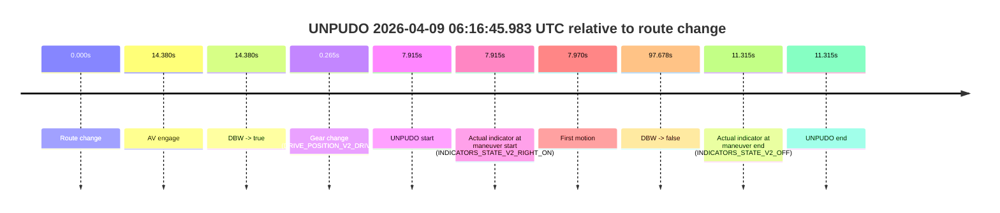
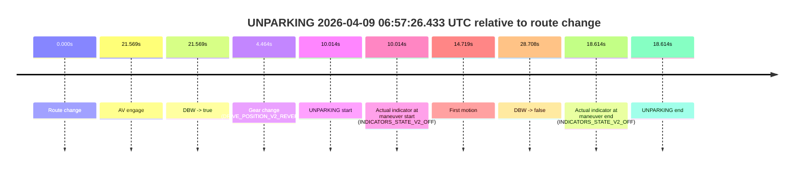
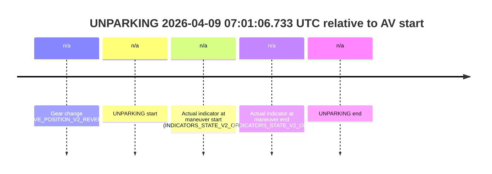

# Run Report: fme20031/2026-04-09--06-00-41--gen2-av-6c1a4cdd-41ab-4ab8-8bd9-f04cb1217073

| Field | Value |
|---|---|
| Run ID | `fme20031/2026-04-09--06-00-41--gen2-av-6c1a4cdd-41ab-4ab8-8bd9-f04cb1217073` |
| Date | `2026-04-09` |
| Model(s) | `lively-orange-horse` |
| Author | `guy.geva` |
| Event count | `6` |

## unpudo 2026-04-09 06:16:45.983 UTC

| Field | Value |
|---|---|
| Model | `lively-orange-horse` |
| Author | `guy.geva` |
| Run ID | `fme20031/2026-04-09--06-00-41--gen2-av-6c1a4cdd-41ab-4ab8-8bd9-f04cb1217073` |
| Date | `2026-04-09` |
| Time (UTC) | `06:16:45.983` |
| Event type | `unpudo` |
| Disengagement type | `failed_to_unpudo` |
| Route change | `found` |
| Console | [run](https://console.sso.wayve.ai/run/fme20031/2026-04-09--06-00-41--gen2-av-6c1a4cdd-41ab-4ab8-8bd9-f04cb1217073?id=&time-unixus=1775715405983320) |
| Foxglove | [segment](https://app.foxglove.dev/wayve-on-prem/p/prj_0dX18KZdVHg1fmmI/view?ds=foxglove-stream&ds.deviceName=fme20031&ds.start=2026-04-09T06%3A16%3A28.068286Z&ds.end=2026-04-09T06%3A18%3A25.746429Z&layoutId=lay_0e7VD4WIKDQGU73Y&time=2026-04-09T06%3A16%3A45.983320Z) |

### Event card: fail

- Fail: AV owns part of the segment, but the event still resolves as a model-performance failure under the AV-only scoring rule.

| Event | Time (UTC) | Delta from route change |
|---|---:|---:|
| Route change | 2026-04-09 06:16:38.068 | `0.000s` |
| AV engage | 2026-04-09 06:16:52.448 | `14.380s` |
| DBW -> true | 2026-04-09 06:16:52.448 | `14.380s` |
| Gear change (DRIVE_POSITION_V2_DRIVE) | 2026-04-09 06:16:38.333 | `0.265s` |
| UNPUDO start | 2026-04-09 06:16:45.983 | `7.915s` |
| Actual indicator at maneuver start (INDICATORS_STATE_V2_RIGHT_ON) | 2026-04-09 06:16:45.983 | `7.915s` |
| First motion | 2026-04-09 06:16:46.038 | `7.970s` |
| DBW -> false | 2026-04-09 06:18:15.746 | `97.678s` |
| Actual indicator at maneuver end (INDICATORS_STATE_V2_OFF) | 2026-04-09 06:16:49.383 | `11.315s` |
| UNPUDO end | 2026-04-09 06:16:49.383 | `11.315s` |

| Metric | Value |
|---|---|
| Outcome | `fail` |
| Effective failure type | `failed_to_unpudo` |
| Route change status | `found` |
| DBW at event start | `false` |
| DBW at event end | `false` |
| Predicted gear at AV start | `DRIVE_POSITION_V2_DRIVE` |
| Actual gear at AV start | `DRIVE_POSITION_V2_DRIVE` |
| Predicted gear at event start | `DRIVE_POSITION_V2_DRIVE` |
| Actual gear at event start | `DRIVE_POSITION_V2_DRIVE` |
| Planned indicator direction | `INDICATORS_STATE_V2_RIGHT_ON` |
| Controller indicator direction | `INDICATORS_STATE_V2_RIGHT_ON` |
| Actual indicator direction | `INDICATORS_STATE_V2_RIGHT_ON` |
| Actual indicator at maneuver end | `INDICATORS_STATE_V2_OFF` |
| Driver accel help in AV | `false` |
| Driver accel help timestamp | `n/a` |
| Max accel pedal pct in AV | `0.0%` |
| Max brake pedal pct in AV | `0.0%` |
| Max speed mps in AV | `0.000` |
| Route -> AV | `14.380s` |
| AV -> event start | `-6.465s` |
| AV -> first motion | `-6.410s` |
| AV duration before disengagement | `83.298s` |
| Trajectory waypoint count | `36` |
| Driving-plan step count | `11` |

The scored portion starts from the AV-owned window, not from the pre-AV setup. Route-change search in the stopped pre-event segment was `found`, with the baseline therefore set to route change. At the event anchor the model predicts `DRIVE_POSITION_V2_DRIVE` and the actual gear is `DRIVE_POSITION_V2_DRIVE`. The effective model outcome is `fail` because `failed_to_unpudo`.

### Resolution

| Field | Value |
|---|---|
| Final outcome | `fail` |
| Do we agree with this label? | `yes` |
| Source disengagement type | `failed_to_unpudo` |
| Resolved effective failure type | `failed_to_unpudo` |
| Confidence | `high` |

## unpudo 2026-04-09 06:31:38.633 UTC

| Field | Value |
|---|---|
| Model | `lively-orange-horse` |
| Author | `guy.geva` |
| Run ID | `fme20031/2026-04-09--06-00-41--gen2-av-6c1a4cdd-41ab-4ab8-8bd9-f04cb1217073` |
| Date | `2026-04-09` |
| Time (UTC) | `06:31:38.633` |
| Event type | `unpudo` |
| Disengagement type | `failed_to_unpudo` |
| Route change | `found` |
| Console | [run](https://console.sso.wayve.ai/run/fme20031/2026-04-09--06-00-41--gen2-av-6c1a4cdd-41ab-4ab8-8bd9-f04cb1217073?id=&time-unixus=1775716298633317) |
| Foxglove | [segment](https://app.foxglove.dev/wayve-on-prem/p/prj_0dX18KZdVHg1fmmI/view?ds=foxglove-stream&ds.deviceName=fme20031&ds.start=2026-04-09T06%3A31%3A22.820541Z&ds.end=2026-04-09T06%3A33%3A47.706806Z&layoutId=lay_0e7VD4WIKDQGU73Y&time=2026-04-09T06%3A31%3A38.633317Z) |

### Event card: fail

- Fail: AV owns part of the segment, but the event still resolves as a model-performance failure under the AV-only scoring rule.

| Event | Time (UTC) | Delta from route change |
|---|---:|---:|
| Route change | 2026-04-09 06:31:32.820 | `0.000s` |
| AV engage | 2026-04-09 06:31:44.968 | `12.148s` |
| DBW -> true | 2026-04-09 06:31:44.968 | `12.148s` |
| Gear change (DRIVE_POSITION_V2_DRIVE) | 2026-04-09 06:31:33.183 | `0.363s` |
| UNPUDO start | 2026-04-09 06:31:38.633 | `5.813s` |
| Actual indicator at maneuver start (INDICATORS_STATE_V2_RIGHT_ON) | 2026-04-09 06:31:38.633 | `5.813s` |
| First motion | 2026-04-09 06:31:38.678 | `5.858s` |
| DBW -> false | 2026-04-09 06:33:37.706 | `124.886s` |
| Actual indicator at maneuver end (INDICATORS_STATE_V2_OFF) | 2026-04-09 06:31:41.983 | `9.163s` |
| UNPUDO end | 2026-04-09 06:31:41.983 | `9.163s` |

| Metric | Value |
|---|---|
| Outcome | `fail` |
| Effective failure type | `failed_to_unpudo` |
| Route change status | `found` |
| DBW at event start | `false` |
| DBW at event end | `false` |
| Predicted gear at AV start | `DRIVE_POSITION_V2_DRIVE` |
| Actual gear at AV start | `DRIVE_POSITION_V2_DRIVE` |
| Predicted gear at event start | `DRIVE_POSITION_V2_DRIVE` |
| Actual gear at event start | `DRIVE_POSITION_V2_DRIVE` |
| Planned indicator direction | `INDICATORS_STATE_V2_RIGHT_ON` |
| Controller indicator direction | `INDICATORS_STATE_V2_RIGHT_ON` |
| Actual indicator direction | `INDICATORS_STATE_V2_RIGHT_ON` |
| Actual indicator at maneuver end | `INDICATORS_STATE_V2_OFF` |
| Driver accel help in AV | `false` |
| Driver accel help timestamp | `n/a` |
| Max accel pedal pct in AV | `0.0%` |
| Max brake pedal pct in AV | `0.0%` |
| Max speed mps in AV | `0.000` |
| Route -> AV | `12.148s` |
| AV -> event start | `-6.335s` |
| AV -> first motion | `-6.290s` |
| AV duration before disengagement | `112.739s` |
| Trajectory waypoint count | `37` |
| Driving-plan step count | `11` |

The scored portion starts from the AV-owned window, not from the pre-AV setup. Route-change search in the stopped pre-event segment was `found`, with the baseline therefore set to route change. At the event anchor the model predicts `DRIVE_POSITION_V2_DRIVE` and the actual gear is `DRIVE_POSITION_V2_DRIVE`. The effective model outcome is `fail` because `failed_to_unpudo`.

### Resolution

| Field | Value |
|---|---|
| Final outcome | `fail` |
| Do we agree with this label? | `yes` |
| Source disengagement type | `failed_to_unpudo` |
| Resolved effective failure type | `failed_to_unpudo` |
| Confidence | `high` |

## unpudo 2026-04-09 06:33:38.383 UTC

| Field | Value |
|---|---|
| Model | `lively-orange-horse` |
| Author | `guy.geva` |
| Run ID | `fme20031/2026-04-09--06-00-41--gen2-av-6c1a4cdd-41ab-4ab8-8bd9-f04cb1217073` |
| Date | `2026-04-09` |
| Time (UTC) | `06:33:38.383` |
| Event type | `unpudo` |
| Disengagement type | `failed_to_unpudo` |
| Route change | `found` |
| Console | [run](https://console.sso.wayve.ai/run/fme20031/2026-04-09--06-00-41--gen2-av-6c1a4cdd-41ab-4ab8-8bd9-f04cb1217073?id=&time-unixus=1775716418383315) |
| Foxglove | [segment](https://app.foxglove.dev/wayve-on-prem/p/prj_0dX18KZdVHg1fmmI/view?ds=foxglove-stream&ds.deviceName=fme20031&ds.start=2026-04-09T06%3A33%3A21.618935Z&ds.end=2026-04-09T06%3A35%3A44.287201Z&layoutId=lay_0e7VD4WIKDQGU73Y&time=2026-04-09T06%3A33%3A38.383315Z) |

### Event card: fail

- Fail: AV owns part of the segment, but the event still resolves as a model-performance failure under the AV-only scoring rule.

| Event | Time (UTC) | Delta from route change |
|---|---:|---:|
| Route change | 2026-04-09 06:33:31.618 | `0.000s` |
| AV engage | 2026-04-09 06:33:55.148 | `23.529s` |
| DBW -> true | 2026-04-09 06:33:55.148 | `23.529s` |
| Gear change (DRIVE_POSITION_V2_DRIVE) | 2026-04-09 06:33:31.983 | `0.364s` |
| UNPUDO start | 2026-04-09 06:33:38.383 | `6.764s` |
| Actual indicator at maneuver start (INDICATORS_STATE_V2_OFF) | 2026-04-09 06:33:38.383 | `6.764s` |
| First motion | 2026-04-09 06:33:38.438 | `6.820s` |
| DBW -> false | 2026-04-09 06:35:34.287 | `122.668s` |
| Actual indicator at maneuver end (INDICATORS_STATE_V2_OFF) | 2026-04-09 06:33:42.383 | `10.764s` |
| UNPUDO end | 2026-04-09 06:33:42.383 | `10.764s` |

| Metric | Value |
|---|---|
| Outcome | `fail` |
| Effective failure type | `failed_to_unpudo` |
| Route change status | `found` |
| DBW at event start | `false` |
| DBW at event end | `false` |
| Predicted gear at AV start | `DRIVE_POSITION_V2_DRIVE` |
| Actual gear at AV start | `DRIVE_POSITION_V2_DRIVE` |
| Predicted gear at event start | `DRIVE_POSITION_V2_DRIVE` |
| Actual gear at event start | `DRIVE_POSITION_V2_DRIVE` |
| Planned indicator direction | `INDICATORS_STATE_V2_OFF` |
| Controller indicator direction | `INDICATORS_STATE_V2_OFF` |
| Actual indicator direction | `INDICATORS_STATE_V2_OFF` |
| Actual indicator at maneuver end | `INDICATORS_STATE_V2_OFF` |
| Driver accel help in AV | `false` |
| Driver accel help timestamp | `n/a` |
| Max accel pedal pct in AV | `0.0%` |
| Max brake pedal pct in AV | `0.0%` |
| Max speed mps in AV | `0.000` |
| Route -> AV | `23.529s` |
| AV -> event start | `-16.765s` |
| AV -> first motion | `-16.710s` |
| AV duration before disengagement | `99.139s` |
| Trajectory waypoint count | `36` |
| Driving-plan step count | `11` |

The scored portion starts from the AV-owned window, not from the pre-AV setup. Route-change search in the stopped pre-event segment was `found`, with the baseline therefore set to route change. At the event anchor the model predicts `DRIVE_POSITION_V2_DRIVE` and the actual gear is `DRIVE_POSITION_V2_DRIVE`. The effective model outcome is `fail` because `failed_to_unpudo`.

### Resolution

| Field | Value |
|---|---|
| Final outcome | `fail` |
| Do we agree with this label? | `yes` |
| Source disengagement type | `failed_to_unpudo` |
| Resolved effective failure type | `failed_to_unpudo` |
| Confidence | `high` |

## unpudo 2026-04-09 06:35:52.983 UTC

| Field | Value |
|---|---|
| Model | `lively-orange-horse` |
| Author | `guy.geva` |
| Run ID | `fme20031/2026-04-09--06-00-41--gen2-av-6c1a4cdd-41ab-4ab8-8bd9-f04cb1217073` |
| Date | `2026-04-09` |
| Time (UTC) | `06:35:52.983` |
| Event type | `unpudo` |
| Disengagement type | `none observed` |
| Route change | `found` |
| Console | [run](https://console.sso.wayve.ai/run/fme20031/2026-04-09--06-00-41--gen2-av-6c1a4cdd-41ab-4ab8-8bd9-f04cb1217073?id=&time-unixus=1775716552983304) |
| Foxglove | [segment](https://app.foxglove.dev/wayve-on-prem/p/prj_0dX18KZdVHg1fmmI/view?ds=foxglove-stream&ds.deviceName=fme20031&ds.start=2026-04-09T06%3A35%3A36.468259Z&ds.end=2026-04-09T06%3A36%3A30.447796Z&layoutId=lay_0e7VD4WIKDQGU73Y&time=2026-04-09T06%3A35%3A52.983304Z) |

### Event card: fail

- Fail: the credited unpudo does not stay AV-owned. The event window starts with DBW false, and the maneuver outcome lands outside a clean AV-owned segment.

| Event | Time (UTC) | Delta from route change |
|---|---:|---:|
| Route change | 2026-04-09 06:35:46.468 | `0.000s` |
| AV engage | 2026-04-09 06:35:57.706 | `11.239s` |
| DBW -> true | 2026-04-09 06:35:57.706 | `11.239s` |
| Gear change (DRIVE_POSITION_V2_DRIVE) | 2026-04-09 06:35:47.983 | `1.515s` |
| UNPUDO start | 2026-04-09 06:35:52.983 | `6.515s` |
| Actual indicator at maneuver start (INDICATORS_STATE_V2_RIGHT_ON) | 2026-04-09 06:35:52.983 | `6.515s` |
| First motion | 2026-04-09 06:35:52.998 | `6.530s` |
| DBW -> false | 2026-04-09 06:36:20.447 | `33.980s` |
| Actual indicator at maneuver end (INDICATORS_STATE_V2_OFF) | 2026-04-09 06:35:56.033 | `9.565s` |
| UNPUDO end | 2026-04-09 06:35:56.033 | `9.565s` |

| Metric | Value |
|---|---|
| Outcome | `fail` |
| Effective failure type | `completed_outside_av` |
| Route change status | `found` |
| DBW at event start | `false` |
| DBW at event end | `false` |
| Predicted gear at AV start | `DRIVE_POSITION_V2_DRIVE` |
| Actual gear at AV start | `DRIVE_POSITION_V2_DRIVE` |
| Predicted gear at event start | `DRIVE_POSITION_V2_DRIVE` |
| Actual gear at event start | `DRIVE_POSITION_V2_DRIVE` |
| Planned indicator direction | `INDICATORS_STATE_V2_RIGHT_ON` |
| Controller indicator direction | `INDICATORS_STATE_V2_RIGHT_ON` |
| Actual indicator direction | `INDICATORS_STATE_V2_RIGHT_ON` |
| Actual indicator at maneuver end | `INDICATORS_STATE_V2_OFF` |
| Driver accel help in AV | `false` |
| Driver accel help timestamp | `n/a` |
| Max accel pedal pct in AV | `0.0%` |
| Max brake pedal pct in AV | `0.0%` |
| Max speed mps in AV | `0.000` |
| Route -> AV | `11.239s` |
| AV -> event start | `-4.724s` |
| AV -> first motion | `-4.709s` |
| AV duration before disengagement | `22.741s` |
| Trajectory waypoint count | `36` |
| Driving-plan step count | `11` |

The scored portion starts from the AV-owned window, not from the pre-AV setup. Route-change search in the stopped pre-event segment was `found`, with the baseline therefore set to route change. At the event anchor the model predicts `DRIVE_POSITION_V2_DRIVE` and the actual gear is `DRIVE_POSITION_V2_DRIVE`. The effective model outcome is `fail` because `completed_outside_av`.

### Resolution

| Field | Value |
|---|---|
| Final outcome | `fail` |
| Do we agree with this label? | `yes` |
| Source disengagement type | `none observed` |
| Resolved effective failure type | `completed_outside_av` |
| Confidence | `high` |

## unparking 2026-04-09 06:57:26.433 UTC

| Field | Value |
|---|---|
| Model | `lively-orange-horse` |
| Author | `guy.geva` |
| Run ID | `fme20031/2026-04-09--06-00-41--gen2-av-6c1a4cdd-41ab-4ab8-8bd9-f04cb1217073` |
| Date | `2026-04-09` |
| Time (UTC) | `06:57:26.433` |
| Event type | `unparking` |
| Disengagement type | `none observed` |
| Route change | `found` |
| Console | [run](https://console.sso.wayve.ai/run/fme20031/2026-04-09--06-00-41--gen2-av-6c1a4cdd-41ab-4ab8-8bd9-f04cb1217073?id=&time-unixus=1775717846433300) |
| Foxglove | [segment](https://app.foxglove.dev/wayve-on-prem/p/prj_0dX18KZdVHg1fmmI/view?ds=foxglove-stream&ds.deviceName=fme20031&ds.start=2026-04-09T06%3A57%3A06.418946Z&ds.end=2026-04-09T06%3A57%3A55.127085Z&layoutId=lay_0e7VD4WIKDQGU73Y&time=2026-04-09T06%3A57%3A26.433300Z) |

### Event card: fail

- Fail: the credited unparking does not stay AV-owned. The event window starts with DBW false, and the maneuver outcome lands outside a clean AV-owned segment.

| Event | Time (UTC) | Delta from route change |
|---|---:|---:|
| Route change | 2026-04-09 06:57:16.418 | `0.000s` |
| AV engage | 2026-04-09 06:57:37.988 | `21.569s` |
| DBW -> true | 2026-04-09 06:57:37.988 | `21.569s` |
| Gear change (DRIVE_POSITION_V2_REVERSE) | 2026-04-09 06:57:20.883 | `4.464s` |
| UNPARKING start | 2026-04-09 06:57:26.433 | `10.014s` |
| Actual indicator at maneuver start (INDICATORS_STATE_V2_OFF) | 2026-04-09 06:57:26.433 | `10.014s` |
| First motion | 2026-04-09 06:57:31.138 | `14.719s` |
| DBW -> false | 2026-04-09 06:57:45.127 | `28.708s` |
| Actual indicator at maneuver end (INDICATORS_STATE_V2_OFF) | 2026-04-09 06:57:35.033 | `18.614s` |
| UNPARKING end | 2026-04-09 06:57:35.033 | `18.614s` |

| Metric | Value |
|---|---|
| Outcome | `fail` |
| Effective failure type | `completed_outside_av` |
| Route change status | `found` |
| DBW at event start | `false` |
| DBW at event end | `false` |
| Predicted gear at AV start | `DRIVE_POSITION_V2_DRIVE` |
| Actual gear at AV start | `DRIVE_POSITION_V2_DRIVE` |
| Predicted gear at event start | `DRIVE_POSITION_V2_DRIVE` |
| Actual gear at event start | `DRIVE_POSITION_V2_REVERSE` |
| Planned indicator direction | `INDICATORS_STATE_V2_OFF` |
| Controller indicator direction | `INDICATORS_STATE_V2_OFF` |
| Actual indicator direction | `INDICATORS_STATE_V2_OFF` |
| Actual indicator at maneuver end | `INDICATORS_STATE_V2_OFF` |
| Driver accel help in AV | `false` |
| Driver accel help timestamp | `n/a` |
| Max accel pedal pct in AV | `0.0%` |
| Max brake pedal pct in AV | `0.0%` |
| Max speed mps in AV | `0.000` |
| Route -> AV | `21.569s` |
| AV -> event start | `-11.555s` |
| AV -> first motion | `-6.850s` |
| AV duration before disengagement | `7.139s` |
| Trajectory waypoint count | `37` |
| Driving-plan step count | `11` |

The scored portion starts from the AV-owned window, not from the pre-AV setup. Route-change search in the stopped pre-event segment was `found`, with the baseline therefore set to route change. At the event anchor the model predicts `DRIVE_POSITION_V2_DRIVE` and the actual gear is `DRIVE_POSITION_V2_REVERSE`. The effective model outcome is `fail` because `completed_outside_av`.

### Resolution

| Field | Value |
|---|---|
| Final outcome | `fail` |
| Do we agree with this label? | `yes` |
| Source disengagement type | `none observed` |
| Resolved effective failure type | `completed_outside_av` |
| Confidence | `high` |

## unparking 2026-04-09 07:01:06.733 UTC

| Field | Value |
|---|---|
| Model | `lively-orange-horse` |
| Author | `guy.geva` |
| Run ID | `fme20031/2026-04-09--06-00-41--gen2-av-6c1a4cdd-41ab-4ab8-8bd9-f04cb1217073` |
| Date | `2026-04-09` |
| Time (UTC) | `07:01:06.733` |
| Event type | `unparking` |
| Disengagement type | `none observed` |
| Route change | `unclear` |
| Console | [run](https://console.sso.wayve.ai/run/fme20031/2026-04-09--06-00-41--gen2-av-6c1a4cdd-41ab-4ab8-8bd9-f04cb1217073?id=&time-unixus=1775718066733302) |
| Foxglove | [segment](https://app.foxglove.dev/wayve-on-prem/p/prj_0dX18KZdVHg1fmmI/view?ds=foxglove-stream&ds.deviceName=fme20031&ds.start=2026-04-09T07%3A00%3A50.033308Z&ds.end=2026-04-09T07%3A01%3A16.733302Z&layoutId=lay_0e7VD4WIKDQGU73Y&time=2026-04-09T07%3A01%3A06.733302Z) |

### Event card: fail

- Fail: the credited unparking does not stay AV-owned. The event window starts with DBW false, and the maneuver outcome lands outside a clean AV-owned segment.

| Event | Time (UTC) | Delta from AV start |
|---|---:|---:|
| Gear change (DRIVE_POSITION_V2_REVERSE) | 2026-04-09 07:01:00.033 | `n/a` |
| UNPARKING start | 2026-04-09 07:01:06.733 | `n/a` |
| Actual indicator at maneuver start (INDICATORS_STATE_V2_OFF) | 2026-04-09 07:01:06.733 | `n/a` |
| Actual indicator at maneuver end (INDICATORS_STATE_V2_OFF) | 2026-04-09 07:01:06.733 | `n/a` |
| UNPARKING end | 2026-04-09 07:01:06.733 | `n/a` |

| Metric | Value |
|---|---|
| Outcome | `fail` |
| Effective failure type | `not_av_owned` |
| Route change status | `unclear` |
| DBW at event start | `false` |
| DBW at event end | `false` |
| Predicted gear at AV start | `n/a` |
| Actual gear at AV start | `n/a` |
| Predicted gear at event start | `DRIVE_POSITION_V2_DRIVE` |
| Actual gear at event start | `DRIVE_POSITION_V2_REVERSE` |
| Planned indicator direction | `INDICATORS_STATE_V2_OFF` |
| Controller indicator direction | `INDICATORS_STATE_V2_OFF` |
| Actual indicator direction | `INDICATORS_STATE_V2_OFF` |
| Actual indicator at maneuver end | `INDICATORS_STATE_V2_OFF` |
| Driver accel help in AV | `false` |
| Driver accel help timestamp | `n/a` |
| Max accel pedal pct in AV | `0.0%` |
| Max brake pedal pct in AV | `0.0%` |
| Max speed mps in AV | `0.000` |
| Route -> AV | `n/a` |
| AV -> event start | `n/a` |
| AV -> first motion | `n/a` |
| AV duration before disengagement | `n/a` |
| Trajectory waypoint count | `37` |
| Driving-plan step count | `11` |

The scored portion starts from the AV-owned window, not from the pre-AV setup. Route-change search in the stopped pre-event segment was `unclear`, with the baseline therefore set to AV start. At the event anchor the model predicts `DRIVE_POSITION_V2_DRIVE` and the actual gear is `DRIVE_POSITION_V2_REVERSE`. The effective model outcome is `fail` because `not_av_owned`.

### Resolution

| Field | Value |
|---|---|
| Final outcome | `fail` |
| Do we agree with this label? | `yes` |
| Source disengagement type | `none observed` |
| Resolved effective failure type | `not_av_owned` |
| Confidence | `medium` |
