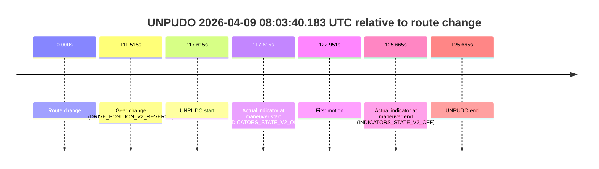
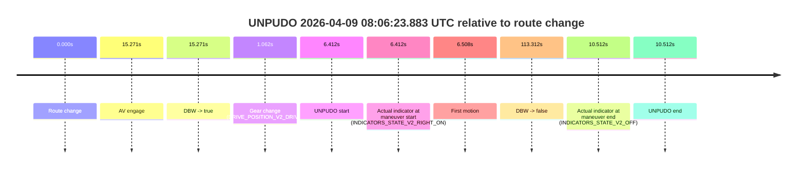
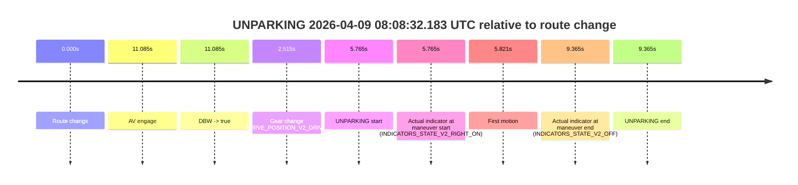

# Run Report: fme20031/2026-04-09--07-22-25--gen2-av-b6e3cbba-f7ec-4e25-83db-6654e0e0002c

| Field | Value |
|---|---|
| Run ID | `fme20031/2026-04-09--07-22-25--gen2-av-b6e3cbba-f7ec-4e25-83db-6654e0e0002c` |
| Date | `2026-04-09` |
| Model(s) | `lively-orange-horse` |
| Author | `guy.geva` |
| Event count | `4` |

## unpudo 2026-04-09 07:59:20.083 UTC

| Field | Value |
|---|---|
| Model | `lively-orange-horse` |
| Author | `guy.geva` |
| Run ID | `fme20031/2026-04-09--07-22-25--gen2-av-b6e3cbba-f7ec-4e25-83db-6654e0e0002c` |
| Date | `2026-04-09` |
| Time (UTC) | `07:59:20.083` |
| Event type | `unpudo` |
| Disengagement type | `failed_to_unpudo` |
| Route change | `found` |
| Console | [run](https://console.sso.wayve.ai/run/fme20031/2026-04-09--07-22-25--gen2-av-b6e3cbba-f7ec-4e25-83db-6654e0e0002c?id=&time-unixus=1775721560083312) |
| Foxglove | [segment](https://app.foxglove.dev/wayve-on-prem/p/prj_0dX18KZdVHg1fmmI/view?ds=foxglove-stream&ds.deviceName=fme20031&ds.start=2026-04-09T07%3A57%3A23.518571Z&ds.end=2026-04-09T08%3A01%3A31.463273Z&layoutId=lay_0e7VD4WIKDQGU73Y&time=2026-04-09T07%3A59%3A20.083312Z) |

### Event card: fail

- Fail: AV owns part of the segment, but the event still resolves as a model-performance failure under the AV-only scoring rule.

| Event | Time (UTC) | Delta from route change |
|---|---:|---:|
| Route change | 2026-04-09 07:57:33.518 | `0.000s` |
| AV engage | 2026-04-09 07:59:25.222 | `111.704s` |
| DBW -> true | 2026-04-09 07:59:25.222 | `111.704s` |
| Gear change (DRIVE_POSITION_V2_DRIVE) | 2026-04-09 07:59:13.233 | `99.715s` |
| UNPUDO start | 2026-04-09 07:59:20.083 | `106.565s` |
| Actual indicator at maneuver start (INDICATORS_STATE_V2_RIGHT_ON) | 2026-04-09 07:59:20.083 | `106.565s` |
| First motion | 2026-04-09 07:59:20.159 | `106.641s` |
| DBW -> false | 2026-04-09 08:01:21.463 | `227.945s` |
| Actual indicator at maneuver end (INDICATORS_STATE_V2_OFF) | 2026-04-09 07:59:23.883 | `110.365s` |
| UNPUDO end | 2026-04-09 07:59:23.883 | `110.365s` |

| Metric | Value |
|---|---|
| Outcome | `fail` |
| Effective failure type | `failed_to_unpudo` |
| Route change status | `found` |
| DBW at event start | `false` |
| DBW at event end | `false` |
| Predicted gear at AV start | `DRIVE_POSITION_V2_DRIVE` |
| Actual gear at AV start | `DRIVE_POSITION_V2_DRIVE` |
| Predicted gear at event start | `DRIVE_POSITION_V2_DRIVE` |
| Actual gear at event start | `DRIVE_POSITION_V2_DRIVE` |
| Planned indicator direction | `INDICATORS_STATE_V2_RIGHT_ON` |
| Controller indicator direction | `INDICATORS_STATE_V2_RIGHT_ON` |
| Actual indicator direction | `INDICATORS_STATE_V2_RIGHT_ON` |
| Actual indicator at maneuver end | `INDICATORS_STATE_V2_OFF` |
| Driver accel help in AV | `false` |
| Driver accel help timestamp | `n/a` |
| Max accel pedal pct in AV | `0.0%` |
| Max brake pedal pct in AV | `0.0%` |
| Max speed mps in AV | `0.000` |
| Route -> AV | `111.704s` |
| AV -> event start | `-5.140s` |
| AV -> first motion | `-5.064s` |
| AV duration before disengagement | `116.240s` |
| Trajectory waypoint count | `37` |
| Driving-plan step count | `11` |

The scored portion starts from the AV-owned window, not from the pre-AV setup. Route-change search in the stopped pre-event segment was `found`, with the baseline therefore set to route change. At the event anchor the model predicts `DRIVE_POSITION_V2_DRIVE` and the actual gear is `DRIVE_POSITION_V2_DRIVE`. The effective model outcome is `fail` because `failed_to_unpudo`.

### Resolution

| Field | Value |
|---|---|
| Final outcome | `fail` |
| Do we agree with this label? | `yes` |
| Source disengagement type | `failed_to_unpudo` |
| Resolved effective failure type | `failed_to_unpudo` |
| Confidence | `high` |

## unpudo 2026-04-09 08:03:40.183 UTC

| Field | Value |
|---|---|
| Model | `lively-orange-horse` |
| Author | `guy.geva` |
| Run ID | `fme20031/2026-04-09--07-22-25--gen2-av-b6e3cbba-f7ec-4e25-83db-6654e0e0002c` |
| Date | `2026-04-09` |
| Time (UTC) | `08:03:40.183` |
| Event type | `unpudo` |
| Disengagement type | `failed_to_accelerate` |
| Route change | `found` |
| Console | [run](https://console.sso.wayve.ai/run/fme20031/2026-04-09--07-22-25--gen2-av-b6e3cbba-f7ec-4e25-83db-6654e0e0002c?id=&time-unixus=1775721820183315) |
| Foxglove | [segment](https://app.foxglove.dev/wayve-on-prem/p/prj_0dX18KZdVHg1fmmI/view?ds=foxglove-stream&ds.deviceName=fme20031&ds.start=2026-04-09T08%3A01%3A32.568296Z&ds.end=2026-04-09T08%3A03%3A58.233301Z&layoutId=lay_0e7VD4WIKDQGU73Y&time=2026-04-09T08%3A03%3A40.183315Z) |

### Event card: fail

- Fail: AV owns part of the segment, but the event still resolves as a model-performance failure under the AV-only scoring rule.

| Event | Time (UTC) | Delta from route change |
|---|---:|---:|
| Route change | 2026-04-09 08:01:42.568 | `0.000s` |
| Gear change (DRIVE_POSITION_V2_REVERSE) | 2026-04-09 08:03:34.083 | `111.515s` |
| UNPUDO start | 2026-04-09 08:03:40.183 | `117.615s` |
| Actual indicator at maneuver start (INDICATORS_STATE_V2_OFF) | 2026-04-09 08:03:40.183 | `117.615s` |
| First motion | 2026-04-09 08:03:45.519 | `122.951s` |
| Actual indicator at maneuver end (INDICATORS_STATE_V2_OFF) | 2026-04-09 08:03:48.233 | `125.665s` |
| UNPUDO end | 2026-04-09 08:03:48.233 | `125.665s` |

| Metric | Value |
|---|---|
| Outcome | `fail` |
| Effective failure type | `failed_to_accelerate` |
| Route change status | `found` |
| DBW at event start | `false` |
| DBW at event end | `false` |
| Predicted gear at AV start | `n/a` |
| Actual gear at AV start | `n/a` |
| Predicted gear at event start | `DRIVE_POSITION_V2_DRIVE` |
| Actual gear at event start | `DRIVE_POSITION_V2_REVERSE` |
| Planned indicator direction | `INDICATORS_STATE_V2_OFF` |
| Controller indicator direction | `INDICATORS_STATE_V2_OFF` |
| Actual indicator direction | `INDICATORS_STATE_V2_OFF` |
| Actual indicator at maneuver end | `INDICATORS_STATE_V2_OFF` |
| Driver accel help in AV | `false` |
| Driver accel help timestamp | `n/a` |
| Max accel pedal pct in AV | `0.0%` |
| Max brake pedal pct in AV | `0.0%` |
| Max speed mps in AV | `0.000` |
| Route -> AV | `n/a` |
| AV -> event start | `n/a` |
| AV -> first motion | `n/a` |
| AV duration before disengagement | `n/a` |
| Trajectory waypoint count | `37` |
| Driving-plan step count | `11` |

The scored portion starts from the AV-owned window, not from the pre-AV setup. Route-change search in the stopped pre-event segment was `found`, with the baseline therefore set to route change. At the event anchor the model predicts `DRIVE_POSITION_V2_DRIVE` and the actual gear is `DRIVE_POSITION_V2_REVERSE`. The effective model outcome is `fail` because `failed_to_accelerate`.

### Resolution

| Field | Value |
|---|---|
| Final outcome | `fail` |
| Do we agree with this label? | `yes` |
| Source disengagement type | `failed_to_accelerate` |
| Resolved effective failure type | `failed_to_accelerate` |
| Confidence | `high` |

## unpudo 2026-04-09 08:06:23.883 UTC

| Field | Value |
|---|---|
| Model | `lively-orange-horse` |
| Author | `guy.geva` |
| Run ID | `fme20031/2026-04-09--07-22-25--gen2-av-b6e3cbba-f7ec-4e25-83db-6654e0e0002c` |
| Date | `2026-04-09` |
| Time (UTC) | `08:06:23.883` |
| Event type | `unpudo` |
| Disengagement type | `failed_to_unpudo` |
| Route change | `found` |
| Console | [run](https://console.sso.wayve.ai/run/fme20031/2026-04-09--07-22-25--gen2-av-b6e3cbba-f7ec-4e25-83db-6654e0e0002c?id=&time-unixus=1775721983883322) |
| Foxglove | [segment](https://app.foxglove.dev/wayve-on-prem/p/prj_0dX18KZdVHg1fmmI/view?ds=foxglove-stream&ds.deviceName=fme20031&ds.start=2026-04-09T08%3A06%3A07.471658Z&ds.end=2026-04-09T08%3A08%3A20.783676Z&layoutId=lay_0e7VD4WIKDQGU73Y&time=2026-04-09T08%3A06%3A23.883322Z) |

### Event card: fail

- Fail: AV owns part of the segment, but the event still resolves as a model-performance failure under the AV-only scoring rule.

| Event | Time (UTC) | Delta from route change |
|---|---:|---:|
| Route change | 2026-04-09 08:06:17.471 | `0.000s` |
| AV engage | 2026-04-09 08:06:32.743 | `15.271s` |
| DBW -> true | 2026-04-09 08:06:32.743 | `15.271s` |
| Gear change (DRIVE_POSITION_V2_DRIVE) | 2026-04-09 08:06:18.533 | `1.062s` |
| UNPUDO start | 2026-04-09 08:06:23.883 | `6.412s` |
| Actual indicator at maneuver start (INDICATORS_STATE_V2_RIGHT_ON) | 2026-04-09 08:06:23.883 | `6.412s` |
| First motion | 2026-04-09 08:06:23.979 | `6.508s` |
| DBW -> false | 2026-04-09 08:08:10.783 | `113.312s` |
| Actual indicator at maneuver end (INDICATORS_STATE_V2_OFF) | 2026-04-09 08:06:27.983 | `10.512s` |
| UNPUDO end | 2026-04-09 08:06:27.983 | `10.512s` |

| Metric | Value |
|---|---|
| Outcome | `fail` |
| Effective failure type | `failed_to_unpudo` |
| Route change status | `found` |
| DBW at event start | `false` |
| DBW at event end | `false` |
| Predicted gear at AV start | `DRIVE_POSITION_V2_DRIVE` |
| Actual gear at AV start | `DRIVE_POSITION_V2_DRIVE` |
| Predicted gear at event start | `DRIVE_POSITION_V2_DRIVE` |
| Actual gear at event start | `DRIVE_POSITION_V2_DRIVE` |
| Planned indicator direction | `INDICATORS_STATE_V2_LEFT_ON` |
| Controller indicator direction | `INDICATORS_STATE_V2_LEFT_ON` |
| Actual indicator direction | `INDICATORS_STATE_V2_RIGHT_ON` |
| Actual indicator at maneuver end | `INDICATORS_STATE_V2_OFF` |
| Driver accel help in AV | `false` |
| Driver accel help timestamp | `n/a` |
| Max accel pedal pct in AV | `0.0%` |
| Max brake pedal pct in AV | `0.0%` |
| Max speed mps in AV | `0.000` |
| Route -> AV | `15.271s` |
| AV -> event start | `-8.860s` |
| AV -> first motion | `-8.763s` |
| AV duration before disengagement | `98.041s` |
| Trajectory waypoint count | `37` |
| Driving-plan step count | `11` |

The scored portion starts from the AV-owned window, not from the pre-AV setup. Route-change search in the stopped pre-event segment was `found`, with the baseline therefore set to route change. At the event anchor the model predicts `DRIVE_POSITION_V2_DRIVE` and the actual gear is `DRIVE_POSITION_V2_DRIVE`. The effective model outcome is `fail` because `failed_to_unpudo`.

### Resolution

| Field | Value |
|---|---|
| Final outcome | `fail` |
| Do we agree with this label? | `yes` |
| Source disengagement type | `failed_to_unpudo` |
| Resolved effective failure type | `failed_to_unpudo` |
| Confidence | `high` |

## unparking 2026-04-09 08:08:32.183 UTC

| Field | Value |
|---|---|
| Model | `lively-orange-horse` |
| Author | `guy.geva` |
| Run ID | `fme20031/2026-04-09--07-22-25--gen2-av-b6e3cbba-f7ec-4e25-83db-6654e0e0002c` |
| Date | `2026-04-09` |
| Time (UTC) | `08:08:32.183` |
| Event type | `unparking` |
| Disengagement type | `none observed` |
| Route change | `found` |
| Console | [run](https://console.sso.wayve.ai/run/fme20031/2026-04-09--07-22-25--gen2-av-b6e3cbba-f7ec-4e25-83db-6654e0e0002c?id=&time-unixus=1775722112183305) |
| Foxglove | [segment](https://app.foxglove.dev/wayve-on-prem/p/prj_0dX18KZdVHg1fmmI/view?ds=foxglove-stream&ds.deviceName=fme20031&ds.start=2026-04-09T08%3A08%3A16.418245Z&ds.end=2026-04-09T08%3A08%3A45.783323Z&layoutId=lay_0e7VD4WIKDQGU73Y&time=2026-04-09T08%3A08%3A32.183305Z) |

### Event card: fail

- Fail: the credited unparking does not stay AV-owned. The event window starts with DBW false, and the maneuver outcome lands outside a clean AV-owned segment.

| Event | Time (UTC) | Delta from route change |
|---|---:|---:|
| Route change | 2026-04-09 08:08:26.418 | `0.000s` |
| AV engage | 2026-04-09 08:08:37.503 | `11.085s` |
| DBW -> true | 2026-04-09 08:08:37.503 | `11.085s` |
| Gear change (DRIVE_POSITION_V2_DRIVE) | 2026-04-09 08:08:28.933 | `2.515s` |
| UNPARKING start | 2026-04-09 08:08:32.183 | `5.765s` |
| Actual indicator at maneuver start (INDICATORS_STATE_V2_RIGHT_ON) | 2026-04-09 08:08:32.183 | `5.765s` |
| First motion | 2026-04-09 08:08:32.239 | `5.821s` |
| Actual indicator at maneuver end (INDICATORS_STATE_V2_OFF) | 2026-04-09 08:08:35.783 | `9.365s` |
| UNPARKING end | 2026-04-09 08:08:35.783 | `9.365s` |

| Metric | Value |
|---|---|
| Outcome | `fail` |
| Effective failure type | `completed_outside_av` |
| Route change status | `found` |
| DBW at event start | `false` |
| DBW at event end | `false` |
| Predicted gear at AV start | `DRIVE_POSITION_V2_DRIVE` |
| Actual gear at AV start | `DRIVE_POSITION_V2_DRIVE` |
| Predicted gear at event start | `DRIVE_POSITION_V2_DRIVE` |
| Actual gear at event start | `DRIVE_POSITION_V2_DRIVE` |
| Planned indicator direction | `INDICATORS_STATE_V2_RIGHT_ON` |
| Controller indicator direction | `INDICATORS_STATE_V2_RIGHT_ON` |
| Actual indicator direction | `INDICATORS_STATE_V2_RIGHT_ON` |
| Actual indicator at maneuver end | `INDICATORS_STATE_V2_OFF` |
| Driver accel help in AV | `false` |
| Driver accel help timestamp | `n/a` |
| Max accel pedal pct in AV | `0.0%` |
| Max brake pedal pct in AV | `0.0%` |
| Max speed mps in AV | `0.000` |
| Route -> AV | `11.085s` |
| AV -> event start | `-5.320s` |
| AV -> first motion | `-5.264s` |
| AV duration before disengagement | `n/a` |
| Trajectory waypoint count | `37` |
| Driving-plan step count | `11` |

The scored portion starts from the AV-owned window, not from the pre-AV setup. Route-change search in the stopped pre-event segment was `found`, with the baseline therefore set to route change. At the event anchor the model predicts `DRIVE_POSITION_V2_DRIVE` and the actual gear is `DRIVE_POSITION_V2_DRIVE`. The effective model outcome is `fail` because `completed_outside_av`.

### Resolution

| Field | Value |
|---|---|
| Final outcome | `fail` |
| Do we agree with this label? | `yes` |
| Source disengagement type | `none observed` |
| Resolved effective failure type | `completed_outside_av` |
| Confidence | `high` |
