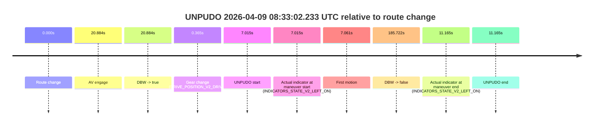
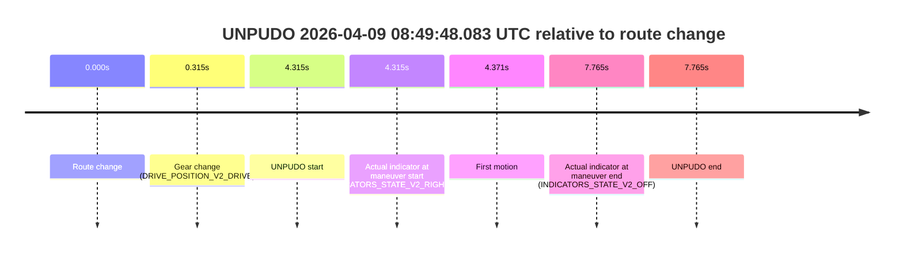
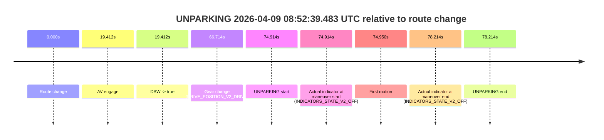

# Run Report: fme20031/2026-04-09--08-23-42--gen2-av-1438cdf1-e661-4412-b4c6-763a17e793b2

| Field | Value |
|---|---|
| Run ID | `fme20031/2026-04-09--08-23-42--gen2-av-1438cdf1-e661-4412-b4c6-763a17e793b2` |
| Date | `2026-04-09` |
| Model(s) | `lively-orange-horse` |
| Author | `guy.geva` |
| Event count | `4` |

## unpudo 2026-04-09 08:33:02.233 UTC

| Field | Value |
|---|---|
| Model | `lively-orange-horse` |
| Author | `guy.geva` |
| Run ID | `fme20031/2026-04-09--08-23-42--gen2-av-1438cdf1-e661-4412-b4c6-763a17e793b2` |
| Date | `2026-04-09` |
| Time (UTC) | `08:33:02.233` |
| Event type | `unpudo` |
| Disengagement type | `failed_to_unpudo` |
| Route change | `found` |
| Console | [run](https://console.sso.wayve.ai/run/fme20031/2026-04-09--08-23-42--gen2-av-1438cdf1-e661-4412-b4c6-763a17e793b2?id=&time-unixus=1775723582233315) |
| Foxglove | [segment](https://app.foxglove.dev/wayve-on-prem/p/prj_0dX18KZdVHg1fmmI/view?ds=foxglove-stream&ds.deviceName=fme20031&ds.start=2026-04-09T08%3A32%3A45.218257Z&ds.end=2026-04-09T08%3A36%3A10.940709Z&layoutId=lay_0e7VD4WIKDQGU73Y&time=2026-04-09T08%3A33%3A02.233315Z) |

### Event card: fail

- Fail: AV owns part of the segment, but the event still resolves as a model-performance failure under the AV-only scoring rule.

| Event | Time (UTC) | Delta from route change |
|---|---:|---:|
| Route change | 2026-04-09 08:32:55.218 | `0.000s` |
| AV engage | 2026-04-09 08:33:16.102 | `20.884s` |
| DBW -> true | 2026-04-09 08:33:16.102 | `20.884s` |
| Gear change (DRIVE_POSITION_V2_DRIVE) | 2026-04-09 08:32:55.583 | `0.365s` |
| UNPUDO start | 2026-04-09 08:33:02.233 | `7.015s` |
| Actual indicator at maneuver start (INDICATORS_STATE_V2_LEFT_ON) | 2026-04-09 08:33:02.233 | `7.015s` |
| First motion | 2026-04-09 08:33:02.279 | `7.061s` |
| DBW -> false | 2026-04-09 08:36:00.940 | `185.722s` |
| Actual indicator at maneuver end (INDICATORS_STATE_V2_LEFT_ON) | 2026-04-09 08:33:06.383 | `11.165s` |
| UNPUDO end | 2026-04-09 08:33:06.383 | `11.165s` |

| Metric | Value |
|---|---|
| Outcome | `fail` |
| Effective failure type | `failed_to_unpudo` |
| Route change status | `found` |
| DBW at event start | `false` |
| DBW at event end | `false` |
| Predicted gear at AV start | `DRIVE_POSITION_V2_DRIVE` |
| Actual gear at AV start | `DRIVE_POSITION_V2_DRIVE` |
| Predicted gear at event start | `DRIVE_POSITION_V2_DRIVE` |
| Actual gear at event start | `DRIVE_POSITION_V2_DRIVE` |
| Planned indicator direction | `INDICATORS_STATE_V2_OFF` |
| Controller indicator direction | `INDICATORS_STATE_V2_OFF` |
| Actual indicator direction | `INDICATORS_STATE_V2_LEFT_ON` |
| Actual indicator at maneuver end | `INDICATORS_STATE_V2_LEFT_ON` |
| Driver accel help in AV | `false` |
| Driver accel help timestamp | `n/a` |
| Max accel pedal pct in AV | `0.0%` |
| Max brake pedal pct in AV | `0.0%` |
| Max speed mps in AV | `0.000` |
| Route -> AV | `20.884s` |
| AV -> event start | `-13.869s` |
| AV -> first motion | `-13.823s` |
| AV duration before disengagement | `164.838s` |
| Trajectory waypoint count | `36` |
| Driving-plan step count | `11` |

The scored portion starts from the AV-owned window, not from the pre-AV setup. Route-change search in the stopped pre-event segment was `found`, with the baseline therefore set to route change. At the event anchor the model predicts `DRIVE_POSITION_V2_DRIVE` and the actual gear is `DRIVE_POSITION_V2_DRIVE`. The effective model outcome is `fail` because `failed_to_unpudo`.

### Resolution

| Field | Value |
|---|---|
| Final outcome | `fail` |
| Do we agree with this label? | `yes` |
| Source disengagement type | `failed_to_unpudo` |
| Resolved effective failure type | `failed_to_unpudo` |
| Confidence | `high` |

## unpudo 2026-04-09 08:36:16.133 UTC

| Field | Value |
|---|---|
| Model | `lively-orange-horse` |
| Author | `guy.geva` |
| Run ID | `fme20031/2026-04-09--08-23-42--gen2-av-1438cdf1-e661-4412-b4c6-763a17e793b2` |
| Date | `2026-04-09` |
| Time (UTC) | `08:36:16.133` |
| Event type | `unpudo` |
| Disengagement type | `none observed` |
| Route change | `found` |
| Console | [run](https://console.sso.wayve.ai/run/fme20031/2026-04-09--08-23-42--gen2-av-1438cdf1-e661-4412-b4c6-763a17e793b2?id=&time-unixus=1775723776133304) |
| Foxglove | [segment](https://app.foxglove.dev/wayve-on-prem/p/prj_0dX18KZdVHg1fmmI/view?ds=foxglove-stream&ds.deviceName=fme20031&ds.start=2026-04-09T08%3A36%3A00.818277Z&ds.end=2026-04-09T08%3A37%3A10.141369Z&layoutId=lay_0e7VD4WIKDQGU73Y&time=2026-04-09T08%3A36%3A16.133304Z) |

### Event card: fail

- Fail: the credited unpudo does not stay AV-owned. The event window starts with DBW false, and the maneuver outcome lands outside a clean AV-owned segment.

| Event | Time (UTC) | Delta from route change |
|---|---:|---:|
| Route change | 2026-04-09 08:36:10.818 | `0.000s` |
| AV engage | 2026-04-09 08:36:30.971 | `20.153s` |
| DBW -> true | 2026-04-09 08:36:30.971 | `20.153s` |
| Gear change (DRIVE_POSITION_V2_DRIVE) | 2026-04-09 08:36:12.533 | `1.715s` |
| UNPUDO start | 2026-04-09 08:36:16.133 | `5.315s` |
| Actual indicator at maneuver start (INDICATORS_STATE_V2_RIGHT_ON) | 2026-04-09 08:36:16.133 | `5.315s` |
| First motion | 2026-04-09 08:36:16.219 | `5.401s` |
| DBW -> false | 2026-04-09 08:37:00.141 | `49.323s` |
| Actual indicator at maneuver end (INDICATORS_STATE_V2_OFF) | 2026-04-09 08:36:20.383 | `9.565s` |
| UNPUDO end | 2026-04-09 08:36:20.383 | `9.565s` |

| Metric | Value |
|---|---|
| Outcome | `fail` |
| Effective failure type | `completed_outside_av` |
| Route change status | `found` |
| DBW at event start | `false` |
| DBW at event end | `false` |
| Predicted gear at AV start | `DRIVE_POSITION_V2_DRIVE` |
| Actual gear at AV start | `DRIVE_POSITION_V2_DRIVE` |
| Predicted gear at event start | `DRIVE_POSITION_V2_DRIVE` |
| Actual gear at event start | `DRIVE_POSITION_V2_DRIVE` |
| Planned indicator direction | `INDICATORS_STATE_V2_RIGHT_ON` |
| Controller indicator direction | `INDICATORS_STATE_V2_RIGHT_ON` |
| Actual indicator direction | `INDICATORS_STATE_V2_RIGHT_ON` |
| Actual indicator at maneuver end | `INDICATORS_STATE_V2_OFF` |
| Driver accel help in AV | `false` |
| Driver accel help timestamp | `n/a` |
| Max accel pedal pct in AV | `0.0%` |
| Max brake pedal pct in AV | `0.0%` |
| Max speed mps in AV | `0.000` |
| Route -> AV | `20.153s` |
| AV -> event start | `-14.838s` |
| AV -> first motion | `-14.752s` |
| AV duration before disengagement | `29.170s` |
| Trajectory waypoint count | `36` |
| Driving-plan step count | `11` |

The scored portion starts from the AV-owned window, not from the pre-AV setup. Route-change search in the stopped pre-event segment was `found`, with the baseline therefore set to route change. At the event anchor the model predicts `DRIVE_POSITION_V2_DRIVE` and the actual gear is `DRIVE_POSITION_V2_DRIVE`. The effective model outcome is `fail` because `completed_outside_av`.

### Resolution

| Field | Value |
|---|---|
| Final outcome | `fail` |
| Do we agree with this label? | `yes` |
| Source disengagement type | `none observed` |
| Resolved effective failure type | `completed_outside_av` |
| Confidence | `high` |

## unpudo 2026-04-09 08:49:48.083 UTC

| Field | Value |
|---|---|
| Model | `lively-orange-horse` |
| Author | `guy.geva` |
| Run ID | `fme20031/2026-04-09--08-23-42--gen2-av-1438cdf1-e661-4412-b4c6-763a17e793b2` |
| Date | `2026-04-09` |
| Time (UTC) | `08:49:48.083` |
| Event type | `unpudo` |
| Disengagement type | `failed_to_unpudo` |
| Route change | `found` |
| Console | [run](https://console.sso.wayve.ai/run/fme20031/2026-04-09--08-23-42--gen2-av-1438cdf1-e661-4412-b4c6-763a17e793b2?id=&time-unixus=1775724588083302) |
| Foxglove | [segment](https://app.foxglove.dev/wayve-on-prem/p/prj_0dX18KZdVHg1fmmI/view?ds=foxglove-stream&ds.deviceName=fme20031&ds.start=2026-04-09T08%3A49%3A33.768261Z&ds.end=2026-04-09T08%3A50%3A01.533319Z&layoutId=lay_0e7VD4WIKDQGU73Y&time=2026-04-09T08%3A49%3A48.083302Z) |

### Event card: fail

- Fail: AV owns part of the segment, but the event still resolves as a model-performance failure under the AV-only scoring rule.

| Event | Time (UTC) | Delta from route change |
|---|---:|---:|
| Route change | 2026-04-09 08:49:43.768 | `0.000s` |
| Gear change (DRIVE_POSITION_V2_DRIVE) | 2026-04-09 08:49:44.083 | `0.315s` |
| UNPUDO start | 2026-04-09 08:49:48.083 | `4.315s` |
| Actual indicator at maneuver start (INDICATORS_STATE_V2_RIGHT_ON) | 2026-04-09 08:49:48.083 | `4.315s` |
| First motion | 2026-04-09 08:49:48.139 | `4.371s` |
| Actual indicator at maneuver end (INDICATORS_STATE_V2_OFF) | 2026-04-09 08:49:51.533 | `7.765s` |
| UNPUDO end | 2026-04-09 08:49:51.533 | `7.765s` |

| Metric | Value |
|---|---|
| Outcome | `fail` |
| Effective failure type | `failed_to_unpudo` |
| Route change status | `found` |
| DBW at event start | `false` |
| DBW at event end | `false` |
| Predicted gear at AV start | `n/a` |
| Actual gear at AV start | `n/a` |
| Predicted gear at event start | `DRIVE_POSITION_V2_DRIVE` |
| Actual gear at event start | `DRIVE_POSITION_V2_DRIVE` |
| Planned indicator direction | `INDICATORS_STATE_V2_RIGHT_ON` |
| Controller indicator direction | `INDICATORS_STATE_V2_RIGHT_ON` |
| Actual indicator direction | `INDICATORS_STATE_V2_RIGHT_ON` |
| Actual indicator at maneuver end | `INDICATORS_STATE_V2_OFF` |
| Driver accel help in AV | `false` |
| Driver accel help timestamp | `n/a` |
| Max accel pedal pct in AV | `0.0%` |
| Max brake pedal pct in AV | `0.0%` |
| Max speed mps in AV | `0.000` |
| Route -> AV | `n/a` |
| AV -> event start | `n/a` |
| AV -> first motion | `n/a` |
| AV duration before disengagement | `n/a` |
| Trajectory waypoint count | `37` |
| Driving-plan step count | `11` |

The scored portion starts from the AV-owned window, not from the pre-AV setup. Route-change search in the stopped pre-event segment was `found`, with the baseline therefore set to route change. At the event anchor the model predicts `DRIVE_POSITION_V2_DRIVE` and the actual gear is `DRIVE_POSITION_V2_DRIVE`. The effective model outcome is `fail` because `failed_to_unpudo`.

### Resolution

| Field | Value |
|---|---|
| Final outcome | `fail` |
| Do we agree with this label? | `yes` |
| Source disengagement type | `failed_to_unpudo` |
| Resolved effective failure type | `failed_to_unpudo` |
| Confidence | `high` |

## unparking 2026-04-09 08:52:39.483 UTC

| Field | Value |
|---|---|
| Model | `lively-orange-horse` |
| Author | `guy.geva` |
| Run ID | `fme20031/2026-04-09--08-23-42--gen2-av-1438cdf1-e661-4412-b4c6-763a17e793b2` |
| Date | `2026-04-09` |
| Time (UTC) | `08:52:39.483` |
| Event type | `unparking` |
| Disengagement type | `none observed` |
| Route change | `found` |
| Console | [run](https://console.sso.wayve.ai/run/fme20031/2026-04-09--08-23-42--gen2-av-1438cdf1-e661-4412-b4c6-763a17e793b2?id=&time-unixus=1775724759483300) |
| Foxglove | [segment](https://app.foxglove.dev/wayve-on-prem/p/prj_0dX18KZdVHg1fmmI/view?ds=foxglove-stream&ds.deviceName=fme20031&ds.start=2026-04-09T08%3A51%3A14.569421Z&ds.end=2026-04-09T08%3A52%3A52.783315Z&layoutId=lay_0e7VD4WIKDQGU73Y&time=2026-04-09T08%3A52%3A39.483300Z) |

### Event card: pass

- Pass: AV owns the credited unparking through the official event window, the gear state is aligned at the anchor, and the vehicle moves without driver accelerator help in AV.

| Event | Time (UTC) | Delta from route change |
|---|---:|---:|
| Route change | 2026-04-09 08:51:24.569 | `0.000s` |
| AV engage | 2026-04-09 08:51:43.981 | `19.412s` |
| DBW -> true | 2026-04-09 08:51:43.981 | `19.412s` |
| Gear change (DRIVE_POSITION_V2_DRIVE) | 2026-04-09 08:52:31.283 | `66.714s` |
| UNPARKING start | 2026-04-09 08:52:39.483 | `74.914s` |
| Actual indicator at maneuver start (INDICATORS_STATE_V2_OFF) | 2026-04-09 08:52:39.483 | `74.914s` |
| First motion | 2026-04-09 08:52:39.519 | `74.950s` |
| Actual indicator at maneuver end (INDICATORS_STATE_V2_OFF) | 2026-04-09 08:52:42.783 | `78.214s` |
| UNPARKING end | 2026-04-09 08:52:42.783 | `78.214s` |

| Metric | Value |
|---|---|
| Outcome | `pass` |
| Effective failure type | `none` |
| Route change status | `found` |
| DBW at event start | `true` |
| DBW at event end | `true` |
| Predicted gear at AV start | `DRIVE_POSITION_V2_DRIVE` |
| Actual gear at AV start | `DRIVE_POSITION_V2_DRIVE` |
| Predicted gear at event start | `DRIVE_POSITION_V2_DRIVE` |
| Actual gear at event start | `DRIVE_POSITION_V2_DRIVE` |
| Planned indicator direction | `INDICATORS_STATE_V2_RIGHT_ON` |
| Controller indicator direction | `INDICATORS_STATE_V2_RIGHT_ON` |
| Actual indicator direction | `INDICATORS_STATE_V2_OFF` |
| Actual indicator at maneuver end | `INDICATORS_STATE_V2_OFF` |
| Driver accel help in AV | `false` |
| Driver accel help timestamp | `n/a` |
| Max accel pedal pct in AV | `0.0%` |
| Max brake pedal pct in AV | `8.0%` |
| Max speed mps in AV | `8.211` |
| Route -> AV | `19.412s` |
| AV -> event start | `55.502s` |
| AV -> first motion | `55.538s` |
| AV duration before disengagement | `n/a` |
| Trajectory waypoint count | `37` |
| Driving-plan step count | `11` |

The scored portion starts from the AV-owned window, not from the pre-AV setup. Route-change search in the stopped pre-event segment was `found`, with the baseline therefore set to route change. At the event anchor the model predicts `DRIVE_POSITION_V2_DRIVE` and the actual gear is `DRIVE_POSITION_V2_DRIVE`. The effective model outcome is `pass` because `the credited maneuver stays AV-owned through the official event end`.

### Resolution

| Field | Value |
|---|---|
| Final outcome | `pass` |
| Do we agree with this label? | `yes` |
| Source disengagement type | `none observed` |
| Resolved effective failure type | `none` |
| Confidence | `high` |
