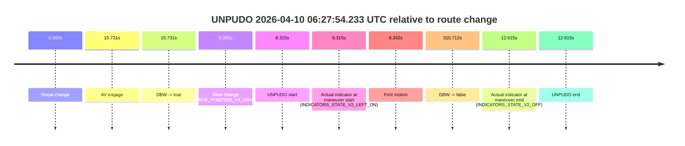
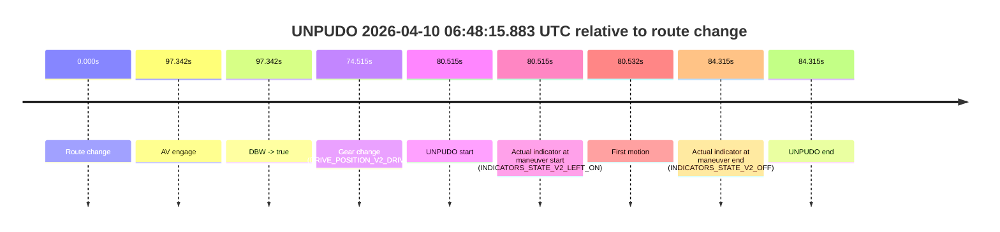

# Run Report: fme20031/2026-04-10--06-08-48--gen2-av-a8005aaa-e1c1-4d5b-be77-480ac6d27d4a

| Field | Value |
|---|---|
| Run ID | `fme20031/2026-04-10--06-08-48--gen2-av-a8005aaa-e1c1-4d5b-be77-480ac6d27d4a` |
| Date | `2026-04-10` |
| Model(s) | `lively-orange-horse` |
| Author | `guy.geva` |
| Event count | `6` |

## unpudo 2026-04-10 06:15:55.583 UTC

| Field | Value |
|---|---|
| Model | `lively-orange-horse` |
| Author | `guy.geva` |
| Run ID | `fme20031/2026-04-10--06-08-48--gen2-av-a8005aaa-e1c1-4d5b-be77-480ac6d27d4a` |
| Date | `2026-04-10` |
| Time (UTC) | `06:15:55.583` |
| Event type | `unpudo` |
| Disengagement type | `failed_to_unpudo` |
| Route change | `found` |
| Console | [run](https://console.sso.wayve.ai/run/fme20031/2026-04-10--06-08-48--gen2-av-a8005aaa-e1c1-4d5b-be77-480ac6d27d4a?id=&time-unixus=1775801755583306) |
| Foxglove | [segment](https://app.foxglove.dev/wayve-on-prem/p/prj_0dX18KZdVHg1fmmI/view?ds=foxglove-stream&ds.deviceName=fme20031&ds.start=2026-04-10T06%3A15%3A25.668332Z&ds.end=2026-04-10T06%3A20%3A00.288926Z&layoutId=lay_0e7VD4WIKDQGU73Y&time=2026-04-10T06%3A15%3A55.583306Z) |

### Event card: fail

- Fail: AV owns part of the segment, but the event still resolves as a model-performance failure under the AV-only scoring rule.

| Event | Time (UTC) | Delta from route change |
|---|---:|---:|
| Route change | 2026-04-10 06:15:35.668 | `0.000s` |
| AV engage | 2026-04-10 06:15:58.390 | `22.722s` |
| DBW -> true | 2026-04-10 06:15:58.390 | `22.722s` |
| Gear change (DRIVE_POSITION_V2_DRIVE) | 2026-04-10 06:15:49.983 | `14.315s` |
| UNPUDO start | 2026-04-10 06:15:55.583 | `19.915s` |
| Actual indicator at maneuver start (INDICATORS_STATE_V2_OFF) | 2026-04-10 06:15:55.583 | `19.915s` |
| First motion | 2026-04-10 06:15:55.640 | `19.973s` |
| DBW -> false | 2026-04-10 06:19:50.288 | `254.621s` |
| Actual indicator at maneuver end (INDICATORS_STATE_V2_OFF) | 2026-04-10 06:15:58.383 | `22.715s` |
| UNPUDO end | 2026-04-10 06:15:58.383 | `22.715s` |

| Metric | Value |
|---|---|
| Outcome | `fail` |
| Effective failure type | `failed_to_unpudo` |
| Route change status | `found` |
| DBW at event start | `false` |
| DBW at event end | `false` |
| Predicted gear at AV start | `DRIVE_POSITION_V2_DRIVE` |
| Actual gear at AV start | `DRIVE_POSITION_V2_DRIVE` |
| Predicted gear at event start | `DRIVE_POSITION_V2_DRIVE` |
| Actual gear at event start | `DRIVE_POSITION_V2_DRIVE` |
| Planned indicator direction | `INDICATORS_STATE_V2_RIGHT_ON` |
| Controller indicator direction | `INDICATORS_STATE_V2_RIGHT_ON` |
| Actual indicator direction | `INDICATORS_STATE_V2_OFF` |
| Actual indicator at maneuver end | `INDICATORS_STATE_V2_OFF` |
| Driver accel help in AV | `false` |
| Driver accel help timestamp | `n/a` |
| Max accel pedal pct in AV | `0.0%` |
| Max brake pedal pct in AV | `0.0%` |
| Max speed mps in AV | `0.000` |
| Route -> AV | `22.722s` |
| AV -> event start | `-2.807s` |
| AV -> first motion | `-2.749s` |
| AV duration before disengagement | `231.899s` |
| Trajectory waypoint count | `37` |
| Driving-plan step count | `11` |

The scored portion starts from the AV-owned window, not from the pre-AV setup. Route-change search in the stopped pre-event segment was `found`, with the baseline therefore set to route change. At the event anchor the model predicts `DRIVE_POSITION_V2_DRIVE` and the actual gear is `DRIVE_POSITION_V2_DRIVE`. The effective model outcome is `fail` because `failed_to_unpudo`.

### Resolution

| Field | Value |
|---|---|
| Final outcome | `fail` |
| Do we agree with this label? | `yes` |
| Source disengagement type | `failed_to_unpudo` |
| Resolved effective failure type | `failed_to_unpudo` |
| Confidence | `high` |

## unpudo 2026-04-10 06:25:40.733 UTC

| Field | Value |
|---|---|
| Model | `lively-orange-horse` |
| Author | `guy.geva` |
| Run ID | `fme20031/2026-04-10--06-08-48--gen2-av-a8005aaa-e1c1-4d5b-be77-480ac6d27d4a` |
| Date | `2026-04-10` |
| Time (UTC) | `06:25:40.733` |
| Event type | `unpudo` |
| Disengagement type | `failed_to_unpudo` |
| Route change | `found` |
| Console | [run](https://console.sso.wayve.ai/run/fme20031/2026-04-10--06-08-48--gen2-av-a8005aaa-e1c1-4d5b-be77-480ac6d27d4a?id=&time-unixus=1775802340733319) |
| Foxglove | [segment](https://app.foxglove.dev/wayve-on-prem/p/prj_0dX18KZdVHg1fmmI/view?ds=foxglove-stream&ds.deviceName=fme20031&ds.start=2026-04-10T06%3A24%3A39.769187Z&ds.end=2026-04-10T06%3A26%3A06.628915Z&layoutId=lay_0e7VD4WIKDQGU73Y&time=2026-04-10T06%3A25%3A40.733319Z) |

### Event card: fail

- Fail: AV owns part of the segment, but the event still resolves as a model-performance failure under the AV-only scoring rule.

| Event | Time (UTC) | Delta from route change |
|---|---:|---:|
| Route change | 2026-04-10 06:24:49.769 | `0.000s` |
| AV engage | 2026-04-10 06:25:27.788 | `38.019s` |
| DBW -> true | 2026-04-10 06:25:27.788 | `38.019s` |
| Gear change (DRIVE_POSITION_V2_DRIVE) | 2026-04-10 06:25:20.133 | `30.364s` |
| UNPUDO start | 2026-04-10 06:25:40.733 | `50.964s` |
| Actual indicator at maneuver start (INDICATORS_STATE_V2_OFF) | 2026-04-10 06:25:40.733 | `50.964s` |
| First motion | 2026-04-10 06:25:40.780 | `51.011s` |
| DBW -> false | 2026-04-10 06:25:56.628 | `66.860s` |
| Actual indicator at maneuver end (INDICATORS_STATE_V2_OFF) | 2026-04-10 06:25:44.133 | `54.364s` |
| UNPUDO end | 2026-04-10 06:25:44.133 | `54.364s` |

| Metric | Value |
|---|---|
| Outcome | `fail` |
| Effective failure type | `failed_to_unpudo` |
| Route change status | `found` |
| DBW at event start | `true` |
| DBW at event end | `true` |
| Predicted gear at AV start | `DRIVE_POSITION_V2_DRIVE` |
| Actual gear at AV start | `DRIVE_POSITION_V2_DRIVE` |
| Predicted gear at event start | `DRIVE_POSITION_V2_DRIVE` |
| Actual gear at event start | `DRIVE_POSITION_V2_DRIVE` |
| Planned indicator direction | `INDICATORS_STATE_V2_OFF` |
| Controller indicator direction | `INDICATORS_STATE_V2_OFF` |
| Actual indicator direction | `INDICATORS_STATE_V2_OFF` |
| Actual indicator at maneuver end | `INDICATORS_STATE_V2_OFF` |
| Driver accel help in AV | `false` |
| Driver accel help timestamp | `n/a` |
| Max accel pedal pct in AV | `0.0%` |
| Max brake pedal pct in AV | `8.0%` |
| Max speed mps in AV | `5.392` |
| Route -> AV | `38.019s` |
| AV -> event start | `12.945s` |
| AV -> first motion | `12.992s` |
| AV duration before disengagement | `28.841s` |
| Trajectory waypoint count | `36` |
| Driving-plan step count | `11` |

The scored portion starts from the AV-owned window, not from the pre-AV setup. Route-change search in the stopped pre-event segment was `found`, with the baseline therefore set to route change. At the event anchor the model predicts `DRIVE_POSITION_V2_DRIVE` and the actual gear is `DRIVE_POSITION_V2_DRIVE`. The effective model outcome is `fail` because `failed_to_unpudo`.

### Resolution

| Field | Value |
|---|---|
| Final outcome | `fail` |
| Do we agree with this label? | `yes` |
| Source disengagement type | `failed_to_unpudo` |
| Resolved effective failure type | `failed_to_unpudo` |
| Confidence | `high` |

## unpudo 2026-04-10 06:27:54.233 UTC

| Field | Value |
|---|---|
| Model | `lively-orange-horse` |
| Author | `guy.geva` |
| Run ID | `fme20031/2026-04-10--06-08-48--gen2-av-a8005aaa-e1c1-4d5b-be77-480ac6d27d4a` |
| Date | `2026-04-10` |
| Time (UTC) | `06:27:54.233` |
| Event type | `unpudo` |
| Disengagement type | `failed_to_unpudo` |
| Route change | `found` |
| Console | [run](https://console.sso.wayve.ai/run/fme20031/2026-04-10--06-08-48--gen2-av-a8005aaa-e1c1-4d5b-be77-480ac6d27d4a?id=&time-unixus=1775802474233312) |
| Foxglove | [segment](https://app.foxglove.dev/wayve-on-prem/p/prj_0dX18KZdVHg1fmmI/view?ds=foxglove-stream&ds.deviceName=fme20031&ds.start=2026-04-10T06%3A27%3A35.918285Z&ds.end=2026-04-10T06%3A33%3A11.630508Z&layoutId=lay_0e7VD4WIKDQGU73Y&time=2026-04-10T06%3A27%3A54.233312Z) |

### Event card: fail

- Fail: AV owns part of the segment, but the event still resolves as a model-performance failure under the AV-only scoring rule.

| Event | Time (UTC) | Delta from route change |
|---|---:|---:|
| Route change | 2026-04-10 06:27:45.918 | `0.000s` |
| AV engage | 2026-04-10 06:28:01.648 | `15.731s` |
| DBW -> true | 2026-04-10 06:28:01.648 | `15.731s` |
| Gear change (DRIVE_POSITION_V2_DRIVE) | 2026-04-10 06:27:46.283 | `0.365s` |
| UNPUDO start | 2026-04-10 06:27:54.233 | `8.315s` |
| Actual indicator at maneuver start (INDICATORS_STATE_V2_LEFT_ON) | 2026-04-10 06:27:54.233 | `8.315s` |
| First motion | 2026-04-10 06:27:54.260 | `8.342s` |
| DBW -> false | 2026-04-10 06:33:01.630 | `315.712s` |
| Actual indicator at maneuver end (INDICATORS_STATE_V2_OFF) | 2026-04-10 06:27:58.533 | `12.615s` |
| UNPUDO end | 2026-04-10 06:27:58.533 | `12.615s` |

| Metric | Value |
|---|---|
| Outcome | `fail` |
| Effective failure type | `failed_to_unpudo` |
| Route change status | `found` |
| DBW at event start | `false` |
| DBW at event end | `false` |
| Predicted gear at AV start | `DRIVE_POSITION_V2_DRIVE` |
| Actual gear at AV start | `DRIVE_POSITION_V2_DRIVE` |
| Predicted gear at event start | `DRIVE_POSITION_V2_DRIVE` |
| Actual gear at event start | `DRIVE_POSITION_V2_DRIVE` |
| Planned indicator direction | `INDICATORS_STATE_V2_LEFT_ON` |
| Controller indicator direction | `INDICATORS_STATE_V2_LEFT_ON` |
| Actual indicator direction | `INDICATORS_STATE_V2_LEFT_ON` |
| Actual indicator at maneuver end | `INDICATORS_STATE_V2_OFF` |
| Driver accel help in AV | `false` |
| Driver accel help timestamp | `n/a` |
| Max accel pedal pct in AV | `0.0%` |
| Max brake pedal pct in AV | `0.0%` |
| Max speed mps in AV | `0.000` |
| Route -> AV | `15.731s` |
| AV -> event start | `-7.416s` |
| AV -> first motion | `-7.388s` |
| AV duration before disengagement | `299.982s` |
| Trajectory waypoint count | `36` |
| Driving-plan step count | `11` |

The scored portion starts from the AV-owned window, not from the pre-AV setup. Route-change search in the stopped pre-event segment was `found`, with the baseline therefore set to route change. At the event anchor the model predicts `DRIVE_POSITION_V2_DRIVE` and the actual gear is `DRIVE_POSITION_V2_DRIVE`. The effective model outcome is `fail` because `failed_to_unpudo`.

### Resolution

| Field | Value |
|---|---|
| Final outcome | `fail` |
| Do we agree with this label? | `yes` |
| Source disengagement type | `failed_to_unpudo` |
| Resolved effective failure type | `failed_to_unpudo` |
| Confidence | `high` |

## unpudo 2026-04-10 06:33:02.233 UTC

| Field | Value |
|---|---|
| Model | `lively-orange-horse` |
| Author | `guy.geva` |
| Run ID | `fme20031/2026-04-10--06-08-48--gen2-av-a8005aaa-e1c1-4d5b-be77-480ac6d27d4a` |
| Date | `2026-04-10` |
| Time (UTC) | `06:33:02.233` |
| Event type | `unpudo` |
| Disengagement type | `failed_to_unpudo` |
| Route change | `found` |
| Console | [run](https://console.sso.wayve.ai/run/fme20031/2026-04-10--06-08-48--gen2-av-a8005aaa-e1c1-4d5b-be77-480ac6d27d4a?id=&time-unixus=1775802782233301) |
| Foxglove | [segment](https://app.foxglove.dev/wayve-on-prem/p/prj_0dX18KZdVHg1fmmI/view?ds=foxglove-stream&ds.deviceName=fme20031&ds.start=2026-04-10T06%3A31%3A41.418252Z&ds.end=2026-04-10T06%3A36%3A21.269382Z&layoutId=lay_0e7VD4WIKDQGU73Y&time=2026-04-10T06%3A33%3A02.233301Z) |

### Event card: fail

- Fail: AV owns part of the segment, but the event still resolves as a model-performance failure under the AV-only scoring rule.

| Event | Time (UTC) | Delta from route change |
|---|---:|---:|
| Route change | 2026-04-10 06:31:51.418 | `0.000s` |
| AV engage | 2026-04-10 06:33:05.708 | `74.291s` |
| DBW -> true | 2026-04-10 06:33:05.708 | `74.291s` |
| Gear change (DRIVE_POSITION_V2_DRIVE) | 2026-04-10 06:32:57.083 | `65.665s` |
| UNPUDO start | 2026-04-10 06:33:02.233 | `70.815s` |
| Actual indicator at maneuver start (INDICATORS_STATE_V2_OFF) | 2026-04-10 06:33:02.233 | `70.815s` |
| First motion | 2026-04-10 06:33:02.321 | `70.903s` |
| DBW -> false | 2026-04-10 06:36:11.269 | `259.851s` |
| Actual indicator at maneuver end (INDICATORS_STATE_V2_OFF) | 2026-04-10 06:33:05.883 | `74.465s` |
| UNPUDO end | 2026-04-10 06:33:05.883 | `74.465s` |

| Metric | Value |
|---|---|
| Outcome | `fail` |
| Effective failure type | `failed_to_unpudo` |
| Route change status | `found` |
| DBW at event start | `false` |
| DBW at event end | `true` |
| Predicted gear at AV start | `DRIVE_POSITION_V2_DRIVE` |
| Actual gear at AV start | `DRIVE_POSITION_V2_DRIVE` |
| Predicted gear at event start | `DRIVE_POSITION_V2_DRIVE` |
| Actual gear at event start | `DRIVE_POSITION_V2_DRIVE` |
| Planned indicator direction | `INDICATORS_STATE_V2_RIGHT_ON` |
| Controller indicator direction | `INDICATORS_STATE_V2_RIGHT_ON` |
| Actual indicator direction | `INDICATORS_STATE_V2_OFF` |
| Actual indicator at maneuver end | `INDICATORS_STATE_V2_OFF` |
| Driver accel help in AV | `false` |
| Driver accel help timestamp | `n/a` |
| Max accel pedal pct in AV | `0.0%` |
| Max brake pedal pct in AV | `0.0%` |
| Max speed mps in AV | `5.447` |
| Route -> AV | `74.291s` |
| AV -> event start | `-3.476s` |
| AV -> first motion | `-3.388s` |
| AV duration before disengagement | `185.560s` |
| Trajectory waypoint count | `36` |
| Driving-plan step count | `11` |

The scored portion starts from the AV-owned window, not from the pre-AV setup. Route-change search in the stopped pre-event segment was `found`, with the baseline therefore set to route change. At the event anchor the model predicts `DRIVE_POSITION_V2_DRIVE` and the actual gear is `DRIVE_POSITION_V2_DRIVE`. The effective model outcome is `fail` because `failed_to_unpudo`.

### Resolution

| Field | Value |
|---|---|
| Final outcome | `fail` |
| Do we agree with this label? | `yes` |
| Source disengagement type | `failed_to_unpudo` |
| Resolved effective failure type | `failed_to_unpudo` |
| Confidence | `high` |

## unpudo 2026-04-10 06:48:15.883 UTC

| Field | Value |
|---|---|
| Model | `lively-orange-horse` |
| Author | `guy.geva` |
| Run ID | `fme20031/2026-04-10--06-08-48--gen2-av-a8005aaa-e1c1-4d5b-be77-480ac6d27d4a` |
| Date | `2026-04-10` |
| Time (UTC) | `06:48:15.883` |
| Event type | `unpudo` |
| Disengagement type | `failed_to_unpudo` |
| Route change | `found` |
| Console | [run](https://console.sso.wayve.ai/run/fme20031/2026-04-10--06-08-48--gen2-av-a8005aaa-e1c1-4d5b-be77-480ac6d27d4a?id=&time-unixus=1775803695883319) |
| Foxglove | [segment](https://app.foxglove.dev/wayve-on-prem/p/prj_0dX18KZdVHg1fmmI/view?ds=foxglove-stream&ds.deviceName=fme20031&ds.start=2026-04-10T06%3A46%3A45.368254Z&ds.end=2026-04-10T06%3A48%3A29.683305Z&layoutId=lay_0e7VD4WIKDQGU73Y&time=2026-04-10T06%3A48%3A15.883319Z) |

### Event card: fail

- Fail: AV owns part of the segment, but the event still resolves as a model-performance failure under the AV-only scoring rule.

| Event | Time (UTC) | Delta from route change |
|---|---:|---:|
| Route change | 2026-04-10 06:46:55.368 | `0.000s` |
| AV engage | 2026-04-10 06:48:32.710 | `97.342s` |
| DBW -> true | 2026-04-10 06:48:32.710 | `97.342s` |
| Gear change (DRIVE_POSITION_V2_DRIVE) | 2026-04-10 06:48:09.883 | `74.515s` |
| UNPUDO start | 2026-04-10 06:48:15.883 | `80.515s` |
| Actual indicator at maneuver start (INDICATORS_STATE_V2_LEFT_ON) | 2026-04-10 06:48:15.883 | `80.515s` |
| First motion | 2026-04-10 06:48:15.900 | `80.532s` |
| Actual indicator at maneuver end (INDICATORS_STATE_V2_OFF) | 2026-04-10 06:48:19.683 | `84.315s` |
| UNPUDO end | 2026-04-10 06:48:19.683 | `84.315s` |

| Metric | Value |
|---|---|
| Outcome | `fail` |
| Effective failure type | `failed_to_unpudo` |
| Route change status | `found` |
| DBW at event start | `false` |
| DBW at event end | `false` |
| Predicted gear at AV start | `DRIVE_POSITION_V2_DRIVE` |
| Actual gear at AV start | `DRIVE_POSITION_V2_DRIVE` |
| Predicted gear at event start | `DRIVE_POSITION_V2_DRIVE` |
| Actual gear at event start | `DRIVE_POSITION_V2_DRIVE` |
| Planned indicator direction | `INDICATORS_STATE_V2_LEFT_ON` |
| Controller indicator direction | `INDICATORS_STATE_V2_LEFT_ON` |
| Actual indicator direction | `INDICATORS_STATE_V2_LEFT_ON` |
| Actual indicator at maneuver end | `INDICATORS_STATE_V2_OFF` |
| Driver accel help in AV | `false` |
| Driver accel help timestamp | `n/a` |
| Max accel pedal pct in AV | `0.0%` |
| Max brake pedal pct in AV | `0.0%` |
| Max speed mps in AV | `0.000` |
| Route -> AV | `97.342s` |
| AV -> event start | `-16.827s` |
| AV -> first motion | `-16.809s` |
| AV duration before disengagement | `n/a` |
| Trajectory waypoint count | `37` |
| Driving-plan step count | `11` |

The scored portion starts from the AV-owned window, not from the pre-AV setup. Route-change search in the stopped pre-event segment was `found`, with the baseline therefore set to route change. At the event anchor the model predicts `DRIVE_POSITION_V2_DRIVE` and the actual gear is `DRIVE_POSITION_V2_DRIVE`. The effective model outcome is `fail` because `failed_to_unpudo`.

### Resolution

| Field | Value |
|---|---|
| Final outcome | `fail` |
| Do we agree with this label? | `yes` |
| Source disengagement type | `failed_to_unpudo` |
| Resolved effective failure type | `failed_to_unpudo` |
| Confidence | `high` |

## unpudo 2026-04-10 06:48:27.283 UTC

| Field | Value |
|---|---|
| Model | `lively-orange-horse` |
| Author | `guy.geva` |
| Run ID | `fme20031/2026-04-10--06-08-48--gen2-av-a8005aaa-e1c1-4d5b-be77-480ac6d27d4a` |
| Date | `2026-04-10` |
| Time (UTC) | `06:48:27.283` |
| Event type | `unpudo` |
| Disengagement type | `none observed` |
| Route change | `found` |
| Console | [run](https://console.sso.wayve.ai/run/fme20031/2026-04-10--06-08-48--gen2-av-a8005aaa-e1c1-4d5b-be77-480ac6d27d4a?id=&time-unixus=1775803707283302) |
| Foxglove | [segment](https://app.foxglove.dev/wayve-on-prem/p/prj_0dX18KZdVHg1fmmI/view?ds=foxglove-stream&ds.deviceName=fme20031&ds.start=2026-04-10T06%3A46%3A45.368254Z&ds.end=2026-04-10T06%3A48%3A41.183315Z&layoutId=lay_0e7VD4WIKDQGU73Y&time=2026-04-10T06%3A48%3A27.283302Z) |

### Event card: fail

- Fail: the credited unpudo does not stay AV-owned. The event window starts with DBW false, and the maneuver outcome lands outside a clean AV-owned segment.

| Event | Time (UTC) | Delta from route change |
|---|---:|---:|
| Route change | 2026-04-10 06:46:55.368 | `0.000s` |
| AV engage | 2026-04-10 06:48:32.710 | `97.342s` |
| DBW -> true | 2026-04-10 06:48:32.710 | `97.342s` |
| Gear change (DRIVE_POSITION_V2_DRIVE) | 2026-04-10 06:48:25.333 | `89.965s` |
| UNPUDO start | 2026-04-10 06:48:27.283 | `91.915s` |
| Actual indicator at maneuver start (INDICATORS_STATE_V2_RIGHT_ON) | 2026-04-10 06:48:27.283 | `91.915s` |
| First motion | 2026-04-10 06:48:27.320 | `91.952s` |
| Actual indicator at maneuver end (INDICATORS_STATE_V2_OFF) | 2026-04-10 06:48:31.183 | `95.815s` |
| UNPUDO end | 2026-04-10 06:48:31.183 | `95.815s` |

| Metric | Value |
|---|---|
| Outcome | `fail` |
| Effective failure type | `completed_outside_av` |
| Route change status | `found` |
| DBW at event start | `false` |
| DBW at event end | `false` |
| Predicted gear at AV start | `DRIVE_POSITION_V2_DRIVE` |
| Actual gear at AV start | `DRIVE_POSITION_V2_DRIVE` |
| Predicted gear at event start | `DRIVE_POSITION_V2_DRIVE` |
| Actual gear at event start | `DRIVE_POSITION_V2_DRIVE` |
| Planned indicator direction | `INDICATORS_STATE_V2_RIGHT_ON` |
| Controller indicator direction | `INDICATORS_STATE_V2_RIGHT_ON` |
| Actual indicator direction | `INDICATORS_STATE_V2_RIGHT_ON` |
| Actual indicator at maneuver end | `INDICATORS_STATE_V2_OFF` |
| Driver accel help in AV | `false` |
| Driver accel help timestamp | `n/a` |
| Max accel pedal pct in AV | `0.0%` |
| Max brake pedal pct in AV | `0.0%` |
| Max speed mps in AV | `0.000` |
| Route -> AV | `97.342s` |
| AV -> event start | `-5.427s` |
| AV -> first motion | `-5.389s` |
| AV duration before disengagement | `n/a` |
| Trajectory waypoint count | `37` |
| Driving-plan step count | `11` |

The scored portion starts from the AV-owned window, not from the pre-AV setup. Route-change search in the stopped pre-event segment was `found`, with the baseline therefore set to route change. At the event anchor the model predicts `DRIVE_POSITION_V2_DRIVE` and the actual gear is `DRIVE_POSITION_V2_DRIVE`. The effective model outcome is `fail` because `completed_outside_av`.

### Resolution

| Field | Value |
|---|---|
| Final outcome | `fail` |
| Do we agree with this label? | `yes` |
| Source disengagement type | `none observed` |
| Resolved effective failure type | `completed_outside_av` |
| Confidence | `high` |
