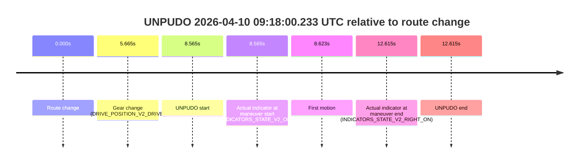
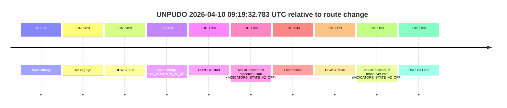
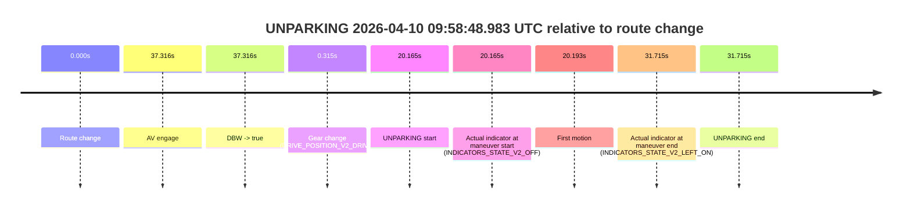

# Run Report: fme20031/2026-04-10--09-06-15--gen2-av-6f347e20-8200-4d00-a43e-3631a26a6699

| Field | Value |
|---|---|
| Run ID | `fme20031/2026-04-10--09-06-15--gen2-av-6f347e20-8200-4d00-a43e-3631a26a6699` |
| Date | `2026-04-10` |
| Model(s) | `lively-orange-horse` |
| Author | `guy.geva` |
| Event count | `4` |

## unpudo 2026-04-10 09:18:00.233 UTC

| Field | Value |
|---|---|
| Model | `lively-orange-horse` |
| Author | `guy.geva` |
| Run ID | `fme20031/2026-04-10--09-06-15--gen2-av-6f347e20-8200-4d00-a43e-3631a26a6699` |
| Date | `2026-04-10` |
| Time (UTC) | `09:18:00.233` |
| Event type | `unpudo` |
| Disengagement type | `none observed` |
| Route change | `found` |
| Console | [run](https://console.sso.wayve.ai/run/fme20031/2026-04-10--09-06-15--gen2-av-6f347e20-8200-4d00-a43e-3631a26a6699?id=&time-unixus=1775812680233298) |
| Foxglove | [segment](https://app.foxglove.dev/wayve-on-prem/p/prj_0dX18KZdVHg1fmmI/view?ds=foxglove-stream&ds.deviceName=fme20031&ds.start=2026-04-10T09%3A17%3A41.668391Z&ds.end=2026-04-10T09%3A18%3A14.283315Z&layoutId=lay_0e7VD4WIKDQGU73Y&time=2026-04-10T09%3A18%3A00.233298Z) |

### Event card: fail

- Fail: the credited unpudo does not stay AV-owned. The event window starts with DBW false, and the maneuver outcome lands outside a clean AV-owned segment.

| Event | Time (UTC) | Delta from route change |
|---|---:|---:|
| Route change | 2026-04-10 09:17:51.668 | `0.000s` |
| Gear change (DRIVE_POSITION_V2_DRIVE) | 2026-04-10 09:17:57.333 | `5.665s` |
| UNPUDO start | 2026-04-10 09:18:00.233 | `8.565s` |
| Actual indicator at maneuver start (INDICATORS_STATE_V2_OFF) | 2026-04-10 09:18:00.233 | `8.565s` |
| First motion | 2026-04-10 09:18:00.291 | `8.623s` |
| Actual indicator at maneuver end (INDICATORS_STATE_V2_RIGHT_ON) | 2026-04-10 09:18:04.283 | `12.615s` |
| UNPUDO end | 2026-04-10 09:18:04.283 | `12.615s` |

| Metric | Value |
|---|---|
| Outcome | `fail` |
| Effective failure type | `not_av_owned` |
| Route change status | `found` |
| DBW at event start | `false` |
| DBW at event end | `false` |
| Predicted gear at AV start | `n/a` |
| Actual gear at AV start | `n/a` |
| Predicted gear at event start | `DRIVE_POSITION_V2_DRIVE` |
| Actual gear at event start | `DRIVE_POSITION_V2_DRIVE` |
| Planned indicator direction | `INDICATORS_STATE_V2_RIGHT_ON` |
| Controller indicator direction | `INDICATORS_STATE_V2_RIGHT_ON` |
| Actual indicator direction | `INDICATORS_STATE_V2_OFF` |
| Actual indicator at maneuver end | `INDICATORS_STATE_V2_RIGHT_ON` |
| Driver accel help in AV | `false` |
| Driver accel help timestamp | `n/a` |
| Max accel pedal pct in AV | `0.0%` |
| Max brake pedal pct in AV | `0.0%` |
| Max speed mps in AV | `0.000` |
| Route -> AV | `n/a` |
| AV -> event start | `n/a` |
| AV -> first motion | `n/a` |
| AV duration before disengagement | `n/a` |
| Trajectory waypoint count | `38` |
| Driving-plan step count | `11` |

The scored portion starts from the AV-owned window, not from the pre-AV setup. Route-change search in the stopped pre-event segment was `found`, with the baseline therefore set to route change. At the event anchor the model predicts `DRIVE_POSITION_V2_DRIVE` and the actual gear is `DRIVE_POSITION_V2_DRIVE`. The effective model outcome is `fail` because `not_av_owned`.

### Resolution

| Field | Value |
|---|---|
| Final outcome | `fail` |
| Do we agree with this label? | `yes` |
| Source disengagement type | `none observed` |
| Resolved effective failure type | `not_av_owned` |
| Confidence | `high` |

## unpudo 2026-04-10 09:19:32.783 UTC

| Field | Value |
|---|---|
| Model | `lively-orange-horse` |
| Author | `guy.geva` |
| Run ID | `fme20031/2026-04-10--09-06-15--gen2-av-6f347e20-8200-4d00-a43e-3631a26a6699` |
| Date | `2026-04-10` |
| Time (UTC) | `09:19:32.783` |
| Event type | `unpudo` |
| Disengagement type | `none observed` |
| Route change | `found` |
| Console | [run](https://console.sso.wayve.ai/run/fme20031/2026-04-10--09-06-15--gen2-av-6f347e20-8200-4d00-a43e-3631a26a6699?id=&time-unixus=1775812772783303) |
| Foxglove | [segment](https://app.foxglove.dev/wayve-on-prem/p/prj_0dX18KZdVHg1fmmI/view?ds=foxglove-stream&ds.deviceName=fme20031&ds.start=2026-04-10T09%3A17%3A41.668391Z&ds.end=2026-04-10T09%3A21%3A20.584970Z&layoutId=lay_0e7VD4WIKDQGU73Y&time=2026-04-10T09%3A19%3A32.783303Z) |

### Event card: fail

- Fail: the credited unpudo does not stay AV-owned. The event window starts with DBW false, and the maneuver outcome lands outside a clean AV-owned segment.

| Event | Time (UTC) | Delta from route change |
|---|---:|---:|
| Route change | 2026-04-10 09:17:51.668 | `0.000s` |
| AV engage | 2026-04-10 09:19:39.313 | `107.646s` |
| DBW -> true | 2026-04-10 09:19:39.313 | `107.646s` |
| Gear change (DRIVE_POSITION_V2_DRIVE) | 2026-04-10 09:19:10.583 | `78.915s` |
| UNPUDO start | 2026-04-10 09:19:32.783 | `101.115s` |
| Actual indicator at maneuver start (INDICATORS_STATE_V2_OFF) | 2026-04-10 09:19:32.783 | `101.115s` |
| First motion | 2026-04-10 09:19:32.932 | `101.264s` |
| DBW -> false | 2026-04-10 09:21:10.584 | `198.917s` |
| Actual indicator at maneuver end (INDICATORS_STATE_V2_OFF) | 2026-04-10 09:19:38.183 | `106.515s` |
| UNPUDO end | 2026-04-10 09:19:38.183 | `106.515s` |

| Metric | Value |
|---|---|
| Outcome | `fail` |
| Effective failure type | `completed_outside_av` |
| Route change status | `found` |
| DBW at event start | `false` |
| DBW at event end | `false` |
| Predicted gear at AV start | `DRIVE_POSITION_V2_DRIVE` |
| Actual gear at AV start | `DRIVE_POSITION_V2_DRIVE` |
| Predicted gear at event start | `DRIVE_POSITION_V2_DRIVE` |
| Actual gear at event start | `DRIVE_POSITION_V2_DRIVE` |
| Planned indicator direction | `INDICATORS_STATE_V2_LEFT_ON` |
| Controller indicator direction | `INDICATORS_STATE_V2_LEFT_ON` |
| Actual indicator direction | `INDICATORS_STATE_V2_OFF` |
| Actual indicator at maneuver end | `INDICATORS_STATE_V2_OFF` |
| Driver accel help in AV | `false` |
| Driver accel help timestamp | `n/a` |
| Max accel pedal pct in AV | `0.0%` |
| Max brake pedal pct in AV | `0.0%` |
| Max speed mps in AV | `0.000` |
| Route -> AV | `107.646s` |
| AV -> event start | `-6.531s` |
| AV -> first motion | `-6.381s` |
| AV duration before disengagement | `91.271s` |
| Trajectory waypoint count | `37` |
| Driving-plan step count | `11` |

The scored portion starts from the AV-owned window, not from the pre-AV setup. Route-change search in the stopped pre-event segment was `found`, with the baseline therefore set to route change. At the event anchor the model predicts `DRIVE_POSITION_V2_DRIVE` and the actual gear is `DRIVE_POSITION_V2_DRIVE`. The effective model outcome is `fail` because `completed_outside_av`.

### Resolution

| Field | Value |
|---|---|
| Final outcome | `fail` |
| Do we agree with this label? | `yes` |
| Source disengagement type | `none observed` |
| Resolved effective failure type | `completed_outside_av` |
| Confidence | `high` |

## unpudo 2026-04-10 09:48:26.183 UTC

| Field | Value |
|---|---|
| Model | `lively-orange-horse` |
| Author | `guy.geva` |
| Run ID | `fme20031/2026-04-10--09-06-15--gen2-av-6f347e20-8200-4d00-a43e-3631a26a6699` |
| Date | `2026-04-10` |
| Time (UTC) | `09:48:26.183` |
| Event type | `unpudo` |
| Disengagement type | `failed_to_unpudo` |
| Route change | `found` |
| Console | [run](https://console.sso.wayve.ai/run/fme20031/2026-04-10--09-06-15--gen2-av-6f347e20-8200-4d00-a43e-3631a26a6699?id=&time-unixus=1775814506183312) |
| Foxglove | [segment](https://app.foxglove.dev/wayve-on-prem/p/prj_0dX18KZdVHg1fmmI/view?ds=foxglove-stream&ds.deviceName=fme20031&ds.start=2026-04-10T09%3A48%3A03.618275Z&ds.end=2026-04-10T09%3A51%3A22.134142Z&layoutId=lay_0e7VD4WIKDQGU73Y&time=2026-04-10T09%3A48%3A26.183312Z) |

### Event card: fail

- Fail: AV owns part of the segment, but the event still resolves as a model-performance failure under the AV-only scoring rule.

| Event | Time (UTC) | Delta from route change |
|---|---:|---:|
| Route change | 2026-04-10 09:48:13.618 | `0.000s` |
| AV engage | 2026-04-10 09:48:35.534 | `21.916s` |
| DBW -> true | 2026-04-10 09:48:35.534 | `21.916s` |
| Gear change (DRIVE_POSITION_V2_DRIVE) | 2026-04-10 09:48:13.933 | `0.315s` |
| UNPUDO start | 2026-04-10 09:48:26.183 | `12.565s` |
| Actual indicator at maneuver start (INDICATORS_STATE_V2_LEFT_ON) | 2026-04-10 09:48:26.183 | `12.565s` |
| First motion | 2026-04-10 09:48:26.231 | `12.613s` |
| DBW -> false | 2026-04-10 09:51:12.134 | `178.516s` |
| Actual indicator at maneuver end (INDICATORS_STATE_V2_LEFT_ON) | 2026-04-10 09:48:31.333 | `17.715s` |
| UNPUDO end | 2026-04-10 09:48:31.333 | `17.715s` |

| Metric | Value |
|---|---|
| Outcome | `fail` |
| Effective failure type | `failed_to_unpudo` |
| Route change status | `found` |
| DBW at event start | `false` |
| DBW at event end | `false` |
| Predicted gear at AV start | `DRIVE_POSITION_V2_DRIVE` |
| Actual gear at AV start | `DRIVE_POSITION_V2_DRIVE` |
| Predicted gear at event start | `DRIVE_POSITION_V2_DRIVE` |
| Actual gear at event start | `DRIVE_POSITION_V2_DRIVE` |
| Planned indicator direction | `INDICATORS_STATE_V2_OFF` |
| Controller indicator direction | `INDICATORS_STATE_V2_OFF` |
| Actual indicator direction | `INDICATORS_STATE_V2_LEFT_ON` |
| Actual indicator at maneuver end | `INDICATORS_STATE_V2_LEFT_ON` |
| Driver accel help in AV | `false` |
| Driver accel help timestamp | `n/a` |
| Max accel pedal pct in AV | `0.0%` |
| Max brake pedal pct in AV | `0.0%` |
| Max speed mps in AV | `0.000` |
| Route -> AV | `21.916s` |
| AV -> event start | `-9.351s` |
| AV -> first motion | `-9.302s` |
| AV duration before disengagement | `156.600s` |
| Trajectory waypoint count | `37` |
| Driving-plan step count | `11` |

The scored portion starts from the AV-owned window, not from the pre-AV setup. Route-change search in the stopped pre-event segment was `found`, with the baseline therefore set to route change. At the event anchor the model predicts `DRIVE_POSITION_V2_DRIVE` and the actual gear is `DRIVE_POSITION_V2_DRIVE`. The effective model outcome is `fail` because `failed_to_unpudo`.

### Resolution

| Field | Value |
|---|---|
| Final outcome | `fail` |
| Do we agree with this label? | `yes` |
| Source disengagement type | `failed_to_unpudo` |
| Resolved effective failure type | `failed_to_unpudo` |
| Confidence | `high` |

## unparking 2026-04-10 09:58:48.983 UTC

| Field | Value |
|---|---|
| Model | `lively-orange-horse` |
| Author | `guy.geva` |
| Run ID | `fme20031/2026-04-10--09-06-15--gen2-av-6f347e20-8200-4d00-a43e-3631a26a6699` |
| Date | `2026-04-10` |
| Time (UTC) | `09:58:48.983` |
| Event type | `unparking` |
| Disengagement type | `failed_to_unpudo` |
| Route change | `found` |
| Console | [run](https://console.sso.wayve.ai/run/fme20031/2026-04-10--09-06-15--gen2-av-6f347e20-8200-4d00-a43e-3631a26a6699?id=&time-unixus=1775815128983328) |
| Foxglove | [segment](https://app.foxglove.dev/wayve-on-prem/p/prj_0dX18KZdVHg1fmmI/view?ds=foxglove-stream&ds.deviceName=fme20031&ds.start=2026-04-10T09%3A58%3A18.818254Z&ds.end=2026-04-10T09%3A59%3A10.533297Z&layoutId=lay_0e7VD4WIKDQGU73Y&time=2026-04-10T09%3A58%3A48.983328Z) |

### Event card: fail

- Fail: AV owns part of the segment, but the event still resolves as a model-performance failure under the AV-only scoring rule.

| Event | Time (UTC) | Delta from route change |
|---|---:|---:|
| Route change | 2026-04-10 09:58:28.818 | `0.000s` |
| AV engage | 2026-04-10 09:59:06.134 | `37.316s` |
| DBW -> true | 2026-04-10 09:59:06.134 | `37.316s` |
| Gear change (DRIVE_POSITION_V2_DRIVE) | 2026-04-10 09:58:29.133 | `0.315s` |
| UNPARKING start | 2026-04-10 09:58:48.983 | `20.165s` |
| Actual indicator at maneuver start (INDICATORS_STATE_V2_OFF) | 2026-04-10 09:58:48.983 | `20.165s` |
| First motion | 2026-04-10 09:58:49.011 | `20.193s` |
| Actual indicator at maneuver end (INDICATORS_STATE_V2_LEFT_ON) | 2026-04-10 09:59:00.533 | `31.715s` |
| UNPARKING end | 2026-04-10 09:59:00.533 | `31.715s` |

| Metric | Value |
|---|---|
| Outcome | `fail` |
| Effective failure type | `failed_to_unpudo` |
| Route change status | `found` |
| DBW at event start | `false` |
| DBW at event end | `false` |
| Predicted gear at AV start | `DRIVE_POSITION_V2_DRIVE` |
| Actual gear at AV start | `DRIVE_POSITION_V2_DRIVE` |
| Predicted gear at event start | `DRIVE_POSITION_V2_DRIVE` |
| Actual gear at event start | `DRIVE_POSITION_V2_DRIVE` |
| Planned indicator direction | `INDICATORS_STATE_V2_RIGHT_ON` |
| Controller indicator direction | `INDICATORS_STATE_V2_RIGHT_ON` |
| Actual indicator direction | `INDICATORS_STATE_V2_OFF` |
| Actual indicator at maneuver end | `INDICATORS_STATE_V2_LEFT_ON` |
| Driver accel help in AV | `false` |
| Driver accel help timestamp | `n/a` |
| Max accel pedal pct in AV | `0.0%` |
| Max brake pedal pct in AV | `0.0%` |
| Max speed mps in AV | `0.000` |
| Route -> AV | `37.316s` |
| AV -> event start | `-17.151s` |
| AV -> first motion | `-17.122s` |
| AV duration before disengagement | `n/a` |
| Trajectory waypoint count | `37` |
| Driving-plan step count | `11` |

The scored portion starts from the AV-owned window, not from the pre-AV setup. Route-change search in the stopped pre-event segment was `found`, with the baseline therefore set to route change. At the event anchor the model predicts `DRIVE_POSITION_V2_DRIVE` and the actual gear is `DRIVE_POSITION_V2_DRIVE`. The effective model outcome is `fail` because `failed_to_unpudo`.

### Resolution

| Field | Value |
|---|---|
| Final outcome | `fail` |
| Do we agree with this label? | `yes` |
| Source disengagement type | `failed_to_unpudo` |
| Resolved effective failure type | `failed_to_unpudo` |
| Confidence | `high` |
