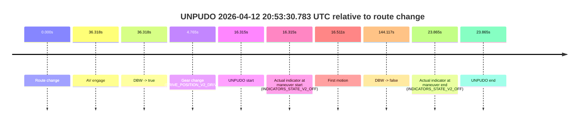
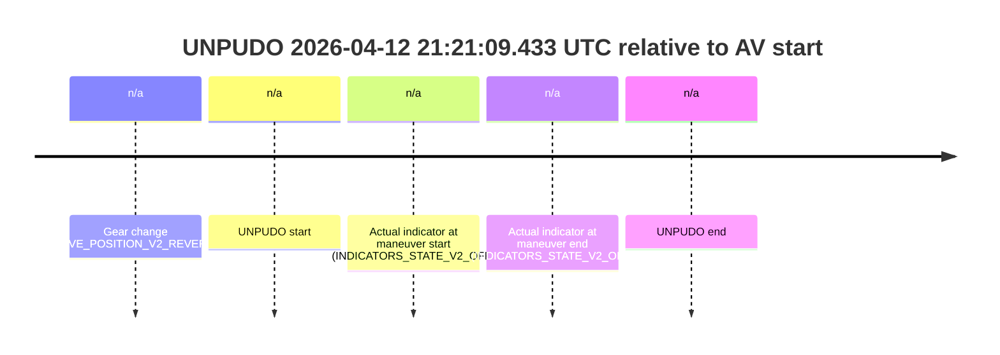
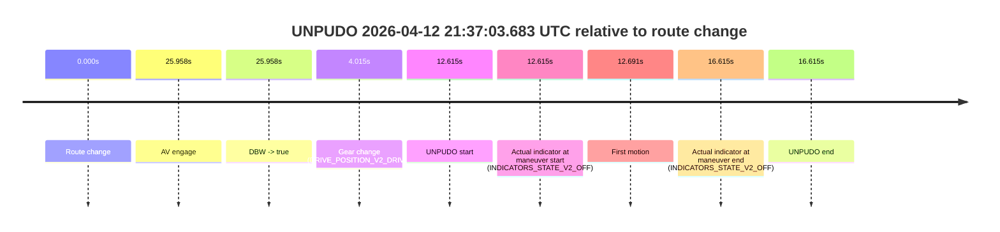

# Run Report: fme20031/2026-04-12--20-30-49--gen2-av-ac71cb9a-f102-4c0a-98d5-f0b257e2ca2b

| Field | Value |
|---|---|
| Run ID | `fme20031/2026-04-12--20-30-49--gen2-av-ac71cb9a-f102-4c0a-98d5-f0b257e2ca2b` |
| Date | `2026-04-12` |
| Model(s) | `lively-orange-horse` |
| Author | `guy.geva` |
| Event count | `10` |

## unpudo 2026-04-12 20:34:47.483 UTC

| Field | Value |
|---|---|
| Model | `lively-orange-horse` |
| Author | `guy.geva` |
| Run ID | `fme20031/2026-04-12--20-30-49--gen2-av-ac71cb9a-f102-4c0a-98d5-f0b257e2ca2b` |
| Date | `2026-04-12` |
| Time (UTC) | `20:34:47.483` |
| Event type | `unpudo` |
| Disengagement type | `failed_to_unpudo` |
| Route change | `found` |
| Console | [run](https://console.sso.wayve.ai/run/fme20031/2026-04-12--20-30-49--gen2-av-ac71cb9a-f102-4c0a-98d5-f0b257e2ca2b?id=&time-unixus=1776026087483308) |
| Foxglove | [segment](https://app.foxglove.dev/wayve-on-prem/p/prj_0dX18KZdVHg1fmmI/view?ds=foxglove-stream&ds.deviceName=fme20031&ds.start=2026-04-12T20%3A34%3A27.918299Z&ds.end=2026-04-12T20%3A38%3A08.844950Z&layoutId=lay_0e7VD4WIKDQGU73Y&time=2026-04-12T20%3A34%3A47.483308Z) |

### Event card: fail

- Fail: AV owns part of the segment, but the event still resolves as a model-performance failure under the AV-only scoring rule.

| Event | Time (UTC) | Delta from route change |
|---|---:|---:|
| Route change | 2026-04-12 20:34:37.918 | `0.000s` |
| AV engage | 2026-04-12 20:34:51.726 | `13.808s` |
| DBW -> true | 2026-04-12 20:34:51.726 | `13.808s` |
| Gear change (DRIVE_POSITION_V2_DRIVE) | 2026-04-12 20:34:38.183 | `0.265s` |
| UNPUDO start | 2026-04-12 20:34:47.483 | `9.565s` |
| Actual indicator at maneuver start (INDICATORS_STATE_V2_OFF) | 2026-04-12 20:34:47.483 | `9.565s` |
| First motion | 2026-04-12 20:34:47.539 | `9.621s` |
| DBW -> false | 2026-04-12 20:37:58.844 | `200.927s` |
| Actual indicator at maneuver end (INDICATORS_STATE_V2_OFF) | 2026-04-12 20:34:52.133 | `14.215s` |
| UNPUDO end | 2026-04-12 20:34:52.133 | `14.215s` |

| Metric | Value |
|---|---|
| Outcome | `fail` |
| Effective failure type | `failed_to_unpudo` |
| Route change status | `found` |
| DBW at event start | `false` |
| DBW at event end | `true` |
| Predicted gear at AV start | `DRIVE_POSITION_V2_DRIVE` |
| Actual gear at AV start | `DRIVE_POSITION_V2_DRIVE` |
| Predicted gear at event start | `DRIVE_POSITION_V2_DRIVE` |
| Actual gear at event start | `DRIVE_POSITION_V2_DRIVE` |
| Planned indicator direction | `INDICATORS_STATE_V2_OFF` |
| Controller indicator direction | `INDICATORS_STATE_V2_OFF` |
| Actual indicator direction | `INDICATORS_STATE_V2_OFF` |
| Actual indicator at maneuver end | `INDICATORS_STATE_V2_OFF` |
| Driver accel help in AV | `false` |
| Driver accel help timestamp | `n/a` |
| Max accel pedal pct in AV | `0.0%` |
| Max brake pedal pct in AV | `0.0%` |
| Max speed mps in AV | `3.469` |
| Route -> AV | `13.808s` |
| AV -> event start | `-4.243s` |
| AV -> first motion | `-4.186s` |
| AV duration before disengagement | `187.119s` |
| Trajectory waypoint count | `36` |
| Driving-plan step count | `11` |

The scored portion starts from the AV-owned window, not from the pre-AV setup. Route-change search in the stopped pre-event segment was `found`, with the baseline therefore set to route change. At the event anchor the model predicts `DRIVE_POSITION_V2_DRIVE` and the actual gear is `DRIVE_POSITION_V2_DRIVE`. The effective model outcome is `fail` because `failed_to_unpudo`.

### Resolution

| Field | Value |
|---|---|
| Final outcome | `fail` |
| Do we agree with this label? | `yes` |
| Source disengagement type | `failed_to_unpudo` |
| Resolved effective failure type | `failed_to_unpudo` |
| Confidence | `high` |

## unpudo 2026-04-12 20:42:25.283 UTC

| Field | Value |
|---|---|
| Model | `lively-orange-horse` |
| Author | `guy.geva` |
| Run ID | `fme20031/2026-04-12--20-30-49--gen2-av-ac71cb9a-f102-4c0a-98d5-f0b257e2ca2b` |
| Date | `2026-04-12` |
| Time (UTC) | `20:42:25.283` |
| Event type | `unpudo` |
| Disengagement type | `failed_to_unpudo` |
| Route change | `found` |
| Console | [run](https://console.sso.wayve.ai/run/fme20031/2026-04-12--20-30-49--gen2-av-ac71cb9a-f102-4c0a-98d5-f0b257e2ca2b?id=&time-unixus=1776026545283311) |
| Foxglove | [segment](https://app.foxglove.dev/wayve-on-prem/p/prj_0dX18KZdVHg1fmmI/view?ds=foxglove-stream&ds.deviceName=fme20031&ds.start=2026-04-12T20%3A40%3A47.218241Z&ds.end=2026-04-12T20%3A44%3A32.846161Z&layoutId=lay_0e7VD4WIKDQGU73Y&time=2026-04-12T20%3A42%3A25.283311Z) |

### Event card: fail

- Fail: AV owns part of the segment, but the event still resolves as a model-performance failure under the AV-only scoring rule.

| Event | Time (UTC) | Delta from route change |
|---|---:|---:|
| Route change | 2026-04-12 20:40:57.218 | `0.000s` |
| AV engage | 2026-04-12 20:42:36.825 | `99.608s` |
| DBW -> true | 2026-04-12 20:42:36.825 | `99.608s` |
| Gear change (DRIVE_POSITION_V2_DRIVE) | 2026-04-12 20:42:19.233 | `82.015s` |
| UNPUDO start | 2026-04-12 20:42:25.283 | `88.065s` |
| Actual indicator at maneuver start (INDICATORS_STATE_V2_OFF) | 2026-04-12 20:42:25.283 | `88.065s` |
| First motion | 2026-04-12 20:42:25.299 | `88.081s` |
| DBW -> false | 2026-04-12 20:44:22.846 | `205.628s` |
| Actual indicator at maneuver end (INDICATORS_STATE_V2_OFF) | 2026-04-12 20:42:29.133 | `91.915s` |
| UNPUDO end | 2026-04-12 20:42:29.133 | `91.915s` |

| Metric | Value |
|---|---|
| Outcome | `fail` |
| Effective failure type | `failed_to_unpudo` |
| Route change status | `found` |
| DBW at event start | `false` |
| DBW at event end | `false` |
| Predicted gear at AV start | `DRIVE_POSITION_V2_DRIVE` |
| Actual gear at AV start | `DRIVE_POSITION_V2_DRIVE` |
| Predicted gear at event start | `DRIVE_POSITION_V2_DRIVE` |
| Actual gear at event start | `DRIVE_POSITION_V2_DRIVE` |
| Planned indicator direction | `INDICATORS_STATE_V2_LEFT_ON` |
| Controller indicator direction | `INDICATORS_STATE_V2_LEFT_ON` |
| Actual indicator direction | `INDICATORS_STATE_V2_OFF` |
| Actual indicator at maneuver end | `INDICATORS_STATE_V2_OFF` |
| Driver accel help in AV | `false` |
| Driver accel help timestamp | `n/a` |
| Max accel pedal pct in AV | `0.0%` |
| Max brake pedal pct in AV | `0.0%` |
| Max speed mps in AV | `0.000` |
| Route -> AV | `99.608s` |
| AV -> event start | `-11.543s` |
| AV -> first motion | `-11.527s` |
| AV duration before disengagement | `106.020s` |
| Trajectory waypoint count | `36` |
| Driving-plan step count | `11` |

The scored portion starts from the AV-owned window, not from the pre-AV setup. Route-change search in the stopped pre-event segment was `found`, with the baseline therefore set to route change. At the event anchor the model predicts `DRIVE_POSITION_V2_DRIVE` and the actual gear is `DRIVE_POSITION_V2_DRIVE`. The effective model outcome is `fail` because `failed_to_unpudo`.

### Resolution

| Field | Value |
|---|---|
| Final outcome | `fail` |
| Do we agree with this label? | `yes` |
| Source disengagement type | `failed_to_unpudo` |
| Resolved effective failure type | `failed_to_unpudo` |
| Confidence | `high` |

## unpudo 2026-04-12 20:47:22.933 UTC

| Field | Value |
|---|---|
| Model | `lively-orange-horse` |
| Author | `guy.geva` |
| Run ID | `fme20031/2026-04-12--20-30-49--gen2-av-ac71cb9a-f102-4c0a-98d5-f0b257e2ca2b` |
| Date | `2026-04-12` |
| Time (UTC) | `20:47:22.933` |
| Event type | `unpudo` |
| Disengagement type | `failed_to_unpudo` |
| Route change | `found` |
| Console | [run](https://console.sso.wayve.ai/run/fme20031/2026-04-12--20-30-49--gen2-av-ac71cb9a-f102-4c0a-98d5-f0b257e2ca2b?id=&time-unixus=1776026842933308) |
| Foxglove | [segment](https://app.foxglove.dev/wayve-on-prem/p/prj_0dX18KZdVHg1fmmI/view?ds=foxglove-stream&ds.deviceName=fme20031&ds.start=2026-04-12T20%3A47%3A05.968263Z&ds.end=2026-04-12T20%3A48%3A55.426085Z&layoutId=lay_0e7VD4WIKDQGU73Y&time=2026-04-12T20%3A47%3A22.933308Z) |

### Event card: fail

- Fail: AV owns part of the segment, but the event still resolves as a model-performance failure under the AV-only scoring rule.

| Event | Time (UTC) | Delta from route change |
|---|---:|---:|
| Route change | 2026-04-12 20:47:15.968 | `0.000s` |
| AV engage | 2026-04-12 20:47:35.426 | `19.458s` |
| DBW -> true | 2026-04-12 20:47:35.426 | `19.458s` |
| Gear change (DRIVE_POSITION_V2_DRIVE) | 2026-04-12 20:47:16.233 | `0.265s` |
| UNPUDO start | 2026-04-12 20:47:22.933 | `6.965s` |
| Actual indicator at maneuver start (INDICATORS_STATE_V2_OFF) | 2026-04-12 20:47:22.933 | `6.965s` |
| First motion | 2026-04-12 20:47:22.979 | `7.011s` |
| DBW -> false | 2026-04-12 20:48:45.426 | `89.458s` |
| Actual indicator at maneuver end (INDICATORS_STATE_V2_OFF) | 2026-04-12 20:47:29.833 | `13.865s` |
| UNPUDO end | 2026-04-12 20:47:29.833 | `13.865s` |

| Metric | Value |
|---|---|
| Outcome | `fail` |
| Effective failure type | `failed_to_unpudo` |
| Route change status | `found` |
| DBW at event start | `false` |
| DBW at event end | `false` |
| Predicted gear at AV start | `DRIVE_POSITION_V2_DRIVE` |
| Actual gear at AV start | `DRIVE_POSITION_V2_DRIVE` |
| Predicted gear at event start | `DRIVE_POSITION_V2_DRIVE` |
| Actual gear at event start | `DRIVE_POSITION_V2_DRIVE` |
| Planned indicator direction | `INDICATORS_STATE_V2_RIGHT_ON` |
| Controller indicator direction | `INDICATORS_STATE_V2_RIGHT_ON` |
| Actual indicator direction | `INDICATORS_STATE_V2_OFF` |
| Actual indicator at maneuver end | `INDICATORS_STATE_V2_OFF` |
| Driver accel help in AV | `false` |
| Driver accel help timestamp | `n/a` |
| Max accel pedal pct in AV | `0.0%` |
| Max brake pedal pct in AV | `0.0%` |
| Max speed mps in AV | `0.000` |
| Route -> AV | `19.458s` |
| AV -> event start | `-12.493s` |
| AV -> first motion | `-12.447s` |
| AV duration before disengagement | `70.000s` |
| Trajectory waypoint count | `35` |
| Driving-plan step count | `11` |

The scored portion starts from the AV-owned window, not from the pre-AV setup. Route-change search in the stopped pre-event segment was `found`, with the baseline therefore set to route change. At the event anchor the model predicts `DRIVE_POSITION_V2_DRIVE` and the actual gear is `DRIVE_POSITION_V2_DRIVE`. The effective model outcome is `fail` because `failed_to_unpudo`.

### Resolution

| Field | Value |
|---|---|
| Final outcome | `fail` |
| Do we agree with this label? | `yes` |
| Source disengagement type | `failed_to_unpudo` |
| Resolved effective failure type | `failed_to_unpudo` |
| Confidence | `high` |

## unpudo 2026-04-12 20:53:30.783 UTC

| Field | Value |
|---|---|
| Model | `lively-orange-horse` |
| Author | `guy.geva` |
| Run ID | `fme20031/2026-04-12--20-30-49--gen2-av-ac71cb9a-f102-4c0a-98d5-f0b257e2ca2b` |
| Date | `2026-04-12` |
| Time (UTC) | `20:53:30.783` |
| Event type | `unpudo` |
| Disengagement type | `failed_to_unpudo` |
| Route change | `found` |
| Console | [run](https://console.sso.wayve.ai/run/fme20031/2026-04-12--20-30-49--gen2-av-ac71cb9a-f102-4c0a-98d5-f0b257e2ca2b?id=&time-unixus=1776027210783317) |
| Foxglove | [segment](https://app.foxglove.dev/wayve-on-prem/p/prj_0dX18KZdVHg1fmmI/view?ds=foxglove-stream&ds.deviceName=fme20031&ds.start=2026-04-12T20%3A53%3A04.468271Z&ds.end=2026-04-12T20%3A55%3A48.584966Z&layoutId=lay_0e7VD4WIKDQGU73Y&time=2026-04-12T20%3A53%3A30.783317Z) |

### Event card: fail

- Fail: AV owns part of the segment, but the event still resolves as a model-performance failure under the AV-only scoring rule.

| Event | Time (UTC) | Delta from route change |
|---|---:|---:|
| Route change | 2026-04-12 20:53:14.468 | `0.000s` |
| AV engage | 2026-04-12 20:53:50.786 | `36.318s` |
| DBW -> true | 2026-04-12 20:53:50.786 | `36.318s` |
| Gear change (DRIVE_POSITION_V2_DRIVE) | 2026-04-12 20:53:19.233 | `4.765s` |
| UNPUDO start | 2026-04-12 20:53:30.783 | `16.315s` |
| Actual indicator at maneuver start (INDICATORS_STATE_V2_OFF) | 2026-04-12 20:53:30.783 | `16.315s` |
| First motion | 2026-04-12 20:53:30.979 | `16.511s` |
| DBW -> false | 2026-04-12 20:55:38.584 | `144.117s` |
| Actual indicator at maneuver end (INDICATORS_STATE_V2_OFF) | 2026-04-12 20:53:38.333 | `23.865s` |
| UNPUDO end | 2026-04-12 20:53:38.333 | `23.865s` |

| Metric | Value |
|---|---|
| Outcome | `fail` |
| Effective failure type | `failed_to_unpudo` |
| Route change status | `found` |
| DBW at event start | `false` |
| DBW at event end | `false` |
| Predicted gear at AV start | `DRIVE_POSITION_V2_DRIVE` |
| Actual gear at AV start | `DRIVE_POSITION_V2_DRIVE` |
| Predicted gear at event start | `DRIVE_POSITION_V2_DRIVE` |
| Actual gear at event start | `DRIVE_POSITION_V2_DRIVE` |
| Planned indicator direction | `INDICATORS_STATE_V2_RIGHT_ON` |
| Controller indicator direction | `INDICATORS_STATE_V2_RIGHT_ON` |
| Actual indicator direction | `INDICATORS_STATE_V2_OFF` |
| Actual indicator at maneuver end | `INDICATORS_STATE_V2_OFF` |
| Driver accel help in AV | `false` |
| Driver accel help timestamp | `n/a` |
| Max accel pedal pct in AV | `0.0%` |
| Max brake pedal pct in AV | `0.0%` |
| Max speed mps in AV | `0.000` |
| Route -> AV | `36.318s` |
| AV -> event start | `-20.003s` |
| AV -> first motion | `-19.807s` |
| AV duration before disengagement | `107.799s` |
| Trajectory waypoint count | `36` |
| Driving-plan step count | `11` |

The scored portion starts from the AV-owned window, not from the pre-AV setup. Route-change search in the stopped pre-event segment was `found`, with the baseline therefore set to route change. At the event anchor the model predicts `DRIVE_POSITION_V2_DRIVE` and the actual gear is `DRIVE_POSITION_V2_DRIVE`. The effective model outcome is `fail` because `failed_to_unpudo`.

### Resolution

| Field | Value |
|---|---|
| Final outcome | `fail` |
| Do we agree with this label? | `yes` |
| Source disengagement type | `failed_to_unpudo` |
| Resolved effective failure type | `failed_to_unpudo` |
| Confidence | `high` |

## unpudo 2026-04-12 21:07:44.433 UTC

| Field | Value |
|---|---|
| Model | `lively-orange-horse` |
| Author | `guy.geva` |
| Run ID | `fme20031/2026-04-12--20-30-49--gen2-av-ac71cb9a-f102-4c0a-98d5-f0b257e2ca2b` |
| Date | `2026-04-12` |
| Time (UTC) | `21:07:44.433` |
| Event type | `unpudo` |
| Disengagement type | `failed_to_unpudo` |
| Route change | `found` |
| Console | [run](https://console.sso.wayve.ai/run/fme20031/2026-04-12--20-30-49--gen2-av-ac71cb9a-f102-4c0a-98d5-f0b257e2ca2b?id=&time-unixus=1776028064433299) |
| Foxglove | [segment](https://app.foxglove.dev/wayve-on-prem/p/prj_0dX18KZdVHg1fmmI/view?ds=foxglove-stream&ds.deviceName=fme20031&ds.start=2026-04-12T21%3A07%3A10.618267Z&ds.end=2026-04-12T21%3A09%3A15.645420Z&layoutId=lay_0e7VD4WIKDQGU73Y&time=2026-04-12T21%3A07%3A44.433299Z) |

### Event card: fail

- Fail: AV owns part of the segment, but the event still resolves as a model-performance failure under the AV-only scoring rule.

| Event | Time (UTC) | Delta from route change |
|---|---:|---:|
| Route change | 2026-04-12 21:07:20.618 | `0.000s` |
| AV engage | 2026-04-12 21:08:00.504 | `39.887s` |
| DBW -> true | 2026-04-12 21:08:00.504 | `39.887s` |
| Gear change (DRIVE_POSITION_V2_DRIVE) | 2026-04-12 21:07:20.933 | `0.315s` |
| UNPUDO start | 2026-04-12 21:07:44.433 | `23.815s` |
| Actual indicator at maneuver start (INDICATORS_STATE_V2_OFF) | 2026-04-12 21:07:44.433 | `23.815s` |
| First motion | 2026-04-12 21:07:44.479 | `23.861s` |
| DBW -> false | 2026-04-12 21:09:05.645 | `105.027s` |
| Actual indicator at maneuver end (INDICATORS_STATE_V2_OFF) | 2026-04-12 21:07:47.683 | `27.065s` |
| UNPUDO end | 2026-04-12 21:07:47.683 | `27.065s` |

| Metric | Value |
|---|---|
| Outcome | `fail` |
| Effective failure type | `failed_to_unpudo` |
| Route change status | `found` |
| DBW at event start | `false` |
| DBW at event end | `false` |
| Predicted gear at AV start | `DRIVE_POSITION_V2_DRIVE` |
| Actual gear at AV start | `DRIVE_POSITION_V2_DRIVE` |
| Predicted gear at event start | `DRIVE_POSITION_V2_DRIVE` |
| Actual gear at event start | `DRIVE_POSITION_V2_DRIVE` |
| Planned indicator direction | `INDICATORS_STATE_V2_RIGHT_ON` |
| Controller indicator direction | `INDICATORS_STATE_V2_RIGHT_ON` |
| Actual indicator direction | `INDICATORS_STATE_V2_OFF` |
| Actual indicator at maneuver end | `INDICATORS_STATE_V2_OFF` |
| Driver accel help in AV | `false` |
| Driver accel help timestamp | `n/a` |
| Max accel pedal pct in AV | `0.0%` |
| Max brake pedal pct in AV | `0.0%` |
| Max speed mps in AV | `0.000` |
| Route -> AV | `39.887s` |
| AV -> event start | `-16.072s` |
| AV -> first motion | `-16.026s` |
| AV duration before disengagement | `65.140s` |
| Trajectory waypoint count | `37` |
| Driving-plan step count | `11` |

The scored portion starts from the AV-owned window, not from the pre-AV setup. Route-change search in the stopped pre-event segment was `found`, with the baseline therefore set to route change. At the event anchor the model predicts `DRIVE_POSITION_V2_DRIVE` and the actual gear is `DRIVE_POSITION_V2_DRIVE`. The effective model outcome is `fail` because `failed_to_unpudo`.

### Resolution

| Field | Value |
|---|---|
| Final outcome | `fail` |
| Do we agree with this label? | `yes` |
| Source disengagement type | `failed_to_unpudo` |
| Resolved effective failure type | `failed_to_unpudo` |
| Confidence | `high` |

## unpudo 2026-04-12 21:09:06.183 UTC

| Field | Value |
|---|---|
| Model | `lively-orange-horse` |
| Author | `guy.geva` |
| Run ID | `fme20031/2026-04-12--20-30-49--gen2-av-ac71cb9a-f102-4c0a-98d5-f0b257e2ca2b` |
| Date | `2026-04-12` |
| Time (UTC) | `21:09:06.183` |
| Event type | `unpudo` |
| Disengagement type | `failed_to_unpudo` |
| Route change | `found` |
| Console | [run](https://console.sso.wayve.ai/run/fme20031/2026-04-12--20-30-49--gen2-av-ac71cb9a-f102-4c0a-98d5-f0b257e2ca2b?id=&time-unixus=1776028146183295) |
| Foxglove | [segment](https://app.foxglove.dev/wayve-on-prem/p/prj_0dX18KZdVHg1fmmI/view?ds=foxglove-stream&ds.deviceName=fme20031&ds.start=2026-04-12T21%3A07%3A10.618267Z&ds.end=2026-04-12T21%3A14%3A01.524860Z&layoutId=lay_0e7VD4WIKDQGU73Y&time=2026-04-12T21%3A09%3A06.183295Z) |

### Event card: fail

- Fail: AV owns part of the segment, but the event still resolves as a model-performance failure under the AV-only scoring rule.

| Event | Time (UTC) | Delta from route change |
|---|---:|---:|
| Route change | 2026-04-12 21:07:20.618 | `0.000s` |
| AV engage | 2026-04-12 21:09:13.946 | `113.328s` |
| DBW -> true | 2026-04-12 21:09:13.946 | `113.328s` |
| Gear change (DRIVE_POSITION_V2_DRIVE) | 2026-04-12 21:08:56.833 | `96.215s` |
| UNPUDO start | 2026-04-12 21:09:06.183 | `105.565s` |
| Actual indicator at maneuver start (INDICATORS_STATE_V2_OFF) | 2026-04-12 21:09:06.183 | `105.565s` |
| First motion | 2026-04-12 21:09:06.199 | `105.581s` |
| DBW -> false | 2026-04-12 21:13:51.524 | `390.907s` |
| Actual indicator at maneuver end (INDICATORS_STATE_V2_OFF) | 2026-04-12 21:09:09.583 | `108.965s` |
| UNPUDO end | 2026-04-12 21:09:09.583 | `108.965s` |

| Metric | Value |
|---|---|
| Outcome | `fail` |
| Effective failure type | `failed_to_unpudo` |
| Route change status | `found` |
| DBW at event start | `false` |
| DBW at event end | `false` |
| Predicted gear at AV start | `DRIVE_POSITION_V2_DRIVE` |
| Actual gear at AV start | `DRIVE_POSITION_V2_DRIVE` |
| Predicted gear at event start | `DRIVE_POSITION_V2_DRIVE` |
| Actual gear at event start | `DRIVE_POSITION_V2_DRIVE` |
| Planned indicator direction | `INDICATORS_STATE_V2_RIGHT_ON` |
| Controller indicator direction | `INDICATORS_STATE_V2_RIGHT_ON` |
| Actual indicator direction | `INDICATORS_STATE_V2_OFF` |
| Actual indicator at maneuver end | `INDICATORS_STATE_V2_OFF` |
| Driver accel help in AV | `false` |
| Driver accel help timestamp | `n/a` |
| Max accel pedal pct in AV | `0.0%` |
| Max brake pedal pct in AV | `0.0%` |
| Max speed mps in AV | `0.000` |
| Route -> AV | `113.328s` |
| AV -> event start | `-7.763s` |
| AV -> first motion | `-7.747s` |
| AV duration before disengagement | `277.579s` |
| Trajectory waypoint count | `36` |
| Driving-plan step count | `11` |

The scored portion starts from the AV-owned window, not from the pre-AV setup. Route-change search in the stopped pre-event segment was `found`, with the baseline therefore set to route change. At the event anchor the model predicts `DRIVE_POSITION_V2_DRIVE` and the actual gear is `DRIVE_POSITION_V2_DRIVE`. The effective model outcome is `fail` because `failed_to_unpudo`.

### Resolution

| Field | Value |
|---|---|
| Final outcome | `fail` |
| Do we agree with this label? | `yes` |
| Source disengagement type | `failed_to_unpudo` |
| Resolved effective failure type | `failed_to_unpudo` |
| Confidence | `high` |

## unpudo 2026-04-12 21:15:42.933 UTC

| Field | Value |
|---|---|
| Model | `lively-orange-horse` |
| Author | `guy.geva` |
| Run ID | `fme20031/2026-04-12--20-30-49--gen2-av-ac71cb9a-f102-4c0a-98d5-f0b257e2ca2b` |
| Date | `2026-04-12` |
| Time (UTC) | `21:15:42.933` |
| Event type | `unpudo` |
| Disengagement type | `failed_to_unpudo` |
| Route change | `found` |
| Console | [run](https://console.sso.wayve.ai/run/fme20031/2026-04-12--20-30-49--gen2-av-ac71cb9a-f102-4c0a-98d5-f0b257e2ca2b?id=&time-unixus=1776028542933304) |
| Foxglove | [segment](https://app.foxglove.dev/wayve-on-prem/p/prj_0dX18KZdVHg1fmmI/view?ds=foxglove-stream&ds.deviceName=fme20031&ds.start=2026-04-12T21%3A14%3A11.718336Z&ds.end=2026-04-12T21%3A19%3A43.764980Z&layoutId=lay_0e7VD4WIKDQGU73Y&time=2026-04-12T21%3A15%3A42.933304Z) |

### Event card: fail

- Fail: AV owns part of the segment, but the event still resolves as a model-performance failure under the AV-only scoring rule.

| Event | Time (UTC) | Delta from route change |
|---|---:|---:|
| Route change | 2026-04-12 21:14:21.718 | `0.000s` |
| AV engage | 2026-04-12 21:15:51.645 | `89.927s` |
| DBW -> true | 2026-04-12 21:15:51.645 | `89.927s` |
| Gear change (DRIVE_POSITION_V2_DRIVE) | 2026-04-12 21:15:37.233 | `75.515s` |
| UNPUDO start | 2026-04-12 21:15:42.933 | `81.215s` |
| Actual indicator at maneuver start (INDICATORS_STATE_V2_OFF) | 2026-04-12 21:15:42.933 | `81.215s` |
| First motion | 2026-04-12 21:15:42.999 | `81.281s` |
| DBW -> false | 2026-04-12 21:19:33.764 | `312.047s` |
| Actual indicator at maneuver end (INDICATORS_STATE_V2_OFF) | 2026-04-12 21:15:56.533 | `94.815s` |
| UNPUDO end | 2026-04-12 21:15:56.533 | `94.815s` |

| Metric | Value |
|---|---|
| Outcome | `fail` |
| Effective failure type | `failed_to_unpudo` |
| Route change status | `found` |
| DBW at event start | `false` |
| DBW at event end | `true` |
| Predicted gear at AV start | `DRIVE_POSITION_V2_DRIVE` |
| Actual gear at AV start | `DRIVE_POSITION_V2_DRIVE` |
| Predicted gear at event start | `DRIVE_POSITION_V2_DRIVE` |
| Actual gear at event start | `DRIVE_POSITION_V2_DRIVE` |
| Planned indicator direction | `INDICATORS_STATE_V2_RIGHT_ON` |
| Controller indicator direction | `INDICATORS_STATE_V2_RIGHT_ON` |
| Actual indicator direction | `INDICATORS_STATE_V2_OFF` |
| Actual indicator at maneuver end | `INDICATORS_STATE_V2_OFF` |
| Driver accel help in AV | `false` |
| Driver accel help timestamp | `n/a` |
| Max accel pedal pct in AV | `0.0%` |
| Max brake pedal pct in AV | `8.0%` |
| Max speed mps in AV | `2.267` |
| Route -> AV | `89.927s` |
| AV -> event start | `-8.713s` |
| AV -> first motion | `-8.647s` |
| AV duration before disengagement | `222.119s` |
| Trajectory waypoint count | `35` |
| Driving-plan step count | `11` |

The scored portion starts from the AV-owned window, not from the pre-AV setup. Route-change search in the stopped pre-event segment was `found`, with the baseline therefore set to route change. At the event anchor the model predicts `DRIVE_POSITION_V2_DRIVE` and the actual gear is `DRIVE_POSITION_V2_DRIVE`. The effective model outcome is `fail` because `failed_to_unpudo`.

### Resolution

| Field | Value |
|---|---|
| Final outcome | `fail` |
| Do we agree with this label? | `yes` |
| Source disengagement type | `failed_to_unpudo` |
| Resolved effective failure type | `failed_to_unpudo` |
| Confidence | `high` |

## unpudo 2026-04-12 21:21:09.433 UTC

| Field | Value |
|---|---|
| Model | `lively-orange-horse` |
| Author | `guy.geva` |
| Run ID | `fme20031/2026-04-12--20-30-49--gen2-av-ac71cb9a-f102-4c0a-98d5-f0b257e2ca2b` |
| Date | `2026-04-12` |
| Time (UTC) | `21:21:09.433` |
| Event type | `unpudo` |
| Disengagement type | `none observed` |
| Route change | `unclear` |
| Console | [run](https://console.sso.wayve.ai/run/fme20031/2026-04-12--20-30-49--gen2-av-ac71cb9a-f102-4c0a-98d5-f0b257e2ca2b?id=&time-unixus=1776028869433317) |
| Foxglove | [segment](https://app.foxglove.dev/wayve-on-prem/p/prj_0dX18KZdVHg1fmmI/view?ds=foxglove-stream&ds.deviceName=fme20031&ds.start=2026-04-12T21%3A20%3A54.083295Z&ds.end=2026-04-12T21%3A21%3A19.433317Z&layoutId=lay_0e7VD4WIKDQGU73Y&time=2026-04-12T21%3A21%3A09.433317Z) |

### Event card: fail

- Fail: the credited unpudo does not stay AV-owned. The event window starts with DBW false, and the maneuver outcome lands outside a clean AV-owned segment.

| Event | Time (UTC) | Delta from AV start |
|---|---:|---:|
| Gear change (DRIVE_POSITION_V2_REVERSE) | 2026-04-12 21:21:04.083 | `n/a` |
| UNPUDO start | 2026-04-12 21:21:09.433 | `n/a` |
| Actual indicator at maneuver start (INDICATORS_STATE_V2_OFF) | 2026-04-12 21:21:09.433 | `n/a` |
| Actual indicator at maneuver end (INDICATORS_STATE_V2_OFF) | 2026-04-12 21:21:09.433 | `n/a` |
| UNPUDO end | 2026-04-12 21:21:09.433 | `n/a` |

| Metric | Value |
|---|---|
| Outcome | `fail` |
| Effective failure type | `not_av_owned` |
| Route change status | `unclear` |
| DBW at event start | `false` |
| DBW at event end | `false` |
| Predicted gear at AV start | `n/a` |
| Actual gear at AV start | `n/a` |
| Predicted gear at event start | `DRIVE_POSITION_V2_DRIVE` |
| Actual gear at event start | `DRIVE_POSITION_V2_REVERSE` |
| Planned indicator direction | `INDICATORS_STATE_V2_OFF` |
| Controller indicator direction | `INDICATORS_STATE_V2_OFF` |
| Actual indicator direction | `INDICATORS_STATE_V2_OFF` |
| Actual indicator at maneuver end | `INDICATORS_STATE_V2_OFF` |
| Driver accel help in AV | `false` |
| Driver accel help timestamp | `n/a` |
| Max accel pedal pct in AV | `0.0%` |
| Max brake pedal pct in AV | `0.0%` |
| Max speed mps in AV | `0.000` |
| Route -> AV | `n/a` |
| AV -> event start | `n/a` |
| AV -> first motion | `n/a` |
| AV duration before disengagement | `n/a` |
| Trajectory waypoint count | `37` |
| Driving-plan step count | `11` |

The scored portion starts from the AV-owned window, not from the pre-AV setup. Route-change search in the stopped pre-event segment was `unclear`, with the baseline therefore set to AV start. At the event anchor the model predicts `DRIVE_POSITION_V2_DRIVE` and the actual gear is `DRIVE_POSITION_V2_REVERSE`. The effective model outcome is `fail` because `not_av_owned`.

### Resolution

| Field | Value |
|---|---|
| Final outcome | `fail` |
| Do we agree with this label? | `yes` |
| Source disengagement type | `none observed` |
| Resolved effective failure type | `not_av_owned` |
| Confidence | `medium` |

## unpudo 2026-04-12 21:33:04.083 UTC

| Field | Value |
|---|---|
| Model | `lively-orange-horse` |
| Author | `guy.geva` |
| Run ID | `fme20031/2026-04-12--20-30-49--gen2-av-ac71cb9a-f102-4c0a-98d5-f0b257e2ca2b` |
| Date | `2026-04-12` |
| Time (UTC) | `21:33:04.083` |
| Event type | `unpudo` |
| Disengagement type | `failed_to_unpudo` |
| Route change | `found` |
| Console | [run](https://console.sso.wayve.ai/run/fme20031/2026-04-12--20-30-49--gen2-av-ac71cb9a-f102-4c0a-98d5-f0b257e2ca2b?id=&time-unixus=1776029584083300) |
| Foxglove | [segment](https://app.foxglove.dev/wayve-on-prem/p/prj_0dX18KZdVHg1fmmI/view?ds=foxglove-stream&ds.deviceName=fme20031&ds.start=2026-04-12T21%3A32%3A27.318282Z&ds.end=2026-04-12T21%3A36%3A50.324857Z&layoutId=lay_0e7VD4WIKDQGU73Y&time=2026-04-12T21%3A33%3A04.083300Z) |

### Event card: fail

- Fail: AV owns part of the segment, but the event still resolves as a model-performance failure under the AV-only scoring rule.

| Event | Time (UTC) | Delta from route change |
|---|---:|---:|
| Route change | 2026-04-12 21:32:37.318 | `0.000s` |
| AV engage | 2026-04-12 21:33:21.044 | `43.727s` |
| DBW -> true | 2026-04-12 21:33:21.044 | `43.727s` |
| Gear change (DRIVE_POSITION_V2_REVERSE) | 2026-04-12 21:32:59.033 | `21.715s` |
| UNPUDO start | 2026-04-12 21:33:04.083 | `26.765s` |
| Actual indicator at maneuver start (INDICATORS_STATE_V2_OFF) | 2026-04-12 21:33:04.083 | `26.765s` |
| First motion | 2026-04-12 21:33:15.339 | `38.021s` |
| DBW -> false | 2026-04-12 21:36:40.324 | `243.007s` |
| Actual indicator at maneuver end (INDICATORS_STATE_V2_OFF) | 2026-04-12 21:33:17.783 | `40.465s` |
| UNPUDO end | 2026-04-12 21:33:17.783 | `40.465s` |

| Metric | Value |
|---|---|
| Outcome | `fail` |
| Effective failure type | `failed_to_unpudo` |
| Route change status | `found` |
| DBW at event start | `false` |
| DBW at event end | `false` |
| Predicted gear at AV start | `DRIVE_POSITION_V2_DRIVE` |
| Actual gear at AV start | `DRIVE_POSITION_V2_DRIVE` |
| Predicted gear at event start | `DRIVE_POSITION_V2_DRIVE` |
| Actual gear at event start | `DRIVE_POSITION_V2_REVERSE` |
| Planned indicator direction | `INDICATORS_STATE_V2_OFF` |
| Controller indicator direction | `INDICATORS_STATE_V2_OFF` |
| Actual indicator direction | `INDICATORS_STATE_V2_OFF` |
| Actual indicator at maneuver end | `INDICATORS_STATE_V2_OFF` |
| Driver accel help in AV | `false` |
| Driver accel help timestamp | `n/a` |
| Max accel pedal pct in AV | `0.0%` |
| Max brake pedal pct in AV | `0.0%` |
| Max speed mps in AV | `0.000` |
| Route -> AV | `43.727s` |
| AV -> event start | `-16.962s` |
| AV -> first motion | `-5.706s` |
| AV duration before disengagement | `199.280s` |
| Trajectory waypoint count | `36` |
| Driving-plan step count | `11` |

The scored portion starts from the AV-owned window, not from the pre-AV setup. Route-change search in the stopped pre-event segment was `found`, with the baseline therefore set to route change. At the event anchor the model predicts `DRIVE_POSITION_V2_DRIVE` and the actual gear is `DRIVE_POSITION_V2_REVERSE`. The effective model outcome is `fail` because `failed_to_unpudo`.

### Resolution

| Field | Value |
|---|---|
| Final outcome | `fail` |
| Do we agree with this label? | `yes` |
| Source disengagement type | `failed_to_unpudo` |
| Resolved effective failure type | `failed_to_unpudo` |
| Confidence | `high` |

## unpudo 2026-04-12 21:37:03.683 UTC

| Field | Value |
|---|---|
| Model | `lively-orange-horse` |
| Author | `guy.geva` |
| Run ID | `fme20031/2026-04-12--20-30-49--gen2-av-ac71cb9a-f102-4c0a-98d5-f0b257e2ca2b` |
| Date | `2026-04-12` |
| Time (UTC) | `21:37:03.683` |
| Event type | `unpudo` |
| Disengagement type | `failed_to_unpudo` |
| Route change | `found` |
| Console | [run](https://console.sso.wayve.ai/run/fme20031/2026-04-12--20-30-49--gen2-av-ac71cb9a-f102-4c0a-98d5-f0b257e2ca2b?id=&time-unixus=1776029823683312) |
| Foxglove | [segment](https://app.foxglove.dev/wayve-on-prem/p/prj_0dX18KZdVHg1fmmI/view?ds=foxglove-stream&ds.deviceName=fme20031&ds.start=2026-04-12T21%3A36%3A41.068255Z&ds.end=2026-04-12T21%3A37%3A17.683293Z&layoutId=lay_0e7VD4WIKDQGU73Y&time=2026-04-12T21%3A37%3A03.683312Z) |

### Event card: fail

- Fail: AV owns part of the segment, but the event still resolves as a model-performance failure under the AV-only scoring rule.

| Event | Time (UTC) | Delta from route change |
|---|---:|---:|
| Route change | 2026-04-12 21:36:51.068 | `0.000s` |
| AV engage | 2026-04-12 21:37:17.026 | `25.958s` |
| DBW -> true | 2026-04-12 21:37:17.026 | `25.958s` |
| Gear change (DRIVE_POSITION_V2_DRIVE) | 2026-04-12 21:36:55.083 | `4.015s` |
| UNPUDO start | 2026-04-12 21:37:03.683 | `12.615s` |
| Actual indicator at maneuver start (INDICATORS_STATE_V2_OFF) | 2026-04-12 21:37:03.683 | `12.615s` |
| First motion | 2026-04-12 21:37:03.759 | `12.691s` |
| Actual indicator at maneuver end (INDICATORS_STATE_V2_OFF) | 2026-04-12 21:37:07.683 | `16.615s` |
| UNPUDO end | 2026-04-12 21:37:07.683 | `16.615s` |

| Metric | Value |
|---|---|
| Outcome | `fail` |
| Effective failure type | `failed_to_unpudo` |
| Route change status | `found` |
| DBW at event start | `false` |
| DBW at event end | `false` |
| Predicted gear at AV start | `DRIVE_POSITION_V2_DRIVE` |
| Actual gear at AV start | `DRIVE_POSITION_V2_DRIVE` |
| Predicted gear at event start | `DRIVE_POSITION_V2_DRIVE` |
| Actual gear at event start | `DRIVE_POSITION_V2_DRIVE` |
| Planned indicator direction | `INDICATORS_STATE_V2_RIGHT_ON` |
| Controller indicator direction | `INDICATORS_STATE_V2_RIGHT_ON` |
| Actual indicator direction | `INDICATORS_STATE_V2_OFF` |
| Actual indicator at maneuver end | `INDICATORS_STATE_V2_OFF` |
| Driver accel help in AV | `false` |
| Driver accel help timestamp | `n/a` |
| Max accel pedal pct in AV | `0.0%` |
| Max brake pedal pct in AV | `0.0%` |
| Max speed mps in AV | `0.000` |
| Route -> AV | `25.958s` |
| AV -> event start | `-13.343s` |
| AV -> first motion | `-13.267s` |
| AV duration before disengagement | `n/a` |
| Trajectory waypoint count | `36` |
| Driving-plan step count | `11` |

The scored portion starts from the AV-owned window, not from the pre-AV setup. Route-change search in the stopped pre-event segment was `found`, with the baseline therefore set to route change. At the event anchor the model predicts `DRIVE_POSITION_V2_DRIVE` and the actual gear is `DRIVE_POSITION_V2_DRIVE`. The effective model outcome is `fail` because `failed_to_unpudo`.

### Resolution

| Field | Value |
|---|---|
| Final outcome | `fail` |
| Do we agree with this label? | `yes` |
| Source disengagement type | `failed_to_unpudo` |
| Resolved effective failure type | `failed_to_unpudo` |
| Confidence | `high` |
