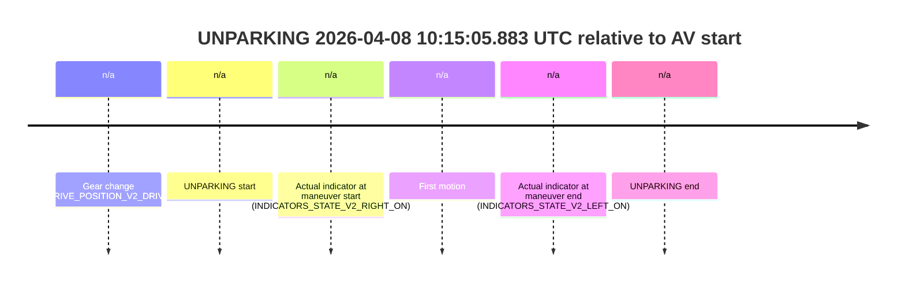

# Run Report: fme20032/2026-04-08--09-40-13--gen2-av-01ac7fd3-3f1e-4e6b-86d8-bcb37f963bc3

| Field | Value |
|---|---|
| Run ID | `fme20032/2026-04-08--09-40-13--gen2-av-01ac7fd3-3f1e-4e6b-86d8-bcb37f963bc3` |
| Date | `2026-04-08` |
| Model(s) | `lively-orange-horse` |
| Author | `guy.geva` |
| Event count | `1` |

## unparking 2026-04-08 10:15:05.883 UTC

| Field | Value |
|---|---|
| Model | `lively-orange-horse` |
| Author | `guy.geva` |
| Run ID | `fme20032/2026-04-08--09-40-13--gen2-av-01ac7fd3-3f1e-4e6b-86d8-bcb37f963bc3` |
| Date | `2026-04-08` |
| Time (UTC) | `10:15:05.883` |
| Event type | `unparking` |
| Disengagement type | `none observed` |
| Route change | `unclear` |
| Console | [run](https://console.sso.wayve.ai/run/fme20032/2026-04-08--09-40-13--gen2-av-01ac7fd3-3f1e-4e6b-86d8-bcb37f963bc3?id=&time-unixus=1775643305883327) |
| Foxglove | [segment](https://app.foxglove.dev/wayve-on-prem/p/prj_0dX18KZdVHg1fmmI/view?ds=foxglove-stream&ds.deviceName=fme20032&ds.start=2026-04-08T10%3A14%3A54.683297Z&ds.end=2026-04-08T10%3A15%3A19.233313Z&layoutId=lay_0e7VD4WIKDQGU73Y&time=2026-04-08T10%3A15%3A05.883327Z) |

### Event card: non-av

- Non-AV: the detected unparking starts outside AV ownership, so it is kept for coverage but excluded from model success / failure scoring.

| Event | Time (UTC) | Delta from AV start |
|---|---:|---:|
| Gear change (DRIVE_POSITION_V2_DRIVE) | 2026-04-08 10:15:04.683 | `n/a` |
| UNPARKING start | 2026-04-08 10:15:05.883 | `n/a` |
| Actual indicator at maneuver start (INDICATORS_STATE_V2_RIGHT_ON) | 2026-04-08 10:15:05.883 | `n/a` |
| First motion | 2026-04-08 10:15:05.904 | `n/a` |
| Actual indicator at maneuver end (INDICATORS_STATE_V2_LEFT_ON) | 2026-04-08 10:15:09.233 | `n/a` |
| UNPARKING end | 2026-04-08 10:15:09.233 | `n/a` |

| Metric | Value |
|---|---|
| Outcome | `non-av` |
| Effective failure type | `none` |
| Route change status | `unclear` |
| DBW at event start | `false` |
| DBW at event end | `false` |
| Predicted gear at AV start | `n/a` |
| Actual gear at AV start | `n/a` |
| Predicted gear at event start | `DRIVE_POSITION_V2_DRIVE` |
| Actual gear at event start | `DRIVE_POSITION_V2_DRIVE` |
| Planned indicator direction | `INDICATORS_STATE_V2_OFF` |
| Controller indicator direction | `INDICATORS_STATE_V2_OFF` |
| Actual indicator direction | `INDICATORS_STATE_V2_RIGHT_ON` |
| Actual indicator at maneuver end | `INDICATORS_STATE_V2_LEFT_ON` |
| Driver accel help in AV | `false` |
| Driver accel help timestamp | `n/a` |
| Max accel pedal pct in AV | `0.0%` |
| Max brake pedal pct in AV | `0.0%` |
| Max speed mps in AV | `0.000` |
| Route -> AV | `n/a` |
| AV -> event start | `n/a` |
| AV -> first motion | `n/a` |
| AV duration before disengagement | `n/a` |
| Trajectory waypoint count | `37` |
| Driving-plan step count | `11` |

The scored portion starts from the AV-owned window, not from the pre-AV setup. Route-change search in the stopped pre-event segment was `unclear`, with the baseline therefore set to AV start. At the event anchor the model predicts `DRIVE_POSITION_V2_DRIVE` and the actual gear is `DRIVE_POSITION_V2_DRIVE`. The effective model outcome is `non-av` because `the event does not begin in AV ownership`.

### Resolution

| Field | Value |
|---|---|
| Final outcome | `non-av` |
| Do we agree with this label? | `yes` |
| Source disengagement type | `none observed` |
| Resolved effective failure type | `none` |
| Confidence | `medium` |
