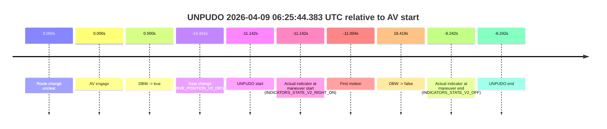
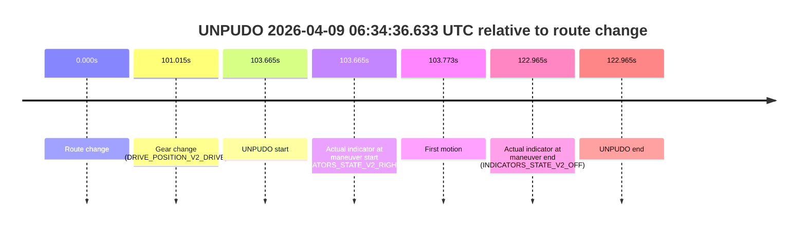
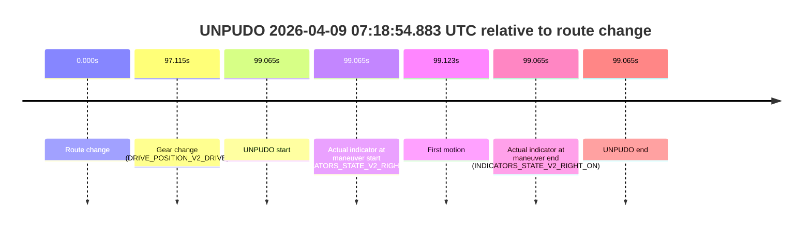
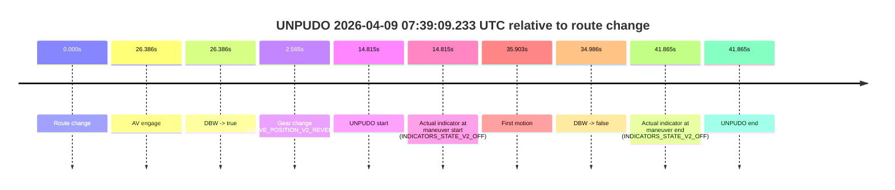

# Run Report: fme20032/2026-04-09--06-05-17--gen2-av-4cd98cf7-ef7c-4cc7-a88d-dc5512104251

| Field | Value |
|---|---|
| Run ID | `fme20032/2026-04-09--06-05-17--gen2-av-4cd98cf7-ef7c-4cc7-a88d-dc5512104251` |
| Date | `2026-04-09` |
| Model(s) | `lively-orange-horse` |
| Author | `guy.geva` |
| Event count | `23` |

## unpudo 2026-04-09 06:13:36.833 UTC

| Field | Value |
|---|---|
| Model | `lively-orange-horse` |
| Author | `guy.geva` |
| Run ID | `fme20032/2026-04-09--06-05-17--gen2-av-4cd98cf7-ef7c-4cc7-a88d-dc5512104251` |
| Date | `2026-04-09` |
| Time (UTC) | `06:13:36.833` |
| Event type | `unpudo` |
| Disengagement type | `failed_to_unpudo` |
| Route change | `found` |
| Console | [run](https://console.sso.wayve.ai/run/fme20032/2026-04-09--06-05-17--gen2-av-4cd98cf7-ef7c-4cc7-a88d-dc5512104251?id=&time-unixus=1775715216833301) |
| Foxglove | [segment](https://app.foxglove.dev/wayve-on-prem/p/prj_0dX18KZdVHg1fmmI/view?ds=foxglove-stream&ds.deviceName=fme20032&ds.start=2026-04-09T06%3A13%3A11.268471Z&ds.end=2026-04-09T06%3A14%3A29.884603Z&layoutId=lay_0e7VD4WIKDQGU73Y&time=2026-04-09T06%3A13%3A36.833301Z) |

### Event card: accidental

- Accidental: AV ownership is present for less than `2s`, so this is treated as an accidental brush with the maneuver rather than a meaningful model attempt.

| Event | Time (UTC) | Delta from route change |
|---|---:|---:|
| Route change | 2026-04-09 06:13:21.268 | `0.000s` |
| AV engage | 2026-04-09 06:13:45.445 | `24.177s` |
| DBW -> true | 2026-04-09 06:13:45.445 | `24.177s` |
| Gear change (DRIVE_POSITION_V2_DRIVE) | 2026-04-09 06:13:30.583 | `9.315s` |
| UNPUDO start | 2026-04-09 06:13:36.833 | `15.565s` |
| Actual indicator at maneuver start (INDICATORS_STATE_V2_OFF) | 2026-04-09 06:13:36.833 | `15.565s` |
| First motion | 2026-04-09 06:13:36.921 | `15.653s` |
| DBW -> false | 2026-04-09 06:14:19.884 | `58.616s` |
| Actual indicator at maneuver end (INDICATORS_STATE_V2_OFF) | 2026-04-09 06:13:41.983 | `20.715s` |
| UNPUDO end | 2026-04-09 06:13:41.983 | `20.715s` |


| Metric | Value |
|---|---|
| Outcome | `accidental` |
| Effective failure type | `none` |
| Route change status | `found` |
| DBW at event start | `false` |
| DBW at event end | `false` |
| Predicted gear at AV start | `DRIVE_POSITION_V2_DRIVE` |
| Actual gear at AV start | `DRIVE_POSITION_V2_DRIVE` |
| Predicted gear at event start | `DRIVE_POSITION_V2_DRIVE` |
| Actual gear at event start | `DRIVE_POSITION_V2_DRIVE` |
| Planned indicator direction | `INDICATORS_STATE_V2_RIGHT_ON` |
| Controller indicator direction | `INDICATORS_STATE_V2_RIGHT_ON` |
| Actual indicator direction | `INDICATORS_STATE_V2_OFF` |
| Actual indicator at maneuver end | `INDICATORS_STATE_V2_OFF` |
| Driver accel help in AV | `false` |
| Driver accel help timestamp | `n/a` |
| Max accel pedal pct in AV | `0.0%` |
| Max brake pedal pct in AV | `0.0%` |
| Max speed mps in AV | `0.000` |
| Route -> AV | `24.177s` |
| AV -> event start | `-8.612s` |
| AV -> first motion | `-8.524s` |
| AV duration before disengagement | `34.439s` |
| Trajectory waypoint count | `36` |
| Driving-plan step count | `11` |

The scored portion starts from the AV-owned window, not from the pre-AV setup. Route-change search in the stopped pre-event segment was `found`, with the baseline therefore set to route change. At the event anchor the model predicts `DRIVE_POSITION_V2_DRIVE` and the actual gear is `DRIVE_POSITION_V2_DRIVE`. The effective model outcome is `accidental` because `the AV-owned portion is shorter than 2s`.

### Resolution

| Field | Value |
|---|---|
| Final outcome | `accidental` |
| Do we agree with this label? | `yes` |
| Source disengagement type | `failed_to_unpudo` |
| Resolved effective failure type | `none` |
| Confidence | `high` |

## unpudo 2026-04-09 06:16:29.483 UTC

| Field | Value |
|---|---|
| Model | `lively-orange-horse` |
| Author | `guy.geva` |
| Run ID | `fme20032/2026-04-09--06-05-17--gen2-av-4cd98cf7-ef7c-4cc7-a88d-dc5512104251` |
| Date | `2026-04-09` |
| Time (UTC) | `06:16:29.483` |
| Event type | `unpudo` |
| Disengagement type | `failed_to_unpudo` |
| Route change | `found` |
| Console | [run](https://console.sso.wayve.ai/run/fme20032/2026-04-09--06-05-17--gen2-av-4cd98cf7-ef7c-4cc7-a88d-dc5512104251?id=&time-unixus=1775715389483309) |
| Foxglove | [segment](https://app.foxglove.dev/wayve-on-prem/p/prj_0dX18KZdVHg1fmmI/view?ds=foxglove-stream&ds.deviceName=fme20032&ds.start=2026-04-09T06%3A16%3A05.918271Z&ds.end=2026-04-09T06%3A17%3A14.033304Z&layoutId=lay_0e7VD4WIKDQGU73Y&time=2026-04-09T06%3A16%3A29.483309Z) |

### Event card: non-av

- Non-AV: the detected unpudo starts outside AV ownership, so it is kept for coverage but excluded from model success / failure scoring.

| Event | Time (UTC) | Delta from route change |
|---|---:|---:|
| Route change | 2026-04-09 06:16:15.918 | `0.000s` |
| AV engage | 2026-04-09 06:16:52.484 | `36.566s` |
| DBW -> true | 2026-04-09 06:16:52.484 | `36.566s` |
| Gear change (DRIVE_POSITION_V2_REVERSE) | 2026-04-09 06:16:24.483 | `8.565s` |
| UNPUDO start | 2026-04-09 06:16:29.483 | `13.565s` |
| Actual indicator at maneuver start (INDICATORS_STATE_V2_OFF) | 2026-04-09 06:16:29.483 | `13.565s` |
| First motion | 2026-04-09 06:16:40.181 | `24.263s` |
| DBW -> false | 2026-04-09 06:16:58.165 | `42.247s` |
| Actual indicator at maneuver end (INDICATORS_STATE_V2_OFF) | 2026-04-09 06:17:04.033 | `48.115s` |
| UNPUDO end | 2026-04-09 06:17:04.033 | `48.115s` |


| Metric | Value |
|---|---|
| Outcome | `non-av` |
| Effective failure type | `none` |
| Route change status | `found` |
| DBW at event start | `false` |
| DBW at event end | `false` |
| Predicted gear at AV start | `DRIVE_POSITION_V2_DRIVE` |
| Actual gear at AV start | `DRIVE_POSITION_V2_PARK` |
| Predicted gear at event start | `DRIVE_POSITION_V2_DRIVE` |
| Actual gear at event start | `DRIVE_POSITION_V2_REVERSE` |
| Planned indicator direction | `INDICATORS_STATE_V2_OFF` |
| Controller indicator direction | `INDICATORS_STATE_V2_OFF` |
| Actual indicator direction | `INDICATORS_STATE_V2_OFF` |
| Actual indicator at maneuver end | `INDICATORS_STATE_V2_OFF` |
| Driver accel help in AV | `false` |
| Driver accel help timestamp | `n/a` |
| Max accel pedal pct in AV | `0.0%` |
| Max brake pedal pct in AV | `8.0%` |
| Max speed mps in AV | `0.000` |
| Route -> AV | `36.566s` |
| AV -> event start | `-23.001s` |
| AV -> first motion | `-12.303s` |
| AV duration before disengagement | `5.681s` |
| Trajectory waypoint count | `37` |
| Driving-plan step count | `11` |

The scored portion starts from the AV-owned window, not from the pre-AV setup. Route-change search in the stopped pre-event segment was `found`, with the baseline therefore set to route change. At the event anchor the model predicts `DRIVE_POSITION_V2_DRIVE` and the actual gear is `DRIVE_POSITION_V2_REVERSE`. The effective model outcome is `non-av` because `the event does not begin in AV ownership`.

### Resolution

| Field | Value |
|---|---|
| Final outcome | `non-av` |
| Do we agree with this label? | `yes` |
| Source disengagement type | `failed_to_unpudo` |
| Resolved effective failure type | `none` |
| Confidence | `high` |

## unpudo 2026-04-09 06:19:31.083 UTC

| Field | Value |
|---|---|
| Model | `lively-orange-horse` |
| Author | `guy.geva` |
| Run ID | `fme20032/2026-04-09--06-05-17--gen2-av-4cd98cf7-ef7c-4cc7-a88d-dc5512104251` |
| Date | `2026-04-09` |
| Time (UTC) | `06:19:31.083` |
| Event type | `unpudo` |
| Disengagement type | `failed_to_unpudo` |
| Route change | `found` |
| Console | [run](https://console.sso.wayve.ai/run/fme20032/2026-04-09--06-05-17--gen2-av-4cd98cf7-ef7c-4cc7-a88d-dc5512104251?id=&time-unixus=1775715571083309) |
| Foxglove | [segment](https://app.foxglove.dev/wayve-on-prem/p/prj_0dX18KZdVHg1fmmI/view?ds=foxglove-stream&ds.deviceName=fme20032&ds.start=2026-04-09T06%3A19%3A12.118258Z&ds.end=2026-04-09T06%3A21%3A45.803719Z&layoutId=lay_0e7VD4WIKDQGU73Y&time=2026-04-09T06%3A19%3A31.083309Z) |

### Event card: accidental

- Accidental: AV ownership is present for less than `2s`, so this is treated as an accidental brush with the maneuver rather than a meaningful model attempt.

| Event | Time (UTC) | Delta from route change |
|---|---:|---:|
| Route change | 2026-04-09 06:19:22.118 | `0.000s` |
| AV engage | 2026-04-09 06:19:39.245 | `17.127s` |
| DBW -> true | 2026-04-09 06:19:39.245 | `17.127s` |
| Gear change (DRIVE_POSITION_V2_DRIVE) | 2026-04-09 06:19:22.483 | `0.365s` |
| UNPUDO start | 2026-04-09 06:19:31.083 | `8.965s` |
| Actual indicator at maneuver start (INDICATORS_STATE_V2_OFF) | 2026-04-09 06:19:31.083 | `8.965s` |
| First motion | 2026-04-09 06:19:31.141 | `9.023s` |
| DBW -> false | 2026-04-09 06:21:35.803 | `133.685s` |
| Actual indicator at maneuver end (INDICATORS_STATE_V2_OFF) | 2026-04-09 06:19:36.533 | `14.415s` |
| UNPUDO end | 2026-04-09 06:19:36.533 | `14.415s` |


| Metric | Value |
|---|---|
| Outcome | `accidental` |
| Effective failure type | `none` |
| Route change status | `found` |
| DBW at event start | `false` |
| DBW at event end | `false` |
| Predicted gear at AV start | `DRIVE_POSITION_V2_DRIVE` |
| Actual gear at AV start | `DRIVE_POSITION_V2_DRIVE` |
| Predicted gear at event start | `DRIVE_POSITION_V2_DRIVE` |
| Actual gear at event start | `DRIVE_POSITION_V2_DRIVE` |
| Planned indicator direction | `INDICATORS_STATE_V2_RIGHT_ON` |
| Controller indicator direction | `INDICATORS_STATE_V2_RIGHT_ON` |
| Actual indicator direction | `INDICATORS_STATE_V2_OFF` |
| Actual indicator at maneuver end | `INDICATORS_STATE_V2_OFF` |
| Driver accel help in AV | `false` |
| Driver accel help timestamp | `n/a` |
| Max accel pedal pct in AV | `0.0%` |
| Max brake pedal pct in AV | `0.0%` |
| Max speed mps in AV | `0.000` |
| Route -> AV | `17.127s` |
| AV -> event start | `-8.162s` |
| AV -> first motion | `-8.105s` |
| AV duration before disengagement | `116.558s` |
| Trajectory waypoint count | `37` |
| Driving-plan step count | `11` |

The scored portion starts from the AV-owned window, not from the pre-AV setup. Route-change search in the stopped pre-event segment was `found`, with the baseline therefore set to route change. At the event anchor the model predicts `DRIVE_POSITION_V2_DRIVE` and the actual gear is `DRIVE_POSITION_V2_DRIVE`. The effective model outcome is `accidental` because `the AV-owned portion is shorter than 2s`.

### Resolution

| Field | Value |
|---|---|
| Final outcome | `accidental` |
| Do we agree with this label? | `yes` |
| Source disengagement type | `failed_to_unpudo` |
| Resolved effective failure type | `none` |
| Confidence | `high` |

## unpudo 2026-04-09 06:21:36.833 UTC

| Field | Value |
|---|---|
| Model | `lively-orange-horse` |
| Author | `guy.geva` |
| Run ID | `fme20032/2026-04-09--06-05-17--gen2-av-4cd98cf7-ef7c-4cc7-a88d-dc5512104251` |
| Date | `2026-04-09` |
| Time (UTC) | `06:21:36.833` |
| Event type | `unpudo` |
| Disengagement type | `failed_to_unpudo` |
| Route change | `found` |
| Console | [run](https://console.sso.wayve.ai/run/fme20032/2026-04-09--06-05-17--gen2-av-4cd98cf7-ef7c-4cc7-a88d-dc5512104251?id=&time-unixus=1775715696833305) |
| Foxglove | [segment](https://app.foxglove.dev/wayve-on-prem/p/prj_0dX18KZdVHg1fmmI/view?ds=foxglove-stream&ds.deviceName=fme20032&ds.start=2026-04-09T06%3A21%3A10.668328Z&ds.end=2026-04-09T06%3A23%3A07.604525Z&layoutId=lay_0e7VD4WIKDQGU73Y&time=2026-04-09T06%3A21%3A36.833305Z) |

### Event card: accidental

- Accidental: AV ownership is present for less than `2s`, so this is treated as an accidental brush with the maneuver rather than a meaningful model attempt.

| Event | Time (UTC) | Delta from route change |
|---|---:|---:|
| Route change | 2026-04-09 06:21:20.668 | `0.000s` |
| AV engage | 2026-04-09 06:21:54.184 | `33.516s` |
| DBW -> true | 2026-04-09 06:21:54.184 | `33.516s` |
| Gear change (DRIVE_POSITION_V2_DRIVE) | 2026-04-09 06:21:20.983 | `0.315s` |
| UNPUDO start | 2026-04-09 06:21:36.833 | `16.165s` |
| Actual indicator at maneuver start (INDICATORS_STATE_V2_RIGHT_ON) | 2026-04-09 06:21:36.833 | `16.165s` |
| First motion | 2026-04-09 06:21:36.921 | `16.253s` |
| DBW -> false | 2026-04-09 06:22:57.604 | `96.936s` |
| Actual indicator at maneuver end (INDICATORS_STATE_V2_LEFT_ON) | 2026-04-09 06:21:47.533 | `26.865s` |
| UNPUDO end | 2026-04-09 06:21:47.533 | `26.865s` |


| Metric | Value |
|---|---|
| Outcome | `accidental` |
| Effective failure type | `none` |
| Route change status | `found` |
| DBW at event start | `false` |
| DBW at event end | `false` |
| Predicted gear at AV start | `DRIVE_POSITION_V2_DRIVE` |
| Actual gear at AV start | `DRIVE_POSITION_V2_DRIVE` |
| Predicted gear at event start | `DRIVE_POSITION_V2_DRIVE` |
| Actual gear at event start | `DRIVE_POSITION_V2_DRIVE` |
| Planned indicator direction | `INDICATORS_STATE_V2_OFF` |
| Controller indicator direction | `INDICATORS_STATE_V2_OFF` |
| Actual indicator direction | `INDICATORS_STATE_V2_RIGHT_ON` |
| Actual indicator at maneuver end | `INDICATORS_STATE_V2_LEFT_ON` |
| Driver accel help in AV | `false` |
| Driver accel help timestamp | `n/a` |
| Max accel pedal pct in AV | `0.0%` |
| Max brake pedal pct in AV | `0.0%` |
| Max speed mps in AV | `0.000` |
| Route -> AV | `33.516s` |
| AV -> event start | `-17.351s` |
| AV -> first motion | `-17.263s` |
| AV duration before disengagement | `63.420s` |
| Trajectory waypoint count | `36` |
| Driving-plan step count | `11` |

The scored portion starts from the AV-owned window, not from the pre-AV setup. Route-change search in the stopped pre-event segment was `found`, with the baseline therefore set to route change. At the event anchor the model predicts `DRIVE_POSITION_V2_DRIVE` and the actual gear is `DRIVE_POSITION_V2_DRIVE`. The effective model outcome is `accidental` because `the AV-owned portion is shorter than 2s`.

### Resolution

| Field | Value |
|---|---|
| Final outcome | `accidental` |
| Do we agree with this label? | `yes` |
| Source disengagement type | `failed_to_unpudo` |
| Resolved effective failure type | `none` |
| Confidence | `high` |

## unpudo 2026-04-09 06:25:44.383 UTC

| Field | Value |
|---|---|
| Model | `lively-orange-horse` |
| Author | `guy.geva` |
| Run ID | `fme20032/2026-04-09--06-05-17--gen2-av-4cd98cf7-ef7c-4cc7-a88d-dc5512104251` |
| Date | `2026-04-09` |
| Time (UTC) | `06:25:44.383` |
| Event type | `unpudo` |
| Disengagement type | `failed_to_unpudo` |
| Route change | `unclear` |
| Console | [run](https://console.sso.wayve.ai/run/fme20032/2026-04-09--06-05-17--gen2-av-4cd98cf7-ef7c-4cc7-a88d-dc5512104251?id=&time-unixus=1775715944383294) |
| Foxglove | [segment](https://app.foxglove.dev/wayve-on-prem/p/prj_0dX18KZdVHg1fmmI/view?ds=foxglove-stream&ds.deviceName=fme20032&ds.start=2026-04-09T06%3A25%3A31.183294Z&ds.end=2026-04-09T06%3A26%3A23.944727Z&layoutId=lay_0e7VD4WIKDQGU73Y&time=2026-04-09T06%3A25%3A44.383294Z) |

### Event card: accidental

- Accidental: AV ownership is present for less than `2s`, so this is treated as an accidental brush with the maneuver rather than a meaningful model attempt.

| Event | Time (UTC) | Delta from AV start |
|---|---:|---:|
| Route change unclear | 2026-04-09 06:25:55.525 | `0.000s` |
| AV engage | 2026-04-09 06:25:55.525 | `0.000s` |
| DBW -> true | 2026-04-09 06:25:55.525 | `0.000s` |
| Gear change (DRIVE_POSITION_V2_DRIVE) | 2026-04-09 06:25:41.183 | `-14.342s` |
| UNPUDO start | 2026-04-09 06:25:44.383 | `-11.142s` |
| Actual indicator at maneuver start (INDICATORS_STATE_V2_RIGHT_ON) | 2026-04-09 06:25:44.383 | `-11.142s` |
| First motion | 2026-04-09 06:25:44.521 | `-11.004s` |
| DBW -> false | 2026-04-09 06:26:13.944 | `18.419s` |
| Actual indicator at maneuver end (INDICATORS_STATE_V2_OFF) | 2026-04-09 06:25:49.283 | `-6.242s` |
| UNPUDO end | 2026-04-09 06:25:49.283 | `-6.242s` |



| Metric | Value |
|---|---|
| Outcome | `accidental` |
| Effective failure type | `none` |
| Route change status | `unclear` |
| DBW at event start | `false` |
| DBW at event end | `false` |
| Predicted gear at AV start | `DRIVE_POSITION_V2_DRIVE` |
| Actual gear at AV start | `DRIVE_POSITION_V2_DRIVE` |
| Predicted gear at event start | `DRIVE_POSITION_V2_DRIVE` |
| Actual gear at event start | `DRIVE_POSITION_V2_DRIVE` |
| Planned indicator direction | `INDICATORS_STATE_V2_OFF` |
| Controller indicator direction | `INDICATORS_STATE_V2_OFF` |
| Actual indicator direction | `INDICATORS_STATE_V2_RIGHT_ON` |
| Actual indicator at maneuver end | `INDICATORS_STATE_V2_OFF` |
| Driver accel help in AV | `false` |
| Driver accel help timestamp | `n/a` |
| Max accel pedal pct in AV | `0.0%` |
| Max brake pedal pct in AV | `0.0%` |
| Max speed mps in AV | `0.000` |
| Route -> AV | `n/a` |
| AV -> event start | `-11.142s` |
| AV -> first motion | `-11.004s` |
| AV duration before disengagement | `18.419s` |
| Trajectory waypoint count | `37` |
| Driving-plan step count | `11` |

The scored portion starts from the AV-owned window, not from the pre-AV setup. Route-change search in the stopped pre-event segment was `unclear`, with the baseline therefore set to AV start. At the event anchor the model predicts `DRIVE_POSITION_V2_DRIVE` and the actual gear is `DRIVE_POSITION_V2_DRIVE`. The effective model outcome is `accidental` because `the AV-owned portion is shorter than 2s`.

### Resolution

| Field | Value |
|---|---|
| Final outcome | `accidental` |
| Do we agree with this label? | `yes` |
| Source disengagement type | `failed_to_unpudo` |
| Resolved effective failure type | `none` |
| Confidence | `medium` |

## unpudo 2026-04-09 06:34:36.633 UTC

| Field | Value |
|---|---|
| Model | `lively-orange-horse` |
| Author | `guy.geva` |
| Run ID | `fme20032/2026-04-09--06-05-17--gen2-av-4cd98cf7-ef7c-4cc7-a88d-dc5512104251` |
| Date | `2026-04-09` |
| Time (UTC) | `06:34:36.633` |
| Event type | `unpudo` |
| Disengagement type | `none observed` |
| Route change | `found` |
| Console | [run](https://console.sso.wayve.ai/run/fme20032/2026-04-09--06-05-17--gen2-av-4cd98cf7-ef7c-4cc7-a88d-dc5512104251?id=&time-unixus=1775716476633308) |
| Foxglove | [segment](https://app.foxglove.dev/wayve-on-prem/p/prj_0dX18KZdVHg1fmmI/view?ds=foxglove-stream&ds.deviceName=fme20032&ds.start=2026-04-09T06%3A32%3A42.968231Z&ds.end=2026-04-09T06%3A35%3A05.933314Z&layoutId=lay_0e7VD4WIKDQGU73Y&time=2026-04-09T06%3A34%3A36.633308Z) |

### Event card: non-av

- Non-AV: the detected unpudo starts outside AV ownership, so it is kept for coverage but excluded from model success / failure scoring.

| Event | Time (UTC) | Delta from route change |
|---|---:|---:|
| Route change | 2026-04-09 06:32:52.968 | `0.000s` |
| Gear change (DRIVE_POSITION_V2_DRIVE) | 2026-04-09 06:34:33.983 | `101.015s` |
| UNPUDO start | 2026-04-09 06:34:36.633 | `103.665s` |
| Actual indicator at maneuver start (INDICATORS_STATE_V2_RIGHT_ON) | 2026-04-09 06:34:36.633 | `103.665s` |
| First motion | 2026-04-09 06:34:36.741 | `103.773s` |
| Actual indicator at maneuver end (INDICATORS_STATE_V2_OFF) | 2026-04-09 06:34:55.933 | `122.965s` |
| UNPUDO end | 2026-04-09 06:34:55.933 | `122.965s` |



| Metric | Value |
|---|---|
| Outcome | `non-av` |
| Effective failure type | `none` |
| Route change status | `found` |
| DBW at event start | `false` |
| DBW at event end | `false` |
| Predicted gear at AV start | `n/a` |
| Actual gear at AV start | `n/a` |
| Predicted gear at event start | `DRIVE_POSITION_V2_DRIVE` |
| Actual gear at event start | `DRIVE_POSITION_V2_DRIVE` |
| Planned indicator direction | `INDICATORS_STATE_V2_RIGHT_ON` |
| Controller indicator direction | `INDICATORS_STATE_V2_RIGHT_ON` |
| Actual indicator direction | `INDICATORS_STATE_V2_RIGHT_ON` |
| Actual indicator at maneuver end | `INDICATORS_STATE_V2_OFF` |
| Driver accel help in AV | `false` |
| Driver accel help timestamp | `n/a` |
| Max accel pedal pct in AV | `0.0%` |
| Max brake pedal pct in AV | `0.0%` |
| Max speed mps in AV | `0.000` |
| Route -> AV | `n/a` |
| AV -> event start | `n/a` |
| AV -> first motion | `n/a` |
| AV duration before disengagement | `n/a` |
| Trajectory waypoint count | `36` |
| Driving-plan step count | `11` |

The scored portion starts from the AV-owned window, not from the pre-AV setup. Route-change search in the stopped pre-event segment was `found`, with the baseline therefore set to route change. At the event anchor the model predicts `DRIVE_POSITION_V2_DRIVE` and the actual gear is `DRIVE_POSITION_V2_DRIVE`. The effective model outcome is `non-av` because `the event does not begin in AV ownership`.

### Resolution

| Field | Value |
|---|---|
| Final outcome | `non-av` |
| Do we agree with this label? | `yes` |
| Source disengagement type | `none observed` |
| Resolved effective failure type | `none` |
| Confidence | `high` |

## unpudo 2026-04-09 06:37:05.883 UTC

| Field | Value |
|---|---|
| Model | `lively-orange-horse` |
| Author | `guy.geva` |
| Run ID | `fme20032/2026-04-09--06-05-17--gen2-av-4cd98cf7-ef7c-4cc7-a88d-dc5512104251` |
| Date | `2026-04-09` |
| Time (UTC) | `06:37:05.883` |
| Event type | `unpudo` |
| Disengagement type | `failed_to_unpudo` |
| Route change | `found` |
| Console | [run](https://console.sso.wayve.ai/run/fme20032/2026-04-09--06-05-17--gen2-av-4cd98cf7-ef7c-4cc7-a88d-dc5512104251?id=&time-unixus=1775716625883322) |
| Foxglove | [segment](https://app.foxglove.dev/wayve-on-prem/p/prj_0dX18KZdVHg1fmmI/view?ds=foxglove-stream&ds.deviceName=fme20032&ds.start=2026-04-09T06%3A35%3A46.568290Z&ds.end=2026-04-09T06%3A38%3A17.905331Z&layoutId=lay_0e7VD4WIKDQGU73Y&time=2026-04-09T06%3A37%3A05.883322Z) |

### Event card: accidental

- Accidental: AV ownership is present for less than `2s`, so this is treated as an accidental brush with the maneuver rather than a meaningful model attempt.

| Event | Time (UTC) | Delta from route change |
|---|---:|---:|
| Route change | 2026-04-09 06:35:56.568 | `0.000s` |
| AV engage | 2026-04-09 06:37:13.644 | `77.076s` |
| DBW -> true | 2026-04-09 06:37:13.644 | `77.076s` |
| Gear change (DRIVE_POSITION_V2_DRIVE) | 2026-04-09 06:36:57.683 | `61.115s` |
| UNPUDO start | 2026-04-09 06:37:05.883 | `69.315s` |
| Actual indicator at maneuver start (INDICATORS_STATE_V2_OFF) | 2026-04-09 06:37:05.883 | `69.315s` |
| First motion | 2026-04-09 06:37:05.921 | `69.353s` |
| DBW -> false | 2026-04-09 06:38:07.905 | `131.337s` |
| Actual indicator at maneuver end (INDICATORS_STATE_V2_OFF) | 2026-04-09 06:37:11.283 | `74.715s` |
| UNPUDO end | 2026-04-09 06:37:11.283 | `74.715s` |


| Metric | Value |
|---|---|
| Outcome | `accidental` |
| Effective failure type | `none` |
| Route change status | `found` |
| DBW at event start | `false` |
| DBW at event end | `false` |
| Predicted gear at AV start | `DRIVE_POSITION_V2_DRIVE` |
| Actual gear at AV start | `DRIVE_POSITION_V2_DRIVE` |
| Predicted gear at event start | `DRIVE_POSITION_V2_DRIVE` |
| Actual gear at event start | `DRIVE_POSITION_V2_DRIVE` |
| Planned indicator direction | `INDICATORS_STATE_V2_RIGHT_ON` |
| Controller indicator direction | `INDICATORS_STATE_V2_RIGHT_ON` |
| Actual indicator direction | `INDICATORS_STATE_V2_OFF` |
| Actual indicator at maneuver end | `INDICATORS_STATE_V2_OFF` |
| Driver accel help in AV | `false` |
| Driver accel help timestamp | `n/a` |
| Max accel pedal pct in AV | `0.0%` |
| Max brake pedal pct in AV | `0.0%` |
| Max speed mps in AV | `0.000` |
| Route -> AV | `77.076s` |
| AV -> event start | `-7.761s` |
| AV -> first motion | `-7.723s` |
| AV duration before disengagement | `54.261s` |
| Trajectory waypoint count | `37` |
| Driving-plan step count | `11` |

The scored portion starts from the AV-owned window, not from the pre-AV setup. Route-change search in the stopped pre-event segment was `found`, with the baseline therefore set to route change. At the event anchor the model predicts `DRIVE_POSITION_V2_DRIVE` and the actual gear is `DRIVE_POSITION_V2_DRIVE`. The effective model outcome is `accidental` because `the AV-owned portion is shorter than 2s`.

### Resolution

| Field | Value |
|---|---|
| Final outcome | `accidental` |
| Do we agree with this label? | `yes` |
| Source disengagement type | `failed_to_unpudo` |
| Resolved effective failure type | `none` |
| Confidence | `high` |

## unpudo 2026-04-09 06:38:08.883 UTC

| Field | Value |
|---|---|
| Model | `lively-orange-horse` |
| Author | `guy.geva` |
| Run ID | `fme20032/2026-04-09--06-05-17--gen2-av-4cd98cf7-ef7c-4cc7-a88d-dc5512104251` |
| Date | `2026-04-09` |
| Time (UTC) | `06:38:08.883` |
| Event type | `unpudo` |
| Disengagement type | `failed_to_unpudo` |
| Route change | `found` |
| Console | [run](https://console.sso.wayve.ai/run/fme20032/2026-04-09--06-05-17--gen2-av-4cd98cf7-ef7c-4cc7-a88d-dc5512104251?id=&time-unixus=1775716688883315) |
| Foxglove | [segment](https://app.foxglove.dev/wayve-on-prem/p/prj_0dX18KZdVHg1fmmI/view?ds=foxglove-stream&ds.deviceName=fme20032&ds.start=2026-04-09T06%3A37%3A46.318275Z&ds.end=2026-04-09T06%3A41%3A01.503751Z&layoutId=lay_0e7VD4WIKDQGU73Y&time=2026-04-09T06%3A38%3A08.883315Z) |

### Event card: accidental

- Accidental: AV ownership is present for less than `2s`, so this is treated as an accidental brush with the maneuver rather than a meaningful model attempt.

| Event | Time (UTC) | Delta from route change |
|---|---:|---:|
| Route change | 2026-04-09 06:37:56.318 | `0.000s` |
| AV engage | 2026-04-09 06:38:13.205 | `16.887s` |
| DBW -> true | 2026-04-09 06:38:13.205 | `16.887s` |
| Gear change (DRIVE_POSITION_V2_DRIVE) | 2026-04-09 06:37:56.583 | `0.265s` |
| UNPUDO start | 2026-04-09 06:38:08.883 | `12.565s` |
| Actual indicator at maneuver start (INDICATORS_STATE_V2_OFF) | 2026-04-09 06:38:08.883 | `12.565s` |
| First motion | 2026-04-09 06:38:08.941 | `12.623s` |
| DBW -> false | 2026-04-09 06:40:51.503 | `175.185s` |
| Actual indicator at maneuver end (INDICATORS_STATE_V2_OFF) | 2026-04-09 06:38:14.483 | `18.165s` |
| UNPUDO end | 2026-04-09 06:38:14.483 | `18.165s` |


| Metric | Value |
|---|---|
| Outcome | `accidental` |
| Effective failure type | `none` |
| Route change status | `found` |
| DBW at event start | `false` |
| DBW at event end | `true` |
| Predicted gear at AV start | `DRIVE_POSITION_V2_DRIVE` |
| Actual gear at AV start | `DRIVE_POSITION_V2_DRIVE` |
| Predicted gear at event start | `DRIVE_POSITION_V2_DRIVE` |
| Actual gear at event start | `DRIVE_POSITION_V2_DRIVE` |
| Planned indicator direction | `INDICATORS_STATE_V2_RIGHT_ON` |
| Controller indicator direction | `INDICATORS_STATE_V2_RIGHT_ON` |
| Actual indicator direction | `INDICATORS_STATE_V2_OFF` |
| Actual indicator at maneuver end | `INDICATORS_STATE_V2_OFF` |
| Driver accel help in AV | `false` |
| Driver accel help timestamp | `n/a` |
| Max accel pedal pct in AV | `0.0%` |
| Max brake pedal pct in AV | `0.0%` |
| Max speed mps in AV | `3.539` |
| Route -> AV | `16.887s` |
| AV -> event start | `-4.322s` |
| AV -> first motion | `-4.264s` |
| AV duration before disengagement | `158.298s` |
| Trajectory waypoint count | `37` |
| Driving-plan step count | `11` |

The scored portion starts from the AV-owned window, not from the pre-AV setup. Route-change search in the stopped pre-event segment was `found`, with the baseline therefore set to route change. At the event anchor the model predicts `DRIVE_POSITION_V2_DRIVE` and the actual gear is `DRIVE_POSITION_V2_DRIVE`. The effective model outcome is `accidental` because `the AV-owned portion is shorter than 2s`.

### Resolution

| Field | Value |
|---|---|
| Final outcome | `accidental` |
| Do we agree with this label? | `yes` |
| Source disengagement type | `failed_to_unpudo` |
| Resolved effective failure type | `none` |
| Confidence | `high` |

## unpudo 2026-04-09 06:44:24.983 UTC

| Field | Value |
|---|---|
| Model | `lively-orange-horse` |
| Author | `guy.geva` |
| Run ID | `fme20032/2026-04-09--06-05-17--gen2-av-4cd98cf7-ef7c-4cc7-a88d-dc5512104251` |
| Date | `2026-04-09` |
| Time (UTC) | `06:44:24.983` |
| Event type | `unpudo` |
| Disengagement type | `failed_to_unpudo` |
| Route change | `found` |
| Console | [run](https://console.sso.wayve.ai/run/fme20032/2026-04-09--06-05-17--gen2-av-4cd98cf7-ef7c-4cc7-a88d-dc5512104251?id=&time-unixus=1775717064983311) |
| Foxglove | [segment](https://app.foxglove.dev/wayve-on-prem/p/prj_0dX18KZdVHg1fmmI/view?ds=foxglove-stream&ds.deviceName=fme20032&ds.start=2026-04-09T06%3A43%3A47.518252Z&ds.end=2026-04-09T06%3A45%3A42.304426Z&layoutId=lay_0e7VD4WIKDQGU73Y&time=2026-04-09T06%3A44%3A24.983311Z) |

### Event card: accidental

- Accidental: AV ownership is present for less than `2s`, so this is treated as an accidental brush with the maneuver rather than a meaningful model attempt.

| Event | Time (UTC) | Delta from route change |
|---|---:|---:|
| Route change | 2026-04-09 06:43:57.518 | `0.000s` |
| AV engage | 2026-04-09 06:44:30.205 | `32.687s` |
| DBW -> true | 2026-04-09 06:44:30.205 | `32.687s` |
| Gear change (DRIVE_POSITION_V2_DRIVE) | 2026-04-09 06:43:57.783 | `0.265s` |
| UNPUDO start | 2026-04-09 06:44:24.983 | `27.465s` |
| Actual indicator at maneuver start (INDICATORS_STATE_V2_RIGHT_ON) | 2026-04-09 06:44:24.983 | `27.465s` |
| First motion | 2026-04-09 06:44:25.041 | `27.523s` |
| DBW -> false | 2026-04-09 06:45:32.304 | `94.786s` |
| Actual indicator at maneuver end (INDICATORS_STATE_V2_OFF) | 2026-04-09 06:44:29.533 | `32.015s` |
| UNPUDO end | 2026-04-09 06:44:29.533 | `32.015s` |


| Metric | Value |
|---|---|
| Outcome | `accidental` |
| Effective failure type | `none` |
| Route change status | `found` |
| DBW at event start | `false` |
| DBW at event end | `false` |
| Predicted gear at AV start | `DRIVE_POSITION_V2_DRIVE` |
| Actual gear at AV start | `DRIVE_POSITION_V2_DRIVE` |
| Predicted gear at event start | `DRIVE_POSITION_V2_DRIVE` |
| Actual gear at event start | `DRIVE_POSITION_V2_DRIVE` |
| Planned indicator direction | `INDICATORS_STATE_V2_LEFT_ON` |
| Controller indicator direction | `INDICATORS_STATE_V2_LEFT_ON` |
| Actual indicator direction | `INDICATORS_STATE_V2_RIGHT_ON` |
| Actual indicator at maneuver end | `INDICATORS_STATE_V2_OFF` |
| Driver accel help in AV | `false` |
| Driver accel help timestamp | `n/a` |
| Max accel pedal pct in AV | `0.0%` |
| Max brake pedal pct in AV | `0.0%` |
| Max speed mps in AV | `0.000` |
| Route -> AV | `32.687s` |
| AV -> event start | `-5.222s` |
| AV -> first motion | `-5.164s` |
| AV duration before disengagement | `62.099s` |
| Trajectory waypoint count | `37` |
| Driving-plan step count | `11` |

The scored portion starts from the AV-owned window, not from the pre-AV setup. Route-change search in the stopped pre-event segment was `found`, with the baseline therefore set to route change. At the event anchor the model predicts `DRIVE_POSITION_V2_DRIVE` and the actual gear is `DRIVE_POSITION_V2_DRIVE`. The effective model outcome is `accidental` because `the AV-owned portion is shorter than 2s`.

### Resolution

| Field | Value |
|---|---|
| Final outcome | `accidental` |
| Do we agree with this label? | `yes` |
| Source disengagement type | `failed_to_unpudo` |
| Resolved effective failure type | `none` |
| Confidence | `high` |

## unpudo 2026-04-09 06:46:01.133 UTC

| Field | Value |
|---|---|
| Model | `lively-orange-horse` |
| Author | `guy.geva` |
| Run ID | `fme20032/2026-04-09--06-05-17--gen2-av-4cd98cf7-ef7c-4cc7-a88d-dc5512104251` |
| Date | `2026-04-09` |
| Time (UTC) | `06:46:01.133` |
| Event type | `unpudo` |
| Disengagement type | `failed_to_unpudo` |
| Route change | `found` |
| Console | [run](https://console.sso.wayve.ai/run/fme20032/2026-04-09--06-05-17--gen2-av-4cd98cf7-ef7c-4cc7-a88d-dc5512104251?id=&time-unixus=1775717161133306) |
| Foxglove | [segment](https://app.foxglove.dev/wayve-on-prem/p/prj_0dX18KZdVHg1fmmI/view?ds=foxglove-stream&ds.deviceName=fme20032&ds.start=2026-04-09T06%3A45%3A43.471546Z&ds.end=2026-04-09T06%3A46%3A26.333303Z&layoutId=lay_0e7VD4WIKDQGU73Y&time=2026-04-09T06%3A46%3A01.133306Z) |

### Event card: non-av

- Non-AV: the detected unpudo starts outside AV ownership, so it is kept for coverage but excluded from model success / failure scoring.

| Event | Time (UTC) | Delta from route change |
|---|---:|---:|
| Route change | 2026-04-09 06:45:53.471 | `0.000s` |
| Gear change (DRIVE_POSITION_V2_DRIVE) | 2026-04-09 06:45:53.783 | `0.312s` |
| UNPUDO start | 2026-04-09 06:46:01.133 | `7.662s` |
| Actual indicator at maneuver start (INDICATORS_STATE_V2_OFF) | 2026-04-09 06:46:01.133 | `7.662s` |
| First motion | 2026-04-09 06:46:01.201 | `7.730s` |
| Actual indicator at maneuver end (INDICATORS_STATE_V2_OFF) | 2026-04-09 06:46:16.333 | `22.862s` |
| UNPUDO end | 2026-04-09 06:46:16.333 | `22.862s` |


| Metric | Value |
|---|---|
| Outcome | `non-av` |
| Effective failure type | `none` |
| Route change status | `found` |
| DBW at event start | `false` |
| DBW at event end | `false` |
| Predicted gear at AV start | `n/a` |
| Actual gear at AV start | `n/a` |
| Predicted gear at event start | `DRIVE_POSITION_V2_DRIVE` |
| Actual gear at event start | `DRIVE_POSITION_V2_DRIVE` |
| Planned indicator direction | `INDICATORS_STATE_V2_OFF` |
| Controller indicator direction | `INDICATORS_STATE_V2_OFF` |
| Actual indicator direction | `INDICATORS_STATE_V2_OFF` |
| Actual indicator at maneuver end | `INDICATORS_STATE_V2_OFF` |
| Driver accel help in AV | `false` |
| Driver accel help timestamp | `n/a` |
| Max accel pedal pct in AV | `0.0%` |
| Max brake pedal pct in AV | `0.0%` |
| Max speed mps in AV | `0.000` |
| Route -> AV | `n/a` |
| AV -> event start | `n/a` |
| AV -> first motion | `n/a` |
| AV duration before disengagement | `n/a` |
| Trajectory waypoint count | `38` |
| Driving-plan step count | `11` |

The scored portion starts from the AV-owned window, not from the pre-AV setup. Route-change search in the stopped pre-event segment was `found`, with the baseline therefore set to route change. At the event anchor the model predicts `DRIVE_POSITION_V2_DRIVE` and the actual gear is `DRIVE_POSITION_V2_DRIVE`. The effective model outcome is `non-av` because `the event does not begin in AV ownership`.

### Resolution

| Field | Value |
|---|---|
| Final outcome | `non-av` |
| Do we agree with this label? | `yes` |
| Source disengagement type | `failed_to_unpudo` |
| Resolved effective failure type | `none` |
| Confidence | `high` |

## unpudo 2026-04-09 06:54:53.233 UTC

| Field | Value |
|---|---|
| Model | `lively-orange-horse` |
| Author | `guy.geva` |
| Run ID | `fme20032/2026-04-09--06-05-17--gen2-av-4cd98cf7-ef7c-4cc7-a88d-dc5512104251` |
| Date | `2026-04-09` |
| Time (UTC) | `06:54:53.233` |
| Event type | `unpudo` |
| Disengagement type | `none observed` |
| Route change | `found` |
| Console | [run](https://console.sso.wayve.ai/run/fme20032/2026-04-09--06-05-17--gen2-av-4cd98cf7-ef7c-4cc7-a88d-dc5512104251?id=&time-unixus=1775717693233310) |
| Foxglove | [segment](https://app.foxglove.dev/wayve-on-prem/p/prj_0dX18KZdVHg1fmmI/view?ds=foxglove-stream&ds.deviceName=fme20032&ds.start=2026-04-09T06%3A48%3A55.525524Z&ds.end=2026-04-09T06%3A55%3A42.224745Z&layoutId=lay_0e7VD4WIKDQGU73Y&time=2026-04-09T06%3A54%3A53.233310Z) |

### Event card: pass

- Pass: AV owns the credited unpudo through the official event window, the gear state is aligned at the anchor, and the vehicle moves without driver accelerator help in AV.

| Event | Time (UTC) | Delta from route change |
|---|---:|---:|
| Route change | 2026-04-09 06:52:55.018 | `0.000s` |
| AV engage | 2026-04-09 06:49:05.525 | `-229.493s` |
| DBW -> true | 2026-04-09 06:49:05.525 | `-229.493s` |
| Gear change (DRIVE_POSITION_V2_DRIVE) | 2026-04-09 06:54:32.183 | `97.165s` |
| UNPUDO start | 2026-04-09 06:54:53.233 | `118.215s` |
| Actual indicator at maneuver start (INDICATORS_STATE_V2_OFF) | 2026-04-09 06:54:53.233 | `118.215s` |
| First motion | 2026-04-09 06:54:53.461 | `118.443s` |
| DBW -> false | 2026-04-09 06:55:32.224 | `157.206s` |
| Actual indicator at maneuver end (INDICATORS_STATE_V2_OFF) | 2026-04-09 06:54:57.883 | `122.865s` |
| UNPUDO end | 2026-04-09 06:54:57.883 | `122.865s` |


| Metric | Value |
|---|---|
| Outcome | `pass` |
| Effective failure type | `none` |
| Route change status | `found` |
| DBW at event start | `true` |
| DBW at event end | `true` |
| Predicted gear at AV start | `DRIVE_POSITION_V2_DRIVE` |
| Actual gear at AV start | `DRIVE_POSITION_V2_DRIVE` |
| Predicted gear at event start | `DRIVE_POSITION_V2_DRIVE` |
| Actual gear at event start | `DRIVE_POSITION_V2_DRIVE` |
| Planned indicator direction | `INDICATORS_STATE_V2_LEFT_ON` |
| Controller indicator direction | `INDICATORS_STATE_V2_LEFT_ON` |
| Actual indicator direction | `INDICATORS_STATE_V2_OFF` |
| Actual indicator at maneuver end | `INDICATORS_STATE_V2_OFF` |
| Driver accel help in AV | `false` |
| Driver accel help timestamp | `n/a` |
| Max accel pedal pct in AV | `0.0%` |
| Max brake pedal pct in AV | `14.6%` |
| Max speed mps in AV | `8.356` |
| Route -> AV | `-229.493s` |
| AV -> event start | `347.708s` |
| AV -> first motion | `347.936s` |
| AV duration before disengagement | `386.699s` |
| Trajectory waypoint count | `36` |
| Driving-plan step count | `11` |

The scored portion starts from the AV-owned window, not from the pre-AV setup. Route-change search in the stopped pre-event segment was `found`, with the baseline therefore set to route change. At the event anchor the model predicts `DRIVE_POSITION_V2_DRIVE` and the actual gear is `DRIVE_POSITION_V2_DRIVE`. The effective model outcome is `pass` because `the credited maneuver stays AV-owned through the official event end`.

### Resolution

| Field | Value |
|---|---|
| Final outcome | `pass` |
| Do we agree with this label? | `yes` |
| Source disengagement type | `none observed` |
| Resolved effective failure type | `none` |
| Confidence | `high` |

## unpudo 2026-04-09 06:57:44.083 UTC

| Field | Value |
|---|---|
| Model | `lively-orange-horse` |
| Author | `guy.geva` |
| Run ID | `fme20032/2026-04-09--06-05-17--gen2-av-4cd98cf7-ef7c-4cc7-a88d-dc5512104251` |
| Date | `2026-04-09` |
| Time (UTC) | `06:57:44.083` |
| Event type | `unpudo` |
| Disengagement type | `failed_to_unpudo` |
| Route change | `found` |
| Console | [run](https://console.sso.wayve.ai/run/fme20032/2026-04-09--06-05-17--gen2-av-4cd98cf7-ef7c-4cc7-a88d-dc5512104251?id=&time-unixus=1775717864083298) |
| Foxglove | [segment](https://app.foxglove.dev/wayve-on-prem/p/prj_0dX18KZdVHg1fmmI/view?ds=foxglove-stream&ds.deviceName=fme20032&ds.start=2026-04-09T06%3A57%3A17.333293Z&ds.end=2026-04-09T06%3A59%3A48.004514Z&layoutId=lay_0e7VD4WIKDQGU73Y&time=2026-04-09T06%3A57%3A44.083298Z) |

### Event card: accidental

- Accidental: AV ownership is present for less than `2s`, so this is treated as an accidental brush with the maneuver rather than a meaningful model attempt.

| Event | Time (UTC) | Delta from route change |
|---|---:|---:|
| Route change | 2026-04-09 06:57:29.618 | `0.000s` |
| AV engage | 2026-04-09 06:58:43.144 | `73.526s` |
| DBW -> true | 2026-04-09 06:58:43.144 | `73.526s` |
| Gear change (DRIVE_POSITION_V2_DRIVE) | 2026-04-09 06:57:27.333 | `-2.285s` |
| UNPUDO start | 2026-04-09 06:57:44.083 | `14.465s` |
| Actual indicator at maneuver start (INDICATORS_STATE_V2_OFF) | 2026-04-09 06:57:44.083 | `14.465s` |
| First motion | 2026-04-09 06:57:44.101 | `14.483s` |
| DBW -> false | 2026-04-09 06:59:38.004 | `128.386s` |
| Actual indicator at maneuver end (INDICATORS_STATE_V2_RIGHT_ON) | 2026-04-09 06:58:37.983 | `68.365s` |
| UNPUDO end | 2026-04-09 06:58:37.983 | `68.365s` |


| Metric | Value |
|---|---|
| Outcome | `accidental` |
| Effective failure type | `none` |
| Route change status | `found` |
| DBW at event start | `false` |
| DBW at event end | `false` |
| Predicted gear at AV start | `DRIVE_POSITION_V2_DRIVE` |
| Actual gear at AV start | `DRIVE_POSITION_V2_DRIVE` |
| Predicted gear at event start | `DRIVE_POSITION_V2_DRIVE` |
| Actual gear at event start | `DRIVE_POSITION_V2_DRIVE` |
| Planned indicator direction | `INDICATORS_STATE_V2_RIGHT_ON` |
| Controller indicator direction | `INDICATORS_STATE_V2_RIGHT_ON` |
| Actual indicator direction | `INDICATORS_STATE_V2_OFF` |
| Actual indicator at maneuver end | `INDICATORS_STATE_V2_RIGHT_ON` |
| Driver accel help in AV | `false` |
| Driver accel help timestamp | `n/a` |
| Max accel pedal pct in AV | `0.0%` |
| Max brake pedal pct in AV | `0.0%` |
| Max speed mps in AV | `0.000` |
| Route -> AV | `73.526s` |
| AV -> event start | `-59.061s` |
| AV -> first motion | `-59.043s` |
| AV duration before disengagement | `54.860s` |
| Trajectory waypoint count | `37` |
| Driving-plan step count | `11` |

The scored portion starts from the AV-owned window, not from the pre-AV setup. Route-change search in the stopped pre-event segment was `found`, with the baseline therefore set to route change. At the event anchor the model predicts `DRIVE_POSITION_V2_DRIVE` and the actual gear is `DRIVE_POSITION_V2_DRIVE`. The effective model outcome is `accidental` because `the AV-owned portion is shorter than 2s`.

### Resolution

| Field | Value |
|---|---|
| Final outcome | `accidental` |
| Do we agree with this label? | `yes` |
| Source disengagement type | `failed_to_unpudo` |
| Resolved effective failure type | `none` |
| Confidence | `high` |

## unpudo 2026-04-09 07:03:47.683 UTC

| Field | Value |
|---|---|
| Model | `lively-orange-horse` |
| Author | `guy.geva` |
| Run ID | `fme20032/2026-04-09--06-05-17--gen2-av-4cd98cf7-ef7c-4cc7-a88d-dc5512104251` |
| Date | `2026-04-09` |
| Time (UTC) | `07:03:47.683` |
| Event type | `unpudo` |
| Disengagement type | `failed_to_unpudo` |
| Route change | `found` |
| Console | [run](https://console.sso.wayve.ai/run/fme20032/2026-04-09--06-05-17--gen2-av-4cd98cf7-ef7c-4cc7-a88d-dc5512104251?id=&time-unixus=1775718227683299) |
| Foxglove | [segment](https://app.foxglove.dev/wayve-on-prem/p/prj_0dX18KZdVHg1fmmI/view?ds=foxglove-stream&ds.deviceName=fme20032&ds.start=2026-04-09T07%3A03%3A18.018252Z&ds.end=2026-04-09T07%3A06%3A37.824363Z&layoutId=lay_0e7VD4WIKDQGU73Y&time=2026-04-09T07%3A03%3A47.683299Z) |

### Event card: accidental

- Accidental: AV ownership is present for less than `2s`, so this is treated as an accidental brush with the maneuver rather than a meaningful model attempt.

| Event | Time (UTC) | Delta from route change |
|---|---:|---:|
| Route change | 2026-04-09 07:03:28.018 | `0.000s` |
| AV engage | 2026-04-09 07:03:56.125 | `28.107s` |
| DBW -> true | 2026-04-09 07:03:56.125 | `28.107s` |
| Gear change (DRIVE_POSITION_V2_DRIVE) | 2026-04-09 07:03:35.133 | `7.115s` |
| UNPUDO start | 2026-04-09 07:03:47.683 | `19.665s` |
| Actual indicator at maneuver start (INDICATORS_STATE_V2_OFF) | 2026-04-09 07:03:47.683 | `19.665s` |
| First motion | 2026-04-09 07:03:47.801 | `19.784s` |
| DBW -> false | 2026-04-09 07:06:27.824 | `179.806s` |
| Actual indicator at maneuver end (INDICATORS_STATE_V2_OFF) | 2026-04-09 07:03:52.483 | `24.465s` |
| UNPUDO end | 2026-04-09 07:03:52.483 | `24.465s` |


| Metric | Value |
|---|---|
| Outcome | `accidental` |
| Effective failure type | `none` |
| Route change status | `found` |
| DBW at event start | `false` |
| DBW at event end | `false` |
| Predicted gear at AV start | `DRIVE_POSITION_V2_DRIVE` |
| Actual gear at AV start | `DRIVE_POSITION_V2_DRIVE` |
| Predicted gear at event start | `DRIVE_POSITION_V2_DRIVE` |
| Actual gear at event start | `DRIVE_POSITION_V2_DRIVE` |
| Planned indicator direction | `INDICATORS_STATE_V2_RIGHT_ON` |
| Controller indicator direction | `INDICATORS_STATE_V2_RIGHT_ON` |
| Actual indicator direction | `INDICATORS_STATE_V2_OFF` |
| Actual indicator at maneuver end | `INDICATORS_STATE_V2_OFF` |
| Driver accel help in AV | `false` |
| Driver accel help timestamp | `n/a` |
| Max accel pedal pct in AV | `0.0%` |
| Max brake pedal pct in AV | `0.0%` |
| Max speed mps in AV | `0.000` |
| Route -> AV | `28.107s` |
| AV -> event start | `-8.442s` |
| AV -> first motion | `-8.324s` |
| AV duration before disengagement | `151.699s` |
| Trajectory waypoint count | `37` |
| Driving-plan step count | `11` |

The scored portion starts from the AV-owned window, not from the pre-AV setup. Route-change search in the stopped pre-event segment was `found`, with the baseline therefore set to route change. At the event anchor the model predicts `DRIVE_POSITION_V2_DRIVE` and the actual gear is `DRIVE_POSITION_V2_DRIVE`. The effective model outcome is `accidental` because `the AV-owned portion is shorter than 2s`.

### Resolution

| Field | Value |
|---|---|
| Final outcome | `accidental` |
| Do we agree with this label? | `yes` |
| Source disengagement type | `failed_to_unpudo` |
| Resolved effective failure type | `none` |
| Confidence | `high` |

## unpudo 2026-04-09 07:12:08.083 UTC

| Field | Value |
|---|---|
| Model | `lively-orange-horse` |
| Author | `guy.geva` |
| Run ID | `fme20032/2026-04-09--06-05-17--gen2-av-4cd98cf7-ef7c-4cc7-a88d-dc5512104251` |
| Date | `2026-04-09` |
| Time (UTC) | `07:12:08.083` |
| Event type | `unpudo` |
| Disengagement type | `failed_to_unpudo` |
| Route change | `found` |
| Console | [run](https://console.sso.wayve.ai/run/fme20032/2026-04-09--06-05-17--gen2-av-4cd98cf7-ef7c-4cc7-a88d-dc5512104251?id=&time-unixus=1775718728083311) |
| Foxglove | [segment](https://app.foxglove.dev/wayve-on-prem/p/prj_0dX18KZdVHg1fmmI/view?ds=foxglove-stream&ds.deviceName=fme20032&ds.start=2026-04-09T07%3A11%3A40.118574Z&ds.end=2026-04-09T07%3A15%3A25.984640Z&layoutId=lay_0e7VD4WIKDQGU73Y&time=2026-04-09T07%3A12%3A08.083311Z) |

### Event card: accidental

- Accidental: AV ownership is present for less than `2s`, so this is treated as an accidental brush with the maneuver rather than a meaningful model attempt.

| Event | Time (UTC) | Delta from route change |
|---|---:|---:|
| Route change | 2026-04-09 07:11:50.118 | `0.000s` |
| AV engage | 2026-04-09 07:12:13.145 | `23.027s` |
| DBW -> true | 2026-04-09 07:12:13.145 | `23.027s` |
| Gear change (DRIVE_POSITION_V2_DRIVE) | 2026-04-09 07:12:02.433 | `12.315s` |
| UNPUDO start | 2026-04-09 07:12:08.083 | `17.965s` |
| Actual indicator at maneuver start (INDICATORS_STATE_V2_RIGHT_ON) | 2026-04-09 07:12:08.083 | `17.965s` |
| First motion | 2026-04-09 07:12:08.201 | `18.083s` |
| DBW -> false | 2026-04-09 07:15:15.984 | `205.866s` |
| Actual indicator at maneuver end (INDICATORS_STATE_V2_OFF) | 2026-04-09 07:12:11.983 | `21.865s` |
| UNPUDO end | 2026-04-09 07:12:11.983 | `21.865s` |


| Metric | Value |
|---|---|
| Outcome | `accidental` |
| Effective failure type | `none` |
| Route change status | `found` |
| DBW at event start | `false` |
| DBW at event end | `false` |
| Predicted gear at AV start | `DRIVE_POSITION_V2_DRIVE` |
| Actual gear at AV start | `DRIVE_POSITION_V2_DRIVE` |
| Predicted gear at event start | `DRIVE_POSITION_V2_DRIVE` |
| Actual gear at event start | `DRIVE_POSITION_V2_DRIVE` |
| Planned indicator direction | `INDICATORS_STATE_V2_RIGHT_ON` |
| Controller indicator direction | `INDICATORS_STATE_V2_RIGHT_ON` |
| Actual indicator direction | `INDICATORS_STATE_V2_RIGHT_ON` |
| Actual indicator at maneuver end | `INDICATORS_STATE_V2_OFF` |
| Driver accel help in AV | `false` |
| Driver accel help timestamp | `n/a` |
| Max accel pedal pct in AV | `0.0%` |
| Max brake pedal pct in AV | `0.0%` |
| Max speed mps in AV | `0.000` |
| Route -> AV | `23.027s` |
| AV -> event start | `-5.062s` |
| AV -> first motion | `-4.944s` |
| AV duration before disengagement | `182.839s` |
| Trajectory waypoint count | `37` |
| Driving-plan step count | `11` |

The scored portion starts from the AV-owned window, not from the pre-AV setup. Route-change search in the stopped pre-event segment was `found`, with the baseline therefore set to route change. At the event anchor the model predicts `DRIVE_POSITION_V2_DRIVE` and the actual gear is `DRIVE_POSITION_V2_DRIVE`. The effective model outcome is `accidental` because `the AV-owned portion is shorter than 2s`.

### Resolution

| Field | Value |
|---|---|
| Final outcome | `accidental` |
| Do we agree with this label? | `yes` |
| Source disengagement type | `failed_to_unpudo` |
| Resolved effective failure type | `none` |
| Confidence | `high` |

## unpudo 2026-04-09 07:18:00.133 UTC

| Field | Value |
|---|---|
| Model | `lively-orange-horse` |
| Author | `guy.geva` |
| Run ID | `fme20032/2026-04-09--06-05-17--gen2-av-4cd98cf7-ef7c-4cc7-a88d-dc5512104251` |
| Date | `2026-04-09` |
| Time (UTC) | `07:18:00.133` |
| Event type | `unpudo` |
| Disengagement type | `failed_to_unpudo` |
| Route change | `found` |
| Console | [run](https://console.sso.wayve.ai/run/fme20032/2026-04-09--06-05-17--gen2-av-4cd98cf7-ef7c-4cc7-a88d-dc5512104251?id=&time-unixus=1775719080133296) |
| Foxglove | [segment](https://app.foxglove.dev/wayve-on-prem/p/prj_0dX18KZdVHg1fmmI/view?ds=foxglove-stream&ds.deviceName=fme20032&ds.start=2026-04-09T07%3A15%3A53.418278Z&ds.end=2026-04-09T07%3A18%3A28.744371Z&layoutId=lay_0e7VD4WIKDQGU73Y&time=2026-04-09T07%3A18%3A00.133296Z) |

### Event card: accidental

- Accidental: AV ownership is present for less than `2s`, so this is treated as an accidental brush with the maneuver rather than a meaningful model attempt.

| Event | Time (UTC) | Delta from route change |
|---|---:|---:|
| Route change | 2026-04-09 07:16:03.418 | `0.000s` |
| AV engage | 2026-04-09 07:18:11.145 | `127.727s` |
| DBW -> true | 2026-04-09 07:18:11.145 | `127.727s` |
| Gear change (DRIVE_POSITION_V2_DRIVE) | 2026-04-09 07:17:41.533 | `98.115s` |
| UNPUDO start | 2026-04-09 07:18:00.133 | `116.715s` |
| Actual indicator at maneuver start (INDICATORS_STATE_V2_RIGHT_ON) | 2026-04-09 07:18:00.133 | `116.715s` |
| First motion | 2026-04-09 07:18:00.181 | `116.763s` |
| DBW -> false | 2026-04-09 07:18:18.744 | `135.326s` |
| Actual indicator at maneuver end (INDICATORS_STATE_V2_LEFT_ON) | 2026-04-09 07:18:04.883 | `121.465s` |
| UNPUDO end | 2026-04-09 07:18:04.883 | `121.465s` |


| Metric | Value |
|---|---|
| Outcome | `accidental` |
| Effective failure type | `none` |
| Route change status | `found` |
| DBW at event start | `false` |
| DBW at event end | `false` |
| Predicted gear at AV start | `DRIVE_POSITION_V2_DRIVE` |
| Actual gear at AV start | `DRIVE_POSITION_V2_DRIVE` |
| Predicted gear at event start | `DRIVE_POSITION_V2_DRIVE` |
| Actual gear at event start | `DRIVE_POSITION_V2_DRIVE` |
| Planned indicator direction | `INDICATORS_STATE_V2_OFF` |
| Controller indicator direction | `INDICATORS_STATE_V2_OFF` |
| Actual indicator direction | `INDICATORS_STATE_V2_RIGHT_ON` |
| Actual indicator at maneuver end | `INDICATORS_STATE_V2_LEFT_ON` |
| Driver accel help in AV | `false` |
| Driver accel help timestamp | `n/a` |
| Max accel pedal pct in AV | `0.0%` |
| Max brake pedal pct in AV | `0.0%` |
| Max speed mps in AV | `0.000` |
| Route -> AV | `127.727s` |
| AV -> event start | `-11.012s` |
| AV -> first motion | `-10.964s` |
| AV duration before disengagement | `7.599s` |
| Trajectory waypoint count | `36` |
| Driving-plan step count | `11` |

The scored portion starts from the AV-owned window, not from the pre-AV setup. Route-change search in the stopped pre-event segment was `found`, with the baseline therefore set to route change. At the event anchor the model predicts `DRIVE_POSITION_V2_DRIVE` and the actual gear is `DRIVE_POSITION_V2_DRIVE`. The effective model outcome is `accidental` because `the AV-owned portion is shorter than 2s`.

### Resolution

| Field | Value |
|---|---|
| Final outcome | `accidental` |
| Do we agree with this label? | `yes` |
| Source disengagement type | `failed_to_unpudo` |
| Resolved effective failure type | `none` |
| Confidence | `high` |

## unpudo 2026-04-09 07:18:54.883 UTC

| Field | Value |
|---|---|
| Model | `lively-orange-horse` |
| Author | `guy.geva` |
| Run ID | `fme20032/2026-04-09--06-05-17--gen2-av-4cd98cf7-ef7c-4cc7-a88d-dc5512104251` |
| Date | `2026-04-09` |
| Time (UTC) | `07:18:54.883` |
| Event type | `unpudo` |
| Disengagement type | `none observed` |
| Route change | `found` |
| Console | [run](https://console.sso.wayve.ai/run/fme20032/2026-04-09--06-05-17--gen2-av-4cd98cf7-ef7c-4cc7-a88d-dc5512104251?id=&time-unixus=1775719134883327) |
| Foxglove | [segment](https://app.foxglove.dev/wayve-on-prem/p/prj_0dX18KZdVHg1fmmI/view?ds=foxglove-stream&ds.deviceName=fme20032&ds.start=2026-04-09T07%3A17%3A05.818288Z&ds.end=2026-04-09T07%3A19%3A04.883327Z&layoutId=lay_0e7VD4WIKDQGU73Y&time=2026-04-09T07%3A18%3A54.883327Z) |

### Event card: non-av

- Non-AV: the detected unpudo starts outside AV ownership, so it is kept for coverage but excluded from model success / failure scoring.

| Event | Time (UTC) | Delta from route change |
|---|---:|---:|
| Route change | 2026-04-09 07:17:15.818 | `0.000s` |
| Gear change (DRIVE_POSITION_V2_DRIVE) | 2026-04-09 07:18:52.933 | `97.115s` |
| UNPUDO start | 2026-04-09 07:18:54.883 | `99.065s` |
| Actual indicator at maneuver start (INDICATORS_STATE_V2_RIGHT_ON) | 2026-04-09 07:18:54.883 | `99.065s` |
| First motion | 2026-04-09 07:18:54.941 | `99.123s` |
| Actual indicator at maneuver end (INDICATORS_STATE_V2_RIGHT_ON) | 2026-04-09 07:18:54.883 | `99.065s` |
| UNPUDO end | 2026-04-09 07:18:54.883 | `99.065s` |



| Metric | Value |
|---|---|
| Outcome | `non-av` |
| Effective failure type | `none` |
| Route change status | `found` |
| DBW at event start | `false` |
| DBW at event end | `false` |
| Predicted gear at AV start | `n/a` |
| Actual gear at AV start | `n/a` |
| Predicted gear at event start | `DRIVE_POSITION_V2_DRIVE` |
| Actual gear at event start | `DRIVE_POSITION_V2_DRIVE` |
| Planned indicator direction | `INDICATORS_STATE_V2_OFF` |
| Controller indicator direction | `INDICATORS_STATE_V2_OFF` |
| Actual indicator direction | `INDICATORS_STATE_V2_RIGHT_ON` |
| Actual indicator at maneuver end | `INDICATORS_STATE_V2_RIGHT_ON` |
| Driver accel help in AV | `false` |
| Driver accel help timestamp | `n/a` |
| Max accel pedal pct in AV | `0.0%` |
| Max brake pedal pct in AV | `0.0%` |
| Max speed mps in AV | `0.000` |
| Route -> AV | `n/a` |
| AV -> event start | `n/a` |
| AV -> first motion | `n/a` |
| AV duration before disengagement | `n/a` |
| Trajectory waypoint count | `37` |
| Driving-plan step count | `11` |

The scored portion starts from the AV-owned window, not from the pre-AV setup. Route-change search in the stopped pre-event segment was `found`, with the baseline therefore set to route change. At the event anchor the model predicts `DRIVE_POSITION_V2_DRIVE` and the actual gear is `DRIVE_POSITION_V2_DRIVE`. The effective model outcome is `non-av` because `the event does not begin in AV ownership`.

### Resolution

| Field | Value |
|---|---|
| Final outcome | `non-av` |
| Do we agree with this label? | `yes` |
| Source disengagement type | `none observed` |
| Resolved effective failure type | `none` |
| Confidence | `high` |

## unpudo 2026-04-09 07:19:34.183 UTC

| Field | Value |
|---|---|
| Model | `lively-orange-horse` |
| Author | `guy.geva` |
| Run ID | `fme20032/2026-04-09--06-05-17--gen2-av-4cd98cf7-ef7c-4cc7-a88d-dc5512104251` |
| Date | `2026-04-09` |
| Time (UTC) | `07:19:34.183` |
| Event type | `unpudo` |
| Disengagement type | `failed_to_unpudo` |
| Route change | `found` |
| Console | [run](https://console.sso.wayve.ai/run/fme20032/2026-04-09--06-05-17--gen2-av-4cd98cf7-ef7c-4cc7-a88d-dc5512104251?id=&time-unixus=1775719174183318) |
| Foxglove | [segment](https://app.foxglove.dev/wayve-on-prem/p/prj_0dX18KZdVHg1fmmI/view?ds=foxglove-stream&ds.deviceName=fme20032&ds.start=2026-04-09T07%3A19%3A09.318267Z&ds.end=2026-04-09T07%3A20%3A04.364771Z&layoutId=lay_0e7VD4WIKDQGU73Y&time=2026-04-09T07%3A19%3A34.183318Z) |

### Event card: accidental

- Accidental: AV ownership is present for less than `2s`, so this is treated as an accidental brush with the maneuver rather than a meaningful model attempt.

| Event | Time (UTC) | Delta from route change |
|---|---:|---:|
| Route change | 2026-04-09 07:19:19.318 | `0.000s` |
| AV engage | 2026-04-09 07:19:41.545 | `22.227s` |
| DBW -> true | 2026-04-09 07:19:41.545 | `22.227s` |
| Gear change (DRIVE_POSITION_V2_DRIVE) | 2026-04-09 07:19:27.333 | `8.015s` |
| UNPUDO start | 2026-04-09 07:19:34.183 | `14.865s` |
| Actual indicator at maneuver start (INDICATORS_STATE_V2_OFF) | 2026-04-09 07:19:34.183 | `14.865s` |
| First motion | 2026-04-09 07:19:34.261 | `14.943s` |
| DBW -> false | 2026-04-09 07:19:54.364 | `35.047s` |
| Actual indicator at maneuver end (INDICATORS_STATE_V2_OFF) | 2026-04-09 07:19:39.133 | `19.815s` |
| UNPUDO end | 2026-04-09 07:19:39.133 | `19.815s` |


| Metric | Value |
|---|---|
| Outcome | `accidental` |
| Effective failure type | `none` |
| Route change status | `found` |
| DBW at event start | `false` |
| DBW at event end | `false` |
| Predicted gear at AV start | `DRIVE_POSITION_V2_DRIVE` |
| Actual gear at AV start | `DRIVE_POSITION_V2_DRIVE` |
| Predicted gear at event start | `DRIVE_POSITION_V2_DRIVE` |
| Actual gear at event start | `DRIVE_POSITION_V2_DRIVE` |
| Planned indicator direction | `INDICATORS_STATE_V2_RIGHT_ON` |
| Controller indicator direction | `INDICATORS_STATE_V2_RIGHT_ON` |
| Actual indicator direction | `INDICATORS_STATE_V2_OFF` |
| Actual indicator at maneuver end | `INDICATORS_STATE_V2_OFF` |
| Driver accel help in AV | `false` |
| Driver accel help timestamp | `n/a` |
| Max accel pedal pct in AV | `0.0%` |
| Max brake pedal pct in AV | `0.0%` |
| Max speed mps in AV | `0.000` |
| Route -> AV | `22.227s` |
| AV -> event start | `-7.362s` |
| AV -> first motion | `-7.284s` |
| AV duration before disengagement | `12.819s` |
| Trajectory waypoint count | `35` |
| Driving-plan step count | `11` |

The scored portion starts from the AV-owned window, not from the pre-AV setup. Route-change search in the stopped pre-event segment was `found`, with the baseline therefore set to route change. At the event anchor the model predicts `DRIVE_POSITION_V2_DRIVE` and the actual gear is `DRIVE_POSITION_V2_DRIVE`. The effective model outcome is `accidental` because `the AV-owned portion is shorter than 2s`.

### Resolution

| Field | Value |
|---|---|
| Final outcome | `accidental` |
| Do we agree with this label? | `yes` |
| Source disengagement type | `failed_to_unpudo` |
| Resolved effective failure type | `none` |
| Confidence | `high` |

## unpudo 2026-04-09 07:22:25.683 UTC

| Field | Value |
|---|---|
| Model | `lively-orange-horse` |
| Author | `guy.geva` |
| Run ID | `fme20032/2026-04-09--06-05-17--gen2-av-4cd98cf7-ef7c-4cc7-a88d-dc5512104251` |
| Date | `2026-04-09` |
| Time (UTC) | `07:22:25.683` |
| Event type | `unpudo` |
| Disengagement type | `failed_to_unpudo` |
| Route change | `found` |
| Console | [run](https://console.sso.wayve.ai/run/fme20032/2026-04-09--06-05-17--gen2-av-4cd98cf7-ef7c-4cc7-a88d-dc5512104251?id=&time-unixus=1775719345683304) |
| Foxglove | [segment](https://app.foxglove.dev/wayve-on-prem/p/prj_0dX18KZdVHg1fmmI/view?ds=foxglove-stream&ds.deviceName=fme20032&ds.start=2026-04-09T07%3A22%3A00.118782Z&ds.end=2026-04-09T07%3A28%3A05.444555Z&layoutId=lay_0e7VD4WIKDQGU73Y&time=2026-04-09T07%3A22%3A25.683304Z) |

### Event card: accidental

- Accidental: AV ownership is present for less than `2s`, so this is treated as an accidental brush with the maneuver rather than a meaningful model attempt.

| Event | Time (UTC) | Delta from route change |
|---|---:|---:|
| Route change | 2026-04-09 07:22:10.118 | `0.000s` |
| AV engage | 2026-04-09 07:22:36.604 | `26.486s` |
| DBW -> true | 2026-04-09 07:22:36.604 | `26.486s` |
| Gear change (DRIVE_POSITION_V2_DRIVE) | 2026-04-09 07:22:18.133 | `8.015s` |
| UNPUDO start | 2026-04-09 07:22:25.683 | `15.565s` |
| Actual indicator at maneuver start (INDICATORS_STATE_V2_OFF) | 2026-04-09 07:22:25.683 | `15.565s` |
| First motion | 2026-04-09 07:22:25.961 | `15.842s` |
| DBW -> false | 2026-04-09 07:27:55.444 | `345.326s` |
| Actual indicator at maneuver end (INDICATORS_STATE_V2_OFF) | 2026-04-09 07:22:34.133 | `24.015s` |
| UNPUDO end | 2026-04-09 07:22:34.133 | `24.015s` |


| Metric | Value |
|---|---|
| Outcome | `accidental` |
| Effective failure type | `none` |
| Route change status | `found` |
| DBW at event start | `false` |
| DBW at event end | `false` |
| Predicted gear at AV start | `DRIVE_POSITION_V2_DRIVE` |
| Actual gear at AV start | `DRIVE_POSITION_V2_DRIVE` |
| Predicted gear at event start | `DRIVE_POSITION_V2_DRIVE` |
| Actual gear at event start | `DRIVE_POSITION_V2_DRIVE` |
| Planned indicator direction | `INDICATORS_STATE_V2_RIGHT_ON` |
| Controller indicator direction | `INDICATORS_STATE_V2_RIGHT_ON` |
| Actual indicator direction | `INDICATORS_STATE_V2_OFF` |
| Actual indicator at maneuver end | `INDICATORS_STATE_V2_OFF` |
| Driver accel help in AV | `false` |
| Driver accel help timestamp | `n/a` |
| Max accel pedal pct in AV | `0.0%` |
| Max brake pedal pct in AV | `0.0%` |
| Max speed mps in AV | `0.000` |
| Route -> AV | `26.486s` |
| AV -> event start | `-10.921s` |
| AV -> first motion | `-10.643s` |
| AV duration before disengagement | `318.840s` |
| Trajectory waypoint count | `37` |
| Driving-plan step count | `11` |

The scored portion starts from the AV-owned window, not from the pre-AV setup. Route-change search in the stopped pre-event segment was `found`, with the baseline therefore set to route change. At the event anchor the model predicts `DRIVE_POSITION_V2_DRIVE` and the actual gear is `DRIVE_POSITION_V2_DRIVE`. The effective model outcome is `accidental` because `the AV-owned portion is shorter than 2s`.

### Resolution

| Field | Value |
|---|---|
| Final outcome | `accidental` |
| Do we agree with this label? | `yes` |
| Source disengagement type | `failed_to_unpudo` |
| Resolved effective failure type | `none` |
| Confidence | `high` |

## unpudo 2026-04-09 07:27:56.483 UTC

| Field | Value |
|---|---|
| Model | `lively-orange-horse` |
| Author | `guy.geva` |
| Run ID | `fme20032/2026-04-09--06-05-17--gen2-av-4cd98cf7-ef7c-4cc7-a88d-dc5512104251` |
| Date | `2026-04-09` |
| Time (UTC) | `07:27:56.483` |
| Event type | `unpudo` |
| Disengagement type | `failed_to_unpudo` |
| Route change | `found` |
| Console | [run](https://console.sso.wayve.ai/run/fme20032/2026-04-09--06-05-17--gen2-av-4cd98cf7-ef7c-4cc7-a88d-dc5512104251?id=&time-unixus=1775719676483325) |
| Foxglove | [segment](https://app.foxglove.dev/wayve-on-prem/p/prj_0dX18KZdVHg1fmmI/view?ds=foxglove-stream&ds.deviceName=fme20032&ds.start=2026-04-09T07%3A27%3A22.218277Z&ds.end=2026-04-09T07%3A32%3A14.343737Z&layoutId=lay_0e7VD4WIKDQGU73Y&time=2026-04-09T07%3A27%3A56.483325Z) |

### Event card: accidental

- Accidental: AV ownership is present for less than `2s`, so this is treated as an accidental brush with the maneuver rather than a meaningful model attempt.

| Event | Time (UTC) | Delta from route change |
|---|---:|---:|
| Route change | 2026-04-09 07:27:32.218 | `0.000s` |
| AV engage | 2026-04-09 07:28:05.064 | `32.846s` |
| DBW -> true | 2026-04-09 07:28:05.064 | `32.846s` |
| Gear change (DRIVE_POSITION_V2_DRIVE) | 2026-04-09 07:27:32.533 | `0.315s` |
| UNPUDO start | 2026-04-09 07:27:56.483 | `24.265s` |
| Actual indicator at maneuver start (INDICATORS_STATE_V2_OFF) | 2026-04-09 07:27:56.483 | `24.265s` |
| First motion | 2026-04-09 07:27:56.601 | `24.383s` |
| DBW -> false | 2026-04-09 07:32:04.343 | `272.125s` |
| Actual indicator at maneuver end (INDICATORS_STATE_V2_OFF) | 2026-04-09 07:28:01.583 | `29.365s` |
| UNPUDO end | 2026-04-09 07:28:01.583 | `29.365s` |


| Metric | Value |
|---|---|
| Outcome | `accidental` |
| Effective failure type | `none` |
| Route change status | `found` |
| DBW at event start | `false` |
| DBW at event end | `false` |
| Predicted gear at AV start | `DRIVE_POSITION_V2_DRIVE` |
| Actual gear at AV start | `DRIVE_POSITION_V2_DRIVE` |
| Predicted gear at event start | `DRIVE_POSITION_V2_DRIVE` |
| Actual gear at event start | `DRIVE_POSITION_V2_DRIVE` |
| Planned indicator direction | `INDICATORS_STATE_V2_RIGHT_ON` |
| Controller indicator direction | `INDICATORS_STATE_V2_RIGHT_ON` |
| Actual indicator direction | `INDICATORS_STATE_V2_OFF` |
| Actual indicator at maneuver end | `INDICATORS_STATE_V2_OFF` |
| Driver accel help in AV | `false` |
| Driver accel help timestamp | `n/a` |
| Max accel pedal pct in AV | `0.0%` |
| Max brake pedal pct in AV | `0.0%` |
| Max speed mps in AV | `0.000` |
| Route -> AV | `32.846s` |
| AV -> event start | `-8.581s` |
| AV -> first motion | `-8.463s` |
| AV duration before disengagement | `239.279s` |
| Trajectory waypoint count | `35` |
| Driving-plan step count | `11` |

The scored portion starts from the AV-owned window, not from the pre-AV setup. Route-change search in the stopped pre-event segment was `found`, with the baseline therefore set to route change. At the event anchor the model predicts `DRIVE_POSITION_V2_DRIVE` and the actual gear is `DRIVE_POSITION_V2_DRIVE`. The effective model outcome is `accidental` because `the AV-owned portion is shorter than 2s`.

### Resolution

| Field | Value |
|---|---|
| Final outcome | `accidental` |
| Do we agree with this label? | `yes` |
| Source disengagement type | `failed_to_unpudo` |
| Resolved effective failure type | `none` |
| Confidence | `high` |

## unpudo 2026-04-09 07:39:09.233 UTC

| Field | Value |
|---|---|
| Model | `lively-orange-horse` |
| Author | `guy.geva` |
| Run ID | `fme20032/2026-04-09--06-05-17--gen2-av-4cd98cf7-ef7c-4cc7-a88d-dc5512104251` |
| Date | `2026-04-09` |
| Time (UTC) | `07:39:09.233` |
| Event type | `unpudo` |
| Disengagement type | `failed_to_unpudo` |
| Route change | `found` |
| Console | [run](https://console.sso.wayve.ai/run/fme20032/2026-04-09--06-05-17--gen2-av-4cd98cf7-ef7c-4cc7-a88d-dc5512104251?id=&time-unixus=1775720349233300) |
| Foxglove | [segment](https://app.foxglove.dev/wayve-on-prem/p/prj_0dX18KZdVHg1fmmI/view?ds=foxglove-stream&ds.deviceName=fme20032&ds.start=2026-04-09T07%3A38%3A44.418272Z&ds.end=2026-04-09T07%3A39%3A46.283297Z&layoutId=lay_0e7VD4WIKDQGU73Y&time=2026-04-09T07%3A39%3A09.233300Z) |

### Event card: non-av

- Non-AV: the detected unpudo starts outside AV ownership, so it is kept for coverage but excluded from model success / failure scoring.

| Event | Time (UTC) | Delta from route change |
|---|---:|---:|
| Route change | 2026-04-09 07:38:54.418 | `0.000s` |
| AV engage | 2026-04-09 07:39:20.804 | `26.386s` |
| DBW -> true | 2026-04-09 07:39:20.804 | `26.386s` |
| Gear change (DRIVE_POSITION_V2_REVERSE) | 2026-04-09 07:38:56.983 | `2.565s` |
| UNPUDO start | 2026-04-09 07:39:09.233 | `14.815s` |
| Actual indicator at maneuver start (INDICATORS_STATE_V2_OFF) | 2026-04-09 07:39:09.233 | `14.815s` |
| First motion | 2026-04-09 07:39:30.321 | `35.903s` |
| DBW -> false | 2026-04-09 07:39:29.403 | `34.986s` |
| Actual indicator at maneuver end (INDICATORS_STATE_V2_OFF) | 2026-04-09 07:39:36.283 | `41.865s` |
| UNPUDO end | 2026-04-09 07:39:36.283 | `41.865s` |



| Metric | Value |
|---|---|
| Outcome | `non-av` |
| Effective failure type | `none` |
| Route change status | `found` |
| DBW at event start | `false` |
| DBW at event end | `false` |
| Predicted gear at AV start | `DRIVE_POSITION_V2_DRIVE` |
| Actual gear at AV start | `DRIVE_POSITION_V2_PARK` |
| Predicted gear at event start | `DRIVE_POSITION_V2_DRIVE` |
| Actual gear at event start | `DRIVE_POSITION_V2_REVERSE` |
| Planned indicator direction | `INDICATORS_STATE_V2_OFF` |
| Controller indicator direction | `INDICATORS_STATE_V2_OFF` |
| Actual indicator direction | `INDICATORS_STATE_V2_OFF` |
| Actual indicator at maneuver end | `INDICATORS_STATE_V2_OFF` |
| Driver accel help in AV | `false` |
| Driver accel help timestamp | `n/a` |
| Max accel pedal pct in AV | `0.0%` |
| Max brake pedal pct in AV | `8.0%` |
| Max speed mps in AV | `0.000` |
| Route -> AV | `26.386s` |
| AV -> event start | `-11.571s` |
| AV -> first motion | `9.517s` |
| AV duration before disengagement | `8.599s` |
| Trajectory waypoint count | `36` |
| Driving-plan step count | `11` |

The scored portion starts from the AV-owned window, not from the pre-AV setup. Route-change search in the stopped pre-event segment was `found`, with the baseline therefore set to route change. At the event anchor the model predicts `DRIVE_POSITION_V2_DRIVE` and the actual gear is `DRIVE_POSITION_V2_REVERSE`. The effective model outcome is `non-av` because `the event does not begin in AV ownership`.

### Resolution

| Field | Value |
|---|---|
| Final outcome | `non-av` |
| Do we agree with this label? | `yes` |
| Source disengagement type | `failed_to_unpudo` |
| Resolved effective failure type | `none` |
| Confidence | `high` |

## unpudo 2026-04-09 07:43:57.783 UTC

| Field | Value |
|---|---|
| Model | `lively-orange-horse` |
| Author | `guy.geva` |
| Run ID | `fme20032/2026-04-09--06-05-17--gen2-av-4cd98cf7-ef7c-4cc7-a88d-dc5512104251` |
| Date | `2026-04-09` |
| Time (UTC) | `07:43:57.783` |
| Event type | `unpudo` |
| Disengagement type | `none observed` |
| Route change | `found` |
| Console | [run](https://console.sso.wayve.ai/run/fme20032/2026-04-09--06-05-17--gen2-av-4cd98cf7-ef7c-4cc7-a88d-dc5512104251?id=&time-unixus=1775720637783320) |
| Foxglove | [segment](https://app.foxglove.dev/wayve-on-prem/p/prj_0dX18KZdVHg1fmmI/view?ds=foxglove-stream&ds.deviceName=fme20032&ds.start=2026-04-09T07%3A41%3A29.724404Z&ds.end=2026-04-09T07%3A46%3A18.824267Z&layoutId=lay_0e7VD4WIKDQGU73Y&time=2026-04-09T07%3A43%3A57.783320Z) |

### Event card: pass

- Pass: AV owns the credited unpudo through the official event window, the gear state is aligned at the anchor, and the vehicle moves without driver accelerator help in AV.

| Event | Time (UTC) | Delta from route change |
|---|---:|---:|
| Route change | 2026-04-09 07:43:37.268 | `0.000s` |
| AV engage | 2026-04-09 07:41:39.724 | `-117.544s` |
| DBW -> true | 2026-04-09 07:41:39.724 | `-117.544s` |
| Gear change (DRIVE_POSITION_V2_DRIVE) | 2026-04-09 07:43:37.533 | `0.265s` |
| UNPUDO start | 2026-04-09 07:43:57.783 | `20.515s` |
| Actual indicator at maneuver start (INDICATORS_STATE_V2_OFF) | 2026-04-09 07:43:57.783 | `20.515s` |
| First motion | 2026-04-09 07:43:57.841 | `20.573s` |
| DBW -> false | 2026-04-09 07:46:08.824 | `151.556s` |
| Actual indicator at maneuver end (INDICATORS_STATE_V2_OFF) | 2026-04-09 07:44:01.183 | `23.915s` |
| UNPUDO end | 2026-04-09 07:44:01.183 | `23.915s` |

```mermaid
timeline
    title UNPUDO 2026-04-09 07:43:57.783 UTC relative to route change
    0.000s : Route change
    -117.544s : AV engage
    -117.544s : DBW -> true
    0.265s : Gear change (DRIVE_POSITION_V2_DRIVE)
    20.515s : UNPUDO start
    20.515s : Actual indicator at maneuver start (INDICATORS_STATE_V2_OFF)
    20.573s : First motion
    151.556s : DBW -> false
    23.915s : Actual indicator at maneuver end (INDICATORS_STATE_V2_OFF)
    23.915s : UNPUDO end
```

| Metric | Value |
|---|---|
| Outcome | `pass` |
| Effective failure type | `none` |
| Route change status | `found` |
| DBW at event start | `true` |
| DBW at event end | `true` |
| Predicted gear at AV start | `DRIVE_POSITION_V2_DRIVE` |
| Actual gear at AV start | `DRIVE_POSITION_V2_DRIVE` |
| Predicted gear at event start | `DRIVE_POSITION_V2_DRIVE` |
| Actual gear at event start | `DRIVE_POSITION_V2_DRIVE` |
| Planned indicator direction | `INDICATORS_STATE_V2_RIGHT_ON` |
| Controller indicator direction | `INDICATORS_STATE_V2_RIGHT_ON` |
| Actual indicator direction | `INDICATORS_STATE_V2_OFF` |
| Actual indicator at maneuver end | `INDICATORS_STATE_V2_OFF` |
| Driver accel help in AV | `false` |
| Driver accel help timestamp | `n/a` |
| Max accel pedal pct in AV | `0.0%` |
| Max brake pedal pct in AV | `9.0%` |
| Max speed mps in AV | `7.703` |
| Route -> AV | `-117.544s` |
| AV -> event start | `138.059s` |
| AV -> first motion | `138.117s` |
| AV duration before disengagement | `269.100s` |
| Trajectory waypoint count | `37` |
| Driving-plan step count | `11` |

The scored portion starts from the AV-owned window, not from the pre-AV setup. Route-change search in the stopped pre-event segment was `found`, with the baseline therefore set to route change. At the event anchor the model predicts `DRIVE_POSITION_V2_DRIVE` and the actual gear is `DRIVE_POSITION_V2_DRIVE`. The effective model outcome is `pass` because `the credited maneuver stays AV-owned through the official event end`.

### Resolution

| Field | Value |
|---|---|
| Final outcome | `pass` |
| Do we agree with this label? | `yes` |
| Source disengagement type | `none observed` |
| Resolved effective failure type | `none` |
| Confidence | `high` |

## unpudo 2026-04-09 07:49:53.233 UTC

| Field | Value |
|---|---|
| Model | `lively-orange-horse` |
| Author | `guy.geva` |
| Run ID | `fme20032/2026-04-09--06-05-17--gen2-av-4cd98cf7-ef7c-4cc7-a88d-dc5512104251` |
| Date | `2026-04-09` |
| Time (UTC) | `07:49:53.233` |
| Event type | `unpudo` |
| Disengagement type | `failed_to_unpudo` |
| Route change | `found` |
| Console | [run](https://console.sso.wayve.ai/run/fme20032/2026-04-09--06-05-17--gen2-av-4cd98cf7-ef7c-4cc7-a88d-dc5512104251?id=&time-unixus=1775720993233302) |
| Foxglove | [segment](https://app.foxglove.dev/wayve-on-prem/p/prj_0dX18KZdVHg1fmmI/view?ds=foxglove-stream&ds.deviceName=fme20032&ds.start=2026-04-09T07%3A49%3A18.218252Z&ds.end=2026-04-09T07%3A50%3A28.683304Z&layoutId=lay_0e7VD4WIKDQGU73Y&time=2026-04-09T07%3A49%3A53.233302Z) |

### Event card: non-av

- Non-AV: the detected unpudo starts outside AV ownership, so it is kept for coverage but excluded from model success / failure scoring.

| Event | Time (UTC) | Delta from route change |
|---|---:|---:|
| Route change | 2026-04-09 07:49:28.218 | `0.000s` |
| AV engage | 2026-04-09 07:50:02.924 | `34.706s` |
| DBW -> true | 2026-04-09 07:50:02.924 | `34.706s` |
| Gear change (DRIVE_POSITION_V2_REVERSE) | 2026-04-09 07:49:47.283 | `19.065s` |
| UNPUDO start | 2026-04-09 07:49:53.233 | `25.015s` |
| Actual indicator at maneuver start (INDICATORS_STATE_V2_RIGHT_ON) | 2026-04-09 07:49:53.233 | `25.015s` |
| First motion | 2026-04-09 07:50:12.401 | `44.183s` |
| DBW -> false | 2026-04-09 07:50:11.343 | `43.126s` |
| Actual indicator at maneuver end (INDICATORS_STATE_V2_OFF) | 2026-04-09 07:50:18.683 | `50.465s` |
| UNPUDO end | 2026-04-09 07:50:18.683 | `50.465s` |

```mermaid
timeline
    title UNPUDO 2026-04-09 07:49:53.233 UTC relative to route change
    0.000s : Route change
    34.706s : AV engage
    34.706s : DBW -> true
    19.065s : Gear change (DRIVE_POSITION_V2_REVERSE)
    25.015s : UNPUDO start
    25.015s : Actual indicator at maneuver start (INDICATORS_STATE_V2_RIGHT_ON)
    44.183s : First motion
    43.126s : DBW -> false
    50.465s : Actual indicator at maneuver end (INDICATORS_STATE_V2_OFF)
    50.465s : UNPUDO end
```

| Metric | Value |
|---|---|
| Outcome | `non-av` |
| Effective failure type | `none` |
| Route change status | `found` |
| DBW at event start | `false` |
| DBW at event end | `false` |
| Predicted gear at AV start | `DRIVE_POSITION_V2_DRIVE` |
| Actual gear at AV start | `DRIVE_POSITION_V2_PARK` |
| Predicted gear at event start | `DRIVE_POSITION_V2_DRIVE` |
| Actual gear at event start | `DRIVE_POSITION_V2_REVERSE` |
| Planned indicator direction | `INDICATORS_STATE_V2_RIGHT_ON` |
| Controller indicator direction | `INDICATORS_STATE_V2_RIGHT_ON` |
| Actual indicator direction | `INDICATORS_STATE_V2_RIGHT_ON` |
| Actual indicator at maneuver end | `INDICATORS_STATE_V2_OFF` |
| Driver accel help in AV | `false` |
| Driver accel help timestamp | `n/a` |
| Max accel pedal pct in AV | `0.0%` |
| Max brake pedal pct in AV | `8.0%` |
| Max speed mps in AV | `0.000` |
| Route -> AV | `34.706s` |
| AV -> event start | `-9.691s` |
| AV -> first motion | `9.477s` |
| AV duration before disengagement | `8.419s` |
| Trajectory waypoint count | `36` |
| Driving-plan step count | `11` |

The scored portion starts from the AV-owned window, not from the pre-AV setup. Route-change search in the stopped pre-event segment was `found`, with the baseline therefore set to route change. At the event anchor the model predicts `DRIVE_POSITION_V2_DRIVE` and the actual gear is `DRIVE_POSITION_V2_REVERSE`. The effective model outcome is `non-av` because `the event does not begin in AV ownership`.

### Resolution

| Field | Value |
|---|---|
| Final outcome | `non-av` |
| Do we agree with this label? | `yes` |
| Source disengagement type | `failed_to_unpudo` |
| Resolved effective failure type | `none` |
| Confidence | `high` |

## unparking 2026-04-09 07:52:00.733 UTC

| Field | Value |
|---|---|
| Model | `lively-orange-horse` |
| Author | `guy.geva` |
| Run ID | `fme20032/2026-04-09--06-05-17--gen2-av-4cd98cf7-ef7c-4cc7-a88d-dc5512104251` |
| Date | `2026-04-09` |
| Time (UTC) | `07:52:00.733` |
| Event type | `unparking` |
| Disengagement type | `failed_to_unpudo` |
| Route change | `found` |
| Console | [run](https://console.sso.wayve.ai/run/fme20032/2026-04-09--06-05-17--gen2-av-4cd98cf7-ef7c-4cc7-a88d-dc5512104251?id=&time-unixus=1775721120733323) |
| Foxglove | [segment](https://app.foxglove.dev/wayve-on-prem/p/prj_0dX18KZdVHg1fmmI/view?ds=foxglove-stream&ds.deviceName=fme20032&ds.start=2026-04-09T07%3A51%3A36.068273Z&ds.end=2026-04-09T07%3A52%3A16.433321Z&layoutId=lay_0e7VD4WIKDQGU73Y&time=2026-04-09T07%3A52%3A00.733323Z) |

### Event card: accidental

- Accidental: AV ownership is present for less than `2s`, so this is treated as an accidental brush with the maneuver rather than a meaningful model attempt.

| Event | Time (UTC) | Delta from route change |
|---|---:|---:|
| Route change | 2026-04-09 07:51:46.068 | `0.000s` |
| AV engage | 2026-04-09 07:52:04.745 | `18.677s` |
| DBW -> true | 2026-04-09 07:52:04.745 | `18.677s` |
| Gear change (DRIVE_POSITION_V2_DRIVE) | 2026-04-09 07:51:52.483 | `6.415s` |
| UNPARKING start | 2026-04-09 07:52:00.733 | `14.665s` |
| Actual indicator at maneuver start (INDICATORS_STATE_V2_OFF) | 2026-04-09 07:52:00.733 | `14.665s` |
| First motion | 2026-04-09 07:52:00.821 | `14.753s` |
| Actual indicator at maneuver end (INDICATORS_STATE_V2_OFF) | 2026-04-09 07:52:06.433 | `20.365s` |
| UNPARKING end | 2026-04-09 07:52:06.433 | `20.365s` |

```mermaid
timeline
    title UNPARKING 2026-04-09 07:52:00.733 UTC relative to route change
    0.000s : Route change
    18.677s : AV engage
    18.677s : DBW -> true
    6.415s : Gear change (DRIVE_POSITION_V2_DRIVE)
    14.665s : UNPARKING start
    14.665s : Actual indicator at maneuver start (INDICATORS_STATE_V2_OFF)
    14.753s : First motion
    20.365s : Actual indicator at maneuver end (INDICATORS_STATE_V2_OFF)
    20.365s : UNPARKING end
```

| Metric | Value |
|---|---|
| Outcome | `accidental` |
| Effective failure type | `none` |
| Route change status | `found` |
| DBW at event start | `false` |
| DBW at event end | `true` |
| Predicted gear at AV start | `DRIVE_POSITION_V2_DRIVE` |
| Actual gear at AV start | `DRIVE_POSITION_V2_DRIVE` |
| Predicted gear at event start | `DRIVE_POSITION_V2_DRIVE` |
| Actual gear at event start | `DRIVE_POSITION_V2_DRIVE` |
| Planned indicator direction | `INDICATORS_STATE_V2_RIGHT_ON` |
| Controller indicator direction | `INDICATORS_STATE_V2_RIGHT_ON` |
| Actual indicator direction | `INDICATORS_STATE_V2_OFF` |
| Actual indicator at maneuver end | `INDICATORS_STATE_V2_OFF` |
| Driver accel help in AV | `false` |
| Driver accel help timestamp | `n/a` |
| Max accel pedal pct in AV | `0.0%` |
| Max brake pedal pct in AV | `0.0%` |
| Max speed mps in AV | `2.600` |
| Route -> AV | `18.677s` |
| AV -> event start | `-4.012s` |
| AV -> first motion | `-3.924s` |
| AV duration before disengagement | `n/a` |
| Trajectory waypoint count | `36` |
| Driving-plan step count | `11` |

The scored portion starts from the AV-owned window, not from the pre-AV setup. Route-change search in the stopped pre-event segment was `found`, with the baseline therefore set to route change. At the event anchor the model predicts `DRIVE_POSITION_V2_DRIVE` and the actual gear is `DRIVE_POSITION_V2_DRIVE`. The effective model outcome is `accidental` because `the AV-owned portion is shorter than 2s`.

### Resolution

| Field | Value |
|---|---|
| Final outcome | `accidental` |
| Do we agree with this label? | `yes` |
| Source disengagement type | `failed_to_unpudo` |
| Resolved effective failure type | `none` |
| Confidence | `high` |
