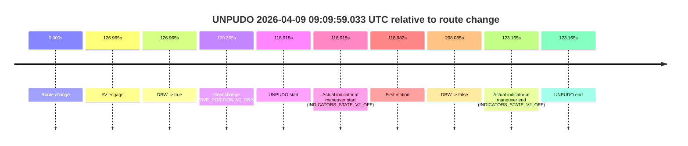
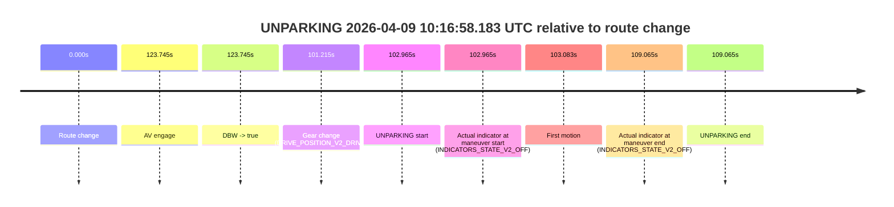

# Run Report: fme20032/2026-04-09--08-45-53--gen2-av-4e06ec23-10dd-4a9e-8d40-a90f62674eb0

| Field | Value |
|---|---|
| Run ID | `fme20032/2026-04-09--08-45-53--gen2-av-4e06ec23-10dd-4a9e-8d40-a90f62674eb0` |
| Date | `2026-04-09` |
| Model(s) | `lively-orange-horse` |
| Author | `guy.geva` |
| Event count | `8` |

## unpudo 2026-04-09 08:56:36.133 UTC

| Field | Value |
|---|---|
| Model | `lively-orange-horse` |
| Author | `guy.geva` |
| Run ID | `fme20032/2026-04-09--08-45-53--gen2-av-4e06ec23-10dd-4a9e-8d40-a90f62674eb0` |
| Date | `2026-04-09` |
| Time (UTC) | `08:56:36.133` |
| Event type | `unpudo` |
| Disengagement type | `failed_to_unpudo` |
| Route change | `found` |
| Console | [run](https://console.sso.wayve.ai/run/fme20032/2026-04-09--08-45-53--gen2-av-4e06ec23-10dd-4a9e-8d40-a90f62674eb0?id=&time-unixus=1775724996133310) |
| Foxglove | [segment](https://app.foxglove.dev/wayve-on-prem/p/prj_0dX18KZdVHg1fmmI/view?ds=foxglove-stream&ds.deviceName=fme20032&ds.start=2026-04-09T08%3A56%3A01.618259Z&ds.end=2026-04-09T08%3A59%3A37.003618Z&layoutId=lay_0e7VD4WIKDQGU73Y&time=2026-04-09T08%3A56%3A36.133310Z) |

### Event card: fail

- Fail: AV owns part of the segment, but the event still resolves as a model-performance failure under the AV-only scoring rule.

| Event | Time (UTC) | Delta from route change |
|---|---:|---:|
| Route change | 2026-04-09 08:56:11.618 | `0.000s` |
| AV engage | 2026-04-09 08:56:46.003 | `34.386s` |
| DBW -> true | 2026-04-09 08:56:46.003 | `34.386s` |
| Gear change (DRIVE_POSITION_V2_DRIVE) | 2026-04-09 08:56:31.183 | `19.565s` |
| UNPUDO start | 2026-04-09 08:56:36.133 | `24.515s` |
| Actual indicator at maneuver start (INDICATORS_STATE_V2_OFF) | 2026-04-09 08:56:36.133 | `24.515s` |
| First motion | 2026-04-09 08:56:36.220 | `24.602s` |
| DBW -> false | 2026-04-09 08:59:27.003 | `195.385s` |
| Actual indicator at maneuver end (INDICATORS_STATE_V2_OFF) | 2026-04-09 08:57:29.483 | `77.865s` |
| UNPUDO end | 2026-04-09 08:57:29.483 | `77.865s` |

| Metric | Value |
|---|---|
| Outcome | `fail` |
| Effective failure type | `failed_to_unpudo` |
| Route change status | `found` |
| DBW at event start | `false` |
| DBW at event end | `true` |
| Predicted gear at AV start | `DRIVE_POSITION_V2_DRIVE` |
| Actual gear at AV start | `DRIVE_POSITION_V2_DRIVE` |
| Predicted gear at event start | `DRIVE_POSITION_V2_DRIVE` |
| Actual gear at event start | `DRIVE_POSITION_V2_DRIVE` |
| Planned indicator direction | `INDICATORS_STATE_V2_LEFT_ON` |
| Controller indicator direction | `INDICATORS_STATE_V2_LEFT_ON` |
| Actual indicator direction | `INDICATORS_STATE_V2_OFF` |
| Actual indicator at maneuver end | `INDICATORS_STATE_V2_OFF` |
| Driver accel help in AV | `false` |
| Driver accel help timestamp | `n/a` |
| Max accel pedal pct in AV | `0.0%` |
| Max brake pedal pct in AV | `8.0%` |
| Max speed mps in AV | `3.997` |
| Route -> AV | `34.386s` |
| AV -> event start | `-9.871s` |
| AV -> first motion | `-9.783s` |
| AV duration before disengagement | `161.000s` |
| Trajectory waypoint count | `38` |
| Driving-plan step count | `11` |

The scored portion starts from the AV-owned window, not from the pre-AV setup. Route-change search in the stopped pre-event segment was `found`, with the baseline therefore set to route change. At the event anchor the model predicts `DRIVE_POSITION_V2_DRIVE` and the actual gear is `DRIVE_POSITION_V2_DRIVE`. The effective model outcome is `fail` because `failed_to_unpudo`.

### Resolution

| Field | Value |
|---|---|
| Final outcome | `fail` |
| Do we agree with this label? | `yes` |
| Source disengagement type | `failed_to_unpudo` |
| Resolved effective failure type | `failed_to_unpudo` |
| Confidence | `high` |

## unpudo 2026-04-09 09:03:11.333 UTC

| Field | Value |
|---|---|
| Model | `lively-orange-horse` |
| Author | `guy.geva` |
| Run ID | `fme20032/2026-04-09--08-45-53--gen2-av-4e06ec23-10dd-4a9e-8d40-a90f62674eb0` |
| Date | `2026-04-09` |
| Time (UTC) | `09:03:11.333` |
| Event type | `unpudo` |
| Disengagement type | `failed_to_unpudo` |
| Route change | `found` |
| Console | [run](https://console.sso.wayve.ai/run/fme20032/2026-04-09--08-45-53--gen2-av-4e06ec23-10dd-4a9e-8d40-a90f62674eb0?id=&time-unixus=1775725391333296) |
| Foxglove | [segment](https://app.foxglove.dev/wayve-on-prem/p/prj_0dX18KZdVHg1fmmI/view?ds=foxglove-stream&ds.deviceName=fme20032&ds.start=2026-04-09T09%3A02%3A53.418228Z&ds.end=2026-04-09T09%3A06%3A35.202992Z&layoutId=lay_0e7VD4WIKDQGU73Y&time=2026-04-09T09%3A03%3A11.333296Z) |

### Event card: fail

- Fail: AV owns part of the segment, but the event still resolves as a model-performance failure under the AV-only scoring rule.

| Event | Time (UTC) | Delta from route change |
|---|---:|---:|
| Route change | 2026-04-09 09:03:03.418 | `0.000s` |
| AV engage | 2026-04-09 09:03:17.263 | `13.845s` |
| DBW -> true | 2026-04-09 09:03:17.263 | `13.845s` |
| Gear change (DRIVE_POSITION_V2_DRIVE) | 2026-04-09 09:03:03.683 | `0.265s` |
| UNPUDO start | 2026-04-09 09:03:11.333 | `7.915s` |
| Actual indicator at maneuver start (INDICATORS_STATE_V2_OFF) | 2026-04-09 09:03:11.333 | `7.915s` |
| First motion | 2026-04-09 09:03:11.380 | `7.962s` |
| DBW -> false | 2026-04-09 09:06:25.202 | `201.785s` |
| Actual indicator at maneuver end (INDICATORS_STATE_V2_OFF) | 2026-04-09 09:03:15.433 | `12.015s` |
| UNPUDO end | 2026-04-09 09:03:15.433 | `12.015s` |

| Metric | Value |
|---|---|
| Outcome | `fail` |
| Effective failure type | `failed_to_unpudo` |
| Route change status | `found` |
| DBW at event start | `false` |
| DBW at event end | `false` |
| Predicted gear at AV start | `DRIVE_POSITION_V2_DRIVE` |
| Actual gear at AV start | `DRIVE_POSITION_V2_DRIVE` |
| Predicted gear at event start | `DRIVE_POSITION_V2_DRIVE` |
| Actual gear at event start | `DRIVE_POSITION_V2_DRIVE` |
| Planned indicator direction | `INDICATORS_STATE_V2_RIGHT_ON` |
| Controller indicator direction | `INDICATORS_STATE_V2_RIGHT_ON` |
| Actual indicator direction | `INDICATORS_STATE_V2_OFF` |
| Actual indicator at maneuver end | `INDICATORS_STATE_V2_OFF` |
| Driver accel help in AV | `false` |
| Driver accel help timestamp | `n/a` |
| Max accel pedal pct in AV | `0.0%` |
| Max brake pedal pct in AV | `0.0%` |
| Max speed mps in AV | `0.000` |
| Route -> AV | `13.845s` |
| AV -> event start | `-5.930s` |
| AV -> first motion | `-5.883s` |
| AV duration before disengagement | `187.939s` |
| Trajectory waypoint count | `38` |
| Driving-plan step count | `11` |

The scored portion starts from the AV-owned window, not from the pre-AV setup. Route-change search in the stopped pre-event segment was `found`, with the baseline therefore set to route change. At the event anchor the model predicts `DRIVE_POSITION_V2_DRIVE` and the actual gear is `DRIVE_POSITION_V2_DRIVE`. The effective model outcome is `fail` because `failed_to_unpudo`.

### Resolution

| Field | Value |
|---|---|
| Final outcome | `fail` |
| Do we agree with this label? | `yes` |
| Source disengagement type | `failed_to_unpudo` |
| Resolved effective failure type | `failed_to_unpudo` |
| Confidence | `high` |

## unpudo 2026-04-09 09:08:16.483 UTC

| Field | Value |
|---|---|
| Model | `lively-orange-horse` |
| Author | `guy.geva` |
| Run ID | `fme20032/2026-04-09--08-45-53--gen2-av-4e06ec23-10dd-4a9e-8d40-a90f62674eb0` |
| Date | `2026-04-09` |
| Time (UTC) | `09:08:16.483` |
| Event type | `unpudo` |
| Disengagement type | `failed_to_unpudo` |
| Route change | `found` |
| Console | [run](https://console.sso.wayve.ai/run/fme20032/2026-04-09--08-45-53--gen2-av-4e06ec23-10dd-4a9e-8d40-a90f62674eb0?id=&time-unixus=1775725696483317) |
| Foxglove | [segment](https://app.foxglove.dev/wayve-on-prem/p/prj_0dX18KZdVHg1fmmI/view?ds=foxglove-stream&ds.deviceName=fme20032&ds.start=2026-04-09T09%3A07%3A50.118250Z&ds.end=2026-04-09T09%3A09%3A00.564879Z&layoutId=lay_0e7VD4WIKDQGU73Y&time=2026-04-09T09%3A08%3A16.483317Z) |

### Event card: fail

- Fail: AV owns part of the segment, but the event still resolves as a model-performance failure under the AV-only scoring rule.

| Event | Time (UTC) | Delta from route change |
|---|---:|---:|
| Route change | 2026-04-09 09:08:00.118 | `0.000s` |
| AV engage | 2026-04-09 09:08:28.564 | `28.447s` |
| DBW -> true | 2026-04-09 09:08:28.564 | `28.447s` |
| Gear change (DRIVE_POSITION_V2_DRIVE) | 2026-04-09 09:08:08.083 | `7.965s` |
| UNPUDO start | 2026-04-09 09:08:16.483 | `16.365s` |
| Actual indicator at maneuver start (INDICATORS_STATE_V2_OFF) | 2026-04-09 09:08:16.483 | `16.365s` |
| First motion | 2026-04-09 09:08:16.580 | `16.462s` |
| DBW -> false | 2026-04-09 09:08:50.564 | `50.447s` |
| Actual indicator at maneuver end (INDICATORS_STATE_V2_OFF) | 2026-04-09 09:08:22.383 | `22.265s` |
| UNPUDO end | 2026-04-09 09:08:22.383 | `22.265s` |

| Metric | Value |
|---|---|
| Outcome | `fail` |
| Effective failure type | `failed_to_unpudo` |
| Route change status | `found` |
| DBW at event start | `false` |
| DBW at event end | `false` |
| Predicted gear at AV start | `DRIVE_POSITION_V2_DRIVE` |
| Actual gear at AV start | `DRIVE_POSITION_V2_DRIVE` |
| Predicted gear at event start | `DRIVE_POSITION_V2_DRIVE` |
| Actual gear at event start | `DRIVE_POSITION_V2_DRIVE` |
| Planned indicator direction | `INDICATORS_STATE_V2_LEFT_ON` |
| Controller indicator direction | `INDICATORS_STATE_V2_LEFT_ON` |
| Actual indicator direction | `INDICATORS_STATE_V2_OFF` |
| Actual indicator at maneuver end | `INDICATORS_STATE_V2_OFF` |
| Driver accel help in AV | `false` |
| Driver accel help timestamp | `n/a` |
| Max accel pedal pct in AV | `0.0%` |
| Max brake pedal pct in AV | `0.0%` |
| Max speed mps in AV | `0.000` |
| Route -> AV | `28.447s` |
| AV -> event start | `-12.082s` |
| AV -> first motion | `-11.985s` |
| AV duration before disengagement | `22.000s` |
| Trajectory waypoint count | `37` |
| Driving-plan step count | `11` |

The scored portion starts from the AV-owned window, not from the pre-AV setup. Route-change search in the stopped pre-event segment was `found`, with the baseline therefore set to route change. At the event anchor the model predicts `DRIVE_POSITION_V2_DRIVE` and the actual gear is `DRIVE_POSITION_V2_DRIVE`. The effective model outcome is `fail` because `failed_to_unpudo`.

### Resolution

| Field | Value |
|---|---|
| Final outcome | `fail` |
| Do we agree with this label? | `yes` |
| Source disengagement type | `failed_to_unpudo` |
| Resolved effective failure type | `failed_to_unpudo` |
| Confidence | `high` |

## unpudo 2026-04-09 09:09:59.033 UTC

| Field | Value |
|---|---|
| Model | `lively-orange-horse` |
| Author | `guy.geva` |
| Run ID | `fme20032/2026-04-09--08-45-53--gen2-av-4e06ec23-10dd-4a9e-8d40-a90f62674eb0` |
| Date | `2026-04-09` |
| Time (UTC) | `09:09:59.033` |
| Event type | `unpudo` |
| Disengagement type | `failed_to_unpudo` |
| Route change | `found` |
| Console | [run](https://console.sso.wayve.ai/run/fme20032/2026-04-09--08-45-53--gen2-av-4e06ec23-10dd-4a9e-8d40-a90f62674eb0?id=&time-unixus=1775725799033306) |
| Foxglove | [segment](https://app.foxglove.dev/wayve-on-prem/p/prj_0dX18KZdVHg1fmmI/view?ds=foxglove-stream&ds.deviceName=fme20032&ds.start=2026-04-09T09%3A07%3A50.118250Z&ds.end=2026-04-09T09%3A11%3A38.203668Z&layoutId=lay_0e7VD4WIKDQGU73Y&time=2026-04-09T09%3A09%3A59.033306Z) |

### Event card: fail

- Fail: AV owns part of the segment, but the event still resolves as a model-performance failure under the AV-only scoring rule.

| Event | Time (UTC) | Delta from route change |
|---|---:|---:|
| Route change | 2026-04-09 09:08:00.118 | `0.000s` |
| AV engage | 2026-04-09 09:10:07.083 | `126.965s` |
| DBW -> true | 2026-04-09 09:10:07.083 | `126.965s` |
| Gear change (DRIVE_POSITION_V2_DRIVE) | 2026-04-09 09:09:40.483 | `100.365s` |
| UNPUDO start | 2026-04-09 09:09:59.033 | `118.915s` |
| Actual indicator at maneuver start (INDICATORS_STATE_V2_OFF) | 2026-04-09 09:09:59.033 | `118.915s` |
| First motion | 2026-04-09 09:09:59.100 | `118.982s` |
| DBW -> false | 2026-04-09 09:11:28.203 | `208.085s` |
| Actual indicator at maneuver end (INDICATORS_STATE_V2_OFF) | 2026-04-09 09:10:03.283 | `123.165s` |
| UNPUDO end | 2026-04-09 09:10:03.283 | `123.165s` |

| Metric | Value |
|---|---|
| Outcome | `fail` |
| Effective failure type | `failed_to_unpudo` |
| Route change status | `found` |
| DBW at event start | `false` |
| DBW at event end | `false` |
| Predicted gear at AV start | `DRIVE_POSITION_V2_DRIVE` |
| Actual gear at AV start | `DRIVE_POSITION_V2_DRIVE` |
| Predicted gear at event start | `DRIVE_POSITION_V2_DRIVE` |
| Actual gear at event start | `DRIVE_POSITION_V2_DRIVE` |
| Planned indicator direction | `INDICATORS_STATE_V2_RIGHT_ON` |
| Controller indicator direction | `INDICATORS_STATE_V2_RIGHT_ON` |
| Actual indicator direction | `INDICATORS_STATE_V2_OFF` |
| Actual indicator at maneuver end | `INDICATORS_STATE_V2_OFF` |
| Driver accel help in AV | `false` |
| Driver accel help timestamp | `n/a` |
| Max accel pedal pct in AV | `0.0%` |
| Max brake pedal pct in AV | `0.0%` |
| Max speed mps in AV | `0.000` |
| Route -> AV | `126.965s` |
| AV -> event start | `-8.050s` |
| AV -> first motion | `-7.983s` |
| AV duration before disengagement | `81.120s` |
| Trajectory waypoint count | `36` |
| Driving-plan step count | `11` |

The scored portion starts from the AV-owned window, not from the pre-AV setup. Route-change search in the stopped pre-event segment was `found`, with the baseline therefore set to route change. At the event anchor the model predicts `DRIVE_POSITION_V2_DRIVE` and the actual gear is `DRIVE_POSITION_V2_DRIVE`. The effective model outcome is `fail` because `failed_to_unpudo`.

### Resolution

| Field | Value |
|---|---|
| Final outcome | `fail` |
| Do we agree with this label? | `yes` |
| Source disengagement type | `failed_to_unpudo` |
| Resolved effective failure type | `failed_to_unpudo` |
| Confidence | `high` |

## unpudo 2026-04-09 09:24:23.683 UTC

| Field | Value |
|---|---|
| Model | `lively-orange-horse` |
| Author | `guy.geva` |
| Run ID | `fme20032/2026-04-09--08-45-53--gen2-av-4e06ec23-10dd-4a9e-8d40-a90f62674eb0` |
| Date | `2026-04-09` |
| Time (UTC) | `09:24:23.683` |
| Event type | `unpudo` |
| Disengagement type | `failed_to_unpudo` |
| Route change | `found` |
| Console | [run](https://console.sso.wayve.ai/run/fme20032/2026-04-09--08-45-53--gen2-av-4e06ec23-10dd-4a9e-8d40-a90f62674eb0?id=&time-unixus=1775726663683319) |
| Foxglove | [segment](https://app.foxglove.dev/wayve-on-prem/p/prj_0dX18KZdVHg1fmmI/view?ds=foxglove-stream&ds.deviceName=fme20032&ds.start=2026-04-09T09%3A23%3A57.068291Z&ds.end=2026-04-09T09%3A25%3A22.222919Z&layoutId=lay_0e7VD4WIKDQGU73Y&time=2026-04-09T09%3A24%3A23.683319Z) |

### Event card: fail

- Fail: AV owns part of the segment, but the event still resolves as a model-performance failure under the AV-only scoring rule.

| Event | Time (UTC) | Delta from route change |
|---|---:|---:|
| Route change | 2026-04-09 09:24:07.068 | `0.000s` |
| AV engage | 2026-04-09 09:24:32.063 | `24.995s` |
| DBW -> true | 2026-04-09 09:24:32.063 | `24.995s` |
| Gear change (DRIVE_POSITION_V2_DRIVE) | 2026-04-09 09:24:21.633 | `14.565s` |
| UNPUDO start | 2026-04-09 09:24:23.683 | `16.615s` |
| Actual indicator at maneuver start (INDICATORS_STATE_V2_OFF) | 2026-04-09 09:24:23.683 | `16.615s` |
| First motion | 2026-04-09 09:24:23.740 | `16.672s` |
| DBW -> false | 2026-04-09 09:25:12.222 | `65.155s` |
| Actual indicator at maneuver end (INDICATORS_STATE_V2_OFF) | 2026-04-09 09:24:30.183 | `23.115s` |
| UNPUDO end | 2026-04-09 09:24:30.183 | `23.115s` |

| Metric | Value |
|---|---|
| Outcome | `fail` |
| Effective failure type | `failed_to_unpudo` |
| Route change status | `found` |
| DBW at event start | `false` |
| DBW at event end | `false` |
| Predicted gear at AV start | `DRIVE_POSITION_V2_DRIVE` |
| Actual gear at AV start | `DRIVE_POSITION_V2_DRIVE` |
| Predicted gear at event start | `DRIVE_POSITION_V2_DRIVE` |
| Actual gear at event start | `DRIVE_POSITION_V2_DRIVE` |
| Planned indicator direction | `INDICATORS_STATE_V2_OFF` |
| Controller indicator direction | `INDICATORS_STATE_V2_OFF` |
| Actual indicator direction | `INDICATORS_STATE_V2_OFF` |
| Actual indicator at maneuver end | `INDICATORS_STATE_V2_OFF` |
| Driver accel help in AV | `false` |
| Driver accel help timestamp | `n/a` |
| Max accel pedal pct in AV | `0.0%` |
| Max brake pedal pct in AV | `0.0%` |
| Max speed mps in AV | `0.000` |
| Route -> AV | `24.995s` |
| AV -> event start | `-8.380s` |
| AV -> first motion | `-8.323s` |
| AV duration before disengagement | `40.159s` |
| Trajectory waypoint count | `37` |
| Driving-plan step count | `11` |

The scored portion starts from the AV-owned window, not from the pre-AV setup. Route-change search in the stopped pre-event segment was `found`, with the baseline therefore set to route change. At the event anchor the model predicts `DRIVE_POSITION_V2_DRIVE` and the actual gear is `DRIVE_POSITION_V2_DRIVE`. The effective model outcome is `fail` because `failed_to_unpudo`.

### Resolution

| Field | Value |
|---|---|
| Final outcome | `fail` |
| Do we agree with this label? | `yes` |
| Source disengagement type | `failed_to_unpudo` |
| Resolved effective failure type | `failed_to_unpudo` |
| Confidence | `high` |

## unpudo 2026-04-09 09:37:59.283 UTC

| Field | Value |
|---|---|
| Model | `lively-orange-horse` |
| Author | `guy.geva` |
| Run ID | `fme20032/2026-04-09--08-45-53--gen2-av-4e06ec23-10dd-4a9e-8d40-a90f62674eb0` |
| Date | `2026-04-09` |
| Time (UTC) | `09:37:59.283` |
| Event type | `unpudo` |
| Disengagement type | `none observed` |
| Route change | `found` |
| Console | [run](https://console.sso.wayve.ai/run/fme20032/2026-04-09--08-45-53--gen2-av-4e06ec23-10dd-4a9e-8d40-a90f62674eb0?id=&time-unixus=1775727479283314) |
| Foxglove | [segment](https://app.foxglove.dev/wayve-on-prem/p/prj_0dX18KZdVHg1fmmI/view?ds=foxglove-stream&ds.deviceName=fme20032&ds.start=2026-04-09T09%3A37%3A30.718316Z&ds.end=2026-04-09T09%3A38%3A31.883756Z&layoutId=lay_0e7VD4WIKDQGU73Y&time=2026-04-09T09%3A37%3A59.283314Z) |

### Event card: pass

- Pass: AV owns the credited unpudo through the official event window, the gear state is aligned at the anchor, and the vehicle moves without driver accelerator help in AV.

| Event | Time (UTC) | Delta from route change |
|---|---:|---:|
| Route change | 2026-04-09 09:37:40.718 | `0.000s` |
| AV engage | 2026-04-09 09:37:48.183 | `7.465s` |
| DBW -> true | 2026-04-09 09:37:48.183 | `7.465s` |
| Gear change (DRIVE_POSITION_V2_DRIVE) | 2026-04-09 09:37:48.633 | `7.915s` |
| UNPUDO start | 2026-04-09 09:37:59.283 | `18.565s` |
| Actual indicator at maneuver start (INDICATORS_STATE_V2_OFF) | 2026-04-09 09:37:59.283 | `18.565s` |
| First motion | 2026-04-09 09:37:59.320 | `18.602s` |
| DBW -> false | 2026-04-09 09:38:21.883 | `41.165s` |
| Actual indicator at maneuver end (INDICATORS_STATE_V2_OFF) | 2026-04-09 09:38:02.633 | `21.915s` |
| UNPUDO end | 2026-04-09 09:38:02.633 | `21.915s` |

| Metric | Value |
|---|---|
| Outcome | `pass` |
| Effective failure type | `none` |
| Route change status | `found` |
| DBW at event start | `true` |
| DBW at event end | `true` |
| Predicted gear at AV start | `DRIVE_POSITION_V2_DRIVE` |
| Actual gear at AV start | `DRIVE_POSITION_V2_PARK` |
| Predicted gear at event start | `DRIVE_POSITION_V2_DRIVE` |
| Actual gear at event start | `DRIVE_POSITION_V2_DRIVE` |
| Planned indicator direction | `INDICATORS_STATE_V2_RIGHT_ON` |
| Controller indicator direction | `INDICATORS_STATE_V2_RIGHT_ON` |
| Actual indicator direction | `INDICATORS_STATE_V2_OFF` |
| Actual indicator at maneuver end | `INDICATORS_STATE_V2_OFF` |
| Driver accel help in AV | `false` |
| Driver accel help timestamp | `n/a` |
| Max accel pedal pct in AV | `0.0%` |
| Max brake pedal pct in AV | `8.0%` |
| Max speed mps in AV | `5.744` |
| Route -> AV | `7.465s` |
| AV -> event start | `11.100s` |
| AV -> first motion | `11.137s` |
| AV duration before disengagement | `33.700s` |
| Trajectory waypoint count | `37` |
| Driving-plan step count | `11` |

The scored portion starts from the AV-owned window, not from the pre-AV setup. Route-change search in the stopped pre-event segment was `found`, with the baseline therefore set to route change. At the event anchor the model predicts `DRIVE_POSITION_V2_DRIVE` and the actual gear is `DRIVE_POSITION_V2_DRIVE`. The effective model outcome is `pass` because `the credited maneuver stays AV-owned through the official event end`.

### Resolution

| Field | Value |
|---|---|
| Final outcome | `pass` |
| Do we agree with this label? | `yes` |
| Source disengagement type | `none observed` |
| Resolved effective failure type | `none` |
| Confidence | `high` |

## unpudo 2026-04-09 10:07:58.633 UTC

| Field | Value |
|---|---|
| Model | `lively-orange-horse` |
| Author | `guy.geva` |
| Run ID | `fme20032/2026-04-09--08-45-53--gen2-av-4e06ec23-10dd-4a9e-8d40-a90f62674eb0` |
| Date | `2026-04-09` |
| Time (UTC) | `10:07:58.633` |
| Event type | `unpudo` |
| Disengagement type | `failed_to_unpudo` |
| Route change | `found` |
| Console | [run](https://console.sso.wayve.ai/run/fme20032/2026-04-09--08-45-53--gen2-av-4e06ec23-10dd-4a9e-8d40-a90f62674eb0?id=&time-unixus=1775729278633313) |
| Foxglove | [segment](https://app.foxglove.dev/wayve-on-prem/p/prj_0dX18KZdVHg1fmmI/view?ds=foxglove-stream&ds.deviceName=fme20032&ds.start=2026-04-09T10%3A06%3A53.368322Z&ds.end=2026-04-09T10%3A08%3A34.903561Z&layoutId=lay_0e7VD4WIKDQGU73Y&time=2026-04-09T10%3A07%3A58.633313Z) |

### Event card: fail

- Fail: AV owns part of the segment, but the event still resolves as a model-performance failure under the AV-only scoring rule.

| Event | Time (UTC) | Delta from route change |
|---|---:|---:|
| Route change | 2026-04-09 10:07:03.368 | `0.000s` |
| AV engage | 2026-04-09 10:08:05.823 | `62.455s` |
| DBW -> true | 2026-04-09 10:08:05.823 | `62.455s` |
| Gear change (DRIVE_POSITION_V2_DRIVE) | 2026-04-09 10:07:50.683 | `47.315s` |
| UNPUDO start | 2026-04-09 10:07:58.633 | `55.265s` |
| Actual indicator at maneuver start (INDICATORS_STATE_V2_OFF) | 2026-04-09 10:07:58.633 | `55.265s` |
| First motion | 2026-04-09 10:07:58.680 | `55.312s` |
| DBW -> false | 2026-04-09 10:08:24.903 | `81.535s` |
| Actual indicator at maneuver end (INDICATORS_STATE_V2_OFF) | 2026-04-09 10:08:03.183 | `59.815s` |
| UNPUDO end | 2026-04-09 10:08:03.183 | `59.815s` |

| Metric | Value |
|---|---|
| Outcome | `fail` |
| Effective failure type | `failed_to_unpudo` |
| Route change status | `found` |
| DBW at event start | `false` |
| DBW at event end | `false` |
| Predicted gear at AV start | `DRIVE_POSITION_V2_DRIVE` |
| Actual gear at AV start | `DRIVE_POSITION_V2_DRIVE` |
| Predicted gear at event start | `DRIVE_POSITION_V2_DRIVE` |
| Actual gear at event start | `DRIVE_POSITION_V2_DRIVE` |
| Planned indicator direction | `INDICATORS_STATE_V2_LEFT_ON` |
| Controller indicator direction | `INDICATORS_STATE_V2_LEFT_ON` |
| Actual indicator direction | `INDICATORS_STATE_V2_OFF` |
| Actual indicator at maneuver end | `INDICATORS_STATE_V2_OFF` |
| Driver accel help in AV | `false` |
| Driver accel help timestamp | `n/a` |
| Max accel pedal pct in AV | `0.0%` |
| Max brake pedal pct in AV | `0.0%` |
| Max speed mps in AV | `0.000` |
| Route -> AV | `62.455s` |
| AV -> event start | `-7.190s` |
| AV -> first motion | `-7.143s` |
| AV duration before disengagement | `19.080s` |
| Trajectory waypoint count | `36` |
| Driving-plan step count | `11` |

The scored portion starts from the AV-owned window, not from the pre-AV setup. Route-change search in the stopped pre-event segment was `found`, with the baseline therefore set to route change. At the event anchor the model predicts `DRIVE_POSITION_V2_DRIVE` and the actual gear is `DRIVE_POSITION_V2_DRIVE`. The effective model outcome is `fail` because `failed_to_unpudo`.

### Resolution

| Field | Value |
|---|---|
| Final outcome | `fail` |
| Do we agree with this label? | `yes` |
| Source disengagement type | `failed_to_unpudo` |
| Resolved effective failure type | `failed_to_unpudo` |
| Confidence | `high` |

## unparking 2026-04-09 10:16:58.183 UTC

| Field | Value |
|---|---|
| Model | `lively-orange-horse` |
| Author | `guy.geva` |
| Run ID | `fme20032/2026-04-09--08-45-53--gen2-av-4e06ec23-10dd-4a9e-8d40-a90f62674eb0` |
| Date | `2026-04-09` |
| Time (UTC) | `10:16:58.183` |
| Event type | `unparking` |
| Disengagement type | `none observed` |
| Route change | `found` |
| Console | [run](https://console.sso.wayve.ai/run/fme20032/2026-04-09--08-45-53--gen2-av-4e06ec23-10dd-4a9e-8d40-a90f62674eb0?id=&time-unixus=1775729818183316) |
| Foxglove | [segment](https://app.foxglove.dev/wayve-on-prem/p/prj_0dX18KZdVHg1fmmI/view?ds=foxglove-stream&ds.deviceName=fme20032&ds.start=2026-04-09T10%3A15%3A05.218264Z&ds.end=2026-04-09T10%3A17%3A14.283294Z&layoutId=lay_0e7VD4WIKDQGU73Y&time=2026-04-09T10%3A16%3A58.183316Z) |

### Event card: fail

- Fail: the credited unparking does not stay AV-owned. The event window starts with DBW false, and the maneuver outcome lands outside a clean AV-owned segment.

| Event | Time (UTC) | Delta from route change |
|---|---:|---:|
| Route change | 2026-04-09 10:15:15.218 | `0.000s` |
| AV engage | 2026-04-09 10:17:18.963 | `123.745s` |
| DBW -> true | 2026-04-09 10:17:18.963 | `123.745s` |
| Gear change (DRIVE_POSITION_V2_DRIVE) | 2026-04-09 10:16:56.433 | `101.215s` |
| UNPARKING start | 2026-04-09 10:16:58.183 | `102.965s` |
| Actual indicator at maneuver start (INDICATORS_STATE_V2_OFF) | 2026-04-09 10:16:58.183 | `102.965s` |
| First motion | 2026-04-09 10:16:58.301 | `103.083s` |
| Actual indicator at maneuver end (INDICATORS_STATE_V2_OFF) | 2026-04-09 10:17:04.283 | `109.065s` |
| UNPARKING end | 2026-04-09 10:17:04.283 | `109.065s` |

| Metric | Value |
|---|---|
| Outcome | `fail` |
| Effective failure type | `completed_outside_av` |
| Route change status | `found` |
| DBW at event start | `false` |
| DBW at event end | `false` |
| Predicted gear at AV start | `DRIVE_POSITION_V2_DRIVE` |
| Actual gear at AV start | `DRIVE_POSITION_V2_DRIVE` |
| Predicted gear at event start | `DRIVE_POSITION_V2_DRIVE` |
| Actual gear at event start | `DRIVE_POSITION_V2_DRIVE` |
| Planned indicator direction | `INDICATORS_STATE_V2_OFF` |
| Controller indicator direction | `INDICATORS_STATE_V2_OFF` |
| Actual indicator direction | `INDICATORS_STATE_V2_OFF` |
| Actual indicator at maneuver end | `INDICATORS_STATE_V2_OFF` |
| Driver accel help in AV | `false` |
| Driver accel help timestamp | `n/a` |
| Max accel pedal pct in AV | `0.0%` |
| Max brake pedal pct in AV | `0.0%` |
| Max speed mps in AV | `0.000` |
| Route -> AV | `123.745s` |
| AV -> event start | `-20.780s` |
| AV -> first motion | `-20.662s` |
| AV duration before disengagement | `n/a` |
| Trajectory waypoint count | `35` |
| Driving-plan step count | `11` |

The scored portion starts from the AV-owned window, not from the pre-AV setup. Route-change search in the stopped pre-event segment was `found`, with the baseline therefore set to route change. At the event anchor the model predicts `DRIVE_POSITION_V2_DRIVE` and the actual gear is `DRIVE_POSITION_V2_DRIVE`. The effective model outcome is `fail` because `completed_outside_av`.

### Resolution

| Field | Value |
|---|---|
| Final outcome | `fail` |
| Do we agree with this label? | `yes` |
| Source disengagement type | `none observed` |
| Resolved effective failure type | `completed_outside_av` |
| Confidence | `high` |
