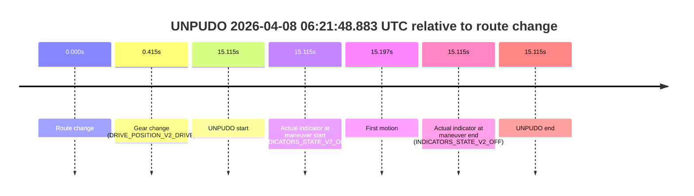
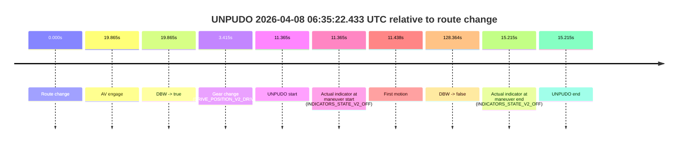
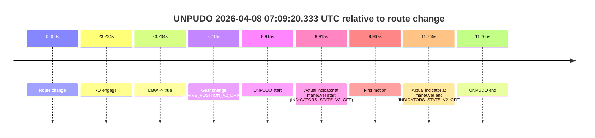

# Run Report: fme20036/2026-04-08--06-00-42--gen2-av-c25bc20d-c57e-4706-9f31-f57fe7f9acd6

| Field | Value |
|---|---|
| Run ID | `fme20036/2026-04-08--06-00-42--gen2-av-c25bc20d-c57e-4706-9f31-f57fe7f9acd6` |
| Date | `2026-04-08` |
| Model(s) | `lively-orange-horse` |
| Author | `guy.geva` |
| Event count | `8` |

## unpudo 2026-04-08 06:11:26.983 UTC

| Field | Value |
|---|---|
| Model | `lively-orange-horse` |
| Author | `guy.geva` |
| Run ID | `fme20036/2026-04-08--06-00-42--gen2-av-c25bc20d-c57e-4706-9f31-f57fe7f9acd6` |
| Date | `2026-04-08` |
| Time (UTC) | `06:11:26.983` |
| Event type | `unpudo` |
| Disengagement type | `failed_to_unpudo` |
| Route change | `found` |
| Console | [run](https://console.sso.wayve.ai/run/fme20036/2026-04-08--06-00-42--gen2-av-c25bc20d-c57e-4706-9f31-f57fe7f9acd6?id=&time-unixus=1775628686983298) |
| Foxglove | [segment](https://app.foxglove.dev/wayve-on-prem/p/prj_0dX18KZdVHg1fmmI/view?ds=foxglove-stream&ds.deviceName=fme20036&ds.start=2026-04-08T06%3A11%3A06.418388Z&ds.end=2026-04-08T06%3A13%3A45.291877Z&layoutId=lay_0e7VD4WIKDQGU73Y&time=2026-04-08T06%3A11%3A26.983298Z) |

### Event card: fail

- Fail: AV owns part of the segment, but the event still resolves as a model-performance failure under the AV-only scoring rule.

| Event | Time (UTC) | Delta from route change |
|---|---:|---:|
| Route change | 2026-04-08 06:11:16.418 | `0.000s` |
| AV engage | 2026-04-08 06:11:36.471 | `20.054s` |
| DBW -> true | 2026-04-08 06:11:36.471 | `20.054s` |
| Gear change (DRIVE_POSITION_V2_DRIVE) | 2026-04-08 06:11:19.433 | `3.015s` |
| UNPUDO start | 2026-04-08 06:11:26.983 | `10.565s` |
| Actual indicator at maneuver start (INDICATORS_STATE_V2_OFF) | 2026-04-08 06:11:26.983 | `10.565s` |
| First motion | 2026-04-08 06:11:27.145 | `10.727s` |
| DBW -> false | 2026-04-08 06:13:35.291 | `138.873s` |
| Actual indicator at maneuver end (INDICATORS_STATE_V2_OFF) | 2026-04-08 06:11:33.133 | `16.715s` |
| UNPUDO end | 2026-04-08 06:11:33.133 | `16.715s` |

| Metric | Value |
|---|---|
| Outcome | `fail` |
| Effective failure type | `failed_to_unpudo` |
| Route change status | `found` |
| DBW at event start | `false` |
| DBW at event end | `false` |
| Predicted gear at AV start | `DRIVE_POSITION_V2_DRIVE` |
| Actual gear at AV start | `DRIVE_POSITION_V2_DRIVE` |
| Predicted gear at event start | `DRIVE_POSITION_V2_DRIVE` |
| Actual gear at event start | `DRIVE_POSITION_V2_DRIVE` |
| Planned indicator direction | `INDICATORS_STATE_V2_LEFT_ON` |
| Controller indicator direction | `INDICATORS_STATE_V2_LEFT_ON` |
| Actual indicator direction | `INDICATORS_STATE_V2_OFF` |
| Actual indicator at maneuver end | `INDICATORS_STATE_V2_OFF` |
| Driver accel help in AV | `false` |
| Driver accel help timestamp | `n/a` |
| Max accel pedal pct in AV | `0.0%` |
| Max brake pedal pct in AV | `0.0%` |
| Max speed mps in AV | `0.000` |
| Route -> AV | `20.054s` |
| AV -> event start | `-9.489s` |
| AV -> first motion | `-9.326s` |
| AV duration before disengagement | `118.820s` |
| Trajectory waypoint count | `37` |
| Driving-plan step count | `11` |

The scored portion starts from the AV-owned window, not from the pre-AV setup. Route-change search in the stopped pre-event segment was `found`, with the baseline therefore set to route change. At the event anchor the model predicts `DRIVE_POSITION_V2_DRIVE` and the actual gear is `DRIVE_POSITION_V2_DRIVE`. The effective model outcome is `fail` because `failed_to_unpudo`.

### Resolution

| Field | Value |
|---|---|
| Final outcome | `fail` |
| Do we agree with this label? | `yes` |
| Source disengagement type | `failed_to_unpudo` |
| Resolved effective failure type | `failed_to_unpudo` |
| Confidence | `high` |

## unpudo 2026-04-08 06:21:48.883 UTC

| Field | Value |
|---|---|
| Model | `lively-orange-horse` |
| Author | `guy.geva` |
| Run ID | `fme20036/2026-04-08--06-00-42--gen2-av-c25bc20d-c57e-4706-9f31-f57fe7f9acd6` |
| Date | `2026-04-08` |
| Time (UTC) | `06:21:48.883` |
| Event type | `unpudo` |
| Disengagement type | `failed_to_unpudo` |
| Route change | `found` |
| Console | [run](https://console.sso.wayve.ai/run/fme20036/2026-04-08--06-00-42--gen2-av-c25bc20d-c57e-4706-9f31-f57fe7f9acd6?id=&time-unixus=1775629308883303) |
| Foxglove | [segment](https://app.foxglove.dev/wayve-on-prem/p/prj_0dX18KZdVHg1fmmI/view?ds=foxglove-stream&ds.deviceName=fme20036&ds.start=2026-04-08T06%3A21%3A23.768637Z&ds.end=2026-04-08T06%3A21%3A58.883303Z&layoutId=lay_0e7VD4WIKDQGU73Y&time=2026-04-08T06%3A21%3A48.883303Z) |

### Event card: fail

- Fail: AV owns part of the segment, but the event still resolves as a model-performance failure under the AV-only scoring rule.

| Event | Time (UTC) | Delta from route change |
|---|---:|---:|
| Route change | 2026-04-08 06:21:33.768 | `0.000s` |
| Gear change (DRIVE_POSITION_V2_DRIVE) | 2026-04-08 06:21:34.183 | `0.415s` |
| UNPUDO start | 2026-04-08 06:21:48.883 | `15.115s` |
| Actual indicator at maneuver start (INDICATORS_STATE_V2_OFF) | 2026-04-08 06:21:48.883 | `15.115s` |
| First motion | 2026-04-08 06:21:48.965 | `15.197s` |
| Actual indicator at maneuver end (INDICATORS_STATE_V2_OFF) | 2026-04-08 06:21:48.883 | `15.115s` |
| UNPUDO end | 2026-04-08 06:21:48.883 | `15.115s` |

| Metric | Value |
|---|---|
| Outcome | `fail` |
| Effective failure type | `failed_to_unpudo` |
| Route change status | `found` |
| DBW at event start | `false` |
| DBW at event end | `false` |
| Predicted gear at AV start | `n/a` |
| Actual gear at AV start | `n/a` |
| Predicted gear at event start | `DRIVE_POSITION_V2_DRIVE` |
| Actual gear at event start | `DRIVE_POSITION_V2_DRIVE` |
| Planned indicator direction | `INDICATORS_STATE_V2_OFF` |
| Controller indicator direction | `INDICATORS_STATE_V2_OFF` |
| Actual indicator direction | `INDICATORS_STATE_V2_OFF` |
| Actual indicator at maneuver end | `INDICATORS_STATE_V2_OFF` |
| Driver accel help in AV | `false` |
| Driver accel help timestamp | `n/a` |
| Max accel pedal pct in AV | `0.0%` |
| Max brake pedal pct in AV | `0.0%` |
| Max speed mps in AV | `0.000` |
| Route -> AV | `n/a` |
| AV -> event start | `n/a` |
| AV -> first motion | `n/a` |
| AV duration before disengagement | `n/a` |
| Trajectory waypoint count | `37` |
| Driving-plan step count | `11` |

The scored portion starts from the AV-owned window, not from the pre-AV setup. Route-change search in the stopped pre-event segment was `found`, with the baseline therefore set to route change. At the event anchor the model predicts `DRIVE_POSITION_V2_DRIVE` and the actual gear is `DRIVE_POSITION_V2_DRIVE`. The effective model outcome is `fail` because `failed_to_unpudo`.

### Resolution

| Field | Value |
|---|---|
| Final outcome | `fail` |
| Do we agree with this label? | `yes` |
| Source disengagement type | `failed_to_unpudo` |
| Resolved effective failure type | `failed_to_unpudo` |
| Confidence | `high` |

## unpudo 2026-04-08 06:22:29.433 UTC

| Field | Value |
|---|---|
| Model | `lively-orange-horse` |
| Author | `guy.geva` |
| Run ID | `fme20036/2026-04-08--06-00-42--gen2-av-c25bc20d-c57e-4706-9f31-f57fe7f9acd6` |
| Date | `2026-04-08` |
| Time (UTC) | `06:22:29.433` |
| Event type | `unpudo` |
| Disengagement type | `failed_to_unpudo` |
| Route change | `found` |
| Console | [run](https://console.sso.wayve.ai/run/fme20036/2026-04-08--06-00-42--gen2-av-c25bc20d-c57e-4706-9f31-f57fe7f9acd6?id=&time-unixus=1775629349433298) |
| Foxglove | [segment](https://app.foxglove.dev/wayve-on-prem/p/prj_0dX18KZdVHg1fmmI/view?ds=foxglove-stream&ds.deviceName=fme20036&ds.start=2026-04-08T06%3A21%3A23.768637Z&ds.end=2026-04-08T06%3A23%3A13.592537Z&layoutId=lay_0e7VD4WIKDQGU73Y&time=2026-04-08T06%3A22%3A29.433298Z) |

### Event card: fail

- Fail: AV owns part of the segment, but the event still resolves as a model-performance failure under the AV-only scoring rule.

| Event | Time (UTC) | Delta from route change |
|---|---:|---:|
| Route change | 2026-04-08 06:21:33.768 | `0.000s` |
| AV engage | 2026-04-08 06:22:36.471 | `62.703s` |
| DBW -> true | 2026-04-08 06:22:36.471 | `62.703s` |
| Gear change (DRIVE_POSITION_V2_DRIVE) | 2026-04-08 06:22:15.883 | `42.115s` |
| UNPUDO start | 2026-04-08 06:22:29.433 | `55.665s` |
| Actual indicator at maneuver start (INDICATORS_STATE_V2_OFF) | 2026-04-08 06:22:29.433 | `55.665s` |
| First motion | 2026-04-08 06:22:29.485 | `55.717s` |
| DBW -> false | 2026-04-08 06:23:03.592 | `89.824s` |
| Actual indicator at maneuver end (INDICATORS_STATE_V2_OFF) | 2026-04-08 06:22:33.833 | `60.065s` |
| UNPUDO end | 2026-04-08 06:22:33.833 | `60.065s` |

| Metric | Value |
|---|---|
| Outcome | `fail` |
| Effective failure type | `failed_to_unpudo` |
| Route change status | `found` |
| DBW at event start | `false` |
| DBW at event end | `false` |
| Predicted gear at AV start | `DRIVE_POSITION_V2_DRIVE` |
| Actual gear at AV start | `DRIVE_POSITION_V2_DRIVE` |
| Predicted gear at event start | `DRIVE_POSITION_V2_DRIVE` |
| Actual gear at event start | `DRIVE_POSITION_V2_DRIVE` |
| Planned indicator direction | `INDICATORS_STATE_V2_LEFT_ON` |
| Controller indicator direction | `INDICATORS_STATE_V2_LEFT_ON` |
| Actual indicator direction | `INDICATORS_STATE_V2_OFF` |
| Actual indicator at maneuver end | `INDICATORS_STATE_V2_OFF` |
| Driver accel help in AV | `false` |
| Driver accel help timestamp | `n/a` |
| Max accel pedal pct in AV | `0.0%` |
| Max brake pedal pct in AV | `0.0%` |
| Max speed mps in AV | `0.000` |
| Route -> AV | `62.703s` |
| AV -> event start | `-7.039s` |
| AV -> first motion | `-6.986s` |
| AV duration before disengagement | `27.121s` |
| Trajectory waypoint count | `36` |
| Driving-plan step count | `11` |

The scored portion starts from the AV-owned window, not from the pre-AV setup. Route-change search in the stopped pre-event segment was `found`, with the baseline therefore set to route change. At the event anchor the model predicts `DRIVE_POSITION_V2_DRIVE` and the actual gear is `DRIVE_POSITION_V2_DRIVE`. The effective model outcome is `fail` because `failed_to_unpudo`.

### Resolution

| Field | Value |
|---|---|
| Final outcome | `fail` |
| Do we agree with this label? | `yes` |
| Source disengagement type | `failed_to_unpudo` |
| Resolved effective failure type | `failed_to_unpudo` |
| Confidence | `high` |

## unpudo 2026-04-08 06:35:22.433 UTC

| Field | Value |
|---|---|
| Model | `lively-orange-horse` |
| Author | `guy.geva` |
| Run ID | `fme20036/2026-04-08--06-00-42--gen2-av-c25bc20d-c57e-4706-9f31-f57fe7f9acd6` |
| Date | `2026-04-08` |
| Time (UTC) | `06:35:22.433` |
| Event type | `unpudo` |
| Disengagement type | `failed_to_unpudo` |
| Route change | `found` |
| Console | [run](https://console.sso.wayve.ai/run/fme20036/2026-04-08--06-00-42--gen2-av-c25bc20d-c57e-4706-9f31-f57fe7f9acd6?id=&time-unixus=1775630122433299) |
| Foxglove | [segment](https://app.foxglove.dev/wayve-on-prem/p/prj_0dX18KZdVHg1fmmI/view?ds=foxglove-stream&ds.deviceName=fme20036&ds.start=2026-04-08T06%3A35%3A01.068262Z&ds.end=2026-04-08T06%3A37%3A29.431894Z&layoutId=lay_0e7VD4WIKDQGU73Y&time=2026-04-08T06%3A35%3A22.433299Z) |

### Event card: fail

- Fail: AV owns part of the segment, but the event still resolves as a model-performance failure under the AV-only scoring rule.

| Event | Time (UTC) | Delta from route change |
|---|---:|---:|
| Route change | 2026-04-08 06:35:11.068 | `0.000s` |
| AV engage | 2026-04-08 06:35:30.933 | `19.865s` |
| DBW -> true | 2026-04-08 06:35:30.933 | `19.865s` |
| Gear change (DRIVE_POSITION_V2_DRIVE) | 2026-04-08 06:35:14.483 | `3.415s` |
| UNPUDO start | 2026-04-08 06:35:22.433 | `11.365s` |
| Actual indicator at maneuver start (INDICATORS_STATE_V2_OFF) | 2026-04-08 06:35:22.433 | `11.365s` |
| First motion | 2026-04-08 06:35:22.505 | `11.438s` |
| DBW -> false | 2026-04-08 06:37:19.431 | `128.364s` |
| Actual indicator at maneuver end (INDICATORS_STATE_V2_OFF) | 2026-04-08 06:35:26.283 | `15.215s` |
| UNPUDO end | 2026-04-08 06:35:26.283 | `15.215s` |

| Metric | Value |
|---|---|
| Outcome | `fail` |
| Effective failure type | `failed_to_unpudo` |
| Route change status | `found` |
| DBW at event start | `false` |
| DBW at event end | `false` |
| Predicted gear at AV start | `DRIVE_POSITION_V2_DRIVE` |
| Actual gear at AV start | `DRIVE_POSITION_V2_DRIVE` |
| Predicted gear at event start | `DRIVE_POSITION_V2_DRIVE` |
| Actual gear at event start | `DRIVE_POSITION_V2_DRIVE` |
| Planned indicator direction | `INDICATORS_STATE_V2_RIGHT_ON` |
| Controller indicator direction | `INDICATORS_STATE_V2_RIGHT_ON` |
| Actual indicator direction | `INDICATORS_STATE_V2_OFF` |
| Actual indicator at maneuver end | `INDICATORS_STATE_V2_OFF` |
| Driver accel help in AV | `false` |
| Driver accel help timestamp | `n/a` |
| Max accel pedal pct in AV | `0.0%` |
| Max brake pedal pct in AV | `0.0%` |
| Max speed mps in AV | `0.000` |
| Route -> AV | `19.865s` |
| AV -> event start | `-8.500s` |
| AV -> first motion | `-8.427s` |
| AV duration before disengagement | `108.499s` |
| Trajectory waypoint count | `36` |
| Driving-plan step count | `11` |

The scored portion starts from the AV-owned window, not from the pre-AV setup. Route-change search in the stopped pre-event segment was `found`, with the baseline therefore set to route change. At the event anchor the model predicts `DRIVE_POSITION_V2_DRIVE` and the actual gear is `DRIVE_POSITION_V2_DRIVE`. The effective model outcome is `fail` because `failed_to_unpudo`.

### Resolution

| Field | Value |
|---|---|
| Final outcome | `fail` |
| Do we agree with this label? | `yes` |
| Source disengagement type | `failed_to_unpudo` |
| Resolved effective failure type | `failed_to_unpudo` |
| Confidence | `high` |

## unpudo 2026-04-08 06:39:59.833 UTC

| Field | Value |
|---|---|
| Model | `lively-orange-horse` |
| Author | `guy.geva` |
| Run ID | `fme20036/2026-04-08--06-00-42--gen2-av-c25bc20d-c57e-4706-9f31-f57fe7f9acd6` |
| Date | `2026-04-08` |
| Time (UTC) | `06:39:59.833` |
| Event type | `unpudo` |
| Disengagement type | `failed_to_unpudo` |
| Route change | `found` |
| Console | [run](https://console.sso.wayve.ai/run/fme20036/2026-04-08--06-00-42--gen2-av-c25bc20d-c57e-4706-9f31-f57fe7f9acd6?id=&time-unixus=1775630399833301) |
| Foxglove | [segment](https://app.foxglove.dev/wayve-on-prem/p/prj_0dX18KZdVHg1fmmI/view?ds=foxglove-stream&ds.deviceName=fme20036&ds.start=2026-04-08T06%3A39%3A22.218317Z&ds.end=2026-04-08T06%3A44%3A14.012048Z&layoutId=lay_0e7VD4WIKDQGU73Y&time=2026-04-08T06%3A39%3A59.833301Z) |

### Event card: fail

- Fail: AV owns part of the segment, but the event still resolves as a model-performance failure under the AV-only scoring rule.

| Event | Time (UTC) | Delta from route change |
|---|---:|---:|
| Route change | 2026-04-08 06:39:32.218 | `0.000s` |
| AV engage | 2026-04-08 06:40:07.132 | `34.914s` |
| DBW -> true | 2026-04-08 06:40:07.132 | `34.914s` |
| Gear change (DRIVE_POSITION_V2_DRIVE) | 2026-04-08 06:39:50.483 | `18.265s` |
| UNPUDO start | 2026-04-08 06:39:59.833 | `27.615s` |
| Actual indicator at maneuver start (INDICATORS_STATE_V2_OFF) | 2026-04-08 06:39:59.833 | `27.615s` |
| First motion | 2026-04-08 06:39:59.905 | `27.687s` |
| DBW -> false | 2026-04-08 06:44:04.012 | `271.794s` |
| Actual indicator at maneuver end (INDICATORS_STATE_V2_OFF) | 2026-04-08 06:40:05.283 | `33.065s` |
| UNPUDO end | 2026-04-08 06:40:05.283 | `33.065s` |

| Metric | Value |
|---|---|
| Outcome | `fail` |
| Effective failure type | `failed_to_unpudo` |
| Route change status | `found` |
| DBW at event start | `false` |
| DBW at event end | `false` |
| Predicted gear at AV start | `DRIVE_POSITION_V2_DRIVE` |
| Actual gear at AV start | `DRIVE_POSITION_V2_DRIVE` |
| Predicted gear at event start | `DRIVE_POSITION_V2_DRIVE` |
| Actual gear at event start | `DRIVE_POSITION_V2_DRIVE` |
| Planned indicator direction | `INDICATORS_STATE_V2_LEFT_ON` |
| Controller indicator direction | `INDICATORS_STATE_V2_LEFT_ON` |
| Actual indicator direction | `INDICATORS_STATE_V2_OFF` |
| Actual indicator at maneuver end | `INDICATORS_STATE_V2_OFF` |
| Driver accel help in AV | `false` |
| Driver accel help timestamp | `n/a` |
| Max accel pedal pct in AV | `0.0%` |
| Max brake pedal pct in AV | `0.0%` |
| Max speed mps in AV | `0.000` |
| Route -> AV | `34.914s` |
| AV -> event start | `-7.299s` |
| AV -> first motion | `-7.227s` |
| AV duration before disengagement | `236.879s` |
| Trajectory waypoint count | `36` |
| Driving-plan step count | `11` |

The scored portion starts from the AV-owned window, not from the pre-AV setup. Route-change search in the stopped pre-event segment was `found`, with the baseline therefore set to route change. At the event anchor the model predicts `DRIVE_POSITION_V2_DRIVE` and the actual gear is `DRIVE_POSITION_V2_DRIVE`. The effective model outcome is `fail` because `failed_to_unpudo`.

### Resolution

| Field | Value |
|---|---|
| Final outcome | `fail` |
| Do we agree with this label? | `yes` |
| Source disengagement type | `failed_to_unpudo` |
| Resolved effective failure type | `failed_to_unpudo` |
| Confidence | `high` |

## unpudo 2026-04-08 06:44:08.133 UTC

| Field | Value |
|---|---|
| Model | `lively-orange-horse` |
| Author | `guy.geva` |
| Run ID | `fme20036/2026-04-08--06-00-42--gen2-av-c25bc20d-c57e-4706-9f31-f57fe7f9acd6` |
| Date | `2026-04-08` |
| Time (UTC) | `06:44:08.133` |
| Event type | `unpudo` |
| Disengagement type | `failed_to_unpudo` |
| Route change | `found` |
| Console | [run](https://console.sso.wayve.ai/run/fme20036/2026-04-08--06-00-42--gen2-av-c25bc20d-c57e-4706-9f31-f57fe7f9acd6?id=&time-unixus=1775630648133306) |
| Foxglove | [segment](https://app.foxglove.dev/wayve-on-prem/p/prj_0dX18KZdVHg1fmmI/view?ds=foxglove-stream&ds.deviceName=fme20036&ds.start=2026-04-08T06%3A43%3A43.518338Z&ds.end=2026-04-08T06%3A46%3A47.533295Z&layoutId=lay_0e7VD4WIKDQGU73Y&time=2026-04-08T06%3A44%3A08.133306Z) |

### Event card: fail

- Fail: AV owns part of the segment, but the event still resolves as a model-performance failure under the AV-only scoring rule.

| Event | Time (UTC) | Delta from route change |
|---|---:|---:|
| Route change | 2026-04-08 06:43:53.518 | `0.000s` |
| AV engage | 2026-04-08 06:44:37.733 | `44.215s` |
| DBW -> true | 2026-04-08 06:44:37.733 | `44.215s` |
| Gear change (DRIVE_POSITION_V2_DRIVE) | 2026-04-08 06:43:53.933 | `0.415s` |
| UNPUDO start | 2026-04-08 06:44:08.133 | `14.615s` |
| Actual indicator at maneuver start (INDICATORS_STATE_V2_LEFT_ON) | 2026-04-08 06:44:08.133 | `14.615s` |
| First motion | 2026-04-08 06:44:08.345 | `14.827s` |
| DBW -> false | 2026-04-08 06:46:37.533 | `164.015s` |
| Actual indicator at maneuver end (INDICATORS_STATE_V2_OFF) | 2026-04-08 06:44:37.433 | `43.915s` |
| UNPUDO end | 2026-04-08 06:44:37.433 | `43.915s` |

| Metric | Value |
|---|---|
| Outcome | `fail` |
| Effective failure type | `failed_to_unpudo` |
| Route change status | `found` |
| DBW at event start | `false` |
| DBW at event end | `false` |
| Predicted gear at AV start | `DRIVE_POSITION_V2_DRIVE` |
| Actual gear at AV start | `DRIVE_POSITION_V2_DRIVE` |
| Predicted gear at event start | `DRIVE_POSITION_V2_DRIVE` |
| Actual gear at event start | `DRIVE_POSITION_V2_DRIVE` |
| Planned indicator direction | `INDICATORS_STATE_V2_OFF` |
| Controller indicator direction | `INDICATORS_STATE_V2_OFF` |
| Actual indicator direction | `INDICATORS_STATE_V2_LEFT_ON` |
| Actual indicator at maneuver end | `INDICATORS_STATE_V2_OFF` |
| Driver accel help in AV | `false` |
| Driver accel help timestamp | `n/a` |
| Max accel pedal pct in AV | `0.0%` |
| Max brake pedal pct in AV | `0.0%` |
| Max speed mps in AV | `0.000` |
| Route -> AV | `44.215s` |
| AV -> event start | `-29.600s` |
| AV -> first motion | `-29.387s` |
| AV duration before disengagement | `119.800s` |
| Trajectory waypoint count | `36` |
| Driving-plan step count | `11` |

The scored portion starts from the AV-owned window, not from the pre-AV setup. Route-change search in the stopped pre-event segment was `found`, with the baseline therefore set to route change. At the event anchor the model predicts `DRIVE_POSITION_V2_DRIVE` and the actual gear is `DRIVE_POSITION_V2_DRIVE`. The effective model outcome is `fail` because `failed_to_unpudo`.

### Resolution

| Field | Value |
|---|---|
| Final outcome | `fail` |
| Do we agree with this label? | `yes` |
| Source disengagement type | `failed_to_unpudo` |
| Resolved effective failure type | `failed_to_unpudo` |
| Confidence | `high` |

## unpudo 2026-04-08 07:07:31.183 UTC

| Field | Value |
|---|---|
| Model | `lively-orange-horse` |
| Author | `guy.geva` |
| Run ID | `fme20036/2026-04-08--06-00-42--gen2-av-c25bc20d-c57e-4706-9f31-f57fe7f9acd6` |
| Date | `2026-04-08` |
| Time (UTC) | `07:07:31.183` |
| Event type | `unpudo` |
| Disengagement type | `failed_to_unpudo` |
| Route change | `found` |
| Console | [run](https://console.sso.wayve.ai/run/fme20036/2026-04-08--06-00-42--gen2-av-c25bc20d-c57e-4706-9f31-f57fe7f9acd6?id=&time-unixus=1775632051183312) |
| Foxglove | [segment](https://app.foxglove.dev/wayve-on-prem/p/prj_0dX18KZdVHg1fmmI/view?ds=foxglove-stream&ds.deviceName=fme20036&ds.start=2026-04-08T07%3A06%3A36.268294Z&ds.end=2026-04-08T07%3A09%3A09.073108Z&layoutId=lay_0e7VD4WIKDQGU73Y&time=2026-04-08T07%3A07%3A31.183312Z) |

### Event card: fail

- Fail: AV owns part of the segment, but the event still resolves as a model-performance failure under the AV-only scoring rule.

| Event | Time (UTC) | Delta from route change |
|---|---:|---:|
| Route change | 2026-04-08 07:06:46.268 | `0.000s` |
| AV engage | 2026-04-08 07:07:50.291 | `64.024s` |
| DBW -> true | 2026-04-08 07:07:50.291 | `64.024s` |
| Gear change (DRIVE_POSITION_V2_DRIVE) | 2026-04-08 07:07:12.533 | `26.265s` |
| UNPUDO start | 2026-04-08 07:07:31.183 | `44.915s` |
| Actual indicator at maneuver start (INDICATORS_STATE_V2_OFF) | 2026-04-08 07:07:31.183 | `44.915s` |
| First motion | 2026-04-08 07:07:31.205 | `44.937s` |
| DBW -> false | 2026-04-08 07:08:59.073 | `132.805s` |
| Actual indicator at maneuver end (INDICATORS_STATE_V2_OFF) | 2026-04-08 07:07:34.333 | `48.065s` |
| UNPUDO end | 2026-04-08 07:07:34.333 | `48.065s` |

| Metric | Value |
|---|---|
| Outcome | `fail` |
| Effective failure type | `failed_to_unpudo` |
| Route change status | `found` |
| DBW at event start | `false` |
| DBW at event end | `false` |
| Predicted gear at AV start | `DRIVE_POSITION_V2_DRIVE` |
| Actual gear at AV start | `DRIVE_POSITION_V2_DRIVE` |
| Predicted gear at event start | `DRIVE_POSITION_V2_DRIVE` |
| Actual gear at event start | `DRIVE_POSITION_V2_DRIVE` |
| Planned indicator direction | `INDICATORS_STATE_V2_LEFT_ON` |
| Controller indicator direction | `INDICATORS_STATE_V2_LEFT_ON` |
| Actual indicator direction | `INDICATORS_STATE_V2_OFF` |
| Actual indicator at maneuver end | `INDICATORS_STATE_V2_OFF` |
| Driver accel help in AV | `false` |
| Driver accel help timestamp | `n/a` |
| Max accel pedal pct in AV | `0.0%` |
| Max brake pedal pct in AV | `0.0%` |
| Max speed mps in AV | `0.000` |
| Route -> AV | `64.024s` |
| AV -> event start | `-19.108s` |
| AV -> first motion | `-19.086s` |
| AV duration before disengagement | `68.781s` |
| Trajectory waypoint count | `37` |
| Driving-plan step count | `11` |

The scored portion starts from the AV-owned window, not from the pre-AV setup. Route-change search in the stopped pre-event segment was `found`, with the baseline therefore set to route change. At the event anchor the model predicts `DRIVE_POSITION_V2_DRIVE` and the actual gear is `DRIVE_POSITION_V2_DRIVE`. The effective model outcome is `fail` because `failed_to_unpudo`.

### Resolution

| Field | Value |
|---|---|
| Final outcome | `fail` |
| Do we agree with this label? | `yes` |
| Source disengagement type | `failed_to_unpudo` |
| Resolved effective failure type | `failed_to_unpudo` |
| Confidence | `high` |

## unpudo 2026-04-08 07:09:20.333 UTC

| Field | Value |
|---|---|
| Model | `lively-orange-horse` |
| Author | `guy.geva` |
| Run ID | `fme20036/2026-04-08--06-00-42--gen2-av-c25bc20d-c57e-4706-9f31-f57fe7f9acd6` |
| Date | `2026-04-08` |
| Time (UTC) | `07:09:20.333` |
| Event type | `unpudo` |
| Disengagement type | `failed_to_unpudo` |
| Route change | `found` |
| Console | [run](https://console.sso.wayve.ai/run/fme20036/2026-04-08--06-00-42--gen2-av-c25bc20d-c57e-4706-9f31-f57fe7f9acd6?id=&time-unixus=1775632160333307) |
| Foxglove | [segment](https://app.foxglove.dev/wayve-on-prem/p/prj_0dX18KZdVHg1fmmI/view?ds=foxglove-stream&ds.deviceName=fme20036&ds.start=2026-04-08T07%3A09%3A01.418300Z&ds.end=2026-04-08T07%3A09%3A33.183310Z&layoutId=lay_0e7VD4WIKDQGU73Y&time=2026-04-08T07%3A09%3A20.333307Z) |

### Event card: fail

- Fail: AV owns part of the segment, but the event still resolves as a model-performance failure under the AV-only scoring rule.

| Event | Time (UTC) | Delta from route change |
|---|---:|---:|
| Route change | 2026-04-08 07:09:11.418 | `0.000s` |
| AV engage | 2026-04-08 07:09:34.651 | `23.234s` |
| DBW -> true | 2026-04-08 07:09:34.651 | `23.234s` |
| Gear change (DRIVE_POSITION_V2_DRIVE) | 2026-04-08 07:09:15.133 | `3.715s` |
| UNPUDO start | 2026-04-08 07:09:20.333 | `8.915s` |
| Actual indicator at maneuver start (INDICATORS_STATE_V2_OFF) | 2026-04-08 07:09:20.333 | `8.915s` |
| First motion | 2026-04-08 07:09:20.385 | `8.967s` |
| Actual indicator at maneuver end (INDICATORS_STATE_V2_OFF) | 2026-04-08 07:09:23.183 | `11.765s` |
| UNPUDO end | 2026-04-08 07:09:23.183 | `11.765s` |

| Metric | Value |
|---|---|
| Outcome | `fail` |
| Effective failure type | `failed_to_unpudo` |
| Route change status | `found` |
| DBW at event start | `false` |
| DBW at event end | `false` |
| Predicted gear at AV start | `DRIVE_POSITION_V2_DRIVE` |
| Actual gear at AV start | `DRIVE_POSITION_V2_DRIVE` |
| Predicted gear at event start | `DRIVE_POSITION_V2_DRIVE` |
| Actual gear at event start | `DRIVE_POSITION_V2_DRIVE` |
| Planned indicator direction | `INDICATORS_STATE_V2_RIGHT_ON` |
| Controller indicator direction | `INDICATORS_STATE_V2_RIGHT_ON` |
| Actual indicator direction | `INDICATORS_STATE_V2_OFF` |
| Actual indicator at maneuver end | `INDICATORS_STATE_V2_OFF` |
| Driver accel help in AV | `false` |
| Driver accel help timestamp | `n/a` |
| Max accel pedal pct in AV | `0.0%` |
| Max brake pedal pct in AV | `0.0%` |
| Max speed mps in AV | `0.000` |
| Route -> AV | `23.234s` |
| AV -> event start | `-14.319s` |
| AV -> first motion | `-14.266s` |
| AV duration before disengagement | `n/a` |
| Trajectory waypoint count | `36` |
| Driving-plan step count | `11` |

The scored portion starts from the AV-owned window, not from the pre-AV setup. Route-change search in the stopped pre-event segment was `found`, with the baseline therefore set to route change. At the event anchor the model predicts `DRIVE_POSITION_V2_DRIVE` and the actual gear is `DRIVE_POSITION_V2_DRIVE`. The effective model outcome is `fail` because `failed_to_unpudo`.

### Resolution

| Field | Value |
|---|---|
| Final outcome | `fail` |
| Do we agree with this label? | `yes` |
| Source disengagement type | `failed_to_unpudo` |
| Resolved effective failure type | `failed_to_unpudo` |
| Confidence | `high` |
