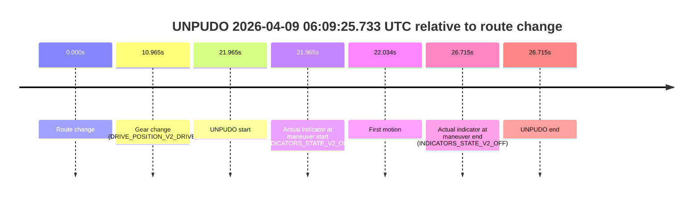
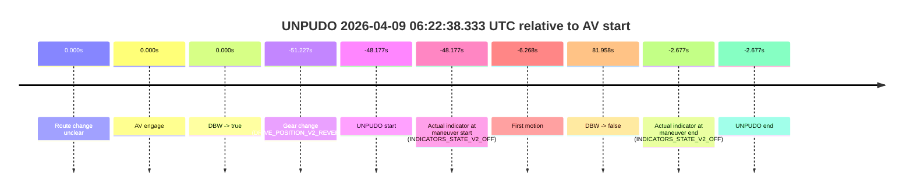
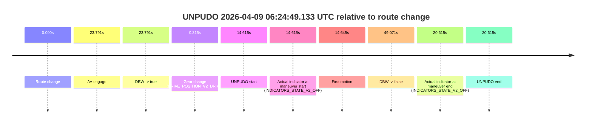
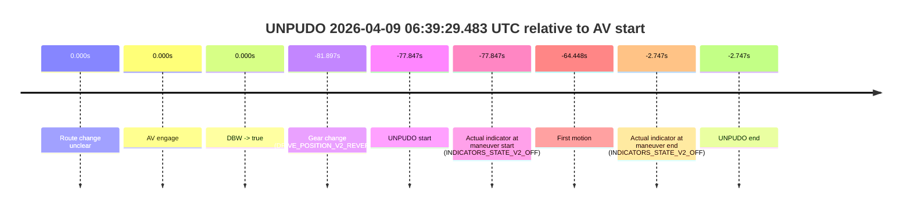

# Run Report: fme20036/2026-04-09--05-54-22--gen2-av-12faed10-8d61-409d-8a13-66526db58bd4

| Field | Value |
|---|---|
| Run ID | `fme20036/2026-04-09--05-54-22--gen2-av-12faed10-8d61-409d-8a13-66526db58bd4` |
| Date | `2026-04-09` |
| Model(s) | `lively-orange-horse` |
| Author | `guy.geva` |
| Event count | `4` |

## unpudo 2026-04-09 06:09:25.733 UTC

| Field | Value |
|---|---|
| Model | `lively-orange-horse` |
| Author | `guy.geva` |
| Run ID | `fme20036/2026-04-09--05-54-22--gen2-av-12faed10-8d61-409d-8a13-66526db58bd4` |
| Date | `2026-04-09` |
| Time (UTC) | `06:09:25.733` |
| Event type | `unpudo` |
| Disengagement type | `failed_to_unpudo` |
| Route change | `found` |
| Console | [run](https://console.sso.wayve.ai/run/fme20036/2026-04-09--05-54-22--gen2-av-12faed10-8d61-409d-8a13-66526db58bd4?id=&time-unixus=1775714965733293) |
| Foxglove | [segment](https://app.foxglove.dev/wayve-on-prem/p/prj_0dX18KZdVHg1fmmI/view?ds=foxglove-stream&ds.deviceName=fme20036&ds.start=2026-04-09T06%3A08%3A53.768280Z&ds.end=2026-04-09T06%3A09%3A40.483296Z&layoutId=lay_0e7VD4WIKDQGU73Y&time=2026-04-09T06%3A09%3A25.733293Z) |

### Event card: non-av

- Non-AV: the detected unpudo starts outside AV ownership, so it is kept for coverage but excluded from model success / failure scoring.

| Event | Time (UTC) | Delta from route change |
|---|---:|---:|
| Route change | 2026-04-09 06:09:03.768 | `0.000s` |
| Gear change (DRIVE_POSITION_V2_DRIVE) | 2026-04-09 06:09:14.733 | `10.965s` |
| UNPUDO start | 2026-04-09 06:09:25.733 | `21.965s` |
| Actual indicator at maneuver start (INDICATORS_STATE_V2_OFF) | 2026-04-09 06:09:25.733 | `21.965s` |
| First motion | 2026-04-09 06:09:25.802 | `22.034s` |
| Actual indicator at maneuver end (INDICATORS_STATE_V2_OFF) | 2026-04-09 06:09:30.483 | `26.715s` |
| UNPUDO end | 2026-04-09 06:09:30.483 | `26.715s` |

| Metric | Value |
|---|---|
| Outcome | `non-av` |
| Effective failure type | `none` |
| Route change status | `found` |
| DBW at event start | `false` |
| DBW at event end | `false` |
| Predicted gear at AV start | `n/a` |
| Actual gear at AV start | `n/a` |
| Predicted gear at event start | `DRIVE_POSITION_V2_DRIVE` |
| Actual gear at event start | `DRIVE_POSITION_V2_DRIVE` |
| Planned indicator direction | `INDICATORS_STATE_V2_RIGHT_ON` |
| Controller indicator direction | `INDICATORS_STATE_V2_RIGHT_ON` |
| Actual indicator direction | `INDICATORS_STATE_V2_OFF` |
| Actual indicator at maneuver end | `INDICATORS_STATE_V2_OFF` |
| Driver accel help in AV | `false` |
| Driver accel help timestamp | `n/a` |
| Max accel pedal pct in AV | `0.0%` |
| Max brake pedal pct in AV | `0.0%` |
| Max speed mps in AV | `0.000` |
| Route -> AV | `n/a` |
| AV -> event start | `n/a` |
| AV -> first motion | `n/a` |
| AV duration before disengagement | `n/a` |
| Trajectory waypoint count | `36` |
| Driving-plan step count | `11` |

The scored portion starts from the AV-owned window, not from the pre-AV setup. Route-change search in the stopped pre-event segment was `found`, with the baseline therefore set to route change. At the event anchor the model predicts `DRIVE_POSITION_V2_DRIVE` and the actual gear is `DRIVE_POSITION_V2_DRIVE`. The effective model outcome is `non-av` because `the event does not begin in AV ownership`.

### Resolution

| Field | Value |
|---|---|
| Final outcome | `non-av` |
| Do we agree with this label? | `yes` |
| Source disengagement type | `failed_to_unpudo` |
| Resolved effective failure type | `none` |
| Confidence | `high` |

## unpudo 2026-04-09 06:22:38.333 UTC

| Field | Value |
|---|---|
| Model | `lively-orange-horse` |
| Author | `guy.geva` |
| Run ID | `fme20036/2026-04-09--05-54-22--gen2-av-12faed10-8d61-409d-8a13-66526db58bd4` |
| Date | `2026-04-09` |
| Time (UTC) | `06:22:38.333` |
| Event type | `unpudo` |
| Disengagement type | `none observed` |
| Route change | `unclear` |
| Console | [run](https://console.sso.wayve.ai/run/fme20036/2026-04-09--05-54-22--gen2-av-12faed10-8d61-409d-8a13-66526db58bd4?id=&time-unixus=1775715758333298) |
| Foxglove | [segment](https://app.foxglove.dev/wayve-on-prem/p/prj_0dX18KZdVHg1fmmI/view?ds=foxglove-stream&ds.deviceName=fme20036&ds.start=2026-04-09T06%3A22%3A25.283303Z&ds.end=2026-04-09T06%3A24%3A58.468333Z&layoutId=lay_0e7VD4WIKDQGU73Y&time=2026-04-09T06%3A22%3A38.333298Z) |

### Event card: accidental

- Accidental: AV ownership is present for less than `2s`, so this is treated as an accidental brush with the maneuver rather than a meaningful model attempt.

| Event | Time (UTC) | Delta from AV start |
|---|---:|---:|
| Route change unclear | 2026-04-09 06:23:26.510 | `0.000s` |
| AV engage | 2026-04-09 06:23:26.510 | `0.000s` |
| DBW -> true | 2026-04-09 06:23:26.510 | `0.000s` |
| Gear change (DRIVE_POSITION_V2_REVERSE) | 2026-04-09 06:22:35.283 | `-51.227s` |
| UNPUDO start | 2026-04-09 06:22:38.333 | `-48.177s` |
| Actual indicator at maneuver start (INDICATORS_STATE_V2_OFF) | 2026-04-09 06:22:38.333 | `-48.177s` |
| First motion | 2026-04-09 06:23:20.242 | `-6.268s` |
| DBW -> false | 2026-04-09 06:24:48.468 | `81.958s` |
| Actual indicator at maneuver end (INDICATORS_STATE_V2_OFF) | 2026-04-09 06:23:23.833 | `-2.677s` |
| UNPUDO end | 2026-04-09 06:23:23.833 | `-2.677s` |

| Metric | Value |
|---|---|
| Outcome | `accidental` |
| Effective failure type | `none` |
| Route change status | `unclear` |
| DBW at event start | `false` |
| DBW at event end | `false` |
| Predicted gear at AV start | `DRIVE_POSITION_V2_DRIVE` |
| Actual gear at AV start | `DRIVE_POSITION_V2_DRIVE` |
| Predicted gear at event start | `DRIVE_POSITION_V2_DRIVE` |
| Actual gear at event start | `DRIVE_POSITION_V2_REVERSE` |
| Planned indicator direction | `INDICATORS_STATE_V2_OFF` |
| Controller indicator direction | `INDICATORS_STATE_V2_OFF` |
| Actual indicator direction | `INDICATORS_STATE_V2_OFF` |
| Actual indicator at maneuver end | `INDICATORS_STATE_V2_OFF` |
| Driver accel help in AV | `false` |
| Driver accel help timestamp | `n/a` |
| Max accel pedal pct in AV | `0.0%` |
| Max brake pedal pct in AV | `0.0%` |
| Max speed mps in AV | `0.000` |
| Route -> AV | `n/a` |
| AV -> event start | `-48.177s` |
| AV -> first motion | `-6.268s` |
| AV duration before disengagement | `81.958s` |
| Trajectory waypoint count | `36` |
| Driving-plan step count | `11` |

The scored portion starts from the AV-owned window, not from the pre-AV setup. Route-change search in the stopped pre-event segment was `unclear`, with the baseline therefore set to AV start. At the event anchor the model predicts `DRIVE_POSITION_V2_DRIVE` and the actual gear is `DRIVE_POSITION_V2_REVERSE`. The effective model outcome is `accidental` because `the AV-owned portion is shorter than 2s`.

### Resolution

| Field | Value |
|---|---|
| Final outcome | `accidental` |
| Do we agree with this label? | `yes` |
| Source disengagement type | `none observed` |
| Resolved effective failure type | `none` |
| Confidence | `medium` |

## unpudo 2026-04-09 06:24:49.133 UTC

| Field | Value |
|---|---|
| Model | `lively-orange-horse` |
| Author | `guy.geva` |
| Run ID | `fme20036/2026-04-09--05-54-22--gen2-av-12faed10-8d61-409d-8a13-66526db58bd4` |
| Date | `2026-04-09` |
| Time (UTC) | `06:24:49.133` |
| Event type | `unpudo` |
| Disengagement type | `failed_to_pudo` |
| Route change | `found` |
| Console | [run](https://console.sso.wayve.ai/run/fme20036/2026-04-09--05-54-22--gen2-av-12faed10-8d61-409d-8a13-66526db58bd4?id=&time-unixus=1775715889133297) |
| Foxglove | [segment](https://app.foxglove.dev/wayve-on-prem/p/prj_0dX18KZdVHg1fmmI/view?ds=foxglove-stream&ds.deviceName=fme20036&ds.start=2026-04-09T06%3A24%3A24.518274Z&ds.end=2026-04-09T06%3A25%3A33.588977Z&layoutId=lay_0e7VD4WIKDQGU73Y&time=2026-04-09T06%3A24%3A49.133297Z) |

### Event card: accidental

- Accidental: AV ownership is present for less than `2s`, so this is treated as an accidental brush with the maneuver rather than a meaningful model attempt.

| Event | Time (UTC) | Delta from route change |
|---|---:|---:|
| Route change | 2026-04-09 06:24:34.518 | `0.000s` |
| AV engage | 2026-04-09 06:24:58.309 | `23.791s` |
| DBW -> true | 2026-04-09 06:24:58.309 | `23.791s` |
| Gear change (DRIVE_POSITION_V2_DRIVE) | 2026-04-09 06:24:34.833 | `0.315s` |
| UNPUDO start | 2026-04-09 06:24:49.133 | `14.615s` |
| Actual indicator at maneuver start (INDICATORS_STATE_V2_OFF) | 2026-04-09 06:24:49.133 | `14.615s` |
| First motion | 2026-04-09 06:24:49.162 | `14.645s` |
| DBW -> false | 2026-04-09 06:25:23.588 | `49.071s` |
| Actual indicator at maneuver end (INDICATORS_STATE_V2_OFF) | 2026-04-09 06:24:55.133 | `20.615s` |
| UNPUDO end | 2026-04-09 06:24:55.133 | `20.615s` |

| Metric | Value |
|---|---|
| Outcome | `accidental` |
| Effective failure type | `none` |
| Route change status | `found` |
| DBW at event start | `false` |
| DBW at event end | `false` |
| Predicted gear at AV start | `DRIVE_POSITION_V2_DRIVE` |
| Actual gear at AV start | `DRIVE_POSITION_V2_DRIVE` |
| Predicted gear at event start | `DRIVE_POSITION_V2_DRIVE` |
| Actual gear at event start | `DRIVE_POSITION_V2_DRIVE` |
| Planned indicator direction | `INDICATORS_STATE_V2_RIGHT_ON` |
| Controller indicator direction | `INDICATORS_STATE_V2_RIGHT_ON` |
| Actual indicator direction | `INDICATORS_STATE_V2_OFF` |
| Actual indicator at maneuver end | `INDICATORS_STATE_V2_OFF` |
| Driver accel help in AV | `false` |
| Driver accel help timestamp | `n/a` |
| Max accel pedal pct in AV | `0.0%` |
| Max brake pedal pct in AV | `0.0%` |
| Max speed mps in AV | `0.000` |
| Route -> AV | `23.791s` |
| AV -> event start | `-9.176s` |
| AV -> first motion | `-9.146s` |
| AV duration before disengagement | `25.280s` |
| Trajectory waypoint count | `36` |
| Driving-plan step count | `11` |

The scored portion starts from the AV-owned window, not from the pre-AV setup. Route-change search in the stopped pre-event segment was `found`, with the baseline therefore set to route change. At the event anchor the model predicts `DRIVE_POSITION_V2_DRIVE` and the actual gear is `DRIVE_POSITION_V2_DRIVE`. The effective model outcome is `accidental` because `the AV-owned portion is shorter than 2s`.

### Resolution

| Field | Value |
|---|---|
| Final outcome | `accidental` |
| Do we agree with this label? | `yes` |
| Source disengagement type | `failed_to_pudo` |
| Resolved effective failure type | `none` |
| Confidence | `high` |

## unpudo 2026-04-09 06:39:29.483 UTC

| Field | Value |
|---|---|
| Model | `lively-orange-horse` |
| Author | `guy.geva` |
| Run ID | `fme20036/2026-04-09--05-54-22--gen2-av-12faed10-8d61-409d-8a13-66526db58bd4` |
| Date | `2026-04-09` |
| Time (UTC) | `06:39:29.483` |
| Event type | `unpudo` |
| Disengagement type | `none observed` |
| Route change | `unclear` |
| Console | [run](https://console.sso.wayve.ai/run/fme20036/2026-04-09--05-54-22--gen2-av-12faed10-8d61-409d-8a13-66526db58bd4?id=&time-unixus=1775716769483311) |
| Foxglove | [segment](https://app.foxglove.dev/wayve-on-prem/p/prj_0dX18KZdVHg1fmmI/view?ds=foxglove-stream&ds.deviceName=fme20036&ds.start=2026-04-09T06%3A39%3A15.433293Z&ds.end=2026-04-09T06%3A40%3A54.583322Z&layoutId=lay_0e7VD4WIKDQGU73Y&time=2026-04-09T06%3A39%3A29.483311Z) |

### Event card: accidental

- Accidental: AV ownership is present for less than `2s`, so this is treated as an accidental brush with the maneuver rather than a meaningful model attempt.

| Event | Time (UTC) | Delta from AV start |
|---|---:|---:|
| Route change unclear | 2026-04-09 06:40:47.330 | `0.000s` |
| AV engage | 2026-04-09 06:40:47.330 | `0.000s` |
| DBW -> true | 2026-04-09 06:40:47.330 | `0.000s` |
| Gear change (DRIVE_POSITION_V2_REVERSE) | 2026-04-09 06:39:25.433 | `-81.897s` |
| UNPUDO start | 2026-04-09 06:39:29.483 | `-77.847s` |
| Actual indicator at maneuver start (INDICATORS_STATE_V2_OFF) | 2026-04-09 06:39:29.483 | `-77.847s` |
| First motion | 2026-04-09 06:39:42.882 | `-64.448s` |
| Actual indicator at maneuver end (INDICATORS_STATE_V2_OFF) | 2026-04-09 06:40:44.583 | `-2.747s` |
| UNPUDO end | 2026-04-09 06:40:44.583 | `-2.747s` |

| Metric | Value |
|---|---|
| Outcome | `accidental` |
| Effective failure type | `none` |
| Route change status | `unclear` |
| DBW at event start | `false` |
| DBW at event end | `false` |
| Predicted gear at AV start | `DRIVE_POSITION_V2_DRIVE` |
| Actual gear at AV start | `DRIVE_POSITION_V2_DRIVE` |
| Predicted gear at event start | `DRIVE_POSITION_V2_DRIVE` |
| Actual gear at event start | `DRIVE_POSITION_V2_REVERSE` |
| Planned indicator direction | `INDICATORS_STATE_V2_OFF` |
| Controller indicator direction | `INDICATORS_STATE_V2_OFF` |
| Actual indicator direction | `INDICATORS_STATE_V2_OFF` |
| Actual indicator at maneuver end | `INDICATORS_STATE_V2_OFF` |
| Driver accel help in AV | `false` |
| Driver accel help timestamp | `n/a` |
| Max accel pedal pct in AV | `0.0%` |
| Max brake pedal pct in AV | `0.0%` |
| Max speed mps in AV | `0.000` |
| Route -> AV | `n/a` |
| AV -> event start | `-77.847s` |
| AV -> first motion | `-64.448s` |
| AV duration before disengagement | `n/a` |
| Trajectory waypoint count | `37` |
| Driving-plan step count | `11` |

The scored portion starts from the AV-owned window, not from the pre-AV setup. Route-change search in the stopped pre-event segment was `unclear`, with the baseline therefore set to AV start. At the event anchor the model predicts `DRIVE_POSITION_V2_DRIVE` and the actual gear is `DRIVE_POSITION_V2_REVERSE`. The effective model outcome is `accidental` because `the AV-owned portion is shorter than 2s`.

### Resolution

| Field | Value |
|---|---|
| Final outcome | `accidental` |
| Do we agree with this label? | `yes` |
| Source disengagement type | `none observed` |
| Resolved effective failure type | `none` |
| Confidence | `medium` |
