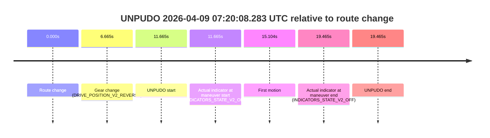
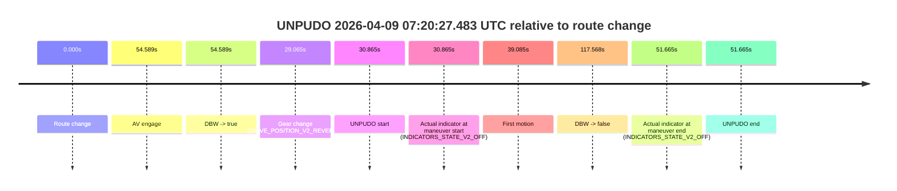
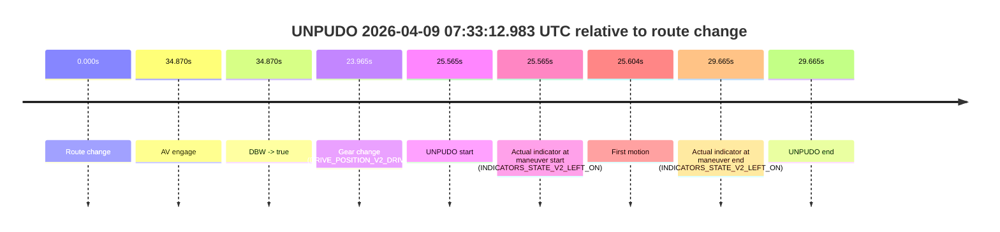

# Run Report: fme20036/2026-04-09--06-49-15--gen2-av-449ea4bf-7db8-4f20-b376-84ae20fd83ff

| Field | Value |
|---|---|
| Run ID | `fme20036/2026-04-09--06-49-15--gen2-av-449ea4bf-7db8-4f20-b376-84ae20fd83ff` |
| Date | `2026-04-09` |
| Model(s) | `lively-orange-horse` |
| Author | `guy.geva` |
| Event count | `3` |

## unpudo 2026-04-09 07:20:08.283 UTC

| Field | Value |
|---|---|
| Model | `lively-orange-horse` |
| Author | `guy.geva` |
| Run ID | `fme20036/2026-04-09--06-49-15--gen2-av-449ea4bf-7db8-4f20-b376-84ae20fd83ff` |
| Date | `2026-04-09` |
| Time (UTC) | `07:20:08.283` |
| Event type | `unpudo` |
| Disengagement type | `failed_to_unpudo` |
| Route change | `found` |
| Console | [run](https://console.sso.wayve.ai/run/fme20036/2026-04-09--06-49-15--gen2-av-449ea4bf-7db8-4f20-b376-84ae20fd83ff?id=&time-unixus=1775719208283293) |
| Foxglove | [segment](https://app.foxglove.dev/wayve-on-prem/p/prj_0dX18KZdVHg1fmmI/view?ds=foxglove-stream&ds.deviceName=fme20036&ds.start=2026-04-09T07%3A19%3A46.618237Z&ds.end=2026-04-09T07%3A20%3A26.083307Z&layoutId=lay_0e7VD4WIKDQGU73Y&time=2026-04-09T07%3A20%3A08.283293Z) |

### Event card: non-av

- Non-AV: the detected unpudo starts outside AV ownership, so it is kept for coverage but excluded from model success / failure scoring.

| Event | Time (UTC) | Delta from route change |
|---|---:|---:|
| Route change | 2026-04-09 07:19:56.618 | `0.000s` |
| Gear change (DRIVE_POSITION_V2_REVERSE) | 2026-04-09 07:20:03.283 | `6.665s` |
| UNPUDO start | 2026-04-09 07:20:08.283 | `11.665s` |
| Actual indicator at maneuver start (INDICATORS_STATE_V2_OFF) | 2026-04-09 07:20:08.283 | `11.665s` |
| First motion | 2026-04-09 07:20:11.722 | `15.104s` |
| Actual indicator at maneuver end (INDICATORS_STATE_V2_OFF) | 2026-04-09 07:20:16.083 | `19.465s` |
| UNPUDO end | 2026-04-09 07:20:16.083 | `19.465s` |

| Metric | Value |
|---|---|
| Outcome | `non-av` |
| Effective failure type | `none` |
| Route change status | `found` |
| DBW at event start | `false` |
| DBW at event end | `false` |
| Predicted gear at AV start | `n/a` |
| Actual gear at AV start | `n/a` |
| Predicted gear at event start | `DRIVE_POSITION_V2_DRIVE` |
| Actual gear at event start | `DRIVE_POSITION_V2_REVERSE` |
| Planned indicator direction | `INDICATORS_STATE_V2_OFF` |
| Controller indicator direction | `INDICATORS_STATE_V2_OFF` |
| Actual indicator direction | `INDICATORS_STATE_V2_OFF` |
| Actual indicator at maneuver end | `INDICATORS_STATE_V2_OFF` |
| Driver accel help in AV | `false` |
| Driver accel help timestamp | `n/a` |
| Max accel pedal pct in AV | `0.0%` |
| Max brake pedal pct in AV | `0.0%` |
| Max speed mps in AV | `0.000` |
| Route -> AV | `n/a` |
| AV -> event start | `n/a` |
| AV -> first motion | `n/a` |
| AV duration before disengagement | `n/a` |
| Trajectory waypoint count | `36` |
| Driving-plan step count | `11` |

The scored portion starts from the AV-owned window, not from the pre-AV setup. Route-change search in the stopped pre-event segment was `found`, with the baseline therefore set to route change. At the event anchor the model predicts `DRIVE_POSITION_V2_DRIVE` and the actual gear is `DRIVE_POSITION_V2_REVERSE`. The effective model outcome is `non-av` because `the event does not begin in AV ownership`.

### Resolution

| Field | Value |
|---|---|
| Final outcome | `non-av` |
| Do we agree with this label? | `yes` |
| Source disengagement type | `failed_to_unpudo` |
| Resolved effective failure type | `none` |
| Confidence | `high` |

## unpudo 2026-04-09 07:20:27.483 UTC

| Field | Value |
|---|---|
| Model | `lively-orange-horse` |
| Author | `guy.geva` |
| Run ID | `fme20036/2026-04-09--06-49-15--gen2-av-449ea4bf-7db8-4f20-b376-84ae20fd83ff` |
| Date | `2026-04-09` |
| Time (UTC) | `07:20:27.483` |
| Event type | `unpudo` |
| Disengagement type | `none observed` |
| Route change | `found` |
| Console | [run](https://console.sso.wayve.ai/run/fme20036/2026-04-09--06-49-15--gen2-av-449ea4bf-7db8-4f20-b376-84ae20fd83ff?id=&time-unixus=1775719227483312) |
| Foxglove | [segment](https://app.foxglove.dev/wayve-on-prem/p/prj_0dX18KZdVHg1fmmI/view?ds=foxglove-stream&ds.deviceName=fme20036&ds.start=2026-04-09T07%3A19%3A46.618237Z&ds.end=2026-04-09T07%3A22%3A04.186620Z&layoutId=lay_0e7VD4WIKDQGU73Y&time=2026-04-09T07%3A20%3A27.483312Z) |

### Event card: accidental

- Accidental: AV ownership is present for less than `2s`, so this is treated as an accidental brush with the maneuver rather than a meaningful model attempt.

| Event | Time (UTC) | Delta from route change |
|---|---:|---:|
| Route change | 2026-04-09 07:19:56.618 | `0.000s` |
| AV engage | 2026-04-09 07:20:51.207 | `54.589s` |
| DBW -> true | 2026-04-09 07:20:51.207 | `54.589s` |
| Gear change (DRIVE_POSITION_V2_REVERSE) | 2026-04-09 07:20:25.683 | `29.065s` |
| UNPUDO start | 2026-04-09 07:20:27.483 | `30.865s` |
| Actual indicator at maneuver start (INDICATORS_STATE_V2_OFF) | 2026-04-09 07:20:27.483 | `30.865s` |
| First motion | 2026-04-09 07:20:35.703 | `39.085s` |
| DBW -> false | 2026-04-09 07:21:54.186 | `117.568s` |
| Actual indicator at maneuver end (INDICATORS_STATE_V2_OFF) | 2026-04-09 07:20:48.283 | `51.665s` |
| UNPUDO end | 2026-04-09 07:20:48.283 | `51.665s` |

| Metric | Value |
|---|---|
| Outcome | `accidental` |
| Effective failure type | `none` |
| Route change status | `found` |
| DBW at event start | `false` |
| DBW at event end | `false` |
| Predicted gear at AV start | `DRIVE_POSITION_V2_DRIVE` |
| Actual gear at AV start | `DRIVE_POSITION_V2_DRIVE` |
| Predicted gear at event start | `DRIVE_POSITION_V2_DRIVE` |
| Actual gear at event start | `DRIVE_POSITION_V2_REVERSE` |
| Planned indicator direction | `INDICATORS_STATE_V2_OFF` |
| Controller indicator direction | `INDICATORS_STATE_V2_OFF` |
| Actual indicator direction | `INDICATORS_STATE_V2_OFF` |
| Actual indicator at maneuver end | `INDICATORS_STATE_V2_OFF` |
| Driver accel help in AV | `false` |
| Driver accel help timestamp | `n/a` |
| Max accel pedal pct in AV | `0.0%` |
| Max brake pedal pct in AV | `0.0%` |
| Max speed mps in AV | `0.000` |
| Route -> AV | `54.589s` |
| AV -> event start | `-23.724s` |
| AV -> first motion | `-15.504s` |
| AV duration before disengagement | `62.980s` |
| Trajectory waypoint count | `36` |
| Driving-plan step count | `11` |

The scored portion starts from the AV-owned window, not from the pre-AV setup. Route-change search in the stopped pre-event segment was `found`, with the baseline therefore set to route change. At the event anchor the model predicts `DRIVE_POSITION_V2_DRIVE` and the actual gear is `DRIVE_POSITION_V2_REVERSE`. The effective model outcome is `accidental` because `the AV-owned portion is shorter than 2s`.

### Resolution

| Field | Value |
|---|---|
| Final outcome | `accidental` |
| Do we agree with this label? | `yes` |
| Source disengagement type | `none observed` |
| Resolved effective failure type | `none` |
| Confidence | `high` |

## unpudo 2026-04-09 07:33:12.983 UTC

| Field | Value |
|---|---|
| Model | `lively-orange-horse` |
| Author | `guy.geva` |
| Run ID | `fme20036/2026-04-09--06-49-15--gen2-av-449ea4bf-7db8-4f20-b376-84ae20fd83ff` |
| Date | `2026-04-09` |
| Time (UTC) | `07:33:12.983` |
| Event type | `unpudo` |
| Disengagement type | `none observed` |
| Route change | `found` |
| Console | [run](https://console.sso.wayve.ai/run/fme20036/2026-04-09--06-49-15--gen2-av-449ea4bf-7db8-4f20-b376-84ae20fd83ff?id=&time-unixus=1775719992983312) |
| Foxglove | [segment](https://app.foxglove.dev/wayve-on-prem/p/prj_0dX18KZdVHg1fmmI/view?ds=foxglove-stream&ds.deviceName=fme20036&ds.start=2026-04-09T07%3A32%3A37.418277Z&ds.end=2026-04-09T07%3A33%3A27.083308Z&layoutId=lay_0e7VD4WIKDQGU73Y&time=2026-04-09T07%3A33%3A12.983312Z) |

### Event card: accidental

- Accidental: AV ownership is present for less than `2s`, so this is treated as an accidental brush with the maneuver rather than a meaningful model attempt.

| Event | Time (UTC) | Delta from route change |
|---|---:|---:|
| Route change | 2026-04-09 07:32:47.418 | `0.000s` |
| AV engage | 2026-04-09 07:33:22.287 | `34.870s` |
| DBW -> true | 2026-04-09 07:33:22.287 | `34.870s` |
| Gear change (DRIVE_POSITION_V2_DRIVE) | 2026-04-09 07:33:11.383 | `23.965s` |
| UNPUDO start | 2026-04-09 07:33:12.983 | `25.565s` |
| Actual indicator at maneuver start (INDICATORS_STATE_V2_LEFT_ON) | 2026-04-09 07:33:12.983 | `25.565s` |
| First motion | 2026-04-09 07:33:13.022 | `25.604s` |
| Actual indicator at maneuver end (INDICATORS_STATE_V2_LEFT_ON) | 2026-04-09 07:33:17.083 | `29.665s` |
| UNPUDO end | 2026-04-09 07:33:17.083 | `29.665s` |

| Metric | Value |
|---|---|
| Outcome | `accidental` |
| Effective failure type | `none` |
| Route change status | `found` |
| DBW at event start | `false` |
| DBW at event end | `false` |
| Predicted gear at AV start | `DRIVE_POSITION_V2_DRIVE` |
| Actual gear at AV start | `DRIVE_POSITION_V2_DRIVE` |
| Predicted gear at event start | `DRIVE_POSITION_V2_DRIVE` |
| Actual gear at event start | `DRIVE_POSITION_V2_DRIVE` |
| Planned indicator direction | `INDICATORS_STATE_V2_LEFT_ON` |
| Controller indicator direction | `INDICATORS_STATE_V2_LEFT_ON` |
| Actual indicator direction | `INDICATORS_STATE_V2_LEFT_ON` |
| Actual indicator at maneuver end | `INDICATORS_STATE_V2_LEFT_ON` |
| Driver accel help in AV | `false` |
| Driver accel help timestamp | `n/a` |
| Max accel pedal pct in AV | `0.0%` |
| Max brake pedal pct in AV | `0.0%` |
| Max speed mps in AV | `0.000` |
| Route -> AV | `34.870s` |
| AV -> event start | `-9.305s` |
| AV -> first motion | `-9.265s` |
| AV duration before disengagement | `n/a` |
| Trajectory waypoint count | `36` |
| Driving-plan step count | `11` |

The scored portion starts from the AV-owned window, not from the pre-AV setup. Route-change search in the stopped pre-event segment was `found`, with the baseline therefore set to route change. At the event anchor the model predicts `DRIVE_POSITION_V2_DRIVE` and the actual gear is `DRIVE_POSITION_V2_DRIVE`. The effective model outcome is `accidental` because `the AV-owned portion is shorter than 2s`.

### Resolution

| Field | Value |
|---|---|
| Final outcome | `accidental` |
| Do we agree with this label? | `yes` |
| Source disengagement type | `none observed` |
| Resolved effective failure type | `none` |
| Confidence | `high` |
