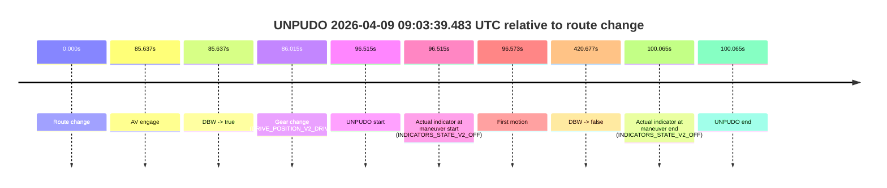
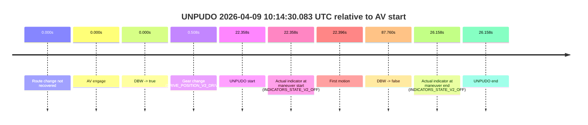
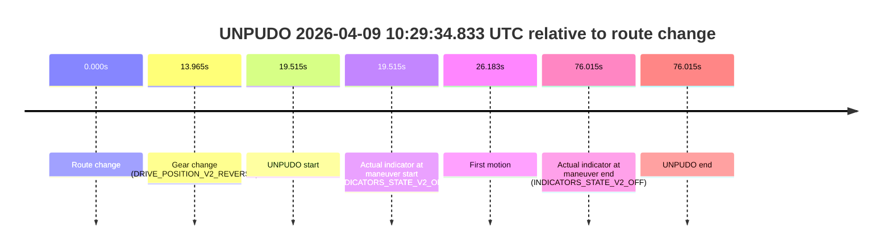

# Run Report: fme20036/2026-04-09--08-57-22--gen2-av-991e4b84-b35a-4f97-aa54-0f32bfcdf984

| Field | Value |
|---|---|
| Run ID | `fme20036/2026-04-09--08-57-22--gen2-av-991e4b84-b35a-4f97-aa54-0f32bfcdf984` |
| Date | `2026-04-09` |
| Model(s) | `lively-orange-horse` |
| Author | `guy.geva` |
| Event count | `6` |

## unpudo 2026-04-09 09:03:39.483 UTC

| Field | Value |
|---|---|
| Model | `lively-orange-horse` |
| Author | `guy.geva` |
| Run ID | `fme20036/2026-04-09--08-57-22--gen2-av-991e4b84-b35a-4f97-aa54-0f32bfcdf984` |
| Date | `2026-04-09` |
| Time (UTC) | `09:03:39.483` |
| Event type | `unpudo` |
| Disengagement type | `none observed` |
| Route change | `found` |
| Console | [run](https://console.sso.wayve.ai/run/fme20036/2026-04-09--08-57-22--gen2-av-991e4b84-b35a-4f97-aa54-0f32bfcdf984?id=&time-unixus=1775725419483299) |
| Foxglove | [segment](https://app.foxglove.dev/wayve-on-prem/p/prj_0dX18KZdVHg1fmmI/view?ds=foxglove-stream&ds.deviceName=fme20036&ds.start=2026-04-09T09%3A01%3A52.968292Z&ds.end=2026-04-09T09%3A09%3A13.645177Z&layoutId=lay_0e7VD4WIKDQGU73Y&time=2026-04-09T09%3A03%3A39.483299Z) |

### Event card: pass

- Pass: AV owns the credited unpudo through the official event window, the gear state is aligned at the anchor, and the vehicle moves without driver accelerator help in AV.

| Event | Time (UTC) | Delta from route change |
|---|---:|---:|
| Route change | 2026-04-09 09:02:02.968 | `0.000s` |
| AV engage | 2026-04-09 09:03:28.605 | `85.637s` |
| DBW -> true | 2026-04-09 09:03:28.605 | `85.637s` |
| Gear change (DRIVE_POSITION_V2_DRIVE) | 2026-04-09 09:03:28.983 | `86.015s` |
| UNPUDO start | 2026-04-09 09:03:39.483 | `96.515s` |
| Actual indicator at maneuver start (INDICATORS_STATE_V2_OFF) | 2026-04-09 09:03:39.483 | `96.515s` |
| First motion | 2026-04-09 09:03:39.541 | `96.573s` |
| DBW -> false | 2026-04-09 09:09:03.645 | `420.677s` |
| Actual indicator at maneuver end (INDICATORS_STATE_V2_OFF) | 2026-04-09 09:03:43.033 | `100.065s` |
| UNPUDO end | 2026-04-09 09:03:43.033 | `100.065s` |

| Metric | Value |
|---|---|
| Outcome | `pass` |
| Effective failure type | `none` |
| Route change status | `found` |
| DBW at event start | `true` |
| DBW at event end | `true` |
| Predicted gear at AV start | `DRIVE_POSITION_V2_DRIVE` |
| Actual gear at AV start | `DRIVE_POSITION_V2_PARK` |
| Predicted gear at event start | `DRIVE_POSITION_V2_DRIVE` |
| Actual gear at event start | `DRIVE_POSITION_V2_DRIVE` |
| Planned indicator direction | `INDICATORS_STATE_V2_RIGHT_ON` |
| Controller indicator direction | `INDICATORS_STATE_V2_RIGHT_ON` |
| Actual indicator direction | `INDICATORS_STATE_V2_OFF` |
| Actual indicator at maneuver end | `INDICATORS_STATE_V2_OFF` |
| Driver accel help in AV | `false` |
| Driver accel help timestamp | `n/a` |
| Max accel pedal pct in AV | `0.0%` |
| Max brake pedal pct in AV | `8.7%` |
| Max speed mps in AV | `5.489` |
| Route -> AV | `85.637s` |
| AV -> event start | `10.878s` |
| AV -> first motion | `10.936s` |
| AV duration before disengagement | `335.040s` |
| Trajectory waypoint count | `36` |
| Driving-plan step count | `11` |

The scored portion starts from the AV-owned window, not from the pre-AV setup. Route-change search in the stopped pre-event segment was `found`, with the baseline therefore set to route change. At the event anchor the model predicts `DRIVE_POSITION_V2_DRIVE` and the actual gear is `DRIVE_POSITION_V2_DRIVE`. The effective model outcome is `pass` because `the credited maneuver stays AV-owned through the official event end`.

### Resolution

| Field | Value |
|---|---|
| Final outcome | `pass` |
| Do we agree with this label? | `yes` |
| Source disengagement type | `none observed` |
| Resolved effective failure type | `none` |
| Confidence | `high` |

## unpudo 2026-04-09 09:22:22.733 UTC

| Field | Value |
|---|---|
| Model | `lively-orange-horse` |
| Author | `guy.geva` |
| Run ID | `fme20036/2026-04-09--08-57-22--gen2-av-991e4b84-b35a-4f97-aa54-0f32bfcdf984` |
| Date | `2026-04-09` |
| Time (UTC) | `09:22:22.733` |
| Event type | `unpudo` |
| Disengagement type | `none observed` |
| Route change | `found` |
| Console | [run](https://console.sso.wayve.ai/run/fme20036/2026-04-09--08-57-22--gen2-av-991e4b84-b35a-4f97-aa54-0f32bfcdf984?id=&time-unixus=1775726542733295) |
| Foxglove | [segment](https://app.foxglove.dev/wayve-on-prem/p/prj_0dX18KZdVHg1fmmI/view?ds=foxglove-stream&ds.deviceName=fme20036&ds.start=2026-04-09T09%3A22%3A01.218245Z&ds.end=2026-04-09T09%3A22%3A45.683307Z&layoutId=lay_0e7VD4WIKDQGU73Y&time=2026-04-09T09%3A22%3A22.733295Z) |

### Event card: non-av

- Non-AV: the detected unpudo starts outside AV ownership, so it is kept for coverage but excluded from model success / failure scoring.

| Event | Time (UTC) | Delta from route change |
|---|---:|---:|
| Route change | 2026-04-09 09:22:11.218 | `0.000s` |
| Gear change (DRIVE_POSITION_V2_REVERSE) | 2026-04-09 09:22:18.483 | `7.265s` |
| UNPUDO start | 2026-04-09 09:22:22.733 | `11.515s` |
| Actual indicator at maneuver start (INDICATORS_STATE_V2_LEFT_ON) | 2026-04-09 09:22:22.733 | `11.515s` |
| First motion | 2026-04-09 09:22:27.481 | `16.263s` |
| Actual indicator at maneuver end (INDICATORS_STATE_V2_OFF) | 2026-04-09 09:22:35.683 | `24.465s` |
| UNPUDO end | 2026-04-09 09:22:35.683 | `24.465s` |

| Metric | Value |
|---|---|
| Outcome | `non-av` |
| Effective failure type | `none` |
| Route change status | `found` |
| DBW at event start | `false` |
| DBW at event end | `false` |
| Predicted gear at AV start | `n/a` |
| Actual gear at AV start | `n/a` |
| Predicted gear at event start | `DRIVE_POSITION_V2_DRIVE` |
| Actual gear at event start | `DRIVE_POSITION_V2_REVERSE` |
| Planned indicator direction | `INDICATORS_STATE_V2_LEFT_ON` |
| Controller indicator direction | `INDICATORS_STATE_V2_LEFT_ON` |
| Actual indicator direction | `INDICATORS_STATE_V2_LEFT_ON` |
| Actual indicator at maneuver end | `INDICATORS_STATE_V2_OFF` |
| Driver accel help in AV | `false` |
| Driver accel help timestamp | `n/a` |
| Max accel pedal pct in AV | `0.0%` |
| Max brake pedal pct in AV | `0.0%` |
| Max speed mps in AV | `0.000` |
| Route -> AV | `n/a` |
| AV -> event start | `n/a` |
| AV -> first motion | `n/a` |
| AV duration before disengagement | `n/a` |
| Trajectory waypoint count | `35` |
| Driving-plan step count | `11` |

The scored portion starts from the AV-owned window, not from the pre-AV setup. Route-change search in the stopped pre-event segment was `found`, with the baseline therefore set to route change. At the event anchor the model predicts `DRIVE_POSITION_V2_DRIVE` and the actual gear is `DRIVE_POSITION_V2_REVERSE`. The effective model outcome is `non-av` because `the event does not begin in AV ownership`.

### Resolution

| Field | Value |
|---|---|
| Final outcome | `non-av` |
| Do we agree with this label? | `yes` |
| Source disengagement type | `none observed` |
| Resolved effective failure type | `none` |
| Confidence | `high` |

## unpudo 2026-04-09 09:40:03.483 UTC

| Field | Value |
|---|---|
| Model | `lively-orange-horse` |
| Author | `guy.geva` |
| Run ID | `fme20036/2026-04-09--08-57-22--gen2-av-991e4b84-b35a-4f97-aa54-0f32bfcdf984` |
| Date | `2026-04-09` |
| Time (UTC) | `09:40:03.483` |
| Event type | `unpudo` |
| Disengagement type | `failed_to_unpudo` |
| Route change | `found` |
| Console | [run](https://console.sso.wayve.ai/run/fme20036/2026-04-09--08-57-22--gen2-av-991e4b84-b35a-4f97-aa54-0f32bfcdf984?id=&time-unixus=1775727603483300) |
| Foxglove | [segment](https://app.foxglove.dev/wayve-on-prem/p/prj_0dX18KZdVHg1fmmI/view?ds=foxglove-stream&ds.deviceName=fme20036&ds.start=2026-04-09T09%3A39%3A42.568244Z&ds.end=2026-04-09T09%3A41%3A10.385170Z&layoutId=lay_0e7VD4WIKDQGU73Y&time=2026-04-09T09%3A40%3A03.483300Z) |

### Event card: accidental

- Accidental: AV ownership is present for less than `2s`, so this is treated as an accidental brush with the maneuver rather than a meaningful model attempt.

| Event | Time (UTC) | Delta from route change |
|---|---:|---:|
| Route change | 2026-04-09 09:39:52.568 | `0.000s` |
| AV engage | 2026-04-09 09:40:09.084 | `16.517s` |
| DBW -> true | 2026-04-09 09:40:09.084 | `16.517s` |
| Gear change (DRIVE_POSITION_V2_DRIVE) | 2026-04-09 09:39:52.783 | `0.215s` |
| UNPUDO start | 2026-04-09 09:40:03.483 | `10.915s` |
| Actual indicator at maneuver start (INDICATORS_STATE_V2_OFF) | 2026-04-09 09:40:03.483 | `10.915s` |
| First motion | 2026-04-09 09:40:03.581 | `11.013s` |
| DBW -> false | 2026-04-09 09:41:00.385 | `67.817s` |
| Actual indicator at maneuver end (INDICATORS_STATE_V2_OFF) | 2026-04-09 09:40:06.933 | `14.365s` |
| UNPUDO end | 2026-04-09 09:40:06.933 | `14.365s` |

| Metric | Value |
|---|---|
| Outcome | `accidental` |
| Effective failure type | `none` |
| Route change status | `found` |
| DBW at event start | `false` |
| DBW at event end | `false` |
| Predicted gear at AV start | `DRIVE_POSITION_V2_DRIVE` |
| Actual gear at AV start | `DRIVE_POSITION_V2_DRIVE` |
| Predicted gear at event start | `DRIVE_POSITION_V2_DRIVE` |
| Actual gear at event start | `DRIVE_POSITION_V2_DRIVE` |
| Planned indicator direction | `INDICATORS_STATE_V2_RIGHT_ON` |
| Controller indicator direction | `INDICATORS_STATE_V2_RIGHT_ON` |
| Actual indicator direction | `INDICATORS_STATE_V2_OFF` |
| Actual indicator at maneuver end | `INDICATORS_STATE_V2_OFF` |
| Driver accel help in AV | `false` |
| Driver accel help timestamp | `n/a` |
| Max accel pedal pct in AV | `0.0%` |
| Max brake pedal pct in AV | `0.0%` |
| Max speed mps in AV | `0.000` |
| Route -> AV | `16.517s` |
| AV -> event start | `-5.602s` |
| AV -> first motion | `-5.504s` |
| AV duration before disengagement | `51.300s` |
| Trajectory waypoint count | `36` |
| Driving-plan step count | `11` |

The scored portion starts from the AV-owned window, not from the pre-AV setup. Route-change search in the stopped pre-event segment was `found`, with the baseline therefore set to route change. At the event anchor the model predicts `DRIVE_POSITION_V2_DRIVE` and the actual gear is `DRIVE_POSITION_V2_DRIVE`. The effective model outcome is `accidental` because `the AV-owned portion is shorter than 2s`.

### Resolution

| Field | Value |
|---|---|
| Final outcome | `accidental` |
| Do we agree with this label? | `yes` |
| Source disengagement type | `failed_to_unpudo` |
| Resolved effective failure type | `none` |
| Confidence | `high` |

## unpudo 2026-04-09 09:41:01.233 UTC

| Field | Value |
|---|---|
| Model | `lively-orange-horse` |
| Author | `guy.geva` |
| Run ID | `fme20036/2026-04-09--08-57-22--gen2-av-991e4b84-b35a-4f97-aa54-0f32bfcdf984` |
| Date | `2026-04-09` |
| Time (UTC) | `09:41:01.233` |
| Event type | `unpudo` |
| Disengagement type | `failed_to_unpudo` |
| Route change | `found` |
| Console | [run](https://console.sso.wayve.ai/run/fme20036/2026-04-09--08-57-22--gen2-av-991e4b84-b35a-4f97-aa54-0f32bfcdf984?id=&time-unixus=1775727661233295) |
| Foxglove | [segment](https://app.foxglove.dev/wayve-on-prem/p/prj_0dX18KZdVHg1fmmI/view?ds=foxglove-stream&ds.deviceName=fme20036&ds.start=2026-04-09T09%3A39%3A42.568244Z&ds.end=2026-04-09T09%3A41%3A51.244995Z&layoutId=lay_0e7VD4WIKDQGU73Y&time=2026-04-09T09%3A41%3A01.233295Z) |

### Event card: accidental

- Accidental: AV ownership is present for less than `2s`, so this is treated as an accidental brush with the maneuver rather than a meaningful model attempt.

| Event | Time (UTC) | Delta from route change |
|---|---:|---:|
| Route change | 2026-04-09 09:39:52.568 | `0.000s` |
| AV engage | 2026-04-09 09:41:15.086 | `82.518s` |
| DBW -> true | 2026-04-09 09:41:15.086 | `82.518s` |
| Gear change (DRIVE_POSITION_V2_DRIVE) | 2026-04-09 09:40:47.083 | `54.515s` |
| UNPUDO start | 2026-04-09 09:41:01.233 | `68.665s` |
| Actual indicator at maneuver start (INDICATORS_STATE_V2_OFF) | 2026-04-09 09:41:01.233 | `68.665s` |
| First motion | 2026-04-09 09:41:01.281 | `68.713s` |
| DBW -> false | 2026-04-09 09:41:41.244 | `108.677s` |
| Actual indicator at maneuver end (INDICATORS_STATE_V2_OFF) | 2026-04-09 09:41:06.483 | `73.915s` |
| UNPUDO end | 2026-04-09 09:41:06.483 | `73.915s` |

| Metric | Value |
|---|---|
| Outcome | `accidental` |
| Effective failure type | `none` |
| Route change status | `found` |
| DBW at event start | `false` |
| DBW at event end | `false` |
| Predicted gear at AV start | `DRIVE_POSITION_V2_DRIVE` |
| Actual gear at AV start | `DRIVE_POSITION_V2_DRIVE` |
| Predicted gear at event start | `DRIVE_POSITION_V2_DRIVE` |
| Actual gear at event start | `DRIVE_POSITION_V2_DRIVE` |
| Planned indicator direction | `INDICATORS_STATE_V2_RIGHT_ON` |
| Controller indicator direction | `INDICATORS_STATE_V2_RIGHT_ON` |
| Actual indicator direction | `INDICATORS_STATE_V2_OFF` |
| Actual indicator at maneuver end | `INDICATORS_STATE_V2_OFF` |
| Driver accel help in AV | `false` |
| Driver accel help timestamp | `n/a` |
| Max accel pedal pct in AV | `0.0%` |
| Max brake pedal pct in AV | `0.0%` |
| Max speed mps in AV | `0.000` |
| Route -> AV | `82.518s` |
| AV -> event start | `-13.853s` |
| AV -> first motion | `-13.805s` |
| AV duration before disengagement | `26.159s` |
| Trajectory waypoint count | `35` |
| Driving-plan step count | `11` |

The scored portion starts from the AV-owned window, not from the pre-AV setup. Route-change search in the stopped pre-event segment was `found`, with the baseline therefore set to route change. At the event anchor the model predicts `DRIVE_POSITION_V2_DRIVE` and the actual gear is `DRIVE_POSITION_V2_DRIVE`. The effective model outcome is `accidental` because `the AV-owned portion is shorter than 2s`.

### Resolution

| Field | Value |
|---|---|
| Final outcome | `accidental` |
| Do we agree with this label? | `yes` |
| Source disengagement type | `failed_to_unpudo` |
| Resolved effective failure type | `none` |
| Confidence | `high` |

## unpudo 2026-04-09 10:14:30.083 UTC

| Field | Value |
|---|---|
| Model | `lively-orange-horse` |
| Author | `guy.geva` |
| Run ID | `fme20036/2026-04-09--08-57-22--gen2-av-991e4b84-b35a-4f97-aa54-0f32bfcdf984` |
| Date | `2026-04-09` |
| Time (UTC) | `10:14:30.083` |
| Event type | `unpudo` |
| Disengagement type | `none observed` |
| Route change | `not found` |
| Console | [run](https://console.sso.wayve.ai/run/fme20036/2026-04-09--08-57-22--gen2-av-991e4b84-b35a-4f97-aa54-0f32bfcdf984?id=&time-unixus=1775729670083304) |
| Foxglove | [segment](https://app.foxglove.dev/wayve-on-prem/p/prj_0dX18KZdVHg1fmmI/view?ds=foxglove-stream&ds.deviceName=fme20036&ds.start=2026-04-09T10%3A13%3A57.725191Z&ds.end=2026-04-09T10%3A15%3A45.485088Z&layoutId=lay_0e7VD4WIKDQGU73Y&time=2026-04-09T10%3A14%3A30.083304Z) |

### Event card: pass

- Pass: AV owns the credited unpudo through the official event window, the gear state is aligned at the anchor, and the vehicle moves without driver accelerator help in AV.

| Event | Time (UTC) | Delta from AV start |
|---|---:|---:|
| Route change not recovered | 2026-04-09 10:14:07.725 | `0.000s` |
| AV engage | 2026-04-09 10:14:07.725 | `0.000s` |
| DBW -> true | 2026-04-09 10:14:07.725 | `0.000s` |
| Gear change (DRIVE_POSITION_V2_DRIVE) | 2026-04-09 10:14:08.233 | `0.508s` |
| UNPUDO start | 2026-04-09 10:14:30.083 | `22.358s` |
| Actual indicator at maneuver start (INDICATORS_STATE_V2_OFF) | 2026-04-09 10:14:30.083 | `22.358s` |
| First motion | 2026-04-09 10:14:30.121 | `22.396s` |
| DBW -> false | 2026-04-09 10:15:35.485 | `87.760s` |
| Actual indicator at maneuver end (INDICATORS_STATE_V2_OFF) | 2026-04-09 10:14:33.883 | `26.158s` |
| UNPUDO end | 2026-04-09 10:14:33.883 | `26.158s` |

| Metric | Value |
|---|---|
| Outcome | `pass` |
| Effective failure type | `none` |
| Route change status | `not found` |
| DBW at event start | `true` |
| DBW at event end | `true` |
| Predicted gear at AV start | `DRIVE_POSITION_V2_DRIVE` |
| Actual gear at AV start | `DRIVE_POSITION_V2_PARK` |
| Predicted gear at event start | `DRIVE_POSITION_V2_DRIVE` |
| Actual gear at event start | `DRIVE_POSITION_V2_DRIVE` |
| Planned indicator direction | `INDICATORS_STATE_V2_RIGHT_ON` |
| Controller indicator direction | `INDICATORS_STATE_V2_RIGHT_ON` |
| Actual indicator direction | `INDICATORS_STATE_V2_OFF` |
| Actual indicator at maneuver end | `INDICATORS_STATE_V2_OFF` |
| Driver accel help in AV | `false` |
| Driver accel help timestamp | `n/a` |
| Max accel pedal pct in AV | `0.0%` |
| Max brake pedal pct in AV | `8.6%` |
| Max speed mps in AV | `4.664` |
| Route -> AV | `n/a` |
| AV -> event start | `22.358s` |
| AV -> first motion | `22.396s` |
| AV duration before disengagement | `87.760s` |
| Trajectory waypoint count | `36` |
| Driving-plan step count | `11` |

The scored portion starts from the AV-owned window, not from the pre-AV setup. Route-change search in the stopped pre-event segment was `not found`, with the baseline therefore set to AV start. At the event anchor the model predicts `DRIVE_POSITION_V2_DRIVE` and the actual gear is `DRIVE_POSITION_V2_DRIVE`. The effective model outcome is `pass` because `the credited maneuver stays AV-owned through the official event end`.

### Resolution

| Field | Value |
|---|---|
| Final outcome | `pass` |
| Do we agree with this label? | `yes` |
| Source disengagement type | `none observed` |
| Resolved effective failure type | `none` |
| Confidence | `high` |

## unpudo 2026-04-09 10:29:34.833 UTC

| Field | Value |
|---|---|
| Model | `lively-orange-horse` |
| Author | `guy.geva` |
| Run ID | `fme20036/2026-04-09--08-57-22--gen2-av-991e4b84-b35a-4f97-aa54-0f32bfcdf984` |
| Date | `2026-04-09` |
| Time (UTC) | `10:29:34.833` |
| Event type | `unpudo` |
| Disengagement type | `none observed` |
| Route change | `found` |
| Console | [run](https://console.sso.wayve.ai/run/fme20036/2026-04-09--08-57-22--gen2-av-991e4b84-b35a-4f97-aa54-0f32bfcdf984?id=&time-unixus=1775730574833320) |
| Foxglove | [segment](https://app.foxglove.dev/wayve-on-prem/p/prj_0dX18KZdVHg1fmmI/view?ds=foxglove-stream&ds.deviceName=fme20036&ds.start=2026-04-09T10%3A29%3A05.318452Z&ds.end=2026-04-09T10%3A30%3A41.333317Z&layoutId=lay_0e7VD4WIKDQGU73Y&time=2026-04-09T10%3A29%3A34.833320Z) |

### Event card: non-av

- Non-AV: the detected unpudo starts outside AV ownership, so it is kept for coverage but excluded from model success / failure scoring.

| Event | Time (UTC) | Delta from route change |
|---|---:|---:|
| Route change | 2026-04-09 10:29:15.318 | `0.000s` |
| Gear change (DRIVE_POSITION_V2_REVERSE) | 2026-04-09 10:29:29.283 | `13.965s` |
| UNPUDO start | 2026-04-09 10:29:34.833 | `19.515s` |
| Actual indicator at maneuver start (INDICATORS_STATE_V2_OFF) | 2026-04-09 10:29:34.833 | `19.515s` |
| First motion | 2026-04-09 10:29:41.501 | `26.183s` |
| Actual indicator at maneuver end (INDICATORS_STATE_V2_OFF) | 2026-04-09 10:30:31.333 | `76.015s` |
| UNPUDO end | 2026-04-09 10:30:31.333 | `76.015s` |

| Metric | Value |
|---|---|
| Outcome | `non-av` |
| Effective failure type | `none` |
| Route change status | `found` |
| DBW at event start | `false` |
| DBW at event end | `false` |
| Predicted gear at AV start | `n/a` |
| Actual gear at AV start | `n/a` |
| Predicted gear at event start | `DRIVE_POSITION_V2_DRIVE` |
| Actual gear at event start | `DRIVE_POSITION_V2_REVERSE` |
| Planned indicator direction | `INDICATORS_STATE_V2_OFF` |
| Controller indicator direction | `INDICATORS_STATE_V2_OFF` |
| Actual indicator direction | `INDICATORS_STATE_V2_OFF` |
| Actual indicator at maneuver end | `INDICATORS_STATE_V2_OFF` |
| Driver accel help in AV | `false` |
| Driver accel help timestamp | `n/a` |
| Max accel pedal pct in AV | `0.0%` |
| Max brake pedal pct in AV | `0.0%` |
| Max speed mps in AV | `0.000` |
| Route -> AV | `n/a` |
| AV -> event start | `n/a` |
| AV -> first motion | `n/a` |
| AV duration before disengagement | `n/a` |
| Trajectory waypoint count | `37` |
| Driving-plan step count | `11` |

The scored portion starts from the AV-owned window, not from the pre-AV setup. Route-change search in the stopped pre-event segment was `found`, with the baseline therefore set to route change. At the event anchor the model predicts `DRIVE_POSITION_V2_DRIVE` and the actual gear is `DRIVE_POSITION_V2_REVERSE`. The effective model outcome is `non-av` because `the event does not begin in AV ownership`.

### Resolution

| Field | Value |
|---|---|
| Final outcome | `non-av` |
| Do we agree with this label? | `yes` |
| Source disengagement type | `none observed` |
| Resolved effective failure type | `none` |
| Confidence | `high` |
