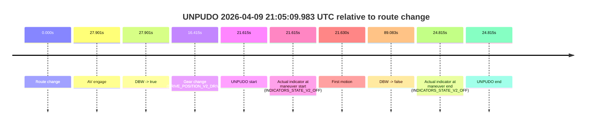
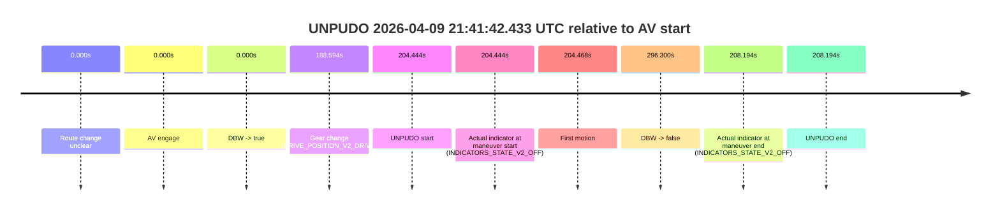
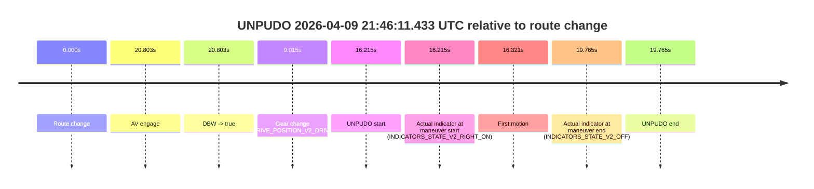

# Run Report: fme20036/2026-04-09--20-42-56--gen2-av-a9272ce7-86e1-4f6f-9b6f-88504c698f51

| Field | Value |
|---|---|
| Run ID | `fme20036/2026-04-09--20-42-56--gen2-av-a9272ce7-86e1-4f6f-9b6f-88504c698f51` |
| Date | `2026-04-09` |
| Model(s) | `lively-orange-horse` |
| Author | `guy.geva` |
| Event count | `4` |

## unpudo 2026-04-09 21:05:09.983 UTC

| Field | Value |
|---|---|
| Model | `lively-orange-horse` |
| Author | `guy.geva` |
| Run ID | `fme20036/2026-04-09--20-42-56--gen2-av-a9272ce7-86e1-4f6f-9b6f-88504c698f51` |
| Date | `2026-04-09` |
| Time (UTC) | `21:05:09.983` |
| Event type | `unpudo` |
| Disengagement type | `failed_to_unpudo` |
| Route change | `found` |
| Console | [run](https://console.sso.wayve.ai/run/fme20036/2026-04-09--20-42-56--gen2-av-a9272ce7-86e1-4f6f-9b6f-88504c698f51?id=&time-unixus=1775768709983304) |
| Foxglove | [segment](https://app.foxglove.dev/wayve-on-prem/p/prj_0dX18KZdVHg1fmmI/view?ds=foxglove-stream&ds.deviceName=fme20036&ds.start=2026-04-09T21%3A04%3A38.368349Z&ds.end=2026-04-09T21%3A06%3A27.451405Z&layoutId=lay_0e7VD4WIKDQGU73Y&time=2026-04-09T21%3A05%3A09.983304Z) |

### Event card: fail

- Fail: AV owns part of the segment, but the event still resolves as a model-performance failure under the AV-only scoring rule.

| Event | Time (UTC) | Delta from route change |
|---|---:|---:|
| Route change | 2026-04-09 21:04:48.368 | `0.000s` |
| AV engage | 2026-04-09 21:05:16.269 | `27.901s` |
| DBW -> true | 2026-04-09 21:05:16.269 | `27.901s` |
| Gear change (DRIVE_POSITION_V2_DRIVE) | 2026-04-09 21:05:04.783 | `16.415s` |
| UNPUDO start | 2026-04-09 21:05:09.983 | `21.615s` |
| Actual indicator at maneuver start (INDICATORS_STATE_V2_OFF) | 2026-04-09 21:05:09.983 | `21.615s` |
| First motion | 2026-04-09 21:05:09.998 | `21.630s` |
| DBW -> false | 2026-04-09 21:06:17.451 | `89.083s` |
| Actual indicator at maneuver end (INDICATORS_STATE_V2_OFF) | 2026-04-09 21:05:13.183 | `24.815s` |
| UNPUDO end | 2026-04-09 21:05:13.183 | `24.815s` |

| Metric | Value |
|---|---|
| Outcome | `fail` |
| Effective failure type | `failed_to_unpudo` |
| Route change status | `found` |
| DBW at event start | `false` |
| DBW at event end | `false` |
| Predicted gear at AV start | `DRIVE_POSITION_V2_DRIVE` |
| Actual gear at AV start | `DRIVE_POSITION_V2_DRIVE` |
| Predicted gear at event start | `DRIVE_POSITION_V2_DRIVE` |
| Actual gear at event start | `DRIVE_POSITION_V2_DRIVE` |
| Planned indicator direction | `INDICATORS_STATE_V2_RIGHT_ON` |
| Controller indicator direction | `INDICATORS_STATE_V2_RIGHT_ON` |
| Actual indicator direction | `INDICATORS_STATE_V2_OFF` |
| Actual indicator at maneuver end | `INDICATORS_STATE_V2_OFF` |
| Driver accel help in AV | `false` |
| Driver accel help timestamp | `n/a` |
| Max accel pedal pct in AV | `0.0%` |
| Max brake pedal pct in AV | `0.0%` |
| Max speed mps in AV | `0.000` |
| Route -> AV | `27.901s` |
| AV -> event start | `-6.286s` |
| AV -> first motion | `-6.272s` |
| AV duration before disengagement | `61.182s` |
| Trajectory waypoint count | `37` |
| Driving-plan step count | `11` |

The scored portion starts from the AV-owned window, not from the pre-AV setup. Route-change search in the stopped pre-event segment was `found`, with the baseline therefore set to route change. At the event anchor the model predicts `DRIVE_POSITION_V2_DRIVE` and the actual gear is `DRIVE_POSITION_V2_DRIVE`. The effective model outcome is `fail` because `failed_to_unpudo`.

### Resolution

| Field | Value |
|---|---|
| Final outcome | `fail` |
| Do we agree with this label? | `yes` |
| Source disengagement type | `failed_to_unpudo` |
| Resolved effective failure type | `failed_to_unpudo` |
| Confidence | `high` |

## unpudo 2026-04-09 21:11:25.783 UTC

| Field | Value |
|---|---|
| Model | `lively-orange-horse` |
| Author | `guy.geva` |
| Run ID | `fme20036/2026-04-09--20-42-56--gen2-av-a9272ce7-86e1-4f6f-9b6f-88504c698f51` |
| Date | `2026-04-09` |
| Time (UTC) | `21:11:25.783` |
| Event type | `unpudo` |
| Disengagement type | `none observed` |
| Route change | `found` |
| Console | [run](https://console.sso.wayve.ai/run/fme20036/2026-04-09--20-42-56--gen2-av-a9272ce7-86e1-4f6f-9b6f-88504c698f51?id=&time-unixus=1775769085783303) |
| Foxglove | [segment](https://app.foxglove.dev/wayve-on-prem/p/prj_0dX18KZdVHg1fmmI/view?ds=foxglove-stream&ds.deviceName=fme20036&ds.start=2026-04-09T21%3A11%3A06.018432Z&ds.end=2026-04-09T21%3A13%3A41.469117Z&layoutId=lay_0e7VD4WIKDQGU73Y&time=2026-04-09T21%3A11%3A25.783303Z) |

### Event card: pass

- Pass: AV owns the credited unpudo through the official event window, the gear state is aligned at the anchor, and the vehicle moves without driver accelerator help in AV.

| Event | Time (UTC) | Delta from route change |
|---|---:|---:|
| Route change | 2026-04-09 21:11:16.018 | `0.000s` |
| AV engage | 2026-04-09 21:11:20.359 | `4.341s` |
| DBW -> true | 2026-04-09 21:11:20.359 | `4.341s` |
| Gear change (DRIVE_POSITION_V2_DRIVE) | 2026-04-09 21:11:20.883 | `4.865s` |
| UNPUDO start | 2026-04-09 21:11:25.783 | `9.765s` |
| Actual indicator at maneuver start (INDICATORS_STATE_V2_OFF) | 2026-04-09 21:11:25.783 | `9.765s` |
| First motion | 2026-04-09 21:11:25.818 | `9.800s` |
| DBW -> false | 2026-04-09 21:13:31.469 | `135.451s` |
| Actual indicator at maneuver end (INDICATORS_STATE_V2_OFF) | 2026-04-09 21:11:29.183 | `13.165s` |
| UNPUDO end | 2026-04-09 21:11:29.183 | `13.165s` |

| Metric | Value |
|---|---|
| Outcome | `pass` |
| Effective failure type | `none` |
| Route change status | `found` |
| DBW at event start | `true` |
| DBW at event end | `true` |
| Predicted gear at AV start | `DRIVE_POSITION_V2_DRIVE` |
| Actual gear at AV start | `DRIVE_POSITION_V2_PARK` |
| Predicted gear at event start | `DRIVE_POSITION_V2_DRIVE` |
| Actual gear at event start | `DRIVE_POSITION_V2_DRIVE` |
| Planned indicator direction | `INDICATORS_STATE_V2_RIGHT_ON` |
| Controller indicator direction | `INDICATORS_STATE_V2_RIGHT_ON` |
| Actual indicator direction | `INDICATORS_STATE_V2_OFF` |
| Actual indicator at maneuver end | `INDICATORS_STATE_V2_OFF` |
| Driver accel help in AV | `false` |
| Driver accel help timestamp | `n/a` |
| Max accel pedal pct in AV | `0.0%` |
| Max brake pedal pct in AV | `8.0%` |
| Max speed mps in AV | `5.586` |
| Route -> AV | `4.341s` |
| AV -> event start | `5.424s` |
| AV -> first motion | `5.458s` |
| AV duration before disengagement | `131.109s` |
| Trajectory waypoint count | `37` |
| Driving-plan step count | `11` |

The scored portion starts from the AV-owned window, not from the pre-AV setup. Route-change search in the stopped pre-event segment was `found`, with the baseline therefore set to route change. At the event anchor the model predicts `DRIVE_POSITION_V2_DRIVE` and the actual gear is `DRIVE_POSITION_V2_DRIVE`. The effective model outcome is `pass` because `the credited maneuver stays AV-owned through the official event end`.

### Resolution

| Field | Value |
|---|---|
| Final outcome | `pass` |
| Do we agree with this label? | `yes` |
| Source disengagement type | `none observed` |
| Resolved effective failure type | `none` |
| Confidence | `high` |

## unpudo 2026-04-09 21:41:42.433 UTC

| Field | Value |
|---|---|
| Model | `lively-orange-horse` |
| Author | `guy.geva` |
| Run ID | `fme20036/2026-04-09--20-42-56--gen2-av-a9272ce7-86e1-4f6f-9b6f-88504c698f51` |
| Date | `2026-04-09` |
| Time (UTC) | `21:41:42.433` |
| Event type | `unpudo` |
| Disengagement type | `none observed` |
| Route change | `unclear` |
| Console | [run](https://console.sso.wayve.ai/run/fme20036/2026-04-09--20-42-56--gen2-av-a9272ce7-86e1-4f6f-9b6f-88504c698f51?id=&time-unixus=1775770902433314) |
| Foxglove | [segment](https://app.foxglove.dev/wayve-on-prem/p/prj_0dX18KZdVHg1fmmI/view?ds=foxglove-stream&ds.deviceName=fme20036&ds.start=2026-04-09T21%3A38%3A07.989722Z&ds.end=2026-04-09T21%3A43%3A24.289750Z&layoutId=lay_0e7VD4WIKDQGU73Y&time=2026-04-09T21%3A41%3A42.433314Z) |

### Event card: pass

- Pass: AV owns the credited unpudo through the official event window, the gear state is aligned at the anchor, and the vehicle moves without driver accelerator help in AV.

| Event | Time (UTC) | Delta from AV start |
|---|---:|---:|
| Route change unclear | 2026-04-09 21:38:17.989 | `0.000s` |
| AV engage | 2026-04-09 21:38:17.989 | `0.000s` |
| DBW -> true | 2026-04-09 21:38:17.989 | `0.000s` |
| Gear change (DRIVE_POSITION_V2_DRIVE) | 2026-04-09 21:41:26.583 | `188.594s` |
| UNPUDO start | 2026-04-09 21:41:42.433 | `204.444s` |
| Actual indicator at maneuver start (INDICATORS_STATE_V2_OFF) | 2026-04-09 21:41:42.433 | `204.444s` |
| First motion | 2026-04-09 21:41:42.458 | `204.468s` |
| DBW -> false | 2026-04-09 21:43:14.289 | `296.300s` |
| Actual indicator at maneuver end (INDICATORS_STATE_V2_OFF) | 2026-04-09 21:41:46.183 | `208.194s` |
| UNPUDO end | 2026-04-09 21:41:46.183 | `208.194s` |

| Metric | Value |
|---|---|
| Outcome | `pass` |
| Effective failure type | `none` |
| Route change status | `unclear` |
| DBW at event start | `true` |
| DBW at event end | `true` |
| Predicted gear at AV start | `DRIVE_POSITION_V2_DRIVE` |
| Actual gear at AV start | `DRIVE_POSITION_V2_DRIVE` |
| Predicted gear at event start | `DRIVE_POSITION_V2_DRIVE` |
| Actual gear at event start | `DRIVE_POSITION_V2_DRIVE` |
| Planned indicator direction | `INDICATORS_STATE_V2_OFF` |
| Controller indicator direction | `INDICATORS_STATE_V2_OFF` |
| Actual indicator direction | `INDICATORS_STATE_V2_OFF` |
| Actual indicator at maneuver end | `INDICATORS_STATE_V2_OFF` |
| Driver accel help in AV | `false` |
| Driver accel help timestamp | `n/a` |
| Max accel pedal pct in AV | `0.0%` |
| Max brake pedal pct in AV | `9.3%` |
| Max speed mps in AV | `8.114` |
| Route -> AV | `n/a` |
| AV -> event start | `204.444s` |
| AV -> first motion | `204.468s` |
| AV duration before disengagement | `296.300s` |
| Trajectory waypoint count | `36` |
| Driving-plan step count | `11` |

The scored portion starts from the AV-owned window, not from the pre-AV setup. Route-change search in the stopped pre-event segment was `unclear`, with the baseline therefore set to AV start. At the event anchor the model predicts `DRIVE_POSITION_V2_DRIVE` and the actual gear is `DRIVE_POSITION_V2_DRIVE`. The effective model outcome is `pass` because `the credited maneuver stays AV-owned through the official event end`.

### Resolution

| Field | Value |
|---|---|
| Final outcome | `pass` |
| Do we agree with this label? | `yes` |
| Source disengagement type | `none observed` |
| Resolved effective failure type | `none` |
| Confidence | `medium` |

## unpudo 2026-04-09 21:46:11.433 UTC

| Field | Value |
|---|---|
| Model | `lively-orange-horse` |
| Author | `guy.geva` |
| Run ID | `fme20036/2026-04-09--20-42-56--gen2-av-a9272ce7-86e1-4f6f-9b6f-88504c698f51` |
| Date | `2026-04-09` |
| Time (UTC) | `21:46:11.433` |
| Event type | `unpudo` |
| Disengagement type | `failed_to_unpudo` |
| Route change | `found` |
| Console | [run](https://console.sso.wayve.ai/run/fme20036/2026-04-09--20-42-56--gen2-av-a9272ce7-86e1-4f6f-9b6f-88504c698f51?id=&time-unixus=1775771171433309) |
| Foxglove | [segment](https://app.foxglove.dev/wayve-on-prem/p/prj_0dX18KZdVHg1fmmI/view?ds=foxglove-stream&ds.deviceName=fme20036&ds.start=2026-04-09T21%3A45%3A45.218278Z&ds.end=2026-04-09T21%3A46%3A24.983314Z&layoutId=lay_0e7VD4WIKDQGU73Y&time=2026-04-09T21%3A46%3A11.433309Z) |

### Event card: fail

- Fail: AV owns part of the segment, but the event still resolves as a model-performance failure under the AV-only scoring rule.

| Event | Time (UTC) | Delta from route change |
|---|---:|---:|
| Route change | 2026-04-09 21:45:55.218 | `0.000s` |
| AV engage | 2026-04-09 21:46:16.020 | `20.803s` |
| DBW -> true | 2026-04-09 21:46:16.020 | `20.803s` |
| Gear change (DRIVE_POSITION_V2_DRIVE) | 2026-04-09 21:46:04.233 | `9.015s` |
| UNPUDO start | 2026-04-09 21:46:11.433 | `16.215s` |
| Actual indicator at maneuver start (INDICATORS_STATE_V2_RIGHT_ON) | 2026-04-09 21:46:11.433 | `16.215s` |
| First motion | 2026-04-09 21:46:11.538 | `16.321s` |
| Actual indicator at maneuver end (INDICATORS_STATE_V2_OFF) | 2026-04-09 21:46:14.983 | `19.765s` |
| UNPUDO end | 2026-04-09 21:46:14.983 | `19.765s` |

| Metric | Value |
|---|---|
| Outcome | `fail` |
| Effective failure type | `failed_to_unpudo` |
| Route change status | `found` |
| DBW at event start | `false` |
| DBW at event end | `false` |
| Predicted gear at AV start | `DRIVE_POSITION_V2_DRIVE` |
| Actual gear at AV start | `DRIVE_POSITION_V2_DRIVE` |
| Predicted gear at event start | `DRIVE_POSITION_V2_DRIVE` |
| Actual gear at event start | `DRIVE_POSITION_V2_DRIVE` |
| Planned indicator direction | `INDICATORS_STATE_V2_OFF` |
| Controller indicator direction | `INDICATORS_STATE_V2_OFF` |
| Actual indicator direction | `INDICATORS_STATE_V2_RIGHT_ON` |
| Actual indicator at maneuver end | `INDICATORS_STATE_V2_OFF` |
| Driver accel help in AV | `false` |
| Driver accel help timestamp | `n/a` |
| Max accel pedal pct in AV | `0.0%` |
| Max brake pedal pct in AV | `0.0%` |
| Max speed mps in AV | `0.000` |
| Route -> AV | `20.803s` |
| AV -> event start | `-4.588s` |
| AV -> first motion | `-4.482s` |
| AV duration before disengagement | `n/a` |
| Trajectory waypoint count | `36` |
| Driving-plan step count | `11` |

The scored portion starts from the AV-owned window, not from the pre-AV setup. Route-change search in the stopped pre-event segment was `found`, with the baseline therefore set to route change. At the event anchor the model predicts `DRIVE_POSITION_V2_DRIVE` and the actual gear is `DRIVE_POSITION_V2_DRIVE`. The effective model outcome is `fail` because `failed_to_unpudo`.

### Resolution

| Field | Value |
|---|---|
| Final outcome | `fail` |
| Do we agree with this label? | `yes` |
| Source disengagement type | `failed_to_unpudo` |
| Resolved effective failure type | `failed_to_unpudo` |
| Confidence | `high` |
