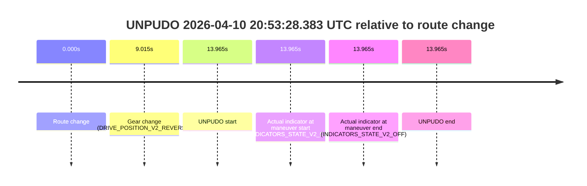
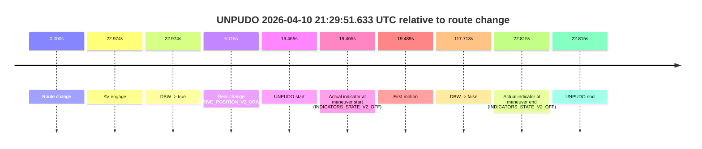
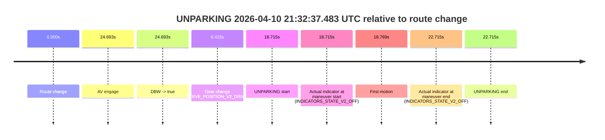

# Run Report: fme20036/2026-04-10--20-38-41--gen2-av-2b26cb27-463e-4e2b-81a3-290bfab84813

| Field | Value |
|---|---|
| Run ID | `fme20036/2026-04-10--20-38-41--gen2-av-2b26cb27-463e-4e2b-81a3-290bfab84813` |
| Date | `2026-04-10` |
| Model(s) | `lively-orange-horse` |
| Author | `guy.geva` |
| Event count | `13` |

## unpudo 2026-04-10 20:47:08.183 UTC

| Field | Value |
|---|---|
| Model | `lively-orange-horse` |
| Author | `guy.geva` |
| Run ID | `fme20036/2026-04-10--20-38-41--gen2-av-2b26cb27-463e-4e2b-81a3-290bfab84813` |
| Date | `2026-04-10` |
| Time (UTC) | `20:47:08.183` |
| Event type | `unpudo` |
| Disengagement type | `failed_to_unpudo` |
| Route change | `found` |
| Console | [run](https://console.sso.wayve.ai/run/fme20036/2026-04-10--20-38-41--gen2-av-2b26cb27-463e-4e2b-81a3-290bfab84813?id=&time-unixus=1775854028183312) |
| Foxglove | [segment](https://app.foxglove.dev/wayve-on-prem/p/prj_0dX18KZdVHg1fmmI/view?ds=foxglove-stream&ds.deviceName=fme20036&ds.start=2026-04-10T20%3A46%3A47.718248Z&ds.end=2026-04-10T20%3A49%3A22.641779Z&layoutId=lay_0e7VD4WIKDQGU73Y&time=2026-04-10T20%3A47%3A08.183312Z) |

### Event card: fail

- Fail: AV owns part of the segment, but the event still resolves as a model-performance failure under the AV-only scoring rule.

| Event | Time (UTC) | Delta from route change |
|---|---:|---:|
| Route change | 2026-04-10 20:46:57.718 | `0.000s` |
| AV engage | 2026-04-10 20:47:12.660 | `14.943s` |
| DBW -> true | 2026-04-10 20:47:12.660 | `14.943s` |
| Gear change (DRIVE_POSITION_V2_DRIVE) | 2026-04-10 20:46:58.083 | `0.365s` |
| UNPUDO start | 2026-04-10 20:47:08.183 | `10.465s` |
| Actual indicator at maneuver start (INDICATORS_STATE_V2_RIGHT_ON) | 2026-04-10 20:47:08.183 | `10.465s` |
| First motion | 2026-04-10 20:47:08.196 | `10.478s` |
| DBW -> false | 2026-04-10 20:49:12.641 | `134.924s` |
| Actual indicator at maneuver end (INDICATORS_STATE_V2_OFF) | 2026-04-10 20:47:11.433 | `13.715s` |
| UNPUDO end | 2026-04-10 20:47:11.433 | `13.715s` |

| Metric | Value |
|---|---|
| Outcome | `fail` |
| Effective failure type | `failed_to_unpudo` |
| Route change status | `found` |
| DBW at event start | `false` |
| DBW at event end | `false` |
| Predicted gear at AV start | `DRIVE_POSITION_V2_DRIVE` |
| Actual gear at AV start | `DRIVE_POSITION_V2_DRIVE` |
| Predicted gear at event start | `DRIVE_POSITION_V2_DRIVE` |
| Actual gear at event start | `DRIVE_POSITION_V2_DRIVE` |
| Planned indicator direction | `INDICATORS_STATE_V2_LEFT_ON` |
| Controller indicator direction | `INDICATORS_STATE_V2_LEFT_ON` |
| Actual indicator direction | `INDICATORS_STATE_V2_RIGHT_ON` |
| Actual indicator at maneuver end | `INDICATORS_STATE_V2_OFF` |
| Driver accel help in AV | `false` |
| Driver accel help timestamp | `n/a` |
| Max accel pedal pct in AV | `0.0%` |
| Max brake pedal pct in AV | `0.0%` |
| Max speed mps in AV | `0.000` |
| Route -> AV | `14.943s` |
| AV -> event start | `-4.478s` |
| AV -> first motion | `-4.464s` |
| AV duration before disengagement | `119.981s` |
| Trajectory waypoint count | `37` |
| Driving-plan step count | `11` |

The scored portion starts from the AV-owned window, not from the pre-AV setup. Route-change search in the stopped pre-event segment was `found`, with the baseline therefore set to route change. At the event anchor the model predicts `DRIVE_POSITION_V2_DRIVE` and the actual gear is `DRIVE_POSITION_V2_DRIVE`. The effective model outcome is `fail` because `failed_to_unpudo`.

### Resolution

| Field | Value |
|---|---|
| Final outcome | `fail` |
| Do we agree with this label? | `yes` |
| Source disengagement type | `failed_to_unpudo` |
| Resolved effective failure type | `failed_to_unpudo` |
| Confidence | `high` |

## unpudo 2026-04-10 20:49:58.683 UTC

| Field | Value |
|---|---|
| Model | `lively-orange-horse` |
| Author | `guy.geva` |
| Run ID | `fme20036/2026-04-10--20-38-41--gen2-av-2b26cb27-463e-4e2b-81a3-290bfab84813` |
| Date | `2026-04-10` |
| Time (UTC) | `20:49:58.683` |
| Event type | `unpudo` |
| Disengagement type | `failed_to_unpudo` |
| Route change | `found` |
| Console | [run](https://console.sso.wayve.ai/run/fme20036/2026-04-10--20-38-41--gen2-av-2b26cb27-463e-4e2b-81a3-290bfab84813?id=&time-unixus=1775854198683308) |
| Foxglove | [segment](https://app.foxglove.dev/wayve-on-prem/p/prj_0dX18KZdVHg1fmmI/view?ds=foxglove-stream&ds.deviceName=fme20036&ds.start=2026-04-10T20%3A49%3A14.118256Z&ds.end=2026-04-10T20%3A52%3A59.561038Z&layoutId=lay_0e7VD4WIKDQGU73Y&time=2026-04-10T20%3A49%3A58.683308Z) |

### Event card: fail

- Fail: AV owns part of the segment, but the event still resolves as a model-performance failure under the AV-only scoring rule.

| Event | Time (UTC) | Delta from route change |
|---|---:|---:|
| Route change | 2026-04-10 20:49:24.118 | `0.000s` |
| AV engage | 2026-04-10 20:50:03.420 | `39.303s` |
| DBW -> true | 2026-04-10 20:50:03.420 | `39.303s` |
| Gear change (DRIVE_POSITION_V2_DRIVE) | 2026-04-10 20:49:45.183 | `21.065s` |
| UNPUDO start | 2026-04-10 20:49:58.683 | `34.565s` |
| Actual indicator at maneuver start (INDICATORS_STATE_V2_OFF) | 2026-04-10 20:49:58.683 | `34.565s` |
| First motion | 2026-04-10 20:49:58.717 | `34.599s` |
| DBW -> false | 2026-04-10 20:52:49.561 | `205.443s` |
| Actual indicator at maneuver end (INDICATORS_STATE_V2_OFF) | 2026-04-10 20:50:01.983 | `37.865s` |
| UNPUDO end | 2026-04-10 20:50:01.983 | `37.865s` |

| Metric | Value |
|---|---|
| Outcome | `fail` |
| Effective failure type | `failed_to_unpudo` |
| Route change status | `found` |
| DBW at event start | `false` |
| DBW at event end | `false` |
| Predicted gear at AV start | `DRIVE_POSITION_V2_DRIVE` |
| Actual gear at AV start | `DRIVE_POSITION_V2_DRIVE` |
| Predicted gear at event start | `DRIVE_POSITION_V2_DRIVE` |
| Actual gear at event start | `DRIVE_POSITION_V2_DRIVE` |
| Planned indicator direction | `INDICATORS_STATE_V2_RIGHT_ON` |
| Controller indicator direction | `INDICATORS_STATE_V2_RIGHT_ON` |
| Actual indicator direction | `INDICATORS_STATE_V2_OFF` |
| Actual indicator at maneuver end | `INDICATORS_STATE_V2_OFF` |
| Driver accel help in AV | `false` |
| Driver accel help timestamp | `n/a` |
| Max accel pedal pct in AV | `0.0%` |
| Max brake pedal pct in AV | `0.0%` |
| Max speed mps in AV | `0.000` |
| Route -> AV | `39.303s` |
| AV -> event start | `-4.738s` |
| AV -> first motion | `-4.703s` |
| AV duration before disengagement | `166.140s` |
| Trajectory waypoint count | `37` |
| Driving-plan step count | `11` |

The scored portion starts from the AV-owned window, not from the pre-AV setup. Route-change search in the stopped pre-event segment was `found`, with the baseline therefore set to route change. At the event anchor the model predicts `DRIVE_POSITION_V2_DRIVE` and the actual gear is `DRIVE_POSITION_V2_DRIVE`. The effective model outcome is `fail` because `failed_to_unpudo`.

### Resolution

| Field | Value |
|---|---|
| Final outcome | `fail` |
| Do we agree with this label? | `yes` |
| Source disengagement type | `failed_to_unpudo` |
| Resolved effective failure type | `failed_to_unpudo` |
| Confidence | `high` |

## unpudo 2026-04-10 20:53:28.383 UTC

| Field | Value |
|---|---|
| Model | `lively-orange-horse` |
| Author | `guy.geva` |
| Run ID | `fme20036/2026-04-10--20-38-41--gen2-av-2b26cb27-463e-4e2b-81a3-290bfab84813` |
| Date | `2026-04-10` |
| Time (UTC) | `20:53:28.383` |
| Event type | `unpudo` |
| Disengagement type | `none observed` |
| Route change | `found` |
| Console | [run](https://console.sso.wayve.ai/run/fme20036/2026-04-10--20-38-41--gen2-av-2b26cb27-463e-4e2b-81a3-290bfab84813?id=&time-unixus=1775854408383300) |
| Foxglove | [segment](https://app.foxglove.dev/wayve-on-prem/p/prj_0dX18KZdVHg1fmmI/view?ds=foxglove-stream&ds.deviceName=fme20036&ds.start=2026-04-10T20%3A53%3A04.418265Z&ds.end=2026-04-10T20%3A53%3A38.383300Z&layoutId=lay_0e7VD4WIKDQGU73Y&time=2026-04-10T20%3A53%3A28.383300Z) |

### Event card: fail

- Fail: the credited unpudo does not stay AV-owned. The event window starts with DBW false, and the maneuver outcome lands outside a clean AV-owned segment.

| Event | Time (UTC) | Delta from route change |
|---|---:|---:|
| Route change | 2026-04-10 20:53:14.418 | `0.000s` |
| Gear change (DRIVE_POSITION_V2_REVERSE) | 2026-04-10 20:53:23.433 | `9.015s` |
| UNPUDO start | 2026-04-10 20:53:28.383 | `13.965s` |
| Actual indicator at maneuver start (INDICATORS_STATE_V2_OFF) | 2026-04-10 20:53:28.383 | `13.965s` |
| Actual indicator at maneuver end (INDICATORS_STATE_V2_OFF) | 2026-04-10 20:53:28.383 | `13.965s` |
| UNPUDO end | 2026-04-10 20:53:28.383 | `13.965s` |

| Metric | Value |
|---|---|
| Outcome | `fail` |
| Effective failure type | `not_av_owned` |
| Route change status | `found` |
| DBW at event start | `false` |
| DBW at event end | `false` |
| Predicted gear at AV start | `n/a` |
| Actual gear at AV start | `n/a` |
| Predicted gear at event start | `DRIVE_POSITION_V2_DRIVE` |
| Actual gear at event start | `DRIVE_POSITION_V2_REVERSE` |
| Planned indicator direction | `INDICATORS_STATE_V2_OFF` |
| Controller indicator direction | `INDICATORS_STATE_V2_OFF` |
| Actual indicator direction | `INDICATORS_STATE_V2_OFF` |
| Actual indicator at maneuver end | `INDICATORS_STATE_V2_OFF` |
| Driver accel help in AV | `false` |
| Driver accel help timestamp | `n/a` |
| Max accel pedal pct in AV | `0.0%` |
| Max brake pedal pct in AV | `0.0%` |
| Max speed mps in AV | `0.000` |
| Route -> AV | `n/a` |
| AV -> event start | `n/a` |
| AV -> first motion | `n/a` |
| AV duration before disengagement | `n/a` |
| Trajectory waypoint count | `37` |
| Driving-plan step count | `11` |

The scored portion starts from the AV-owned window, not from the pre-AV setup. Route-change search in the stopped pre-event segment was `found`, with the baseline therefore set to route change. At the event anchor the model predicts `DRIVE_POSITION_V2_DRIVE` and the actual gear is `DRIVE_POSITION_V2_REVERSE`. The effective model outcome is `fail` because `not_av_owned`.

### Resolution

| Field | Value |
|---|---|
| Final outcome | `fail` |
| Do we agree with this label? | `yes` |
| Source disengagement type | `none observed` |
| Resolved effective failure type | `not_av_owned` |
| Confidence | `high` |

## unpudo 2026-04-10 20:53:46.433 UTC

| Field | Value |
|---|---|
| Model | `lively-orange-horse` |
| Author | `guy.geva` |
| Run ID | `fme20036/2026-04-10--20-38-41--gen2-av-2b26cb27-463e-4e2b-81a3-290bfab84813` |
| Date | `2026-04-10` |
| Time (UTC) | `20:53:46.433` |
| Event type | `unpudo` |
| Disengagement type | `failed_to_unpudo` |
| Route change | `found` |
| Console | [run](https://console.sso.wayve.ai/run/fme20036/2026-04-10--20-38-41--gen2-av-2b26cb27-463e-4e2b-81a3-290bfab84813?id=&time-unixus=1775854426433297) |
| Foxglove | [segment](https://app.foxglove.dev/wayve-on-prem/p/prj_0dX18KZdVHg1fmmI/view?ds=foxglove-stream&ds.deviceName=fme20036&ds.start=2026-04-10T20%3A53%3A04.418265Z&ds.end=2026-04-10T20%3A54%3A24.633306Z&layoutId=lay_0e7VD4WIKDQGU73Y&time=2026-04-10T20%3A53%3A46.433297Z) |

### Event card: fail

- Fail: AV owns part of the segment, but the event still resolves as a model-performance failure under the AV-only scoring rule.

| Event | Time (UTC) | Delta from route change |
|---|---:|---:|
| Route change | 2026-04-10 20:53:14.418 | `0.000s` |
| AV engage | 2026-04-10 20:53:52.121 | `37.703s` |
| DBW -> true | 2026-04-10 20:53:52.121 | `37.703s` |
| Gear change (DRIVE_POSITION_V2_DRIVE) | 2026-04-10 20:53:46.433 | `32.015s` |
| UNPUDO start | 2026-04-10 20:53:46.433 | `32.015s` |
| Actual indicator at maneuver start (INDICATORS_STATE_V2_OFF) | 2026-04-10 20:53:46.433 | `32.015s` |
| First motion | 2026-04-10 20:54:06.337 | `51.919s` |
| DBW -> false | 2026-04-10 20:54:05.460 | `51.042s` |
| Actual indicator at maneuver end (INDICATORS_STATE_V2_LEFT_ON) | 2026-04-10 20:54:14.633 | `60.215s` |
| UNPUDO end | 2026-04-10 20:54:14.633 | `60.215s` |

| Metric | Value |
|---|---|
| Outcome | `fail` |
| Effective failure type | `failed_to_unpudo` |
| Route change status | `found` |
| DBW at event start | `false` |
| DBW at event end | `true` |
| Predicted gear at AV start | `DRIVE_POSITION_V2_PARK` |
| Actual gear at AV start | `DRIVE_POSITION_V2_PARK` |
| Predicted gear at event start | `DRIVE_POSITION_V2_DRIVE` |
| Actual gear at event start | `DRIVE_POSITION_V2_DRIVE` |
| Planned indicator direction | `INDICATORS_STATE_V2_OFF` |
| Controller indicator direction | `INDICATORS_STATE_V2_OFF` |
| Actual indicator direction | `INDICATORS_STATE_V2_OFF` |
| Actual indicator at maneuver end | `INDICATORS_STATE_V2_LEFT_ON` |
| Driver accel help in AV | `false` |
| Driver accel help timestamp | `n/a` |
| Max accel pedal pct in AV | `0.0%` |
| Max brake pedal pct in AV | `8.0%` |
| Max speed mps in AV | `0.000` |
| Route -> AV | `37.703s` |
| AV -> event start | `-5.688s` |
| AV -> first motion | `14.216s` |
| AV duration before disengagement | `13.339s` |
| Trajectory waypoint count | `36` |
| Driving-plan step count | `11` |

The scored portion starts from the AV-owned window, not from the pre-AV setup. Route-change search in the stopped pre-event segment was `found`, with the baseline therefore set to route change. At the event anchor the model predicts `DRIVE_POSITION_V2_DRIVE` and the actual gear is `DRIVE_POSITION_V2_DRIVE`. The effective model outcome is `fail` because `failed_to_unpudo`.

### Resolution

| Field | Value |
|---|---|
| Final outcome | `fail` |
| Do we agree with this label? | `yes` |
| Source disengagement type | `failed_to_unpudo` |
| Resolved effective failure type | `failed_to_unpudo` |
| Confidence | `high` |

## unpudo 2026-04-10 21:11:37.233 UTC

| Field | Value |
|---|---|
| Model | `lively-orange-horse` |
| Author | `guy.geva` |
| Run ID | `fme20036/2026-04-10--20-38-41--gen2-av-2b26cb27-463e-4e2b-81a3-290bfab84813` |
| Date | `2026-04-10` |
| Time (UTC) | `21:11:37.233` |
| Event type | `unpudo` |
| Disengagement type | `failed_to_unpudo` |
| Route change | `found` |
| Console | [run](https://console.sso.wayve.ai/run/fme20036/2026-04-10--20-38-41--gen2-av-2b26cb27-463e-4e2b-81a3-290bfab84813?id=&time-unixus=1775855497233292) |
| Foxglove | [segment](https://app.foxglove.dev/wayve-on-prem/p/prj_0dX18KZdVHg1fmmI/view?ds=foxglove-stream&ds.deviceName=fme20036&ds.start=2026-04-10T21%3A11%3A07.068566Z&ds.end=2026-04-10T21%3A13%3A41.900928Z&layoutId=lay_0e7VD4WIKDQGU73Y&time=2026-04-10T21%3A11%3A37.233292Z) |

### Event card: fail

- Fail: AV owns part of the segment, but the event still resolves as a model-performance failure under the AV-only scoring rule.

| Event | Time (UTC) | Delta from route change |
|---|---:|---:|
| Route change | 2026-04-10 21:11:17.068 | `0.000s` |
| AV engage | 2026-04-10 21:11:41.180 | `24.112s` |
| DBW -> true | 2026-04-10 21:11:41.180 | `24.112s` |
| Gear change (DRIVE_POSITION_V2_DRIVE) | 2026-04-10 21:11:26.683 | `9.615s` |
| UNPUDO start | 2026-04-10 21:11:37.233 | `20.165s` |
| Actual indicator at maneuver start (INDICATORS_STATE_V2_OFF) | 2026-04-10 21:11:37.233 | `20.165s` |
| First motion | 2026-04-10 21:11:37.256 | `20.188s` |
| DBW -> false | 2026-04-10 21:13:31.900 | `134.832s` |
| Actual indicator at maneuver end (INDICATORS_STATE_V2_OFF) | 2026-04-10 21:11:40.883 | `23.815s` |
| UNPUDO end | 2026-04-10 21:11:40.883 | `23.815s` |

| Metric | Value |
|---|---|
| Outcome | `fail` |
| Effective failure type | `failed_to_unpudo` |
| Route change status | `found` |
| DBW at event start | `false` |
| DBW at event end | `false` |
| Predicted gear at AV start | `DRIVE_POSITION_V2_DRIVE` |
| Actual gear at AV start | `DRIVE_POSITION_V2_DRIVE` |
| Predicted gear at event start | `DRIVE_POSITION_V2_DRIVE` |
| Actual gear at event start | `DRIVE_POSITION_V2_DRIVE` |
| Planned indicator direction | `INDICATORS_STATE_V2_RIGHT_ON` |
| Controller indicator direction | `INDICATORS_STATE_V2_RIGHT_ON` |
| Actual indicator direction | `INDICATORS_STATE_V2_OFF` |
| Actual indicator at maneuver end | `INDICATORS_STATE_V2_OFF` |
| Driver accel help in AV | `false` |
| Driver accel help timestamp | `n/a` |
| Max accel pedal pct in AV | `0.0%` |
| Max brake pedal pct in AV | `0.0%` |
| Max speed mps in AV | `0.000` |
| Route -> AV | `24.112s` |
| AV -> event start | `-3.948s` |
| AV -> first motion | `-3.924s` |
| AV duration before disengagement | `110.720s` |
| Trajectory waypoint count | `36` |
| Driving-plan step count | `11` |

The scored portion starts from the AV-owned window, not from the pre-AV setup. Route-change search in the stopped pre-event segment was `found`, with the baseline therefore set to route change. At the event anchor the model predicts `DRIVE_POSITION_V2_DRIVE` and the actual gear is `DRIVE_POSITION_V2_DRIVE`. The effective model outcome is `fail` because `failed_to_unpudo`.

### Resolution

| Field | Value |
|---|---|
| Final outcome | `fail` |
| Do we agree with this label? | `yes` |
| Source disengagement type | `failed_to_unpudo` |
| Resolved effective failure type | `failed_to_unpudo` |
| Confidence | `high` |

## unpudo 2026-04-10 21:13:52.783 UTC

| Field | Value |
|---|---|
| Model | `lively-orange-horse` |
| Author | `guy.geva` |
| Run ID | `fme20036/2026-04-10--20-38-41--gen2-av-2b26cb27-463e-4e2b-81a3-290bfab84813` |
| Date | `2026-04-10` |
| Time (UTC) | `21:13:52.783` |
| Event type | `unpudo` |
| Disengagement type | `none observed` |
| Route change | `found` |
| Console | [run](https://console.sso.wayve.ai/run/fme20036/2026-04-10--20-38-41--gen2-av-2b26cb27-463e-4e2b-81a3-290bfab84813?id=&time-unixus=1775855632783314) |
| Foxglove | [segment](https://app.foxglove.dev/wayve-on-prem/p/prj_0dX18KZdVHg1fmmI/view?ds=foxglove-stream&ds.deviceName=fme20036&ds.start=2026-04-10T21%3A12%3A22.768356Z&ds.end=2026-04-10T21%3A16%3A15.241280Z&layoutId=lay_0e7VD4WIKDQGU73Y&time=2026-04-10T21%3A13%3A52.783314Z) |

### Event card: fail

- Fail: the credited unpudo does not stay AV-owned. The event window starts with DBW false, and the maneuver outcome lands outside a clean AV-owned segment.

| Event | Time (UTC) | Delta from route change |
|---|---:|---:|
| Route change | 2026-04-10 21:12:32.768 | `0.000s` |
| AV engage | 2026-04-10 21:14:25.921 | `113.154s` |
| DBW -> true | 2026-04-10 21:14:25.921 | `113.154s` |
| Gear change (DRIVE_POSITION_V2_REVERSE) | 2026-04-10 21:13:49.083 | `76.315s` |
| UNPUDO start | 2026-04-10 21:13:52.783 | `80.015s` |
| Actual indicator at maneuver start (INDICATORS_STATE_V2_OFF) | 2026-04-10 21:13:52.783 | `80.015s` |
| First motion | 2026-04-10 21:14:03.837 | `91.069s` |
| DBW -> false | 2026-04-10 21:16:05.241 | `212.473s` |
| Actual indicator at maneuver end (INDICATORS_STATE_V2_OFF) | 2026-04-10 21:14:22.083 | `109.315s` |
| UNPUDO end | 2026-04-10 21:14:22.083 | `109.315s` |

| Metric | Value |
|---|---|
| Outcome | `fail` |
| Effective failure type | `completed_outside_av` |
| Route change status | `found` |
| DBW at event start | `false` |
| DBW at event end | `false` |
| Predicted gear at AV start | `DRIVE_POSITION_V2_DRIVE` |
| Actual gear at AV start | `DRIVE_POSITION_V2_DRIVE` |
| Predicted gear at event start | `DRIVE_POSITION_V2_DRIVE` |
| Actual gear at event start | `DRIVE_POSITION_V2_REVERSE` |
| Planned indicator direction | `INDICATORS_STATE_V2_OFF` |
| Controller indicator direction | `INDICATORS_STATE_V2_OFF` |
| Actual indicator direction | `INDICATORS_STATE_V2_OFF` |
| Actual indicator at maneuver end | `INDICATORS_STATE_V2_OFF` |
| Driver accel help in AV | `false` |
| Driver accel help timestamp | `n/a` |
| Max accel pedal pct in AV | `0.0%` |
| Max brake pedal pct in AV | `0.0%` |
| Max speed mps in AV | `0.000` |
| Route -> AV | `113.154s` |
| AV -> event start | `-33.139s` |
| AV -> first motion | `-22.085s` |
| AV duration before disengagement | `99.319s` |
| Trajectory waypoint count | `37` |
| Driving-plan step count | `11` |

The scored portion starts from the AV-owned window, not from the pre-AV setup. Route-change search in the stopped pre-event segment was `found`, with the baseline therefore set to route change. At the event anchor the model predicts `DRIVE_POSITION_V2_DRIVE` and the actual gear is `DRIVE_POSITION_V2_REVERSE`. The effective model outcome is `fail` because `completed_outside_av`.

### Resolution

| Field | Value |
|---|---|
| Final outcome | `fail` |
| Do we agree with this label? | `yes` |
| Source disengagement type | `none observed` |
| Resolved effective failure type | `completed_outside_av` |
| Confidence | `high` |

## unpudo 2026-04-10 21:18:40.283 UTC

| Field | Value |
|---|---|
| Model | `lively-orange-horse` |
| Author | `guy.geva` |
| Run ID | `fme20036/2026-04-10--20-38-41--gen2-av-2b26cb27-463e-4e2b-81a3-290bfab84813` |
| Date | `2026-04-10` |
| Time (UTC) | `21:18:40.283` |
| Event type | `unpudo` |
| Disengagement type | `failed_to_unpudo` |
| Route change | `found` |
| Console | [run](https://console.sso.wayve.ai/run/fme20036/2026-04-10--20-38-41--gen2-av-2b26cb27-463e-4e2b-81a3-290bfab84813?id=&time-unixus=1775855920283313) |
| Foxglove | [segment](https://app.foxglove.dev/wayve-on-prem/p/prj_0dX18KZdVHg1fmmI/view?ds=foxglove-stream&ds.deviceName=fme20036&ds.start=2026-04-10T21%3A18%3A15.268249Z&ds.end=2026-04-10T21%3A19%3A36.582142Z&layoutId=lay_0e7VD4WIKDQGU73Y&time=2026-04-10T21%3A18%3A40.283313Z) |

### Event card: fail

- Fail: AV owns part of the segment, but the event still resolves as a model-performance failure under the AV-only scoring rule.

| Event | Time (UTC) | Delta from route change |
|---|---:|---:|
| Route change | 2026-04-10 21:18:25.268 | `0.000s` |
| AV engage | 2026-04-10 21:18:46.400 | `21.133s` |
| DBW -> true | 2026-04-10 21:18:46.400 | `21.133s` |
| Gear change (DRIVE_POSITION_V2_DRIVE) | 2026-04-10 21:18:25.683 | `0.415s` |
| UNPUDO start | 2026-04-10 21:18:40.283 | `15.015s` |
| Actual indicator at maneuver start (INDICATORS_STATE_V2_OFF) | 2026-04-10 21:18:40.283 | `15.015s` |
| First motion | 2026-04-10 21:18:40.317 | `15.049s` |
| DBW -> false | 2026-04-10 21:19:26.582 | `61.314s` |
| Actual indicator at maneuver end (INDICATORS_STATE_V2_OFF) | 2026-04-10 21:18:44.133 | `18.865s` |
| UNPUDO end | 2026-04-10 21:18:44.133 | `18.865s` |

| Metric | Value |
|---|---|
| Outcome | `fail` |
| Effective failure type | `failed_to_unpudo` |
| Route change status | `found` |
| DBW at event start | `false` |
| DBW at event end | `false` |
| Predicted gear at AV start | `DRIVE_POSITION_V2_DRIVE` |
| Actual gear at AV start | `DRIVE_POSITION_V2_DRIVE` |
| Predicted gear at event start | `DRIVE_POSITION_V2_DRIVE` |
| Actual gear at event start | `DRIVE_POSITION_V2_DRIVE` |
| Planned indicator direction | `INDICATORS_STATE_V2_RIGHT_ON` |
| Controller indicator direction | `INDICATORS_STATE_V2_RIGHT_ON` |
| Actual indicator direction | `INDICATORS_STATE_V2_OFF` |
| Actual indicator at maneuver end | `INDICATORS_STATE_V2_OFF` |
| Driver accel help in AV | `false` |
| Driver accel help timestamp | `n/a` |
| Max accel pedal pct in AV | `0.0%` |
| Max brake pedal pct in AV | `0.0%` |
| Max speed mps in AV | `0.000` |
| Route -> AV | `21.133s` |
| AV -> event start | `-6.118s` |
| AV -> first motion | `-6.083s` |
| AV duration before disengagement | `40.181s` |
| Trajectory waypoint count | `37` |
| Driving-plan step count | `11` |

The scored portion starts from the AV-owned window, not from the pre-AV setup. Route-change search in the stopped pre-event segment was `found`, with the baseline therefore set to route change. At the event anchor the model predicts `DRIVE_POSITION_V2_DRIVE` and the actual gear is `DRIVE_POSITION_V2_DRIVE`. The effective model outcome is `fail` because `failed_to_unpudo`.

### Resolution

| Field | Value |
|---|---|
| Final outcome | `fail` |
| Do we agree with this label? | `yes` |
| Source disengagement type | `failed_to_unpudo` |
| Resolved effective failure type | `failed_to_unpudo` |
| Confidence | `high` |

## unpudo 2026-04-10 21:20:06.283 UTC

| Field | Value |
|---|---|
| Model | `lively-orange-horse` |
| Author | `guy.geva` |
| Run ID | `fme20036/2026-04-10--20-38-41--gen2-av-2b26cb27-463e-4e2b-81a3-290bfab84813` |
| Date | `2026-04-10` |
| Time (UTC) | `21:20:06.283` |
| Event type | `unpudo` |
| Disengagement type | `failed_to_unpudo` |
| Route change | `found` |
| Console | [run](https://console.sso.wayve.ai/run/fme20036/2026-04-10--20-38-41--gen2-av-2b26cb27-463e-4e2b-81a3-290bfab84813?id=&time-unixus=1775856006283296) |
| Foxglove | [segment](https://app.foxglove.dev/wayve-on-prem/p/prj_0dX18KZdVHg1fmmI/view?ds=foxglove-stream&ds.deviceName=fme20036&ds.start=2026-04-10T21%3A18%3A15.268249Z&ds.end=2026-04-10T21%3A22%3A31.922001Z&layoutId=lay_0e7VD4WIKDQGU73Y&time=2026-04-10T21%3A20%3A06.283296Z) |

### Event card: fail

- Fail: AV owns part of the segment, but the event still resolves as a model-performance failure under the AV-only scoring rule.

| Event | Time (UTC) | Delta from route change |
|---|---:|---:|
| Route change | 2026-04-10 21:18:25.268 | `0.000s` |
| AV engage | 2026-04-10 21:20:12.640 | `107.373s` |
| DBW -> true | 2026-04-10 21:20:12.640 | `107.373s` |
| Gear change (DRIVE_POSITION_V2_DRIVE) | 2026-04-10 21:19:53.683 | `88.415s` |
| UNPUDO start | 2026-04-10 21:20:06.283 | `101.015s` |
| Actual indicator at maneuver start (INDICATORS_STATE_V2_OFF) | 2026-04-10 21:20:06.283 | `101.015s` |
| First motion | 2026-04-10 21:20:06.336 | `101.069s` |
| DBW -> false | 2026-04-10 21:22:21.922 | `236.654s` |
| Actual indicator at maneuver end (INDICATORS_STATE_V2_OFF) | 2026-04-10 21:20:09.933 | `104.665s` |
| UNPUDO end | 2026-04-10 21:20:09.933 | `104.665s` |

| Metric | Value |
|---|---|
| Outcome | `fail` |
| Effective failure type | `failed_to_unpudo` |
| Route change status | `found` |
| DBW at event start | `false` |
| DBW at event end | `false` |
| Predicted gear at AV start | `DRIVE_POSITION_V2_DRIVE` |
| Actual gear at AV start | `DRIVE_POSITION_V2_DRIVE` |
| Predicted gear at event start | `DRIVE_POSITION_V2_DRIVE` |
| Actual gear at event start | `DRIVE_POSITION_V2_DRIVE` |
| Planned indicator direction | `INDICATORS_STATE_V2_RIGHT_ON` |
| Controller indicator direction | `INDICATORS_STATE_V2_RIGHT_ON` |
| Actual indicator direction | `INDICATORS_STATE_V2_OFF` |
| Actual indicator at maneuver end | `INDICATORS_STATE_V2_OFF` |
| Driver accel help in AV | `false` |
| Driver accel help timestamp | `n/a` |
| Max accel pedal pct in AV | `0.0%` |
| Max brake pedal pct in AV | `0.0%` |
| Max speed mps in AV | `0.000` |
| Route -> AV | `107.373s` |
| AV -> event start | `-6.358s` |
| AV -> first motion | `-6.304s` |
| AV duration before disengagement | `129.281s` |
| Trajectory waypoint count | `37` |
| Driving-plan step count | `11` |

The scored portion starts from the AV-owned window, not from the pre-AV setup. Route-change search in the stopped pre-event segment was `found`, with the baseline therefore set to route change. At the event anchor the model predicts `DRIVE_POSITION_V2_DRIVE` and the actual gear is `DRIVE_POSITION_V2_DRIVE`. The effective model outcome is `fail` because `failed_to_unpudo`.

### Resolution

| Field | Value |
|---|---|
| Final outcome | `fail` |
| Do we agree with this label? | `yes` |
| Source disengagement type | `failed_to_unpudo` |
| Resolved effective failure type | `failed_to_unpudo` |
| Confidence | `high` |

## unpudo 2026-04-10 21:22:52.683 UTC

| Field | Value |
|---|---|
| Model | `lively-orange-horse` |
| Author | `guy.geva` |
| Run ID | `fme20036/2026-04-10--20-38-41--gen2-av-2b26cb27-463e-4e2b-81a3-290bfab84813` |
| Date | `2026-04-10` |
| Time (UTC) | `21:22:52.683` |
| Event type | `unpudo` |
| Disengagement type | `failed_to_unpudo` |
| Route change | `found` |
| Console | [run](https://console.sso.wayve.ai/run/fme20036/2026-04-10--20-38-41--gen2-av-2b26cb27-463e-4e2b-81a3-290bfab84813?id=&time-unixus=1775856172683320) |
| Foxglove | [segment](https://app.foxglove.dev/wayve-on-prem/p/prj_0dX18KZdVHg1fmmI/view?ds=foxglove-stream&ds.deviceName=fme20036&ds.start=2026-04-10T21%3A22%3A26.918562Z&ds.end=2026-04-10T21%3A23%3A46.700262Z&layoutId=lay_0e7VD4WIKDQGU73Y&time=2026-04-10T21%3A22%3A52.683320Z) |

### Event card: fail

- Fail: AV owns part of the segment, but the event still resolves as a model-performance failure under the AV-only scoring rule.

| Event | Time (UTC) | Delta from route change |
|---|---:|---:|
| Route change | 2026-04-10 21:22:36.918 | `0.000s` |
| AV engage | 2026-04-10 21:22:56.042 | `19.124s` |
| DBW -> true | 2026-04-10 21:22:56.042 | `19.124s` |
| Gear change (DRIVE_POSITION_V2_DRIVE) | 2026-04-10 21:22:40.383 | `3.465s` |
| UNPUDO start | 2026-04-10 21:22:52.683 | `15.765s` |
| Actual indicator at maneuver start (INDICATORS_STATE_V2_RIGHT_ON) | 2026-04-10 21:22:52.683 | `15.765s` |
| First motion | 2026-04-10 21:22:52.736 | `15.818s` |
| DBW -> false | 2026-04-10 21:23:36.700 | `59.782s` |
| Actual indicator at maneuver end (INDICATORS_STATE_V2_OFF) | 2026-04-10 21:22:56.233 | `19.315s` |
| UNPUDO end | 2026-04-10 21:22:56.233 | `19.315s` |

| Metric | Value |
|---|---|
| Outcome | `fail` |
| Effective failure type | `failed_to_unpudo` |
| Route change status | `found` |
| DBW at event start | `false` |
| DBW at event end | `true` |
| Predicted gear at AV start | `DRIVE_POSITION_V2_DRIVE` |
| Actual gear at AV start | `DRIVE_POSITION_V2_DRIVE` |
| Predicted gear at event start | `DRIVE_POSITION_V2_DRIVE` |
| Actual gear at event start | `DRIVE_POSITION_V2_DRIVE` |
| Planned indicator direction | `INDICATORS_STATE_V2_RIGHT_ON` |
| Controller indicator direction | `INDICATORS_STATE_V2_RIGHT_ON` |
| Actual indicator direction | `INDICATORS_STATE_V2_RIGHT_ON` |
| Actual indicator at maneuver end | `INDICATORS_STATE_V2_OFF` |
| Driver accel help in AV | `false` |
| Driver accel help timestamp | `n/a` |
| Max accel pedal pct in AV | `0.0%` |
| Max brake pedal pct in AV | `0.0%` |
| Max speed mps in AV | `4.644` |
| Route -> AV | `19.124s` |
| AV -> event start | `-3.359s` |
| AV -> first motion | `-3.306s` |
| AV duration before disengagement | `40.658s` |
| Trajectory waypoint count | `37` |
| Driving-plan step count | `11` |

The scored portion starts from the AV-owned window, not from the pre-AV setup. Route-change search in the stopped pre-event segment was `found`, with the baseline therefore set to route change. At the event anchor the model predicts `DRIVE_POSITION_V2_DRIVE` and the actual gear is `DRIVE_POSITION_V2_DRIVE`. The effective model outcome is `fail` because `failed_to_unpudo`.

### Resolution

| Field | Value |
|---|---|
| Final outcome | `fail` |
| Do we agree with this label? | `yes` |
| Source disengagement type | `failed_to_unpudo` |
| Resolved effective failure type | `failed_to_unpudo` |
| Confidence | `high` |

## unpudo 2026-04-10 21:23:37.583 UTC

| Field | Value |
|---|---|
| Model | `lively-orange-horse` |
| Author | `guy.geva` |
| Run ID | `fme20036/2026-04-10--20-38-41--gen2-av-2b26cb27-463e-4e2b-81a3-290bfab84813` |
| Date | `2026-04-10` |
| Time (UTC) | `21:23:37.583` |
| Event type | `unpudo` |
| Disengagement type | `failed_to_unpudo` |
| Route change | `found` |
| Console | [run](https://console.sso.wayve.ai/run/fme20036/2026-04-10--20-38-41--gen2-av-2b26cb27-463e-4e2b-81a3-290bfab84813?id=&time-unixus=1775856217583314) |
| Foxglove | [segment](https://app.foxglove.dev/wayve-on-prem/p/prj_0dX18KZdVHg1fmmI/view?ds=foxglove-stream&ds.deviceName=fme20036&ds.start=2026-04-10T21%3A22%3A26.918562Z&ds.end=2026-04-10T21%3A26%3A14.041372Z&layoutId=lay_0e7VD4WIKDQGU73Y&time=2026-04-10T21%3A23%3A37.583314Z) |

### Event card: fail

- Fail: AV owns part of the segment, but the event still resolves as a model-performance failure under the AV-only scoring rule.

| Event | Time (UTC) | Delta from route change |
|---|---:|---:|
| Route change | 2026-04-10 21:22:36.918 | `0.000s` |
| AV engage | 2026-04-10 21:23:44.140 | `67.222s` |
| DBW -> true | 2026-04-10 21:23:44.140 | `67.222s` |
| Gear change (DRIVE_POSITION_V2_DRIVE) | 2026-04-10 21:23:21.983 | `45.065s` |
| UNPUDO start | 2026-04-10 21:23:37.583 | `60.665s` |
| Actual indicator at maneuver start (INDICATORS_STATE_V2_RIGHT_ON) | 2026-04-10 21:23:37.583 | `60.665s` |
| First motion | 2026-04-10 21:23:37.616 | `60.698s` |
| DBW -> false | 2026-04-10 21:26:04.041 | `207.123s` |
| Actual indicator at maneuver end (INDICATORS_STATE_V2_OFF) | 2026-04-10 21:23:42.183 | `65.265s` |
| UNPUDO end | 2026-04-10 21:23:42.183 | `65.265s` |

| Metric | Value |
|---|---|
| Outcome | `fail` |
| Effective failure type | `failed_to_unpudo` |
| Route change status | `found` |
| DBW at event start | `false` |
| DBW at event end | `false` |
| Predicted gear at AV start | `DRIVE_POSITION_V2_DRIVE` |
| Actual gear at AV start | `DRIVE_POSITION_V2_DRIVE` |
| Predicted gear at event start | `DRIVE_POSITION_V2_DRIVE` |
| Actual gear at event start | `DRIVE_POSITION_V2_DRIVE` |
| Planned indicator direction | `INDICATORS_STATE_V2_RIGHT_ON` |
| Controller indicator direction | `INDICATORS_STATE_V2_RIGHT_ON` |
| Actual indicator direction | `INDICATORS_STATE_V2_RIGHT_ON` |
| Actual indicator at maneuver end | `INDICATORS_STATE_V2_OFF` |
| Driver accel help in AV | `false` |
| Driver accel help timestamp | `n/a` |
| Max accel pedal pct in AV | `0.0%` |
| Max brake pedal pct in AV | `0.0%` |
| Max speed mps in AV | `0.000` |
| Route -> AV | `67.222s` |
| AV -> event start | `-6.558s` |
| AV -> first motion | `-6.524s` |
| AV duration before disengagement | `139.900s` |
| Trajectory waypoint count | `37` |
| Driving-plan step count | `11` |

The scored portion starts from the AV-owned window, not from the pre-AV setup. Route-change search in the stopped pre-event segment was `found`, with the baseline therefore set to route change. At the event anchor the model predicts `DRIVE_POSITION_V2_DRIVE` and the actual gear is `DRIVE_POSITION_V2_DRIVE`. The effective model outcome is `fail` because `failed_to_unpudo`.

### Resolution

| Field | Value |
|---|---|
| Final outcome | `fail` |
| Do we agree with this label? | `yes` |
| Source disengagement type | `failed_to_unpudo` |
| Resolved effective failure type | `failed_to_unpudo` |
| Confidence | `high` |

## unpudo 2026-04-10 21:26:04.583 UTC

| Field | Value |
|---|---|
| Model | `lively-orange-horse` |
| Author | `guy.geva` |
| Run ID | `fme20036/2026-04-10--20-38-41--gen2-av-2b26cb27-463e-4e2b-81a3-290bfab84813` |
| Date | `2026-04-10` |
| Time (UTC) | `21:26:04.583` |
| Event type | `unpudo` |
| Disengagement type | `failed_to_unpudo` |
| Route change | `found` |
| Console | [run](https://console.sso.wayve.ai/run/fme20036/2026-04-10--20-38-41--gen2-av-2b26cb27-463e-4e2b-81a3-290bfab84813?id=&time-unixus=1775856364583303) |
| Foxglove | [segment](https://app.foxglove.dev/wayve-on-prem/p/prj_0dX18KZdVHg1fmmI/view?ds=foxglove-stream&ds.deviceName=fme20036&ds.start=2026-04-10T21%3A25%3A44.883314Z&ds.end=2026-04-10T21%3A29%3A17.481198Z&layoutId=lay_0e7VD4WIKDQGU73Y&time=2026-04-10T21%3A26%3A04.583303Z) |

### Event card: fail

- Fail: AV owns part of the segment, but the event still resolves as a model-performance failure under the AV-only scoring rule.

| Event | Time (UTC) | Delta from route change |
|---|---:|---:|
| Route change | 2026-04-10 21:25:57.518 | `0.000s` |
| AV engage | 2026-04-10 21:26:09.542 | `12.024s` |
| DBW -> true | 2026-04-10 21:26:09.542 | `12.024s` |
| Gear change (DRIVE_POSITION_V2_DRIVE) | 2026-04-10 21:25:54.883 | `-2.635s` |
| UNPUDO start | 2026-04-10 21:26:04.583 | `7.065s` |
| Actual indicator at maneuver start (INDICATORS_STATE_V2_OFF) | 2026-04-10 21:26:04.583 | `7.065s` |
| First motion | 2026-04-10 21:26:04.616 | `7.098s` |
| DBW -> false | 2026-04-10 21:29:07.481 | `189.963s` |
| Actual indicator at maneuver end (INDICATORS_STATE_V2_OFF) | 2026-04-10 21:26:07.883 | `10.365s` |
| UNPUDO end | 2026-04-10 21:26:07.883 | `10.365s` |

| Metric | Value |
|---|---|
| Outcome | `fail` |
| Effective failure type | `failed_to_unpudo` |
| Route change status | `found` |
| DBW at event start | `false` |
| DBW at event end | `false` |
| Predicted gear at AV start | `DRIVE_POSITION_V2_DRIVE` |
| Actual gear at AV start | `DRIVE_POSITION_V2_DRIVE` |
| Predicted gear at event start | `DRIVE_POSITION_V2_DRIVE` |
| Actual gear at event start | `DRIVE_POSITION_V2_DRIVE` |
| Planned indicator direction | `INDICATORS_STATE_V2_RIGHT_ON` |
| Controller indicator direction | `INDICATORS_STATE_V2_RIGHT_ON` |
| Actual indicator direction | `INDICATORS_STATE_V2_OFF` |
| Actual indicator at maneuver end | `INDICATORS_STATE_V2_OFF` |
| Driver accel help in AV | `false` |
| Driver accel help timestamp | `n/a` |
| Max accel pedal pct in AV | `0.0%` |
| Max brake pedal pct in AV | `0.0%` |
| Max speed mps in AV | `0.000` |
| Route -> AV | `12.024s` |
| AV -> event start | `-4.959s` |
| AV -> first motion | `-4.925s` |
| AV duration before disengagement | `177.939s` |
| Trajectory waypoint count | `37` |
| Driving-plan step count | `11` |

The scored portion starts from the AV-owned window, not from the pre-AV setup. Route-change search in the stopped pre-event segment was `found`, with the baseline therefore set to route change. At the event anchor the model predicts `DRIVE_POSITION_V2_DRIVE` and the actual gear is `DRIVE_POSITION_V2_DRIVE`. The effective model outcome is `fail` because `failed_to_unpudo`.

### Resolution

| Field | Value |
|---|---|
| Final outcome | `fail` |
| Do we agree with this label? | `yes` |
| Source disengagement type | `failed_to_unpudo` |
| Resolved effective failure type | `failed_to_unpudo` |
| Confidence | `high` |

## unpudo 2026-04-10 21:29:51.633 UTC

| Field | Value |
|---|---|
| Model | `lively-orange-horse` |
| Author | `guy.geva` |
| Run ID | `fme20036/2026-04-10--20-38-41--gen2-av-2b26cb27-463e-4e2b-81a3-290bfab84813` |
| Date | `2026-04-10` |
| Time (UTC) | `21:29:51.633` |
| Event type | `unpudo` |
| Disengagement type | `failed_to_unpudo` |
| Route change | `found` |
| Console | [run](https://console.sso.wayve.ai/run/fme20036/2026-04-10--20-38-41--gen2-av-2b26cb27-463e-4e2b-81a3-290bfab84813?id=&time-unixus=1775856591633296) |
| Foxglove | [segment](https://app.foxglove.dev/wayve-on-prem/p/prj_0dX18KZdVHg1fmmI/view?ds=foxglove-stream&ds.deviceName=fme20036&ds.start=2026-04-10T21%3A29%3A22.168217Z&ds.end=2026-04-10T21%3A31%3A39.880912Z&layoutId=lay_0e7VD4WIKDQGU73Y&time=2026-04-10T21%3A29%3A51.633296Z) |

### Event card: fail

- Fail: AV owns part of the segment, but the event still resolves as a model-performance failure under the AV-only scoring rule.

| Event | Time (UTC) | Delta from route change |
|---|---:|---:|
| Route change | 2026-04-10 21:29:32.168 | `0.000s` |
| AV engage | 2026-04-10 21:29:55.142 | `22.974s` |
| DBW -> true | 2026-04-10 21:29:55.142 | `22.974s` |
| Gear change (DRIVE_POSITION_V2_DRIVE) | 2026-04-10 21:29:38.283 | `6.115s` |
| UNPUDO start | 2026-04-10 21:29:51.633 | `19.465s` |
| Actual indicator at maneuver start (INDICATORS_STATE_V2_OFF) | 2026-04-10 21:29:51.633 | `19.465s` |
| First motion | 2026-04-10 21:29:51.656 | `19.489s` |
| DBW -> false | 2026-04-10 21:31:29.880 | `117.713s` |
| Actual indicator at maneuver end (INDICATORS_STATE_V2_OFF) | 2026-04-10 21:29:54.983 | `22.815s` |
| UNPUDO end | 2026-04-10 21:29:54.983 | `22.815s` |

| Metric | Value |
|---|---|
| Outcome | `fail` |
| Effective failure type | `failed_to_unpudo` |
| Route change status | `found` |
| DBW at event start | `false` |
| DBW at event end | `false` |
| Predicted gear at AV start | `DRIVE_POSITION_V2_DRIVE` |
| Actual gear at AV start | `DRIVE_POSITION_V2_DRIVE` |
| Predicted gear at event start | `DRIVE_POSITION_V2_DRIVE` |
| Actual gear at event start | `DRIVE_POSITION_V2_DRIVE` |
| Planned indicator direction | `INDICATORS_STATE_V2_RIGHT_ON` |
| Controller indicator direction | `INDICATORS_STATE_V2_RIGHT_ON` |
| Actual indicator direction | `INDICATORS_STATE_V2_OFF` |
| Actual indicator at maneuver end | `INDICATORS_STATE_V2_OFF` |
| Driver accel help in AV | `false` |
| Driver accel help timestamp | `n/a` |
| Max accel pedal pct in AV | `0.0%` |
| Max brake pedal pct in AV | `0.0%` |
| Max speed mps in AV | `0.000` |
| Route -> AV | `22.974s` |
| AV -> event start | `-3.509s` |
| AV -> first motion | `-3.485s` |
| AV duration before disengagement | `94.739s` |
| Trajectory waypoint count | `38` |
| Driving-plan step count | `11` |

The scored portion starts from the AV-owned window, not from the pre-AV setup. Route-change search in the stopped pre-event segment was `found`, with the baseline therefore set to route change. At the event anchor the model predicts `DRIVE_POSITION_V2_DRIVE` and the actual gear is `DRIVE_POSITION_V2_DRIVE`. The effective model outcome is `fail` because `failed_to_unpudo`.

### Resolution

| Field | Value |
|---|---|
| Final outcome | `fail` |
| Do we agree with this label? | `yes` |
| Source disengagement type | `failed_to_unpudo` |
| Resolved effective failure type | `failed_to_unpudo` |
| Confidence | `high` |

## unparking 2026-04-10 21:32:37.483 UTC

| Field | Value |
|---|---|
| Model | `lively-orange-horse` |
| Author | `guy.geva` |
| Run ID | `fme20036/2026-04-10--20-38-41--gen2-av-2b26cb27-463e-4e2b-81a3-290bfab84813` |
| Date | `2026-04-10` |
| Time (UTC) | `21:32:37.483` |
| Event type | `unparking` |
| Disengagement type | `failed_to_unpudo` |
| Route change | `found` |
| Console | [run](https://console.sso.wayve.ai/run/fme20036/2026-04-10--20-38-41--gen2-av-2b26cb27-463e-4e2b-81a3-290bfab84813?id=&time-unixus=1775856757483312) |
| Foxglove | [segment](https://app.foxglove.dev/wayve-on-prem/p/prj_0dX18KZdVHg1fmmI/view?ds=foxglove-stream&ds.deviceName=fme20036&ds.start=2026-04-10T21%3A32%3A08.768274Z&ds.end=2026-04-10T21%3A32%3A51.483294Z&layoutId=lay_0e7VD4WIKDQGU73Y&time=2026-04-10T21%3A32%3A37.483312Z) |

### Event card: fail

- Fail: AV owns part of the segment, but the event still resolves as a model-performance failure under the AV-only scoring rule.

| Event | Time (UTC) | Delta from route change |
|---|---:|---:|
| Route change | 2026-04-10 21:32:18.768 | `0.000s` |
| AV engage | 2026-04-10 21:32:43.461 | `24.693s` |
| DBW -> true | 2026-04-10 21:32:43.461 | `24.693s` |
| Gear change (DRIVE_POSITION_V2_DRIVE) | 2026-04-10 21:32:25.183 | `6.415s` |
| UNPARKING start | 2026-04-10 21:32:37.483 | `18.715s` |
| Actual indicator at maneuver start (INDICATORS_STATE_V2_OFF) | 2026-04-10 21:32:37.483 | `18.715s` |
| First motion | 2026-04-10 21:32:37.537 | `18.769s` |
| Actual indicator at maneuver end (INDICATORS_STATE_V2_OFF) | 2026-04-10 21:32:41.483 | `22.715s` |
| UNPARKING end | 2026-04-10 21:32:41.483 | `22.715s` |

| Metric | Value |
|---|---|
| Outcome | `fail` |
| Effective failure type | `failed_to_unpudo` |
| Route change status | `found` |
| DBW at event start | `false` |
| DBW at event end | `false` |
| Predicted gear at AV start | `DRIVE_POSITION_V2_DRIVE` |
| Actual gear at AV start | `DRIVE_POSITION_V2_DRIVE` |
| Predicted gear at event start | `DRIVE_POSITION_V2_DRIVE` |
| Actual gear at event start | `DRIVE_POSITION_V2_DRIVE` |
| Planned indicator direction | `INDICATORS_STATE_V2_RIGHT_ON` |
| Controller indicator direction | `INDICATORS_STATE_V2_RIGHT_ON` |
| Actual indicator direction | `INDICATORS_STATE_V2_OFF` |
| Actual indicator at maneuver end | `INDICATORS_STATE_V2_OFF` |
| Driver accel help in AV | `false` |
| Driver accel help timestamp | `n/a` |
| Max accel pedal pct in AV | `0.0%` |
| Max brake pedal pct in AV | `0.0%` |
| Max speed mps in AV | `0.000` |
| Route -> AV | `24.693s` |
| AV -> event start | `-5.978s` |
| AV -> first motion | `-5.924s` |
| AV duration before disengagement | `n/a` |
| Trajectory waypoint count | `37` |
| Driving-plan step count | `11` |

The scored portion starts from the AV-owned window, not from the pre-AV setup. Route-change search in the stopped pre-event segment was `found`, with the baseline therefore set to route change. At the event anchor the model predicts `DRIVE_POSITION_V2_DRIVE` and the actual gear is `DRIVE_POSITION_V2_DRIVE`. The effective model outcome is `fail` because `failed_to_unpudo`.

### Resolution

| Field | Value |
|---|---|
| Final outcome | `fail` |
| Do we agree with this label? | `yes` |
| Source disengagement type | `failed_to_unpudo` |
| Resolved effective failure type | `failed_to_unpudo` |
| Confidence | `high` |
