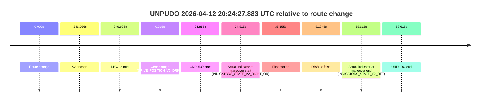
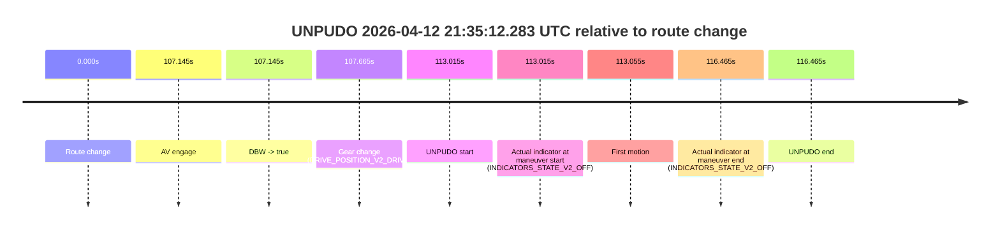
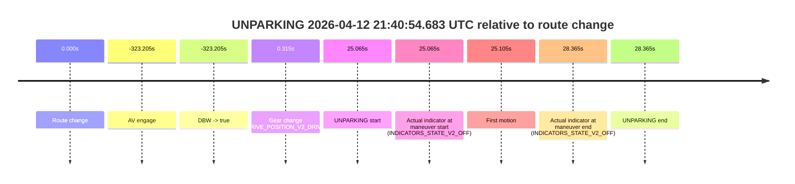

# Run Report: fme20037/2026-04-12--20-05-06--gen2-av-63ff6cb0-d7f6-412e-91f7-ddae211c883c

| Field | Value |
|---|---|
| Run ID | `fme20037/2026-04-12--20-05-06--gen2-av-63ff6cb0-d7f6-412e-91f7-ddae211c883c` |
| Date | `2026-04-12` |
| Model(s) | `lively-orange-horse` |
| Author | `guy.geva` |
| Event count | `11` |

## unpudo 2026-04-12 20:14:48.433 UTC

| Field | Value |
|---|---|
| Model | `lively-orange-horse` |
| Author | `guy.geva` |
| Run ID | `fme20037/2026-04-12--20-05-06--gen2-av-63ff6cb0-d7f6-412e-91f7-ddae211c883c` |
| Date | `2026-04-12` |
| Time (UTC) | `20:14:48.433` |
| Event type | `unpudo` |
| Disengagement type | `none observed` |
| Route change | `found` |
| Console | [run](https://console.sso.wayve.ai/run/fme20037/2026-04-12--20-05-06--gen2-av-63ff6cb0-d7f6-412e-91f7-ddae211c883c?id=&time-unixus=1776024888433312) |
| Foxglove | [segment](https://app.foxglove.dev/wayve-on-prem/p/prj_0dX18KZdVHg1fmmI/view?ds=foxglove-stream&ds.deviceName=fme20037&ds.start=2026-04-12T20%3A14%3A17.368359Z&ds.end=2026-04-12T20%3A17%3A22.832855Z&layoutId=lay_0e7VD4WIKDQGU73Y&time=2026-04-12T20%3A14%3A48.433312Z) |

### Event card: pass

- Pass: AV owns the credited unpudo through the official event window, the gear state is aligned at the anchor, and the vehicle moves without driver accelerator help in AV.

| Event | Time (UTC) | Delta from route change |
|---|---:|---:|
| Route change | 2026-04-12 20:14:27.368 | `0.000s` |
| AV engage | 2026-04-12 20:14:39.573 | `12.205s` |
| DBW -> true | 2026-04-12 20:14:39.573 | `12.205s` |
| Gear change (DRIVE_POSITION_V2_DRIVE) | 2026-04-12 20:14:39.983 | `12.615s` |
| UNPUDO start | 2026-04-12 20:14:48.433 | `21.065s` |
| Actual indicator at maneuver start (INDICATORS_STATE_V2_RIGHT_ON) | 2026-04-12 20:14:48.433 | `21.065s` |
| First motion | 2026-04-12 20:14:48.503 | `21.135s` |
| DBW -> false | 2026-04-12 20:17:12.832 | `165.464s` |
| Actual indicator at maneuver end (INDICATORS_STATE_V2_OFF) | 2026-04-12 20:14:53.183 | `25.815s` |
| UNPUDO end | 2026-04-12 20:14:53.183 | `25.815s` |

| Metric | Value |
|---|---|
| Outcome | `pass` |
| Effective failure type | `none` |
| Route change status | `found` |
| DBW at event start | `true` |
| DBW at event end | `true` |
| Predicted gear at AV start | `DRIVE_POSITION_V2_DRIVE` |
| Actual gear at AV start | `DRIVE_POSITION_V2_PARK` |
| Predicted gear at event start | `DRIVE_POSITION_V2_DRIVE` |
| Actual gear at event start | `DRIVE_POSITION_V2_DRIVE` |
| Planned indicator direction | `INDICATORS_STATE_V2_RIGHT_ON` |
| Controller indicator direction | `INDICATORS_STATE_V2_RIGHT_ON` |
| Actual indicator direction | `INDICATORS_STATE_V2_RIGHT_ON` |
| Actual indicator at maneuver end | `INDICATORS_STATE_V2_OFF` |
| Driver accel help in AV | `false` |
| Driver accel help timestamp | `n/a` |
| Max accel pedal pct in AV | `0.0%` |
| Max brake pedal pct in AV | `8.0%` |
| Max speed mps in AV | `3.492` |
| Route -> AV | `12.205s` |
| AV -> event start | `8.860s` |
| AV -> first motion | `8.930s` |
| AV duration before disengagement | `153.260s` |
| Trajectory waypoint count | `36` |
| Driving-plan step count | `11` |

The scored portion starts from the AV-owned window, not from the pre-AV setup. Route-change search in the stopped pre-event segment was `found`, with the baseline therefore set to route change. At the event anchor the model predicts `DRIVE_POSITION_V2_DRIVE` and the actual gear is `DRIVE_POSITION_V2_DRIVE`. The effective model outcome is `pass` because `the credited maneuver stays AV-owned through the official event end`.

### Resolution

| Field | Value |
|---|---|
| Final outcome | `pass` |
| Do we agree with this label? | `yes` |
| Source disengagement type | `none observed` |
| Resolved effective failure type | `none` |
| Confidence | `high` |

## unpudo 2026-04-12 20:24:27.883 UTC

| Field | Value |
|---|---|
| Model | `lively-orange-horse` |
| Author | `guy.geva` |
| Run ID | `fme20037/2026-04-12--20-05-06--gen2-av-63ff6cb0-d7f6-412e-91f7-ddae211c883c` |
| Date | `2026-04-12` |
| Time (UTC) | `20:24:27.883` |
| Event type | `unpudo` |
| Disengagement type | `failed_to_unpudo` |
| Route change | `found` |
| Console | [run](https://console.sso.wayve.ai/run/fme20037/2026-04-12--20-05-06--gen2-av-63ff6cb0-d7f6-412e-91f7-ddae211c883c?id=&time-unixus=1776025467883309) |
| Foxglove | [segment](https://app.foxglove.dev/wayve-on-prem/p/prj_0dX18KZdVHg1fmmI/view?ds=foxglove-stream&ds.deviceName=fme20037&ds.start=2026-04-12T20%3A17%3A56.132825Z&ds.end=2026-04-12T20%3A25%3A01.683296Z&layoutId=lay_0e7VD4WIKDQGU73Y&time=2026-04-12T20%3A24%3A27.883309Z) |

### Event card: fail

- Fail: AV owns part of the segment, but the event still resolves as a model-performance failure under the AV-only scoring rule.

| Event | Time (UTC) | Delta from route change |
|---|---:|---:|
| Route change | 2026-04-12 20:23:53.068 | `0.000s` |
| AV engage | 2026-04-12 20:18:06.132 | `-346.936s` |
| DBW -> true | 2026-04-12 20:18:06.132 | `-346.936s` |
| Gear change (DRIVE_POSITION_V2_DRIVE) | 2026-04-12 20:23:53.383 | `0.315s` |
| UNPUDO start | 2026-04-12 20:24:27.883 | `34.815s` |
| Actual indicator at maneuver start (INDICATORS_STATE_V2_RIGHT_ON) | 2026-04-12 20:24:27.883 | `34.815s` |
| First motion | 2026-04-12 20:24:28.223 | `35.155s` |
| DBW -> false | 2026-04-12 20:24:44.413 | `51.345s` |
| Actual indicator at maneuver end (INDICATORS_STATE_V2_OFF) | 2026-04-12 20:24:51.683 | `58.615s` |
| UNPUDO end | 2026-04-12 20:24:51.683 | `58.615s` |

| Metric | Value |
|---|---|
| Outcome | `fail` |
| Effective failure type | `failed_to_unpudo` |
| Route change status | `found` |
| DBW at event start | `true` |
| DBW at event end | `false` |
| Predicted gear at AV start | `DRIVE_POSITION_V2_DRIVE` |
| Actual gear at AV start | `DRIVE_POSITION_V2_DRIVE` |
| Predicted gear at event start | `DRIVE_POSITION_V2_DRIVE` |
| Actual gear at event start | `DRIVE_POSITION_V2_DRIVE` |
| Planned indicator direction | `INDICATORS_STATE_V2_RIGHT_ON` |
| Controller indicator direction | `INDICATORS_STATE_V2_RIGHT_ON` |
| Actual indicator direction | `INDICATORS_STATE_V2_RIGHT_ON` |
| Actual indicator at maneuver end | `INDICATORS_STATE_V2_OFF` |
| Driver accel help in AV | `false` |
| Driver accel help timestamp | `n/a` |
| Max accel pedal pct in AV | `0.0%` |
| Max brake pedal pct in AV | `17.1%` |
| Max speed mps in AV | `8.506` |
| Route -> AV | `-346.936s` |
| AV -> event start | `381.750s` |
| AV -> first motion | `382.090s` |
| AV duration before disengagement | `398.280s` |
| Trajectory waypoint count | `37` |
| Driving-plan step count | `11` |

The scored portion starts from the AV-owned window, not from the pre-AV setup. Route-change search in the stopped pre-event segment was `found`, with the baseline therefore set to route change. At the event anchor the model predicts `DRIVE_POSITION_V2_DRIVE` and the actual gear is `DRIVE_POSITION_V2_DRIVE`. The effective model outcome is `fail` because `failed_to_unpudo`.

### Resolution

| Field | Value |
|---|---|
| Final outcome | `fail` |
| Do we agree with this label? | `yes` |
| Source disengagement type | `failed_to_unpudo` |
| Resolved effective failure type | `failed_to_unpudo` |
| Confidence | `high` |

## unpudo 2026-04-12 20:26:49.183 UTC

| Field | Value |
|---|---|
| Model | `lively-orange-horse` |
| Author | `guy.geva` |
| Run ID | `fme20037/2026-04-12--20-05-06--gen2-av-63ff6cb0-d7f6-412e-91f7-ddae211c883c` |
| Date | `2026-04-12` |
| Time (UTC) | `20:26:49.183` |
| Event type | `unpudo` |
| Disengagement type | `none observed` |
| Route change | `found` |
| Console | [run](https://console.sso.wayve.ai/run/fme20037/2026-04-12--20-05-06--gen2-av-63ff6cb0-d7f6-412e-91f7-ddae211c883c?id=&time-unixus=1776025609183315) |
| Foxglove | [segment](https://app.foxglove.dev/wayve-on-prem/p/prj_0dX18KZdVHg1fmmI/view?ds=foxglove-stream&ds.deviceName=fme20037&ds.start=2026-04-12T20%3A26%3A27.918256Z&ds.end=2026-04-12T20%3A29%3A17.614012Z&layoutId=lay_0e7VD4WIKDQGU73Y&time=2026-04-12T20%3A26%3A49.183315Z) |

### Event card: pass

- Pass: AV owns the credited unpudo through the official event window, the gear state is aligned at the anchor, and the vehicle moves without driver accelerator help in AV.

| Event | Time (UTC) | Delta from route change |
|---|---:|---:|
| Route change | 2026-04-12 20:26:37.918 | `0.000s` |
| AV engage | 2026-04-12 20:26:42.573 | `4.655s` |
| DBW -> true | 2026-04-12 20:26:42.573 | `4.655s` |
| Gear change (DRIVE_POSITION_V2_DRIVE) | 2026-04-12 20:26:42.683 | `4.765s` |
| UNPUDO start | 2026-04-12 20:26:49.183 | `11.265s` |
| Actual indicator at maneuver start (INDICATORS_STATE_V2_LEFT_ON) | 2026-04-12 20:26:49.183 | `11.265s` |
| First motion | 2026-04-12 20:26:49.282 | `11.365s` |
| DBW -> false | 2026-04-12 20:29:07.614 | `149.696s` |
| Actual indicator at maneuver end (INDICATORS_STATE_V2_OFF) | 2026-04-12 20:26:52.683 | `14.765s` |
| UNPUDO end | 2026-04-12 20:26:52.683 | `14.765s` |

| Metric | Value |
|---|---|
| Outcome | `pass` |
| Effective failure type | `none` |
| Route change status | `found` |
| DBW at event start | `true` |
| DBW at event end | `true` |
| Predicted gear at AV start | `DRIVE_POSITION_V2_DRIVE` |
| Actual gear at AV start | `DRIVE_POSITION_V2_PARK` |
| Predicted gear at event start | `DRIVE_POSITION_V2_DRIVE` |
| Actual gear at event start | `DRIVE_POSITION_V2_DRIVE` |
| Planned indicator direction | `INDICATORS_STATE_V2_OFF` |
| Controller indicator direction | `INDICATORS_STATE_V2_OFF` |
| Actual indicator direction | `INDICATORS_STATE_V2_LEFT_ON` |
| Actual indicator at maneuver end | `INDICATORS_STATE_V2_OFF` |
| Driver accel help in AV | `false` |
| Driver accel help timestamp | `n/a` |
| Max accel pedal pct in AV | `0.0%` |
| Max brake pedal pct in AV | `8.0%` |
| Max speed mps in AV | `5.522` |
| Route -> AV | `4.655s` |
| AV -> event start | `6.610s` |
| AV -> first motion | `6.710s` |
| AV duration before disengagement | `145.041s` |
| Trajectory waypoint count | `37` |
| Driving-plan step count | `11` |

The scored portion starts from the AV-owned window, not from the pre-AV setup. Route-change search in the stopped pre-event segment was `found`, with the baseline therefore set to route change. At the event anchor the model predicts `DRIVE_POSITION_V2_DRIVE` and the actual gear is `DRIVE_POSITION_V2_DRIVE`. The effective model outcome is `pass` because `the credited maneuver stays AV-owned through the official event end`.

### Resolution

| Field | Value |
|---|---|
| Final outcome | `pass` |
| Do we agree with this label? | `yes` |
| Source disengagement type | `none observed` |
| Resolved effective failure type | `none` |
| Confidence | `high` |

## unpudo 2026-04-12 20:35:12.383 UTC

| Field | Value |
|---|---|
| Model | `lively-orange-horse` |
| Author | `guy.geva` |
| Run ID | `fme20037/2026-04-12--20-05-06--gen2-av-63ff6cb0-d7f6-412e-91f7-ddae211c883c` |
| Date | `2026-04-12` |
| Time (UTC) | `20:35:12.383` |
| Event type | `unpudo` |
| Disengagement type | `none observed` |
| Route change | `found` |
| Console | [run](https://console.sso.wayve.ai/run/fme20037/2026-04-12--20-05-06--gen2-av-63ff6cb0-d7f6-412e-91f7-ddae211c883c?id=&time-unixus=1776026112383320) |
| Foxglove | [segment](https://app.foxglove.dev/wayve-on-prem/p/prj_0dX18KZdVHg1fmmI/view?ds=foxglove-stream&ds.deviceName=fme20037&ds.start=2026-04-12T20%3A33%3A10.752828Z&ds.end=2026-04-12T20%3A40%3A29.293427Z&layoutId=lay_0e7VD4WIKDQGU73Y&time=2026-04-12T20%3A35%3A12.383320Z) |

### Event card: pass

- Pass: AV owns the credited unpudo through the official event window, the gear state is aligned at the anchor, and the vehicle moves without driver accelerator help in AV.

| Event | Time (UTC) | Delta from route change |
|---|---:|---:|
| Route change | 2026-04-12 20:34:57.468 | `0.000s` |
| AV engage | 2026-04-12 20:33:20.752 | `-96.715s` |
| DBW -> true | 2026-04-12 20:33:20.752 | `-96.715s` |
| Gear change (DRIVE_POSITION_V2_DRIVE) | 2026-04-12 20:34:57.783 | `0.315s` |
| UNPUDO start | 2026-04-12 20:35:12.383 | `14.915s` |
| Actual indicator at maneuver start (INDICATORS_STATE_V2_RIGHT_ON) | 2026-04-12 20:35:12.383 | `14.915s` |
| First motion | 2026-04-12 20:35:12.422 | `14.955s` |
| DBW -> false | 2026-04-12 20:40:19.293 | `321.825s` |
| Actual indicator at maneuver end (INDICATORS_STATE_V2_OFF) | 2026-04-12 20:35:16.183 | `18.715s` |
| UNPUDO end | 2026-04-12 20:35:16.183 | `18.715s` |

| Metric | Value |
|---|---|
| Outcome | `pass` |
| Effective failure type | `none` |
| Route change status | `found` |
| DBW at event start | `true` |
| DBW at event end | `true` |
| Predicted gear at AV start | `DRIVE_POSITION_V2_DRIVE` |
| Actual gear at AV start | `DRIVE_POSITION_V2_DRIVE` |
| Predicted gear at event start | `DRIVE_POSITION_V2_DRIVE` |
| Actual gear at event start | `DRIVE_POSITION_V2_DRIVE` |
| Planned indicator direction | `INDICATORS_STATE_V2_RIGHT_ON` |
| Controller indicator direction | `INDICATORS_STATE_V2_RIGHT_ON` |
| Actual indicator direction | `INDICATORS_STATE_V2_RIGHT_ON` |
| Actual indicator at maneuver end | `INDICATORS_STATE_V2_OFF` |
| Driver accel help in AV | `false` |
| Driver accel help timestamp | `n/a` |
| Max accel pedal pct in AV | `0.0%` |
| Max brake pedal pct in AV | `8.9%` |
| Max speed mps in AV | `8.181` |
| Route -> AV | `-96.715s` |
| AV -> event start | `111.630s` |
| AV -> first motion | `111.670s` |
| AV duration before disengagement | `418.541s` |
| Trajectory waypoint count | `37` |
| Driving-plan step count | `11` |

The scored portion starts from the AV-owned window, not from the pre-AV setup. Route-change search in the stopped pre-event segment was `found`, with the baseline therefore set to route change. At the event anchor the model predicts `DRIVE_POSITION_V2_DRIVE` and the actual gear is `DRIVE_POSITION_V2_DRIVE`. The effective model outcome is `pass` because `the credited maneuver stays AV-owned through the official event end`.

### Resolution

| Field | Value |
|---|---|
| Final outcome | `pass` |
| Do we agree with this label? | `yes` |
| Source disengagement type | `none observed` |
| Resolved effective failure type | `none` |
| Confidence | `high` |

## unpudo 2026-04-12 20:40:20.333 UTC

| Field | Value |
|---|---|
| Model | `lively-orange-horse` |
| Author | `guy.geva` |
| Run ID | `fme20037/2026-04-12--20-05-06--gen2-av-63ff6cb0-d7f6-412e-91f7-ddae211c883c` |
| Date | `2026-04-12` |
| Time (UTC) | `20:40:20.333` |
| Event type | `unpudo` |
| Disengagement type | `failed_to_unpudo` |
| Route change | `found` |
| Console | [run](https://console.sso.wayve.ai/run/fme20037/2026-04-12--20-05-06--gen2-av-63ff6cb0-d7f6-412e-91f7-ddae211c883c?id=&time-unixus=1776026420333303) |
| Foxglove | [segment](https://app.foxglove.dev/wayve-on-prem/p/prj_0dX18KZdVHg1fmmI/view?ds=foxglove-stream&ds.deviceName=fme20037&ds.start=2026-04-12T20%3A39%3A54.568248Z&ds.end=2026-04-12T20%3A44%3A33.154105Z&layoutId=lay_0e7VD4WIKDQGU73Y&time=2026-04-12T20%3A40%3A20.333303Z) |

### Event card: fail

- Fail: AV owns part of the segment, but the event still resolves as a model-performance failure under the AV-only scoring rule.

| Event | Time (UTC) | Delta from route change |
|---|---:|---:|
| Route change | 2026-04-12 20:40:04.568 | `0.000s` |
| AV engage | 2026-04-12 20:40:28.494 | `23.926s` |
| DBW -> true | 2026-04-12 20:40:28.494 | `23.926s` |
| Gear change (DRIVE_POSITION_V2_DRIVE) | 2026-04-12 20:40:04.883 | `0.315s` |
| UNPUDO start | 2026-04-12 20:40:20.333 | `15.765s` |
| Actual indicator at maneuver start (INDICATORS_STATE_V2_RIGHT_ON) | 2026-04-12 20:40:20.333 | `15.765s` |
| First motion | 2026-04-12 20:40:20.382 | `15.815s` |
| DBW -> false | 2026-04-12 20:44:23.154 | `258.586s` |
| Actual indicator at maneuver end (INDICATORS_STATE_V2_OFF) | 2026-04-12 20:40:25.533 | `20.965s` |
| UNPUDO end | 2026-04-12 20:40:25.533 | `20.965s` |

| Metric | Value |
|---|---|
| Outcome | `fail` |
| Effective failure type | `failed_to_unpudo` |
| Route change status | `found` |
| DBW at event start | `false` |
| DBW at event end | `false` |
| Predicted gear at AV start | `DRIVE_POSITION_V2_DRIVE` |
| Actual gear at AV start | `DRIVE_POSITION_V2_DRIVE` |
| Predicted gear at event start | `DRIVE_POSITION_V2_DRIVE` |
| Actual gear at event start | `DRIVE_POSITION_V2_DRIVE` |
| Planned indicator direction | `INDICATORS_STATE_V2_RIGHT_ON` |
| Controller indicator direction | `INDICATORS_STATE_V2_RIGHT_ON` |
| Actual indicator direction | `INDICATORS_STATE_V2_RIGHT_ON` |
| Actual indicator at maneuver end | `INDICATORS_STATE_V2_OFF` |
| Driver accel help in AV | `false` |
| Driver accel help timestamp | `n/a` |
| Max accel pedal pct in AV | `0.0%` |
| Max brake pedal pct in AV | `0.0%` |
| Max speed mps in AV | `0.000` |
| Route -> AV | `23.926s` |
| AV -> event start | `-8.161s` |
| AV -> first motion | `-8.111s` |
| AV duration before disengagement | `234.660s` |
| Trajectory waypoint count | `38` |
| Driving-plan step count | `11` |

The scored portion starts from the AV-owned window, not from the pre-AV setup. Route-change search in the stopped pre-event segment was `found`, with the baseline therefore set to route change. At the event anchor the model predicts `DRIVE_POSITION_V2_DRIVE` and the actual gear is `DRIVE_POSITION_V2_DRIVE`. The effective model outcome is `fail` because `failed_to_unpudo`.

### Resolution

| Field | Value |
|---|---|
| Final outcome | `fail` |
| Do we agree with this label? | `yes` |
| Source disengagement type | `failed_to_unpudo` |
| Resolved effective failure type | `failed_to_unpudo` |
| Confidence | `high` |

## unpudo 2026-04-12 20:41:30.983 UTC

| Field | Value |
|---|---|
| Model | `lively-orange-horse` |
| Author | `guy.geva` |
| Run ID | `fme20037/2026-04-12--20-05-06--gen2-av-63ff6cb0-d7f6-412e-91f7-ddae211c883c` |
| Date | `2026-04-12` |
| Time (UTC) | `20:41:30.983` |
| Event type | `unpudo` |
| Disengagement type | `none observed` |
| Route change | `found` |
| Console | [run](https://console.sso.wayve.ai/run/fme20037/2026-04-12--20-05-06--gen2-av-63ff6cb0-d7f6-412e-91f7-ddae211c883c?id=&time-unixus=1776026490983316) |
| Foxglove | [segment](https://app.foxglove.dev/wayve-on-prem/p/prj_0dX18KZdVHg1fmmI/view?ds=foxglove-stream&ds.deviceName=fme20037&ds.start=2026-04-12T20%3A39%3A54.568248Z&ds.end=2026-04-12T20%3A44%3A33.154105Z&layoutId=lay_0e7VD4WIKDQGU73Y&time=2026-04-12T20%3A41%3A30.983316Z) |

### Event card: pass

- Pass: AV owns the credited unpudo through the official event window, the gear state is aligned at the anchor, and the vehicle moves without driver accelerator help in AV.

| Event | Time (UTC) | Delta from route change |
|---|---:|---:|
| Route change | 2026-04-12 20:40:04.568 | `0.000s` |
| AV engage | 2026-04-12 20:40:28.494 | `23.926s` |
| DBW -> true | 2026-04-12 20:40:28.494 | `23.926s` |
| Gear change (DRIVE_POSITION_V2_DRIVE) | 2026-04-12 20:41:18.183 | `73.615s` |
| UNPUDO start | 2026-04-12 20:41:30.983 | `86.415s` |
| Actual indicator at maneuver start (INDICATORS_STATE_V2_RIGHT_ON) | 2026-04-12 20:41:30.983 | `86.415s` |
| First motion | 2026-04-12 20:41:31.103 | `86.535s` |
| DBW -> false | 2026-04-12 20:44:23.154 | `258.586s` |
| Actual indicator at maneuver end (INDICATORS_STATE_V2_OFF) | 2026-04-12 20:41:34.683 | `90.115s` |
| UNPUDO end | 2026-04-12 20:41:34.683 | `90.115s` |

| Metric | Value |
|---|---|
| Outcome | `pass` |
| Effective failure type | `none` |
| Route change status | `found` |
| DBW at event start | `true` |
| DBW at event end | `true` |
| Predicted gear at AV start | `DRIVE_POSITION_V2_DRIVE` |
| Actual gear at AV start | `DRIVE_POSITION_V2_DRIVE` |
| Predicted gear at event start | `DRIVE_POSITION_V2_DRIVE` |
| Actual gear at event start | `DRIVE_POSITION_V2_DRIVE` |
| Planned indicator direction | `INDICATORS_STATE_V2_RIGHT_ON` |
| Controller indicator direction | `INDICATORS_STATE_V2_RIGHT_ON` |
| Actual indicator direction | `INDICATORS_STATE_V2_RIGHT_ON` |
| Actual indicator at maneuver end | `INDICATORS_STATE_V2_OFF` |
| Driver accel help in AV | `false` |
| Driver accel help timestamp | `n/a` |
| Max accel pedal pct in AV | `0.0%` |
| Max brake pedal pct in AV | `8.6%` |
| Max speed mps in AV | `8.456` |
| Route -> AV | `23.926s` |
| AV -> event start | `62.489s` |
| AV -> first motion | `62.609s` |
| AV duration before disengagement | `234.660s` |
| Trajectory waypoint count | `37` |
| Driving-plan step count | `11` |

The scored portion starts from the AV-owned window, not from the pre-AV setup. Route-change search in the stopped pre-event segment was `found`, with the baseline therefore set to route change. At the event anchor the model predicts `DRIVE_POSITION_V2_DRIVE` and the actual gear is `DRIVE_POSITION_V2_DRIVE`. The effective model outcome is `pass` because `the credited maneuver stays AV-owned through the official event end`.

### Resolution

| Field | Value |
|---|---|
| Final outcome | `pass` |
| Do we agree with this label? | `yes` |
| Source disengagement type | `none observed` |
| Resolved effective failure type | `none` |
| Confidence | `high` |

## unpudo 2026-04-12 20:49:43.333 UTC

| Field | Value |
|---|---|
| Model | `lively-orange-horse` |
| Author | `guy.geva` |
| Run ID | `fme20037/2026-04-12--20-05-06--gen2-av-63ff6cb0-d7f6-412e-91f7-ddae211c883c` |
| Date | `2026-04-12` |
| Time (UTC) | `20:49:43.333` |
| Event type | `unpudo` |
| Disengagement type | `none observed` |
| Route change | `found` |
| Console | [run](https://console.sso.wayve.ai/run/fme20037/2026-04-12--20-05-06--gen2-av-63ff6cb0-d7f6-412e-91f7-ddae211c883c?id=&time-unixus=1776026983333304) |
| Foxglove | [segment](https://app.foxglove.dev/wayve-on-prem/p/prj_0dX18KZdVHg1fmmI/view?ds=foxglove-stream&ds.deviceName=fme20037&ds.start=2026-04-12T20%3A45%3A00.552886Z&ds.end=2026-04-12T20%3A53%3A09.752822Z&layoutId=lay_0e7VD4WIKDQGU73Y&time=2026-04-12T20%3A49%3A43.333304Z) |

### Event card: pass

- Pass: AV owns the credited unpudo through the official event window, the gear state is aligned at the anchor, and the vehicle moves without driver accelerator help in AV.

| Event | Time (UTC) | Delta from route change |
|---|---:|---:|
| Route change | 2026-04-12 20:49:12.068 | `0.000s` |
| AV engage | 2026-04-12 20:45:10.552 | `-241.515s` |
| DBW -> true | 2026-04-12 20:45:10.552 | `-241.515s` |
| Gear change (DRIVE_POSITION_V2_DRIVE) | 2026-04-12 20:49:12.283 | `0.215s` |
| UNPUDO start | 2026-04-12 20:49:43.333 | `31.265s` |
| Actual indicator at maneuver start (INDICATORS_STATE_V2_RIGHT_ON) | 2026-04-12 20:49:43.333 | `31.265s` |
| First motion | 2026-04-12 20:49:43.422 | `31.355s` |
| DBW -> false | 2026-04-12 20:52:59.752 | `227.685s` |
| Actual indicator at maneuver end (INDICATORS_STATE_V2_OFF) | 2026-04-12 20:49:47.233 | `35.165s` |
| UNPUDO end | 2026-04-12 20:49:47.233 | `35.165s` |

| Metric | Value |
|---|---|
| Outcome | `pass` |
| Effective failure type | `none` |
| Route change status | `found` |
| DBW at event start | `true` |
| DBW at event end | `true` |
| Predicted gear at AV start | `DRIVE_POSITION_V2_DRIVE` |
| Actual gear at AV start | `DRIVE_POSITION_V2_DRIVE` |
| Predicted gear at event start | `DRIVE_POSITION_V2_DRIVE` |
| Actual gear at event start | `DRIVE_POSITION_V2_DRIVE` |
| Planned indicator direction | `INDICATORS_STATE_V2_RIGHT_ON` |
| Controller indicator direction | `INDICATORS_STATE_V2_RIGHT_ON` |
| Actual indicator direction | `INDICATORS_STATE_V2_RIGHT_ON` |
| Actual indicator at maneuver end | `INDICATORS_STATE_V2_OFF` |
| Driver accel help in AV | `false` |
| Driver accel help timestamp | `n/a` |
| Max accel pedal pct in AV | `0.0%` |
| Max brake pedal pct in AV | `8.0%` |
| Max speed mps in AV | `8.356` |
| Route -> AV | `-241.515s` |
| AV -> event start | `272.780s` |
| AV -> first motion | `272.870s` |
| AV duration before disengagement | `469.200s` |
| Trajectory waypoint count | `36` |
| Driving-plan step count | `11` |

The scored portion starts from the AV-owned window, not from the pre-AV setup. Route-change search in the stopped pre-event segment was `found`, with the baseline therefore set to route change. At the event anchor the model predicts `DRIVE_POSITION_V2_DRIVE` and the actual gear is `DRIVE_POSITION_V2_DRIVE`. The effective model outcome is `pass` because `the credited maneuver stays AV-owned through the official event end`.

### Resolution

| Field | Value |
|---|---|
| Final outcome | `pass` |
| Do we agree with this label? | `yes` |
| Source disengagement type | `none observed` |
| Resolved effective failure type | `none` |
| Confidence | `high` |

## unpudo 2026-04-12 20:59:42.533 UTC

| Field | Value |
|---|---|
| Model | `lively-orange-horse` |
| Author | `guy.geva` |
| Run ID | `fme20037/2026-04-12--20-05-06--gen2-av-63ff6cb0-d7f6-412e-91f7-ddae211c883c` |
| Date | `2026-04-12` |
| Time (UTC) | `20:59:42.533` |
| Event type | `unpudo` |
| Disengagement type | `none observed` |
| Route change | `found` |
| Console | [run](https://console.sso.wayve.ai/run/fme20037/2026-04-12--20-05-06--gen2-av-63ff6cb0-d7f6-412e-91f7-ddae211c883c?id=&time-unixus=1776027582533324) |
| Foxglove | [segment](https://app.foxglove.dev/wayve-on-prem/p/prj_0dX18KZdVHg1fmmI/view?ds=foxglove-stream&ds.deviceName=fme20037&ds.start=2026-04-12T20%3A59%3A01.918257Z&ds.end=2026-04-12T21%3A04%3A49.274080Z&layoutId=lay_0e7VD4WIKDQGU73Y&time=2026-04-12T20%3A59%3A42.533324Z) |

### Event card: pass

- Pass: AV owns the credited unpudo through the official event window, the gear state is aligned at the anchor, and the vehicle moves without driver accelerator help in AV.

| Event | Time (UTC) | Delta from route change |
|---|---:|---:|
| Route change | 2026-04-12 20:59:11.918 | `0.000s` |
| AV engage | 2026-04-12 20:59:38.573 | `26.655s` |
| DBW -> true | 2026-04-12 20:59:38.573 | `26.655s` |
| Gear change (DRIVE_POSITION_V2_DRIVE) | 2026-04-12 20:59:38.983 | `27.065s` |
| UNPUDO start | 2026-04-12 20:59:42.533 | `30.615s` |
| Actual indicator at maneuver start (INDICATORS_STATE_V2_OFF) | 2026-04-12 20:59:42.533 | `30.615s` |
| First motion | 2026-04-12 20:59:42.583 | `30.665s` |
| DBW -> false | 2026-04-12 21:04:39.274 | `327.356s` |
| Actual indicator at maneuver end (INDICATORS_STATE_V2_OFF) | 2026-04-12 20:59:45.983 | `34.065s` |
| UNPUDO end | 2026-04-12 20:59:45.983 | `34.065s` |

| Metric | Value |
|---|---|
| Outcome | `pass` |
| Effective failure type | `none` |
| Route change status | `found` |
| DBW at event start | `true` |
| DBW at event end | `true` |
| Predicted gear at AV start | `DRIVE_POSITION_V2_DRIVE` |
| Actual gear at AV start | `DRIVE_POSITION_V2_PARK` |
| Predicted gear at event start | `DRIVE_POSITION_V2_DRIVE` |
| Actual gear at event start | `DRIVE_POSITION_V2_DRIVE` |
| Planned indicator direction | `INDICATORS_STATE_V2_RIGHT_ON` |
| Controller indicator direction | `INDICATORS_STATE_V2_RIGHT_ON` |
| Actual indicator direction | `INDICATORS_STATE_V2_OFF` |
| Actual indicator at maneuver end | `INDICATORS_STATE_V2_OFF` |
| Driver accel help in AV | `false` |
| Driver accel help timestamp | `n/a` |
| Max accel pedal pct in AV | `0.0%` |
| Max brake pedal pct in AV | `8.0%` |
| Max speed mps in AV | `5.306` |
| Route -> AV | `26.655s` |
| AV -> event start | `3.960s` |
| AV -> first motion | `4.010s` |
| AV duration before disengagement | `300.701s` |
| Trajectory waypoint count | `36` |
| Driving-plan step count | `11` |

The scored portion starts from the AV-owned window, not from the pre-AV setup. Route-change search in the stopped pre-event segment was `found`, with the baseline therefore set to route change. At the event anchor the model predicts `DRIVE_POSITION_V2_DRIVE` and the actual gear is `DRIVE_POSITION_V2_DRIVE`. The effective model outcome is `pass` because `the credited maneuver stays AV-owned through the official event end`.

### Resolution

| Field | Value |
|---|---|
| Final outcome | `pass` |
| Do we agree with this label? | `yes` |
| Source disengagement type | `none observed` |
| Resolved effective failure type | `none` |
| Confidence | `high` |

## unpudo 2026-04-12 21:14:48.033 UTC

| Field | Value |
|---|---|
| Model | `lively-orange-horse` |
| Author | `guy.geva` |
| Run ID | `fme20037/2026-04-12--20-05-06--gen2-av-63ff6cb0-d7f6-412e-91f7-ddae211c883c` |
| Date | `2026-04-12` |
| Time (UTC) | `21:14:48.033` |
| Event type | `unpudo` |
| Disengagement type | `failed_to_unpudo` |
| Route change | `found` |
| Console | [run](https://console.sso.wayve.ai/run/fme20037/2026-04-12--20-05-06--gen2-av-63ff6cb0-d7f6-412e-91f7-ddae211c883c?id=&time-unixus=1776028488033313) |
| Foxglove | [segment](https://app.foxglove.dev/wayve-on-prem/p/prj_0dX18KZdVHg1fmmI/view?ds=foxglove-stream&ds.deviceName=fme20037&ds.start=2026-04-12T21%3A13%3A39.368307Z&ds.end=2026-04-12T21%3A15%3A13.133297Z&layoutId=lay_0e7VD4WIKDQGU73Y&time=2026-04-12T21%3A14%3A48.033313Z) |

### Event card: fail

- Fail: AV owns part of the segment, but the event still resolves as a model-performance failure under the AV-only scoring rule.

| Event | Time (UTC) | Delta from route change |
|---|---:|---:|
| Route change | 2026-04-12 21:13:49.368 | `0.000s` |
| AV engage | 2026-04-12 21:14:39.433 | `50.065s` |
| DBW -> true | 2026-04-12 21:14:39.433 | `50.065s` |
| Gear change (DRIVE_POSITION_V2_DRIVE) | 2026-04-12 21:14:39.933 | `50.565s` |
| UNPUDO start | 2026-04-12 21:14:48.033 | `58.665s` |
| Actual indicator at maneuver start (INDICATORS_STATE_V2_LEFT_ON) | 2026-04-12 21:14:48.033 | `58.665s` |
| First motion | 2026-04-12 21:14:48.362 | `58.995s` |
| DBW -> false | 2026-04-12 21:14:54.253 | `64.885s` |
| Actual indicator at maneuver end (INDICATORS_STATE_V2_OFF) | 2026-04-12 21:15:03.133 | `73.765s` |
| UNPUDO end | 2026-04-12 21:15:03.133 | `73.765s` |

| Metric | Value |
|---|---|
| Outcome | `fail` |
| Effective failure type | `failed_to_unpudo` |
| Route change status | `found` |
| DBW at event start | `true` |
| DBW at event end | `false` |
| Predicted gear at AV start | `DRIVE_POSITION_V2_DRIVE` |
| Actual gear at AV start | `DRIVE_POSITION_V2_PARK` |
| Predicted gear at event start | `DRIVE_POSITION_V2_DRIVE` |
| Actual gear at event start | `DRIVE_POSITION_V2_DRIVE` |
| Planned indicator direction | `INDICATORS_STATE_V2_LEFT_ON` |
| Controller indicator direction | `INDICATORS_STATE_V2_LEFT_ON` |
| Actual indicator direction | `INDICATORS_STATE_V2_LEFT_ON` |
| Actual indicator at maneuver end | `INDICATORS_STATE_V2_OFF` |
| Driver accel help in AV | `false` |
| Driver accel help timestamp | `n/a` |
| Max accel pedal pct in AV | `0.0%` |
| Max brake pedal pct in AV | `8.0%` |
| Max speed mps in AV | `0.144` |
| Route -> AV | `50.065s` |
| AV -> event start | `8.600s` |
| AV -> first motion | `8.930s` |
| AV duration before disengagement | `14.820s` |
| Trajectory waypoint count | `36` |
| Driving-plan step count | `11` |

The scored portion starts from the AV-owned window, not from the pre-AV setup. Route-change search in the stopped pre-event segment was `found`, with the baseline therefore set to route change. At the event anchor the model predicts `DRIVE_POSITION_V2_DRIVE` and the actual gear is `DRIVE_POSITION_V2_DRIVE`. The effective model outcome is `fail` because `failed_to_unpudo`.

### Resolution

| Field | Value |
|---|---|
| Final outcome | `fail` |
| Do we agree with this label? | `yes` |
| Source disengagement type | `failed_to_unpudo` |
| Resolved effective failure type | `failed_to_unpudo` |
| Confidence | `high` |

## unpudo 2026-04-12 21:35:12.283 UTC

| Field | Value |
|---|---|
| Model | `lively-orange-horse` |
| Author | `guy.geva` |
| Run ID | `fme20037/2026-04-12--20-05-06--gen2-av-63ff6cb0-d7f6-412e-91f7-ddae211c883c` |
| Date | `2026-04-12` |
| Time (UTC) | `21:35:12.283` |
| Event type | `unpudo` |
| Disengagement type | `none observed` |
| Route change | `found` |
| Console | [run](https://console.sso.wayve.ai/run/fme20037/2026-04-12--20-05-06--gen2-av-63ff6cb0-d7f6-412e-91f7-ddae211c883c?id=&time-unixus=1776029712283305) |
| Foxglove | [segment](https://app.foxglove.dev/wayve-on-prem/p/prj_0dX18KZdVHg1fmmI/view?ds=foxglove-stream&ds.deviceName=fme20037&ds.start=2026-04-12T21%3A33%3A09.268300Z&ds.end=2026-04-12T21%3A35%3A25.733296Z&layoutId=lay_0e7VD4WIKDQGU73Y&time=2026-04-12T21%3A35%3A12.283305Z) |

### Event card: pass

- Pass: AV owns the credited unpudo through the official event window, the gear state is aligned at the anchor, and the vehicle moves without driver accelerator help in AV.

| Event | Time (UTC) | Delta from route change |
|---|---:|---:|
| Route change | 2026-04-12 21:33:19.268 | `0.000s` |
| AV engage | 2026-04-12 21:35:06.412 | `107.145s` |
| DBW -> true | 2026-04-12 21:35:06.412 | `107.145s` |
| Gear change (DRIVE_POSITION_V2_DRIVE) | 2026-04-12 21:35:06.933 | `107.665s` |
| UNPUDO start | 2026-04-12 21:35:12.283 | `113.015s` |
| Actual indicator at maneuver start (INDICATORS_STATE_V2_OFF) | 2026-04-12 21:35:12.283 | `113.015s` |
| First motion | 2026-04-12 21:35:12.322 | `113.055s` |
| Actual indicator at maneuver end (INDICATORS_STATE_V2_OFF) | 2026-04-12 21:35:15.733 | `116.465s` |
| UNPUDO end | 2026-04-12 21:35:15.733 | `116.465s` |

| Metric | Value |
|---|---|
| Outcome | `pass` |
| Effective failure type | `none` |
| Route change status | `found` |
| DBW at event start | `true` |
| DBW at event end | `true` |
| Predicted gear at AV start | `DRIVE_POSITION_V2_DRIVE` |
| Actual gear at AV start | `DRIVE_POSITION_V2_PARK` |
| Predicted gear at event start | `DRIVE_POSITION_V2_DRIVE` |
| Actual gear at event start | `DRIVE_POSITION_V2_DRIVE` |
| Planned indicator direction | `INDICATORS_STATE_V2_RIGHT_ON` |
| Controller indicator direction | `INDICATORS_STATE_V2_RIGHT_ON` |
| Actual indicator direction | `INDICATORS_STATE_V2_OFF` |
| Actual indicator at maneuver end | `INDICATORS_STATE_V2_OFF` |
| Driver accel help in AV | `false` |
| Driver accel help timestamp | `n/a` |
| Max accel pedal pct in AV | `0.0%` |
| Max brake pedal pct in AV | `8.0%` |
| Max speed mps in AV | `5.583` |
| Route -> AV | `107.145s` |
| AV -> event start | `5.870s` |
| AV -> first motion | `5.910s` |
| AV duration before disengagement | `n/a` |
| Trajectory waypoint count | `37` |
| Driving-plan step count | `11` |

The scored portion starts from the AV-owned window, not from the pre-AV setup. Route-change search in the stopped pre-event segment was `found`, with the baseline therefore set to route change. At the event anchor the model predicts `DRIVE_POSITION_V2_DRIVE` and the actual gear is `DRIVE_POSITION_V2_DRIVE`. The effective model outcome is `pass` because `the credited maneuver stays AV-owned through the official event end`.

### Resolution

| Field | Value |
|---|---|
| Final outcome | `pass` |
| Do we agree with this label? | `yes` |
| Source disengagement type | `none observed` |
| Resolved effective failure type | `none` |
| Confidence | `high` |

## unparking 2026-04-12 21:40:54.683 UTC

| Field | Value |
|---|---|
| Model | `lively-orange-horse` |
| Author | `guy.geva` |
| Run ID | `fme20037/2026-04-12--20-05-06--gen2-av-63ff6cb0-d7f6-412e-91f7-ddae211c883c` |
| Date | `2026-04-12` |
| Time (UTC) | `21:40:54.683` |
| Event type | `unparking` |
| Disengagement type | `none observed` |
| Route change | `found` |
| Console | [run](https://console.sso.wayve.ai/run/fme20037/2026-04-12--20-05-06--gen2-av-63ff6cb0-d7f6-412e-91f7-ddae211c883c?id=&time-unixus=1776030054683322) |
| Foxglove | [segment](https://app.foxglove.dev/wayve-on-prem/p/prj_0dX18KZdVHg1fmmI/view?ds=foxglove-stream&ds.deviceName=fme20037&ds.start=2026-04-12T21%3A34%3A56.412992Z&ds.end=2026-04-12T21%3A41%3A07.983305Z&layoutId=lay_0e7VD4WIKDQGU73Y&time=2026-04-12T21%3A40%3A54.683322Z) |

### Event card: pass

- Pass: AV owns the credited unparking through the official event window, the gear state is aligned at the anchor, and the vehicle moves without driver accelerator help in AV.

| Event | Time (UTC) | Delta from route change |
|---|---:|---:|
| Route change | 2026-04-12 21:40:29.618 | `0.000s` |
| AV engage | 2026-04-12 21:35:06.412 | `-323.205s` |
| DBW -> true | 2026-04-12 21:35:06.412 | `-323.205s` |
| Gear change (DRIVE_POSITION_V2_DRIVE) | 2026-04-12 21:40:29.933 | `0.315s` |
| UNPARKING start | 2026-04-12 21:40:54.683 | `25.065s` |
| Actual indicator at maneuver start (INDICATORS_STATE_V2_OFF) | 2026-04-12 21:40:54.683 | `25.065s` |
| First motion | 2026-04-12 21:40:54.722 | `25.105s` |
| Actual indicator at maneuver end (INDICATORS_STATE_V2_OFF) | 2026-04-12 21:40:57.983 | `28.365s` |
| UNPARKING end | 2026-04-12 21:40:57.983 | `28.365s` |

| Metric | Value |
|---|---|
| Outcome | `pass` |
| Effective failure type | `none` |
| Route change status | `found` |
| DBW at event start | `true` |
| DBW at event end | `true` |
| Predicted gear at AV start | `DRIVE_POSITION_V2_DRIVE` |
| Actual gear at AV start | `DRIVE_POSITION_V2_PARK` |
| Predicted gear at event start | `DRIVE_POSITION_V2_DRIVE` |
| Actual gear at event start | `DRIVE_POSITION_V2_DRIVE` |
| Planned indicator direction | `INDICATORS_STATE_V2_RIGHT_ON` |
| Controller indicator direction | `INDICATORS_STATE_V2_RIGHT_ON` |
| Actual indicator direction | `INDICATORS_STATE_V2_OFF` |
| Actual indicator at maneuver end | `INDICATORS_STATE_V2_OFF` |
| Driver accel help in AV | `false` |
| Driver accel help timestamp | `n/a` |
| Max accel pedal pct in AV | `0.0%` |
| Max brake pedal pct in AV | `17.1%` |
| Max speed mps in AV | `8.464` |
| Route -> AV | `-323.205s` |
| AV -> event start | `348.270s` |
| AV -> first motion | `348.310s` |
| AV duration before disengagement | `n/a` |
| Trajectory waypoint count | `37` |
| Driving-plan step count | `11` |

The scored portion starts from the AV-owned window, not from the pre-AV setup. Route-change search in the stopped pre-event segment was `found`, with the baseline therefore set to route change. At the event anchor the model predicts `DRIVE_POSITION_V2_DRIVE` and the actual gear is `DRIVE_POSITION_V2_DRIVE`. The effective model outcome is `pass` because `the credited maneuver stays AV-owned through the official event end`.

### Resolution

| Field | Value |
|---|---|
| Final outcome | `pass` |
| Do we agree with this label? | `yes` |
| Source disengagement type | `none observed` |
| Resolved effective failure type | `none` |
| Confidence | `high` |
