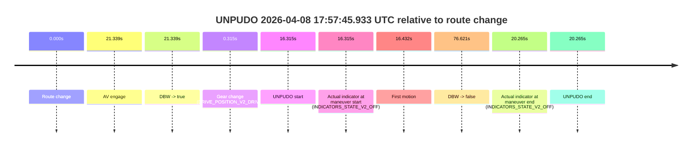
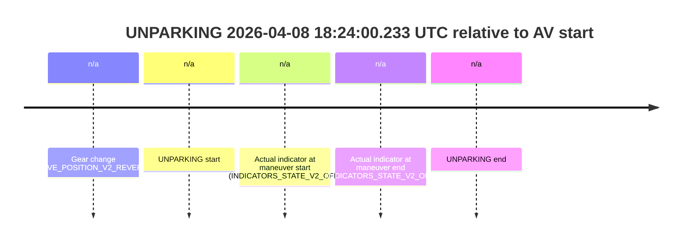

# Run Report: fme20038/2026-04-08--17-40-58--gen2-av-2c9f5b47-79e4-4bf2-a6a1-fa0e5571b743

| Field | Value |
|---|---|
| Run ID | `fme20038/2026-04-08--17-40-58--gen2-av-2c9f5b47-79e4-4bf2-a6a1-fa0e5571b743` |
| Date | `2026-04-08` |
| Model(s) | `lively-orange-horse` |
| Author | `guy.geva` |
| Event count | `7` |

## unpudo 2026-04-08 17:48:22.333 UTC

| Field | Value |
|---|---|
| Model | `lively-orange-horse` |
| Author | `guy.geva` |
| Run ID | `fme20038/2026-04-08--17-40-58--gen2-av-2c9f5b47-79e4-4bf2-a6a1-fa0e5571b743` |
| Date | `2026-04-08` |
| Time (UTC) | `17:48:22.333` |
| Event type | `unpudo` |
| Disengagement type | `failed_to_unpudo` |
| Route change | `found` |
| Console | [run](https://console.sso.wayve.ai/run/fme20038/2026-04-08--17-40-58--gen2-av-2c9f5b47-79e4-4bf2-a6a1-fa0e5571b743?id=&time-unixus=1775670502333302) |
| Foxglove | [segment](https://app.foxglove.dev/wayve-on-prem/p/prj_0dX18KZdVHg1fmmI/view?ds=foxglove-stream&ds.deviceName=fme20038&ds.start=2026-04-08T17%3A47%3A47.218271Z&ds.end=2026-04-08T17%3A50%3A59.796441Z&layoutId=lay_0e7VD4WIKDQGU73Y&time=2026-04-08T17%3A48%3A22.333302Z) |

### Event card: fail

- Fail: AV owns part of the segment, but the event still resolves as a model-performance failure under the AV-only scoring rule.

| Event | Time (UTC) | Delta from route change |
|---|---:|---:|
| Route change | 2026-04-08 17:47:57.218 | `0.000s` |
| AV engage | 2026-04-08 17:48:28.038 | `30.820s` |
| DBW -> true | 2026-04-08 17:48:28.038 | `30.820s` |
| Gear change (DRIVE_POSITION_V2_DRIVE) | 2026-04-08 17:47:57.533 | `0.315s` |
| UNPUDO start | 2026-04-08 17:48:22.333 | `25.115s` |
| Actual indicator at maneuver start (INDICATORS_STATE_V2_OFF) | 2026-04-08 17:48:22.333 | `25.115s` |
| First motion | 2026-04-08 17:48:22.371 | `25.153s` |
| DBW -> false | 2026-04-08 17:50:49.796 | `172.578s` |
| Actual indicator at maneuver end (INDICATORS_STATE_V2_OFF) | 2026-04-08 17:48:26.633 | `29.415s` |
| UNPUDO end | 2026-04-08 17:48:26.633 | `29.415s` |

| Metric | Value |
|---|---|
| Outcome | `fail` |
| Effective failure type | `failed_to_unpudo` |
| Route change status | `found` |
| DBW at event start | `false` |
| DBW at event end | `false` |
| Predicted gear at AV start | `DRIVE_POSITION_V2_DRIVE` |
| Actual gear at AV start | `DRIVE_POSITION_V2_DRIVE` |
| Predicted gear at event start | `DRIVE_POSITION_V2_DRIVE` |
| Actual gear at event start | `DRIVE_POSITION_V2_DRIVE` |
| Planned indicator direction | `INDICATORS_STATE_V2_RIGHT_ON` |
| Controller indicator direction | `INDICATORS_STATE_V2_RIGHT_ON` |
| Actual indicator direction | `INDICATORS_STATE_V2_OFF` |
| Actual indicator at maneuver end | `INDICATORS_STATE_V2_OFF` |
| Driver accel help in AV | `false` |
| Driver accel help timestamp | `n/a` |
| Max accel pedal pct in AV | `0.0%` |
| Max brake pedal pct in AV | `0.0%` |
| Max speed mps in AV | `0.000` |
| Route -> AV | `30.820s` |
| AV -> event start | `-5.705s` |
| AV -> first motion | `-5.667s` |
| AV duration before disengagement | `141.758s` |
| Trajectory waypoint count | `37` |
| Driving-plan step count | `11` |

The scored portion starts from the AV-owned window, not from the pre-AV setup. Route-change search in the stopped pre-event segment was `found`, with the baseline therefore set to route change. At the event anchor the model predicts `DRIVE_POSITION_V2_DRIVE` and the actual gear is `DRIVE_POSITION_V2_DRIVE`. The effective model outcome is `fail` because `failed_to_unpudo`.

### Resolution

| Field | Value |
|---|---|
| Final outcome | `fail` |
| Do we agree with this label? | `yes` |
| Source disengagement type | `failed_to_unpudo` |
| Resolved effective failure type | `failed_to_unpudo` |
| Confidence | `high` |

## unpudo 2026-04-08 17:50:50.633 UTC

| Field | Value |
|---|---|
| Model | `lively-orange-horse` |
| Author | `guy.geva` |
| Run ID | `fme20038/2026-04-08--17-40-58--gen2-av-2c9f5b47-79e4-4bf2-a6a1-fa0e5571b743` |
| Date | `2026-04-08` |
| Time (UTC) | `17:50:50.633` |
| Event type | `unpudo` |
| Disengagement type | `failed_to_unpudo` |
| Route change | `found` |
| Console | [run](https://console.sso.wayve.ai/run/fme20038/2026-04-08--17-40-58--gen2-av-2c9f5b47-79e4-4bf2-a6a1-fa0e5571b743?id=&time-unixus=1775670650633313) |
| Foxglove | [segment](https://app.foxglove.dev/wayve-on-prem/p/prj_0dX18KZdVHg1fmmI/view?ds=foxglove-stream&ds.deviceName=fme20038&ds.start=2026-04-08T17%3A50%3A20.918284Z&ds.end=2026-04-08T17%3A53%3A34.377242Z&layoutId=lay_0e7VD4WIKDQGU73Y&time=2026-04-08T17%3A50%3A50.633313Z) |

### Event card: fail

- Fail: AV owns part of the segment, but the event still resolves as a model-performance failure under the AV-only scoring rule.

| Event | Time (UTC) | Delta from route change |
|---|---:|---:|
| Route change | 2026-04-08 17:50:30.918 | `0.000s` |
| AV engage | 2026-04-08 17:50:58.397 | `27.479s` |
| DBW -> true | 2026-04-08 17:50:58.397 | `27.479s` |
| Gear change (DRIVE_POSITION_V2_DRIVE) | 2026-04-08 17:50:31.233 | `0.315s` |
| UNPUDO start | 2026-04-08 17:50:50.633 | `19.715s` |
| Actual indicator at maneuver start (INDICATORS_STATE_V2_OFF) | 2026-04-08 17:50:50.633 | `19.715s` |
| First motion | 2026-04-08 17:50:50.670 | `19.753s` |
| DBW -> false | 2026-04-08 17:53:24.377 | `173.459s` |
| Actual indicator at maneuver end (INDICATORS_STATE_V2_OFF) | 2026-04-08 17:50:56.083 | `25.165s` |
| UNPUDO end | 2026-04-08 17:50:56.083 | `25.165s` |

| Metric | Value |
|---|---|
| Outcome | `fail` |
| Effective failure type | `failed_to_unpudo` |
| Route change status | `found` |
| DBW at event start | `false` |
| DBW at event end | `false` |
| Predicted gear at AV start | `DRIVE_POSITION_V2_DRIVE` |
| Actual gear at AV start | `DRIVE_POSITION_V2_DRIVE` |
| Predicted gear at event start | `DRIVE_POSITION_V2_DRIVE` |
| Actual gear at event start | `DRIVE_POSITION_V2_DRIVE` |
| Planned indicator direction | `INDICATORS_STATE_V2_RIGHT_ON` |
| Controller indicator direction | `INDICATORS_STATE_V2_RIGHT_ON` |
| Actual indicator direction | `INDICATORS_STATE_V2_OFF` |
| Actual indicator at maneuver end | `INDICATORS_STATE_V2_OFF` |
| Driver accel help in AV | `false` |
| Driver accel help timestamp | `n/a` |
| Max accel pedal pct in AV | `0.0%` |
| Max brake pedal pct in AV | `0.0%` |
| Max speed mps in AV | `0.000` |
| Route -> AV | `27.479s` |
| AV -> event start | `-7.764s` |
| AV -> first motion | `-7.726s` |
| AV duration before disengagement | `145.980s` |
| Trajectory waypoint count | `37` |
| Driving-plan step count | `11` |

The scored portion starts from the AV-owned window, not from the pre-AV setup. Route-change search in the stopped pre-event segment was `found`, with the baseline therefore set to route change. At the event anchor the model predicts `DRIVE_POSITION_V2_DRIVE` and the actual gear is `DRIVE_POSITION_V2_DRIVE`. The effective model outcome is `fail` because `failed_to_unpudo`.

### Resolution

| Field | Value |
|---|---|
| Final outcome | `fail` |
| Do we agree with this label? | `yes` |
| Source disengagement type | `failed_to_unpudo` |
| Resolved effective failure type | `failed_to_unpudo` |
| Confidence | `high` |

## unpudo 2026-04-08 17:57:45.933 UTC

| Field | Value |
|---|---|
| Model | `lively-orange-horse` |
| Author | `guy.geva` |
| Run ID | `fme20038/2026-04-08--17-40-58--gen2-av-2c9f5b47-79e4-4bf2-a6a1-fa0e5571b743` |
| Date | `2026-04-08` |
| Time (UTC) | `17:57:45.933` |
| Event type | `unpudo` |
| Disengagement type | `failed_to_unpudo` |
| Route change | `found` |
| Console | [run](https://console.sso.wayve.ai/run/fme20038/2026-04-08--17-40-58--gen2-av-2c9f5b47-79e4-4bf2-a6a1-fa0e5571b743?id=&time-unixus=1775671065933315) |
| Foxglove | [segment](https://app.foxglove.dev/wayve-on-prem/p/prj_0dX18KZdVHg1fmmI/view?ds=foxglove-stream&ds.deviceName=fme20038&ds.start=2026-04-08T17%3A57%3A19.618248Z&ds.end=2026-04-08T17%3A58%3A56.239626Z&layoutId=lay_0e7VD4WIKDQGU73Y&time=2026-04-08T17%3A57%3A45.933315Z) |

### Event card: fail

- Fail: AV owns part of the segment, but the event still resolves as a model-performance failure under the AV-only scoring rule.

| Event | Time (UTC) | Delta from route change |
|---|---:|---:|
| Route change | 2026-04-08 17:57:29.618 | `0.000s` |
| AV engage | 2026-04-08 17:57:50.957 | `21.339s` |
| DBW -> true | 2026-04-08 17:57:50.957 | `21.339s` |
| Gear change (DRIVE_POSITION_V2_DRIVE) | 2026-04-08 17:57:29.933 | `0.315s` |
| UNPUDO start | 2026-04-08 17:57:45.933 | `16.315s` |
| Actual indicator at maneuver start (INDICATORS_STATE_V2_OFF) | 2026-04-08 17:57:45.933 | `16.315s` |
| First motion | 2026-04-08 17:57:46.050 | `16.432s` |
| DBW -> false | 2026-04-08 17:58:46.239 | `76.621s` |
| Actual indicator at maneuver end (INDICATORS_STATE_V2_OFF) | 2026-04-08 17:57:49.883 | `20.265s` |
| UNPUDO end | 2026-04-08 17:57:49.883 | `20.265s` |

| Metric | Value |
|---|---|
| Outcome | `fail` |
| Effective failure type | `failed_to_unpudo` |
| Route change status | `found` |
| DBW at event start | `false` |
| DBW at event end | `false` |
| Predicted gear at AV start | `DRIVE_POSITION_V2_DRIVE` |
| Actual gear at AV start | `DRIVE_POSITION_V2_DRIVE` |
| Predicted gear at event start | `DRIVE_POSITION_V2_DRIVE` |
| Actual gear at event start | `DRIVE_POSITION_V2_DRIVE` |
| Planned indicator direction | `INDICATORS_STATE_V2_LEFT_ON` |
| Controller indicator direction | `INDICATORS_STATE_V2_LEFT_ON` |
| Actual indicator direction | `INDICATORS_STATE_V2_OFF` |
| Actual indicator at maneuver end | `INDICATORS_STATE_V2_OFF` |
| Driver accel help in AV | `false` |
| Driver accel help timestamp | `n/a` |
| Max accel pedal pct in AV | `0.0%` |
| Max brake pedal pct in AV | `0.0%` |
| Max speed mps in AV | `0.000` |
| Route -> AV | `21.339s` |
| AV -> event start | `-5.024s` |
| AV -> first motion | `-4.907s` |
| AV duration before disengagement | `55.282s` |
| Trajectory waypoint count | `37` |
| Driving-plan step count | `11` |

The scored portion starts from the AV-owned window, not from the pre-AV setup. Route-change search in the stopped pre-event segment was `found`, with the baseline therefore set to route change. At the event anchor the model predicts `DRIVE_POSITION_V2_DRIVE` and the actual gear is `DRIVE_POSITION_V2_DRIVE`. The effective model outcome is `fail` because `failed_to_unpudo`.

### Resolution

| Field | Value |
|---|---|
| Final outcome | `fail` |
| Do we agree with this label? | `yes` |
| Source disengagement type | `failed_to_unpudo` |
| Resolved effective failure type | `failed_to_unpudo` |
| Confidence | `high` |

## unpudo 2026-04-08 17:58:46.783 UTC

| Field | Value |
|---|---|
| Model | `lively-orange-horse` |
| Author | `guy.geva` |
| Run ID | `fme20038/2026-04-08--17-40-58--gen2-av-2c9f5b47-79e4-4bf2-a6a1-fa0e5571b743` |
| Date | `2026-04-08` |
| Time (UTC) | `17:58:46.783` |
| Event type | `unpudo` |
| Disengagement type | `failed_to_unpudo` |
| Route change | `found` |
| Console | [run](https://console.sso.wayve.ai/run/fme20038/2026-04-08--17-40-58--gen2-av-2c9f5b47-79e4-4bf2-a6a1-fa0e5571b743?id=&time-unixus=1775671126783322) |
| Foxglove | [segment](https://app.foxglove.dev/wayve-on-prem/p/prj_0dX18KZdVHg1fmmI/view?ds=foxglove-stream&ds.deviceName=fme20038&ds.start=2026-04-08T17%3A57%3A19.618248Z&ds.end=2026-04-08T18%3A01%3A13.417324Z&layoutId=lay_0e7VD4WIKDQGU73Y&time=2026-04-08T17%3A58%3A46.783322Z) |

### Event card: fail

- Fail: AV owns part of the segment, but the event still resolves as a model-performance failure under the AV-only scoring rule.

| Event | Time (UTC) | Delta from route change |
|---|---:|---:|
| Route change | 2026-04-08 17:57:29.618 | `0.000s` |
| AV engage | 2026-04-08 17:58:52.258 | `82.640s` |
| DBW -> true | 2026-04-08 17:58:52.258 | `82.640s` |
| Gear change (DRIVE_POSITION_V2_DRIVE) | 2026-04-08 17:58:35.033 | `65.415s` |
| UNPUDO start | 2026-04-08 17:58:46.783 | `77.165s` |
| Actual indicator at maneuver start (INDICATORS_STATE_V2_OFF) | 2026-04-08 17:58:46.783 | `77.165s` |
| First motion | 2026-04-08 17:58:46.810 | `77.192s` |
| DBW -> false | 2026-04-08 18:01:03.417 | `213.799s` |
| Actual indicator at maneuver end (INDICATORS_STATE_V2_OFF) | 2026-04-08 17:58:50.133 | `80.515s` |
| UNPUDO end | 2026-04-08 17:58:50.133 | `80.515s` |

| Metric | Value |
|---|---|
| Outcome | `fail` |
| Effective failure type | `failed_to_unpudo` |
| Route change status | `found` |
| DBW at event start | `false` |
| DBW at event end | `false` |
| Predicted gear at AV start | `DRIVE_POSITION_V2_DRIVE` |
| Actual gear at AV start | `DRIVE_POSITION_V2_DRIVE` |
| Predicted gear at event start | `DRIVE_POSITION_V2_DRIVE` |
| Actual gear at event start | `DRIVE_POSITION_V2_DRIVE` |
| Planned indicator direction | `INDICATORS_STATE_V2_RIGHT_ON` |
| Controller indicator direction | `INDICATORS_STATE_V2_RIGHT_ON` |
| Actual indicator direction | `INDICATORS_STATE_V2_OFF` |
| Actual indicator at maneuver end | `INDICATORS_STATE_V2_OFF` |
| Driver accel help in AV | `false` |
| Driver accel help timestamp | `n/a` |
| Max accel pedal pct in AV | `0.0%` |
| Max brake pedal pct in AV | `0.0%` |
| Max speed mps in AV | `0.000` |
| Route -> AV | `82.640s` |
| AV -> event start | `-5.475s` |
| AV -> first motion | `-5.448s` |
| AV duration before disengagement | `131.159s` |
| Trajectory waypoint count | `36` |
| Driving-plan step count | `11` |

The scored portion starts from the AV-owned window, not from the pre-AV setup. Route-change search in the stopped pre-event segment was `found`, with the baseline therefore set to route change. At the event anchor the model predicts `DRIVE_POSITION_V2_DRIVE` and the actual gear is `DRIVE_POSITION_V2_DRIVE`. The effective model outcome is `fail` because `failed_to_unpudo`.

### Resolution

| Field | Value |
|---|---|
| Final outcome | `fail` |
| Do we agree with this label? | `yes` |
| Source disengagement type | `failed_to_unpudo` |
| Resolved effective failure type | `failed_to_unpudo` |
| Confidence | `high` |

## unpudo 2026-04-08 18:02:12.933 UTC

| Field | Value |
|---|---|
| Model | `lively-orange-horse` |
| Author | `guy.geva` |
| Run ID | `fme20038/2026-04-08--17-40-58--gen2-av-2c9f5b47-79e4-4bf2-a6a1-fa0e5571b743` |
| Date | `2026-04-08` |
| Time (UTC) | `18:02:12.933` |
| Event type | `unpudo` |
| Disengagement type | `failed_to_unpudo` |
| Route change | `found` |
| Console | [run](https://console.sso.wayve.ai/run/fme20038/2026-04-08--17-40-58--gen2-av-2c9f5b47-79e4-4bf2-a6a1-fa0e5571b743?id=&time-unixus=1775671332933301) |
| Foxglove | [segment](https://app.foxglove.dev/wayve-on-prem/p/prj_0dX18KZdVHg1fmmI/view?ds=foxglove-stream&ds.deviceName=fme20038&ds.start=2026-04-08T18%3A01%3A46.218271Z&ds.end=2026-04-08T18%3A06%3A41.756585Z&layoutId=lay_0e7VD4WIKDQGU73Y&time=2026-04-08T18%3A02%3A12.933301Z) |

### Event card: fail

- Fail: AV owns part of the segment, but the event still resolves as a model-performance failure under the AV-only scoring rule.

| Event | Time (UTC) | Delta from route change |
|---|---:|---:|
| Route change | 2026-04-08 18:01:56.218 | `0.000s` |
| AV engage | 2026-04-08 18:02:19.558 | `23.340s` |
| DBW -> true | 2026-04-08 18:02:19.558 | `23.340s` |
| Gear change (DRIVE_POSITION_V2_DRIVE) | 2026-04-08 18:02:01.933 | `5.715s` |
| UNPUDO start | 2026-04-08 18:02:12.933 | `16.715s` |
| Actual indicator at maneuver start (INDICATORS_STATE_V2_OFF) | 2026-04-08 18:02:12.933 | `16.715s` |
| First motion | 2026-04-08 18:02:12.950 | `16.732s` |
| DBW -> false | 2026-04-08 18:06:31.756 | `275.538s` |
| Actual indicator at maneuver end (INDICATORS_STATE_V2_OFF) | 2026-04-08 18:02:16.583 | `20.365s` |
| UNPUDO end | 2026-04-08 18:02:16.583 | `20.365s` |

| Metric | Value |
|---|---|
| Outcome | `fail` |
| Effective failure type | `failed_to_unpudo` |
| Route change status | `found` |
| DBW at event start | `false` |
| DBW at event end | `false` |
| Predicted gear at AV start | `DRIVE_POSITION_V2_DRIVE` |
| Actual gear at AV start | `DRIVE_POSITION_V2_DRIVE` |
| Predicted gear at event start | `DRIVE_POSITION_V2_DRIVE` |
| Actual gear at event start | `DRIVE_POSITION_V2_DRIVE` |
| Planned indicator direction | `INDICATORS_STATE_V2_RIGHT_ON` |
| Controller indicator direction | `INDICATORS_STATE_V2_RIGHT_ON` |
| Actual indicator direction | `INDICATORS_STATE_V2_OFF` |
| Actual indicator at maneuver end | `INDICATORS_STATE_V2_OFF` |
| Driver accel help in AV | `false` |
| Driver accel help timestamp | `n/a` |
| Max accel pedal pct in AV | `0.0%` |
| Max brake pedal pct in AV | `0.0%` |
| Max speed mps in AV | `0.000` |
| Route -> AV | `23.340s` |
| AV -> event start | `-6.625s` |
| AV -> first motion | `-6.608s` |
| AV duration before disengagement | `252.198s` |
| Trajectory waypoint count | `37` |
| Driving-plan step count | `11` |

The scored portion starts from the AV-owned window, not from the pre-AV setup. Route-change search in the stopped pre-event segment was `found`, with the baseline therefore set to route change. At the event anchor the model predicts `DRIVE_POSITION_V2_DRIVE` and the actual gear is `DRIVE_POSITION_V2_DRIVE`. The effective model outcome is `fail` because `failed_to_unpudo`.

### Resolution

| Field | Value |
|---|---|
| Final outcome | `fail` |
| Do we agree with this label? | `yes` |
| Source disengagement type | `failed_to_unpudo` |
| Resolved effective failure type | `failed_to_unpudo` |
| Confidence | `high` |

## unpudo 2026-04-08 18:20:21.133 UTC

| Field | Value |
|---|---|
| Model | `lively-orange-horse` |
| Author | `guy.geva` |
| Run ID | `fme20038/2026-04-08--17-40-58--gen2-av-2c9f5b47-79e4-4bf2-a6a1-fa0e5571b743` |
| Date | `2026-04-08` |
| Time (UTC) | `18:20:21.133` |
| Event type | `unpudo` |
| Disengagement type | `failed_to_unpudo` |
| Route change | `found` |
| Console | [run](https://console.sso.wayve.ai/run/fme20038/2026-04-08--17-40-58--gen2-av-2c9f5b47-79e4-4bf2-a6a1-fa0e5571b743?id=&time-unixus=1775672421133315) |
| Foxglove | [segment](https://app.foxglove.dev/wayve-on-prem/p/prj_0dX18KZdVHg1fmmI/view?ds=foxglove-stream&ds.deviceName=fme20038&ds.start=2026-04-08T18%3A20%3A02.118804Z&ds.end=2026-04-08T18%3A23%3A05.337159Z&layoutId=lay_0e7VD4WIKDQGU73Y&time=2026-04-08T18%3A20%3A21.133315Z) |

### Event card: fail

- Fail: AV owns part of the segment, but the event still resolves as a model-performance failure under the AV-only scoring rule.

| Event | Time (UTC) | Delta from route change |
|---|---:|---:|
| Route change | 2026-04-08 18:20:12.118 | `0.000s` |
| AV engage | 2026-04-08 18:20:28.037 | `15.918s` |
| DBW -> true | 2026-04-08 18:20:28.037 | `15.918s` |
| Gear change (DRIVE_POSITION_V2_DRIVE) | 2026-04-08 18:20:12.433 | `0.315s` |
| UNPUDO start | 2026-04-08 18:20:21.133 | `9.015s` |
| Actual indicator at maneuver start (INDICATORS_STATE_V2_RIGHT_ON) | 2026-04-08 18:20:21.133 | `9.015s` |
| First motion | 2026-04-08 18:20:21.310 | `9.192s` |
| DBW -> false | 2026-04-08 18:22:55.337 | `163.218s` |
| Actual indicator at maneuver end (INDICATORS_STATE_V2_OFF) | 2026-04-08 18:20:25.483 | `13.365s` |
| UNPUDO end | 2026-04-08 18:20:25.483 | `13.365s` |

| Metric | Value |
|---|---|
| Outcome | `fail` |
| Effective failure type | `failed_to_unpudo` |
| Route change status | `found` |
| DBW at event start | `false` |
| DBW at event end | `false` |
| Predicted gear at AV start | `DRIVE_POSITION_V2_DRIVE` |
| Actual gear at AV start | `DRIVE_POSITION_V2_DRIVE` |
| Predicted gear at event start | `DRIVE_POSITION_V2_DRIVE` |
| Actual gear at event start | `DRIVE_POSITION_V2_DRIVE` |
| Planned indicator direction | `INDICATORS_STATE_V2_RIGHT_ON` |
| Controller indicator direction | `INDICATORS_STATE_V2_RIGHT_ON` |
| Actual indicator direction | `INDICATORS_STATE_V2_RIGHT_ON` |
| Actual indicator at maneuver end | `INDICATORS_STATE_V2_OFF` |
| Driver accel help in AV | `false` |
| Driver accel help timestamp | `n/a` |
| Max accel pedal pct in AV | `0.0%` |
| Max brake pedal pct in AV | `0.0%` |
| Max speed mps in AV | `0.000` |
| Route -> AV | `15.918s` |
| AV -> event start | `-6.904s` |
| AV -> first motion | `-6.726s` |
| AV duration before disengagement | `147.300s` |
| Trajectory waypoint count | `37` |
| Driving-plan step count | `11` |

The scored portion starts from the AV-owned window, not from the pre-AV setup. Route-change search in the stopped pre-event segment was `found`, with the baseline therefore set to route change. At the event anchor the model predicts `DRIVE_POSITION_V2_DRIVE` and the actual gear is `DRIVE_POSITION_V2_DRIVE`. The effective model outcome is `fail` because `failed_to_unpudo`.

### Resolution

| Field | Value |
|---|---|
| Final outcome | `fail` |
| Do we agree with this label? | `yes` |
| Source disengagement type | `failed_to_unpudo` |
| Resolved effective failure type | `failed_to_unpudo` |
| Confidence | `high` |

## unparking 2026-04-08 18:24:00.233 UTC

| Field | Value |
|---|---|
| Model | `lively-orange-horse` |
| Author | `guy.geva` |
| Run ID | `fme20038/2026-04-08--17-40-58--gen2-av-2c9f5b47-79e4-4bf2-a6a1-fa0e5571b743` |
| Date | `2026-04-08` |
| Time (UTC) | `18:24:00.233` |
| Event type | `unparking` |
| Disengagement type | `failed_to_pudo` |
| Route change | `unclear` |
| Console | [run](https://console.sso.wayve.ai/run/fme20038/2026-04-08--17-40-58--gen2-av-2c9f5b47-79e4-4bf2-a6a1-fa0e5571b743?id=&time-unixus=1775672640233317) |
| Foxglove | [segment](https://app.foxglove.dev/wayve-on-prem/p/prj_0dX18KZdVHg1fmmI/view?ds=foxglove-stream&ds.deviceName=fme20038&ds.start=2026-04-08T18%3A23%3A45.933298Z&ds.end=2026-04-08T18%3A24%3A36.833303Z&layoutId=lay_0e7VD4WIKDQGU73Y&time=2026-04-08T18%3A24%3A00.233317Z) |

### Event card: fail

- Fail: AV owns part of the segment, but the event still resolves as a model-performance failure under the AV-only scoring rule.

| Event | Time (UTC) | Delta from AV start |
|---|---:|---:|
| Gear change (DRIVE_POSITION_V2_REVERSE) | 2026-04-08 18:23:55.933 | `n/a` |
| UNPARKING start | 2026-04-08 18:24:00.233 | `n/a` |
| Actual indicator at maneuver start (INDICATORS_STATE_V2_OFF) | 2026-04-08 18:24:00.233 | `n/a` |
| Actual indicator at maneuver end (INDICATORS_STATE_V2_OFF) | 2026-04-08 18:24:26.833 | `n/a` |
| UNPARKING end | 2026-04-08 18:24:26.833 | `n/a` |

| Metric | Value |
|---|---|
| Outcome | `fail` |
| Effective failure type | `failed_to_pudo` |
| Route change status | `unclear` |
| DBW at event start | `false` |
| DBW at event end | `false` |
| Predicted gear at AV start | `n/a` |
| Actual gear at AV start | `n/a` |
| Predicted gear at event start | `DRIVE_POSITION_V2_DRIVE` |
| Actual gear at event start | `DRIVE_POSITION_V2_REVERSE` |
| Planned indicator direction | `INDICATORS_STATE_V2_OFF` |
| Controller indicator direction | `INDICATORS_STATE_V2_OFF` |
| Actual indicator direction | `INDICATORS_STATE_V2_OFF` |
| Actual indicator at maneuver end | `INDICATORS_STATE_V2_OFF` |
| Driver accel help in AV | `false` |
| Driver accel help timestamp | `n/a` |
| Max accel pedal pct in AV | `0.0%` |
| Max brake pedal pct in AV | `0.0%` |
| Max speed mps in AV | `0.000` |
| Route -> AV | `n/a` |
| AV -> event start | `n/a` |
| AV -> first motion | `n/a` |
| AV duration before disengagement | `n/a` |
| Trajectory waypoint count | `37` |
| Driving-plan step count | `11` |

The scored portion starts from the AV-owned window, not from the pre-AV setup. Route-change search in the stopped pre-event segment was `unclear`, with the baseline therefore set to AV start. At the event anchor the model predicts `DRIVE_POSITION_V2_DRIVE` and the actual gear is `DRIVE_POSITION_V2_REVERSE`. The effective model outcome is `fail` because `failed_to_pudo`.

### Resolution

| Field | Value |
|---|---|
| Final outcome | `fail` |
| Do we agree with this label? | `yes` |
| Source disengagement type | `failed_to_pudo` |
| Resolved effective failure type | `failed_to_pudo` |
| Confidence | `medium` |
