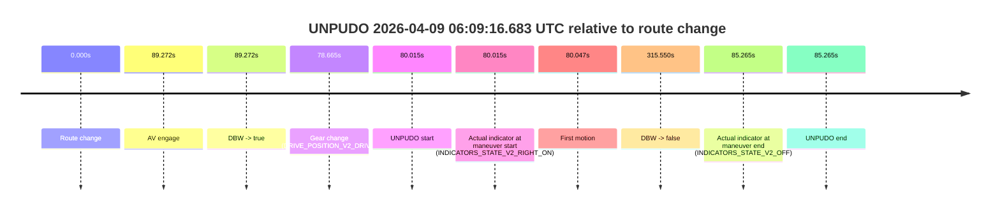
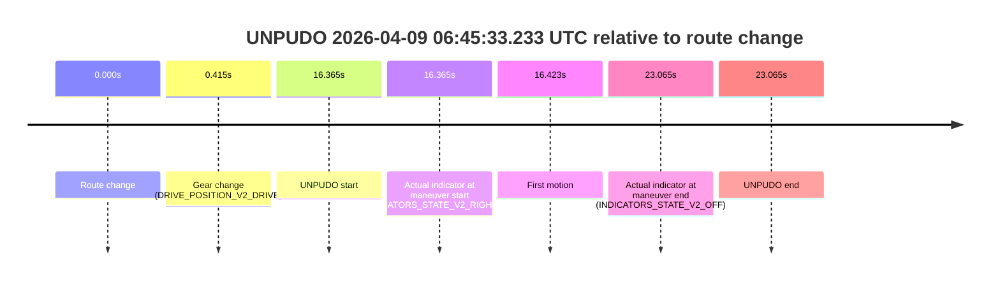
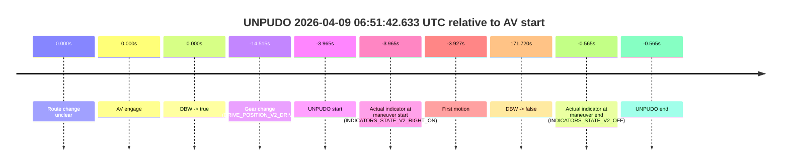
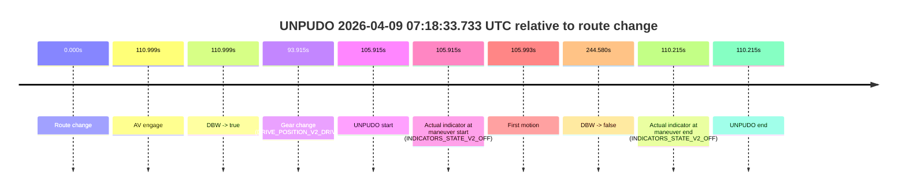
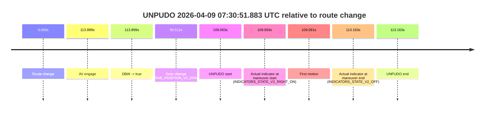

# Run Report: fme20038/2026-04-09--06-05-37--gen2-av-3f20cfc8-9025-4773-8ccc-cc8a2eaecac6

| Field | Value |
|---|---|
| Run ID | `fme20038/2026-04-09--06-05-37--gen2-av-3f20cfc8-9025-4773-8ccc-cc8a2eaecac6` |
| Date | `2026-04-09` |
| Model(s) | `lively-orange-horse` |
| Author | `guy.geva` |
| Event count | `16` |

## unpudo 2026-04-09 06:09:16.683 UTC

| Field | Value |
|---|---|
| Model | `lively-orange-horse` |
| Author | `guy.geva` |
| Run ID | `fme20038/2026-04-09--06-05-37--gen2-av-3f20cfc8-9025-4773-8ccc-cc8a2eaecac6` |
| Date | `2026-04-09` |
| Time (UTC) | `06:09:16.683` |
| Event type | `unpudo` |
| Disengagement type | `none observed` |
| Route change | `found` |
| Console | [run](https://console.sso.wayve.ai/run/fme20038/2026-04-09--06-05-37--gen2-av-3f20cfc8-9025-4773-8ccc-cc8a2eaecac6?id=&time-unixus=1775714956683316) |
| Foxglove | [segment](https://app.foxglove.dev/wayve-on-prem/p/prj_0dX18KZdVHg1fmmI/view?ds=foxglove-stream&ds.deviceName=fme20038&ds.start=2026-04-09T06%3A07%3A46.668376Z&ds.end=2026-04-09T06%3A13%3A22.218177Z&layoutId=lay_0e7VD4WIKDQGU73Y&time=2026-04-09T06%3A09%3A16.683316Z) |

### Event card: fail

- Fail: the credited unpudo does not stay AV-owned. The event window starts with DBW false, and the maneuver outcome lands outside a clean AV-owned segment.

| Event | Time (UTC) | Delta from route change |
|---|---:|---:|
| Route change | 2026-04-09 06:07:56.668 | `0.000s` |
| AV engage | 2026-04-09 06:09:25.940 | `89.272s` |
| DBW -> true | 2026-04-09 06:09:25.940 | `89.272s` |
| Gear change (DRIVE_POSITION_V2_DRIVE) | 2026-04-09 06:09:15.333 | `78.665s` |
| UNPUDO start | 2026-04-09 06:09:16.683 | `80.015s` |
| Actual indicator at maneuver start (INDICATORS_STATE_V2_RIGHT_ON) | 2026-04-09 06:09:16.683 | `80.015s` |
| First motion | 2026-04-09 06:09:16.715 | `80.047s` |
| DBW -> false | 2026-04-09 06:13:12.218 | `315.550s` |
| Actual indicator at maneuver end (INDICATORS_STATE_V2_OFF) | 2026-04-09 06:09:21.933 | `85.265s` |
| UNPUDO end | 2026-04-09 06:09:21.933 | `85.265s` |

| Metric | Value |
|---|---|
| Outcome | `fail` |
| Effective failure type | `completed_outside_av` |
| Route change status | `found` |
| DBW at event start | `false` |
| DBW at event end | `false` |
| Predicted gear at AV start | `DRIVE_POSITION_V2_DRIVE` |
| Actual gear at AV start | `DRIVE_POSITION_V2_DRIVE` |
| Predicted gear at event start | `DRIVE_POSITION_V2_DRIVE` |
| Actual gear at event start | `DRIVE_POSITION_V2_DRIVE` |
| Planned indicator direction | `INDICATORS_STATE_V2_RIGHT_ON` |
| Controller indicator direction | `INDICATORS_STATE_V2_RIGHT_ON` |
| Actual indicator direction | `INDICATORS_STATE_V2_RIGHT_ON` |
| Actual indicator at maneuver end | `INDICATORS_STATE_V2_OFF` |
| Driver accel help in AV | `false` |
| Driver accel help timestamp | `n/a` |
| Max accel pedal pct in AV | `0.0%` |
| Max brake pedal pct in AV | `0.0%` |
| Max speed mps in AV | `0.000` |
| Route -> AV | `89.272s` |
| AV -> event start | `-9.257s` |
| AV -> first motion | `-9.225s` |
| AV duration before disengagement | `226.278s` |
| Trajectory waypoint count | `37` |
| Driving-plan step count | `11` |

The scored portion starts from the AV-owned window, not from the pre-AV setup. Route-change search in the stopped pre-event segment was `found`, with the baseline therefore set to route change. At the event anchor the model predicts `DRIVE_POSITION_V2_DRIVE` and the actual gear is `DRIVE_POSITION_V2_DRIVE`. The effective model outcome is `fail` because `completed_outside_av`.

### Resolution

| Field | Value |
|---|---|
| Final outcome | `fail` |
| Do we agree with this label? | `yes` |
| Source disengagement type | `none observed` |
| Resolved effective failure type | `completed_outside_av` |
| Confidence | `high` |

## unpudo 2026-04-09 06:13:18.183 UTC

| Field | Value |
|---|---|
| Model | `lively-orange-horse` |
| Author | `guy.geva` |
| Run ID | `fme20038/2026-04-09--06-05-37--gen2-av-3f20cfc8-9025-4773-8ccc-cc8a2eaecac6` |
| Date | `2026-04-09` |
| Time (UTC) | `06:13:18.183` |
| Event type | `unpudo` |
| Disengagement type | `failed_to_unpudo` |
| Route change | `found` |
| Console | [run](https://console.sso.wayve.ai/run/fme20038/2026-04-09--06-05-37--gen2-av-3f20cfc8-9025-4773-8ccc-cc8a2eaecac6?id=&time-unixus=1775715198183316) |
| Foxglove | [segment](https://app.foxglove.dev/wayve-on-prem/p/prj_0dX18KZdVHg1fmmI/view?ds=foxglove-stream&ds.deviceName=fme20038&ds.start=2026-04-09T06%3A12%3A45.818330Z&ds.end=2026-04-09T06%3A15%3A56.940049Z&layoutId=lay_0e7VD4WIKDQGU73Y&time=2026-04-09T06%3A13%3A18.183316Z) |

### Event card: fail

- Fail: AV owns part of the segment, but the event still resolves as a model-performance failure under the AV-only scoring rule.

| Event | Time (UTC) | Delta from route change |
|---|---:|---:|
| Route change | 2026-04-09 06:12:55.818 | `0.000s` |
| AV engage | 2026-04-09 06:13:38.298 | `42.480s` |
| DBW -> true | 2026-04-09 06:13:38.298 | `42.480s` |
| Gear change (DRIVE_POSITION_V2_REVERSE) | 2026-04-09 06:13:13.333 | `17.515s` |
| UNPUDO start | 2026-04-09 06:13:18.183 | `22.365s` |
| Actual indicator at maneuver start (INDICATORS_STATE_V2_OFF) | 2026-04-09 06:13:18.183 | `22.365s` |
| First motion | 2026-04-09 06:13:32.675 | `36.857s` |
| DBW -> false | 2026-04-09 06:15:46.940 | `171.122s` |
| Actual indicator at maneuver end (INDICATORS_STATE_V2_OFF) | 2026-04-09 06:13:35.883 | `40.065s` |
| UNPUDO end | 2026-04-09 06:13:35.883 | `40.065s` |

| Metric | Value |
|---|---|
| Outcome | `fail` |
| Effective failure type | `failed_to_unpudo` |
| Route change status | `found` |
| DBW at event start | `false` |
| DBW at event end | `false` |
| Predicted gear at AV start | `DRIVE_POSITION_V2_DRIVE` |
| Actual gear at AV start | `DRIVE_POSITION_V2_DRIVE` |
| Predicted gear at event start | `DRIVE_POSITION_V2_DRIVE` |
| Actual gear at event start | `DRIVE_POSITION_V2_REVERSE` |
| Planned indicator direction | `INDICATORS_STATE_V2_RIGHT_ON` |
| Controller indicator direction | `INDICATORS_STATE_V2_RIGHT_ON` |
| Actual indicator direction | `INDICATORS_STATE_V2_OFF` |
| Actual indicator at maneuver end | `INDICATORS_STATE_V2_OFF` |
| Driver accel help in AV | `false` |
| Driver accel help timestamp | `n/a` |
| Max accel pedal pct in AV | `0.0%` |
| Max brake pedal pct in AV | `0.0%` |
| Max speed mps in AV | `0.000` |
| Route -> AV | `42.480s` |
| AV -> event start | `-20.115s` |
| AV -> first motion | `-5.623s` |
| AV duration before disengagement | `128.641s` |
| Trajectory waypoint count | `37` |
| Driving-plan step count | `11` |

The scored portion starts from the AV-owned window, not from the pre-AV setup. Route-change search in the stopped pre-event segment was `found`, with the baseline therefore set to route change. At the event anchor the model predicts `DRIVE_POSITION_V2_DRIVE` and the actual gear is `DRIVE_POSITION_V2_REVERSE`. The effective model outcome is `fail` because `failed_to_unpudo`.

### Resolution

| Field | Value |
|---|---|
| Final outcome | `fail` |
| Do we agree with this label? | `yes` |
| Source disengagement type | `failed_to_unpudo` |
| Resolved effective failure type | `failed_to_unpudo` |
| Confidence | `high` |

## unpudo 2026-04-09 06:22:45.133 UTC

| Field | Value |
|---|---|
| Model | `lively-orange-horse` |
| Author | `guy.geva` |
| Run ID | `fme20038/2026-04-09--06-05-37--gen2-av-3f20cfc8-9025-4773-8ccc-cc8a2eaecac6` |
| Date | `2026-04-09` |
| Time (UTC) | `06:22:45.133` |
| Event type | `unpudo` |
| Disengagement type | `failed_to_slow` |
| Route change | `found` |
| Console | [run](https://console.sso.wayve.ai/run/fme20038/2026-04-09--06-05-37--gen2-av-3f20cfc8-9025-4773-8ccc-cc8a2eaecac6?id=&time-unixus=1775715765133300) |
| Foxglove | [segment](https://app.foxglove.dev/wayve-on-prem/p/prj_0dX18KZdVHg1fmmI/view?ds=foxglove-stream&ds.deviceName=fme20038&ds.start=2026-04-09T06%3A22%3A20.268255Z&ds.end=2026-04-09T06%3A22%3A59.533302Z&layoutId=lay_0e7VD4WIKDQGU73Y&time=2026-04-09T06%3A22%3A45.133300Z) |

### Event card: fail

- Fail: AV owns part of the segment, but the event still resolves as a model-performance failure under the AV-only scoring rule.

| Event | Time (UTC) | Delta from route change |
|---|---:|---:|
| Route change | 2026-04-09 06:22:30.268 | `0.000s` |
| AV engage | 2026-04-09 06:22:37.918 | `7.651s` |
| DBW -> true | 2026-04-09 06:22:37.918 | `7.651s` |
| Gear change (DRIVE_POSITION_V2_DRIVE) | 2026-04-09 06:22:38.383 | `8.115s` |
| UNPUDO start | 2026-04-09 06:22:45.133 | `14.865s` |
| Actual indicator at maneuver start (INDICATORS_STATE_V2_OFF) | 2026-04-09 06:22:45.133 | `14.865s` |
| First motion | 2026-04-09 06:22:45.174 | `14.907s` |
| DBW -> false | 2026-04-09 06:22:47.278 | `17.011s` |
| Actual indicator at maneuver end (INDICATORS_STATE_V2_OFF) | 2026-04-09 06:22:49.533 | `19.265s` |
| UNPUDO end | 2026-04-09 06:22:49.533 | `19.265s` |

| Metric | Value |
|---|---|
| Outcome | `fail` |
| Effective failure type | `failed_to_slow` |
| Route change status | `found` |
| DBW at event start | `true` |
| DBW at event end | `false` |
| Predicted gear at AV start | `DRIVE_POSITION_V2_DRIVE` |
| Actual gear at AV start | `DRIVE_POSITION_V2_PARK` |
| Predicted gear at event start | `DRIVE_POSITION_V2_DRIVE` |
| Actual gear at event start | `DRIVE_POSITION_V2_DRIVE` |
| Planned indicator direction | `INDICATORS_STATE_V2_RIGHT_ON` |
| Controller indicator direction | `INDICATORS_STATE_V2_RIGHT_ON` |
| Actual indicator direction | `INDICATORS_STATE_V2_OFF` |
| Actual indicator at maneuver end | `INDICATORS_STATE_V2_OFF` |
| Driver accel help in AV | `false` |
| Driver accel help timestamp | `n/a` |
| Max accel pedal pct in AV | `0.0%` |
| Max brake pedal pct in AV | `8.0%` |
| Max speed mps in AV | `3.047` |
| Route -> AV | `7.651s` |
| AV -> event start | `7.214s` |
| AV -> first motion | `7.256s` |
| AV duration before disengagement | `9.360s` |
| Trajectory waypoint count | `36` |
| Driving-plan step count | `11` |

The scored portion starts from the AV-owned window, not from the pre-AV setup. Route-change search in the stopped pre-event segment was `found`, with the baseline therefore set to route change. At the event anchor the model predicts `DRIVE_POSITION_V2_DRIVE` and the actual gear is `DRIVE_POSITION_V2_DRIVE`. The effective model outcome is `fail` because `failed_to_slow`.

### Resolution

| Field | Value |
|---|---|
| Final outcome | `fail` |
| Do we agree with this label? | `yes` |
| Source disengagement type | `failed_to_slow` |
| Resolved effective failure type | `failed_to_slow` |
| Confidence | `high` |

## unpudo 2026-04-09 06:25:24.733 UTC

| Field | Value |
|---|---|
| Model | `lively-orange-horse` |
| Author | `guy.geva` |
| Run ID | `fme20038/2026-04-09--06-05-37--gen2-av-3f20cfc8-9025-4773-8ccc-cc8a2eaecac6` |
| Date | `2026-04-09` |
| Time (UTC) | `06:25:24.733` |
| Event type | `unpudo` |
| Disengagement type | `failed_to_unpudo` |
| Route change | `found` |
| Console | [run](https://console.sso.wayve.ai/run/fme20038/2026-04-09--06-05-37--gen2-av-3f20cfc8-9025-4773-8ccc-cc8a2eaecac6?id=&time-unixus=1775715924733299) |
| Foxglove | [segment](https://app.foxglove.dev/wayve-on-prem/p/prj_0dX18KZdVHg1fmmI/view?ds=foxglove-stream&ds.deviceName=fme20038&ds.start=2026-04-09T06%3A25%3A03.468345Z&ds.end=2026-04-09T06%3A26%3A41.900116Z&layoutId=lay_0e7VD4WIKDQGU73Y&time=2026-04-09T06%3A25%3A24.733299Z) |

### Event card: fail

- Fail: AV owns part of the segment, but the event still resolves as a model-performance failure under the AV-only scoring rule.

| Event | Time (UTC) | Delta from route change |
|---|---:|---:|
| Route change | 2026-04-09 06:25:13.468 | `0.000s` |
| AV engage | 2026-04-09 06:25:31.860 | `18.392s` |
| DBW -> true | 2026-04-09 06:25:31.860 | `18.392s` |
| Gear change (DRIVE_POSITION_V2_DRIVE) | 2026-04-09 06:25:13.883 | `0.415s` |
| UNPUDO start | 2026-04-09 06:25:24.733 | `11.265s` |
| Actual indicator at maneuver start (INDICATORS_STATE_V2_OFF) | 2026-04-09 06:25:24.733 | `11.265s` |
| First motion | 2026-04-09 06:25:24.795 | `11.327s` |
| DBW -> false | 2026-04-09 06:26:31.900 | `78.432s` |
| Actual indicator at maneuver end (INDICATORS_STATE_V2_OFF) | 2026-04-09 06:25:28.683 | `15.215s` |
| UNPUDO end | 2026-04-09 06:25:28.683 | `15.215s` |

| Metric | Value |
|---|---|
| Outcome | `fail` |
| Effective failure type | `failed_to_unpudo` |
| Route change status | `found` |
| DBW at event start | `false` |
| DBW at event end | `false` |
| Predicted gear at AV start | `DRIVE_POSITION_V2_DRIVE` |
| Actual gear at AV start | `DRIVE_POSITION_V2_DRIVE` |
| Predicted gear at event start | `DRIVE_POSITION_V2_DRIVE` |
| Actual gear at event start | `DRIVE_POSITION_V2_DRIVE` |
| Planned indicator direction | `INDICATORS_STATE_V2_RIGHT_ON` |
| Controller indicator direction | `INDICATORS_STATE_V2_RIGHT_ON` |
| Actual indicator direction | `INDICATORS_STATE_V2_OFF` |
| Actual indicator at maneuver end | `INDICATORS_STATE_V2_OFF` |
| Driver accel help in AV | `false` |
| Driver accel help timestamp | `n/a` |
| Max accel pedal pct in AV | `0.0%` |
| Max brake pedal pct in AV | `0.0%` |
| Max speed mps in AV | `0.000` |
| Route -> AV | `18.392s` |
| AV -> event start | `-7.127s` |
| AV -> first motion | `-7.064s` |
| AV duration before disengagement | `60.040s` |
| Trajectory waypoint count | `36` |
| Driving-plan step count | `11` |

The scored portion starts from the AV-owned window, not from the pre-AV setup. Route-change search in the stopped pre-event segment was `found`, with the baseline therefore set to route change. At the event anchor the model predicts `DRIVE_POSITION_V2_DRIVE` and the actual gear is `DRIVE_POSITION_V2_DRIVE`. The effective model outcome is `fail` because `failed_to_unpudo`.

### Resolution

| Field | Value |
|---|---|
| Final outcome | `fail` |
| Do we agree with this label? | `yes` |
| Source disengagement type | `failed_to_unpudo` |
| Resolved effective failure type | `failed_to_unpudo` |
| Confidence | `high` |

## unpudo 2026-04-09 06:27:07.983 UTC

| Field | Value |
|---|---|
| Model | `lively-orange-horse` |
| Author | `guy.geva` |
| Run ID | `fme20038/2026-04-09--06-05-37--gen2-av-3f20cfc8-9025-4773-8ccc-cc8a2eaecac6` |
| Date | `2026-04-09` |
| Time (UTC) | `06:27:07.983` |
| Event type | `unpudo` |
| Disengagement type | `failed_to_unpudo` |
| Route change | `found` |
| Console | [run](https://console.sso.wayve.ai/run/fme20038/2026-04-09--06-05-37--gen2-av-3f20cfc8-9025-4773-8ccc-cc8a2eaecac6?id=&time-unixus=1775716027983301) |
| Foxglove | [segment](https://app.foxglove.dev/wayve-on-prem/p/prj_0dX18KZdVHg1fmmI/view?ds=foxglove-stream&ds.deviceName=fme20038&ds.start=2026-04-09T06%3A25%3A03.468345Z&ds.end=2026-04-09T06%3A31%3A57.978888Z&layoutId=lay_0e7VD4WIKDQGU73Y&time=2026-04-09T06%3A27%3A07.983301Z) |

### Event card: fail

- Fail: AV owns part of the segment, but the event still resolves as a model-performance failure under the AV-only scoring rule.

| Event | Time (UTC) | Delta from route change |
|---|---:|---:|
| Route change | 2026-04-09 06:25:13.468 | `0.000s` |
| AV engage | 2026-04-09 06:27:20.058 | `126.591s` |
| DBW -> true | 2026-04-09 06:27:20.058 | `126.591s` |
| Gear change (DRIVE_POSITION_V2_DRIVE) | 2026-04-09 06:26:59.583 | `106.115s` |
| UNPUDO start | 2026-04-09 06:27:07.983 | `114.515s` |
| Actual indicator at maneuver start (INDICATORS_STATE_V2_OFF) | 2026-04-09 06:27:07.983 | `114.515s` |
| First motion | 2026-04-09 06:27:08.015 | `114.547s` |
| DBW -> false | 2026-04-09 06:31:47.978 | `394.511s` |
| Actual indicator at maneuver end (INDICATORS_STATE_V2_OFF) | 2026-04-09 06:27:11.583 | `118.115s` |
| UNPUDO end | 2026-04-09 06:27:11.583 | `118.115s` |

| Metric | Value |
|---|---|
| Outcome | `fail` |
| Effective failure type | `failed_to_unpudo` |
| Route change status | `found` |
| DBW at event start | `false` |
| DBW at event end | `false` |
| Predicted gear at AV start | `DRIVE_POSITION_V2_DRIVE` |
| Actual gear at AV start | `DRIVE_POSITION_V2_DRIVE` |
| Predicted gear at event start | `DRIVE_POSITION_V2_DRIVE` |
| Actual gear at event start | `DRIVE_POSITION_V2_DRIVE` |
| Planned indicator direction | `INDICATORS_STATE_V2_RIGHT_ON` |
| Controller indicator direction | `INDICATORS_STATE_V2_RIGHT_ON` |
| Actual indicator direction | `INDICATORS_STATE_V2_OFF` |
| Actual indicator at maneuver end | `INDICATORS_STATE_V2_OFF` |
| Driver accel help in AV | `false` |
| Driver accel help timestamp | `n/a` |
| Max accel pedal pct in AV | `0.0%` |
| Max brake pedal pct in AV | `0.0%` |
| Max speed mps in AV | `0.000` |
| Route -> AV | `126.591s` |
| AV -> event start | `-12.076s` |
| AV -> first motion | `-12.044s` |
| AV duration before disengagement | `267.920s` |
| Trajectory waypoint count | `37` |
| Driving-plan step count | `11` |

The scored portion starts from the AV-owned window, not from the pre-AV setup. Route-change search in the stopped pre-event segment was `found`, with the baseline therefore set to route change. At the event anchor the model predicts `DRIVE_POSITION_V2_DRIVE` and the actual gear is `DRIVE_POSITION_V2_DRIVE`. The effective model outcome is `fail` because `failed_to_unpudo`.

### Resolution

| Field | Value |
|---|---|
| Final outcome | `fail` |
| Do we agree with this label? | `yes` |
| Source disengagement type | `failed_to_unpudo` |
| Resolved effective failure type | `failed_to_unpudo` |
| Confidence | `high` |

## unpudo 2026-04-09 06:38:10.883 UTC

| Field | Value |
|---|---|
| Model | `lively-orange-horse` |
| Author | `guy.geva` |
| Run ID | `fme20038/2026-04-09--06-05-37--gen2-av-3f20cfc8-9025-4773-8ccc-cc8a2eaecac6` |
| Date | `2026-04-09` |
| Time (UTC) | `06:38:10.883` |
| Event type | `unpudo` |
| Disengagement type | `failed_to_unpudo` |
| Route change | `found` |
| Console | [run](https://console.sso.wayve.ai/run/fme20038/2026-04-09--06-05-37--gen2-av-3f20cfc8-9025-4773-8ccc-cc8a2eaecac6?id=&time-unixus=1775716690883324) |
| Foxglove | [segment](https://app.foxglove.dev/wayve-on-prem/p/prj_0dX18KZdVHg1fmmI/view?ds=foxglove-stream&ds.deviceName=fme20038&ds.start=2026-04-09T06%3A37%3A37.668476Z&ds.end=2026-04-09T06%3A39%3A11.733305Z&layoutId=lay_0e7VD4WIKDQGU73Y&time=2026-04-09T06%3A38%3A10.883324Z) |

### Event card: fail

- Fail: AV owns part of the segment, but the event still resolves as a model-performance failure under the AV-only scoring rule.

| Event | Time (UTC) | Delta from route change |
|---|---:|---:|
| Route change | 2026-04-09 06:37:47.668 | `0.000s` |
| AV engage | 2026-04-09 06:38:46.678 | `59.010s` |
| DBW -> true | 2026-04-09 06:38:46.678 | `59.010s` |
| Gear change (DRIVE_POSITION_V2_REVERSE) | 2026-04-09 06:38:06.733 | `19.065s` |
| UNPUDO start | 2026-04-09 06:38:10.883 | `23.215s` |
| Actual indicator at maneuver start (INDICATORS_STATE_V2_OFF) | 2026-04-09 06:38:10.883 | `23.215s` |
| First motion | 2026-04-09 06:39:00.291 | `72.623s` |
| DBW -> false | 2026-04-09 06:38:59.578 | `71.910s` |
| Actual indicator at maneuver end (INDICATORS_STATE_V2_OFF) | 2026-04-09 06:39:01.733 | `74.065s` |
| UNPUDO end | 2026-04-09 06:39:01.733 | `74.065s` |

| Metric | Value |
|---|---|
| Outcome | `fail` |
| Effective failure type | `failed_to_unpudo` |
| Route change status | `found` |
| DBW at event start | `false` |
| DBW at event end | `false` |
| Predicted gear at AV start | `DRIVE_POSITION_V2_DRIVE` |
| Actual gear at AV start | `DRIVE_POSITION_V2_DRIVE` |
| Predicted gear at event start | `DRIVE_POSITION_V2_DRIVE` |
| Actual gear at event start | `DRIVE_POSITION_V2_REVERSE` |
| Planned indicator direction | `INDICATORS_STATE_V2_OFF` |
| Controller indicator direction | `INDICATORS_STATE_V2_OFF` |
| Actual indicator direction | `INDICATORS_STATE_V2_OFF` |
| Actual indicator at maneuver end | `INDICATORS_STATE_V2_OFF` |
| Driver accel help in AV | `false` |
| Driver accel help timestamp | `n/a` |
| Max accel pedal pct in AV | `0.0%` |
| Max brake pedal pct in AV | `19.6%` |
| Max speed mps in AV | `0.000` |
| Route -> AV | `59.010s` |
| AV -> event start | `-35.795s` |
| AV -> first motion | `13.613s` |
| AV duration before disengagement | `12.900s` |
| Trajectory waypoint count | `37` |
| Driving-plan step count | `11` |

The scored portion starts from the AV-owned window, not from the pre-AV setup. Route-change search in the stopped pre-event segment was `found`, with the baseline therefore set to route change. At the event anchor the model predicts `DRIVE_POSITION_V2_DRIVE` and the actual gear is `DRIVE_POSITION_V2_REVERSE`. The effective model outcome is `fail` because `failed_to_unpudo`.

### Resolution

| Field | Value |
|---|---|
| Final outcome | `fail` |
| Do we agree with this label? | `yes` |
| Source disengagement type | `failed_to_unpudo` |
| Resolved effective failure type | `failed_to_unpudo` |
| Confidence | `high` |

## unpudo 2026-04-09 06:45:33.233 UTC

| Field | Value |
|---|---|
| Model | `lively-orange-horse` |
| Author | `guy.geva` |
| Run ID | `fme20038/2026-04-09--06-05-37--gen2-av-3f20cfc8-9025-4773-8ccc-cc8a2eaecac6` |
| Date | `2026-04-09` |
| Time (UTC) | `06:45:33.233` |
| Event type | `unpudo` |
| Disengagement type | `failed_to_unpudo` |
| Route change | `found` |
| Console | [run](https://console.sso.wayve.ai/run/fme20038/2026-04-09--06-05-37--gen2-av-3f20cfc8-9025-4773-8ccc-cc8a2eaecac6?id=&time-unixus=1775717133233318) |
| Foxglove | [segment](https://app.foxglove.dev/wayve-on-prem/p/prj_0dX18KZdVHg1fmmI/view?ds=foxglove-stream&ds.deviceName=fme20038&ds.start=2026-04-09T06%3A45%3A06.868262Z&ds.end=2026-04-09T06%3A45%3A49.933311Z&layoutId=lay_0e7VD4WIKDQGU73Y&time=2026-04-09T06%3A45%3A33.233318Z) |

### Event card: fail

- Fail: AV owns part of the segment, but the event still resolves as a model-performance failure under the AV-only scoring rule.

| Event | Time (UTC) | Delta from route change |
|---|---:|---:|
| Route change | 2026-04-09 06:45:16.868 | `0.000s` |
| Gear change (DRIVE_POSITION_V2_DRIVE) | 2026-04-09 06:45:17.283 | `0.415s` |
| UNPUDO start | 2026-04-09 06:45:33.233 | `16.365s` |
| Actual indicator at maneuver start (INDICATORS_STATE_V2_RIGHT_ON) | 2026-04-09 06:45:33.233 | `16.365s` |
| First motion | 2026-04-09 06:45:33.291 | `16.423s` |
| Actual indicator at maneuver end (INDICATORS_STATE_V2_OFF) | 2026-04-09 06:45:39.933 | `23.065s` |
| UNPUDO end | 2026-04-09 06:45:39.933 | `23.065s` |

| Metric | Value |
|---|---|
| Outcome | `fail` |
| Effective failure type | `failed_to_unpudo` |
| Route change status | `found` |
| DBW at event start | `false` |
| DBW at event end | `false` |
| Predicted gear at AV start | `n/a` |
| Actual gear at AV start | `n/a` |
| Predicted gear at event start | `DRIVE_POSITION_V2_DRIVE` |
| Actual gear at event start | `DRIVE_POSITION_V2_DRIVE` |
| Planned indicator direction | `INDICATORS_STATE_V2_RIGHT_ON` |
| Controller indicator direction | `INDICATORS_STATE_V2_RIGHT_ON` |
| Actual indicator direction | `INDICATORS_STATE_V2_RIGHT_ON` |
| Actual indicator at maneuver end | `INDICATORS_STATE_V2_OFF` |
| Driver accel help in AV | `false` |
| Driver accel help timestamp | `n/a` |
| Max accel pedal pct in AV | `0.0%` |
| Max brake pedal pct in AV | `0.0%` |
| Max speed mps in AV | `0.000` |
| Route -> AV | `n/a` |
| AV -> event start | `n/a` |
| AV -> first motion | `n/a` |
| AV duration before disengagement | `n/a` |
| Trajectory waypoint count | `36` |
| Driving-plan step count | `11` |

The scored portion starts from the AV-owned window, not from the pre-AV setup. Route-change search in the stopped pre-event segment was `found`, with the baseline therefore set to route change. At the event anchor the model predicts `DRIVE_POSITION_V2_DRIVE` and the actual gear is `DRIVE_POSITION_V2_DRIVE`. The effective model outcome is `fail` because `failed_to_unpudo`.

### Resolution

| Field | Value |
|---|---|
| Final outcome | `fail` |
| Do we agree with this label? | `yes` |
| Source disengagement type | `failed_to_unpudo` |
| Resolved effective failure type | `failed_to_unpudo` |
| Confidence | `high` |

## unpudo 2026-04-09 06:51:42.633 UTC

| Field | Value |
|---|---|
| Model | `lively-orange-horse` |
| Author | `guy.geva` |
| Run ID | `fme20038/2026-04-09--06-05-37--gen2-av-3f20cfc8-9025-4773-8ccc-cc8a2eaecac6` |
| Date | `2026-04-09` |
| Time (UTC) | `06:51:42.633` |
| Event type | `unpudo` |
| Disengagement type | `failed_to_accelerate` |
| Route change | `unclear` |
| Console | [run](https://console.sso.wayve.ai/run/fme20038/2026-04-09--06-05-37--gen2-av-3f20cfc8-9025-4773-8ccc-cc8a2eaecac6?id=&time-unixus=1775717502633323) |
| Foxglove | [segment](https://app.foxglove.dev/wayve-on-prem/p/prj_0dX18KZdVHg1fmmI/view?ds=foxglove-stream&ds.deviceName=fme20038&ds.start=2026-04-09T06%3A51%3A22.083290Z&ds.end=2026-04-09T06%3A54%3A48.318906Z&layoutId=lay_0e7VD4WIKDQGU73Y&time=2026-04-09T06%3A51%3A42.633323Z) |

### Event card: fail

- Fail: AV owns part of the segment, but the event still resolves as a model-performance failure under the AV-only scoring rule.

| Event | Time (UTC) | Delta from AV start |
|---|---:|---:|
| Route change unclear | 2026-04-09 06:51:46.598 | `0.000s` |
| AV engage | 2026-04-09 06:51:46.598 | `0.000s` |
| DBW -> true | 2026-04-09 06:51:46.598 | `0.000s` |
| Gear change (DRIVE_POSITION_V2_DRIVE) | 2026-04-09 06:51:32.083 | `-14.515s` |
| UNPUDO start | 2026-04-09 06:51:42.633 | `-3.965s` |
| Actual indicator at maneuver start (INDICATORS_STATE_V2_RIGHT_ON) | 2026-04-09 06:51:42.633 | `-3.965s` |
| First motion | 2026-04-09 06:51:42.671 | `-3.927s` |
| DBW -> false | 2026-04-09 06:54:38.318 | `171.720s` |
| Actual indicator at maneuver end (INDICATORS_STATE_V2_OFF) | 2026-04-09 06:51:46.033 | `-0.565s` |
| UNPUDO end | 2026-04-09 06:51:46.033 | `-0.565s` |

| Metric | Value |
|---|---|
| Outcome | `fail` |
| Effective failure type | `failed_to_accelerate` |
| Route change status | `unclear` |
| DBW at event start | `false` |
| DBW at event end | `false` |
| Predicted gear at AV start | `DRIVE_POSITION_V2_DRIVE` |
| Actual gear at AV start | `DRIVE_POSITION_V2_DRIVE` |
| Predicted gear at event start | `DRIVE_POSITION_V2_DRIVE` |
| Actual gear at event start | `DRIVE_POSITION_V2_DRIVE` |
| Planned indicator direction | `INDICATORS_STATE_V2_RIGHT_ON` |
| Controller indicator direction | `INDICATORS_STATE_V2_RIGHT_ON` |
| Actual indicator direction | `INDICATORS_STATE_V2_RIGHT_ON` |
| Actual indicator at maneuver end | `INDICATORS_STATE_V2_OFF` |
| Driver accel help in AV | `false` |
| Driver accel help timestamp | `n/a` |
| Max accel pedal pct in AV | `0.0%` |
| Max brake pedal pct in AV | `0.0%` |
| Max speed mps in AV | `0.000` |
| Route -> AV | `n/a` |
| AV -> event start | `-3.965s` |
| AV -> first motion | `-3.927s` |
| AV duration before disengagement | `171.720s` |
| Trajectory waypoint count | `37` |
| Driving-plan step count | `11` |

The scored portion starts from the AV-owned window, not from the pre-AV setup. Route-change search in the stopped pre-event segment was `unclear`, with the baseline therefore set to AV start. At the event anchor the model predicts `DRIVE_POSITION_V2_DRIVE` and the actual gear is `DRIVE_POSITION_V2_DRIVE`. The effective model outcome is `fail` because `failed_to_accelerate`.

### Resolution

| Field | Value |
|---|---|
| Final outcome | `fail` |
| Do we agree with this label? | `yes` |
| Source disengagement type | `failed_to_accelerate` |
| Resolved effective failure type | `failed_to_accelerate` |
| Confidence | `medium` |

## unpudo 2026-04-09 06:55:40.033 UTC

| Field | Value |
|---|---|
| Model | `lively-orange-horse` |
| Author | `guy.geva` |
| Run ID | `fme20038/2026-04-09--06-05-37--gen2-av-3f20cfc8-9025-4773-8ccc-cc8a2eaecac6` |
| Date | `2026-04-09` |
| Time (UTC) | `06:55:40.033` |
| Event type | `unpudo` |
| Disengagement type | `failed_to_unpudo` |
| Route change | `found` |
| Console | [run](https://console.sso.wayve.ai/run/fme20038/2026-04-09--06-05-37--gen2-av-3f20cfc8-9025-4773-8ccc-cc8a2eaecac6?id=&time-unixus=1775717740033316) |
| Foxglove | [segment](https://app.foxglove.dev/wayve-on-prem/p/prj_0dX18KZdVHg1fmmI/view?ds=foxglove-stream&ds.deviceName=fme20038&ds.start=2026-04-09T06%3A55%3A02.218322Z&ds.end=2026-04-09T06%3A59%3A45.578287Z&layoutId=lay_0e7VD4WIKDQGU73Y&time=2026-04-09T06%3A55%3A40.033316Z) |

### Event card: fail

- Fail: AV owns part of the segment, but the event still resolves as a model-performance failure under the AV-only scoring rule.

| Event | Time (UTC) | Delta from route change |
|---|---:|---:|
| Route change | 2026-04-09 06:55:12.218 | `0.000s` |
| AV engage | 2026-04-09 06:55:47.537 | `35.319s` |
| DBW -> true | 2026-04-09 06:55:47.537 | `35.319s` |
| Gear change (DRIVE_POSITION_V2_DRIVE) | 2026-04-09 06:55:34.383 | `22.165s` |
| UNPUDO start | 2026-04-09 06:55:40.033 | `27.815s` |
| Actual indicator at maneuver start (INDICATORS_STATE_V2_OFF) | 2026-04-09 06:55:40.033 | `27.815s` |
| First motion | 2026-04-09 06:55:40.051 | `27.833s` |
| DBW -> false | 2026-04-09 06:59:35.578 | `263.360s` |
| Actual indicator at maneuver end (INDICATORS_STATE_V2_OFF) | 2026-04-09 06:55:43.833 | `31.615s` |
| UNPUDO end | 2026-04-09 06:55:43.833 | `31.615s` |

| Metric | Value |
|---|---|
| Outcome | `fail` |
| Effective failure type | `failed_to_unpudo` |
| Route change status | `found` |
| DBW at event start | `false` |
| DBW at event end | `false` |
| Predicted gear at AV start | `DRIVE_POSITION_V2_DRIVE` |
| Actual gear at AV start | `DRIVE_POSITION_V2_DRIVE` |
| Predicted gear at event start | `DRIVE_POSITION_V2_DRIVE` |
| Actual gear at event start | `DRIVE_POSITION_V2_DRIVE` |
| Planned indicator direction | `INDICATORS_STATE_V2_RIGHT_ON` |
| Controller indicator direction | `INDICATORS_STATE_V2_RIGHT_ON` |
| Actual indicator direction | `INDICATORS_STATE_V2_OFF` |
| Actual indicator at maneuver end | `INDICATORS_STATE_V2_OFF` |
| Driver accel help in AV | `false` |
| Driver accel help timestamp | `n/a` |
| Max accel pedal pct in AV | `0.0%` |
| Max brake pedal pct in AV | `0.0%` |
| Max speed mps in AV | `0.000` |
| Route -> AV | `35.319s` |
| AV -> event start | `-7.504s` |
| AV -> first motion | `-7.486s` |
| AV duration before disengagement | `228.041s` |
| Trajectory waypoint count | `37` |
| Driving-plan step count | `11` |

The scored portion starts from the AV-owned window, not from the pre-AV setup. Route-change search in the stopped pre-event segment was `found`, with the baseline therefore set to route change. At the event anchor the model predicts `DRIVE_POSITION_V2_DRIVE` and the actual gear is `DRIVE_POSITION_V2_DRIVE`. The effective model outcome is `fail` because `failed_to_unpudo`.

### Resolution

| Field | Value |
|---|---|
| Final outcome | `fail` |
| Do we agree with this label? | `yes` |
| Source disengagement type | `failed_to_unpudo` |
| Resolved effective failure type | `failed_to_unpudo` |
| Confidence | `high` |

## unpudo 2026-04-09 07:02:28.533 UTC

| Field | Value |
|---|---|
| Model | `lively-orange-horse` |
| Author | `guy.geva` |
| Run ID | `fme20038/2026-04-09--06-05-37--gen2-av-3f20cfc8-9025-4773-8ccc-cc8a2eaecac6` |
| Date | `2026-04-09` |
| Time (UTC) | `07:02:28.533` |
| Event type | `unpudo` |
| Disengagement type | `none observed` |
| Route change | `found` |
| Console | [run](https://console.sso.wayve.ai/run/fme20038/2026-04-09--06-05-37--gen2-av-3f20cfc8-9025-4773-8ccc-cc8a2eaecac6?id=&time-unixus=1775718148533325) |
| Foxglove | [segment](https://app.foxglove.dev/wayve-on-prem/p/prj_0dX18KZdVHg1fmmI/view?ds=foxglove-stream&ds.deviceName=fme20038&ds.start=2026-04-09T07%3A02%3A07.518529Z&ds.end=2026-04-09T07%3A03%3A40.016999Z&layoutId=lay_0e7VD4WIKDQGU73Y&time=2026-04-09T07%3A02%3A28.533325Z) |

### Event card: pass

- Pass: AV owns the credited unpudo through the official event window, the gear state is aligned at the anchor, and the vehicle moves without driver accelerator help in AV.

| Event | Time (UTC) | Delta from route change |
|---|---:|---:|
| Route change | 2026-04-09 07:02:17.518 | `0.000s` |
| AV engage | 2026-04-09 07:02:24.397 | `6.879s` |
| DBW -> true | 2026-04-09 07:02:24.397 | `6.879s` |
| Gear change (DRIVE_POSITION_V2_DRIVE) | 2026-04-09 07:02:24.933 | `7.415s` |
| UNPUDO start | 2026-04-09 07:02:28.533 | `11.015s` |
| Actual indicator at maneuver start (INDICATORS_STATE_V2_OFF) | 2026-04-09 07:02:28.533 | `11.015s` |
| First motion | 2026-04-09 07:02:28.551 | `11.033s` |
| DBW -> false | 2026-04-09 07:03:30.016 | `72.498s` |
| Actual indicator at maneuver end (INDICATORS_STATE_V2_OFF) | 2026-04-09 07:02:32.183 | `14.665s` |
| UNPUDO end | 2026-04-09 07:02:32.183 | `14.665s` |

| Metric | Value |
|---|---|
| Outcome | `pass` |
| Effective failure type | `none` |
| Route change status | `found` |
| DBW at event start | `true` |
| DBW at event end | `true` |
| Predicted gear at AV start | `DRIVE_POSITION_V2_DRIVE` |
| Actual gear at AV start | `DRIVE_POSITION_V2_PARK` |
| Predicted gear at event start | `DRIVE_POSITION_V2_DRIVE` |
| Actual gear at event start | `DRIVE_POSITION_V2_DRIVE` |
| Planned indicator direction | `INDICATORS_STATE_V2_OFF` |
| Controller indicator direction | `INDICATORS_STATE_V2_OFF` |
| Actual indicator direction | `INDICATORS_STATE_V2_OFF` |
| Actual indicator at maneuver end | `INDICATORS_STATE_V2_OFF` |
| Driver accel help in AV | `false` |
| Driver accel help timestamp | `n/a` |
| Max accel pedal pct in AV | `0.0%` |
| Max brake pedal pct in AV | `8.0%` |
| Max speed mps in AV | `3.983` |
| Route -> AV | `6.879s` |
| AV -> event start | `4.135s` |
| AV -> first motion | `4.154s` |
| AV duration before disengagement | `65.619s` |
| Trajectory waypoint count | `37` |
| Driving-plan step count | `11` |

The scored portion starts from the AV-owned window, not from the pre-AV setup. Route-change search in the stopped pre-event segment was `found`, with the baseline therefore set to route change. At the event anchor the model predicts `DRIVE_POSITION_V2_DRIVE` and the actual gear is `DRIVE_POSITION_V2_DRIVE`. The effective model outcome is `pass` because `the credited maneuver stays AV-owned through the official event end`.

### Resolution

| Field | Value |
|---|---|
| Final outcome | `pass` |
| Do we agree with this label? | `yes` |
| Source disengagement type | `none observed` |
| Resolved effective failure type | `none` |
| Confidence | `high` |

## unpudo 2026-04-09 07:03:31.183 UTC

| Field | Value |
|---|---|
| Model | `lively-orange-horse` |
| Author | `guy.geva` |
| Run ID | `fme20038/2026-04-09--06-05-37--gen2-av-3f20cfc8-9025-4773-8ccc-cc8a2eaecac6` |
| Date | `2026-04-09` |
| Time (UTC) | `07:03:31.183` |
| Event type | `unpudo` |
| Disengagement type | `failed_to_unpudo` |
| Route change | `found` |
| Console | [run](https://console.sso.wayve.ai/run/fme20038/2026-04-09--06-05-37--gen2-av-3f20cfc8-9025-4773-8ccc-cc8a2eaecac6?id=&time-unixus=1775718211183313) |
| Foxglove | [segment](https://app.foxglove.dev/wayve-on-prem/p/prj_0dX18KZdVHg1fmmI/view?ds=foxglove-stream&ds.deviceName=fme20038&ds.start=2026-04-09T07%3A02%3A07.518529Z&ds.end=2026-04-09T07%3A05%3A17.359047Z&layoutId=lay_0e7VD4WIKDQGU73Y&time=2026-04-09T07%3A03%3A31.183313Z) |

### Event card: fail

- Fail: AV owns part of the segment, but the event still resolves as a model-performance failure under the AV-only scoring rule.

| Event | Time (UTC) | Delta from route change |
|---|---:|---:|
| Route change | 2026-04-09 07:02:17.518 | `0.000s` |
| AV engage | 2026-04-09 07:03:35.197 | `77.679s` |
| DBW -> true | 2026-04-09 07:03:35.197 | `77.679s` |
| Gear change (DRIVE_POSITION_V2_DRIVE) | 2026-04-09 07:03:20.933 | `63.415s` |
| UNPUDO start | 2026-04-09 07:03:31.183 | `73.665s` |
| Actual indicator at maneuver start (INDICATORS_STATE_V2_RIGHT_ON) | 2026-04-09 07:03:31.183 | `73.665s` |
| First motion | 2026-04-09 07:03:31.231 | `73.713s` |
| DBW -> false | 2026-04-09 07:05:07.359 | `169.841s` |
| Actual indicator at maneuver end (INDICATORS_STATE_V2_OFF) | 2026-04-09 07:03:34.633 | `77.115s` |
| UNPUDO end | 2026-04-09 07:03:34.633 | `77.115s` |

| Metric | Value |
|---|---|
| Outcome | `fail` |
| Effective failure type | `failed_to_unpudo` |
| Route change status | `found` |
| DBW at event start | `false` |
| DBW at event end | `false` |
| Predicted gear at AV start | `DRIVE_POSITION_V2_DRIVE` |
| Actual gear at AV start | `DRIVE_POSITION_V2_DRIVE` |
| Predicted gear at event start | `DRIVE_POSITION_V2_DRIVE` |
| Actual gear at event start | `DRIVE_POSITION_V2_DRIVE` |
| Planned indicator direction | `INDICATORS_STATE_V2_RIGHT_ON` |
| Controller indicator direction | `INDICATORS_STATE_V2_RIGHT_ON` |
| Actual indicator direction | `INDICATORS_STATE_V2_RIGHT_ON` |
| Actual indicator at maneuver end | `INDICATORS_STATE_V2_OFF` |
| Driver accel help in AV | `false` |
| Driver accel help timestamp | `n/a` |
| Max accel pedal pct in AV | `0.0%` |
| Max brake pedal pct in AV | `0.0%` |
| Max speed mps in AV | `0.000` |
| Route -> AV | `77.679s` |
| AV -> event start | `-4.014s` |
| AV -> first motion | `-3.967s` |
| AV duration before disengagement | `92.161s` |
| Trajectory waypoint count | `36` |
| Driving-plan step count | `11` |

The scored portion starts from the AV-owned window, not from the pre-AV setup. Route-change search in the stopped pre-event segment was `found`, with the baseline therefore set to route change. At the event anchor the model predicts `DRIVE_POSITION_V2_DRIVE` and the actual gear is `DRIVE_POSITION_V2_DRIVE`. The effective model outcome is `fail` because `failed_to_unpudo`.

### Resolution

| Field | Value |
|---|---|
| Final outcome | `fail` |
| Do we agree with this label? | `yes` |
| Source disengagement type | `failed_to_unpudo` |
| Resolved effective failure type | `failed_to_unpudo` |
| Confidence | `high` |

## unpudo 2026-04-09 07:09:21.783 UTC

| Field | Value |
|---|---|
| Model | `lively-orange-horse` |
| Author | `guy.geva` |
| Run ID | `fme20038/2026-04-09--06-05-37--gen2-av-3f20cfc8-9025-4773-8ccc-cc8a2eaecac6` |
| Date | `2026-04-09` |
| Time (UTC) | `07:09:21.783` |
| Event type | `unpudo` |
| Disengagement type | `none observed` |
| Route change | `found` |
| Console | [run](https://console.sso.wayve.ai/run/fme20038/2026-04-09--06-05-37--gen2-av-3f20cfc8-9025-4773-8ccc-cc8a2eaecac6?id=&time-unixus=1775718561783299) |
| Foxglove | [segment](https://app.foxglove.dev/wayve-on-prem/p/prj_0dX18KZdVHg1fmmI/view?ds=foxglove-stream&ds.deviceName=fme20038&ds.start=2026-04-09T07%3A08%3A22.357704Z&ds.end=2026-04-09T07%3A10%3A33.518922Z&layoutId=lay_0e7VD4WIKDQGU73Y&time=2026-04-09T07%3A09%3A21.783299Z) |

### Event card: pass

- Pass: AV owns the credited unpudo through the official event window, the gear state is aligned at the anchor, and the vehicle moves without driver accelerator help in AV.

| Event | Time (UTC) | Delta from route change |
|---|---:|---:|
| Route change | 2026-04-09 07:09:16.118 | `0.000s` |
| AV engage | 2026-04-09 07:08:32.357 | `-43.761s` |
| DBW -> true | 2026-04-09 07:08:32.357 | `-43.761s` |
| Gear change (DRIVE_POSITION_V2_DRIVE) | 2026-04-09 07:09:16.383 | `0.265s` |
| UNPUDO start | 2026-04-09 07:09:21.783 | `5.665s` |
| Actual indicator at maneuver start (INDICATORS_STATE_V2_OFF) | 2026-04-09 07:09:21.783 | `5.665s` |
| First motion | 2026-04-09 07:09:21.811 | `5.692s` |
| DBW -> false | 2026-04-09 07:10:23.518 | `67.400s` |
| Actual indicator at maneuver end (INDICATORS_STATE_V2_OFF) | 2026-04-09 07:09:25.233 | `9.115s` |
| UNPUDO end | 2026-04-09 07:09:25.233 | `9.115s` |

| Metric | Value |
|---|---|
| Outcome | `pass` |
| Effective failure type | `none` |
| Route change status | `found` |
| DBW at event start | `true` |
| DBW at event end | `true` |
| Predicted gear at AV start | `DRIVE_POSITION_V2_DRIVE` |
| Actual gear at AV start | `DRIVE_POSITION_V2_DRIVE` |
| Predicted gear at event start | `DRIVE_POSITION_V2_DRIVE` |
| Actual gear at event start | `DRIVE_POSITION_V2_DRIVE` |
| Planned indicator direction | `INDICATORS_STATE_V2_RIGHT_ON` |
| Controller indicator direction | `INDICATORS_STATE_V2_RIGHT_ON` |
| Actual indicator direction | `INDICATORS_STATE_V2_OFF` |
| Actual indicator at maneuver end | `INDICATORS_STATE_V2_OFF` |
| Driver accel help in AV | `false` |
| Driver accel help timestamp | `n/a` |
| Max accel pedal pct in AV | `0.0%` |
| Max brake pedal pct in AV | `8.0%` |
| Max speed mps in AV | `6.294` |
| Route -> AV | `-43.761s` |
| AV -> event start | `49.426s` |
| AV -> first motion | `49.453s` |
| AV duration before disengagement | `111.161s` |
| Trajectory waypoint count | `36` |
| Driving-plan step count | `11` |

The scored portion starts from the AV-owned window, not from the pre-AV setup. Route-change search in the stopped pre-event segment was `found`, with the baseline therefore set to route change. At the event anchor the model predicts `DRIVE_POSITION_V2_DRIVE` and the actual gear is `DRIVE_POSITION_V2_DRIVE`. The effective model outcome is `pass` because `the credited maneuver stays AV-owned through the official event end`.

### Resolution

| Field | Value |
|---|---|
| Final outcome | `pass` |
| Do we agree with this label? | `yes` |
| Source disengagement type | `none observed` |
| Resolved effective failure type | `none` |
| Confidence | `high` |

## unpudo 2026-04-09 07:10:58.383 UTC

| Field | Value |
|---|---|
| Model | `lively-orange-horse` |
| Author | `guy.geva` |
| Run ID | `fme20038/2026-04-09--06-05-37--gen2-av-3f20cfc8-9025-4773-8ccc-cc8a2eaecac6` |
| Date | `2026-04-09` |
| Time (UTC) | `07:10:58.383` |
| Event type | `unpudo` |
| Disengagement type | `failed_to_unpudo` |
| Route change | `found` |
| Console | [run](https://console.sso.wayve.ai/run/fme20038/2026-04-09--06-05-37--gen2-av-3f20cfc8-9025-4773-8ccc-cc8a2eaecac6?id=&time-unixus=1775718658383311) |
| Foxglove | [segment](https://app.foxglove.dev/wayve-on-prem/p/prj_0dX18KZdVHg1fmmI/view?ds=foxglove-stream&ds.deviceName=fme20038&ds.start=2026-04-09T07%3A09%3A06.118608Z&ds.end=2026-04-09T07%3A11%3A34.333299Z&layoutId=lay_0e7VD4WIKDQGU73Y&time=2026-04-09T07%3A10%3A58.383311Z) |

### Event card: fail

- Fail: AV owns part of the segment, but the event still resolves as a model-performance failure under the AV-only scoring rule.

| Event | Time (UTC) | Delta from route change |
|---|---:|---:|
| Route change | 2026-04-09 07:09:16.118 | `0.000s` |
| AV engage | 2026-04-09 07:11:07.358 | `111.239s` |
| DBW -> true | 2026-04-09 07:11:07.358 | `111.239s` |
| Gear change (DRIVE_POSITION_V2_REVERSE) | 2026-04-09 07:10:52.483 | `96.365s` |
| UNPUDO start | 2026-04-09 07:10:58.383 | `102.265s` |
| Actual indicator at maneuver start (INDICATORS_STATE_V2_LEFT_ON) | 2026-04-09 07:10:58.383 | `102.265s` |
| First motion | 2026-04-09 07:11:20.451 | `124.333s` |
| DBW -> false | 2026-04-09 07:11:19.337 | `123.219s` |
| Actual indicator at maneuver end (INDICATORS_STATE_V2_LEFT_ON) | 2026-04-09 07:11:24.333 | `128.215s` |
| UNPUDO end | 2026-04-09 07:11:24.333 | `128.215s` |

| Metric | Value |
|---|---|
| Outcome | `fail` |
| Effective failure type | `failed_to_unpudo` |
| Route change status | `found` |
| DBW at event start | `false` |
| DBW at event end | `false` |
| Predicted gear at AV start | `DRIVE_POSITION_V2_DRIVE` |
| Actual gear at AV start | `DRIVE_POSITION_V2_DRIVE` |
| Predicted gear at event start | `DRIVE_POSITION_V2_DRIVE` |
| Actual gear at event start | `DRIVE_POSITION_V2_REVERSE` |
| Planned indicator direction | `INDICATORS_STATE_V2_RIGHT_ON` |
| Controller indicator direction | `INDICATORS_STATE_V2_RIGHT_ON` |
| Actual indicator direction | `INDICATORS_STATE_V2_LEFT_ON` |
| Actual indicator at maneuver end | `INDICATORS_STATE_V2_LEFT_ON` |
| Driver accel help in AV | `false` |
| Driver accel help timestamp | `n/a` |
| Max accel pedal pct in AV | `0.0%` |
| Max brake pedal pct in AV | `8.0%` |
| Max speed mps in AV | `0.000` |
| Route -> AV | `111.239s` |
| AV -> event start | `-8.975s` |
| AV -> first motion | `13.093s` |
| AV duration before disengagement | `11.980s` |
| Trajectory waypoint count | `36` |
| Driving-plan step count | `11` |

The scored portion starts from the AV-owned window, not from the pre-AV setup. Route-change search in the stopped pre-event segment was `found`, with the baseline therefore set to route change. At the event anchor the model predicts `DRIVE_POSITION_V2_DRIVE` and the actual gear is `DRIVE_POSITION_V2_REVERSE`. The effective model outcome is `fail` because `failed_to_unpudo`.

### Resolution

| Field | Value |
|---|---|
| Final outcome | `fail` |
| Do we agree with this label? | `yes` |
| Source disengagement type | `failed_to_unpudo` |
| Resolved effective failure type | `failed_to_unpudo` |
| Confidence | `high` |

## unpudo 2026-04-09 07:18:33.733 UTC

| Field | Value |
|---|---|
| Model | `lively-orange-horse` |
| Author | `guy.geva` |
| Run ID | `fme20038/2026-04-09--06-05-37--gen2-av-3f20cfc8-9025-4773-8ccc-cc8a2eaecac6` |
| Date | `2026-04-09` |
| Time (UTC) | `07:18:33.733` |
| Event type | `unpudo` |
| Disengagement type | `failed_to_unpudo` |
| Route change | `found` |
| Console | [run](https://console.sso.wayve.ai/run/fme20038/2026-04-09--06-05-37--gen2-av-3f20cfc8-9025-4773-8ccc-cc8a2eaecac6?id=&time-unixus=1775719113733308) |
| Foxglove | [segment](https://app.foxglove.dev/wayve-on-prem/p/prj_0dX18KZdVHg1fmmI/view?ds=foxglove-stream&ds.deviceName=fme20038&ds.start=2026-04-09T07%3A16%3A37.818275Z&ds.end=2026-04-09T07%3A21%3A02.398189Z&layoutId=lay_0e7VD4WIKDQGU73Y&time=2026-04-09T07%3A18%3A33.733308Z) |

### Event card: fail

- Fail: AV owns part of the segment, but the event still resolves as a model-performance failure under the AV-only scoring rule.

| Event | Time (UTC) | Delta from route change |
|---|---:|---:|
| Route change | 2026-04-09 07:16:47.818 | `0.000s` |
| AV engage | 2026-04-09 07:18:38.817 | `110.999s` |
| DBW -> true | 2026-04-09 07:18:38.817 | `110.999s` |
| Gear change (DRIVE_POSITION_V2_DRIVE) | 2026-04-09 07:18:21.733 | `93.915s` |
| UNPUDO start | 2026-04-09 07:18:33.733 | `105.915s` |
| Actual indicator at maneuver start (INDICATORS_STATE_V2_OFF) | 2026-04-09 07:18:33.733 | `105.915s` |
| First motion | 2026-04-09 07:18:33.811 | `105.993s` |
| DBW -> false | 2026-04-09 07:20:52.398 | `244.580s` |
| Actual indicator at maneuver end (INDICATORS_STATE_V2_OFF) | 2026-04-09 07:18:38.033 | `110.215s` |
| UNPUDO end | 2026-04-09 07:18:38.033 | `110.215s` |

| Metric | Value |
|---|---|
| Outcome | `fail` |
| Effective failure type | `failed_to_unpudo` |
| Route change status | `found` |
| DBW at event start | `false` |
| DBW at event end | `false` |
| Predicted gear at AV start | `DRIVE_POSITION_V2_DRIVE` |
| Actual gear at AV start | `DRIVE_POSITION_V2_DRIVE` |
| Predicted gear at event start | `DRIVE_POSITION_V2_DRIVE` |
| Actual gear at event start | `DRIVE_POSITION_V2_DRIVE` |
| Planned indicator direction | `INDICATORS_STATE_V2_RIGHT_ON` |
| Controller indicator direction | `INDICATORS_STATE_V2_RIGHT_ON` |
| Actual indicator direction | `INDICATORS_STATE_V2_OFF` |
| Actual indicator at maneuver end | `INDICATORS_STATE_V2_OFF` |
| Driver accel help in AV | `false` |
| Driver accel help timestamp | `n/a` |
| Max accel pedal pct in AV | `0.0%` |
| Max brake pedal pct in AV | `0.0%` |
| Max speed mps in AV | `0.000` |
| Route -> AV | `110.999s` |
| AV -> event start | `-5.084s` |
| AV -> first motion | `-5.006s` |
| AV duration before disengagement | `133.581s` |
| Trajectory waypoint count | `37` |
| Driving-plan step count | `11` |

The scored portion starts from the AV-owned window, not from the pre-AV setup. Route-change search in the stopped pre-event segment was `found`, with the baseline therefore set to route change. At the event anchor the model predicts `DRIVE_POSITION_V2_DRIVE` and the actual gear is `DRIVE_POSITION_V2_DRIVE`. The effective model outcome is `fail` because `failed_to_unpudo`.

### Resolution

| Field | Value |
|---|---|
| Final outcome | `fail` |
| Do we agree with this label? | `yes` |
| Source disengagement type | `failed_to_unpudo` |
| Resolved effective failure type | `failed_to_unpudo` |
| Confidence | `high` |

## unpudo 2026-04-09 07:20:53.533 UTC

| Field | Value |
|---|---|
| Model | `lively-orange-horse` |
| Author | `guy.geva` |
| Run ID | `fme20038/2026-04-09--06-05-37--gen2-av-3f20cfc8-9025-4773-8ccc-cc8a2eaecac6` |
| Date | `2026-04-09` |
| Time (UTC) | `07:20:53.533` |
| Event type | `unpudo` |
| Disengagement type | `failed_to_unpudo` |
| Route change | `found` |
| Console | [run](https://console.sso.wayve.ai/run/fme20038/2026-04-09--06-05-37--gen2-av-3f20cfc8-9025-4773-8ccc-cc8a2eaecac6?id=&time-unixus=1775719253533304) |
| Foxglove | [segment](https://app.foxglove.dev/wayve-on-prem/p/prj_0dX18KZdVHg1fmmI/view?ds=foxglove-stream&ds.deviceName=fme20038&ds.start=2026-04-09T07%3A20%3A01.868276Z&ds.end=2026-04-09T07%3A23%3A12.358877Z&layoutId=lay_0e7VD4WIKDQGU73Y&time=2026-04-09T07%3A20%3A53.533304Z) |

### Event card: fail

- Fail: AV owns part of the segment, but the event still resolves as a model-performance failure under the AV-only scoring rule.

| Event | Time (UTC) | Delta from route change |
|---|---:|---:|
| Route change | 2026-04-09 07:20:11.868 | `0.000s` |
| AV engage | 2026-04-09 07:21:03.617 | `51.749s` |
| DBW -> true | 2026-04-09 07:21:03.617 | `51.749s` |
| Gear change (DRIVE_POSITION_V2_DRIVE) | 2026-04-09 07:20:12.133 | `0.265s` |
| UNPUDO start | 2026-04-09 07:20:53.533 | `41.665s` |
| Actual indicator at maneuver start (INDICATORS_STATE_V2_LEFT_ON) | 2026-04-09 07:20:53.533 | `41.665s` |
| First motion | 2026-04-09 07:20:53.631 | `41.763s` |
| DBW -> false | 2026-04-09 07:23:02.358 | `170.491s` |
| Actual indicator at maneuver end (INDICATORS_STATE_V2_OFF) | 2026-04-09 07:21:01.283 | `49.415s` |
| UNPUDO end | 2026-04-09 07:21:01.283 | `49.415s` |

| Metric | Value |
|---|---|
| Outcome | `fail` |
| Effective failure type | `failed_to_unpudo` |
| Route change status | `found` |
| DBW at event start | `false` |
| DBW at event end | `false` |
| Predicted gear at AV start | `DRIVE_POSITION_V2_DRIVE` |
| Actual gear at AV start | `DRIVE_POSITION_V2_DRIVE` |
| Predicted gear at event start | `DRIVE_POSITION_V2_DRIVE` |
| Actual gear at event start | `DRIVE_POSITION_V2_DRIVE` |
| Planned indicator direction | `INDICATORS_STATE_V2_LEFT_ON` |
| Controller indicator direction | `INDICATORS_STATE_V2_LEFT_ON` |
| Actual indicator direction | `INDICATORS_STATE_V2_LEFT_ON` |
| Actual indicator at maneuver end | `INDICATORS_STATE_V2_OFF` |
| Driver accel help in AV | `false` |
| Driver accel help timestamp | `n/a` |
| Max accel pedal pct in AV | `0.0%` |
| Max brake pedal pct in AV | `0.0%` |
| Max speed mps in AV | `0.000` |
| Route -> AV | `51.749s` |
| AV -> event start | `-10.084s` |
| AV -> first motion | `-9.987s` |
| AV duration before disengagement | `118.741s` |
| Trajectory waypoint count | `37` |
| Driving-plan step count | `11` |

The scored portion starts from the AV-owned window, not from the pre-AV setup. Route-change search in the stopped pre-event segment was `found`, with the baseline therefore set to route change. At the event anchor the model predicts `DRIVE_POSITION_V2_DRIVE` and the actual gear is `DRIVE_POSITION_V2_DRIVE`. The effective model outcome is `fail` because `failed_to_unpudo`.

### Resolution

| Field | Value |
|---|---|
| Final outcome | `fail` |
| Do we agree with this label? | `yes` |
| Source disengagement type | `failed_to_unpudo` |
| Resolved effective failure type | `failed_to_unpudo` |
| Confidence | `high` |

## unpudo 2026-04-09 07:30:51.883 UTC

| Field | Value |
|---|---|
| Model | `lively-orange-horse` |
| Author | `guy.geva` |
| Run ID | `fme20038/2026-04-09--06-05-37--gen2-av-3f20cfc8-9025-4773-8ccc-cc8a2eaecac6` |
| Date | `2026-04-09` |
| Time (UTC) | `07:30:51.883` |
| Event type | `unpudo` |
| Disengagement type | `failed_to_unpudo` |
| Route change | `found` |
| Console | [run](https://console.sso.wayve.ai/run/fme20038/2026-04-09--06-05-37--gen2-av-3f20cfc8-9025-4773-8ccc-cc8a2eaecac6?id=&time-unixus=1775719851883296) |
| Foxglove | [segment](https://app.foxglove.dev/wayve-on-prem/p/prj_0dX18KZdVHg1fmmI/view?ds=foxglove-stream&ds.deviceName=fme20038&ds.start=2026-04-09T07%3A28%3A52.820319Z&ds.end=2026-04-09T07%3A31%3A05.983302Z&layoutId=lay_0e7VD4WIKDQGU73Y&time=2026-04-09T07%3A30%3A51.883296Z) |

### Event card: fail

- Fail: AV owns part of the segment, but the event still resolves as a model-performance failure under the AV-only scoring rule.

| Event | Time (UTC) | Delta from route change |
|---|---:|---:|
| Route change | 2026-04-09 07:29:02.820 | `0.000s` |
| AV engage | 2026-04-09 07:30:56.718 | `113.899s` |
| DBW -> true | 2026-04-09 07:30:56.718 | `113.899s` |
| Gear change (DRIVE_POSITION_V2_DRIVE) | 2026-04-09 07:30:42.333 | `99.513s` |
| UNPUDO start | 2026-04-09 07:30:51.883 | `109.063s` |
| Actual indicator at maneuver start (INDICATORS_STATE_V2_RIGHT_ON) | 2026-04-09 07:30:51.883 | `109.063s` |
| First motion | 2026-04-09 07:30:51.911 | `109.091s` |
| Actual indicator at maneuver end (INDICATORS_STATE_V2_OFF) | 2026-04-09 07:30:55.983 | `113.163s` |
| UNPUDO end | 2026-04-09 07:30:55.983 | `113.163s` |

| Metric | Value |
|---|---|
| Outcome | `fail` |
| Effective failure type | `failed_to_unpudo` |
| Route change status | `found` |
| DBW at event start | `false` |
| DBW at event end | `false` |
| Predicted gear at AV start | `DRIVE_POSITION_V2_DRIVE` |
| Actual gear at AV start | `DRIVE_POSITION_V2_DRIVE` |
| Predicted gear at event start | `DRIVE_POSITION_V2_DRIVE` |
| Actual gear at event start | `DRIVE_POSITION_V2_DRIVE` |
| Planned indicator direction | `INDICATORS_STATE_V2_OFF` |
| Controller indicator direction | `INDICATORS_STATE_V2_OFF` |
| Actual indicator direction | `INDICATORS_STATE_V2_RIGHT_ON` |
| Actual indicator at maneuver end | `INDICATORS_STATE_V2_OFF` |
| Driver accel help in AV | `false` |
| Driver accel help timestamp | `n/a` |
| Max accel pedal pct in AV | `0.0%` |
| Max brake pedal pct in AV | `0.0%` |
| Max speed mps in AV | `0.000` |
| Route -> AV | `113.899s` |
| AV -> event start | `-4.836s` |
| AV -> first motion | `-4.808s` |
| AV duration before disengagement | `n/a` |
| Trajectory waypoint count | `36` |
| Driving-plan step count | `11` |

The scored portion starts from the AV-owned window, not from the pre-AV setup. Route-change search in the stopped pre-event segment was `found`, with the baseline therefore set to route change. At the event anchor the model predicts `DRIVE_POSITION_V2_DRIVE` and the actual gear is `DRIVE_POSITION_V2_DRIVE`. The effective model outcome is `fail` because `failed_to_unpudo`.

### Resolution

| Field | Value |
|---|---|
| Final outcome | `fail` |
| Do we agree with this label? | `yes` |
| Source disengagement type | `failed_to_unpudo` |
| Resolved effective failure type | `failed_to_unpudo` |
| Confidence | `high` |
