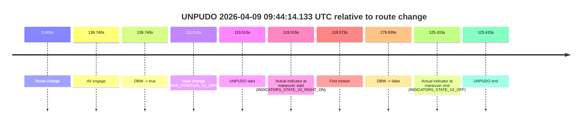
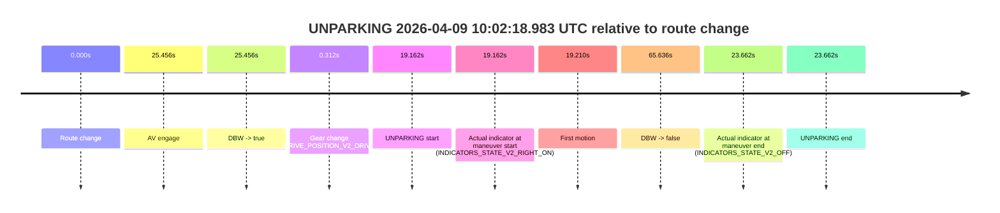
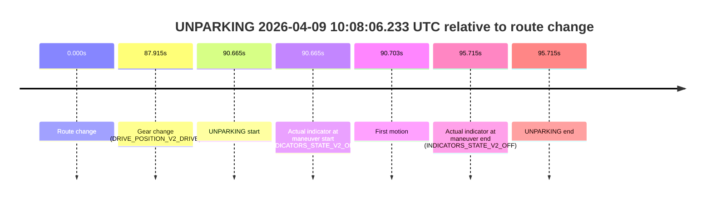

# Run Report: fme20038/2026-04-09--08-53-55--gen2-av-3348c3a5-f88f-452b-afeb-c26dbdf2c152

| Field | Value |
|---|---|
| Run ID | `fme20038/2026-04-09--08-53-55--gen2-av-3348c3a5-f88f-452b-afeb-c26dbdf2c152` |
| Date | `2026-04-09` |
| Model(s) | `lively-orange-horse` |
| Author | `guy.geva` |
| Event count | `4` |

## unpudo 2026-04-09 09:32:30.683 UTC

| Field | Value |
|---|---|
| Model | `lively-orange-horse` |
| Author | `guy.geva` |
| Run ID | `fme20038/2026-04-09--08-53-55--gen2-av-3348c3a5-f88f-452b-afeb-c26dbdf2c152` |
| Date | `2026-04-09` |
| Time (UTC) | `09:32:30.683` |
| Event type | `unpudo` |
| Disengagement type | `failed_to_unpudo` |
| Route change | `found` |
| Console | [run](https://console.sso.wayve.ai/run/fme20038/2026-04-09--08-53-55--gen2-av-3348c3a5-f88f-452b-afeb-c26dbdf2c152?id=&time-unixus=1775727150683313) |
| Foxglove | [segment](https://app.foxglove.dev/wayve-on-prem/p/prj_0dX18KZdVHg1fmmI/view?ds=foxglove-stream&ds.deviceName=fme20038&ds.start=2026-04-09T09%3A30%3A36.418252Z&ds.end=2026-04-09T09%3A37%3A09.078121Z&layoutId=lay_0e7VD4WIKDQGU73Y&time=2026-04-09T09%3A32%3A30.683313Z) |

### Event card: accidental

- Accidental: AV ownership is present for less than `2s`, so this is treated as an accidental brush with the maneuver rather than a meaningful model attempt.

| Event | Time (UTC) | Delta from route change |
|---|---:|---:|
| Route change | 2026-04-09 09:30:46.418 | `0.000s` |
| AV engage | 2026-04-09 09:32:40.098 | `113.680s` |
| DBW -> true | 2026-04-09 09:32:40.098 | `113.680s` |
| Gear change (DRIVE_POSITION_V2_DRIVE) | 2026-04-09 09:31:49.783 | `63.365s` |
| UNPUDO start | 2026-04-09 09:32:30.683 | `104.265s` |
| Actual indicator at maneuver start (INDICATORS_STATE_V2_OFF) | 2026-04-09 09:32:30.683 | `104.265s` |
| First motion | 2026-04-09 09:32:30.711 | `104.293s` |
| DBW -> false | 2026-04-09 09:36:59.078 | `372.660s` |
| Actual indicator at maneuver end (INDICATORS_STATE_V2_OFF) | 2026-04-09 09:32:35.833 | `109.415s` |
| UNPUDO end | 2026-04-09 09:32:35.833 | `109.415s` |

| Metric | Value |
|---|---|
| Outcome | `accidental` |
| Effective failure type | `none` |
| Route change status | `found` |
| DBW at event start | `false` |
| DBW at event end | `false` |
| Predicted gear at AV start | `DRIVE_POSITION_V2_DRIVE` |
| Actual gear at AV start | `DRIVE_POSITION_V2_DRIVE` |
| Predicted gear at event start | `DRIVE_POSITION_V2_DRIVE` |
| Actual gear at event start | `DRIVE_POSITION_V2_DRIVE` |
| Planned indicator direction | `INDICATORS_STATE_V2_LEFT_ON` |
| Controller indicator direction | `INDICATORS_STATE_V2_LEFT_ON` |
| Actual indicator direction | `INDICATORS_STATE_V2_OFF` |
| Actual indicator at maneuver end | `INDICATORS_STATE_V2_OFF` |
| Driver accel help in AV | `false` |
| Driver accel help timestamp | `n/a` |
| Max accel pedal pct in AV | `0.0%` |
| Max brake pedal pct in AV | `0.0%` |
| Max speed mps in AV | `0.000` |
| Route -> AV | `113.680s` |
| AV -> event start | `-9.415s` |
| AV -> first motion | `-9.387s` |
| AV duration before disengagement | `258.980s` |
| Trajectory waypoint count | `36` |
| Driving-plan step count | `11` |

The scored portion starts from the AV-owned window, not from the pre-AV setup. Route-change search in the stopped pre-event segment was `found`, with the baseline therefore set to route change. At the event anchor the model predicts `DRIVE_POSITION_V2_DRIVE` and the actual gear is `DRIVE_POSITION_V2_DRIVE`. The effective model outcome is `accidental` because `the AV-owned portion is shorter than 2s`.

### Resolution

| Field | Value |
|---|---|
| Final outcome | `accidental` |
| Do we agree with this label? | `yes` |
| Source disengagement type | `failed_to_unpudo` |
| Resolved effective failure type | `none` |
| Confidence | `high` |

## unpudo 2026-04-09 09:44:14.133 UTC

| Field | Value |
|---|---|
| Model | `lively-orange-horse` |
| Author | `guy.geva` |
| Run ID | `fme20038/2026-04-09--08-53-55--gen2-av-3348c3a5-f88f-452b-afeb-c26dbdf2c152` |
| Date | `2026-04-09` |
| Time (UTC) | `09:44:14.133` |
| Event type | `unpudo` |
| Disengagement type | `failed_to_unpudo` |
| Route change | `found` |
| Console | [run](https://console.sso.wayve.ai/run/fme20038/2026-04-09--08-53-55--gen2-av-3348c3a5-f88f-452b-afeb-c26dbdf2c152?id=&time-unixus=1775727854133291) |
| Foxglove | [segment](https://app.foxglove.dev/wayve-on-prem/p/prj_0dX18KZdVHg1fmmI/view?ds=foxglove-stream&ds.deviceName=fme20038&ds.start=2026-04-09T09%3A42%3A04.618313Z&ds.end=2026-04-09T09%3A47%3A04.457049Z&layoutId=lay_0e7VD4WIKDQGU73Y&time=2026-04-09T09%3A44%3A14.133291Z) |

### Event card: accidental

- Accidental: AV ownership is present for less than `2s`, so this is treated as an accidental brush with the maneuver rather than a meaningful model attempt.

| Event | Time (UTC) | Delta from route change |
|---|---:|---:|
| Route change | 2026-04-09 09:42:14.618 | `0.000s` |
| AV engage | 2026-04-09 09:44:34.358 | `139.740s` |
| DBW -> true | 2026-04-09 09:44:34.358 | `139.740s` |
| Gear change (DRIVE_POSITION_V2_DRIVE) | 2026-04-09 09:44:06.133 | `111.515s` |
| UNPUDO start | 2026-04-09 09:44:14.133 | `119.515s` |
| Actual indicator at maneuver start (INDICATORS_STATE_V2_RIGHT_ON) | 2026-04-09 09:44:14.133 | `119.515s` |
| First motion | 2026-04-09 09:44:14.191 | `119.573s` |
| DBW -> false | 2026-04-09 09:46:54.457 | `279.839s` |
| Actual indicator at maneuver end (INDICATORS_STATE_V2_OFF) | 2026-04-09 09:44:20.033 | `125.415s` |
| UNPUDO end | 2026-04-09 09:44:20.033 | `125.415s` |

| Metric | Value |
|---|---|
| Outcome | `accidental` |
| Effective failure type | `none` |
| Route change status | `found` |
| DBW at event start | `false` |
| DBW at event end | `false` |
| Predicted gear at AV start | `DRIVE_POSITION_V2_DRIVE` |
| Actual gear at AV start | `DRIVE_POSITION_V2_DRIVE` |
| Predicted gear at event start | `DRIVE_POSITION_V2_DRIVE` |
| Actual gear at event start | `DRIVE_POSITION_V2_DRIVE` |
| Planned indicator direction | `INDICATORS_STATE_V2_RIGHT_ON` |
| Controller indicator direction | `INDICATORS_STATE_V2_RIGHT_ON` |
| Actual indicator direction | `INDICATORS_STATE_V2_RIGHT_ON` |
| Actual indicator at maneuver end | `INDICATORS_STATE_V2_OFF` |
| Driver accel help in AV | `false` |
| Driver accel help timestamp | `n/a` |
| Max accel pedal pct in AV | `0.0%` |
| Max brake pedal pct in AV | `0.0%` |
| Max speed mps in AV | `0.000` |
| Route -> AV | `139.740s` |
| AV -> event start | `-20.225s` |
| AV -> first motion | `-20.167s` |
| AV duration before disengagement | `140.099s` |
| Trajectory waypoint count | `37` |
| Driving-plan step count | `11` |

The scored portion starts from the AV-owned window, not from the pre-AV setup. Route-change search in the stopped pre-event segment was `found`, with the baseline therefore set to route change. At the event anchor the model predicts `DRIVE_POSITION_V2_DRIVE` and the actual gear is `DRIVE_POSITION_V2_DRIVE`. The effective model outcome is `accidental` because `the AV-owned portion is shorter than 2s`.

### Resolution

| Field | Value |
|---|---|
| Final outcome | `accidental` |
| Do we agree with this label? | `yes` |
| Source disengagement type | `failed_to_unpudo` |
| Resolved effective failure type | `none` |
| Confidence | `high` |

## unparking 2026-04-09 10:02:18.983 UTC

| Field | Value |
|---|---|
| Model | `lively-orange-horse` |
| Author | `guy.geva` |
| Run ID | `fme20038/2026-04-09--08-53-55--gen2-av-3348c3a5-f88f-452b-afeb-c26dbdf2c152` |
| Date | `2026-04-09` |
| Time (UTC) | `10:02:18.983` |
| Event type | `unparking` |
| Disengagement type | `failed_to_unpudo` |
| Route change | `found` |
| Console | [run](https://console.sso.wayve.ai/run/fme20038/2026-04-09--08-53-55--gen2-av-3348c3a5-f88f-452b-afeb-c26dbdf2c152?id=&time-unixus=1775728938983308) |
| Foxglove | [segment](https://app.foxglove.dev/wayve-on-prem/p/prj_0dX18KZdVHg1fmmI/view?ds=foxglove-stream&ds.deviceName=fme20038&ds.start=2026-04-09T10%3A01%3A49.820941Z&ds.end=2026-04-09T10%3A03%3A15.456866Z&layoutId=lay_0e7VD4WIKDQGU73Y&time=2026-04-09T10%3A02%3A18.983308Z) |

### Event card: accidental

- Accidental: AV ownership is present for less than `2s`, so this is treated as an accidental brush with the maneuver rather than a meaningful model attempt.

| Event | Time (UTC) | Delta from route change |
|---|---:|---:|
| Route change | 2026-04-09 10:01:59.820 | `0.000s` |
| AV engage | 2026-04-09 10:02:25.276 | `25.456s` |
| DBW -> true | 2026-04-09 10:02:25.276 | `25.456s` |
| Gear change (DRIVE_POSITION_V2_DRIVE) | 2026-04-09 10:02:00.133 | `0.312s` |
| UNPARKING start | 2026-04-09 10:02:18.983 | `19.162s` |
| Actual indicator at maneuver start (INDICATORS_STATE_V2_RIGHT_ON) | 2026-04-09 10:02:18.983 | `19.162s` |
| First motion | 2026-04-09 10:02:19.031 | `19.210s` |
| DBW -> false | 2026-04-09 10:03:05.456 | `65.636s` |
| Actual indicator at maneuver end (INDICATORS_STATE_V2_OFF) | 2026-04-09 10:02:23.483 | `23.662s` |
| UNPARKING end | 2026-04-09 10:02:23.483 | `23.662s` |

| Metric | Value |
|---|---|
| Outcome | `accidental` |
| Effective failure type | `none` |
| Route change status | `found` |
| DBW at event start | `false` |
| DBW at event end | `false` |
| Predicted gear at AV start | `DRIVE_POSITION_V2_DRIVE` |
| Actual gear at AV start | `DRIVE_POSITION_V2_DRIVE` |
| Predicted gear at event start | `DRIVE_POSITION_V2_DRIVE` |
| Actual gear at event start | `DRIVE_POSITION_V2_DRIVE` |
| Planned indicator direction | `INDICATORS_STATE_V2_RIGHT_ON` |
| Controller indicator direction | `INDICATORS_STATE_V2_RIGHT_ON` |
| Actual indicator direction | `INDICATORS_STATE_V2_RIGHT_ON` |
| Actual indicator at maneuver end | `INDICATORS_STATE_V2_OFF` |
| Driver accel help in AV | `false` |
| Driver accel help timestamp | `n/a` |
| Max accel pedal pct in AV | `0.0%` |
| Max brake pedal pct in AV | `0.0%` |
| Max speed mps in AV | `0.000` |
| Route -> AV | `25.456s` |
| AV -> event start | `-6.294s` |
| AV -> first motion | `-6.246s` |
| AV duration before disengagement | `40.180s` |
| Trajectory waypoint count | `36` |
| Driving-plan step count | `11` |

The scored portion starts from the AV-owned window, not from the pre-AV setup. Route-change search in the stopped pre-event segment was `found`, with the baseline therefore set to route change. At the event anchor the model predicts `DRIVE_POSITION_V2_DRIVE` and the actual gear is `DRIVE_POSITION_V2_DRIVE`. The effective model outcome is `accidental` because `the AV-owned portion is shorter than 2s`.

### Resolution

| Field | Value |
|---|---|
| Final outcome | `accidental` |
| Do we agree with this label? | `yes` |
| Source disengagement type | `failed_to_unpudo` |
| Resolved effective failure type | `none` |
| Confidence | `high` |

## unparking 2026-04-09 10:08:06.233 UTC

| Field | Value |
|---|---|
| Model | `lively-orange-horse` |
| Author | `guy.geva` |
| Run ID | `fme20038/2026-04-09--08-53-55--gen2-av-3348c3a5-f88f-452b-afeb-c26dbdf2c152` |
| Date | `2026-04-09` |
| Time (UTC) | `10:08:06.233` |
| Event type | `unparking` |
| Disengagement type | `none observed` |
| Route change | `found` |
| Console | [run](https://console.sso.wayve.ai/run/fme20038/2026-04-09--08-53-55--gen2-av-3348c3a5-f88f-452b-afeb-c26dbdf2c152?id=&time-unixus=1775729286233293) |
| Foxglove | [segment](https://app.foxglove.dev/wayve-on-prem/p/prj_0dX18KZdVHg1fmmI/view?ds=foxglove-stream&ds.deviceName=fme20038&ds.start=2026-04-09T10%3A06%3A25.568234Z&ds.end=2026-04-09T10%3A08%3A21.283306Z&layoutId=lay_0e7VD4WIKDQGU73Y&time=2026-04-09T10%3A08%3A06.233293Z) |

### Event card: non-av

- Non-AV: the detected unparking starts outside AV ownership, so it is kept for coverage but excluded from model success / failure scoring.

| Event | Time (UTC) | Delta from route change |
|---|---:|---:|
| Route change | 2026-04-09 10:06:35.568 | `0.000s` |
| Gear change (DRIVE_POSITION_V2_DRIVE) | 2026-04-09 10:08:03.483 | `87.915s` |
| UNPARKING start | 2026-04-09 10:08:06.233 | `90.665s` |
| Actual indicator at maneuver start (INDICATORS_STATE_V2_OFF) | 2026-04-09 10:08:06.233 | `90.665s` |
| First motion | 2026-04-09 10:08:06.271 | `90.703s` |
| Actual indicator at maneuver end (INDICATORS_STATE_V2_OFF) | 2026-04-09 10:08:11.283 | `95.715s` |
| UNPARKING end | 2026-04-09 10:08:11.283 | `95.715s` |

| Metric | Value |
|---|---|
| Outcome | `non-av` |
| Effective failure type | `none` |
| Route change status | `found` |
| DBW at event start | `false` |
| DBW at event end | `false` |
| Predicted gear at AV start | `n/a` |
| Actual gear at AV start | `n/a` |
| Predicted gear at event start | `DRIVE_POSITION_V2_DRIVE` |
| Actual gear at event start | `DRIVE_POSITION_V2_DRIVE` |
| Planned indicator direction | `INDICATORS_STATE_V2_OFF` |
| Controller indicator direction | `INDICATORS_STATE_V2_OFF` |
| Actual indicator direction | `INDICATORS_STATE_V2_OFF` |
| Actual indicator at maneuver end | `INDICATORS_STATE_V2_OFF` |
| Driver accel help in AV | `false` |
| Driver accel help timestamp | `n/a` |
| Max accel pedal pct in AV | `0.0%` |
| Max brake pedal pct in AV | `0.0%` |
| Max speed mps in AV | `0.000` |
| Route -> AV | `n/a` |
| AV -> event start | `n/a` |
| AV -> first motion | `n/a` |
| AV duration before disengagement | `n/a` |
| Trajectory waypoint count | `37` |
| Driving-plan step count | `11` |

The scored portion starts from the AV-owned window, not from the pre-AV setup. Route-change search in the stopped pre-event segment was `found`, with the baseline therefore set to route change. At the event anchor the model predicts `DRIVE_POSITION_V2_DRIVE` and the actual gear is `DRIVE_POSITION_V2_DRIVE`. The effective model outcome is `non-av` because `the event does not begin in AV ownership`.

### Resolution

| Field | Value |
|---|---|
| Final outcome | `non-av` |
| Do we agree with this label? | `yes` |
| Source disengagement type | `none observed` |
| Resolved effective failure type | `none` |
| Confidence | `high` |
