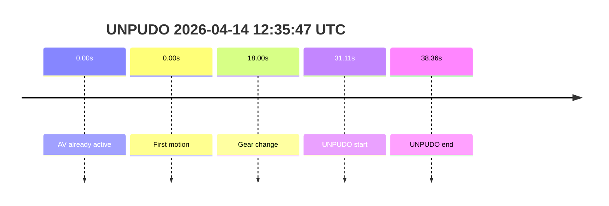

# Run Report: fme20040/2026-04-14--11-58-50--gen2-av-90560185-3296-43ba-9ec3-6a1693f1514a

| Field | Value |
|---|---|
| Run ID | `fme20040/2026-04-14--11-58-50--gen2-av-90560185-3296-43ba-9ec3-6a1693f1514a` |
| Date | `2026-04-14` |
| Model(s) | `harlequin-excited-greyhound` |

## unpudo 2026-04-14 12:35:47 UTC

| Field | Value |
|---|---|
| Model | `harlequin-excited-greyhound` |
| Author | `boris.indelman` |
| Run ID | `fme20040/2026-04-14--11-58-50--gen2-av-90560185-3296-43ba-9ec3-6a1693f1514a` |
| Date | `2026-04-14` |
| Time (UTC) | `12:35:47` |
| Event type | `unpudo` |
| Disengagement type | `parking` |
| Console | [run](https://console.sso.wayve.ai/run/fme20040/2026-04-14--11-58-50--gen2-av-90560185-3296-43ba-9ec3-6a1693f1514a?id=&time-unixus=1776170147383303) |
| Foxglove | [segment](https://app.foxglove.dev/wayve-on-prem/p/prj_0dX18KZdVHg1fmmI/view?ds=foxglove-stream&ds.deviceName=fme20040&ds.end=2026-04-14T12%3A36%3A04.633Z&ds.start=2026-04-14T12%3A35%3A17.383Z&layoutId=lay_0e7VD4WIKDQGU73Y&time=2026-04-14T12%3A35%3A47.383Z) |

- Fail: AV-owned UNPUDO failure. There is navigation in the run, but no validated route reassignment for this segment; AV was already active, held `DRIVE`, predicted `RIGHT_ON`, the actual indicator switch stayed `OFF`, and the event ended in a `parking / failed_to_unpark` disengagement.

| Event | Time (UTC) | Delta from AV start |
|---|---:|---:|
| AV active | 2026-04-14 12:35:16 | 0.00s |
| First motion | 2026-04-14 12:35:16 | 0.00s |
| Gear change | 2026-04-14 12:35:34 | 18.00s |
| UNPUDO start | 2026-04-14 12:35:47 | 31.11s |
| UNPUDO end / disengagement window end | 2026-04-14 12:35:54 | 38.36s |

| Metric | Value |
|---|---|
| Validated route reassignment | `false` |
| Navigation in segment window | `present but stable` |
| Route state near event | `12 steps, "Turn left onto Parkway/A4201.", 1781.45 m` |
| Predicted gear at AV start | `DRIVE_POSITION_V2_DRIVE` |
| Actual gear at AV start | `DRIVE_POSITION_V2_DRIVE` |
| Predicted gear at event start | `DRIVE_POSITION_V2_DRIVE` |
| Actual gear at event start | `DRIVE_POSITION_V2_DRIVE` |
| Planned indicator direction | `INDICATORS_STATE_V2_RIGHT_ON` |
| Actual indicator switch at AV start | `INDICATORS_STATE_V2_OFF` |
| Actual indicator light at AV start | `INDICATORS_STATE_V2_NOT_AVAILABLE` |
| Driver accel help in AV | `false` |
| Max accel pedal in AV | `0.0%` |
| Max brake pedal in AV | `8.3%` |
| Max speed in AV | `7.16 m/s` |
| AV -> UNPUDO start | `31.106s` |
| AV -> first motion | `0.002s` |
| AV duration | `31.288s` |
| Main disengagement flag | `1` |
| Gear-to-start disengagement | `0` |
| Before-gearchange-10s disengagement | `0` |
| Disengagement `what` | `parking` |
| Disengagement `why` | `failed_to_unpark` |

The AV-owned portion is long enough to count as a real failure rather than a short interrupted handover. I previously mislabeled stable navigation as a route reassignment; that was wrong for this segment. The route appears stable in the surrounding window, so this should be judged from AV ownership rather than from a route-change story. Both predicted and actual gear are already in `DRIVE`, so this is not a gear-selection problem. The clearest mismatch is signaling: the driving plan wants `RIGHT_ON`, while the actual vehicle switch stays `OFF`. There is no driver accelerator help in AV, brake remains partially applied, and the event ultimately carries a `parking / failed_to_unpark` disengagement despite the vehicle already being in motion. This looks like an AV execution / maneuver-quality failure, not a pre-AV setup artifact.
