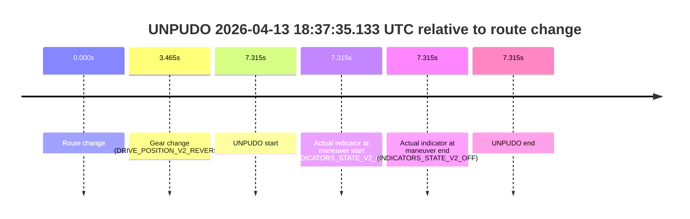
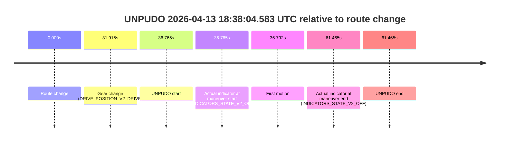
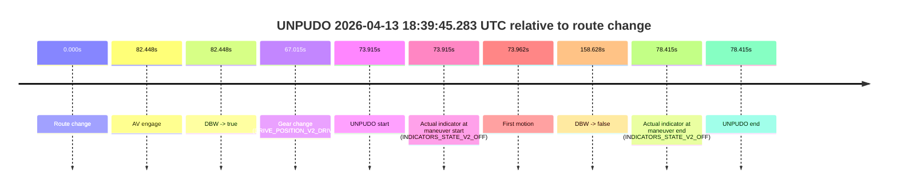
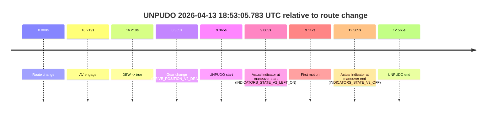

# Run Report: fme10003/2026-04-13--18-24-54--gen2-av-9d2812aa-87ae-4bcf-b179-3670ced1f490

| Field | Value |
|---|---|
| Run ID | `fme10003/2026-04-13--18-24-54--gen2-av-9d2812aa-87ae-4bcf-b179-3670ced1f490` |
| Date | `2026-04-13` |
| Model(s) | `lively-orange-horse` |
| Author | `guy.geva` |
| Event count | `4` |

## unpudo 2026-04-13 18:37:35.133 UTC

| Field | Value |
|---|---|
| Model | `lively-orange-horse` |
| Author | `guy.geva` |
| Run ID | `fme10003/2026-04-13--18-24-54--gen2-av-9d2812aa-87ae-4bcf-b179-3670ced1f490` |
| Date | `2026-04-13` |
| Time (UTC) | `18:37:35.133` |
| Event type | `unpudo` |
| Disengagement type | `none observed` |
| Route change | `found` |
| Console | [run](https://console.sso.wayve.ai/run/fme10003/2026-04-13--18-24-54--gen2-av-9d2812aa-87ae-4bcf-b179-3670ced1f490?id=&time-unixus=1776105455133299) |
| Foxglove | [segment](https://app.foxglove.dev/wayve-on-prem/p/prj_0dX18KZdVHg1fmmI/view?ds=foxglove-stream&ds.deviceName=fme10003&ds.start=2026-04-13T18%3A37%3A17.818371Z&ds.end=2026-04-13T18%3A37%3A45.133299Z&layoutId=lay_0e7VD4WIKDQGU73Y&time=2026-04-13T18%3A37%3A35.133299Z) |

### Event card: fail

- Fail: the credited unpudo does not stay AV-owned. The event window starts with DBW false, and the maneuver outcome lands outside a clean AV-owned segment.

| Event | Time (UTC) | Delta from route change |
|---|---:|---:|
| Route change | 2026-04-13 18:37:27.818 | `0.000s` |
| Gear change (DRIVE_POSITION_V2_REVERSE) | 2026-04-13 18:37:31.283 | `3.465s` |
| UNPUDO start | 2026-04-13 18:37:35.133 | `7.315s` |
| Actual indicator at maneuver start (INDICATORS_STATE_V2_OFF) | 2026-04-13 18:37:35.133 | `7.315s` |
| Actual indicator at maneuver end (INDICATORS_STATE_V2_OFF) | 2026-04-13 18:37:35.133 | `7.315s` |
| UNPUDO end | 2026-04-13 18:37:35.133 | `7.315s` |

| Metric | Value |
|---|---|
| Outcome | `fail` |
| Effective failure type | `not_av_owned` |
| Route change status | `found` |
| DBW at event start | `false` |
| DBW at event end | `false` |
| Predicted gear at AV start | `n/a` |
| Actual gear at AV start | `n/a` |
| Predicted gear at event start | `DRIVE_POSITION_V2_DRIVE` |
| Actual gear at event start | `DRIVE_POSITION_V2_REVERSE` |
| Planned indicator direction | `INDICATORS_STATE_V2_OFF` |
| Controller indicator direction | `INDICATORS_STATE_V2_OFF` |
| Actual indicator direction | `INDICATORS_STATE_V2_OFF` |
| Actual indicator at maneuver end | `INDICATORS_STATE_V2_OFF` |
| Driver accel help in AV | `false` |
| Driver accel help timestamp | `n/a` |
| Max accel pedal pct in AV | `0.0%` |
| Max brake pedal pct in AV | `0.0%` |
| Max speed mps in AV | `0.000` |
| Route -> AV | `n/a` |
| AV -> event start | `n/a` |
| AV -> first motion | `n/a` |
| AV duration before disengagement | `n/a` |
| Trajectory waypoint count | `37` |
| Driving-plan step count | `11` |

The scored portion starts from the AV-owned window, not from the pre-AV setup. Route-change search in the stopped pre-event segment was `found`, with the baseline therefore set to route change. At the event anchor the model predicts `DRIVE_POSITION_V2_DRIVE` and the actual gear is `DRIVE_POSITION_V2_REVERSE`. The effective model outcome is `fail` because `not_av_owned`.

### Resolution

| Field | Value |
|---|---|
| Final outcome | `fail` |
| Do we agree with this label? | `yes` |
| Source disengagement type | `none observed` |
| Resolved effective failure type | `not_av_owned` |
| Confidence | `high` |

## unpudo 2026-04-13 18:38:04.583 UTC

| Field | Value |
|---|---|
| Model | `lively-orange-horse` |
| Author | `guy.geva` |
| Run ID | `fme10003/2026-04-13--18-24-54--gen2-av-9d2812aa-87ae-4bcf-b179-3670ced1f490` |
| Date | `2026-04-13` |
| Time (UTC) | `18:38:04.583` |
| Event type | `unpudo` |
| Disengagement type | `none observed` |
| Route change | `found` |
| Console | [run](https://console.sso.wayve.ai/run/fme10003/2026-04-13--18-24-54--gen2-av-9d2812aa-87ae-4bcf-b179-3670ced1f490?id=&time-unixus=1776105484583303) |
| Foxglove | [segment](https://app.foxglove.dev/wayve-on-prem/p/prj_0dX18KZdVHg1fmmI/view?ds=foxglove-stream&ds.deviceName=fme10003&ds.start=2026-04-13T18%3A37%3A17.818371Z&ds.end=2026-04-13T18%3A38%3A39.283305Z&layoutId=lay_0e7VD4WIKDQGU73Y&time=2026-04-13T18%3A38%3A04.583303Z) |

### Event card: fail

- Fail: the credited unpudo does not stay AV-owned. The event window starts with DBW false, and the maneuver outcome lands outside a clean AV-owned segment.

| Event | Time (UTC) | Delta from route change |
|---|---:|---:|
| Route change | 2026-04-13 18:37:27.818 | `0.000s` |
| Gear change (DRIVE_POSITION_V2_DRIVE) | 2026-04-13 18:37:59.733 | `31.915s` |
| UNPUDO start | 2026-04-13 18:38:04.583 | `36.765s` |
| Actual indicator at maneuver start (INDICATORS_STATE_V2_OFF) | 2026-04-13 18:38:04.583 | `36.765s` |
| First motion | 2026-04-13 18:38:04.609 | `36.792s` |
| Actual indicator at maneuver end (INDICATORS_STATE_V2_OFF) | 2026-04-13 18:38:29.283 | `61.465s` |
| UNPUDO end | 2026-04-13 18:38:29.283 | `61.465s` |

| Metric | Value |
|---|---|
| Outcome | `fail` |
| Effective failure type | `not_av_owned` |
| Route change status | `found` |
| DBW at event start | `false` |
| DBW at event end | `false` |
| Predicted gear at AV start | `n/a` |
| Actual gear at AV start | `n/a` |
| Predicted gear at event start | `DRIVE_POSITION_V2_DRIVE` |
| Actual gear at event start | `DRIVE_POSITION_V2_DRIVE` |
| Planned indicator direction | `INDICATORS_STATE_V2_OFF` |
| Controller indicator direction | `INDICATORS_STATE_V2_OFF` |
| Actual indicator direction | `INDICATORS_STATE_V2_OFF` |
| Actual indicator at maneuver end | `INDICATORS_STATE_V2_OFF` |
| Driver accel help in AV | `false` |
| Driver accel help timestamp | `n/a` |
| Max accel pedal pct in AV | `0.0%` |
| Max brake pedal pct in AV | `0.0%` |
| Max speed mps in AV | `0.000` |
| Route -> AV | `n/a` |
| AV -> event start | `n/a` |
| AV -> first motion | `n/a` |
| AV duration before disengagement | `n/a` |
| Trajectory waypoint count | `36` |
| Driving-plan step count | `11` |

The scored portion starts from the AV-owned window, not from the pre-AV setup. Route-change search in the stopped pre-event segment was `found`, with the baseline therefore set to route change. At the event anchor the model predicts `DRIVE_POSITION_V2_DRIVE` and the actual gear is `DRIVE_POSITION_V2_DRIVE`. The effective model outcome is `fail` because `not_av_owned`.

### Resolution

| Field | Value |
|---|---|
| Final outcome | `fail` |
| Do we agree with this label? | `yes` |
| Source disengagement type | `none observed` |
| Resolved effective failure type | `not_av_owned` |
| Confidence | `high` |

## unpudo 2026-04-13 18:39:45.283 UTC

| Field | Value |
|---|---|
| Model | `lively-orange-horse` |
| Author | `guy.geva` |
| Run ID | `fme10003/2026-04-13--18-24-54--gen2-av-9d2812aa-87ae-4bcf-b179-3670ced1f490` |
| Date | `2026-04-13` |
| Time (UTC) | `18:39:45.283` |
| Event type | `unpudo` |
| Disengagement type | `failed_to_unpudo` |
| Route change | `found` |
| Console | [run](https://console.sso.wayve.ai/run/fme10003/2026-04-13--18-24-54--gen2-av-9d2812aa-87ae-4bcf-b179-3670ced1f490?id=&time-unixus=1776105585283302) |
| Foxglove | [segment](https://app.foxglove.dev/wayve-on-prem/p/prj_0dX18KZdVHg1fmmI/view?ds=foxglove-stream&ds.deviceName=fme10003&ds.start=2026-04-13T18%3A38%3A21.368261Z&ds.end=2026-04-13T18%3A41%3A19.996669Z&layoutId=lay_0e7VD4WIKDQGU73Y&time=2026-04-13T18%3A39%3A45.283302Z) |

### Event card: fail

- Fail: AV owns part of the segment, but the event still resolves as a model-performance failure under the AV-only scoring rule.

| Event | Time (UTC) | Delta from route change |
|---|---:|---:|
| Route change | 2026-04-13 18:38:31.368 | `0.000s` |
| AV engage | 2026-04-13 18:39:53.816 | `82.448s` |
| DBW -> true | 2026-04-13 18:39:53.816 | `82.448s` |
| Gear change (DRIVE_POSITION_V2_DRIVE) | 2026-04-13 18:39:38.383 | `67.015s` |
| UNPUDO start | 2026-04-13 18:39:45.283 | `73.915s` |
| Actual indicator at maneuver start (INDICATORS_STATE_V2_OFF) | 2026-04-13 18:39:45.283 | `73.915s` |
| First motion | 2026-04-13 18:39:45.329 | `73.962s` |
| DBW -> false | 2026-04-13 18:41:09.996 | `158.628s` |
| Actual indicator at maneuver end (INDICATORS_STATE_V2_OFF) | 2026-04-13 18:39:49.783 | `78.415s` |
| UNPUDO end | 2026-04-13 18:39:49.783 | `78.415s` |

| Metric | Value |
|---|---|
| Outcome | `fail` |
| Effective failure type | `failed_to_unpudo` |
| Route change status | `found` |
| DBW at event start | `false` |
| DBW at event end | `false` |
| Predicted gear at AV start | `DRIVE_POSITION_V2_DRIVE` |
| Actual gear at AV start | `DRIVE_POSITION_V2_DRIVE` |
| Predicted gear at event start | `DRIVE_POSITION_V2_DRIVE` |
| Actual gear at event start | `DRIVE_POSITION_V2_DRIVE` |
| Planned indicator direction | `INDICATORS_STATE_V2_LEFT_ON` |
| Controller indicator direction | `INDICATORS_STATE_V2_LEFT_ON` |
| Actual indicator direction | `INDICATORS_STATE_V2_OFF` |
| Actual indicator at maneuver end | `INDICATORS_STATE_V2_OFF` |
| Driver accel help in AV | `false` |
| Driver accel help timestamp | `n/a` |
| Max accel pedal pct in AV | `0.0%` |
| Max brake pedal pct in AV | `0.0%` |
| Max speed mps in AV | `0.000` |
| Route -> AV | `82.448s` |
| AV -> event start | `-8.533s` |
| AV -> first motion | `-8.487s` |
| AV duration before disengagement | `76.180s` |
| Trajectory waypoint count | `36` |
| Driving-plan step count | `11` |

The scored portion starts from the AV-owned window, not from the pre-AV setup. Route-change search in the stopped pre-event segment was `found`, with the baseline therefore set to route change. At the event anchor the model predicts `DRIVE_POSITION_V2_DRIVE` and the actual gear is `DRIVE_POSITION_V2_DRIVE`. The effective model outcome is `fail` because `failed_to_unpudo`.

### Resolution

| Field | Value |
|---|---|
| Final outcome | `fail` |
| Do we agree with this label? | `yes` |
| Source disengagement type | `failed_to_unpudo` |
| Resolved effective failure type | `failed_to_unpudo` |
| Confidence | `high` |

## unpudo 2026-04-13 18:53:05.783 UTC

| Field | Value |
|---|---|
| Model | `lively-orange-horse` |
| Author | `guy.geva` |
| Run ID | `fme10003/2026-04-13--18-24-54--gen2-av-9d2812aa-87ae-4bcf-b179-3670ced1f490` |
| Date | `2026-04-13` |
| Time (UTC) | `18:53:05.783` |
| Event type | `unpudo` |
| Disengagement type | `failed_to_unpudo` |
| Route change | `found` |
| Console | [run](https://console.sso.wayve.ai/run/fme10003/2026-04-13--18-24-54--gen2-av-9d2812aa-87ae-4bcf-b179-3670ced1f490?id=&time-unixus=1776106385783312) |
| Foxglove | [segment](https://app.foxglove.dev/wayve-on-prem/p/prj_0dX18KZdVHg1fmmI/view?ds=foxglove-stream&ds.deviceName=fme10003&ds.start=2026-04-13T18%3A52%3A46.718249Z&ds.end=2026-04-13T18%3A53%3A19.283293Z&layoutId=lay_0e7VD4WIKDQGU73Y&time=2026-04-13T18%3A53%3A05.783312Z) |

### Event card: fail

- Fail: AV owns part of the segment, but the event still resolves as a model-performance failure under the AV-only scoring rule.

| Event | Time (UTC) | Delta from route change |
|---|---:|---:|
| Route change | 2026-04-13 18:52:56.718 | `0.000s` |
| AV engage | 2026-04-13 18:53:12.936 | `16.219s` |
| DBW -> true | 2026-04-13 18:53:12.936 | `16.219s` |
| Gear change (DRIVE_POSITION_V2_DRIVE) | 2026-04-13 18:52:57.083 | `0.365s` |
| UNPUDO start | 2026-04-13 18:53:05.783 | `9.065s` |
| Actual indicator at maneuver start (INDICATORS_STATE_V2_LEFT_ON) | 2026-04-13 18:53:05.783 | `9.065s` |
| First motion | 2026-04-13 18:53:05.830 | `9.112s` |
| Actual indicator at maneuver end (INDICATORS_STATE_V2_OFF) | 2026-04-13 18:53:09.283 | `12.565s` |
| UNPUDO end | 2026-04-13 18:53:09.283 | `12.565s` |

| Metric | Value |
|---|---|
| Outcome | `fail` |
| Effective failure type | `failed_to_unpudo` |
| Route change status | `found` |
| DBW at event start | `false` |
| DBW at event end | `false` |
| Predicted gear at AV start | `DRIVE_POSITION_V2_DRIVE` |
| Actual gear at AV start | `DRIVE_POSITION_V2_DRIVE` |
| Predicted gear at event start | `DRIVE_POSITION_V2_DRIVE` |
| Actual gear at event start | `DRIVE_POSITION_V2_DRIVE` |
| Planned indicator direction | `INDICATORS_STATE_V2_LEFT_ON` |
| Controller indicator direction | `INDICATORS_STATE_V2_LEFT_ON` |
| Actual indicator direction | `INDICATORS_STATE_V2_LEFT_ON` |
| Actual indicator at maneuver end | `INDICATORS_STATE_V2_OFF` |
| Driver accel help in AV | `false` |
| Driver accel help timestamp | `n/a` |
| Max accel pedal pct in AV | `0.0%` |
| Max brake pedal pct in AV | `0.0%` |
| Max speed mps in AV | `0.000` |
| Route -> AV | `16.219s` |
| AV -> event start | `-7.154s` |
| AV -> first motion | `-7.107s` |
| AV duration before disengagement | `n/a` |
| Trajectory waypoint count | `36` |
| Driving-plan step count | `11` |

The scored portion starts from the AV-owned window, not from the pre-AV setup. Route-change search in the stopped pre-event segment was `found`, with the baseline therefore set to route change. At the event anchor the model predicts `DRIVE_POSITION_V2_DRIVE` and the actual gear is `DRIVE_POSITION_V2_DRIVE`. The effective model outcome is `fail` because `failed_to_unpudo`.

### Resolution

| Field | Value |
|---|---|
| Final outcome | `fail` |
| Do we agree with this label? | `yes` |
| Source disengagement type | `failed_to_unpudo` |
| Resolved effective failure type | `failed_to_unpudo` |
| Confidence | `high` |
