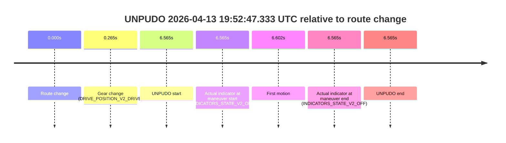
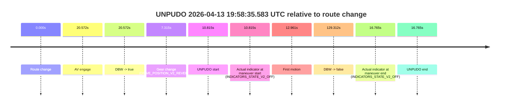
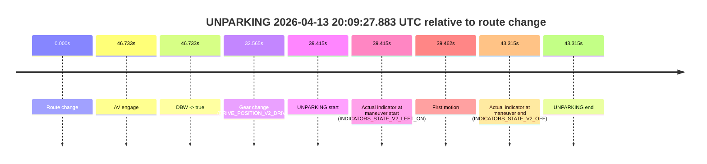

# Run Report: fme10003/2026-04-13--19-13-21--gen2-av-f535c991-407e-4c0d-881f-f3d569b69c1c

| Field | Value |
|---|---|
| Run ID | `fme10003/2026-04-13--19-13-21--gen2-av-f535c991-407e-4c0d-881f-f3d569b69c1c` |
| Date | `2026-04-13` |
| Model(s) | `lively-orange-horse` |
| Author | `guy.geva` |
| Event count | `8` |

## unpudo 2026-04-13 19:30:31.933 UTC

| Field | Value |
|---|---|
| Model | `lively-orange-horse` |
| Author | `guy.geva` |
| Run ID | `fme10003/2026-04-13--19-13-21--gen2-av-f535c991-407e-4c0d-881f-f3d569b69c1c` |
| Date | `2026-04-13` |
| Time (UTC) | `19:30:31.933` |
| Event type | `unpudo` |
| Disengagement type | `failed_to_unpudo` |
| Route change | `found` |
| Console | [run](https://console.sso.wayve.ai/run/fme10003/2026-04-13--19-13-21--gen2-av-f535c991-407e-4c0d-881f-f3d569b69c1c?id=&time-unixus=1776108631933301) |
| Foxglove | [segment](https://app.foxglove.dev/wayve-on-prem/p/prj_0dX18KZdVHg1fmmI/view?ds=foxglove-stream&ds.deviceName=fme10003&ds.start=2026-04-13T19%3A30%3A04.018289Z&ds.end=2026-04-13T19%3A31%3A33.639998Z&layoutId=lay_0e7VD4WIKDQGU73Y&time=2026-04-13T19%3A30%3A31.933301Z) |

### Event card: accidental

- Accidental: AV ownership is present for less than `2s`, so this is treated as an accidental brush with the maneuver rather than a meaningful model attempt.

| Event | Time (UTC) | Delta from route change |
|---|---:|---:|
| Route change | 2026-04-13 19:30:14.018 | `0.000s` |
| AV engage | 2026-04-13 19:30:38.021 | `24.003s` |
| DBW -> true | 2026-04-13 19:30:38.021 | `24.003s` |
| Gear change (DRIVE_POSITION_V2_DRIVE) | 2026-04-13 19:30:24.333 | `10.315s` |
| UNPUDO start | 2026-04-13 19:30:31.933 | `17.915s` |
| Actual indicator at maneuver start (INDICATORS_STATE_V2_LEFT_ON) | 2026-04-13 19:30:31.933 | `17.915s` |
| First motion | 2026-04-13 19:30:32.029 | `18.012s` |
| DBW -> false | 2026-04-13 19:31:23.639 | `69.622s` |
| Actual indicator at maneuver end (INDICATORS_STATE_V2_OFF) | 2026-04-13 19:30:36.133 | `22.115s` |
| UNPUDO end | 2026-04-13 19:30:36.133 | `22.115s` |

| Metric | Value |
|---|---|
| Outcome | `accidental` |
| Effective failure type | `none` |
| Route change status | `found` |
| DBW at event start | `false` |
| DBW at event end | `false` |
| Predicted gear at AV start | `DRIVE_POSITION_V2_DRIVE` |
| Actual gear at AV start | `DRIVE_POSITION_V2_DRIVE` |
| Predicted gear at event start | `DRIVE_POSITION_V2_DRIVE` |
| Actual gear at event start | `DRIVE_POSITION_V2_DRIVE` |
| Planned indicator direction | `INDICATORS_STATE_V2_OFF` |
| Controller indicator direction | `INDICATORS_STATE_V2_OFF` |
| Actual indicator direction | `INDICATORS_STATE_V2_LEFT_ON` |
| Actual indicator at maneuver end | `INDICATORS_STATE_V2_OFF` |
| Driver accel help in AV | `false` |
| Driver accel help timestamp | `n/a` |
| Max accel pedal pct in AV | `0.0%` |
| Max brake pedal pct in AV | `0.0%` |
| Max speed mps in AV | `0.000` |
| Route -> AV | `24.003s` |
| AV -> event start | `-6.088s` |
| AV -> first motion | `-5.991s` |
| AV duration before disengagement | `45.619s` |
| Trajectory waypoint count | `36` |
| Driving-plan step count | `11` |

The scored portion starts from the AV-owned window, not from the pre-AV setup. Route-change search in the stopped pre-event segment was `found`, with the baseline therefore set to route change. At the event anchor the model predicts `DRIVE_POSITION_V2_DRIVE` and the actual gear is `DRIVE_POSITION_V2_DRIVE`. The effective model outcome is `accidental` because `the AV-owned portion is shorter than 2s`.

### Resolution

| Field | Value |
|---|---|
| Final outcome | `accidental` |
| Do we agree with this label? | `yes` |
| Source disengagement type | `failed_to_unpudo` |
| Resolved effective failure type | `none` |
| Confidence | `high` |

## unpudo 2026-04-13 19:40:08.683 UTC

| Field | Value |
|---|---|
| Model | `lively-orange-horse` |
| Author | `guy.geva` |
| Run ID | `fme10003/2026-04-13--19-13-21--gen2-av-f535c991-407e-4c0d-881f-f3d569b69c1c` |
| Date | `2026-04-13` |
| Time (UTC) | `19:40:08.683` |
| Event type | `unpudo` |
| Disengagement type | `failed_to_unpudo` |
| Route change | `found` |
| Console | [run](https://console.sso.wayve.ai/run/fme10003/2026-04-13--19-13-21--gen2-av-f535c991-407e-4c0d-881f-f3d569b69c1c?id=&time-unixus=1776109208683313) |
| Foxglove | [segment](https://app.foxglove.dev/wayve-on-prem/p/prj_0dX18KZdVHg1fmmI/view?ds=foxglove-stream&ds.deviceName=fme10003&ds.start=2026-04-13T19%3A39%3A51.868261Z&ds.end=2026-04-13T19%3A42%3A24.140114Z&layoutId=lay_0e7VD4WIKDQGU73Y&time=2026-04-13T19%3A40%3A08.683313Z) |

### Event card: accidental

- Accidental: AV ownership is present for less than `2s`, so this is treated as an accidental brush with the maneuver rather than a meaningful model attempt.

| Event | Time (UTC) | Delta from route change |
|---|---:|---:|
| Route change | 2026-04-13 19:40:01.868 | `0.000s` |
| AV engage | 2026-04-13 19:40:26.019 | `24.152s` |
| DBW -> true | 2026-04-13 19:40:26.019 | `24.152s` |
| Gear change (DRIVE_POSITION_V2_DRIVE) | 2026-04-13 19:40:02.133 | `0.265s` |
| UNPUDO start | 2026-04-13 19:40:08.683 | `6.815s` |
| Actual indicator at maneuver start (INDICATORS_STATE_V2_LEFT_ON) | 2026-04-13 19:40:08.683 | `6.815s` |
| First motion | 2026-04-13 19:40:08.749 | `6.881s` |
| DBW -> false | 2026-04-13 19:42:14.140 | `132.272s` |
| Actual indicator at maneuver end (INDICATORS_STATE_V2_OFF) | 2026-04-13 19:40:13.183 | `11.315s` |
| UNPUDO end | 2026-04-13 19:40:13.183 | `11.315s` |

| Metric | Value |
|---|---|
| Outcome | `accidental` |
| Effective failure type | `none` |
| Route change status | `found` |
| DBW at event start | `false` |
| DBW at event end | `false` |
| Predicted gear at AV start | `DRIVE_POSITION_V2_DRIVE` |
| Actual gear at AV start | `DRIVE_POSITION_V2_DRIVE` |
| Predicted gear at event start | `DRIVE_POSITION_V2_DRIVE` |
| Actual gear at event start | `DRIVE_POSITION_V2_DRIVE` |
| Planned indicator direction | `INDICATORS_STATE_V2_LEFT_ON` |
| Controller indicator direction | `INDICATORS_STATE_V2_LEFT_ON` |
| Actual indicator direction | `INDICATORS_STATE_V2_LEFT_ON` |
| Actual indicator at maneuver end | `INDICATORS_STATE_V2_OFF` |
| Driver accel help in AV | `false` |
| Driver accel help timestamp | `n/a` |
| Max accel pedal pct in AV | `0.0%` |
| Max brake pedal pct in AV | `0.0%` |
| Max speed mps in AV | `0.000` |
| Route -> AV | `24.152s` |
| AV -> event start | `-17.337s` |
| AV -> first motion | `-17.270s` |
| AV duration before disengagement | `108.120s` |
| Trajectory waypoint count | `37` |
| Driving-plan step count | `11` |

The scored portion starts from the AV-owned window, not from the pre-AV setup. Route-change search in the stopped pre-event segment was `found`, with the baseline therefore set to route change. At the event anchor the model predicts `DRIVE_POSITION_V2_DRIVE` and the actual gear is `DRIVE_POSITION_V2_DRIVE`. The effective model outcome is `accidental` because `the AV-owned portion is shorter than 2s`.

### Resolution

| Field | Value |
|---|---|
| Final outcome | `accidental` |
| Do we agree with this label? | `yes` |
| Source disengagement type | `failed_to_unpudo` |
| Resolved effective failure type | `none` |
| Confidence | `high` |

## unpudo 2026-04-13 19:42:44.083 UTC

| Field | Value |
|---|---|
| Model | `lively-orange-horse` |
| Author | `guy.geva` |
| Run ID | `fme10003/2026-04-13--19-13-21--gen2-av-f535c991-407e-4c0d-881f-f3d569b69c1c` |
| Date | `2026-04-13` |
| Time (UTC) | `19:42:44.083` |
| Event type | `unpudo` |
| Disengagement type | `failed_to_unpudo` |
| Route change | `found` |
| Console | [run](https://console.sso.wayve.ai/run/fme10003/2026-04-13--19-13-21--gen2-av-f535c991-407e-4c0d-881f-f3d569b69c1c?id=&time-unixus=1776109364083310) |
| Foxglove | [segment](https://app.foxglove.dev/wayve-on-prem/p/prj_0dX18KZdVHg1fmmI/view?ds=foxglove-stream&ds.deviceName=fme10003&ds.start=2026-04-13T19%3A42%3A18.468352Z&ds.end=2026-04-13T19%3A52%3A56.820849Z&layoutId=lay_0e7VD4WIKDQGU73Y&time=2026-04-13T19%3A42%3A44.083310Z) |

### Event card: accidental

- Accidental: AV ownership is present for less than `2s`, so this is treated as an accidental brush with the maneuver rather than a meaningful model attempt.

| Event | Time (UTC) | Delta from route change |
|---|---:|---:|
| Route change | 2026-04-13 19:42:28.468 | `0.000s` |
| AV engage | 2026-04-13 19:42:52.021 | `23.553s` |
| DBW -> true | 2026-04-13 19:42:52.021 | `23.553s` |
| Gear change (DRIVE_POSITION_V2_DRIVE) | 2026-04-13 19:42:38.433 | `9.965s` |
| UNPUDO start | 2026-04-13 19:42:44.083 | `15.615s` |
| Actual indicator at maneuver start (INDICATORS_STATE_V2_LEFT_ON) | 2026-04-13 19:42:44.083 | `15.615s` |
| First motion | 2026-04-13 19:42:44.109 | `15.641s` |
| DBW -> false | 2026-04-13 19:52:46.820 | `618.352s` |
| Actual indicator at maneuver end (INDICATORS_STATE_V2_LEFT_ON) | 2026-04-13 19:42:47.233 | `18.765s` |
| UNPUDO end | 2026-04-13 19:42:47.233 | `18.765s` |

| Metric | Value |
|---|---|
| Outcome | `accidental` |
| Effective failure type | `none` |
| Route change status | `found` |
| DBW at event start | `false` |
| DBW at event end | `false` |
| Predicted gear at AV start | `DRIVE_POSITION_V2_DRIVE` |
| Actual gear at AV start | `DRIVE_POSITION_V2_DRIVE` |
| Predicted gear at event start | `DRIVE_POSITION_V2_DRIVE` |
| Actual gear at event start | `DRIVE_POSITION_V2_DRIVE` |
| Planned indicator direction | `INDICATORS_STATE_V2_RIGHT_ON` |
| Controller indicator direction | `INDICATORS_STATE_V2_RIGHT_ON` |
| Actual indicator direction | `INDICATORS_STATE_V2_LEFT_ON` |
| Actual indicator at maneuver end | `INDICATORS_STATE_V2_LEFT_ON` |
| Driver accel help in AV | `false` |
| Driver accel help timestamp | `n/a` |
| Max accel pedal pct in AV | `0.0%` |
| Max brake pedal pct in AV | `0.0%` |
| Max speed mps in AV | `0.000` |
| Route -> AV | `23.553s` |
| AV -> event start | `-7.938s` |
| AV -> first motion | `-7.911s` |
| AV duration before disengagement | `594.800s` |
| Trajectory waypoint count | `37` |
| Driving-plan step count | `11` |

The scored portion starts from the AV-owned window, not from the pre-AV setup. Route-change search in the stopped pre-event segment was `found`, with the baseline therefore set to route change. At the event anchor the model predicts `DRIVE_POSITION_V2_DRIVE` and the actual gear is `DRIVE_POSITION_V2_DRIVE`. The effective model outcome is `accidental` because `the AV-owned portion is shorter than 2s`.

### Resolution

| Field | Value |
|---|---|
| Final outcome | `accidental` |
| Do we agree with this label? | `yes` |
| Source disengagement type | `failed_to_unpudo` |
| Resolved effective failure type | `none` |
| Confidence | `high` |

## unpudo 2026-04-13 19:52:47.333 UTC

| Field | Value |
|---|---|
| Model | `lively-orange-horse` |
| Author | `guy.geva` |
| Run ID | `fme10003/2026-04-13--19-13-21--gen2-av-f535c991-407e-4c0d-881f-f3d569b69c1c` |
| Date | `2026-04-13` |
| Time (UTC) | `19:52:47.333` |
| Event type | `unpudo` |
| Disengagement type | `failed_to_unpudo` |
| Route change | `found` |
| Console | [run](https://console.sso.wayve.ai/run/fme10003/2026-04-13--19-13-21--gen2-av-f535c991-407e-4c0d-881f-f3d569b69c1c?id=&time-unixus=1776109967333297) |
| Foxglove | [segment](https://app.foxglove.dev/wayve-on-prem/p/prj_0dX18KZdVHg1fmmI/view?ds=foxglove-stream&ds.deviceName=fme10003&ds.start=2026-04-13T19%3A52%3A30.768263Z&ds.end=2026-04-13T19%3A52%3A57.333297Z&layoutId=lay_0e7VD4WIKDQGU73Y&time=2026-04-13T19%3A52%3A47.333297Z) |

### Event card: non-av

- Non-AV: the detected unpudo starts outside AV ownership, so it is kept for coverage but excluded from model success / failure scoring.

| Event | Time (UTC) | Delta from route change |
|---|---:|---:|
| Route change | 2026-04-13 19:52:40.768 | `0.000s` |
| Gear change (DRIVE_POSITION_V2_DRIVE) | 2026-04-13 19:52:41.033 | `0.265s` |
| UNPUDO start | 2026-04-13 19:52:47.333 | `6.565s` |
| Actual indicator at maneuver start (INDICATORS_STATE_V2_OFF) | 2026-04-13 19:52:47.333 | `6.565s` |
| First motion | 2026-04-13 19:52:47.370 | `6.602s` |
| Actual indicator at maneuver end (INDICATORS_STATE_V2_OFF) | 2026-04-13 19:52:47.333 | `6.565s` |
| UNPUDO end | 2026-04-13 19:52:47.333 | `6.565s` |

| Metric | Value |
|---|---|
| Outcome | `non-av` |
| Effective failure type | `none` |
| Route change status | `found` |
| DBW at event start | `false` |
| DBW at event end | `false` |
| Predicted gear at AV start | `n/a` |
| Actual gear at AV start | `n/a` |
| Predicted gear at event start | `DRIVE_POSITION_V2_DRIVE` |
| Actual gear at event start | `DRIVE_POSITION_V2_DRIVE` |
| Planned indicator direction | `INDICATORS_STATE_V2_OFF` |
| Controller indicator direction | `INDICATORS_STATE_V2_OFF` |
| Actual indicator direction | `INDICATORS_STATE_V2_OFF` |
| Actual indicator at maneuver end | `INDICATORS_STATE_V2_OFF` |
| Driver accel help in AV | `false` |
| Driver accel help timestamp | `n/a` |
| Max accel pedal pct in AV | `0.0%` |
| Max brake pedal pct in AV | `0.0%` |
| Max speed mps in AV | `0.000` |
| Route -> AV | `n/a` |
| AV -> event start | `n/a` |
| AV -> first motion | `n/a` |
| AV duration before disengagement | `n/a` |
| Trajectory waypoint count | `36` |
| Driving-plan step count | `11` |

The scored portion starts from the AV-owned window, not from the pre-AV setup. Route-change search in the stopped pre-event segment was `found`, with the baseline therefore set to route change. At the event anchor the model predicts `DRIVE_POSITION_V2_DRIVE` and the actual gear is `DRIVE_POSITION_V2_DRIVE`. The effective model outcome is `non-av` because `the event does not begin in AV ownership`.

### Resolution

| Field | Value |
|---|---|
| Final outcome | `non-av` |
| Do we agree with this label? | `yes` |
| Source disengagement type | `failed_to_unpudo` |
| Resolved effective failure type | `none` |
| Confidence | `high` |

## unpudo 2026-04-13 19:54:07.133 UTC

| Field | Value |
|---|---|
| Model | `lively-orange-horse` |
| Author | `guy.geva` |
| Run ID | `fme10003/2026-04-13--19-13-21--gen2-av-f535c991-407e-4c0d-881f-f3d569b69c1c` |
| Date | `2026-04-13` |
| Time (UTC) | `19:54:07.133` |
| Event type | `unpudo` |
| Disengagement type | `none observed` |
| Route change | `found` |
| Console | [run](https://console.sso.wayve.ai/run/fme10003/2026-04-13--19-13-21--gen2-av-f535c991-407e-4c0d-881f-f3d569b69c1c?id=&time-unixus=1776110047133299) |
| Foxglove | [segment](https://app.foxglove.dev/wayve-on-prem/p/prj_0dX18KZdVHg1fmmI/view?ds=foxglove-stream&ds.deviceName=fme10003&ds.start=2026-04-13T19%3A52%3A30.768263Z&ds.end=2026-04-13T19%3A54%3A52.901008Z&layoutId=lay_0e7VD4WIKDQGU73Y&time=2026-04-13T19%3A54%3A07.133299Z) |

### Event card: accidental

- Accidental: AV ownership is present for less than `2s`, so this is treated as an accidental brush with the maneuver rather than a meaningful model attempt.

| Event | Time (UTC) | Delta from route change |
|---|---:|---:|
| Route change | 2026-04-13 19:52:40.768 | `0.000s` |
| AV engage | 2026-04-13 19:54:25.679 | `104.912s` |
| DBW -> true | 2026-04-13 19:54:25.679 | `104.912s` |
| Gear change (DRIVE_POSITION_V2_REVERSE) | 2026-04-13 19:54:03.183 | `82.415s` |
| UNPUDO start | 2026-04-13 19:54:07.133 | `86.365s` |
| Actual indicator at maneuver start (INDICATORS_STATE_V2_OFF) | 2026-04-13 19:54:07.133 | `86.365s` |
| First motion | 2026-04-13 19:54:19.369 | `98.601s` |
| DBW -> false | 2026-04-13 19:54:42.901 | `122.133s` |
| Actual indicator at maneuver end (INDICATORS_STATE_V2_OFF) | 2026-04-13 19:54:21.783 | `101.015s` |
| UNPUDO end | 2026-04-13 19:54:21.783 | `101.015s` |

| Metric | Value |
|---|---|
| Outcome | `accidental` |
| Effective failure type | `none` |
| Route change status | `found` |
| DBW at event start | `false` |
| DBW at event end | `false` |
| Predicted gear at AV start | `DRIVE_POSITION_V2_DRIVE` |
| Actual gear at AV start | `DRIVE_POSITION_V2_DRIVE` |
| Predicted gear at event start | `DRIVE_POSITION_V2_DRIVE` |
| Actual gear at event start | `DRIVE_POSITION_V2_REVERSE` |
| Planned indicator direction | `INDICATORS_STATE_V2_OFF` |
| Controller indicator direction | `INDICATORS_STATE_V2_OFF` |
| Actual indicator direction | `INDICATORS_STATE_V2_OFF` |
| Actual indicator at maneuver end | `INDICATORS_STATE_V2_OFF` |
| Driver accel help in AV | `false` |
| Driver accel help timestamp | `n/a` |
| Max accel pedal pct in AV | `0.0%` |
| Max brake pedal pct in AV | `0.0%` |
| Max speed mps in AV | `0.000` |
| Route -> AV | `104.912s` |
| AV -> event start | `-18.547s` |
| AV -> first motion | `-6.310s` |
| AV duration before disengagement | `17.221s` |
| Trajectory waypoint count | `36` |
| Driving-plan step count | `11` |

The scored portion starts from the AV-owned window, not from the pre-AV setup. Route-change search in the stopped pre-event segment was `found`, with the baseline therefore set to route change. At the event anchor the model predicts `DRIVE_POSITION_V2_DRIVE` and the actual gear is `DRIVE_POSITION_V2_REVERSE`. The effective model outcome is `accidental` because `the AV-owned portion is shorter than 2s`.

### Resolution

| Field | Value |
|---|---|
| Final outcome | `accidental` |
| Do we agree with this label? | `yes` |
| Source disengagement type | `none observed` |
| Resolved effective failure type | `none` |
| Confidence | `high` |

## unpudo 2026-04-13 19:56:04.983 UTC

| Field | Value |
|---|---|
| Model | `lively-orange-horse` |
| Author | `guy.geva` |
| Run ID | `fme10003/2026-04-13--19-13-21--gen2-av-f535c991-407e-4c0d-881f-f3d569b69c1c` |
| Date | `2026-04-13` |
| Time (UTC) | `19:56:04.983` |
| Event type | `unpudo` |
| Disengagement type | `none observed` |
| Route change | `found` |
| Console | [run](https://console.sso.wayve.ai/run/fme10003/2026-04-13--19-13-21--gen2-av-f535c991-407e-4c0d-881f-f3d569b69c1c?id=&time-unixus=1776110164983292) |
| Foxglove | [segment](https://app.foxglove.dev/wayve-on-prem/p/prj_0dX18KZdVHg1fmmI/view?ds=foxglove-stream&ds.deviceName=fme10003&ds.start=2026-04-13T19%3A55%3A53.733300Z&ds.end=2026-04-13T19%3A58%3A27.700054Z&layoutId=lay_0e7VD4WIKDQGU73Y&time=2026-04-13T19%3A56%3A04.983292Z) |

### Event card: non-av

- Non-AV: the detected unpudo starts outside AV ownership, so it is kept for coverage but excluded from model success / failure scoring.

| Event | Time (UTC) | Delta from route change |
|---|---:|---:|
| Route change | 2026-04-13 19:56:03.868 | `0.000s` |
| AV engage | 2026-04-13 19:56:12.839 | `8.972s` |
| DBW -> true | 2026-04-13 19:56:12.839 | `8.972s` |
| Gear change (DRIVE_POSITION_V2_DRIVE) | 2026-04-13 19:56:03.733 | `-0.135s` |
| UNPUDO start | 2026-04-13 19:56:04.983 | `1.115s` |
| Actual indicator at maneuver start (INDICATORS_STATE_V2_OFF) | 2026-04-13 19:56:04.983 | `1.115s` |
| First motion | 2026-04-13 19:56:05.050 | `1.182s` |
| DBW -> false | 2026-04-13 19:58:17.700 | `133.832s` |
| Actual indicator at maneuver end (INDICATORS_STATE_V2_OFF) | 2026-04-13 19:56:19.833 | `15.965s` |
| UNPUDO end | 2026-04-13 19:56:19.833 | `15.965s` |

| Metric | Value |
|---|---|
| Outcome | `non-av` |
| Effective failure type | `none` |
| Route change status | `found` |
| DBW at event start | `false` |
| DBW at event end | `true` |
| Predicted gear at AV start | `DRIVE_POSITION_V2_DRIVE` |
| Actual gear at AV start | `DRIVE_POSITION_V2_DRIVE` |
| Predicted gear at event start | `DRIVE_POSITION_V2_DRIVE` |
| Actual gear at event start | `DRIVE_POSITION_V2_DRIVE` |
| Planned indicator direction | `INDICATORS_STATE_V2_OFF` |
| Controller indicator direction | `INDICATORS_STATE_V2_OFF` |
| Actual indicator direction | `INDICATORS_STATE_V2_OFF` |
| Actual indicator at maneuver end | `INDICATORS_STATE_V2_OFF` |
| Driver accel help in AV | `false` |
| Driver accel help timestamp | `n/a` |
| Max accel pedal pct in AV | `0.0%` |
| Max brake pedal pct in AV | `0.0%` |
| Max speed mps in AV | `2.317` |
| Route -> AV | `8.972s` |
| AV -> event start | `-7.857s` |
| AV -> first motion | `-7.789s` |
| AV duration before disengagement | `124.860s` |
| Trajectory waypoint count | `37` |
| Driving-plan step count | `11` |

The scored portion starts from the AV-owned window, not from the pre-AV setup. Route-change search in the stopped pre-event segment was `found`, with the baseline therefore set to route change. At the event anchor the model predicts `DRIVE_POSITION_V2_DRIVE` and the actual gear is `DRIVE_POSITION_V2_DRIVE`. The effective model outcome is `non-av` because `the event does not begin in AV ownership`.

### Resolution

| Field | Value |
|---|---|
| Final outcome | `non-av` |
| Do we agree with this label? | `yes` |
| Source disengagement type | `none observed` |
| Resolved effective failure type | `none` |
| Confidence | `high` |

## unpudo 2026-04-13 19:58:35.583 UTC

| Field | Value |
|---|---|
| Model | `lively-orange-horse` |
| Author | `guy.geva` |
| Run ID | `fme10003/2026-04-13--19-13-21--gen2-av-f535c991-407e-4c0d-881f-f3d569b69c1c` |
| Date | `2026-04-13` |
| Time (UTC) | `19:58:35.583` |
| Event type | `unpudo` |
| Disengagement type | `none observed` |
| Route change | `found` |
| Console | [run](https://console.sso.wayve.ai/run/fme10003/2026-04-13--19-13-21--gen2-av-f535c991-407e-4c0d-881f-f3d569b69c1c?id=&time-unixus=1776110315583308) |
| Foxglove | [segment](https://app.foxglove.dev/wayve-on-prem/p/prj_0dX18KZdVHg1fmmI/view?ds=foxglove-stream&ds.deviceName=fme10003&ds.start=2026-04-13T19%3A58%3A14.768361Z&ds.end=2026-04-13T20%3A00%3A44.079978Z&layoutId=lay_0e7VD4WIKDQGU73Y&time=2026-04-13T19%3A58%3A35.583308Z) |

### Event card: accidental

- Accidental: AV ownership is present for less than `2s`, so this is treated as an accidental brush with the maneuver rather than a meaningful model attempt.

| Event | Time (UTC) | Delta from route change |
|---|---:|---:|
| Route change | 2026-04-13 19:58:24.768 | `0.000s` |
| AV engage | 2026-04-13 19:58:45.339 | `20.572s` |
| DBW -> true | 2026-04-13 19:58:45.339 | `20.572s` |
| Gear change (DRIVE_POSITION_V2_REVERSE) | 2026-04-13 19:58:32.083 | `7.315s` |
| UNPUDO start | 2026-04-13 19:58:35.583 | `10.815s` |
| Actual indicator at maneuver start (INDICATORS_STATE_V2_OFF) | 2026-04-13 19:58:35.583 | `10.815s` |
| First motion | 2026-04-13 19:58:37.729 | `12.961s` |
| DBW -> false | 2026-04-13 20:00:34.079 | `129.312s` |
| Actual indicator at maneuver end (INDICATORS_STATE_V2_OFF) | 2026-04-13 19:58:41.533 | `16.765s` |
| UNPUDO end | 2026-04-13 19:58:41.533 | `16.765s` |

| Metric | Value |
|---|---|
| Outcome | `accidental` |
| Effective failure type | `none` |
| Route change status | `found` |
| DBW at event start | `false` |
| DBW at event end | `false` |
| Predicted gear at AV start | `DRIVE_POSITION_V2_DRIVE` |
| Actual gear at AV start | `DRIVE_POSITION_V2_DRIVE` |
| Predicted gear at event start | `DRIVE_POSITION_V2_DRIVE` |
| Actual gear at event start | `DRIVE_POSITION_V2_REVERSE` |
| Planned indicator direction | `INDICATORS_STATE_V2_OFF` |
| Controller indicator direction | `INDICATORS_STATE_V2_OFF` |
| Actual indicator direction | `INDICATORS_STATE_V2_OFF` |
| Actual indicator at maneuver end | `INDICATORS_STATE_V2_OFF` |
| Driver accel help in AV | `false` |
| Driver accel help timestamp | `n/a` |
| Max accel pedal pct in AV | `0.0%` |
| Max brake pedal pct in AV | `0.0%` |
| Max speed mps in AV | `0.000` |
| Route -> AV | `20.572s` |
| AV -> event start | `-9.757s` |
| AV -> first motion | `-7.610s` |
| AV duration before disengagement | `108.740s` |
| Trajectory waypoint count | `37` |
| Driving-plan step count | `11` |

The scored portion starts from the AV-owned window, not from the pre-AV setup. Route-change search in the stopped pre-event segment was `found`, with the baseline therefore set to route change. At the event anchor the model predicts `DRIVE_POSITION_V2_DRIVE` and the actual gear is `DRIVE_POSITION_V2_REVERSE`. The effective model outcome is `accidental` because `the AV-owned portion is shorter than 2s`.

### Resolution

| Field | Value |
|---|---|
| Final outcome | `accidental` |
| Do we agree with this label? | `yes` |
| Source disengagement type | `none observed` |
| Resolved effective failure type | `none` |
| Confidence | `high` |

## unparking 2026-04-13 20:09:27.883 UTC

| Field | Value |
|---|---|
| Model | `lively-orange-horse` |
| Author | `guy.geva` |
| Run ID | `fme10003/2026-04-13--19-13-21--gen2-av-f535c991-407e-4c0d-881f-f3d569b69c1c` |
| Date | `2026-04-13` |
| Time (UTC) | `20:09:27.883` |
| Event type | `unparking` |
| Disengagement type | `failed_to_unpudo` |
| Route change | `found` |
| Console | [run](https://console.sso.wayve.ai/run/fme10003/2026-04-13--19-13-21--gen2-av-f535c991-407e-4c0d-881f-f3d569b69c1c?id=&time-unixus=1776110967883323) |
| Foxglove | [segment](https://app.foxglove.dev/wayve-on-prem/p/prj_0dX18KZdVHg1fmmI/view?ds=foxglove-stream&ds.deviceName=fme10003&ds.start=2026-04-13T20%3A08%3A38.468260Z&ds.end=2026-04-13T20%3A09%3A41.783317Z&layoutId=lay_0e7VD4WIKDQGU73Y&time=2026-04-13T20%3A09%3A27.883323Z) |

### Event card: accidental

- Accidental: AV ownership is present for less than `2s`, so this is treated as an accidental brush with the maneuver rather than a meaningful model attempt.

| Event | Time (UTC) | Delta from route change |
|---|---:|---:|
| Route change | 2026-04-13 20:08:48.468 | `0.000s` |
| AV engage | 2026-04-13 20:09:35.200 | `46.733s` |
| DBW -> true | 2026-04-13 20:09:35.200 | `46.733s` |
| Gear change (DRIVE_POSITION_V2_DRIVE) | 2026-04-13 20:09:21.033 | `32.565s` |
| UNPARKING start | 2026-04-13 20:09:27.883 | `39.415s` |
| Actual indicator at maneuver start (INDICATORS_STATE_V2_LEFT_ON) | 2026-04-13 20:09:27.883 | `39.415s` |
| First motion | 2026-04-13 20:09:27.929 | `39.462s` |
| Actual indicator at maneuver end (INDICATORS_STATE_V2_OFF) | 2026-04-13 20:09:31.783 | `43.315s` |
| UNPARKING end | 2026-04-13 20:09:31.783 | `43.315s` |

| Metric | Value |
|---|---|
| Outcome | `accidental` |
| Effective failure type | `none` |
| Route change status | `found` |
| DBW at event start | `false` |
| DBW at event end | `false` |
| Predicted gear at AV start | `DRIVE_POSITION_V2_DRIVE` |
| Actual gear at AV start | `DRIVE_POSITION_V2_DRIVE` |
| Predicted gear at event start | `DRIVE_POSITION_V2_DRIVE` |
| Actual gear at event start | `DRIVE_POSITION_V2_DRIVE` |
| Planned indicator direction | `INDICATORS_STATE_V2_OFF` |
| Controller indicator direction | `INDICATORS_STATE_V2_OFF` |
| Actual indicator direction | `INDICATORS_STATE_V2_LEFT_ON` |
| Actual indicator at maneuver end | `INDICATORS_STATE_V2_OFF` |
| Driver accel help in AV | `false` |
| Driver accel help timestamp | `n/a` |
| Max accel pedal pct in AV | `0.0%` |
| Max brake pedal pct in AV | `0.0%` |
| Max speed mps in AV | `0.000` |
| Route -> AV | `46.733s` |
| AV -> event start | `-7.318s` |
| AV -> first motion | `-7.271s` |
| AV duration before disengagement | `n/a` |
| Trajectory waypoint count | `37` |
| Driving-plan step count | `11` |

The scored portion starts from the AV-owned window, not from the pre-AV setup. Route-change search in the stopped pre-event segment was `found`, with the baseline therefore set to route change. At the event anchor the model predicts `DRIVE_POSITION_V2_DRIVE` and the actual gear is `DRIVE_POSITION_V2_DRIVE`. The effective model outcome is `accidental` because `the AV-owned portion is shorter than 2s`.

### Resolution

| Field | Value |
|---|---|
| Final outcome | `accidental` |
| Do we agree with this label? | `yes` |
| Source disengagement type | `failed_to_unpudo` |
| Resolved effective failure type | `none` |
| Confidence | `high` |
