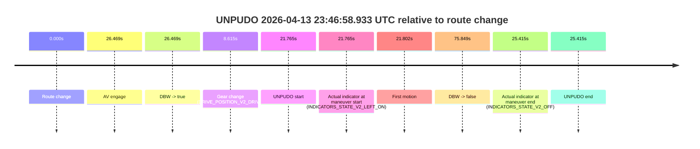
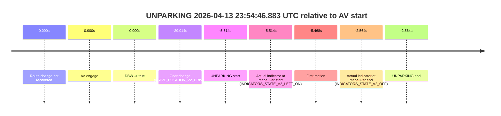

# Run Report: fme10003/2026-04-13--23-23-12--gen2-av-2e548bb0-8b9b-4ea4-9d4a-5592c0417380

| Field | Value |
|---|---|
| Run ID | `fme10003/2026-04-13--23-23-12--gen2-av-2e548bb0-8b9b-4ea4-9d4a-5592c0417380` |
| Date | `2026-04-13` |
| Model(s) | `lively-orange-horse` |
| Author | `guy.geva` |
| Event count | `4` |

## unpudo 2026-04-13 23:45:06.683 UTC

| Field | Value |
|---|---|
| Model | `lively-orange-horse` |
| Author | `guy.geva` |
| Run ID | `fme10003/2026-04-13--23-23-12--gen2-av-2e548bb0-8b9b-4ea4-9d4a-5592c0417380` |
| Date | `2026-04-13` |
| Time (UTC) | `23:45:06.683` |
| Event type | `unpudo` |
| Disengagement type | `failed_to_unpudo` |
| Route change | `found` |
| Console | [run](https://console.sso.wayve.ai/run/fme10003/2026-04-13--23-23-12--gen2-av-2e548bb0-8b9b-4ea4-9d4a-5592c0417380?id=&time-unixus=1776123906683318) |
| Foxglove | [segment](https://app.foxglove.dev/wayve-on-prem/p/prj_0dX18KZdVHg1fmmI/view?ds=foxglove-stream&ds.deviceName=fme10003&ds.start=2026-04-13T23%3A44%3A46.169618Z&ds.end=2026-04-13T23%3A47%3A08.257101Z&layoutId=lay_0e7VD4WIKDQGU73Y&time=2026-04-13T23%3A45%3A06.683318Z) |

### Event card: fail

- Fail: AV owns part of the segment, but the event still resolves as a model-performance failure under the AV-only scoring rule.

| Event | Time (UTC) | Delta from route change |
|---|---:|---:|
| Route change | 2026-04-13 23:44:56.169 | `0.000s` |
| AV engage | 2026-04-13 23:45:12.836 | `16.667s` |
| DBW -> true | 2026-04-13 23:45:12.836 | `16.667s` |
| Gear change (DRIVE_POSITION_V2_DRIVE) | 2026-04-13 23:45:00.133 | `3.964s` |
| UNPUDO start | 2026-04-13 23:45:06.683 | `10.514s` |
| Actual indicator at maneuver start (INDICATORS_STATE_V2_LEFT_ON) | 2026-04-13 23:45:06.683 | `10.514s` |
| First motion | 2026-04-13 23:45:06.729 | `10.560s` |
| DBW -> false | 2026-04-13 23:46:58.257 | `122.087s` |
| Actual indicator at maneuver end (INDICATORS_STATE_V2_OFF) | 2026-04-13 23:45:10.033 | `13.864s` |
| UNPUDO end | 2026-04-13 23:45:10.033 | `13.864s` |

| Metric | Value |
|---|---|
| Outcome | `fail` |
| Effective failure type | `failed_to_unpudo` |
| Route change status | `found` |
| DBW at event start | `false` |
| DBW at event end | `false` |
| Predicted gear at AV start | `DRIVE_POSITION_V2_DRIVE` |
| Actual gear at AV start | `DRIVE_POSITION_V2_DRIVE` |
| Predicted gear at event start | `DRIVE_POSITION_V2_DRIVE` |
| Actual gear at event start | `DRIVE_POSITION_V2_DRIVE` |
| Planned indicator direction | `INDICATORS_STATE_V2_LEFT_ON` |
| Controller indicator direction | `INDICATORS_STATE_V2_LEFT_ON` |
| Actual indicator direction | `INDICATORS_STATE_V2_LEFT_ON` |
| Actual indicator at maneuver end | `INDICATORS_STATE_V2_OFF` |
| Driver accel help in AV | `false` |
| Driver accel help timestamp | `n/a` |
| Max accel pedal pct in AV | `0.0%` |
| Max brake pedal pct in AV | `0.0%` |
| Max speed mps in AV | `0.000` |
| Route -> AV | `16.667s` |
| AV -> event start | `-6.153s` |
| AV -> first motion | `-6.106s` |
| AV duration before disengagement | `105.421s` |
| Trajectory waypoint count | `36` |
| Driving-plan step count | `11` |

The scored portion starts from the AV-owned window, not from the pre-AV setup. Route-change search in the stopped pre-event segment was `found`, with the baseline therefore set to route change. At the event anchor the model predicts `DRIVE_POSITION_V2_DRIVE` and the actual gear is `DRIVE_POSITION_V2_DRIVE`. The effective model outcome is `fail` because `failed_to_unpudo`.

### Resolution

| Field | Value |
|---|---|
| Final outcome | `fail` |
| Do we agree with this label? | `yes` |
| Source disengagement type | `failed_to_unpudo` |
| Resolved effective failure type | `failed_to_unpudo` |
| Confidence | `high` |

## unpudo 2026-04-13 23:46:58.933 UTC

| Field | Value |
|---|---|
| Model | `lively-orange-horse` |
| Author | `guy.geva` |
| Run ID | `fme10003/2026-04-13--23-23-12--gen2-av-2e548bb0-8b9b-4ea4-9d4a-5592c0417380` |
| Date | `2026-04-13` |
| Time (UTC) | `23:46:58.933` |
| Event type | `unpudo` |
| Disengagement type | `failed_to_unpudo` |
| Route change | `found` |
| Console | [run](https://console.sso.wayve.ai/run/fme10003/2026-04-13--23-23-12--gen2-av-2e548bb0-8b9b-4ea4-9d4a-5592c0417380?id=&time-unixus=1776124018933317) |
| Foxglove | [segment](https://app.foxglove.dev/wayve-on-prem/p/prj_0dX18KZdVHg1fmmI/view?ds=foxglove-stream&ds.deviceName=fme10003&ds.start=2026-04-13T23%3A46%3A27.168244Z&ds.end=2026-04-13T23%3A48%3A03.017070Z&layoutId=lay_0e7VD4WIKDQGU73Y&time=2026-04-13T23%3A46%3A58.933317Z) |

### Event card: fail

- Fail: AV owns part of the segment, but the event still resolves as a model-performance failure under the AV-only scoring rule.

| Event | Time (UTC) | Delta from route change |
|---|---:|---:|
| Route change | 2026-04-13 23:46:37.168 | `0.000s` |
| AV engage | 2026-04-13 23:47:03.637 | `26.469s` |
| DBW -> true | 2026-04-13 23:47:03.637 | `26.469s` |
| Gear change (DRIVE_POSITION_V2_DRIVE) | 2026-04-13 23:46:45.783 | `8.615s` |
| UNPUDO start | 2026-04-13 23:46:58.933 | `21.765s` |
| Actual indicator at maneuver start (INDICATORS_STATE_V2_LEFT_ON) | 2026-04-13 23:46:58.933 | `21.765s` |
| First motion | 2026-04-13 23:46:58.970 | `21.802s` |
| DBW -> false | 2026-04-13 23:47:53.017 | `75.849s` |
| Actual indicator at maneuver end (INDICATORS_STATE_V2_OFF) | 2026-04-13 23:47:02.583 | `25.415s` |
| UNPUDO end | 2026-04-13 23:47:02.583 | `25.415s` |

| Metric | Value |
|---|---|
| Outcome | `fail` |
| Effective failure type | `failed_to_unpudo` |
| Route change status | `found` |
| DBW at event start | `false` |
| DBW at event end | `false` |
| Predicted gear at AV start | `DRIVE_POSITION_V2_DRIVE` |
| Actual gear at AV start | `DRIVE_POSITION_V2_DRIVE` |
| Predicted gear at event start | `DRIVE_POSITION_V2_DRIVE` |
| Actual gear at event start | `DRIVE_POSITION_V2_DRIVE` |
| Planned indicator direction | `INDICATORS_STATE_V2_RIGHT_ON` |
| Controller indicator direction | `INDICATORS_STATE_V2_RIGHT_ON` |
| Actual indicator direction | `INDICATORS_STATE_V2_LEFT_ON` |
| Actual indicator at maneuver end | `INDICATORS_STATE_V2_OFF` |
| Driver accel help in AV | `false` |
| Driver accel help timestamp | `n/a` |
| Max accel pedal pct in AV | `0.0%` |
| Max brake pedal pct in AV | `0.0%` |
| Max speed mps in AV | `0.000` |
| Route -> AV | `26.469s` |
| AV -> event start | `-4.704s` |
| AV -> first motion | `-4.667s` |
| AV duration before disengagement | `49.380s` |
| Trajectory waypoint count | `37` |
| Driving-plan step count | `11` |

The scored portion starts from the AV-owned window, not from the pre-AV setup. Route-change search in the stopped pre-event segment was `found`, with the baseline therefore set to route change. At the event anchor the model predicts `DRIVE_POSITION_V2_DRIVE` and the actual gear is `DRIVE_POSITION_V2_DRIVE`. The effective model outcome is `fail` because `failed_to_unpudo`.

### Resolution

| Field | Value |
|---|---|
| Final outcome | `fail` |
| Do we agree with this label? | `yes` |
| Source disengagement type | `failed_to_unpudo` |
| Resolved effective failure type | `failed_to_unpudo` |
| Confidence | `high` |

## unpudo 2026-04-13 23:47:53.733 UTC

| Field | Value |
|---|---|
| Model | `lively-orange-horse` |
| Author | `guy.geva` |
| Run ID | `fme10003/2026-04-13--23-23-12--gen2-av-2e548bb0-8b9b-4ea4-9d4a-5592c0417380` |
| Date | `2026-04-13` |
| Time (UTC) | `23:47:53.733` |
| Event type | `unpudo` |
| Disengagement type | `failed_to_unpudo` |
| Route change | `found` |
| Console | [run](https://console.sso.wayve.ai/run/fme10003/2026-04-13--23-23-12--gen2-av-2e548bb0-8b9b-4ea4-9d4a-5592c0417380?id=&time-unixus=1776124073733309) |
| Foxglove | [segment](https://app.foxglove.dev/wayve-on-prem/p/prj_0dX18KZdVHg1fmmI/view?ds=foxglove-stream&ds.deviceName=fme10003&ds.start=2026-04-13T23%3A46%3A27.168244Z&ds.end=2026-04-13T23%3A52%3A24.936308Z&layoutId=lay_0e7VD4WIKDQGU73Y&time=2026-04-13T23%3A47%3A53.733309Z) |

### Event card: fail

- Fail: AV owns part of the segment, but the event still resolves as a model-performance failure under the AV-only scoring rule.

| Event | Time (UTC) | Delta from route change |
|---|---:|---:|
| Route change | 2026-04-13 23:46:37.168 | `0.000s` |
| AV engage | 2026-04-13 23:47:59.776 | `82.608s` |
| DBW -> true | 2026-04-13 23:47:59.776 | `82.608s` |
| Gear change (DRIVE_POSITION_V2_DRIVE) | 2026-04-13 23:47:48.883 | `71.715s` |
| UNPUDO start | 2026-04-13 23:47:53.733 | `76.565s` |
| Actual indicator at maneuver start (INDICATORS_STATE_V2_LEFT_ON) | 2026-04-13 23:47:53.733 | `76.565s` |
| First motion | 2026-04-13 23:47:53.789 | `76.622s` |
| DBW -> false | 2026-04-13 23:52:14.936 | `337.768s` |
| Actual indicator at maneuver end (INDICATORS_STATE_V2_OFF) | 2026-04-13 23:47:57.283 | `80.115s` |
| UNPUDO end | 2026-04-13 23:47:57.283 | `80.115s` |

| Metric | Value |
|---|---|
| Outcome | `fail` |
| Effective failure type | `failed_to_unpudo` |
| Route change status | `found` |
| DBW at event start | `false` |
| DBW at event end | `false` |
| Predicted gear at AV start | `DRIVE_POSITION_V2_DRIVE` |
| Actual gear at AV start | `DRIVE_POSITION_V2_DRIVE` |
| Predicted gear at event start | `DRIVE_POSITION_V2_DRIVE` |
| Actual gear at event start | `DRIVE_POSITION_V2_DRIVE` |
| Planned indicator direction | `INDICATORS_STATE_V2_LEFT_ON` |
| Controller indicator direction | `INDICATORS_STATE_V2_LEFT_ON` |
| Actual indicator direction | `INDICATORS_STATE_V2_LEFT_ON` |
| Actual indicator at maneuver end | `INDICATORS_STATE_V2_OFF` |
| Driver accel help in AV | `false` |
| Driver accel help timestamp | `n/a` |
| Max accel pedal pct in AV | `0.0%` |
| Max brake pedal pct in AV | `0.0%` |
| Max speed mps in AV | `0.000` |
| Route -> AV | `82.608s` |
| AV -> event start | `-6.043s` |
| AV -> first motion | `-5.987s` |
| AV duration before disengagement | `255.160s` |
| Trajectory waypoint count | `35` |
| Driving-plan step count | `11` |

The scored portion starts from the AV-owned window, not from the pre-AV setup. Route-change search in the stopped pre-event segment was `found`, with the baseline therefore set to route change. At the event anchor the model predicts `DRIVE_POSITION_V2_DRIVE` and the actual gear is `DRIVE_POSITION_V2_DRIVE`. The effective model outcome is `fail` because `failed_to_unpudo`.

### Resolution

| Field | Value |
|---|---|
| Final outcome | `fail` |
| Do we agree with this label? | `yes` |
| Source disengagement type | `failed_to_unpudo` |
| Resolved effective failure type | `failed_to_unpudo` |
| Confidence | `high` |

## unparking 2026-04-13 23:54:46.883 UTC

| Field | Value |
|---|---|
| Model | `lively-orange-horse` |
| Author | `guy.geva` |
| Run ID | `fme10003/2026-04-13--23-23-12--gen2-av-2e548bb0-8b9b-4ea4-9d4a-5592c0417380` |
| Date | `2026-04-13` |
| Time (UTC) | `23:54:46.883` |
| Event type | `unparking` |
| Disengagement type | `failed_to_unpudo` |
| Route change | `not found` |
| Console | [run](https://console.sso.wayve.ai/run/fme10003/2026-04-13--23-23-12--gen2-av-2e548bb0-8b9b-4ea4-9d4a-5592c0417380?id=&time-unixus=1776124486883306) |
| Foxglove | [segment](https://app.foxglove.dev/wayve-on-prem/p/prj_0dX18KZdVHg1fmmI/view?ds=foxglove-stream&ds.deviceName=fme10003&ds.start=2026-04-13T23%3A54%3A13.383289Z&ds.end=2026-04-13T23%3A54%3A59.833301Z&layoutId=lay_0e7VD4WIKDQGU73Y&time=2026-04-13T23%3A54%3A46.883306Z) |

### Event card: fail

- Fail: AV owns part of the segment, but the event still resolves as a model-performance failure under the AV-only scoring rule.

| Event | Time (UTC) | Delta from AV start |
|---|---:|---:|
| Route change not recovered | 2026-04-13 23:54:52.397 | `0.000s` |
| AV engage | 2026-04-13 23:54:52.397 | `0.000s` |
| DBW -> true | 2026-04-13 23:54:52.397 | `0.000s` |
| Gear change (DRIVE_POSITION_V2_DRIVE) | 2026-04-13 23:54:23.383 | `-29.014s` |
| UNPARKING start | 2026-04-13 23:54:46.883 | `-5.514s` |
| Actual indicator at maneuver start (INDICATORS_STATE_V2_LEFT_ON) | 2026-04-13 23:54:46.883 | `-5.514s` |
| First motion | 2026-04-13 23:54:46.929 | `-5.468s` |
| Actual indicator at maneuver end (INDICATORS_STATE_V2_OFF) | 2026-04-13 23:54:49.833 | `-2.564s` |
| UNPARKING end | 2026-04-13 23:54:49.833 | `-2.564s` |

| Metric | Value |
|---|---|
| Outcome | `fail` |
| Effective failure type | `failed_to_unpudo` |
| Route change status | `not found` |
| DBW at event start | `false` |
| DBW at event end | `false` |
| Predicted gear at AV start | `DRIVE_POSITION_V2_DRIVE` |
| Actual gear at AV start | `DRIVE_POSITION_V2_DRIVE` |
| Predicted gear at event start | `DRIVE_POSITION_V2_DRIVE` |
| Actual gear at event start | `DRIVE_POSITION_V2_DRIVE` |
| Planned indicator direction | `INDICATORS_STATE_V2_LEFT_ON` |
| Controller indicator direction | `INDICATORS_STATE_V2_LEFT_ON` |
| Actual indicator direction | `INDICATORS_STATE_V2_LEFT_ON` |
| Actual indicator at maneuver end | `INDICATORS_STATE_V2_OFF` |
| Driver accel help in AV | `false` |
| Driver accel help timestamp | `n/a` |
| Max accel pedal pct in AV | `0.0%` |
| Max brake pedal pct in AV | `0.0%` |
| Max speed mps in AV | `0.000` |
| Route -> AV | `n/a` |
| AV -> event start | `-5.514s` |
| AV -> first motion | `-5.468s` |
| AV duration before disengagement | `n/a` |
| Trajectory waypoint count | `36` |
| Driving-plan step count | `11` |

The scored portion starts from the AV-owned window, not from the pre-AV setup. Route-change search in the stopped pre-event segment was `not found`, with the baseline therefore set to AV start. At the event anchor the model predicts `DRIVE_POSITION_V2_DRIVE` and the actual gear is `DRIVE_POSITION_V2_DRIVE`. The effective model outcome is `fail` because `failed_to_unpudo`.

### Resolution

| Field | Value |
|---|---|
| Final outcome | `fail` |
| Do we agree with this label? | `yes` |
| Source disengagement type | `failed_to_unpudo` |
| Resolved effective failure type | `failed_to_unpudo` |
| Confidence | `high` |
