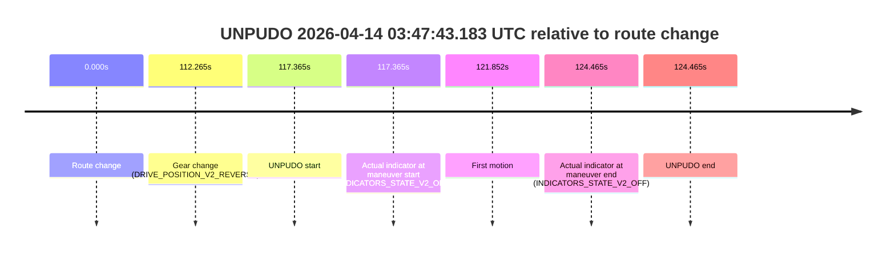
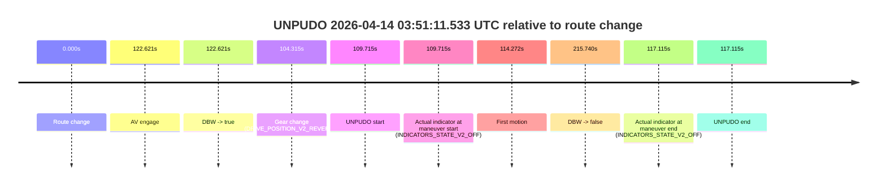
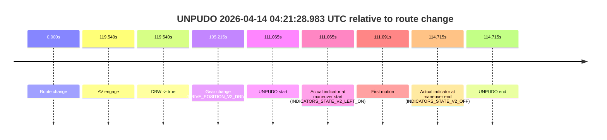

# Run Report: fme10003/2026-04-14--02-44-37--gen2-av-db6073cf-4000-40fa-bd6e-4fa8498cd8b6

| Field | Value |
|---|---|
| Run ID | `fme10003/2026-04-14--02-44-37--gen2-av-db6073cf-4000-40fa-bd6e-4fa8498cd8b6` |
| Date | `2026-04-14` |
| Model(s) | `lively-orange-horse` |
| Author | `guy.geva` |
| Event count | `14` |

## unpudo 2026-04-14 02:49:51.683 UTC

| Field | Value |
|---|---|
| Model | `lively-orange-horse` |
| Author | `guy.geva` |
| Run ID | `fme10003/2026-04-14--02-44-37--gen2-av-db6073cf-4000-40fa-bd6e-4fa8498cd8b6` |
| Date | `2026-04-14` |
| Time (UTC) | `02:49:51.683` |
| Event type | `unpudo` |
| Disengagement type | `none observed` |
| Route change | `found` |
| Console | [run](https://console.sso.wayve.ai/run/fme10003/2026-04-14--02-44-37--gen2-av-db6073cf-4000-40fa-bd6e-4fa8498cd8b6?id=&time-unixus=1776134991683301) |
| Foxglove | [segment](https://app.foxglove.dev/wayve-on-prem/p/prj_0dX18KZdVHg1fmmI/view?ds=foxglove-stream&ds.deviceName=fme10003&ds.start=2026-04-14T02%3A49%3A33.718899Z&ds.end=2026-04-14T02%3A51%3A14.697981Z&layoutId=lay_0e7VD4WIKDQGU73Y&time=2026-04-14T02%3A49%3A51.683301Z) |

### Event card: fail

- Fail: the credited unpudo does not stay AV-owned. The event window starts with DBW false, and the maneuver outcome lands outside a clean AV-owned segment.

| Event | Time (UTC) | Delta from route change |
|---|---:|---:|
| Route change | 2026-04-14 02:49:43.718 | `0.000s` |
| AV engage | 2026-04-14 02:50:13.538 | `29.819s` |
| DBW -> true | 2026-04-14 02:50:13.538 | `29.819s` |
| Gear change (DRIVE_POSITION_V2_REVERSE) | 2026-04-14 02:49:47.233 | `3.514s` |
| UNPUDO start | 2026-04-14 02:49:51.683 | `7.964s` |
| Actual indicator at maneuver start (INDICATORS_STATE_V2_OFF) | 2026-04-14 02:49:51.683 | `7.964s` |
| First motion | 2026-04-14 02:49:57.489 | `13.771s` |
| DBW -> false | 2026-04-14 02:51:04.697 | `80.979s` |
| Actual indicator at maneuver end (INDICATORS_STATE_V2_OFF) | 2026-04-14 02:50:01.083 | `17.364s` |
| UNPUDO end | 2026-04-14 02:50:01.083 | `17.364s` |

| Metric | Value |
|---|---|
| Outcome | `fail` |
| Effective failure type | `completed_outside_av` |
| Route change status | `found` |
| DBW at event start | `false` |
| DBW at event end | `false` |
| Predicted gear at AV start | `DRIVE_POSITION_V2_PARK` |
| Actual gear at AV start | `DRIVE_POSITION_V2_PARK` |
| Predicted gear at event start | `DRIVE_POSITION_V2_REVERSE` |
| Actual gear at event start | `DRIVE_POSITION_V2_REVERSE` |
| Planned indicator direction | `INDICATORS_STATE_V2_OFF` |
| Controller indicator direction | `INDICATORS_STATE_V2_OFF` |
| Actual indicator direction | `INDICATORS_STATE_V2_OFF` |
| Actual indicator at maneuver end | `INDICATORS_STATE_V2_OFF` |
| Driver accel help in AV | `false` |
| Driver accel help timestamp | `n/a` |
| Max accel pedal pct in AV | `0.0%` |
| Max brake pedal pct in AV | `0.0%` |
| Max speed mps in AV | `0.000` |
| Route -> AV | `29.819s` |
| AV -> event start | `-21.855s` |
| AV -> first motion | `-16.048s` |
| AV duration before disengagement | `51.160s` |
| Trajectory waypoint count | `36` |
| Driving-plan step count | `11` |

The scored portion starts from the AV-owned window, not from the pre-AV setup. Route-change search in the stopped pre-event segment was `found`, with the baseline therefore set to route change. At the event anchor the model predicts `DRIVE_POSITION_V2_REVERSE` and the actual gear is `DRIVE_POSITION_V2_REVERSE`. The effective model outcome is `fail` because `completed_outside_av`.

### Resolution

| Field | Value |
|---|---|
| Final outcome | `fail` |
| Do we agree with this label? | `yes` |
| Source disengagement type | `none observed` |
| Resolved effective failure type | `completed_outside_av` |
| Confidence | `high` |

## unpudo 2026-04-14 03:03:10.133 UTC

| Field | Value |
|---|---|
| Model | `lively-orange-horse` |
| Author | `guy.geva` |
| Run ID | `fme10003/2026-04-14--02-44-37--gen2-av-db6073cf-4000-40fa-bd6e-4fa8498cd8b6` |
| Date | `2026-04-14` |
| Time (UTC) | `03:03:10.133` |
| Event type | `unpudo` |
| Disengagement type | `failed_to_unpudo` |
| Route change | `found` |
| Console | [run](https://console.sso.wayve.ai/run/fme10003/2026-04-14--02-44-37--gen2-av-db6073cf-4000-40fa-bd6e-4fa8498cd8b6?id=&time-unixus=1776135790133304) |
| Foxglove | [segment](https://app.foxglove.dev/wayve-on-prem/p/prj_0dX18KZdVHg1fmmI/view?ds=foxglove-stream&ds.deviceName=fme10003&ds.start=2026-04-14T03%3A02%3A43.068456Z&ds.end=2026-04-14T03%3A08%3A21.858494Z&layoutId=lay_0e7VD4WIKDQGU73Y&time=2026-04-14T03%3A03%3A10.133304Z) |

### Event card: fail

- Fail: AV owns part of the segment, but the event still resolves as a model-performance failure under the AV-only scoring rule.

| Event | Time (UTC) | Delta from route change |
|---|---:|---:|
| Route change | 2026-04-14 03:02:53.068 | `0.000s` |
| AV engage | 2026-04-14 03:03:24.798 | `31.730s` |
| DBW -> true | 2026-04-14 03:03:24.798 | `31.730s` |
| Gear change (DRIVE_POSITION_V2_DRIVE) | 2026-04-14 03:03:03.983 | `10.915s` |
| UNPUDO start | 2026-04-14 03:03:10.133 | `17.065s` |
| Actual indicator at maneuver start (INDICATORS_STATE_V2_OFF) | 2026-04-14 03:03:10.133 | `17.065s` |
| First motion | 2026-04-14 03:03:10.149 | `17.081s` |
| DBW -> false | 2026-04-14 03:08:11.858 | `318.790s` |
| Actual indicator at maneuver end (INDICATORS_STATE_V2_OFF) | 2026-04-14 03:03:13.733 | `20.665s` |
| UNPUDO end | 2026-04-14 03:03:13.733 | `20.665s` |

| Metric | Value |
|---|---|
| Outcome | `fail` |
| Effective failure type | `failed_to_unpudo` |
| Route change status | `found` |
| DBW at event start | `false` |
| DBW at event end | `false` |
| Predicted gear at AV start | `DRIVE_POSITION_V2_DRIVE` |
| Actual gear at AV start | `DRIVE_POSITION_V2_DRIVE` |
| Predicted gear at event start | `DRIVE_POSITION_V2_DRIVE` |
| Actual gear at event start | `DRIVE_POSITION_V2_DRIVE` |
| Planned indicator direction | `INDICATORS_STATE_V2_LEFT_ON` |
| Controller indicator direction | `INDICATORS_STATE_V2_LEFT_ON` |
| Actual indicator direction | `INDICATORS_STATE_V2_OFF` |
| Actual indicator at maneuver end | `INDICATORS_STATE_V2_OFF` |
| Driver accel help in AV | `false` |
| Driver accel help timestamp | `n/a` |
| Max accel pedal pct in AV | `0.0%` |
| Max brake pedal pct in AV | `0.0%` |
| Max speed mps in AV | `0.000` |
| Route -> AV | `31.730s` |
| AV -> event start | `-14.666s` |
| AV -> first motion | `-14.649s` |
| AV duration before disengagement | `287.060s` |
| Trajectory waypoint count | `37` |
| Driving-plan step count | `11` |

The scored portion starts from the AV-owned window, not from the pre-AV setup. Route-change search in the stopped pre-event segment was `found`, with the baseline therefore set to route change. At the event anchor the model predicts `DRIVE_POSITION_V2_DRIVE` and the actual gear is `DRIVE_POSITION_V2_DRIVE`. The effective model outcome is `fail` because `failed_to_unpudo`.

### Resolution

| Field | Value |
|---|---|
| Final outcome | `fail` |
| Do we agree with this label? | `yes` |
| Source disengagement type | `failed_to_unpudo` |
| Resolved effective failure type | `failed_to_unpudo` |
| Confidence | `high` |

## unpudo 2026-04-14 03:08:12.333 UTC

| Field | Value |
|---|---|
| Model | `lively-orange-horse` |
| Author | `guy.geva` |
| Run ID | `fme10003/2026-04-14--02-44-37--gen2-av-db6073cf-4000-40fa-bd6e-4fa8498cd8b6` |
| Date | `2026-04-14` |
| Time (UTC) | `03:08:12.333` |
| Event type | `unpudo` |
| Disengagement type | `failed_to_unpudo` |
| Route change | `found` |
| Console | [run](https://console.sso.wayve.ai/run/fme10003/2026-04-14--02-44-37--gen2-av-db6073cf-4000-40fa-bd6e-4fa8498cd8b6?id=&time-unixus=1776136092333313) |
| Foxglove | [segment](https://app.foxglove.dev/wayve-on-prem/p/prj_0dX18KZdVHg1fmmI/view?ds=foxglove-stream&ds.deviceName=fme10003&ds.start=2026-04-14T03%3A06%3A42.618557Z&ds.end=2026-04-14T03%3A08%3A25.633307Z&layoutId=lay_0e7VD4WIKDQGU73Y&time=2026-04-14T03%3A08%3A12.333313Z) |

### Event card: fail

- Fail: AV owns part of the segment, but the event still resolves as a model-performance failure under the AV-only scoring rule.

| Event | Time (UTC) | Delta from route change |
|---|---:|---:|
| Route change | 2026-04-14 03:06:52.618 | `0.000s` |
| Gear change (DRIVE_POSITION_V2_DRIVE) | 2026-04-14 03:08:06.233 | `73.615s` |
| UNPUDO start | 2026-04-14 03:08:12.333 | `79.715s` |
| Actual indicator at maneuver start (INDICATORS_STATE_V2_OFF) | 2026-04-14 03:08:12.333 | `79.715s` |
| First motion | 2026-04-14 03:08:12.389 | `79.771s` |
| Actual indicator at maneuver end (INDICATORS_STATE_V2_OFF) | 2026-04-14 03:08:15.633 | `83.015s` |
| UNPUDO end | 2026-04-14 03:08:15.633 | `83.015s` |

| Metric | Value |
|---|---|
| Outcome | `fail` |
| Effective failure type | `failed_to_unpudo` |
| Route change status | `found` |
| DBW at event start | `false` |
| DBW at event end | `false` |
| Predicted gear at AV start | `n/a` |
| Actual gear at AV start | `n/a` |
| Predicted gear at event start | `DRIVE_POSITION_V2_DRIVE` |
| Actual gear at event start | `DRIVE_POSITION_V2_DRIVE` |
| Planned indicator direction | `INDICATORS_STATE_V2_OFF` |
| Controller indicator direction | `INDICATORS_STATE_V2_OFF` |
| Actual indicator direction | `INDICATORS_STATE_V2_OFF` |
| Actual indicator at maneuver end | `INDICATORS_STATE_V2_OFF` |
| Driver accel help in AV | `false` |
| Driver accel help timestamp | `n/a` |
| Max accel pedal pct in AV | `0.0%` |
| Max brake pedal pct in AV | `0.0%` |
| Max speed mps in AV | `0.000` |
| Route -> AV | `n/a` |
| AV -> event start | `n/a` |
| AV -> first motion | `n/a` |
| AV duration before disengagement | `n/a` |
| Trajectory waypoint count | `36` |
| Driving-plan step count | `11` |

The scored portion starts from the AV-owned window, not from the pre-AV setup. Route-change search in the stopped pre-event segment was `found`, with the baseline therefore set to route change. At the event anchor the model predicts `DRIVE_POSITION_V2_DRIVE` and the actual gear is `DRIVE_POSITION_V2_DRIVE`. The effective model outcome is `fail` because `failed_to_unpudo`.

### Resolution

| Field | Value |
|---|---|
| Final outcome | `fail` |
| Do we agree with this label? | `yes` |
| Source disengagement type | `failed_to_unpudo` |
| Resolved effective failure type | `failed_to_unpudo` |
| Confidence | `high` |

## unpudo 2026-04-14 03:16:59.733 UTC

| Field | Value |
|---|---|
| Model | `lively-orange-horse` |
| Author | `guy.geva` |
| Run ID | `fme10003/2026-04-14--02-44-37--gen2-av-db6073cf-4000-40fa-bd6e-4fa8498cd8b6` |
| Date | `2026-04-14` |
| Time (UTC) | `03:16:59.733` |
| Event type | `unpudo` |
| Disengagement type | `none observed` |
| Route change | `found` |
| Console | [run](https://console.sso.wayve.ai/run/fme10003/2026-04-14--02-44-37--gen2-av-db6073cf-4000-40fa-bd6e-4fa8498cd8b6?id=&time-unixus=1776136619733300) |
| Foxglove | [segment](https://app.foxglove.dev/wayve-on-prem/p/prj_0dX18KZdVHg1fmmI/view?ds=foxglove-stream&ds.deviceName=fme10003&ds.start=2026-04-14T03%3A15%3A21.068303Z&ds.end=2026-04-14T03%3A18%3A16.799132Z&layoutId=lay_0e7VD4WIKDQGU73Y&time=2026-04-14T03%3A16%3A59.733300Z) |

### Event card: fail

- Fail: the credited unpudo does not stay AV-owned. The event window starts with DBW false, and the maneuver outcome lands outside a clean AV-owned segment.

| Event | Time (UTC) | Delta from route change |
|---|---:|---:|
| Route change | 2026-04-14 03:15:31.068 | `0.000s` |
| AV engage | 2026-04-14 03:17:06.357 | `95.290s` |
| DBW -> true | 2026-04-14 03:17:06.357 | `95.290s` |
| Gear change (DRIVE_POSITION_V2_DRIVE) | 2026-04-14 03:16:55.033 | `83.965s` |
| UNPUDO start | 2026-04-14 03:16:59.733 | `88.665s` |
| Actual indicator at maneuver start (INDICATORS_STATE_V2_LEFT_ON) | 2026-04-14 03:16:59.733 | `88.665s` |
| First motion | 2026-04-14 03:16:59.929 | `88.861s` |
| DBW -> false | 2026-04-14 03:18:06.799 | `155.731s` |
| Actual indicator at maneuver end (INDICATORS_STATE_V2_OFF) | 2026-04-14 03:17:03.833 | `92.765s` |
| UNPUDO end | 2026-04-14 03:17:03.833 | `92.765s` |

| Metric | Value |
|---|---|
| Outcome | `fail` |
| Effective failure type | `completed_outside_av` |
| Route change status | `found` |
| DBW at event start | `false` |
| DBW at event end | `false` |
| Predicted gear at AV start | `DRIVE_POSITION_V2_DRIVE` |
| Actual gear at AV start | `DRIVE_POSITION_V2_DRIVE` |
| Predicted gear at event start | `DRIVE_POSITION_V2_DRIVE` |
| Actual gear at event start | `DRIVE_POSITION_V2_DRIVE` |
| Planned indicator direction | `INDICATORS_STATE_V2_LEFT_ON` |
| Controller indicator direction | `INDICATORS_STATE_V2_LEFT_ON` |
| Actual indicator direction | `INDICATORS_STATE_V2_LEFT_ON` |
| Actual indicator at maneuver end | `INDICATORS_STATE_V2_OFF` |
| Driver accel help in AV | `false` |
| Driver accel help timestamp | `n/a` |
| Max accel pedal pct in AV | `0.0%` |
| Max brake pedal pct in AV | `0.0%` |
| Max speed mps in AV | `0.000` |
| Route -> AV | `95.290s` |
| AV -> event start | `-6.625s` |
| AV -> first motion | `-6.428s` |
| AV duration before disengagement | `60.441s` |
| Trajectory waypoint count | `37` |
| Driving-plan step count | `11` |

The scored portion starts from the AV-owned window, not from the pre-AV setup. Route-change search in the stopped pre-event segment was `found`, with the baseline therefore set to route change. At the event anchor the model predicts `DRIVE_POSITION_V2_DRIVE` and the actual gear is `DRIVE_POSITION_V2_DRIVE`. The effective model outcome is `fail` because `completed_outside_av`.

### Resolution

| Field | Value |
|---|---|
| Final outcome | `fail` |
| Do we agree with this label? | `yes` |
| Source disengagement type | `none observed` |
| Resolved effective failure type | `completed_outside_av` |
| Confidence | `high` |

## unpudo 2026-04-14 03:39:56.433 UTC

| Field | Value |
|---|---|
| Model | `lively-orange-horse` |
| Author | `guy.geva` |
| Run ID | `fme10003/2026-04-14--02-44-37--gen2-av-db6073cf-4000-40fa-bd6e-4fa8498cd8b6` |
| Date | `2026-04-14` |
| Time (UTC) | `03:39:56.433` |
| Event type | `unpudo` |
| Disengagement type | `failed_to_unpudo` |
| Route change | `found` |
| Console | [run](https://console.sso.wayve.ai/run/fme10003/2026-04-14--02-44-37--gen2-av-db6073cf-4000-40fa-bd6e-4fa8498cd8b6?id=&time-unixus=1776137996433306) |
| Foxglove | [segment](https://app.foxglove.dev/wayve-on-prem/p/prj_0dX18KZdVHg1fmmI/view?ds=foxglove-stream&ds.deviceName=fme10003&ds.start=2026-04-14T03%3A39%3A34.468249Z&ds.end=2026-04-14T03%3A40%3A33.239223Z&layoutId=lay_0e7VD4WIKDQGU73Y&time=2026-04-14T03%3A39%3A56.433306Z) |

### Event card: fail

- Fail: AV owns part of the segment, but the event still resolves as a model-performance failure under the AV-only scoring rule.

| Event | Time (UTC) | Delta from route change |
|---|---:|---:|
| Route change | 2026-04-14 03:39:44.468 | `0.000s` |
| AV engage | 2026-04-14 03:40:04.078 | `19.610s` |
| DBW -> true | 2026-04-14 03:40:04.078 | `19.610s` |
| Gear change (DRIVE_POSITION_V2_DRIVE) | 2026-04-14 03:39:50.583 | `6.115s` |
| UNPUDO start | 2026-04-14 03:39:56.433 | `11.965s` |
| Actual indicator at maneuver start (INDICATORS_STATE_V2_LEFT_ON) | 2026-04-14 03:39:56.433 | `11.965s` |
| First motion | 2026-04-14 03:39:56.489 | `12.022s` |
| DBW -> false | 2026-04-14 03:40:23.239 | `38.771s` |
| Actual indicator at maneuver end (INDICATORS_STATE_V2_OFF) | 2026-04-14 03:40:00.233 | `15.765s` |
| UNPUDO end | 2026-04-14 03:40:00.233 | `15.765s` |

| Metric | Value |
|---|---|
| Outcome | `fail` |
| Effective failure type | `failed_to_unpudo` |
| Route change status | `found` |
| DBW at event start | `false` |
| DBW at event end | `false` |
| Predicted gear at AV start | `DRIVE_POSITION_V2_DRIVE` |
| Actual gear at AV start | `DRIVE_POSITION_V2_DRIVE` |
| Predicted gear at event start | `DRIVE_POSITION_V2_DRIVE` |
| Actual gear at event start | `DRIVE_POSITION_V2_DRIVE` |
| Planned indicator direction | `INDICATORS_STATE_V2_OFF` |
| Controller indicator direction | `INDICATORS_STATE_V2_OFF` |
| Actual indicator direction | `INDICATORS_STATE_V2_LEFT_ON` |
| Actual indicator at maneuver end | `INDICATORS_STATE_V2_OFF` |
| Driver accel help in AV | `false` |
| Driver accel help timestamp | `n/a` |
| Max accel pedal pct in AV | `0.0%` |
| Max brake pedal pct in AV | `0.0%` |
| Max speed mps in AV | `0.000` |
| Route -> AV | `19.610s` |
| AV -> event start | `-7.645s` |
| AV -> first motion | `-7.588s` |
| AV duration before disengagement | `19.161s` |
| Trajectory waypoint count | `36` |
| Driving-plan step count | `11` |

The scored portion starts from the AV-owned window, not from the pre-AV setup. Route-change search in the stopped pre-event segment was `found`, with the baseline therefore set to route change. At the event anchor the model predicts `DRIVE_POSITION_V2_DRIVE` and the actual gear is `DRIVE_POSITION_V2_DRIVE`. The effective model outcome is `fail` because `failed_to_unpudo`.

### Resolution

| Field | Value |
|---|---|
| Final outcome | `fail` |
| Do we agree with this label? | `yes` |
| Source disengagement type | `failed_to_unpudo` |
| Resolved effective failure type | `failed_to_unpudo` |
| Confidence | `high` |

## unpudo 2026-04-14 03:45:58.883 UTC

| Field | Value |
|---|---|
| Model | `lively-orange-horse` |
| Author | `guy.geva` |
| Run ID | `fme10003/2026-04-14--02-44-37--gen2-av-db6073cf-4000-40fa-bd6e-4fa8498cd8b6` |
| Date | `2026-04-14` |
| Time (UTC) | `03:45:58.883` |
| Event type | `unpudo` |
| Disengagement type | `failed_to_unpudo` |
| Route change | `found` |
| Console | [run](https://console.sso.wayve.ai/run/fme10003/2026-04-14--02-44-37--gen2-av-db6073cf-4000-40fa-bd6e-4fa8498cd8b6?id=&time-unixus=1776138358883317) |
| Foxglove | [segment](https://app.foxglove.dev/wayve-on-prem/p/prj_0dX18KZdVHg1fmmI/view?ds=foxglove-stream&ds.deviceName=fme10003&ds.start=2026-04-14T03%3A45%3A35.818243Z&ds.end=2026-04-14T03%3A46%3A52.878037Z&layoutId=lay_0e7VD4WIKDQGU73Y&time=2026-04-14T03%3A45%3A58.883317Z) |

### Event card: fail

- Fail: AV owns part of the segment, but the event still resolves as a model-performance failure under the AV-only scoring rule.

| Event | Time (UTC) | Delta from route change |
|---|---:|---:|
| Route change | 2026-04-14 03:45:45.818 | `0.000s` |
| AV engage | 2026-04-14 03:46:16.138 | `30.320s` |
| DBW -> true | 2026-04-14 03:46:16.138 | `30.320s` |
| Gear change (DRIVE_POSITION_V2_DRIVE) | 2026-04-14 03:45:53.283 | `7.465s` |
| UNPUDO start | 2026-04-14 03:45:58.883 | `13.065s` |
| Actual indicator at maneuver start (INDICATORS_STATE_V2_OFF) | 2026-04-14 03:45:58.883 | `13.065s` |
| First motion | 2026-04-14 03:45:58.909 | `13.091s` |
| DBW -> false | 2026-04-14 03:46:42.878 | `57.060s` |
| Actual indicator at maneuver end (INDICATORS_STATE_V2_LEFT_ON) | 2026-04-14 03:46:09.283 | `23.465s` |
| UNPUDO end | 2026-04-14 03:46:09.283 | `23.465s` |

| Metric | Value |
|---|---|
| Outcome | `fail` |
| Effective failure type | `failed_to_unpudo` |
| Route change status | `found` |
| DBW at event start | `false` |
| DBW at event end | `false` |
| Predicted gear at AV start | `DRIVE_POSITION_V2_DRIVE` |
| Actual gear at AV start | `DRIVE_POSITION_V2_DRIVE` |
| Predicted gear at event start | `DRIVE_POSITION_V2_DRIVE` |
| Actual gear at event start | `DRIVE_POSITION_V2_DRIVE` |
| Planned indicator direction | `INDICATORS_STATE_V2_LEFT_ON` |
| Controller indicator direction | `INDICATORS_STATE_V2_LEFT_ON` |
| Actual indicator direction | `INDICATORS_STATE_V2_OFF` |
| Actual indicator at maneuver end | `INDICATORS_STATE_V2_LEFT_ON` |
| Driver accel help in AV | `false` |
| Driver accel help timestamp | `n/a` |
| Max accel pedal pct in AV | `0.0%` |
| Max brake pedal pct in AV | `0.0%` |
| Max speed mps in AV | `0.000` |
| Route -> AV | `30.320s` |
| AV -> event start | `-17.255s` |
| AV -> first motion | `-17.228s` |
| AV duration before disengagement | `26.740s` |
| Trajectory waypoint count | `37` |
| Driving-plan step count | `11` |

The scored portion starts from the AV-owned window, not from the pre-AV setup. Route-change search in the stopped pre-event segment was `found`, with the baseline therefore set to route change. At the event anchor the model predicts `DRIVE_POSITION_V2_DRIVE` and the actual gear is `DRIVE_POSITION_V2_DRIVE`. The effective model outcome is `fail` because `failed_to_unpudo`.

### Resolution

| Field | Value |
|---|---|
| Final outcome | `fail` |
| Do we agree with this label? | `yes` |
| Source disengagement type | `failed_to_unpudo` |
| Resolved effective failure type | `failed_to_unpudo` |
| Confidence | `high` |

## unpudo 2026-04-14 03:47:43.183 UTC

| Field | Value |
|---|---|
| Model | `lively-orange-horse` |
| Author | `guy.geva` |
| Run ID | `fme10003/2026-04-14--02-44-37--gen2-av-db6073cf-4000-40fa-bd6e-4fa8498cd8b6` |
| Date | `2026-04-14` |
| Time (UTC) | `03:47:43.183` |
| Event type | `unpudo` |
| Disengagement type | `none observed` |
| Route change | `found` |
| Console | [run](https://console.sso.wayve.ai/run/fme10003/2026-04-14--02-44-37--gen2-av-db6073cf-4000-40fa-bd6e-4fa8498cd8b6?id=&time-unixus=1776138463183303) |
| Foxglove | [segment](https://app.foxglove.dev/wayve-on-prem/p/prj_0dX18KZdVHg1fmmI/view?ds=foxglove-stream&ds.deviceName=fme10003&ds.start=2026-04-14T03%3A45%3A35.818243Z&ds.end=2026-04-14T03%3A48%3A00.283290Z&layoutId=lay_0e7VD4WIKDQGU73Y&time=2026-04-14T03%3A47%3A43.183303Z) |

### Event card: fail

- Fail: the credited unpudo does not stay AV-owned. The event window starts with DBW false, and the maneuver outcome lands outside a clean AV-owned segment.

| Event | Time (UTC) | Delta from route change |
|---|---:|---:|
| Route change | 2026-04-14 03:45:45.818 | `0.000s` |
| Gear change (DRIVE_POSITION_V2_REVERSE) | 2026-04-14 03:47:38.083 | `112.265s` |
| UNPUDO start | 2026-04-14 03:47:43.183 | `117.365s` |
| Actual indicator at maneuver start (INDICATORS_STATE_V2_OFF) | 2026-04-14 03:47:43.183 | `117.365s` |
| First motion | 2026-04-14 03:47:47.669 | `121.852s` |
| Actual indicator at maneuver end (INDICATORS_STATE_V2_OFF) | 2026-04-14 03:47:50.283 | `124.465s` |
| UNPUDO end | 2026-04-14 03:47:50.283 | `124.465s` |

| Metric | Value |
|---|---|
| Outcome | `fail` |
| Effective failure type | `not_av_owned` |
| Route change status | `found` |
| DBW at event start | `false` |
| DBW at event end | `false` |
| Predicted gear at AV start | `n/a` |
| Actual gear at AV start | `n/a` |
| Predicted gear at event start | `DRIVE_POSITION_V2_REVERSE` |
| Actual gear at event start | `DRIVE_POSITION_V2_REVERSE` |
| Planned indicator direction | `INDICATORS_STATE_V2_OFF` |
| Controller indicator direction | `INDICATORS_STATE_V2_OFF` |
| Actual indicator direction | `INDICATORS_STATE_V2_OFF` |
| Actual indicator at maneuver end | `INDICATORS_STATE_V2_OFF` |
| Driver accel help in AV | `false` |
| Driver accel help timestamp | `n/a` |
| Max accel pedal pct in AV | `0.0%` |
| Max brake pedal pct in AV | `0.0%` |
| Max speed mps in AV | `0.000` |
| Route -> AV | `n/a` |
| AV -> event start | `n/a` |
| AV -> first motion | `n/a` |
| AV duration before disengagement | `n/a` |
| Trajectory waypoint count | `37` |
| Driving-plan step count | `11` |

The scored portion starts from the AV-owned window, not from the pre-AV setup. Route-change search in the stopped pre-event segment was `found`, with the baseline therefore set to route change. At the event anchor the model predicts `DRIVE_POSITION_V2_REVERSE` and the actual gear is `DRIVE_POSITION_V2_REVERSE`. The effective model outcome is `fail` because `not_av_owned`.

### Resolution

| Field | Value |
|---|---|
| Final outcome | `fail` |
| Do we agree with this label? | `yes` |
| Source disengagement type | `none observed` |
| Resolved effective failure type | `not_av_owned` |
| Confidence | `high` |

## unpudo 2026-04-14 03:51:11.533 UTC

| Field | Value |
|---|---|
| Model | `lively-orange-horse` |
| Author | `guy.geva` |
| Run ID | `fme10003/2026-04-14--02-44-37--gen2-av-db6073cf-4000-40fa-bd6e-4fa8498cd8b6` |
| Date | `2026-04-14` |
| Time (UTC) | `03:51:11.533` |
| Event type | `unpudo` |
| Disengagement type | `none observed` |
| Route change | `found` |
| Console | [run](https://console.sso.wayve.ai/run/fme10003/2026-04-14--02-44-37--gen2-av-db6073cf-4000-40fa-bd6e-4fa8498cd8b6?id=&time-unixus=1776138671533318) |
| Foxglove | [segment](https://app.foxglove.dev/wayve-on-prem/p/prj_0dX18KZdVHg1fmmI/view?ds=foxglove-stream&ds.deviceName=fme10003&ds.start=2026-04-14T03%3A49%3A11.818208Z&ds.end=2026-04-14T03%3A53%3A07.557973Z&layoutId=lay_0e7VD4WIKDQGU73Y&time=2026-04-14T03%3A51%3A11.533318Z) |

### Event card: fail

- Fail: the credited unpudo does not stay AV-owned. The event window starts with DBW false, and the maneuver outcome lands outside a clean AV-owned segment.

| Event | Time (UTC) | Delta from route change |
|---|---:|---:|
| Route change | 2026-04-14 03:49:21.818 | `0.000s` |
| AV engage | 2026-04-14 03:51:24.439 | `122.621s` |
| DBW -> true | 2026-04-14 03:51:24.439 | `122.621s` |
| Gear change (DRIVE_POSITION_V2_REVERSE) | 2026-04-14 03:51:06.133 | `104.315s` |
| UNPUDO start | 2026-04-14 03:51:11.533 | `109.715s` |
| Actual indicator at maneuver start (INDICATORS_STATE_V2_OFF) | 2026-04-14 03:51:11.533 | `109.715s` |
| First motion | 2026-04-14 03:51:16.089 | `114.272s` |
| DBW -> false | 2026-04-14 03:52:57.557 | `215.740s` |
| Actual indicator at maneuver end (INDICATORS_STATE_V2_OFF) | 2026-04-14 03:51:18.933 | `117.115s` |
| UNPUDO end | 2026-04-14 03:51:18.933 | `117.115s` |

| Metric | Value |
|---|---|
| Outcome | `fail` |
| Effective failure type | `completed_outside_av` |
| Route change status | `found` |
| DBW at event start | `false` |
| DBW at event end | `false` |
| Predicted gear at AV start | `DRIVE_POSITION_V2_DRIVE` |
| Actual gear at AV start | `DRIVE_POSITION_V2_DRIVE` |
| Predicted gear at event start | `DRIVE_POSITION_V2_REVERSE` |
| Actual gear at event start | `DRIVE_POSITION_V2_REVERSE` |
| Planned indicator direction | `INDICATORS_STATE_V2_OFF` |
| Controller indicator direction | `INDICATORS_STATE_V2_OFF` |
| Actual indicator direction | `INDICATORS_STATE_V2_OFF` |
| Actual indicator at maneuver end | `INDICATORS_STATE_V2_OFF` |
| Driver accel help in AV | `false` |
| Driver accel help timestamp | `n/a` |
| Max accel pedal pct in AV | `0.0%` |
| Max brake pedal pct in AV | `0.0%` |
| Max speed mps in AV | `0.000` |
| Route -> AV | `122.621s` |
| AV -> event start | `-12.906s` |
| AV -> first motion | `-8.349s` |
| AV duration before disengagement | `93.119s` |
| Trajectory waypoint count | `37` |
| Driving-plan step count | `11` |

The scored portion starts from the AV-owned window, not from the pre-AV setup. Route-change search in the stopped pre-event segment was `found`, with the baseline therefore set to route change. At the event anchor the model predicts `DRIVE_POSITION_V2_REVERSE` and the actual gear is `DRIVE_POSITION_V2_REVERSE`. The effective model outcome is `fail` because `completed_outside_av`.

### Resolution

| Field | Value |
|---|---|
| Final outcome | `fail` |
| Do we agree with this label? | `yes` |
| Source disengagement type | `none observed` |
| Resolved effective failure type | `completed_outside_av` |
| Confidence | `high` |

## unpudo 2026-04-14 04:09:42.983 UTC

| Field | Value |
|---|---|
| Model | `lively-orange-horse` |
| Author | `guy.geva` |
| Run ID | `fme10003/2026-04-14--02-44-37--gen2-av-db6073cf-4000-40fa-bd6e-4fa8498cd8b6` |
| Date | `2026-04-14` |
| Time (UTC) | `04:09:42.983` |
| Event type | `unpudo` |
| Disengagement type | `failed_to_unpudo` |
| Route change | `found` |
| Console | [run](https://console.sso.wayve.ai/run/fme10003/2026-04-14--02-44-37--gen2-av-db6073cf-4000-40fa-bd6e-4fa8498cd8b6?id=&time-unixus=1776139782983309) |
| Foxglove | [segment](https://app.foxglove.dev/wayve-on-prem/p/prj_0dX18KZdVHg1fmmI/view?ds=foxglove-stream&ds.deviceName=fme10003&ds.start=2026-04-14T04%3A09%3A24.218245Z&ds.end=2026-04-14T04%3A10%3A04.397881Z&layoutId=lay_0e7VD4WIKDQGU73Y&time=2026-04-14T04%3A09%3A42.983309Z) |

### Event card: fail

- Fail: AV owns part of the segment, but the event still resolves as a model-performance failure under the AV-only scoring rule.

| Event | Time (UTC) | Delta from route change |
|---|---:|---:|
| Route change | 2026-04-14 04:09:34.218 | `0.000s` |
| AV engage | 2026-04-14 04:09:49.758 | `15.540s` |
| DBW -> true | 2026-04-14 04:09:49.758 | `15.540s` |
| Gear change (DRIVE_POSITION_V2_DRIVE) | 2026-04-14 04:09:37.183 | `2.965s` |
| UNPUDO start | 2026-04-14 04:09:42.983 | `8.765s` |
| Actual indicator at maneuver start (INDICATORS_STATE_V2_LEFT_ON) | 2026-04-14 04:09:42.983 | `8.765s` |
| First motion | 2026-04-14 04:09:43.009 | `8.792s` |
| DBW -> false | 2026-04-14 04:09:54.397 | `20.180s` |
| Actual indicator at maneuver end (INDICATORS_STATE_V2_OFF) | 2026-04-14 04:09:46.033 | `11.815s` |
| UNPUDO end | 2026-04-14 04:09:46.033 | `11.815s` |

| Metric | Value |
|---|---|
| Outcome | `fail` |
| Effective failure type | `failed_to_unpudo` |
| Route change status | `found` |
| DBW at event start | `false` |
| DBW at event end | `false` |
| Predicted gear at AV start | `DRIVE_POSITION_V2_DRIVE` |
| Actual gear at AV start | `DRIVE_POSITION_V2_DRIVE` |
| Predicted gear at event start | `DRIVE_POSITION_V2_DRIVE` |
| Actual gear at event start | `DRIVE_POSITION_V2_DRIVE` |
| Planned indicator direction | `INDICATORS_STATE_V2_LEFT_ON` |
| Controller indicator direction | `INDICATORS_STATE_V2_LEFT_ON` |
| Actual indicator direction | `INDICATORS_STATE_V2_LEFT_ON` |
| Actual indicator at maneuver end | `INDICATORS_STATE_V2_OFF` |
| Driver accel help in AV | `false` |
| Driver accel help timestamp | `n/a` |
| Max accel pedal pct in AV | `0.0%` |
| Max brake pedal pct in AV | `0.0%` |
| Max speed mps in AV | `0.000` |
| Route -> AV | `15.540s` |
| AV -> event start | `-6.775s` |
| AV -> first motion | `-6.748s` |
| AV duration before disengagement | `4.640s` |
| Trajectory waypoint count | `36` |
| Driving-plan step count | `11` |

The scored portion starts from the AV-owned window, not from the pre-AV setup. Route-change search in the stopped pre-event segment was `found`, with the baseline therefore set to route change. At the event anchor the model predicts `DRIVE_POSITION_V2_DRIVE` and the actual gear is `DRIVE_POSITION_V2_DRIVE`. The effective model outcome is `fail` because `failed_to_unpudo`.

### Resolution

| Field | Value |
|---|---|
| Final outcome | `fail` |
| Do we agree with this label? | `yes` |
| Source disengagement type | `failed_to_unpudo` |
| Resolved effective failure type | `failed_to_unpudo` |
| Confidence | `high` |

## unpudo 2026-04-14 04:10:11.483 UTC

| Field | Value |
|---|---|
| Model | `lively-orange-horse` |
| Author | `guy.geva` |
| Run ID | `fme10003/2026-04-14--02-44-37--gen2-av-db6073cf-4000-40fa-bd6e-4fa8498cd8b6` |
| Date | `2026-04-14` |
| Time (UTC) | `04:10:11.483` |
| Event type | `unpudo` |
| Disengagement type | `failed_to_pudo` |
| Route change | `found` |
| Console | [run](https://console.sso.wayve.ai/run/fme10003/2026-04-14--02-44-37--gen2-av-db6073cf-4000-40fa-bd6e-4fa8498cd8b6?id=&time-unixus=1776139811483296) |
| Foxglove | [segment](https://app.foxglove.dev/wayve-on-prem/p/prj_0dX18KZdVHg1fmmI/view?ds=foxglove-stream&ds.deviceName=fme10003&ds.start=2026-04-14T04%3A09%3A24.218245Z&ds.end=2026-04-14T04%3A12%3A42.778426Z&layoutId=lay_0e7VD4WIKDQGU73Y&time=2026-04-14T04%3A10%3A11.483296Z) |

### Event card: fail

- Fail: AV owns part of the segment, but the event still resolves as a model-performance failure under the AV-only scoring rule.

| Event | Time (UTC) | Delta from route change |
|---|---:|---:|
| Route change | 2026-04-14 04:09:34.218 | `0.000s` |
| AV engage | 2026-04-14 04:10:17.897 | `43.680s` |
| DBW -> true | 2026-04-14 04:10:17.897 | `43.680s` |
| Gear change (DRIVE_POSITION_V2_DRIVE) | 2026-04-14 04:10:05.833 | `31.615s` |
| UNPUDO start | 2026-04-14 04:10:11.483 | `37.265s` |
| Actual indicator at maneuver start (INDICATORS_STATE_V2_LEFT_ON) | 2026-04-14 04:10:11.483 | `37.265s` |
| First motion | 2026-04-14 04:10:11.509 | `37.292s` |
| DBW -> false | 2026-04-14 04:12:32.778 | `178.560s` |
| Actual indicator at maneuver end (INDICATORS_STATE_V2_OFF) | 2026-04-14 04:10:13.933 | `39.715s` |
| UNPUDO end | 2026-04-14 04:10:13.933 | `39.715s` |

| Metric | Value |
|---|---|
| Outcome | `fail` |
| Effective failure type | `failed_to_pudo` |
| Route change status | `found` |
| DBW at event start | `false` |
| DBW at event end | `false` |
| Predicted gear at AV start | `DRIVE_POSITION_V2_DRIVE` |
| Actual gear at AV start | `DRIVE_POSITION_V2_DRIVE` |
| Predicted gear at event start | `DRIVE_POSITION_V2_DRIVE` |
| Actual gear at event start | `DRIVE_POSITION_V2_DRIVE` |
| Planned indicator direction | `INDICATORS_STATE_V2_RIGHT_ON` |
| Controller indicator direction | `INDICATORS_STATE_V2_RIGHT_ON` |
| Actual indicator direction | `INDICATORS_STATE_V2_LEFT_ON` |
| Actual indicator at maneuver end | `INDICATORS_STATE_V2_OFF` |
| Driver accel help in AV | `false` |
| Driver accel help timestamp | `n/a` |
| Max accel pedal pct in AV | `0.0%` |
| Max brake pedal pct in AV | `0.0%` |
| Max speed mps in AV | `0.000` |
| Route -> AV | `43.680s` |
| AV -> event start | `-6.415s` |
| AV -> first motion | `-6.388s` |
| AV duration before disengagement | `134.880s` |
| Trajectory waypoint count | `37` |
| Driving-plan step count | `11` |

The scored portion starts from the AV-owned window, not from the pre-AV setup. Route-change search in the stopped pre-event segment was `found`, with the baseline therefore set to route change. At the event anchor the model predicts `DRIVE_POSITION_V2_DRIVE` and the actual gear is `DRIVE_POSITION_V2_DRIVE`. The effective model outcome is `fail` because `failed_to_pudo`.

### Resolution

| Field | Value |
|---|---|
| Final outcome | `fail` |
| Do we agree with this label? | `yes` |
| Source disengagement type | `failed_to_pudo` |
| Resolved effective failure type | `failed_to_pudo` |
| Confidence | `high` |

## unpudo 2026-04-14 04:13:13.133 UTC

| Field | Value |
|---|---|
| Model | `lively-orange-horse` |
| Author | `guy.geva` |
| Run ID | `fme10003/2026-04-14--02-44-37--gen2-av-db6073cf-4000-40fa-bd6e-4fa8498cd8b6` |
| Date | `2026-04-14` |
| Time (UTC) | `04:13:13.133` |
| Event type | `unpudo` |
| Disengagement type | `failed_to_unpudo` |
| Route change | `found` |
| Console | [run](https://console.sso.wayve.ai/run/fme10003/2026-04-14--02-44-37--gen2-av-db6073cf-4000-40fa-bd6e-4fa8498cd8b6?id=&time-unixus=1776139993133304) |
| Foxglove | [segment](https://app.foxglove.dev/wayve-on-prem/p/prj_0dX18KZdVHg1fmmI/view?ds=foxglove-stream&ds.deviceName=fme10003&ds.start=2026-04-14T04%3A12%3A53.518251Z&ds.end=2026-04-14T04%3A14%3A32.297339Z&layoutId=lay_0e7VD4WIKDQGU73Y&time=2026-04-14T04%3A13%3A13.133304Z) |

### Event card: fail

- Fail: AV owns part of the segment, but the event still resolves as a model-performance failure under the AV-only scoring rule.

| Event | Time (UTC) | Delta from route change |
|---|---:|---:|
| Route change | 2026-04-14 04:13:03.518 | `0.000s` |
| AV engage | 2026-04-14 04:13:20.497 | `16.980s` |
| DBW -> true | 2026-04-14 04:13:20.497 | `16.980s` |
| Gear change (DRIVE_POSITION_V2_DRIVE) | 2026-04-14 04:13:09.133 | `5.615s` |
| UNPUDO start | 2026-04-14 04:13:13.133 | `9.615s` |
| Actual indicator at maneuver start (INDICATORS_STATE_V2_LEFT_ON) | 2026-04-14 04:13:13.133 | `9.615s` |
| First motion | 2026-04-14 04:13:13.149 | `9.632s` |
| DBW -> false | 2026-04-14 04:14:22.297 | `78.779s` |
| Actual indicator at maneuver end (INDICATORS_STATE_V2_OFF) | 2026-04-14 04:13:15.883 | `12.365s` |
| UNPUDO end | 2026-04-14 04:13:15.883 | `12.365s` |

| Metric | Value |
|---|---|
| Outcome | `fail` |
| Effective failure type | `failed_to_unpudo` |
| Route change status | `found` |
| DBW at event start | `false` |
| DBW at event end | `false` |
| Predicted gear at AV start | `DRIVE_POSITION_V2_DRIVE` |
| Actual gear at AV start | `DRIVE_POSITION_V2_DRIVE` |
| Predicted gear at event start | `DRIVE_POSITION_V2_DRIVE` |
| Actual gear at event start | `DRIVE_POSITION_V2_DRIVE` |
| Planned indicator direction | `INDICATORS_STATE_V2_RIGHT_ON` |
| Controller indicator direction | `INDICATORS_STATE_V2_RIGHT_ON` |
| Actual indicator direction | `INDICATORS_STATE_V2_LEFT_ON` |
| Actual indicator at maneuver end | `INDICATORS_STATE_V2_OFF` |
| Driver accel help in AV | `false` |
| Driver accel help timestamp | `n/a` |
| Max accel pedal pct in AV | `0.0%` |
| Max brake pedal pct in AV | `0.0%` |
| Max speed mps in AV | `0.000` |
| Route -> AV | `16.980s` |
| AV -> event start | `-7.365s` |
| AV -> first motion | `-7.348s` |
| AV duration before disengagement | `61.799s` |
| Trajectory waypoint count | `36` |
| Driving-plan step count | `11` |

The scored portion starts from the AV-owned window, not from the pre-AV setup. Route-change search in the stopped pre-event segment was `found`, with the baseline therefore set to route change. At the event anchor the model predicts `DRIVE_POSITION_V2_DRIVE` and the actual gear is `DRIVE_POSITION_V2_DRIVE`. The effective model outcome is `fail` because `failed_to_unpudo`.

### Resolution

| Field | Value |
|---|---|
| Final outcome | `fail` |
| Do we agree with this label? | `yes` |
| Source disengagement type | `failed_to_unpudo` |
| Resolved effective failure type | `failed_to_unpudo` |
| Confidence | `high` |

## unpudo 2026-04-14 04:14:31.033 UTC

| Field | Value |
|---|---|
| Model | `lively-orange-horse` |
| Author | `guy.geva` |
| Run ID | `fme10003/2026-04-14--02-44-37--gen2-av-db6073cf-4000-40fa-bd6e-4fa8498cd8b6` |
| Date | `2026-04-14` |
| Time (UTC) | `04:14:31.033` |
| Event type | `unpudo` |
| Disengagement type | `failed_to_unpudo` |
| Route change | `found` |
| Console | [run](https://console.sso.wayve.ai/run/fme10003/2026-04-14--02-44-37--gen2-av-db6073cf-4000-40fa-bd6e-4fa8498cd8b6?id=&time-unixus=1776140071033293) |
| Foxglove | [segment](https://app.foxglove.dev/wayve-on-prem/p/prj_0dX18KZdVHg1fmmI/view?ds=foxglove-stream&ds.deviceName=fme10003&ds.start=2026-04-14T04%3A12%3A53.518251Z&ds.end=2026-04-14T04%3A15%3A09.097904Z&layoutId=lay_0e7VD4WIKDQGU73Y&time=2026-04-14T04%3A14%3A31.033293Z) |

### Event card: fail

- Fail: AV owns part of the segment, but the event still resolves as a model-performance failure under the AV-only scoring rule.

| Event | Time (UTC) | Delta from route change |
|---|---:|---:|
| Route change | 2026-04-14 04:13:03.518 | `0.000s` |
| AV engage | 2026-04-14 04:14:49.999 | `106.481s` |
| DBW -> true | 2026-04-14 04:14:49.999 | `106.481s` |
| Gear change (DRIVE_POSITION_V2_REVERSE) | 2026-04-14 04:14:24.783 | `81.265s` |
| UNPUDO start | 2026-04-14 04:14:31.033 | `87.515s` |
| Actual indicator at maneuver start (INDICATORS_STATE_V2_OFF) | 2026-04-14 04:14:31.033 | `87.515s` |
| First motion | 2026-04-14 04:14:44.229 | `100.712s` |
| DBW -> false | 2026-04-14 04:14:59.097 | `115.580s` |
| Actual indicator at maneuver end (INDICATORS_STATE_V2_OFF) | 2026-04-14 04:14:47.183 | `103.665s` |
| UNPUDO end | 2026-04-14 04:14:47.183 | `103.665s` |

| Metric | Value |
|---|---|
| Outcome | `fail` |
| Effective failure type | `failed_to_unpudo` |
| Route change status | `found` |
| DBW at event start | `false` |
| DBW at event end | `false` |
| Predicted gear at AV start | `DRIVE_POSITION_V2_DRIVE` |
| Actual gear at AV start | `DRIVE_POSITION_V2_DRIVE` |
| Predicted gear at event start | `DRIVE_POSITION_V2_REVERSE` |
| Actual gear at event start | `DRIVE_POSITION_V2_REVERSE` |
| Planned indicator direction | `INDICATORS_STATE_V2_LEFT_ON` |
| Controller indicator direction | `INDICATORS_STATE_V2_LEFT_ON` |
| Actual indicator direction | `INDICATORS_STATE_V2_OFF` |
| Actual indicator at maneuver end | `INDICATORS_STATE_V2_OFF` |
| Driver accel help in AV | `false` |
| Driver accel help timestamp | `n/a` |
| Max accel pedal pct in AV | `0.0%` |
| Max brake pedal pct in AV | `0.0%` |
| Max speed mps in AV | `0.000` |
| Route -> AV | `106.481s` |
| AV -> event start | `-18.966s` |
| AV -> first motion | `-5.769s` |
| AV duration before disengagement | `9.099s` |
| Trajectory waypoint count | `36` |
| Driving-plan step count | `11` |

The scored portion starts from the AV-owned window, not from the pre-AV setup. Route-change search in the stopped pre-event segment was `found`, with the baseline therefore set to route change. At the event anchor the model predicts `DRIVE_POSITION_V2_REVERSE` and the actual gear is `DRIVE_POSITION_V2_REVERSE`. The effective model outcome is `fail` because `failed_to_unpudo`.

### Resolution

| Field | Value |
|---|---|
| Final outcome | `fail` |
| Do we agree with this label? | `yes` |
| Source disengagement type | `failed_to_unpudo` |
| Resolved effective failure type | `failed_to_unpudo` |
| Confidence | `high` |

## unpudo 2026-04-14 04:15:40.833 UTC

| Field | Value |
|---|---|
| Model | `lively-orange-horse` |
| Author | `guy.geva` |
| Run ID | `fme10003/2026-04-14--02-44-37--gen2-av-db6073cf-4000-40fa-bd6e-4fa8498cd8b6` |
| Date | `2026-04-14` |
| Time (UTC) | `04:15:40.833` |
| Event type | `unpudo` |
| Disengagement type | `failed_to_unpudo` |
| Route change | `found` |
| Console | [run](https://console.sso.wayve.ai/run/fme10003/2026-04-14--02-44-37--gen2-av-db6073cf-4000-40fa-bd6e-4fa8498cd8b6?id=&time-unixus=1776140140833318) |
| Foxglove | [segment](https://app.foxglove.dev/wayve-on-prem/p/prj_0dX18KZdVHg1fmmI/view?ds=foxglove-stream&ds.deviceName=fme10003&ds.start=2026-04-14T04%3A14%3A03.218239Z&ds.end=2026-04-14T04%3A17%3A27.597298Z&layoutId=lay_0e7VD4WIKDQGU73Y&time=2026-04-14T04%3A15%3A40.833318Z) |

### Event card: fail

- Fail: AV owns part of the segment, but the event still resolves as a model-performance failure under the AV-only scoring rule.

| Event | Time (UTC) | Delta from route change |
|---|---:|---:|
| Route change | 2026-04-14 04:14:13.218 | `0.000s` |
| AV engage | 2026-04-14 04:15:47.058 | `93.840s` |
| DBW -> true | 2026-04-14 04:15:47.058 | `93.840s` |
| Gear change (DRIVE_POSITION_V2_DRIVE) | 2026-04-14 04:15:36.083 | `82.865s` |
| UNPUDO start | 2026-04-14 04:15:40.833 | `87.615s` |
| Actual indicator at maneuver start (INDICATORS_STATE_V2_LEFT_ON) | 2026-04-14 04:15:40.833 | `87.615s` |
| First motion | 2026-04-14 04:15:40.869 | `87.651s` |
| DBW -> false | 2026-04-14 04:17:17.597 | `184.379s` |
| Actual indicator at maneuver end (INDICATORS_STATE_V2_OFF) | 2026-04-14 04:15:43.833 | `90.615s` |
| UNPUDO end | 2026-04-14 04:15:43.833 | `90.615s` |

| Metric | Value |
|---|---|
| Outcome | `fail` |
| Effective failure type | `failed_to_unpudo` |
| Route change status | `found` |
| DBW at event start | `false` |
| DBW at event end | `false` |
| Predicted gear at AV start | `DRIVE_POSITION_V2_DRIVE` |
| Actual gear at AV start | `DRIVE_POSITION_V2_DRIVE` |
| Predicted gear at event start | `DRIVE_POSITION_V2_DRIVE` |
| Actual gear at event start | `DRIVE_POSITION_V2_DRIVE` |
| Planned indicator direction | `INDICATORS_STATE_V2_LEFT_ON` |
| Controller indicator direction | `INDICATORS_STATE_V2_LEFT_ON` |
| Actual indicator direction | `INDICATORS_STATE_V2_LEFT_ON` |
| Actual indicator at maneuver end | `INDICATORS_STATE_V2_OFF` |
| Driver accel help in AV | `false` |
| Driver accel help timestamp | `n/a` |
| Max accel pedal pct in AV | `0.0%` |
| Max brake pedal pct in AV | `0.0%` |
| Max speed mps in AV | `0.000` |
| Route -> AV | `93.840s` |
| AV -> event start | `-6.225s` |
| AV -> first motion | `-6.188s` |
| AV duration before disengagement | `90.539s` |
| Trajectory waypoint count | `36` |
| Driving-plan step count | `11` |

The scored portion starts from the AV-owned window, not from the pre-AV setup. Route-change search in the stopped pre-event segment was `found`, with the baseline therefore set to route change. At the event anchor the model predicts `DRIVE_POSITION_V2_DRIVE` and the actual gear is `DRIVE_POSITION_V2_DRIVE`. The effective model outcome is `fail` because `failed_to_unpudo`.

### Resolution

| Field | Value |
|---|---|
| Final outcome | `fail` |
| Do we agree with this label? | `yes` |
| Source disengagement type | `failed_to_unpudo` |
| Resolved effective failure type | `failed_to_unpudo` |
| Confidence | `high` |

## unpudo 2026-04-14 04:21:28.983 UTC

| Field | Value |
|---|---|
| Model | `lively-orange-horse` |
| Author | `guy.geva` |
| Run ID | `fme10003/2026-04-14--02-44-37--gen2-av-db6073cf-4000-40fa-bd6e-4fa8498cd8b6` |
| Date | `2026-04-14` |
| Time (UTC) | `04:21:28.983` |
| Event type | `unpudo` |
| Disengagement type | `failed_to_unpudo` |
| Route change | `found` |
| Console | [run](https://console.sso.wayve.ai/run/fme10003/2026-04-14--02-44-37--gen2-av-db6073cf-4000-40fa-bd6e-4fa8498cd8b6?id=&time-unixus=1776140488983309) |
| Foxglove | [segment](https://app.foxglove.dev/wayve-on-prem/p/prj_0dX18KZdVHg1fmmI/view?ds=foxglove-stream&ds.deviceName=fme10003&ds.start=2026-04-14T04%3A19%3A27.918378Z&ds.end=2026-04-14T04%3A21%3A42.633305Z&layoutId=lay_0e7VD4WIKDQGU73Y&time=2026-04-14T04%3A21%3A28.983309Z) |

### Event card: fail

- Fail: AV owns part of the segment, but the event still resolves as a model-performance failure under the AV-only scoring rule.

| Event | Time (UTC) | Delta from route change |
|---|---:|---:|
| Route change | 2026-04-14 04:19:37.918 | `0.000s` |
| AV engage | 2026-04-14 04:21:37.458 | `119.540s` |
| DBW -> true | 2026-04-14 04:21:37.458 | `119.540s` |
| Gear change (DRIVE_POSITION_V2_DRIVE) | 2026-04-14 04:21:23.133 | `105.215s` |
| UNPUDO start | 2026-04-14 04:21:28.983 | `111.065s` |
| Actual indicator at maneuver start (INDICATORS_STATE_V2_LEFT_ON) | 2026-04-14 04:21:28.983 | `111.065s` |
| First motion | 2026-04-14 04:21:29.009 | `111.091s` |
| Actual indicator at maneuver end (INDICATORS_STATE_V2_OFF) | 2026-04-14 04:21:32.633 | `114.715s` |
| UNPUDO end | 2026-04-14 04:21:32.633 | `114.715s` |

| Metric | Value |
|---|---|
| Outcome | `fail` |
| Effective failure type | `failed_to_unpudo` |
| Route change status | `found` |
| DBW at event start | `false` |
| DBW at event end | `false` |
| Predicted gear at AV start | `DRIVE_POSITION_V2_DRIVE` |
| Actual gear at AV start | `DRIVE_POSITION_V2_DRIVE` |
| Predicted gear at event start | `DRIVE_POSITION_V2_DRIVE` |
| Actual gear at event start | `DRIVE_POSITION_V2_DRIVE` |
| Planned indicator direction | `INDICATORS_STATE_V2_LEFT_ON` |
| Controller indicator direction | `INDICATORS_STATE_V2_LEFT_ON` |
| Actual indicator direction | `INDICATORS_STATE_V2_LEFT_ON` |
| Actual indicator at maneuver end | `INDICATORS_STATE_V2_OFF` |
| Driver accel help in AV | `false` |
| Driver accel help timestamp | `n/a` |
| Max accel pedal pct in AV | `0.0%` |
| Max brake pedal pct in AV | `0.0%` |
| Max speed mps in AV | `0.000` |
| Route -> AV | `119.540s` |
| AV -> event start | `-8.475s` |
| AV -> first motion | `-8.448s` |
| AV duration before disengagement | `n/a` |
| Trajectory waypoint count | `37` |
| Driving-plan step count | `11` |

The scored portion starts from the AV-owned window, not from the pre-AV setup. Route-change search in the stopped pre-event segment was `found`, with the baseline therefore set to route change. At the event anchor the model predicts `DRIVE_POSITION_V2_DRIVE` and the actual gear is `DRIVE_POSITION_V2_DRIVE`. The effective model outcome is `fail` because `failed_to_unpudo`.

### Resolution

| Field | Value |
|---|---|
| Final outcome | `fail` |
| Do we agree with this label? | `yes` |
| Source disengagement type | `failed_to_unpudo` |
| Resolved effective failure type | `failed_to_unpudo` |
| Confidence | `high` |
