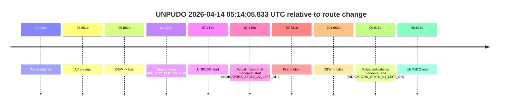
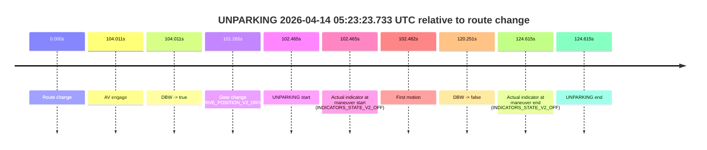

# Run Report: fme10003/2026-04-14--04-49-33--gen2-av-7e367ea5-8fa6-40ad-88f1-dd1c9c1e8830

| Field | Value |
|---|---|
| Run ID | `fme10003/2026-04-14--04-49-33--gen2-av-7e367ea5-8fa6-40ad-88f1-dd1c9c1e8830` |
| Date | `2026-04-14` |
| Model(s) | `lively-orange-horse` |
| Author | `guy.geva` |
| Event count | `4` |

## unpudo 2026-04-14 04:58:10.983 UTC

| Field | Value |
|---|---|
| Model | `lively-orange-horse` |
| Author | `guy.geva` |
| Run ID | `fme10003/2026-04-14--04-49-33--gen2-av-7e367ea5-8fa6-40ad-88f1-dd1c9c1e8830` |
| Date | `2026-04-14` |
| Time (UTC) | `04:58:10.983` |
| Event type | `unpudo` |
| Disengagement type | `failed_to_unpudo` |
| Route change | `found` |
| Console | [run](https://console.sso.wayve.ai/run/fme10003/2026-04-14--04-49-33--gen2-av-7e367ea5-8fa6-40ad-88f1-dd1c9c1e8830?id=&time-unixus=1776142690983310) |
| Foxglove | [segment](https://app.foxglove.dev/wayve-on-prem/p/prj_0dX18KZdVHg1fmmI/view?ds=foxglove-stream&ds.deviceName=fme10003&ds.start=2026-04-14T04%3A56%3A33.368215Z&ds.end=2026-04-14T05%3A13%3A49.318837Z&layoutId=lay_0e7VD4WIKDQGU73Y&time=2026-04-14T04%3A58%3A10.983310Z) |

### Event card: fail

- Fail: AV owns part of the segment, but the event still resolves as a model-performance failure under the AV-only scoring rule.

| Event | Time (UTC) | Delta from route change |
|---|---:|---:|
| Route change | 2026-04-14 04:56:43.368 | `0.000s` |
| AV engage | 2026-04-14 04:58:15.900 | `92.532s` |
| DBW -> true | 2026-04-14 04:58:15.900 | `92.532s` |
| Gear change (DRIVE_POSITION_V2_DRIVE) | 2026-04-14 04:58:03.733 | `80.365s` |
| UNPUDO start | 2026-04-14 04:58:10.983 | `87.615s` |
| Actual indicator at maneuver start (INDICATORS_STATE_V2_LEFT_ON) | 2026-04-14 04:58:10.983 | `87.615s` |
| First motion | 2026-04-14 04:58:11.009 | `87.642s` |
| DBW -> false | 2026-04-14 05:13:39.318 | `1015.951s` |
| Actual indicator at maneuver end (INDICATORS_STATE_V2_OFF) | 2026-04-14 04:58:14.133 | `90.765s` |
| UNPUDO end | 2026-04-14 04:58:14.133 | `90.765s` |

| Metric | Value |
|---|---|
| Outcome | `fail` |
| Effective failure type | `failed_to_unpudo` |
| Route change status | `found` |
| DBW at event start | `false` |
| DBW at event end | `false` |
| Predicted gear at AV start | `DRIVE_POSITION_V2_DRIVE` |
| Actual gear at AV start | `DRIVE_POSITION_V2_DRIVE` |
| Predicted gear at event start | `DRIVE_POSITION_V2_DRIVE` |
| Actual gear at event start | `DRIVE_POSITION_V2_DRIVE` |
| Planned indicator direction | `INDICATORS_STATE_V2_LEFT_ON` |
| Controller indicator direction | `INDICATORS_STATE_V2_LEFT_ON` |
| Actual indicator direction | `INDICATORS_STATE_V2_LEFT_ON` |
| Actual indicator at maneuver end | `INDICATORS_STATE_V2_OFF` |
| Driver accel help in AV | `false` |
| Driver accel help timestamp | `n/a` |
| Max accel pedal pct in AV | `0.0%` |
| Max brake pedal pct in AV | `0.0%` |
| Max speed mps in AV | `0.000` |
| Route -> AV | `92.532s` |
| AV -> event start | `-4.917s` |
| AV -> first motion | `-4.890s` |
| AV duration before disengagement | `923.419s` |
| Trajectory waypoint count | `37` |
| Driving-plan step count | `11` |

The scored portion starts from the AV-owned window, not from the pre-AV setup. Route-change search in the stopped pre-event segment was `found`, with the baseline therefore set to route change. At the event anchor the model predicts `DRIVE_POSITION_V2_DRIVE` and the actual gear is `DRIVE_POSITION_V2_DRIVE`. The effective model outcome is `fail` because `failed_to_unpudo`.

### Resolution

| Field | Value |
|---|---|
| Final outcome | `fail` |
| Do we agree with this label? | `yes` |
| Source disengagement type | `failed_to_unpudo` |
| Resolved effective failure type | `failed_to_unpudo` |
| Confidence | `high` |

## unpudo 2026-04-14 05:14:05.833 UTC

| Field | Value |
|---|---|
| Model | `lively-orange-horse` |
| Author | `guy.geva` |
| Run ID | `fme10003/2026-04-14--04-49-33--gen2-av-7e367ea5-8fa6-40ad-88f1-dd1c9c1e8830` |
| Date | `2026-04-14` |
| Time (UTC) | `05:14:05.833` |
| Event type | `unpudo` |
| Disengagement type | `failed_to_unpudo` |
| Route change | `found` |
| Console | [run](https://console.sso.wayve.ai/run/fme10003/2026-04-14--04-49-33--gen2-av-7e367ea5-8fa6-40ad-88f1-dd1c9c1e8830?id=&time-unixus=1776143645833310) |
| Foxglove | [segment](https://app.foxglove.dev/wayve-on-prem/p/prj_0dX18KZdVHg1fmmI/view?ds=foxglove-stream&ds.deviceName=fme10003&ds.start=2026-04-14T05%3A12%3A28.118241Z&ds.end=2026-04-14T05%3A16%3A09.779788Z&layoutId=lay_0e7VD4WIKDQGU73Y&time=2026-04-14T05%3A14%3A05.833310Z) |

### Event card: fail

- Fail: AV owns part of the segment, but the event still resolves as a model-performance failure under the AV-only scoring rule.

| Event | Time (UTC) | Delta from route change |
|---|---:|---:|
| Route change | 2026-04-14 05:12:38.118 | `0.000s` |
| AV engage | 2026-04-14 05:14:14.918 | `96.801s` |
| DBW -> true | 2026-04-14 05:14:14.918 | `96.801s` |
| Gear change (DRIVE_POSITION_V2_DRIVE) | 2026-04-14 05:13:59.833 | `81.715s` |
| UNPUDO start | 2026-04-14 05:14:05.833 | `87.715s` |
| Actual indicator at maneuver start (INDICATORS_STATE_V2_LEFT_ON) | 2026-04-14 05:14:05.833 | `87.715s` |
| First motion | 2026-04-14 05:14:05.849 | `87.731s` |
| DBW -> false | 2026-04-14 05:15:59.779 | `201.662s` |
| Actual indicator at maneuver end (INDICATORS_STATE_V2_LEFT_ON) | 2026-04-14 05:14:08.733 | `90.615s` |
| UNPUDO end | 2026-04-14 05:14:08.733 | `90.615s` |

| Metric | Value |
|---|---|
| Outcome | `fail` |
| Effective failure type | `failed_to_unpudo` |
| Route change status | `found` |
| DBW at event start | `false` |
| DBW at event end | `false` |
| Predicted gear at AV start | `DRIVE_POSITION_V2_DRIVE` |
| Actual gear at AV start | `DRIVE_POSITION_V2_DRIVE` |
| Predicted gear at event start | `DRIVE_POSITION_V2_DRIVE` |
| Actual gear at event start | `DRIVE_POSITION_V2_DRIVE` |
| Planned indicator direction | `INDICATORS_STATE_V2_LEFT_ON` |
| Controller indicator direction | `INDICATORS_STATE_V2_LEFT_ON` |
| Actual indicator direction | `INDICATORS_STATE_V2_LEFT_ON` |
| Actual indicator at maneuver end | `INDICATORS_STATE_V2_LEFT_ON` |
| Driver accel help in AV | `false` |
| Driver accel help timestamp | `n/a` |
| Max accel pedal pct in AV | `0.0%` |
| Max brake pedal pct in AV | `0.0%` |
| Max speed mps in AV | `0.000` |
| Route -> AV | `96.801s` |
| AV -> event start | `-9.086s` |
| AV -> first motion | `-9.069s` |
| AV duration before disengagement | `104.861s` |
| Trajectory waypoint count | `36` |
| Driving-plan step count | `11` |

The scored portion starts from the AV-owned window, not from the pre-AV setup. Route-change search in the stopped pre-event segment was `found`, with the baseline therefore set to route change. At the event anchor the model predicts `DRIVE_POSITION_V2_DRIVE` and the actual gear is `DRIVE_POSITION_V2_DRIVE`. The effective model outcome is `fail` because `failed_to_unpudo`.

### Resolution

| Field | Value |
|---|---|
| Final outcome | `fail` |
| Do we agree with this label? | `yes` |
| Source disengagement type | `failed_to_unpudo` |
| Resolved effective failure type | `failed_to_unpudo` |
| Confidence | `high` |

## unpudo 2026-04-14 05:16:31.383 UTC

| Field | Value |
|---|---|
| Model | `lively-orange-horse` |
| Author | `guy.geva` |
| Run ID | `fme10003/2026-04-14--04-49-33--gen2-av-7e367ea5-8fa6-40ad-88f1-dd1c9c1e8830` |
| Date | `2026-04-14` |
| Time (UTC) | `05:16:31.383` |
| Event type | `unpudo` |
| Disengagement type | `none observed` |
| Route change | `found` |
| Console | [run](https://console.sso.wayve.ai/run/fme10003/2026-04-14--04-49-33--gen2-av-7e367ea5-8fa6-40ad-88f1-dd1c9c1e8830?id=&time-unixus=1776143791383289) |
| Foxglove | [segment](https://app.foxglove.dev/wayve-on-prem/p/prj_0dX18KZdVHg1fmmI/view?ds=foxglove-stream&ds.deviceName=fme10003&ds.start=2026-04-14T05%3A15%3A41.468262Z&ds.end=2026-04-14T05%3A17%3A41.498748Z&layoutId=lay_0e7VD4WIKDQGU73Y&time=2026-04-14T05%3A16%3A31.383289Z) |

### Event card: fail

- Fail: the credited unpudo does not stay AV-owned. The event window starts with DBW false, and the maneuver outcome lands outside a clean AV-owned segment.

| Event | Time (UTC) | Delta from route change |
|---|---:|---:|
| Route change | 2026-04-14 05:15:51.468 | `0.000s` |
| AV engage | 2026-04-14 05:16:41.020 | `49.552s` |
| DBW -> true | 2026-04-14 05:16:41.020 | `49.552s` |
| Gear change (DRIVE_POSITION_V2_REVERSE) | 2026-04-14 05:16:27.533 | `36.065s` |
| UNPUDO start | 2026-04-14 05:16:31.383 | `39.915s` |
| Actual indicator at maneuver start (INDICATORS_STATE_V2_OFF) | 2026-04-14 05:16:31.383 | `39.915s` |
| First motion | 2026-04-14 05:16:36.349 | `44.882s` |
| DBW -> false | 2026-04-14 05:17:31.498 | `100.030s` |
| Actual indicator at maneuver end (INDICATORS_STATE_V2_OFF) | 2026-04-14 05:16:39.183 | `47.715s` |
| UNPUDO end | 2026-04-14 05:16:39.183 | `47.715s` |

| Metric | Value |
|---|---|
| Outcome | `fail` |
| Effective failure type | `completed_outside_av` |
| Route change status | `found` |
| DBW at event start | `false` |
| DBW at event end | `false` |
| Predicted gear at AV start | `DRIVE_POSITION_V2_DRIVE` |
| Actual gear at AV start | `DRIVE_POSITION_V2_DRIVE` |
| Predicted gear at event start | `DRIVE_POSITION_V2_REVERSE` |
| Actual gear at event start | `DRIVE_POSITION_V2_REVERSE` |
| Planned indicator direction | `INDICATORS_STATE_V2_OFF` |
| Controller indicator direction | `INDICATORS_STATE_V2_OFF` |
| Actual indicator direction | `INDICATORS_STATE_V2_OFF` |
| Actual indicator at maneuver end | `INDICATORS_STATE_V2_OFF` |
| Driver accel help in AV | `false` |
| Driver accel help timestamp | `n/a` |
| Max accel pedal pct in AV | `0.0%` |
| Max brake pedal pct in AV | `0.0%` |
| Max speed mps in AV | `0.000` |
| Route -> AV | `49.552s` |
| AV -> event start | `-9.637s` |
| AV -> first motion | `-4.670s` |
| AV duration before disengagement | `50.479s` |
| Trajectory waypoint count | `37` |
| Driving-plan step count | `11` |

The scored portion starts from the AV-owned window, not from the pre-AV setup. Route-change search in the stopped pre-event segment was `found`, with the baseline therefore set to route change. At the event anchor the model predicts `DRIVE_POSITION_V2_REVERSE` and the actual gear is `DRIVE_POSITION_V2_REVERSE`. The effective model outcome is `fail` because `completed_outside_av`.

### Resolution

| Field | Value |
|---|---|
| Final outcome | `fail` |
| Do we agree with this label? | `yes` |
| Source disengagement type | `none observed` |
| Resolved effective failure type | `completed_outside_av` |
| Confidence | `high` |

## unparking 2026-04-14 05:23:23.733 UTC

| Field | Value |
|---|---|
| Model | `lively-orange-horse` |
| Author | `guy.geva` |
| Run ID | `fme10003/2026-04-14--04-49-33--gen2-av-7e367ea5-8fa6-40ad-88f1-dd1c9c1e8830` |
| Date | `2026-04-14` |
| Time (UTC) | `05:23:23.733` |
| Event type | `unparking` |
| Disengagement type | `failed_to_unpudo` |
| Route change | `found` |
| Console | [run](https://console.sso.wayve.ai/run/fme10003/2026-04-14--04-49-33--gen2-av-7e367ea5-8fa6-40ad-88f1-dd1c9c1e8830?id=&time-unixus=1776144203733301) |
| Foxglove | [segment](https://app.foxglove.dev/wayve-on-prem/p/prj_0dX18KZdVHg1fmmI/view?ds=foxglove-stream&ds.deviceName=fme10003&ds.start=2026-04-14T05%3A21%3A31.268251Z&ds.end=2026-04-14T05%3A23%3A55.883299Z&layoutId=lay_0e7VD4WIKDQGU73Y&time=2026-04-14T05%3A23%3A23.733301Z) |

### Event card: fail

- Fail: AV owns part of the segment, but the event still resolves as a model-performance failure under the AV-only scoring rule.

| Event | Time (UTC) | Delta from route change |
|---|---:|---:|
| Route change | 2026-04-14 05:21:41.268 | `0.000s` |
| AV engage | 2026-04-14 05:23:25.278 | `104.011s` |
| DBW -> true | 2026-04-14 05:23:25.278 | `104.011s` |
| Gear change (DRIVE_POSITION_V2_DRIVE) | 2026-04-14 05:23:22.533 | `101.265s` |
| UNPARKING start | 2026-04-14 05:23:23.733 | `102.465s` |
| Actual indicator at maneuver start (INDICATORS_STATE_V2_OFF) | 2026-04-14 05:23:23.733 | `102.465s` |
| First motion | 2026-04-14 05:23:23.750 | `102.482s` |
| DBW -> false | 2026-04-14 05:23:41.519 | `120.251s` |
| Actual indicator at maneuver end (INDICATORS_STATE_V2_OFF) | 2026-04-14 05:23:45.883 | `124.615s` |
| UNPARKING end | 2026-04-14 05:23:45.883 | `124.615s` |

| Metric | Value |
|---|---|
| Outcome | `fail` |
| Effective failure type | `failed_to_unpudo` |
| Route change status | `found` |
| DBW at event start | `false` |
| DBW at event end | `false` |
| Predicted gear at AV start | `DRIVE_POSITION_V2_DRIVE` |
| Actual gear at AV start | `DRIVE_POSITION_V2_DRIVE` |
| Predicted gear at event start | `DRIVE_POSITION_V2_DRIVE` |
| Actual gear at event start | `DRIVE_POSITION_V2_DRIVE` |
| Planned indicator direction | `INDICATORS_STATE_V2_LEFT_ON` |
| Controller indicator direction | `INDICATORS_STATE_V2_LEFT_ON` |
| Actual indicator direction | `INDICATORS_STATE_V2_OFF` |
| Actual indicator at maneuver end | `INDICATORS_STATE_V2_OFF` |
| Driver accel help in AV | `false` |
| Driver accel help timestamp | `n/a` |
| Max accel pedal pct in AV | `0.0%` |
| Max brake pedal pct in AV | `8.0%` |
| Max speed mps in AV | `2.386` |
| Route -> AV | `104.011s` |
| AV -> event start | `-1.545s` |
| AV -> first motion | `-1.528s` |
| AV duration before disengagement | `16.240s` |
| Trajectory waypoint count | `36` |
| Driving-plan step count | `11` |

The scored portion starts from the AV-owned window, not from the pre-AV setup. Route-change search in the stopped pre-event segment was `found`, with the baseline therefore set to route change. At the event anchor the model predicts `DRIVE_POSITION_V2_DRIVE` and the actual gear is `DRIVE_POSITION_V2_DRIVE`. The effective model outcome is `fail` because `failed_to_unpudo`.

### Resolution

| Field | Value |
|---|---|
| Final outcome | `fail` |
| Do we agree with this label? | `yes` |
| Source disengagement type | `failed_to_unpudo` |
| Resolved effective failure type | `failed_to_unpudo` |
| Confidence | `high` |
