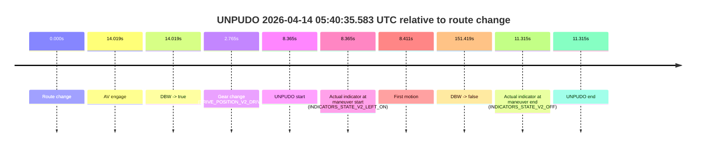
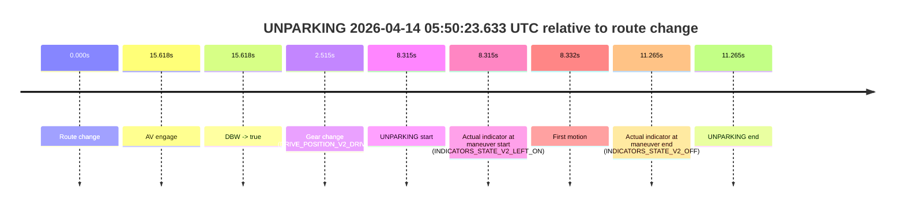

# Run Report: fme10003/2026-04-14--05-30-12--gen2-av-59f6c4c2-622d-4790-ba20-119178424869

| Field | Value |
|---|---|
| Run ID | `fme10003/2026-04-14--05-30-12--gen2-av-59f6c4c2-622d-4790-ba20-119178424869` |
| Date | `2026-04-14` |
| Model(s) | `lively-orange-horse` |
| Author | `guy.geva` |
| Event count | `4` |

## unpudo 2026-04-14 05:40:35.583 UTC

| Field | Value |
|---|---|
| Model | `lively-orange-horse` |
| Author | `guy.geva` |
| Run ID | `fme10003/2026-04-14--05-30-12--gen2-av-59f6c4c2-622d-4790-ba20-119178424869` |
| Date | `2026-04-14` |
| Time (UTC) | `05:40:35.583` |
| Event type | `unpudo` |
| Disengagement type | `failed_to_unpudo` |
| Route change | `found` |
| Console | [run](https://console.sso.wayve.ai/run/fme10003/2026-04-14--05-30-12--gen2-av-59f6c4c2-622d-4790-ba20-119178424869?id=&time-unixus=1776145235583299) |
| Foxglove | [segment](https://app.foxglove.dev/wayve-on-prem/p/prj_0dX18KZdVHg1fmmI/view?ds=foxglove-stream&ds.deviceName=fme10003&ds.start=2026-04-14T05%3A40%3A17.218289Z&ds.end=2026-04-14T05%3A43%3A08.636951Z&layoutId=lay_0e7VD4WIKDQGU73Y&time=2026-04-14T05%3A40%3A35.583299Z) |

### Event card: fail

- Fail: AV owns part of the segment, but the event still resolves as a model-performance failure under the AV-only scoring rule.

| Event | Time (UTC) | Delta from route change |
|---|---:|---:|
| Route change | 2026-04-14 05:40:27.218 | `0.000s` |
| AV engage | 2026-04-14 05:40:41.237 | `14.019s` |
| DBW -> true | 2026-04-14 05:40:41.237 | `14.019s` |
| Gear change (DRIVE_POSITION_V2_DRIVE) | 2026-04-14 05:40:29.983 | `2.765s` |
| UNPUDO start | 2026-04-14 05:40:35.583 | `8.365s` |
| Actual indicator at maneuver start (INDICATORS_STATE_V2_LEFT_ON) | 2026-04-14 05:40:35.583 | `8.365s` |
| First motion | 2026-04-14 05:40:35.629 | `8.411s` |
| DBW -> false | 2026-04-14 05:42:58.636 | `151.419s` |
| Actual indicator at maneuver end (INDICATORS_STATE_V2_OFF) | 2026-04-14 05:40:38.533 | `11.315s` |
| UNPUDO end | 2026-04-14 05:40:38.533 | `11.315s` |

| Metric | Value |
|---|---|
| Outcome | `fail` |
| Effective failure type | `failed_to_unpudo` |
| Route change status | `found` |
| DBW at event start | `false` |
| DBW at event end | `false` |
| Predicted gear at AV start | `DRIVE_POSITION_V2_DRIVE` |
| Actual gear at AV start | `DRIVE_POSITION_V2_DRIVE` |
| Predicted gear at event start | `DRIVE_POSITION_V2_DRIVE` |
| Actual gear at event start | `DRIVE_POSITION_V2_DRIVE` |
| Planned indicator direction | `INDICATORS_STATE_V2_LEFT_ON` |
| Controller indicator direction | `INDICATORS_STATE_V2_LEFT_ON` |
| Actual indicator direction | `INDICATORS_STATE_V2_LEFT_ON` |
| Actual indicator at maneuver end | `INDICATORS_STATE_V2_OFF` |
| Driver accel help in AV | `false` |
| Driver accel help timestamp | `n/a` |
| Max accel pedal pct in AV | `0.0%` |
| Max brake pedal pct in AV | `0.0%` |
| Max speed mps in AV | `0.000` |
| Route -> AV | `14.019s` |
| AV -> event start | `-5.654s` |
| AV -> first motion | `-5.608s` |
| AV duration before disengagement | `137.400s` |
| Trajectory waypoint count | `36` |
| Driving-plan step count | `11` |

The scored portion starts from the AV-owned window, not from the pre-AV setup. Route-change search in the stopped pre-event segment was `found`, with the baseline therefore set to route change. At the event anchor the model predicts `DRIVE_POSITION_V2_DRIVE` and the actual gear is `DRIVE_POSITION_V2_DRIVE`. The effective model outcome is `fail` because `failed_to_unpudo`.

### Resolution

| Field | Value |
|---|---|
| Final outcome | `fail` |
| Do we agree with this label? | `yes` |
| Source disengagement type | `failed_to_unpudo` |
| Resolved effective failure type | `failed_to_unpudo` |
| Confidence | `high` |

## unpudo 2026-04-14 05:46:44.783 UTC

| Field | Value |
|---|---|
| Model | `lively-orange-horse` |
| Author | `guy.geva` |
| Run ID | `fme10003/2026-04-14--05-30-12--gen2-av-59f6c4c2-622d-4790-ba20-119178424869` |
| Date | `2026-04-14` |
| Time (UTC) | `05:46:44.783` |
| Event type | `unpudo` |
| Disengagement type | `failed_to_unpudo` |
| Route change | `found` |
| Console | [run](https://console.sso.wayve.ai/run/fme10003/2026-04-14--05-30-12--gen2-av-59f6c4c2-622d-4790-ba20-119178424869?id=&time-unixus=1776145604783303) |
| Foxglove | [segment](https://app.foxglove.dev/wayve-on-prem/p/prj_0dX18KZdVHg1fmmI/view?ds=foxglove-stream&ds.deviceName=fme10003&ds.start=2026-04-14T05%3A45%3A56.068243Z&ds.end=2026-04-14T05%3A48%3A00.236433Z&layoutId=lay_0e7VD4WIKDQGU73Y&time=2026-04-14T05%3A46%3A44.783303Z) |

### Event card: fail

- Fail: AV owns part of the segment, but the event still resolves as a model-performance failure under the AV-only scoring rule.

| Event | Time (UTC) | Delta from route change |
|---|---:|---:|
| Route change | 2026-04-14 05:46:06.068 | `0.000s` |
| AV engage | 2026-04-14 05:47:09.335 | `63.268s` |
| DBW -> true | 2026-04-14 05:47:09.335 | `63.268s` |
| Gear change (DRIVE_POSITION_V2_REVERSE) | 2026-04-14 05:46:37.833 | `31.765s` |
| UNPUDO start | 2026-04-14 05:46:44.783 | `38.715s` |
| Actual indicator at maneuver start (INDICATORS_STATE_V2_OFF) | 2026-04-14 05:46:44.783 | `38.715s` |
| First motion | 2026-04-14 05:46:54.689 | `48.622s` |
| DBW -> false | 2026-04-14 05:47:50.236 | `104.168s` |
| Actual indicator at maneuver end (INDICATORS_STATE_V2_OFF) | 2026-04-14 05:46:57.833 | `51.765s` |
| UNPUDO end | 2026-04-14 05:46:57.833 | `51.765s` |

| Metric | Value |
|---|---|
| Outcome | `fail` |
| Effective failure type | `failed_to_unpudo` |
| Route change status | `found` |
| DBW at event start | `false` |
| DBW at event end | `false` |
| Predicted gear at AV start | `DRIVE_POSITION_V2_DRIVE` |
| Actual gear at AV start | `DRIVE_POSITION_V2_DRIVE` |
| Predicted gear at event start | `DRIVE_POSITION_V2_REVERSE` |
| Actual gear at event start | `DRIVE_POSITION_V2_REVERSE` |
| Planned indicator direction | `INDICATORS_STATE_V2_OFF` |
| Controller indicator direction | `INDICATORS_STATE_V2_OFF` |
| Actual indicator direction | `INDICATORS_STATE_V2_OFF` |
| Actual indicator at maneuver end | `INDICATORS_STATE_V2_OFF` |
| Driver accel help in AV | `false` |
| Driver accel help timestamp | `n/a` |
| Max accel pedal pct in AV | `0.0%` |
| Max brake pedal pct in AV | `0.0%` |
| Max speed mps in AV | `0.000` |
| Route -> AV | `63.268s` |
| AV -> event start | `-24.553s` |
| AV -> first motion | `-14.646s` |
| AV duration before disengagement | `40.901s` |
| Trajectory waypoint count | `36` |
| Driving-plan step count | `11` |

The scored portion starts from the AV-owned window, not from the pre-AV setup. Route-change search in the stopped pre-event segment was `found`, with the baseline therefore set to route change. At the event anchor the model predicts `DRIVE_POSITION_V2_REVERSE` and the actual gear is `DRIVE_POSITION_V2_REVERSE`. The effective model outcome is `fail` because `failed_to_unpudo`.

### Resolution

| Field | Value |
|---|---|
| Final outcome | `fail` |
| Do we agree with this label? | `yes` |
| Source disengagement type | `failed_to_unpudo` |
| Resolved effective failure type | `failed_to_unpudo` |
| Confidence | `high` |

## unpudo 2026-04-14 05:47:50.733 UTC

| Field | Value |
|---|---|
| Model | `lively-orange-horse` |
| Author | `guy.geva` |
| Run ID | `fme10003/2026-04-14--05-30-12--gen2-av-59f6c4c2-622d-4790-ba20-119178424869` |
| Date | `2026-04-14` |
| Time (UTC) | `05:47:50.733` |
| Event type | `unpudo` |
| Disengagement type | `failed_to_unpudo` |
| Route change | `found` |
| Console | [run](https://console.sso.wayve.ai/run/fme10003/2026-04-14--05-30-12--gen2-av-59f6c4c2-622d-4790-ba20-119178424869?id=&time-unixus=1776145670733317) |
| Foxglove | [segment](https://app.foxglove.dev/wayve-on-prem/p/prj_0dX18KZdVHg1fmmI/view?ds=foxglove-stream&ds.deviceName=fme10003&ds.start=2026-04-14T05%3A45%3A56.068243Z&ds.end=2026-04-14T05%3A50%3A33.116385Z&layoutId=lay_0e7VD4WIKDQGU73Y&time=2026-04-14T05%3A47%3A50.733317Z) |

### Event card: fail

- Fail: AV owns part of the segment, but the event still resolves as a model-performance failure under the AV-only scoring rule.

| Event | Time (UTC) | Delta from route change |
|---|---:|---:|
| Route change | 2026-04-14 05:46:06.068 | `0.000s` |
| AV engage | 2026-04-14 05:47:56.797 | `110.729s` |
| DBW -> true | 2026-04-14 05:47:56.797 | `110.729s` |
| Gear change (DRIVE_POSITION_V2_DRIVE) | 2026-04-14 05:47:43.883 | `97.815s` |
| UNPUDO start | 2026-04-14 05:47:50.733 | `104.665s` |
| Actual indicator at maneuver start (INDICATORS_STATE_V2_LEFT_ON) | 2026-04-14 05:47:50.733 | `104.665s` |
| First motion | 2026-04-14 05:47:50.749 | `104.682s` |
| DBW -> false | 2026-04-14 05:50:23.116 | `257.048s` |
| Actual indicator at maneuver end (INDICATORS_STATE_V2_OFF) | 2026-04-14 05:47:53.683 | `107.615s` |
| UNPUDO end | 2026-04-14 05:47:53.683 | `107.615s` |

| Metric | Value |
|---|---|
| Outcome | `fail` |
| Effective failure type | `failed_to_unpudo` |
| Route change status | `found` |
| DBW at event start | `false` |
| DBW at event end | `false` |
| Predicted gear at AV start | `DRIVE_POSITION_V2_DRIVE` |
| Actual gear at AV start | `DRIVE_POSITION_V2_DRIVE` |
| Predicted gear at event start | `DRIVE_POSITION_V2_DRIVE` |
| Actual gear at event start | `DRIVE_POSITION_V2_DRIVE` |
| Planned indicator direction | `INDICATORS_STATE_V2_LEFT_ON` |
| Controller indicator direction | `INDICATORS_STATE_V2_LEFT_ON` |
| Actual indicator direction | `INDICATORS_STATE_V2_LEFT_ON` |
| Actual indicator at maneuver end | `INDICATORS_STATE_V2_OFF` |
| Driver accel help in AV | `false` |
| Driver accel help timestamp | `n/a` |
| Max accel pedal pct in AV | `0.0%` |
| Max brake pedal pct in AV | `0.0%` |
| Max speed mps in AV | `0.000` |
| Route -> AV | `110.729s` |
| AV -> event start | `-6.064s` |
| AV -> first motion | `-6.047s` |
| AV duration before disengagement | `146.319s` |
| Trajectory waypoint count | `35` |
| Driving-plan step count | `11` |

The scored portion starts from the AV-owned window, not from the pre-AV setup. Route-change search in the stopped pre-event segment was `found`, with the baseline therefore set to route change. At the event anchor the model predicts `DRIVE_POSITION_V2_DRIVE` and the actual gear is `DRIVE_POSITION_V2_DRIVE`. The effective model outcome is `fail` because `failed_to_unpudo`.

### Resolution

| Field | Value |
|---|---|
| Final outcome | `fail` |
| Do we agree with this label? | `yes` |
| Source disengagement type | `failed_to_unpudo` |
| Resolved effective failure type | `failed_to_unpudo` |
| Confidence | `high` |

## unparking 2026-04-14 05:50:23.633 UTC

| Field | Value |
|---|---|
| Model | `lively-orange-horse` |
| Author | `guy.geva` |
| Run ID | `fme10003/2026-04-14--05-30-12--gen2-av-59f6c4c2-622d-4790-ba20-119178424869` |
| Date | `2026-04-14` |
| Time (UTC) | `05:50:23.633` |
| Event type | `unparking` |
| Disengagement type | `failed_to_unpudo` |
| Route change | `found` |
| Console | [run](https://console.sso.wayve.ai/run/fme10003/2026-04-14--05-30-12--gen2-av-59f6c4c2-622d-4790-ba20-119178424869?id=&time-unixus=1776145823633315) |
| Foxglove | [segment](https://app.foxglove.dev/wayve-on-prem/p/prj_0dX18KZdVHg1fmmI/view?ds=foxglove-stream&ds.deviceName=fme10003&ds.start=2026-04-14T05%3A50%3A05.318244Z&ds.end=2026-04-14T05%3A50%3A36.583298Z&layoutId=lay_0e7VD4WIKDQGU73Y&time=2026-04-14T05%3A50%3A23.633315Z) |

### Event card: fail

- Fail: AV owns part of the segment, but the event still resolves as a model-performance failure under the AV-only scoring rule.

| Event | Time (UTC) | Delta from route change |
|---|---:|---:|
| Route change | 2026-04-14 05:50:15.318 | `0.000s` |
| AV engage | 2026-04-14 05:50:30.936 | `15.618s` |
| DBW -> true | 2026-04-14 05:50:30.936 | `15.618s` |
| Gear change (DRIVE_POSITION_V2_DRIVE) | 2026-04-14 05:50:17.833 | `2.515s` |
| UNPARKING start | 2026-04-14 05:50:23.633 | `8.315s` |
| Actual indicator at maneuver start (INDICATORS_STATE_V2_LEFT_ON) | 2026-04-14 05:50:23.633 | `8.315s` |
| First motion | 2026-04-14 05:50:23.649 | `8.332s` |
| Actual indicator at maneuver end (INDICATORS_STATE_V2_OFF) | 2026-04-14 05:50:26.583 | `11.265s` |
| UNPARKING end | 2026-04-14 05:50:26.583 | `11.265s` |

| Metric | Value |
|---|---|
| Outcome | `fail` |
| Effective failure type | `failed_to_unpudo` |
| Route change status | `found` |
| DBW at event start | `false` |
| DBW at event end | `false` |
| Predicted gear at AV start | `DRIVE_POSITION_V2_DRIVE` |
| Actual gear at AV start | `DRIVE_POSITION_V2_DRIVE` |
| Predicted gear at event start | `DRIVE_POSITION_V2_DRIVE` |
| Actual gear at event start | `DRIVE_POSITION_V2_DRIVE` |
| Planned indicator direction | `INDICATORS_STATE_V2_LEFT_ON` |
| Controller indicator direction | `INDICATORS_STATE_V2_LEFT_ON` |
| Actual indicator direction | `INDICATORS_STATE_V2_LEFT_ON` |
| Actual indicator at maneuver end | `INDICATORS_STATE_V2_OFF` |
| Driver accel help in AV | `false` |
| Driver accel help timestamp | `n/a` |
| Max accel pedal pct in AV | `0.0%` |
| Max brake pedal pct in AV | `0.0%` |
| Max speed mps in AV | `0.000` |
| Route -> AV | `15.618s` |
| AV -> event start | `-7.303s` |
| AV -> first motion | `-7.286s` |
| AV duration before disengagement | `n/a` |
| Trajectory waypoint count | `35` |
| Driving-plan step count | `11` |

The scored portion starts from the AV-owned window, not from the pre-AV setup. Route-change search in the stopped pre-event segment was `found`, with the baseline therefore set to route change. At the event anchor the model predicts `DRIVE_POSITION_V2_DRIVE` and the actual gear is `DRIVE_POSITION_V2_DRIVE`. The effective model outcome is `fail` because `failed_to_unpudo`.

### Resolution

| Field | Value |
|---|---|
| Final outcome | `fail` |
| Do we agree with this label? | `yes` |
| Source disengagement type | `failed_to_unpudo` |
| Resolved effective failure type | `failed_to_unpudo` |
| Confidence | `high` |
