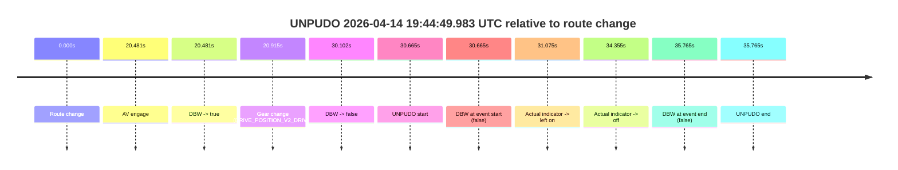
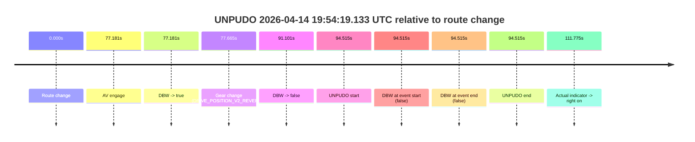
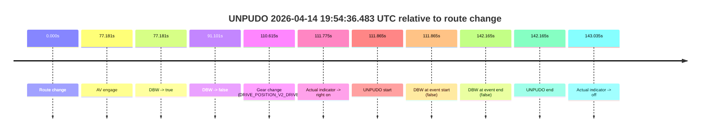
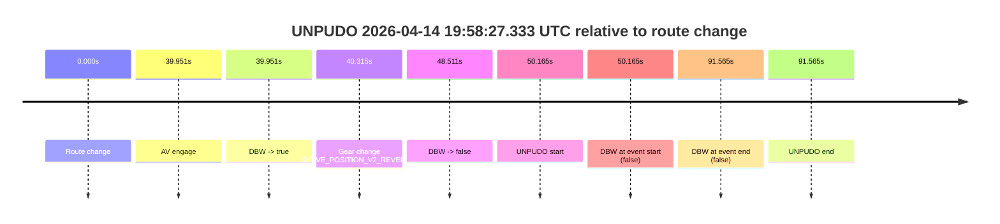

# Run Report: fme10003/2026-04-14--19-28-09--gen2-av-96f7e596-4cac-4da1-b3b0-a9c02a595444

| Field | Value |
|---|---|
| Run ID | `fme10003/2026-04-14--19-28-09--gen2-av-96f7e596-4cac-4da1-b3b0-a9c02a595444` |
| Date | `2026-04-14` |
| Model(s) | `armadillo-amethyst-squeaky` |
| Author | `guy.geva` |
| Event count | `4` |

## unpudo 2026-04-14 19:44:49.983 UTC

| Field | Value |
|---|---|
| Model | `armadillo-amethyst-squeaky` |
| Author | `guy.geva` |
| Run ID | `fme10003/2026-04-14--19-28-09--gen2-av-96f7e596-4cac-4da1-b3b0-a9c02a595444` |
| Date | `2026-04-14` |
| Time (UTC) | `19:44:49.983` |
| Event type | `unpudo` |
| Disengagement type | `failed_to_unpudo` |
| Route change | `found` |
| Console | [run](https://console.sso.wayve.ai/run/fme10003/2026-04-14--19-28-09--gen2-av-96f7e596-4cac-4da1-b3b0-a9c02a595444?id=&time-unixus=1776195889983291) |
| Foxglove | [segment](https://app.foxglove.dev/wayve-on-prem/p/prj_0dX18KZdVHg1fmmI/view?ds=foxglove-stream&ds.deviceName=fme10003&ds.start=2026-04-14T19%3A44%3A09.318260Z&ds.end=2026-04-14T19%3A45%3A05.083314Z&layoutId=lay_0e7VD4WIKDQGU73Y&time=2026-04-14T19%3A44%3A49.983291Z) |

### Event card: fail

- Fail: AV owns part of the segment, but the event still resolves as a model-performance failure under the AV-only scoring rule.

| Event | Time (UTC) | Delta from route change |
|---|---:|---:|
| Route change | 2026-04-14 19:44:19.318 | `0.000s` |
| AV engage | 2026-04-14 19:44:39.799 | `20.481s` |
| DBW -> true | 2026-04-14 19:44:39.799 | `20.481s` |
| Gear change (DRIVE_POSITION_V2_DRIVE) | 2026-04-14 19:44:40.233 | `20.915s` |
| DBW -> false | 2026-04-14 19:44:49.419 | `30.102s` |
| UNPUDO start | 2026-04-14 19:44:49.983 | `30.665s` |
| DBW at event start (false) | 2026-04-14 19:44:49.983 | `30.665s` |
| Actual indicator -> left on | 2026-04-14 19:44:50.393 | `31.075s` |
| Actual indicator -> off | 2026-04-14 19:44:53.673 | `34.355s` |
| DBW at event end (false) | 2026-04-14 19:44:55.083 | `35.765s` |
| UNPUDO end | 2026-04-14 19:44:55.083 | `35.765s` |

| Metric | Value |
|---|---|
| Outcome | `fail` |
| Effective failure type | `failed_to_unpudo` |
| Route change status | `found` |
| DBW at event start | `false` |
| DBW at event end | `false` |
| Predicted gear at AV start | `DRIVE_POSITION_V2_DRIVE` |
| Actual gear at AV start | `DRIVE_POSITION_V2_PARK` |
| Predicted gear at event start | `DRIVE_POSITION_V2_DRIVE` |
| Actual gear at event start | `DRIVE_POSITION_V2_DRIVE` |
| Planned indicator direction | `INDICATORS_STATE_V2_LEFT_ON` |
| Controller indicator direction | `INDICATORS_STATE_V2_LEFT_ON` |
| Actual indicator direction | `INDICATORS_STATE_V2_OFF` |
| Actual indicator at maneuver end | `INDICATORS_STATE_V2_OFF` |
| Driver accel help in AV | `false` |
| Driver accel help timestamp | `n/a` |
| Max accel pedal pct in AV | `0.0%` |
| Max brake pedal pct in AV | `8.0%` |
| Max speed mps in AV | `0.000` |
| Success timing baseline | `route change` |
| Route -> AV | `20.481s` |
| AV -> event start | `10.184s` |
| AV -> first motion | `n/a` |
| Success baseline -> event start | `30.665s` |
| Success baseline -> first motion | `n/a` |
| AV duration before disengagement | `9.621s` |
| Trajectory waypoint count | `37` |
| Driving-plan step count | `11` |

The scored portion starts from the AV-owned window, not from the pre-AV setup. Route-change search in the stopped pre-event segment was `found`, with the baseline therefore set to route change. At the event anchor the model predicts `DRIVE_POSITION_V2_DRIVE` and the actual gear is `DRIVE_POSITION_V2_DRIVE`. The effective model outcome is `fail` because `failed_to_unpudo.`

### Resolution

| Field | Value |
|---|---|
| Final outcome | `fail` |
| Do we agree with this label? | `yes` |
| Source disengagement type | `failed_to_unpudo` |
| Resolved effective failure type | `failed_to_unpudo` |
| Confidence | `high` |

## unpudo 2026-04-14 19:54:19.133 UTC

| Field | Value |
|---|---|
| Model | `armadillo-amethyst-squeaky` |
| Author | `guy.geva` |
| Run ID | `fme10003/2026-04-14--19-28-09--gen2-av-96f7e596-4cac-4da1-b3b0-a9c02a595444` |
| Date | `2026-04-14` |
| Time (UTC) | `19:54:19.133` |
| Event type | `unpudo` |
| Disengagement type | `failed_to_unpudo` |
| Route change | `found` |
| Console | [run](https://console.sso.wayve.ai/run/fme10003/2026-04-14--19-28-09--gen2-av-96f7e596-4cac-4da1-b3b0-a9c02a595444?id=&time-unixus=1776196459133289) |
| Foxglove | [segment](https://app.foxglove.dev/wayve-on-prem/p/prj_0dX18KZdVHg1fmmI/view?ds=foxglove-stream&ds.deviceName=fme10003&ds.start=2026-04-14T19%3A52%3A34.618267Z&ds.end=2026-04-14T19%3A54%3A29.133289Z&layoutId=lay_0e7VD4WIKDQGU73Y&time=2026-04-14T19%3A54%3A19.133289Z) |

### Event card: fail

- Fail: AV owns part of the segment, but the event still resolves as a model-performance failure under the AV-only scoring rule.

| Event | Time (UTC) | Delta from route change |
|---|---:|---:|
| Route change | 2026-04-14 19:52:44.618 | `0.000s` |
| AV engage | 2026-04-14 19:54:01.799 | `77.181s` |
| DBW -> true | 2026-04-14 19:54:01.799 | `77.181s` |
| Gear change (DRIVE_POSITION_V2_REVERSE) | 2026-04-14 19:54:02.283 | `77.665s` |
| DBW -> false | 2026-04-14 19:54:15.719 | `91.101s` |
| UNPUDO start | 2026-04-14 19:54:19.133 | `94.515s` |
| DBW at event start (false) | 2026-04-14 19:54:19.133 | `94.515s` |
| DBW at event end (false) | 2026-04-14 19:54:19.133 | `94.515s` |
| UNPUDO end | 2026-04-14 19:54:19.133 | `94.515s` |
| Actual indicator -> right on | 2026-04-14 19:54:36.393 | `111.775s` |

| Metric | Value |
|---|---|
| Outcome | `fail` |
| Effective failure type | `failed_to_unpudo` |
| Route change status | `found` |
| DBW at event start | `false` |
| DBW at event end | `false` |
| Predicted gear at AV start | `DRIVE_POSITION_V2_REVERSE` |
| Actual gear at AV start | `DRIVE_POSITION_V2_PARK` |
| Predicted gear at event start | `DRIVE_POSITION_V2_REVERSE` |
| Actual gear at event start | `DRIVE_POSITION_V2_REVERSE` |
| Planned indicator direction | `INDICATORS_STATE_V2_OFF` |
| Controller indicator direction | `INDICATORS_STATE_V2_OFF` |
| Actual indicator direction | `INDICATORS_STATE_V2_OFF` |
| Actual indicator at maneuver end | `INDICATORS_STATE_V2_OFF` |
| Driver accel help in AV | `false` |
| Driver accel help timestamp | `n/a` |
| Max accel pedal pct in AV | `0.0%` |
| Max brake pedal pct in AV | `8.0%` |
| Max speed mps in AV | `0.000` |
| Success timing baseline | `route change` |
| Route -> AV | `77.181s` |
| AV -> event start | `17.334s` |
| AV -> first motion | `n/a` |
| Success baseline -> event start | `94.515s` |
| Success baseline -> first motion | `n/a` |
| AV duration before disengagement | `13.920s` |
| Trajectory waypoint count | `36` |
| Driving-plan step count | `11` |

The scored portion starts from the AV-owned window, not from the pre-AV setup. Route-change search in the stopped pre-event segment was `found`, with the baseline therefore set to route change. At the event anchor the model predicts `DRIVE_POSITION_V2_REVERSE` and the actual gear is `DRIVE_POSITION_V2_REVERSE`. The effective model outcome is `fail` because `failed_to_unpudo.`

### Resolution

| Field | Value |
|---|---|
| Final outcome | `fail` |
| Do we agree with this label? | `yes` |
| Source disengagement type | `failed_to_unpudo` |
| Resolved effective failure type | `failed_to_unpudo` |
| Confidence | `high` |

## unpudo 2026-04-14 19:54:36.483 UTC

| Field | Value |
|---|---|
| Model | `armadillo-amethyst-squeaky` |
| Author | `guy.geva` |
| Run ID | `fme10003/2026-04-14--19-28-09--gen2-av-96f7e596-4cac-4da1-b3b0-a9c02a595444` |
| Date | `2026-04-14` |
| Time (UTC) | `19:54:36.483` |
| Event type | `unpudo` |
| Disengagement type | `none observed` |
| Route change | `found` |
| Console | [run](https://console.sso.wayve.ai/run/fme10003/2026-04-14--19-28-09--gen2-av-96f7e596-4cac-4da1-b3b0-a9c02a595444?id=&time-unixus=1776196476483296) |
| Foxglove | [segment](https://app.foxglove.dev/wayve-on-prem/p/prj_0dX18KZdVHg1fmmI/view?ds=foxglove-stream&ds.deviceName=fme10003&ds.start=2026-04-14T19%3A52%3A34.618267Z&ds.end=2026-04-14T19%3A55%3A16.783299Z&layoutId=lay_0e7VD4WIKDQGU73Y&time=2026-04-14T19%3A54%3A36.483296Z) |

### Event card: fail

- Fail: the credited unpudo does not stay AV-owned. The event window starts with DBW false, and the maneuver outcome lands outside a clean AV-owned segment.

| Event | Time (UTC) | Delta from route change |
|---|---:|---:|
| Route change | 2026-04-14 19:52:44.618 | `0.000s` |
| AV engage | 2026-04-14 19:54:01.799 | `77.181s` |
| DBW -> true | 2026-04-14 19:54:01.799 | `77.181s` |
| DBW -> false | 2026-04-14 19:54:15.719 | `91.101s` |
| Gear change (DRIVE_POSITION_V2_DRIVE) | 2026-04-14 19:54:35.233 | `110.615s` |
| Actual indicator -> right on | 2026-04-14 19:54:36.393 | `111.775s` |
| UNPUDO start | 2026-04-14 19:54:36.483 | `111.865s` |
| DBW at event start (false) | 2026-04-14 19:54:36.483 | `111.865s` |
| DBW at event end (false) | 2026-04-14 19:55:06.783 | `142.165s` |
| UNPUDO end | 2026-04-14 19:55:06.783 | `142.165s` |
| Actual indicator -> off | 2026-04-14 19:55:07.653 | `143.035s` |

| Metric | Value |
|---|---|
| Outcome | `fail` |
| Effective failure type | `not_av_owned` |
| Route change status | `found` |
| DBW at event start | `false` |
| DBW at event end | `false` |
| Predicted gear at AV start | `DRIVE_POSITION_V2_REVERSE` |
| Actual gear at AV start | `DRIVE_POSITION_V2_PARK` |
| Predicted gear at event start | `DRIVE_POSITION_V2_DRIVE` |
| Actual gear at event start | `DRIVE_POSITION_V2_DRIVE` |
| Planned indicator direction | `INDICATORS_STATE_V2_OFF` |
| Controller indicator direction | `INDICATORS_STATE_V2_OFF` |
| Actual indicator direction | `INDICATORS_STATE_V2_RIGHT_ON` |
| Actual indicator at maneuver end | `INDICATORS_STATE_V2_RIGHT_ON` |
| Driver accel help in AV | `false` |
| Driver accel help timestamp | `n/a` |
| Max accel pedal pct in AV | `0.0%` |
| Max brake pedal pct in AV | `8.0%` |
| Max speed mps in AV | `0.000` |
| Success timing baseline | `route change` |
| Route -> AV | `77.181s` |
| AV -> event start | `34.684s` |
| AV -> first motion | `n/a` |
| Success baseline -> event start | `111.865s` |
| Success baseline -> first motion | `n/a` |
| AV duration before disengagement | `13.920s` |
| Trajectory waypoint count | `37` |
| Driving-plan step count | `11` |

The scored portion starts from the AV-owned window, not from the pre-AV setup. Route-change search in the stopped pre-event segment was `found`, with the baseline therefore set to route change. At the event anchor the model predicts `DRIVE_POSITION_V2_DRIVE` and the actual gear is `DRIVE_POSITION_V2_DRIVE`. The effective model outcome is `fail` because `not_av_owned.`

### Resolution

| Field | Value |
|---|---|
| Final outcome | `fail` |
| Do we agree with this label? | `yes` |
| Source disengagement type | `none observed` |
| Resolved effective failure type | `not_av_owned` |
| Confidence | `high` |

## unpudo 2026-04-14 19:58:27.333 UTC

| Field | Value |
|---|---|
| Model | `armadillo-amethyst-squeaky` |
| Author | `guy.geva` |
| Run ID | `fme10003/2026-04-14--19-28-09--gen2-av-96f7e596-4cac-4da1-b3b0-a9c02a595444` |
| Date | `2026-04-14` |
| Time (UTC) | `19:58:27.333` |
| Event type | `unpudo` |
| Disengagement type | `parking` |
| Route change | `found` |
| Console | [run](https://console.sso.wayve.ai/run/fme10003/2026-04-14--19-28-09--gen2-av-96f7e596-4cac-4da1-b3b0-a9c02a595444?id=&time-unixus=1776196707333317) |
| Foxglove | [segment](https://app.foxglove.dev/wayve-on-prem/p/prj_0dX18KZdVHg1fmmI/view?ds=foxglove-stream&ds.deviceName=fme10003&ds.start=2026-04-14T19%3A57%3A27.168315Z&ds.end=2026-04-14T19%3A59%3A18.733314Z&layoutId=lay_0e7VD4WIKDQGU73Y&time=2026-04-14T19%3A58%3A27.333317Z) |

### Event card: fail

- Fail: AV owns part of the segment, but the event still resolves as a model-performance failure under the AV-only scoring rule.

| Event | Time (UTC) | Delta from route change |
|---|---:|---:|
| Route change | 2026-04-14 19:57:37.168 | `0.000s` |
| AV engage | 2026-04-14 19:58:17.119 | `39.951s` |
| DBW -> true | 2026-04-14 19:58:17.119 | `39.951s` |
| Gear change (DRIVE_POSITION_V2_REVERSE) | 2026-04-14 19:58:17.483 | `40.315s` |
| DBW -> false | 2026-04-14 19:58:25.679 | `48.511s` |
| UNPUDO start | 2026-04-14 19:58:27.333 | `50.165s` |
| DBW at event start (false) | 2026-04-14 19:58:27.333 | `50.165s` |
| DBW at event end (false) | 2026-04-14 19:59:08.733 | `91.565s` |
| UNPUDO end | 2026-04-14 19:59:08.733 | `91.565s` |

| Metric | Value |
|---|---|
| Outcome | `fail` |
| Effective failure type | `parking` |
| Route change status | `found` |
| DBW at event start | `false` |
| DBW at event end | `false` |
| Predicted gear at AV start | `DRIVE_POSITION_V2_REVERSE` |
| Actual gear at AV start | `DRIVE_POSITION_V2_PARK` |
| Predicted gear at event start | `DRIVE_POSITION_V2_REVERSE` |
| Actual gear at event start | `DRIVE_POSITION_V2_REVERSE` |
| Planned indicator direction | `INDICATORS_STATE_V2_OFF` |
| Controller indicator direction | `INDICATORS_STATE_V2_OFF` |
| Actual indicator direction | `INDICATORS_STATE_V2_OFF` |
| Actual indicator at maneuver end | `INDICATORS_STATE_V2_OFF` |
| Driver accel help in AV | `false` |
| Driver accel help timestamp | `n/a` |
| Max accel pedal pct in AV | `0.0%` |
| Max brake pedal pct in AV | `11.1%` |
| Max speed mps in AV | `0.000` |
| Success timing baseline | `route change` |
| Route -> AV | `39.951s` |
| AV -> event start | `10.214s` |
| AV -> first motion | `n/a` |
| Success baseline -> event start | `50.165s` |
| Success baseline -> first motion | `n/a` |
| AV duration before disengagement | `8.560s` |
| Trajectory waypoint count | `36` |
| Driving-plan step count | `11` |

The scored portion starts from the AV-owned window, not from the pre-AV setup. Route-change search in the stopped pre-event segment was `found`, with the baseline therefore set to route change. At the event anchor the model predicts `DRIVE_POSITION_V2_REVERSE` and the actual gear is `DRIVE_POSITION_V2_REVERSE`. The effective model outcome is `fail` because `parking.`

### Resolution

| Field | Value |
|---|---|
| Final outcome | `fail` |
| Do we agree with this label? | `yes` |
| Source disengagement type | `parking` |
| Resolved effective failure type | `parking` |
| Confidence | `high` |
